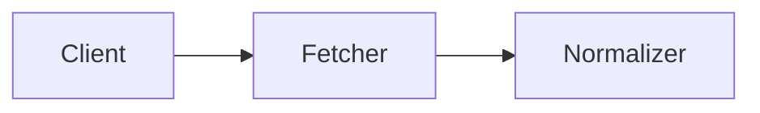

# RDAPify Documentation Skill

## Purpose
Guide documentation creation for RDAPify following established structure and standards.

## Documentation Principles

1. **Code Examples First**: Every concept must have working code example
2. **Security Warnings**: Highlight security implications
3. **Minimal Explanations**: Be concise, avoid fluff
4. **Real-World Focus**: Use actual use cases, not toy examples

## Documentation Structure

### API Reference Format
```markdown
# Method Name

Brief one-line description.

## Syntax
\`\`\`typescript
function signature
\`\`\`

## Parameters
- `param1` (type): Description

## Returns
Return type and description

## Throws
- `ErrorType`: When this happens

## Example
\`\`\`typescript
// Working example
\`\`\`

## Security Considerations
Any security implications
```

### Guide Format
```markdown
# Guide Title

What you'll learn in one sentence.

## Prerequisites
- Required knowledge
- Required setup

## Implementation
Step-by-step with code

## Common Pitfalls
What to avoid

## Next Steps
Where to go from here
```

## Code Example Rules

### Good Example
```typescript
import { createRDAPClient } from 'rdapify';

const client = createRDAPClient();
const result = await client.queryDomain('example.com');
console.log(result.handle);
```

### Bad Example (Don't Do This)
```typescript
// This is a function that queries domains
// You can use it to get information about domains
// It returns a promise that resolves to domain data
const client = createRDAPClient(); // Create a client
const result = await client.queryDomain('example.com'); // Query the domain
// Now you have the result!
```

## Documentation Types

### 1. Getting Started
- Installation steps only
- First query example
- Link to detailed guides

### 2. Core Concepts
- Explain RDAP protocol
- Architecture overview
- Key features

### 3. API Reference
- Complete type definitions
- All methods documented
- Error types listed

### 4. Guides
- How-to for specific tasks
- Best practices
- Performance optimization

### 5. Security
- Threat model
- Security features
- Compliance guidance

## Markdown Standards

- Use code fences with language: \`\`\`typescript
- Use relative links: `[text](../path/file.md)`
- No HTML unless necessary
- Headers: # for title, ## for sections, ### for subsections
- Lists: Use `-` for unordered, `1.` for ordered

## Diagrams

Use Mermaid format only:


## What NOT to Include

- ❌ Changelog in documentation (use CHANGELOG.md)
- ❌ Installation in every guide (link to installation guide)
- ❌ Repeated explanations
- ❌ Marketing language
- ❌ Unimplemented features

## Verification

Before completing documentation:
- [ ] Code examples tested and working
- [ ] Links verified
- [ ] No typos in code
- [ ] Security warnings included where needed
- [ ] Follows project structure
