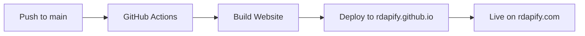

# GitHub Organization Setup Guide

## 📦 Repository Structure

### Main Repository: `rdapify/RDAPify`
**Purpose**: Source code, documentation, and development

**Contains**:
- Library source code (`src/`)
- Documentation (`docs/`)
- Website source (`website/`)
- Examples and tests
- CI/CD workflows

**URL**: https://github.com/rdapify/RDAPify

---

### Website Repository: `rdapify/rdapify.github.io`
**Purpose**: Deployed website (built files only)

**Contains**:
- Built static files from Docusaurus
- Automatically updated by GitHub Actions
- Serves https://rdapify.com

**URL**: https://github.com/rdapify/rdapify.github.io

---

## 🔧 Setup Instructions

### Step 1: Create Personal Access Token

1. Go to GitHub Settings → Developer settings → Personal access tokens → Tokens (classic)
2. Click "Generate new token (classic)"
3. Name: `RDAPIFY_DEPLOY_TOKEN`
4. Scopes:
   - ✅ `repo` (Full control of private repositories)
   - ✅ `workflow` (Update GitHub Action workflows)
5. Generate token and **copy it**

### Step 2: Add Token to Main Repository

1. Go to `rdapify/RDAPify` → Settings → Secrets and variables → Actions
2. Click "New repository secret"
3. Name: `DEPLOY_TOKEN`
4. Value: Paste the token from Step 1
5. Click "Add secret"

### Step 3: Configure rdapify.github.io Repository

1. Go to `rdapify/rdapify.github.io` → Settings → Pages
2. Source: **Deploy from a branch**
3. Branch: **main** / **root**
4. Click "Save"

### Step 4: Configure Custom Domain

1. In `rdapify/rdapify.github.io` → Settings → Pages
2. Custom domain: `rdapify.com`
3. ✅ Enforce HTTPS
4. Click "Save"

### Step 5: Configure DNS

Add these DNS records to your domain registrar:

```
Type: A
Name: @
Value: 185.199.108.153
TTL: 3600

Type: A
Name: @
Value: 185.199.109.153
TTL: 3600

Type: A
Name: @
Value: 185.199.110.153
TTL: 3600

Type: A
Name: @
Value: 185.199.111.153
TTL: 3600

Type: CNAME
Name: www
Value: rdapify.github.io
TTL: 3600
```

---

## 🚀 Deployment Workflow

### Automatic Deployment



### Manual Deployment

```bash
# From rdapify/RDAPify repository
cd website
npm install
npm run build

# Deploy manually (requires DEPLOY_TOKEN)
GIT_USER=<your-github-username> npm run deploy
```

---

## 📁 Repository Permissions

### rdapify/RDAPify
- **Visibility**: Public
- **Branch Protection**: 
  - Require pull request reviews
  - Require status checks to pass
  - Require branches to be up to date

### rdapify/rdapify.github.io
- **Visibility**: Public
- **Branch Protection**: None (auto-updated by Actions)
- **GitHub Pages**: Enabled on `main` branch

---

## 🔄 Workflow Details

### When Deployment Triggers

Deployment runs when:
1. Push to `main` branch
2. Changes in `website/` or `docs/` directories
3. Manual workflow dispatch

### What Happens

1. **Checkout**: Clone `rdapify/RDAPify`
2. **Setup**: Install Node.js 18
3. **Install**: Run `npm ci` in `website/`
4. **Build**: Run `npm run build`
5. **Deploy**: Push to `rdapify/rdapify.github.io` main branch
6. **Live**: GitHub Pages serves from `rdapify.github.io`

---

## 🐛 Troubleshooting

### Deployment Fails

**Error**: `Permission denied`
- **Solution**: Check `DEPLOY_TOKEN` is set correctly in repository secrets

**Error**: `CNAME already taken`
- **Solution**: Remove custom domain from `rdapify.github.io` settings, then re-add

**Error**: `Build failed`
- **Solution**: Test locally with `npm run build` in `website/`

### Website Not Updating

1. Check GitHub Actions: https://github.com/rdapify/RDAPify/actions
2. Verify deployment succeeded
3. Check `rdapify.github.io` has new commit
4. Clear browser cache (Ctrl+Shift+R)
5. Wait 5-10 minutes for DNS propagation

### Custom Domain Issues

1. Verify DNS records are correct
2. Check CNAME file exists in `rdapify.github.io`
3. Ensure HTTPS is enforced in Pages settings
4. Wait up to 24 hours for DNS propagation

---

## 📊 Monitoring

### Check Deployment Status

```bash
# View recent deployments
gh run list --repo rdapify/RDAPify --workflow=deploy-website.yml

# View specific run
gh run view <run-id> --repo rdapify/RDAPify
```

### Website Analytics

- **GitHub Traffic**: https://github.com/rdapify/rdapify.github.io/graphs/traffic
- **Google Analytics**: Configure in `website/docusaurus.config.js`

---

## 🔒 Security Best Practices

### Token Security

- ✅ Use Personal Access Token (classic) with minimal scopes
- ✅ Store token in GitHub Secrets (never commit)
- ✅ Rotate token every 90 days
- ✅ Use different tokens for different purposes

### Repository Security

- ✅ Enable Dependabot alerts
- ✅ Enable secret scanning
- ✅ Require 2FA for organization members
- ✅ Use branch protection rules

---

## 📚 Additional Resources

- [GitHub Pages Documentation](https://docs.github.com/en/pages)
- [GitHub Actions Documentation](https://docs.github.com/en/actions)
- [Docusaurus Deployment Guide](https://docusaurus.io/docs/deployment)
- [Custom Domain Setup](https://docs.github.com/en/pages/configuring-a-custom-domain-for-your-github-pages-site)

---

## 🆘 Support

- **Issues**: https://github.com/rdapify/RDAPify/issues
- **Discussions**: https://github.com/rdapify/RDAPify/discussions
- **Email**: support@rdapify.com

---

## ✅ Checklist

Before going live:

- [ ] Personal Access Token created
- [ ] `DEPLOY_TOKEN` added to rdapify/RDAPify secrets
- [ ] rdapify.github.io Pages enabled
- [ ] Custom domain configured
- [ ] DNS records added
- [ ] Test deployment successful
- [ ] HTTPS enforced
- [ ] Website accessible at https://rdapify.com
