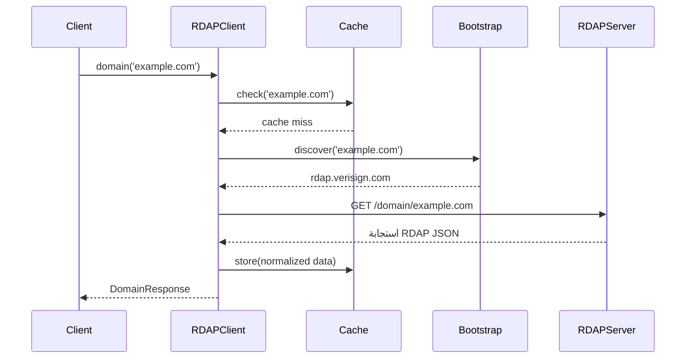

# المساهمة في RDAPify

نشكرك على اهتمامك بالمساهمة في RDAPify! نرحب بالمساهمات من الجميع، سواء كنت تصلح الأخطاء أو تضيف ميزات أو تحسّن التوثيق أو تساعد في دعم المجتمع.

يوضح هذا الدليل عملية المساهمة والمعايير والتوقعات لمساعدتك على تقديم مساهمات قيّمة بكفاءة.

## طرق المساهمة

### مساهمات في الكود

- إصلاح الأخطاء المبلغ عنها في Issues
- تطبيق الميزات الجديدة من خريطة الطريق
- تحسين الأداء واستخدام الموارد
- إضافة دعم لبيئات جديدة (Bun و Deno و Cloudflare Workers وغيرها)
- تحسين حماية الأمان
- تحسين ربط الأنظمة الأصلية (Node.js و Python و Go)

### مساهمات في التوثيق

- تحسين توثيق API
- كتابة أدلة تعليمية
- إنشاء أمثلة للحالات الواقعية
- ترجمة التوثيق إلى لغات أخرى
- تحديث الرسوم البيانية والتصورات
- توثيق قرارات العمارة

### مساهمات في المجتمع

- الإجابة على الأسئلة في النقاشات
- مراجعة طلبات السحب (للمساهمين ذوي الخبرة)
- الإبلاغ عن الأخطاء مع خطوات إعادة الإنتاج التفصيلية
- اقتراح تحسينات على المشروع
- مشاركة حالات الاستخدام والقصص الناجحة
- المساعدة في الاختبار عبر بيئات مختلفة

## سير العمل

### 1. البحث عن Issue أو إنشاء واحد

- تحقق من [المشاكل الموجودة](https://github.com/rdapify/rdapify/issues)
- للأخطاء: أرفق خطوات إعادة الإنتاج التفصيلية ومعلومات البيئة (إصدار Node.js والنظام)
- للميزات: اشرح حالة الاستخدام وقيمتها
- ضع العلامات المناسبة (`bug` و `feature` و `documentation` إلخ)

### 2. احصل على تعليقات

- انتظر تعليق المشرفين قبل بذل جهد كبير
- للتغييرات الرئيسية: أنشئ [نقاشًا](https://github.com/rdapify/rdapify/discussions) أولاً
- اتبع عملية RFC (Request for Comments) للتغييرات المعمارية
- اعتبر الآثار الأمنية للتغييرات الحساسة

### 3. شارك وطور

```bash
# شارك المستودع
# استنسخ نسختك الشخصية
git clone https://github.com/<اسم-المستخدم>/rdapify.git
cd rdapify

# أنشئ فرعًا باسم وصفي
git checkout -b fix/timeout-issue
# أو
git checkout -b feature/streaming-api

# ثبّت المتطلبات
npm install

# جهز الـ pre-commit hooks
npm run prepare

# قم بالتغييرات
```

### 4. اختبر بشكل شامل

```bash
# شغّل جميع الاختبارات مع تغطية الأكواد
npm test

# شغّل اختبارات الأمان تحديدًا
npm run test:security

# شغّل اختبارات التكامل
npm run test:integration

# تحقق من نمط الكود والصيغة
npm run lint
npm run format:check

# تحقق من سلامة الأنواع
npm run typecheck

# تحقق شامل
npm run verify
```

### 5. قدّم طلب السحب

- استهدف الفرع الرئيسي `main`
- أرفق وصفًا واضحًا يربط بـ Issues ذات الصلة
- حدّث التوثيق إذا لزم الأمر
- أضف اختبارات للوظائف الجديدة (استهدف ≥80% تغطية)
- اتبع اتفاقيات رسائل الالتزام
- لا تفرض السحب بعد بدء المراجعة

## إعداد بيئة التطوير

### المتطلبات الأساسية

- **Node.js 20+** (تحقق من `.nvmrc` للإصدار الدقيق)
- **npm 10+**
- **Git 2.30+**
- اختياري: Rust 1.75+ (لتطوير ربط الأنظمة الأصلية)

### الإعداد الأولي

```bash
# استنسخ المستودع
git clone https://github.com/rdapify/rdapify.git
cd rdapify

# ثبّت المتطلبات
npm install

# جهز Husky pre-commit hooks
npm run prepare

# تحقق من الإعداد مع جميع الاختبارات
npm run verify
```

### سير عمل التطوير

```bash
# وضع المراقبة لترجمة TypeScript
npm run dev

# شغّل الاختبارات في وضع المراقبة
npm run test:watch

# صيغ الكود تلقائيًا
npm run lint:fix
npm run format

# ابنِ نسخة الإنتاج
npm run build
```

## معايير الكود

### إرشادات TypeScript

- استخدم TypeScript بصرامة (`strict: true` في tsconfig.json)
- جميع الأعلام مفعّلة: `noImplicitAny` و `noImplicitThis` و `strictNullChecks` وغيرها
- استهدف ES2020 للميزات والتوافقية
- فضّل البرمجة الوظيفية على الفئات حيث يكون مناسبًا
- تجنب نوع `any` (استخدم `unknown` + التحقق بدلاً منه)
- استخدم `readonly` للهياكل البيانات غير القابلة للتغيير
- فضّل `const enum` على enums العادية للأداء
- استخدم اختصارات المسارات للاستيرادات: `@/*` → `src/*`

### التعامل مع الأخطاء

```typescript
// ✅ جيد: معالجة موحدة للأخطاء
import { RDAPError } from '@/shared/errors';

throw new RDAPError('RDAP_TIMEOUT', 'انتهت مهلة الطلب بعد 10 ثوان', {
  query: domain,
  timeout: options.timeout,
  code: 'ETIMEDOUT'
});

// ❌ تجنب: أخطاء عامة
throw new Error('انتهت المهلة');
```

### أنماط Async/Await

```typescript
// ✅ جيد: معالجة صحيحة للأخطاء غير المتزامنة
async function fetchDomain(query: string): Promise<DomainResponse> {
  try {
    const result = await cache.get(query);
    if (result) return result;

    const response = await fetcher.fetch(url, {
      signal: AbortSignal.timeout(10000) // حماية انتهاء المهلة
    });
    return await normalizer.normalize(response);
  } catch (error) {
    if (error instanceof TimeoutError) {
      throw new RDAPError('RDAP_TIMEOUT', 'تجاوز الطلب المهلة', { cause: error });
    }
    throw error;
  }
}

// ❌ تجنب: Promises بدون انتظار
client.domain(query); // لم يتم انتظار Promise

// ❌ تجنب: تجاهل الأخطاء
Promise.resolve().catch(() => {});
```

### اعتبارات الأداء

- تجنب العمليات المحجوبة (استخدم async/await)
- قلّل تخصيصات الذاكرة في المسارات الساخنة
- استخدم Streams لمعالجة البيانات الكبيرة
- طبّق التنظيف الصحيح (AbortControllers و timeouts)
- قيّس الأداء قبل وبعد التغييرات باستخدام مجموعات الاختبار الخاصة بنا
- راقب تأثير حجم المجموعة مع `npm run verify:api`

### متطلبات الأمان

يجب على جميع تغييرات الكود:

- التحقق من جميع المدخلات من مصادر خارجية
- منع ثغرات SSRF (استخدم فئة `Fetcher` مع `SSRFProtection`)
- تطهير البيانات قبل العرض
- اتباع مبدأ الامتياز الأدنى
- تضمين اختبارات الأمان للوظائف الجديدة
- عدم تسجيل البيانات الحساسة (مفاتيح API والتوكنات والبيانات الشخصية)

```typescript
// ✅ جيد: معالجة آمنة للروابط
import { Fetcher, SSRFProtection } from '@/infrastructure';

const ssrf = new SSRFProtection();
const fetcher = new Fetcher({ security: ssrf });

const url = new URL('https://rdap.arin.net/registry/ip/' + ip);
ssrf.validateURL(url); // التحقق من نطاقات IP الخاصة
const response = await fetcher.fetch(url);

// ✅ جيد: التحقق من المدخلات
function validateDomain(domain: string): void {
  if (!domain || typeof domain !== 'string') {
    throw new RDAPError('INVALID_INPUT', 'يجب أن تكون النطاق سلسلة غير فارغة');
  }
  if (domain.length > 253) {
    throw new RDAPError('INVALID_INPUT', 'يتجاوز النطاق 253 حرفًا');
  }
}

// ❌ تجنب: دمج السلاسل (عرضة للحقن)
const url = `https://rdap.arin.net/registry/ip/${ip}`;

// ❌ تجنب: عدم التحقق من المدخلات
async function lookup(input: unknown): Promise<void> {
  await fetcher.fetch(input as string); // تحويل الأنواع بدون التحقق
}
```

## متطلبات الاختبار

### تغطية الاختبار

- يجب أن تحتوي الميزات الجديدة على تغطية ≥80% (الفروع والوظائف والأسطر والعبارات)
- يجب أن تتضمن إصلاحات الأخطاء اختبارات انحدار
- يجب أن يكون لمسارات الأمان الحرجة 100% تغطية
- يتم فحص التغطية في CI؛ سيُطلب من PRs ذات انخفاض التغطية إضافة اختبارات

### أنواع الاختبارات

```bash
# اختبارات الوحدة (Jest، الأسرع، معظم الاختبارات هنا)
npm run test:unit

# اختبارات التكامل (اختبار عبر الوحدات)
npm run test:integration

# اختبارات الأمان (SSRF والحقن والتحقق من المدخلات)
npm run test:security

# جميع الاختبارات مع تقرير التغطية
npm test

# وضع المراقبة للتطوير
npm run test:watch
```

### تنظيم ملفات الاختبار

```
src/
├── application/
│   └── rdap-client.test.ts          # ملف الاختبار في نفس المجلد
├── core/
│   ├── ports/
│   │   └── cache.port.test.ts
│   └── domain-models/
└── infrastructure/
    ├── __tests__/                    # بديل: الاختبارات في مجلد فرعي
    │   └── fetcher.integration.ts
    └── fetcher.ts
```

### هيكل الاختبار

```typescript
import { describe, it, expect, beforeEach, afterEach } from '@jest/globals';
import { RDAPClient } from '@/application';

describe('RDAPClient - بحث النطاق', () => {
  let client: RDAPClient;

  beforeEach(() => {
    client = new RDAPClient({
      timeout: 5000,
      cache: { ttl: 3600 }
    });
  });

  afterEach(() => {
    client.destroy(); // تنظيف الموارد
  });

  it('يجب جلب معلومات النطاق', async () => {
    const result = await client.domain('example.com');

    expect(result).toHaveProperty('handle');
    expect(result).toHaveProperty('registrar');
    expect(result.domain).toBe('example.com');
  });

  it('يجب رفع خطأ RDAPError للنطاق غير الصحيح', async () => {
    await expect(client.domain('invalid..domain')).rejects.toThrow('INVALID_INPUT');
  });

  it('يجب إرجاع النتيجة المخزنة مؤقتًا في الطلب الثاني', async () => {
    const first = await client.domain('example.com');
    const second = await client.domain('example.com');

    expect(first).toEqual(second);
    // تحقق من أنه تم إرسال طلب شبكة واحد فقط
  });
});
```

### متجهات الاختبار والمحاكاة

استخدم متجهات الاختبار الموحدة للاتساق:

```typescript
import { domainTestVectors } from '@/shared/test-vectors';

describe('معايرة النطاق', () => {
  domainTestVectors.forEach((vector) => {
    it(`يجب التعامل مع ${vector.description}`, async () => {
      const result = await normalizer.normalize(vector.rawResponse);
      expect(result).toEqual(vector.expectedNormalized);
    });
  });
});
```

محاكِ المتطلبات الخارجية:

```typescript
jest.mock('@/infrastructure/fetcher');
const mockFetcher = Fetcher as jest.Mocked<typeof Fetcher>;

mockFetcher.fetch.mockResolvedValue({
  status: 200,
  headers: { 'content-type': 'application/json' },
  body: JSON.stringify({ handle: 'EXAMPLE.COM' })
});
```

## معايير التوثيق

### توثيق API

يجب أن تتضمن جميع واجهات البرمجة العامة تعليقات JSDoc:

```typescript
/**
 * البحث عن معلومات تسجيل النطاق باستخدام بروتوكول RDAP.
 *
 * يستعلم عن سجل bootstrap IANA للعثور على خادم RDAP الموثوق للنطاق المعطى،
 * ثم يسترجع بيانات التسجيل التفصيلية.
 *
 * @param query - اسم النطاق المراد البحث عنه (مثل 'example.com')
 * @param options - معاملات تكوين اختيارية
 * @param options.timeout - انتهاء مهلة الطلب بالميلي ثانية (افتراضي: 10000)
 * @param options.followRedirects - متابعة إحالات RDAP (افتراضي: صحيح)
 * @returns Promise تحل إلى معلومات النطاق المعايرة مع تطبيق تسريب بيانات شخصية GDPR/CCPA
 * @throws RDAPError إذا فشل البحث أو انتهت المهلة
 *
 * @example
 * ```typescript
 * const client = new RDAPClient();
 * const result = await client.domain('example.com');
 *
 * console.log(result.registrar?.name);        // Verisign Global Registry Services
 * console.log(result.expirationDate);         // 2025-03-21
 * console.log(result.registrar?.contactEmail); // مسرح من أجل الخصوصية
 * ```
 *
 * @see {@link https://tools.ietf.org/html/rfc7480|RFC 7480 - بروتوكول RDAP}
 * @see {@link https://rdapify.com/docs/core-concepts/normalization|دليل المعايرة}
 */
async domain(query: string, options?: DomainOptions): Promise<DomainResponse> {
  // التطبيق
}
```

### توثيق Markdown

استخدم عناوين واضحة وأمثلة كود وأدوات مساعدة بصرية:

```markdown
## استراتيجية التخزين المؤقت

يستخدم RDAPify نهج التخزين المؤقت بثلاث طبقات:

1. **ذاكرة التخزين المؤقت L1**: ذاكرة LRU في الذاكرة (افتراضي TTL 1 ساعة)
2. **ذاكرة التخزين المؤقت L2**: Redis (عبر محول `RedisCache`)
3. **ذاكرة التخزين المؤقت L3**: ذاكرة تخزين مؤقت CDN على الحافة (مستقبلاً)

### مثال التكوين

\`\`\`typescript
const client = new RDAPClient({
  cache: {
    ttl: 3600,        // ساعة واحدة
    maxSize: 1000     // 1000 إدخال
  }
});
\`\`\`
```

### رسوم معمارية Mermaid

استخدم Mermaid لرسوم البيانات المسلسلة والعمارة:

````markdown
## تدفق الاستعلام


````

## اتفاقية رسائل الالتزام

نستخدم [Conventional Commits](https://www.conventionalcommits.org/):

```
<النوع>[نطاق اختياري]: <الوصف>

[نص اختياري]

[تذييلات اختيارية]
```

### الأنواع

- `feat` - ميزة جديدة
- `fix` - إصلاح خطأ
- `docs` - تغييرات التوثيق
- `style` - نمط الكود فقط (لا تغييرات منطقية)
- `refactor` - تحسين الكود بدون تغيير السلوك
- `perf` - تحسين الأداء
- `test` - إضافة أو تحسين الاختبار
- `chore` - مهمة الصيانة (المتطلبات والتكوين)
- `security` - إصلاح أمان أو تحسين
- `ci` - تغييرات تكوين CI/CD

### أمثلة

```
feat(core): إضافة streaming API للاستعلامات الجماعية

تطبيق واجهة streaming جديدة لمعالجة فعالة للاستعلامات الجماعية الكبيرة.
يقلل استخدام الذاكرة بنسبة 60% للاستعلامات 10000+.

Closes #142
```

```
fix(security): منع SSRF عبر إعادة ربط DNS

أضيفت حماية TOCTOU (Time-of-check-time-of-use) بإعادة التحقق من عناوين IP
مباشرة قبل اتصال المقبس. يشمل مجموعة اختبار شاملة لحالات الحدود.

Reviewed by: @security-team
Security-Advisory: GHSA-xxxx-xxxx-xxxx
```

```
docs(api): توضيح سلوك تسريح البيانات الشخصية في نتائج النطاق

تم تحديث الأمثلة لإظهار معلومات الاتصال المسروقة في الاستجابات.
توثيق مستويات الخصوصية وخيارات التكوين.
```

```
perf(cache): تحسين خوارزمية eviction LRU

استبدلت قائمة انتظار بسيطة بـ heap-based LRU لـ O(1) eviction.
توضح المعايير 40% تحسن لإدخالات التخزين المؤقت 100000+.
```

## عملية المراجعة

### جدول المراجعة

- **إصلاحات الأخطاء**: 24-48 ساعة
- **ميزات صغيرة**: 48-72 ساعة
- **تغييرات كبرى**: 1-2 أسبوع (مع عملية RFC)
- **تغييرات الأمان**: مراجعة الأولويات خلال 24 ساعة

### قائمة اختيار PR (للمساهمين)

قبل تقديم PR، تأكد من:

- [ ] الاختبارات تمر: `npm test`
- [ ] التغطية محفوظة: `npm run test:coverage`
- [ ] الكود مصاغ: `npm run format`
- [ ] التحقق من الأخطاء يمر: `npm run lint`
- [ ] الأنواع تفحص: `npm run typecheck`
- [ ] التوثيق محدّث (إذا لزم)
- [ ] لا توجد تغييرات محطمة (أو موثقة في تذييل BREAKING CHANGES)
- [ ] رسائل الالتزام تتبع الاتفاقيات

### متطلبات الدمج

يجب استيفاء جميع ما يلي:

- ✅ تمر جميع فحوصات CI (الاختبارات والتحقق من الأخطاء والتغطية)
- ✅ موافقة 1 مشرف على الأقل (2+ للأمان/التغييرات الرئيسية)
- ✅ التوثيق محدّث إذا لزم
- ✅ اختبارات مضافة للوظائف الجديدة
- ✅ اكتملت مراجعة الأمان للتغييرات الحساسة
- ✅ لا انحدار في الأداء >5% (يتم التحقق من خلال المعايير)
- ✅ تم تحديث لقطة API (`npm run verify:api`)

## إبلاغ عن ثغرات الأمان

### الإفصاح المسؤول

يجب الإبلاغ عن ثغرات الأمان **بشكل خاص**:

1. **البريد الإلكتروني**: security@rdapify.com
2. **ما يجب تضمينه**:
   - وصف واضح للثغرة
   - خطوات إعادة الإنتاج
   - الإصدارات المتأثرة
   - التأثير المحتمل
3. **الجدول الزمني**: اسمح بـ 90 يومًا للإفصاح المنسق قبل الإفصاح العام
4. **الاعتراف**: ستُعترف مساهمتك في نصيحة الأمان

### مثال تقرير

```
الموضوع: الأمان: ثغرة SSRF في اكتشاف bootstrap

الوصف:
RDAPify v0.2.0 عرضة لهجمات Server-Side Request Forgery (SSRF) عند
تكوين ميزة اكتشاف bootstrap مع عنوان bootstrap غير موثوق.

خطوات إعادة الإنتاج:
1. أنشئ عميلاً مع عنوان bootstrap مخصص: https://attacker.com/bootstrap
2. استعلم عن النطاق: client.domain('example.com')
3. تسجيلات خادم المهاجم تظهر محاولات الوصول إلى IP الداخلية

الإصدارات المتأثرة: v0.1.5 - v0.2.1
الإصلاح: تم تطبيق التحقق من نطاق IP في فئة SSRFProtection
```

## إرشادات المجتمع

### قنوات الاتصال

- **GitHub Issues**: النقاشات التقنية والإبلاغ عن الأخطاء
- **GitHub Discussions**: أفكار الميزات والأسئلة والنقاشات المعمارية
- **بريد الأمان**: security@rdapify.com لتقارير الثغرات
- **ساعات العمل**: جلسات حية أسبوعية (الخميس 2:00 مساءً بتوقيت UTC)

### قواعس السلوك

يجب على جميع المساهمين اتباع [قواعس السلوك](CODE_OF_CONDUCT.md):

- كن محترمًا وشاملاً
- ركز على الجوانب التقنية وليس الانتقادات الشخصية
- افترض حسن النية لدى الآخرين
- أعطِ واقبل التعليقات البناءة برفق
- أبلغ عن السلوك غير المقبول إلى conduct@rdapify.com

### صنع القرارات

- **تغييرات روتينية** (إصلاحات الأخطاء والميزات الصغيرة): موافقة المشرف
- **تغييرات كبيرة** (الميزات الرئيسية وتغييرات API): نقاش إجماع TSC
- **تغييرات معمارية**: تصويت لجنة التوجيه التقني (أغلبية 2/3)
- **تغييرات محطمة**: RFC + تعليقات المجتمع لمدة أسبوعين + موافقة جماعية للمشرفين

## الحصول على المساعدة

عالق أثناء المساهمة؟ احصل على الدعم من خلال:

1. **GitHub Discussions**: ضع علامة `help-wanted` أو `question`
2. **ساعات العمل**: انضم إلى جلسات حية أسبوعية (الرابط في المستودع)
3. **Good First Issues**: ابدأ بالمهام المسماة `good first issue`
4. **البرمجة الزوجية**: اطلب جلسة برمجة تعاونية

## الاعتراف

يتم الاعتراف بالمساهمات من خلال:

- رسم بياني للمساهمين على GitHub
- قسم شكر في ملاحظات الإصدار
- حالة مشرف المشروع للمساهمين المتسقين
- فرص التحدث في المؤتمرات ذات الصلة
- اختياري: إضافة إلى CONTRIBUTORS.md مع روابط ملفك الشخصي على GitHub

## نصائح للمساهمين الجدد

1. **ابدأ بشيء صغير**: ابحث عن المشاكل المسماة `good first issue` أو `help-wanted`
2. **اقرأ ARCHITECTURE.md**: افهم هيكل قاعدة الكود قبل الغوص
3. **اسأل الأسئلة**: لا سؤال صغير جداً في النقاشات أو ساعات العمل
4. **كن صبورًا**: قد تستغرق المراجعات وقتًا أثناء فترات انشغال
5. **وثّق رحلتك**: وجهات النظر الحديثة تساعد على تحسين وثائق الدخول
6. **احتفل بالانتصارات**: كل مساهمة مهمة بغض النظر عن الحجم!

## استكشاف الأخطاء

### مشاكل شائعة

**الاختبارات تفشل محليًا لكنها تنجح في CI**
- تأكد من استخدام Node.js 20+ (تحقق مع `node --version`)
- امسح الذاكرة المؤقتة: `npm run clean && npm install`
- شغّل جميع الاختبارات: `npm test`

**قنوات Husky pre-commit أثناء الفشل**
- أعد تثبيت القنوات: `npm run prepare`
- تحقق من التغييرات: `npm run lint && npm run typecheck`

**أخطاء TypeScript بعد سحب أحدث**
- أعد البناء: `npm run build`
- تحقق من tsconfig: `npm run typecheck`

**عدم الاستقرار العالي في الاختبار**
- زيادة انتهاء المهلة لبيئات CI البطيئة
- تحقق من Promises غير المحلولة في الاختبارات
- استخدم محاكاة مناسبة بدلاً من استدعاءات الشبكة الحقيقية

## الترخيص

بالمساهمة في RDAPify، فإنك توافق على أن مساهماتك ستكون مرخصة بموجب [رخصة MIT](LICENSE). تشهد بأنك تتمتع بالحق في المساهمة بالكود وأنه لا ينتهك حقوق الأطراف الثالثة.

---

**شكرًا لك على المساهمة في RDAPify!** معًا، نبني بنية تحتية للإنترنت أكثر أماناً وحماية للخصوصية.

**آخر تحديث**: 23 مارس 2026
**أسئلة؟** تواصل مع maintainers@rdapify.com
**الموقع الإلكتروني**: https://rdapify.com
**GitHub**: https://github.com/rdapify/rdapify
