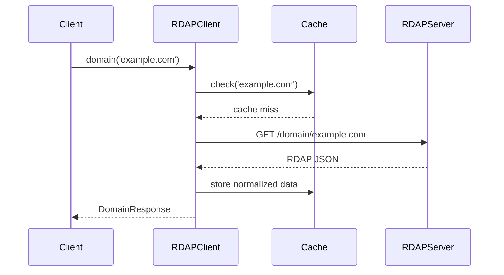

# Contributing to RDAPify

Thank you for your interest in contributing to RDAPify! We welcome contributions from everyone, whether you're fixing bugs, adding features, improving documentation, or helping with community support.

This guide outlines our contribution process, standards, and expectations to help you make valuable contributions efficiently.

## 🌟 Ways to Contribute

### Code Contributions
- Fix bugs reported in issues
- Implement new features from the roadmap
- Improve performance and resource usage
- Add support for new environments (Bun, Deno, etc.)
- Enhance security protections

### Documentation Contributions
- Improve API documentation
- Write tutorials and guides
- Create examples for real-world use cases
- Translate documentation to other languages
- Update diagrams and visualizations

### Community Contributions
- Answer questions in discussions
- Review pull requests (for experienced contributors)
- Report bugs with detailed reproduction steps
- Suggest improvements to the project
- Share your use cases and success stories

## 🚀 Contribution Workflow

### 1. Find or Create an Issue
- Check existing [issues](https://github.com/rdapify/rdapify/issues) for your topic
- For bugs: include detailed reproduction steps, environment info, and expected vs. actual behavior
- For features: explain the use case and why it's valuable
- Label appropriately (`bug`, `feature`, `documentation`, etc.)

### 2. Get Feedback
- Wait for maintainer feedback before investing significant effort
- For major changes: create a [Discussion](https://github.com/rdapify/rdapify/discussions) first
- Follow the [RFC process](docs/governance/rfc-process.md) for architectural changes

### 3. Fork and Develop
```bash
# Fork the repository
# Clone your fork
git clone https://github.com/<your-username>/rdapify.git
cd rdapify

# Create a branch with descriptive name
git checkout -b fix/timeout-issue

# Install dependencies
npm install

# Make your changes
```

### 4. Test Thoroughly
```bash
# Run all tests
npm test

# Run security tests
npm run test:security

# Run performance tests
npm run benchmark

# Check code style
npm run lint

# Check type safety
npm run typecheck
```

### 5. Submit Pull Request
- Target the `main` branch
- Include a clear description linking to related issues
- Update documentation if needed
- Add tests for new functionality
- Follow commit message conventions (see below)

## 📝 Code Standards

### TypeScript Guidelines
- Use TypeScript strictly (`strict: true` in tsconfig)
- Favor functional programming over classes where appropriate
- Avoid `any` type (use `unknown` + validation instead)
- Use `readonly` for immutable data
- Prefer `const enum` over regular enums for performance

### Error Handling
```typescript
// ✅ GOOD: Standardized error handling
throw new RDAPError('RDAP_TIMEOUT', 'Request timed out', {
  query: domain,
  timeout: options.timeout
});

// ❌ AVOID: Generic errors
throw new Error('Timeout');
```

### Performance Considerations
- Avoid blocking operations (use async/await)
- Minimize memory allocations in hot paths
- Use streams for large data processing
- Implement proper cleanup (abort controllers, timeouts)
- Profile performance before and after changes

### Security Requirements
All code changes must:
- Validate all inputs from external sources
- Prevent SSRF vulnerabilities (use our Fetcher class)
- Sanitize data before display
- Follow the principle of least privilege
- Include security tests for new functionality

```typescript
// ✅ GOOD: Safe URL handling
const url = new URL('https://example.com');
url.searchParams.set('domain', encodeURIComponent(domain));

// ❌ AVOID: URL concatenation
const url = `https://example.com?domain=${domain}`; // Vulnerable to injection
```

## 🧪 Testing Requirements

### Test Coverage
- New features must have ≥95% test coverage
- Bug fixes must include regression tests
- Critical paths must have 100% coverage

### Test Types
```bash
# Unit tests (Jest)
npm run test:unit

# Integration tests
npm run test:integration

# Security tests
npm run test:security

# Fuzzing tests
npm run test:fuzz

# End-to-end tests
npm run test:e2e
```

### Test Vectors
For RDAP-specific tests, use our standardized test vectors:
- `test-vectors/domain-vectors.json`
- `test-vectors/ip-vectors.json`
- `test-vectors/error-vectors.json`

```typescript
// Example test using vectors
import { testVectors } from '../../test-vectors/domain-vectors.json';

describe('Domain Lookup', () => {
  testVectors.forEach(vector => {
    it(`handles ${vector.description}`, async () => {
      const result = await client.domain(vector.input.query);
      expect(result).toMatchObject(vector.expectedOutput);
    });
  });
});
```

## 📚 Documentation Standards

### API Documentation
All public APIs must include:
- Clear description of purpose
- Parameter descriptions with types
- Return type description
- Example usage
- Edge cases and error conditions

```typescript
/**
 * Looks up domain registration information using RDAP protocol
 * 
 * @param query - Domain name to look up (e.g., 'example.com')
 * @param options - Optional configuration parameters
 * @returns Promise resolving to normalized domain information
 * @throws RDAPError if lookup fails
 * 
 * @example
 * ```typescript
 * const result = await client.domain('example.com');
 * console.log(result.registrar.name);
 * ```
 * 
 * @see {@link https://rdapify.dev/docs/core-concepts/normalization|Normalization Guide}
 */
async domain(query: string, options?: DomainOptions): Promise<DomainResponse> {
  // implementation
}
```

### Mermaid Diagrams
For architecture and flow documentation, use Mermaid diagrams:


## 🔒 Security Contribution Guidelines

### Vulnerability Disclosure
Security issues should be reported privately:
1. Email security@rdapify.dev
2. Include detailed reproduction steps
3. Do not disclose publicly until fix is released
4. Allow 90 days for coordinated disclosure

For non-sensitive security improvements:
- Open a regular issue with `security` label
- Include threat model and mitigation details
- Reference relevant standards (OWASP, CWE, etc.)

### Security Testing
When contributing security-sensitive code:
- Include negative tests (attempt to bypass protections)
- Test with security scanning tools (Bandit, Semgrep)
- Document threat modeling in PR description
- Follow our [Security Whitepaper](security/whitepaper.md) guidelines

## 📦 Commit Message Convention

We use [Conventional Commits](https://www.conventionalcommits.org/):
```
<type>[optional scope]: <description>

[optional body]

[optional footer(s)]
```

### Types
- `feat`: New feature
- `fix`: Bug fix
- `docs`: Documentation changes
- `style`: Code style only (no logic changes)
- `refactor`: Code improvement without behavior change
- `perf`: Performance improvement
- `test`: Test addition or improvement
- `chore`: Maintenance task
- `security`: Security fix or improvement

### Examples
```
feat(core): add WHOIS fallback option for failed RDAP queries

Implement automatic fallback to WHOIS protocol when RDAP requests fail
after retries. Includes configurable timeout and result normalization.

Closes #142
```

```
fix(security): prevent SSRF via IP range validation

Added RFC 1918 private IP range validation to block internal network access.
Includes comprehensive test suite for edge cases and Punycode domains.

Security Advisory: GHSA-xxxx-xxxx-xxxx
```

```
docs(performance): add benchmark methodology details

Documented benchmark environment setup, sample sizes, and statistical methods
used for performance measurements. Added guidance for reproducing results.
```

## 🤝 Code Review Process

### Review Timeline
- Bug fixes: 24-48 hours
- Small features: 48-72 hours
- Major changes: 1-2 weeks (with RFC process)

### Review Guidelines
**For contributors:**
- Keep PRs focused (single concern per PR)
- Respond to feedback promptly
- Update documentation with code changes
- Don't force push after review has started

**For maintainers:**
- Provide constructive feedback
- Explain reasoning behind suggestions
- Approve PRs that meet standards
- Escalate architectural decisions when needed

### Merge Requirements
- ✅ All CI checks pass
- ✅ Minimum 1 maintainer approval
- ✅ Documentation updated if needed
- ✅ Tests added for new functionality
- ✅ Security review for sensitive changes
- ✅ Benchmarks show no performance regression >5%

## 🌐 Community Guidelines

### Communication Channels
- **GitHub Issues/PRs**: Technical discussions and code reviews
- **GitHub Discussions**: General questions and ideas
- **Matrix/Element**: Real-time chat for quick questions
- **Office Hours**: Weekly live sessions (Thursdays 2PM UTC)

### Code of Conduct
All contributors must follow our [Code of Conduct](CODE_OF_CONDUCT.md):
- Be respectful and inclusive
- Focus on technical merits, not people
- Assume good faith
- Give and accept constructive feedback
- Report unacceptable behavior to maintainers

### Decision Making
- Small changes: Maintainer approval
- Medium changes: Discussion + maintainer consensus
- Large changes: RFC process + maintainer vote
- Breaking changes: RFC + 2-week community feedback + unanimous maintainer approval

## 🎯 Getting Help

Stuck while contributing? Get help through:
1. **GitHub Discussions**: Tag with `help-wanted`
2. **Office Hours**: Join weekly live sessions
3. **Good First Issues**: Start with beginner-friendly tasks
4. **Pair Programming**: Request collaborative coding session

## 🙏 Recognition

Contributions are recognized through:
- GitHub contributor graph
- Release notes thank-yous
- Project maintainer status for consistent contributors
- Speaking opportunities at relevant conferences
- Letters of recommendation for students and job seekers

## ⚙️ Development Environment Setup

```bash
# Clone repository
git clone https://github.com/rdapify/rdapify.git
cd rdapify

# Install dependencies
npm install

# Set up pre-commit hooks
npm run prepare

# Run development mode with watch
npm run dev

# Run tests
npm test

# Build production version
npm run build
```

## 💡 First-Time Contributor Tips

1. **Start small**: Look for issues labeled `good first issue`
2. **Ask questions**: No question is too basic
3. **Be patient**: Reviews may take time during busy periods
4. **Document your journey**: Your fresh perspective helps improve onboarding
5. **Celebrate wins**: Every contribution matters!

## 📜 License

By contributing to RDAPify, you agree that your contributions will be licensed under the [MIT License](LICENSE). You also certify that you have the right to contribute the code and that it doesn't violate any third-party rights.

---

**Thank you for contributing to RDAPify!** Together, we're building a better, more secure internet infrastructure tool for everyone.

Last updated: December 5, 2025  
Questions? Contact maintainers@rdapify.dev