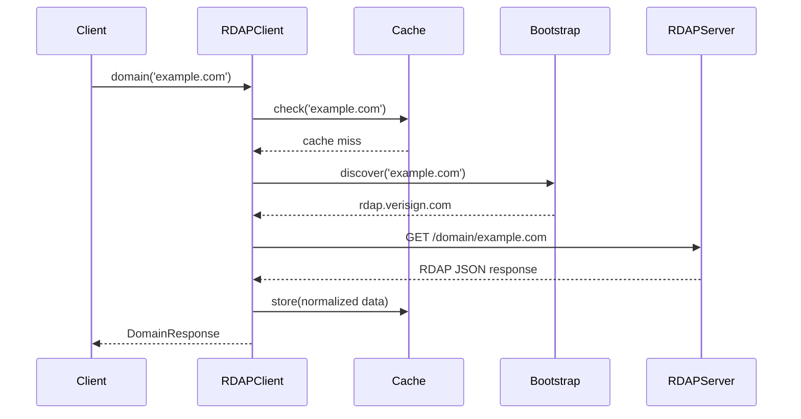

# Contributing to RDAPify

Thank you for your interest in contributing to RDAPify! We welcome contributions from everyone, whether you're fixing bugs, adding features, improving documentation, or helping with community support.

This guide outlines our contribution process, standards, and expectations to help you make valuable contributions efficiently.

## Ways to Contribute

### Code Contributions

- Fix bugs reported in issues
- Implement new features from the roadmap
- Improve performance and resource usage
- Add support for new environments (Bun, Deno, Cloudflare Workers, etc.)
- Enhance security protections
- Optimize native bindings (Node.js, Python, Go)

### Documentation Contributions

- Improve API documentation
- Write tutorials and guides
- Create examples for real-world use cases
- Translate documentation to other languages
- Update diagrams and visualizations
- Document architecture decisions

### Community Contributions

- Answer questions in discussions
- Review pull requests (for experienced contributors)
- Report bugs with detailed reproduction steps
- Suggest improvements to the project
- Share your use cases and success stories
- Help with testing across different environments

## Contribution Workflow

### 1. Find or Create an Issue

- Check existing [issues](https://github.com/rdapify/rdapify/issues) for your topic
- For bugs: include detailed reproduction steps, environment info (Node.js version, OS), and expected vs. actual behavior
- For features: explain the use case and why it's valuable
- Label appropriately (`bug`, `feature`, `documentation`, etc.)

### 2. Get Feedback

- Wait for maintainer feedback before investing significant effort
- For major changes: create a [Discussion](https://github.com/rdapify/rdapify/discussions) first
- Follow the RFC (Request for Comments) process for architectural changes
- Consider security implications for sensitive changes

### 3. Fork and Develop

```bash
# Fork the repository
# Clone your fork
git clone https://github.com/<your-username>/rdapify.git
cd rdapify

# Create a branch with descriptive name
git checkout -b fix/timeout-issue
# or
git checkout -b feature/streaming-api

# Install dependencies
npm install

# Set up pre-commit hooks
npm run prepare

# Make your changes
```

### 4. Test Thoroughly

```bash
# Run all tests with coverage
npm test

# Run security tests specifically
npm run test:security

# Run integration tests
npm run test:integration

# Check code style and format
npm run lint
npm run format:check

# Check type safety
npm run typecheck

# Full verification (comprehensive check)
npm run verify
```

### 5. Submit Pull Request

- Target the `main` branch
- Include a clear description linking to related issues
- Update documentation if needed (README, API docs, ARCHITECTURE.md)
- Add tests for new functionality (aim for ≥80% coverage)
- Follow commit message conventions (see below)
- Don't force push after review has started

## Development Environment Setup

### Prerequisites

- **Node.js 20+** (check `.nvmrc` for exact version)
- **npm 10+**
- **Git 2.30+**
- Optional: Rust 1.75+ (for native binding development)

### Initial Setup

```bash
# Clone repository
git clone https://github.com/rdapify/rdapify.git
cd rdapify

# Install dependencies
npm install

# Set up pre-commit hooks (Husky)
npm run prepare

# Verify setup with full test suite
npm run verify
```

### Development Workflow

```bash
# Watch mode for TypeScript compilation
npm run dev

# Run tests in watch mode
npm run test:watch

# Format code automatically
npm run lint:fix
npm run format

# Build for production
npm run build
```

## Code Standards

### TypeScript Guidelines

- Use TypeScript strictly (`strict: true` in tsconfig.json)
- All flags enabled: `noImplicitAny`, `noImplicitThis`, `strictNullChecks`, `strictFunctionTypes`, `noUncheckedIndexedAccess`, etc.
- Target ES2020 for features and compatibility
- Favor functional programming over classes where appropriate
- Avoid `any` type (use `unknown` + validation instead)
- Use `readonly` for immutable data structures
- Prefer `const enum` over regular enums for performance
- Use path aliases for imports: `@/*` → `src/*`

### Error Handling

```typescript
// ✅ GOOD: Standardized error handling
import { RDAPError } from '@/shared/errors';

throw new RDAPError('RDAP_TIMEOUT', 'Request timed out after 10s', {
  query: domain,
  timeout: options.timeout,
  code: 'ETIMEDOUT'
});

// ❌ AVOID: Generic errors
throw new Error('Timeout');

// ❌ AVOID: String-based errors
throw 'Request failed';
```

### Async/Await Patterns

```typescript
// ✅ GOOD: Proper async error handling
async function fetchDomain(query: string): Promise<DomainResponse> {
  try {
    const result = await cache.get(query);
    if (result) return result;

    const response = await fetcher.fetch(url, {
      signal: AbortSignal.timeout(10000) // Timeout protection
    });
    return await normalizer.normalize(response);
  } catch (error) {
    if (error instanceof TimeoutError) {
      throw new RDAPError('RDAP_TIMEOUT', 'Request exceeded timeout', { cause: error });
    }
    throw error;
  }
}

// ❌ AVOID: Fire-and-forget promises
client.domain(query); // Promise not awaited

// ❌ AVOID: Swallowing errors
Promise.resolve().catch(() => {});
```

### Performance Considerations

- Avoid blocking operations (use async/await)
- Minimize memory allocations in hot paths
- Use streams for large data processing
- Implement proper cleanup (AbortControllers, timeouts)
- Profile performance before and after changes using our benchmark suite
- Monitor bundle size impact with `npm run verify:api`

### Security Requirements

All code changes must:

- Validate all inputs from external sources
- Prevent SSRF vulnerabilities (use our `Fetcher` class with `SSRFProtection`)
- Sanitize data before display
- Follow the principle of least privilege
- Include security tests for new functionality
- Never log sensitive data (API keys, auth tokens, PII)

```typescript
// ✅ GOOD: Safe URL handling
import { Fetcher, SSRFProtection } from '@/infrastructure';

const ssrf = new SSRFProtection();
const fetcher = new Fetcher({ security: ssrf });

const url = new URL('https://rdap.arin.net/registry/ip/' + ip);
ssrf.validateURL(url); // Validates against private IP ranges
const response = await fetcher.fetch(url);

// ✅ GOOD: Input validation
function validateDomain(domain: string): void {
  if (!domain || typeof domain !== 'string') {
    throw new RDAPError('INVALID_INPUT', 'Domain must be non-empty string');
  }
  if (domain.length > 253) {
    throw new RDAPError('INVALID_INPUT', 'Domain exceeds 253 characters');
  }
}

// ❌ AVOID: URL concatenation (injection vulnerable)
const url = `https://rdap.arin.net/registry/ip/${ip}`;

// ❌ AVOID: Missing input validation
async function lookup(input: unknown): Promise<void> {
  await fetcher.fetch(input as string); // Type cast without validation
}
```

## Testing Requirements

### Test Coverage

- New features must have ≥80% test coverage (branches, functions, lines, statements)
- Bug fixes must include regression tests
- Critical security paths must have 100% coverage
- Coverage is checked in CI; PRs with coverage drops will be requested to add tests

### Test Types

```bash
# Unit tests (Jest, fastest, most tests here)
npm run test:unit

# Integration tests (test across modules)
npm run test:integration

# Security tests (SSRF, injection, input validation)
npm run test:security

# All tests with coverage report
npm test

# Watch mode for development
npm run test:watch
```

### Test File Organization

```
src/
├── application/
│   └── rdap-client.test.ts          # Test file in same directory
├── core/
│   ├── ports/
│   │   └── cache.port.test.ts
│   └── domain-models/
└── infrastructure/
    ├── __tests__/                    # Alternative: tests in subdirectory
    │   └── fetcher.integration.ts
    └── fetcher.ts
```

### Test Structure

```typescript
import { describe, it, expect, beforeEach, afterEach } from '@jest/globals';
import { RDAPClient } from '@/application';

describe('RDAPClient - Domain Lookup', () => {
  let client: RDAPClient;

  beforeEach(() => {
    client = new RDAPClient({
      timeout: 5000,
      cache: { ttl: 3600 }
    });
  });

  afterEach(() => {
    client.destroy(); // Cleanup resources
  });

  it('should fetch domain information', async () => {
    const result = await client.domain('example.com');

    expect(result).toHaveProperty('handle');
    expect(result).toHaveProperty('registrar');
    expect(result.domain).toBe('example.com');
  });

  it('should throw RDAPError for invalid domain', async () => {
    await expect(client.domain('invalid..domain')).rejects.toThrow('INVALID_INPUT');
  });

  it('should return cached result on second request', async () => {
    const first = await client.domain('example.com');
    const second = await client.domain('example.com');

    expect(first).toEqual(second);
    // Verify only one network request was made
  });
});
```

### Test Vectors and Mocking

Use standardized test vectors for consistency:

```typescript
import { domainTestVectors } from '@/shared/test-vectors';

describe('Domain Normalization', () => {
  domainTestVectors.forEach((vector) => {
    it(`should handle ${vector.description}`, async () => {
      const result = await normalizer.normalize(vector.rawResponse);
      expect(result).toEqual(vector.expectedNormalized);
    });
  });
});
```

Mock external dependencies:

```typescript
jest.mock('@/infrastructure/fetcher');
const mockFetcher = Fetcher as jest.Mocked<typeof Fetcher>;

mockFetcher.fetch.mockResolvedValue({
  status: 200,
  headers: { 'content-type': 'application/json' },
  body: JSON.stringify({ handle: 'EXAMPLE.COM' })
});
```

## Documentation Standards

### API Documentation

All public APIs must include JSDoc comments:

```typescript
/**
 * Looks up domain registration information using RDAP protocol.
 *
 * Queries the IANA bootstrap registry to find the authoritative RDAP server
 * for the given domain, then retrieves detailed registration data.
 *
 * @param query - Domain name to look up (e.g., 'example.com')
 * @param options - Optional configuration parameters
 * @param options.timeout - Request timeout in milliseconds (default: 10000)
 * @param options.followRedirects - Follow RDAP referrals (default: true)
 * @returns Promise resolving to normalized domain information with GDPR/CCPA PII redaction applied
 * @throws RDAPError if lookup fails or times out
 *
 * @example
 * ```typescript
 * const client = new RDAPClient();
 * const result = await client.domain('example.com');
 *
 * console.log(result.registrar?.name);        // Verisign Global Registry Services
 * console.log(result.expirationDate);         // 2025-03-21
 * console.log(result.registrar?.contactEmail); // Redacted for privacy
 * ```
 *
 * @see {@link https://tools.ietf.org/html/rfc7480|RFC 7480 - RDAP Protocol}
 * @see {@link https://rdapify.com/docs/core-concepts/normalization|Normalization Guide}
 */
async domain(query: string, options?: DomainOptions): Promise<DomainResponse> {
  // implementation
}
```

### Markdown Documentation

Use clear headings, code examples, and visual aids:

```markdown
## Caching Strategy

RDAPify uses a three-tier caching approach:

1. **L1 Cache**: In-memory LRU cache (1-hour default TTL)
2. **L2 Cache**: Redis (via `RedisCache` adapter)
3. **L3 Cache**: CDN edge cache (future)

### Configuration Example

\`\`\`typescript
const client = new RDAPClient({
  cache: {
    ttl: 3600,        // 1 hour
    maxSize: 1000     // 1000 entries
  }
});
\`\`\`
```

### Architecture Diagrams

Use Mermaid for sequence diagrams and architecture:

````markdown
## Query Flow


```mermaid
sequenceDiagram
    participant Client
    participant RDAPClient
    participant Cache
    participant Bootstrap
    participant RDAPServer

    Client->>RDAPClient: domain('example.com')
    RDAPClient->>Cache: check('example.com')
    Cache-->>RDAPClient: cache miss
    RDAPClient->>Bootstrap: discover('example.com')
    Bootstrap-->>RDAPClient: rdap.verisign.com
    RDAPClient->>RDAPServer: GET /domain/example.com
    RDAPServer-->>RDAPClient: RDAP JSON response
    RDAPClient->>Cache: store(normalized data)
    RDAPClient-->>Client: DomainResponse
```
````

## Commit Message Convention

We use [Conventional Commits](https://www.conventionalcommits.org/):

```
<type>[optional scope]: <description>

[optional body]

[optional footer(s)]
```

### Types

- `feat` - New feature
- `fix` - Bug fix
- `docs` - Documentation changes
- `style` - Code style only (no logic changes)
- `refactor` - Code improvement without behavior change
- `perf` - Performance improvement
- `test` - Test addition or improvement
- `chore` - Maintenance task (dependencies, config)
- `security` - Security fix or improvement
- `ci` - CI/CD configuration changes

### Examples

```
feat(core): add streaming API for batch queries

Implement new streaming interface for efficient processing of large
query batches. Reduces memory usage by 60% for 10k+ queries.

Closes #142
```

```
fix(security): prevent SSRF via DNS rebinding

Added TOCTOU (Time-of-check-time-of-use) protection by re-validating
IP addresses immediately before socket connection. Includes comprehensive
test suite for edge cases and Punycode domains.

Reviewed by: @security-team
Security-Advisory: GHSA-xxxx-xxxx-xxxx
```

```
docs(api): clarify PII redaction behavior in domain results

Updated examples to show redacted contact information in responses.
Documented privacy levels and configuration options.
```

```
perf(cache): optimize LRU eviction algorithm

Replaced simple queue with heap-based LRU for O(1) eviction.
Benchmarks show 40% improvement for 100k+ cache entries.
```

## Code Review Process

### Review Timeline

- **Bug fixes**: 24-48 hours
- **Small features**: 48-72 hours
- **Major changes**: 1-2 weeks (with RFC process)
- **Security changes**: Priority review within 24 hours

### PR Checklist (for contributors)

Before submitting a PR, ensure:

- [ ] Tests pass: `npm test`
- [ ] Coverage maintained: `npm run test:coverage`
- [ ] Code formatted: `npm run format`
- [ ] Linting passes: `npm run lint`
- [ ] Types check: `npm run typecheck`
- [ ] Documentation updated (if needed)
- [ ] No breaking changes (or documented in BREAKING CHANGES footer)
- [ ] Commit messages follow conventions

### Merge Requirements

All of the following must be satisfied:

- ✅ All CI checks pass (tests, linting, coverage)
- ✅ Minimum 1 maintainer approval (2+ for security/major changes)
- ✅ Documentation updated if needed
- ✅ Tests added for new functionality
- ✅ Security review completed for sensitive changes
- ✅ No performance regression >5% (validated with benchmarks)
- ✅ API snapshot updated (`npm run verify:api`)

## Security Vulnerability Reporting

### Responsible Disclosure

Security vulnerabilities should be reported **privately**:

1. **Email**: security@rdapify.com
2. **What to include**:
   - Clear description of the vulnerability
   - Steps to reproduce
   - Affected versions
   - Potential impact
3. **Timeline**: Allow 90 days for coordinated disclosure before public disclosure
4. **Recognition**: Your contribution will be credited in security advisory

### Example Report

```
Subject: Security: SSRF vulnerability in bootstrap discovery

Description:
RDAPify v0.2.0 is vulnerable to Server-Side Request Forgery (SSRF) when
the bootstrap discovery feature is configured with an untrusted bootstrap
URL.

Steps to reproduce:
1. Create client with custom bootstrap URL: https://attacker.com/bootstrap
2. Query domain: client.domain('example.com')
3. Attacker's server logs show internal IP access attempts

Affected versions: v0.1.5 - v0.2.1
Fix: Implemented IP range validation in SSRFProtection class
```

## Community Guidelines

### Communication Channels

- **GitHub Issues**: Technical discussions and bug reports
- **GitHub Discussions**: Feature ideas, questions, architecture discussions
- **Security Email**: security@rdapify.com for vulnerability reports
- **Office Hours**: Weekly live sessions (Thursdays 2:00 PM UTC)

### Code of Conduct

All contributors must follow our [Code of Conduct](CODE_OF_CONDUCT.md):

- Be respectful and inclusive
- Focus on technical merits, not personal criticisms
- Assume good faith in others' contributions
- Give and accept constructive feedback gracefully
- Report unacceptable behavior to conduct@rdapify.com

### Decision Making

- **Routine changes** (bug fixes, minor features): Maintainer approval
- **Significant changes** (major features, API changes): TSC consensus discussion
- **Architectural changes**: Technical Steering Committee vote (2/3 majority)
- **Breaking changes**: RFC + 2-week community feedback + unanimous maintainer approval

## Getting Help

Stuck while contributing? Get support through:

1. **GitHub Discussions**: Tag with `help-wanted` or `question`
2. **Office Hours**: Join weekly live sessions (link in repo)
3. **Good First Issues**: Start with tasks labeled `good first issue`
4. **Pair Programming**: Request collaborative coding session

## Recognition

Contributions are recognized through:

- GitHub contributor graph
- Release notes thank-yous section
- Project maintainer status for consistent contributors
- Speaking opportunities at relevant conferences
- Optional: Added to CONTRIBUTORS.md with links to your GitHub profile

## First-Time Contributor Tips

1. **Start small**: Look for issues labeled `good first issue` or `help-wanted`
2. **Read ARCHITECTURE.md**: Understand the codebase structure before diving in
3. **Ask questions**: No question is too basic in discussions or office hours
4. **Be patient**: Reviews may take time during busy periods
5. **Document your journey**: Fresh perspectives help improve onboarding docs
6. **Celebrate wins**: Every contribution matters, no matter the size!

## Troubleshooting

### Common Issues

**Tests fail locally but pass in CI**
- Ensure you're using Node.js 20+ (check with `node --version`)
- Clear cache: `npm run clean && npm install`
- Run full test suite: `npm test`

**Husky pre-commit hooks failing**
- Reinstall hooks: `npm run prepare`
- Check your changes: `npm run lint && npm run typecheck`

**TypeScript errors after pulling latest**
- Rebuild: `npm run build`
- Check tsconfig: `npm run typecheck`

**High test flakiness**
- Increase timeout for slow CI environments
- Check for unresolved promises in tests
- Use proper mocking instead of real network calls

## License

By contributing to RDAPify, you agree that your contributions will be licensed under the [MIT License](LICENSE). You certify that you have the right to contribute the code and that it doesn't violate any third-party rights.

---

**Thank you for contributing to RDAPify!** Together, we're building a more secure, privacy-respecting internet infrastructure.

**Last Updated**: March 23, 2026
**Questions?** Contact maintainers@rdapify.com
**Website**: https://rdapify.com
**GitHub**: https://github.com/rdapify/rdapify
