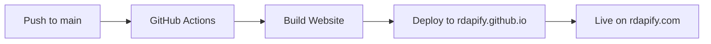

# 🎉 RDAPify GitHub Organization - Setup Summary

**Date**: January 24, 2025  
**Status**: Organization Created ✅ | Ready for Configuration ⏳

---

## ✅ What's Been Completed

### 1. GitHub Organization
- ✅ Organization created: **rdapify**
- ✅ URL: https://github.com/rdapify

### 2. Repositories Created

#### Main Repository
- ✅ Name: **RDAPify**
- ✅ URL: https://github.com/rdapify/RDAPify
- ✅ Purpose: Source code, documentation, development
- ✅ Status: Connected to local repository
- ✅ Branch: `main` (up to date)

#### Website Repository
- ✅ Name: **rdapify.github.io**
- ✅ URL: https://github.com/rdapify/rdapify.github.io
- ✅ Purpose: GitHub Pages hosting
- ✅ Planned domain: https://rdapify.com

### 3. GitHub Actions Workflows

All workflows are ready in `.github/workflows/`:

- ✅ `ci.yml` - Continuous Integration
- ✅ `deploy-website.yml` - Website deployment
- ✅ `docs.yml` - Documentation checks
- ✅ `release.yml` - Release automation
- ✅ `security.yml` - Security scanning
- ✅ `codeql.yml` - Code quality analysis

### 4. Project Configuration

- ✅ `package.json` - Updated with correct repository URLs
- ✅ `docusaurus.config.js` - Configured for rdapify.com
- ✅ Repository structure - Clean and organized
- ✅ Documentation - Comprehensive and up-to-date

---

## ⏳ Next Steps Required (30 minutes)

### Quick Setup Checklist

Follow these steps to complete the setup:

1. **Create Personal Access Token** (5 min)
   - Go to: https://github.com/settings/tokens
   - Generate token with `repo` + `workflow` scopes
   - Copy the token

2. **Add Token to Repository** (3 min)
   - Go to: https://github.com/rdapify/RDAPify/settings/secrets/actions
   - Add secret: `DEPLOY_TOKEN`
   - Paste the token

3. **Enable GitHub Pages** (3 min)
   - Go to: https://github.com/rdapify/rdapify.github.io/settings/pages
   - Source: Deploy from branch `main`
   - Save

4. **Add Custom Domain** (Optional - 5 min)
   - In GitHub Pages settings
   - Custom domain: `rdapify.com`
   - Enable HTTPS

5. **Configure DNS** (Optional - 10 min)
   - Add A records pointing to GitHub Pages IPs
   - Add CNAME for www subdomain

6. **Test Deployment** (5 min)
   - Trigger workflow manually or push a change
   - Verify website is live

---

## 📚 Documentation Created

### Arabic Documentation
- ✅ `GITHUB_ORG_READY_AR.md` - Quick setup guide in Arabic
- ✅ `.project/internal/planning/GITHUB_ORG_SETUP_COMPLETE.md` - Detailed setup guide

### English Documentation
- ✅ `GITHUB_SETUP.md` - Complete setup instructions
- ✅ `ORGANIZATION_SETUP_SUMMARY.md` - This file

---

## 🔧 Repository Settings to Configure

### Security Settings (Recommended)

1. **Branch Protection**
   - Protect `main` branch
   - Require PR reviews
   - Require status checks

2. **Dependabot**
   - Enable security alerts
   - Enable version updates

3. **Secret Scanning**
   - Enable secret scanning
   - Enable push protection

### Repository Settings

1. **Topics**
   - Add: `rdap`, `whois`, `domain`, `typescript`, `nodejs`, `security`, `privacy`

2. **About Section**
   - Description: "Unified, secure, high-performance RDAP client for enterprise applications with built-in privacy controls"
   - Website: https://rdapify.com
   - Topics: (as above)

3. **Features**
   - ✅ Issues
   - ✅ Discussions
   - ✅ Projects
   - ✅ Wiki (optional)

---

## 🚀 Deployment Workflow

### How It Works



### Trigger Conditions

Deployment runs when:
- Push to `main` branch
- Changes in `website/` or `docs/` directories
- Manual workflow dispatch

### What Happens

1. Checkout code from `rdapify/RDAPify`
2. Install Node.js 18 and dependencies
3. Build Docusaurus website
4. Deploy to `rdapify/rdapify.github.io` main branch
5. GitHub Pages serves the site

---

## 📊 Project Status

### Code Status
- ✅ Core implementation: 95% complete
- ✅ TypeScript: Fully typed
- ✅ Tests: 146 tests passing
- ✅ Documentation: Comprehensive
- ✅ Examples: Working

### Release Status
- Current version: `0.1.0-alpha.4`
- Next milestone: `0.1.0-alpha.5`
- Target: Beta release in Q1 2025

### What's Working
- ✅ RDAP queries (domain, IP, ASN)
- ✅ SSRF protection
- ✅ PII redaction
- ✅ In-memory caching
- ✅ Error handling with retry logic
- ✅ TypeScript support

### What's Planned
- ⏳ Redis cache adapter
- ⏳ CLI tool
- ⏳ Interactive playground
- ⏳ Advanced analytics
- ⏳ Bun/Deno compatibility

---

## 🎯 Immediate Action Items

### For Repository Owner

1. **Complete GitHub Setup** (30 min)
   - Follow steps in `GITHUB_ORG_READY_AR.md`
   - Create and add DEPLOY_TOKEN
   - Enable GitHub Pages
   - Test deployment

2. **Configure Security** (15 min)
   - Enable branch protection
   - Enable Dependabot
   - Review security settings

3. **Update Repository Info** (5 min)
   - Add topics
   - Update description
   - Add website URL

### For Contributors

1. **Fork the Repository**
   - Fork: https://github.com/rdapify/RDAPify

2. **Clone and Setup**
   ```bash
   git clone https://github.com/YOUR_USERNAME/RDAPify.git
   cd RDAPify
   npm install
   npm run build
   npm test
   ```

3. **Read Contributing Guide**
   - See: `CONTRIBUTING.md`

---

## 📖 Key Documentation Files

### Setup Guides
- `GITHUB_ORG_READY_AR.md` - Quick setup (Arabic)
- `GITHUB_SETUP.md` - Complete setup (English)
- `.project/internal/planning/GITHUB_ORG_SETUP_COMPLETE.md` - Detailed guide

### Development Guides
- `NEXT_STEPS.md` - Development roadmap
- `ROADMAP.md` - Project roadmap
- `CONTRIBUTING.md` - Contribution guidelines
- `DEVELOPMENT.md` - Development guide

### Project Documentation
- `README.md` - Project overview
- `ARCHITECTURE.md` - Architecture details
- `CHANGELOG.md` - Version history
- `SECURITY.md` - Security policy

---

## 🔗 Important Links

### GitHub
- Organization: https://github.com/rdapify
- Main Repo: https://github.com/rdapify/RDAPify
- Website Repo: https://github.com/rdapify/rdapify.github.io
- Issues: https://github.com/rdapify/RDAPify/issues
- Discussions: https://github.com/rdapify/RDAPify/discussions

### Website (After Setup)
- Main: https://rdapify.com
- Fallback: https://rdapify.github.io
- Docs: https://rdapify.com/docs
- Playground: https://rdapify.com/playground

### Package
- npm: https://www.npmjs.com/package/rdapify
- Current version: 0.1.0-alpha.4

---

## 🆘 Troubleshooting

### Common Issues

**Issue**: Deployment fails with "Invalid token"
- **Solution**: Check DEPLOY_TOKEN is set correctly with proper scopes

**Issue**: GitHub Pages shows 404
- **Solution**: Verify Pages is enabled and branch is set to `main`

**Issue**: Custom domain not working
- **Solution**: Check DNS records and wait up to 24 hours for propagation

**Issue**: Website not updating
- **Solution**: Check GitHub Actions logs and clear browser cache

### Getting Help

- GitHub Issues: https://github.com/rdapify/RDAPify/issues
- GitHub Discussions: https://github.com/rdapify/RDAPify/discussions
- Documentation: See files listed above

---

## 🎉 Success Criteria

### Setup Complete When:
- ✅ DEPLOY_TOKEN added to repository
- ✅ GitHub Pages enabled
- ✅ First deployment successful
- ✅ Website accessible at rdapify.github.io
- ✅ Custom domain working (if configured)

### Ready for Development When:
- ✅ Branch protection enabled
- ✅ Dependabot enabled
- ✅ Repository info updated
- ✅ Contributors can fork and clone

### Ready for Public Launch When:
- ✅ All tests passing
- ✅ Documentation complete
- ✅ Website fully functional
- ✅ Security audit complete
- ✅ Community guidelines in place

---

## 📅 Timeline

### Completed (January 24, 2025)
- ✅ Organization created
- ✅ Repositories created
- ✅ Workflows configured
- ✅ Documentation prepared

### Next 24 Hours
- ⏳ Complete GitHub setup
- ⏳ Enable security features
- ⏳ Test deployment
- ⏳ Verify website

### Next Week
- ⏳ Announce project
- ⏳ Invite contributors
- ⏳ Start community building

### Next Month
- ⏳ Release v0.1.0-alpha.5
- ⏳ Improve documentation
- ⏳ Add more examples
- ⏳ Beta release planning

---

## 🙏 Acknowledgments

This setup includes:
- GitHub Actions for CI/CD
- Docusaurus for documentation
- GitHub Pages for hosting
- Comprehensive security features
- Multi-language support

Special thanks to the open source community for the tools and inspiration!

---

## 📝 Notes

### Repository URLs Updated
All references updated from placeholder to actual URLs:
- Old: `https://github.com/YOUR_ORG/rdapify`
- New: `https://github.com/rdapify/RDAPify`

### Configuration Files Updated
- ✅ `package.json` - Repository URLs
- ✅ `docusaurus.config.js` - Organization name
- ✅ GitHub workflows - External repository reference

### Ready for:
- ✅ Public access
- ✅ Contributions
- ✅ Deployment
- ✅ Community building

---

**Last Updated**: January 24, 2025  
**Status**: Organization Ready ✅ | Setup Pending ⏳ 
**Next Action**: Follow `GITHUB_ORG_READY_AR.md` for 30-minute setup

---

© 2025 RDAPify Contributors | MIT License
