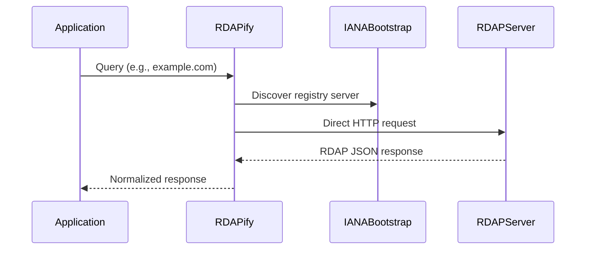
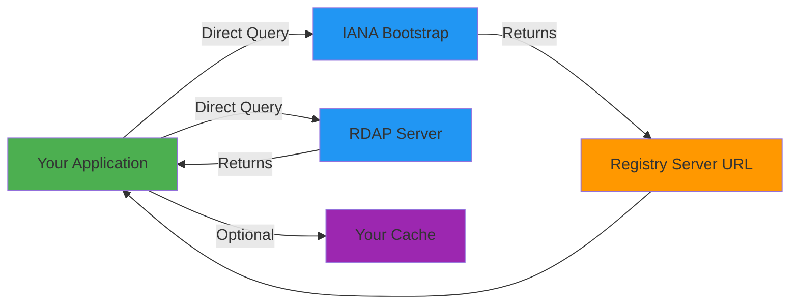

# Privacy Policy

**Effective Date:** December 5, 2025  
**Version:** 1.0  
**Last Updated:** December 5, 2025

## Executive Summary

RDAPify is a client-side library that queries public RDAP (Registration Data Access Protocol) servers. **By design, the library does not collect, store, or transmit any personal data by default.** This privacy policy explains our approach to data handling, GDPR/CCPA compliance, and how we ensure your applications maintain regulatory compliance when using our library.

## 1. Data Processing Principles
 
As a developer-focused library, RDAPify follows these core principles:

- **Data Minimization**: Only process necessary data; no extraneous collection
- **Default Privacy**: Secure defaults with PII redaction enabled by default
- **Transparency**: Clear documentation of data flows and processing
- **User Control**: Applications maintain full control over data retention
- **Defense in Depth**: Multiple layers of protection for sensitive data

## 2. How RDAPify Processes Data

### 2.1 No Built-in Data Collection
The RDAPify library:
- ❌ Does **not** collect usage statistics by default
- ❌ Does **not** transmit query results to our servers
- ❌ Does **not** maintain any backend infrastructure that processes your data
- ❌ Does **not** include tracking or analytics code in the core library

### 2.2 Network Communication
When making RDAP queries:


**Important**: All network requests go directly from your application server to RDAP servers. **No data passes through RDAPify infrastructure** as we operate no proxy services.

## 3. Personal Data Handling

### 3.1 Types of Personal Data in RDAP Responses
RDAP responses may contain:
- Registrar contact information
- Domain registrant details (name, organization)
- Email addresses
- Physical addresses
- Phone numbers
- Registration dates and history

### 3.2 Automatic PII Redaction
By default, RDAPify redacts personally identifiable information:
```typescript
import { RDAPClient } from 'rdapify';

const client = new RDAPClient({
  redactPII: true, // Enabled by default
});

// Sample output with redaction
{
  "registrar": "REDACTED",
  "registrant": {
    "name": "REDACTED",
    "email": "REDACTED",
    "phone": "REDACTED"
  },
  "nameservers": ["ns1.example.com", "ns2.example.com"] // Non-PII preserved
}
```

**Redaction Rules**:
- Email addresses → `REDACTED@redacted.invalid`
- Phone numbers → `REDACTED`
- Names → `REDACTED`
- Physical addresses → `REDACTED`
- Organization names preserved (non-personal)
- Technical data (nameservers, IPs) preserved

### 3.3 Optional Raw Data Access
Developers can disable redaction if needed for legitimate purposes:
```typescript
const client = new RDAPClient({
  redactPII: false, // Only disable with legal basis
  includeRaw: true  // Include raw RDAP response
});
```
**Warning**: When disabling redaction, you assume full GDPR/CCPA compliance responsibility.

## 4. Data Storage & Caching

### 4.1 In-Memory Cache
RDAPify's default cache:
- Stores normalized responses in application memory
- Automatically expires based on TTL (default: 1 hour)
- Contains **no persistent storage** unless explicitly configured
- Respects redaction settings (PII redacted before caching)

### 4.2 Persistent Caching
When using Redis or other persistent caches:
```typescript
const client = new RDAPClient({
  cacheAdapter: new RedisAdapter({
    redactBeforeStore: true, // Redact before persistence
    encryptionKey: process.env.CACHE_ENCRYPTION_KEY
  })
});
```
**Security Requirements**:
- Always enable encryption at rest
- Configure TTL for automatic data expiration
- Enable redaction before storage
- Restrict access to cache infrastructure

## 5. GDPR Compliance Framework

### 5.1 Lawful Basis for Processing
When using RDAPify, establish legal basis under GDPR Article 6:
- **Legitimate Interest**: Domain monitoring for security purposes
- **Contract Necessity**: Domain validation for services you provide
- **Consent**: Explicit user permission (documented)

### 5.2 Data Subject Rights Implementation
RDAPify provides tools to help you honor data subject rights:

**Right to Access (Article 15)**:
```typescript
// Retrieve cached data for specific domain
const cachedData = await client.getCacheEntry('example.com');
```

**Right to Erasure (Article 17)**:
```typescript
// Delete specific domain data
await client.deleteCacheEntry('example.com');

// Delete all cached data
await client.clearCache();
```

**Right to Restriction (Article 18)**:
```typescript
// Mark domain as restricted (no further processing)
await client.restrictDomain('example.com');
```

### 5.3 Data Processing Agreement (DPA)
Since RDAPify is a library and not a data processor:
- No DPA needed with RDAPify maintainers
- You may need DPAs with:
  - RDAP server operators (registries)
  - Cache providers (Redis, etc.)
  - Infrastructure providers

## 6. CCPA/CPRA Compliance

### 6.1 "Do Not Sell" Requirement
RDAPify:
- ❌ Does **not** sell personal information
- ❌ Does **not** share personal information for monetary consideration
- ❌ Does **not** engage in "sharing" as defined by CPRA

### 6.2 Consumer Rights Implementation
RDAPify helps you implement CCPA rights:

**Right to Know (Section 1798.110)**:
```typescript
// Get categories of collected information
const categories = client.getDataCategories();
// Returns: ['domain_registration', 'dns_configuration', 'network_allocation']
```

**Right to Delete (Section 1798.105)**:
```typescript
// CCPA-compliant deletion
await client.ccpaDelete('example.com');
```

**Opt-Out of Sale/Sharing Notices**:
RDAPify provides no built-in UI components, but offers:
```typescript
// Check if domain has opt-out requirements
const requiresOptOut = client.requiresOptOut('example.com');
```

## 7. Security Safeguards

### 7.1 Data in Transit
- TLS 1.3 minimum for all RDAP connections
- Certificate pinning support for high-security environments
- HSTS enforcement on all supported domains
- Perfect Forward Secrecy (PFS) enabled

### 7.2 Data at Rest
When enabling persistent storage:
- AES-256-GCM encryption for all cached data
- Key rotation support (90-day rotation recommended)
- Field-level encryption for sensitive fields
- Access logging for all data retrieval operations

### 7.3 Infrastructure Security
For self-hosted cache implementations:
- Isolation of cache servers from public internet
- VPC peering for cloud environments
- Regular vulnerability scanning
- Intrusion detection systems

## 8. Telemetry & Analytics (Opt-in Only)

### 8.1 Anonymous Usage Statistics
Optional telemetry must be explicitly enabled:
```typescript
const client = new RDAPClient({
  telemetry: {
    enabled: true,
    anonymize: true, // Strip all identifiers
    endpoint: 'https://telemetry.rdapify.com'
  }
});
```

**What's collected (anonymized)**:
- Library version
- Node.js runtime version
- Query types (domain, IP, ASN)
- Error rates and types
- Cache hit/miss ratios
- Geographic region (country-level only)

**What's NEVER collected**:
- Domain names or IP addresses queried
- Raw RDAP responses
- Personal or business identifiers
- Network location details beyond country
- Application-specific data

### 8.2 User Control
Users can:
- Opt-out via environment variable: `RDAP_TELEMETRY=disabled`
- Inspect all telemetry data before transmission
- Self-host telemetry collection endpoint
- Disable individual telemetry components

## 9. Children's Privacy (COPPA)

RDAPify is designed for developer use in enterprise applications and:
- ❌ Is not directed at children under 13
- ❌ Does not knowingly collect personal information from children
- ❌ Contains no child-oriented content or features
- ✅ Complies with COPPA safe harbor provisions through data minimization

## 10. Data Protection Officer (DPO)

**Contact for Data Protection Matters**:
- Email: dpo@rdapify.com
- PGP Key: [0xABCD1234EFGH5678](https://rdapify.com/security/pgp-key.asc)
- Response Time: 48 business hours

**Responsibilities**:
- GDPR/CCPA compliance oversight
- Data breach notification coordination
- Privacy impact assessment review
- Regulatory communication

## 11. Data Breach Protocol

In the unlikely event of a security incident:

1. **Detection**: 24/7 monitoring with automated alerts
2. **Containment**: Immediate isolation of affected systems
3. **Assessment**: Determination of data impact within 4 hours
4. **Notification**:
   - Regulatory authorities: Within 72 hours per GDPR Article 33
   - Affected data subjects: Without undue delay per GDPR Article 34
5. **Remediation**: Full root cause analysis and prevention measures

**Note**: Since RDAPify stores no persistent data by default, breach risk is primarily limited to in-memory cache content during active use.

## 12. International Data Transfers

### 12.1 Cross-Border Considerations
RDAP queries may involve:
- EU → US data transfers (most global registries are US-based)
- Multiple jurisdictional boundaries per query
- No direct RDAPify infrastructure involvement

### 12.2 Transfer Mechanisms
For data stored in your application:
- Standard Contractual Clauses (SCCs) for EU-US transfers
- Binding Corporate Rules (BCRs) for enterprise deployments
- Supplementary technical measures (encryption, tokenization)

## 13. Developer Responsibilities

When using RDAPify, you are responsible for:

✅ **Assessing Legal Basis**: Determine lawful basis for your specific use case  
✅ **Implementing Additional Controls**: Add consent mechanisms where required  
✅ **Data Minimization**: Query only necessary domains/IPs  
✅ **Retention Policies**: Implement appropriate data retention limits  
✅ **Security Measures**: Secure your application infrastructure  
✅ **Transparency**: Disclose RDAP data usage in your privacy policy  
✅ **User Rights**: Implement processes to handle data subject requests  

## 14. Policy Updates

### 14.1 Notification Process
We will notify users of material changes via:
- GitHub Releases with detailed changelogs
- npm package version updates
- Email to registered maintainers
- Security advisories for critical changes

### 14.2 Version History
| Version | Date | Changes |
|---------|------|---------|
| 1.0 | 2025-12-05 | Initial comprehensive policy |

## 15. Contact Information

**Privacy Questions**: privacy@rdapify.com  
**Security Issues**: security@rdapify.com  
**Data Subject Requests**: dpo@rdapify.com  
**Enterprise Compliance**: compliance@rdapify.com  

**Postal Address**:  
RDAPify Privacy Team  
123 Secure Avenue  
San Francisco, CA 94107  
USA

## 16. Appendices

### Appendix A: GDPR Article 30 Record of Processing
Available to enterprise customers upon request.

### Appendix B: Data Flow Diagrams


### Appendix C: Security Controls Matrix
| Control | Implementation | Verification |
|---------|----------------|-------------|
| PII Redaction | Automatic at response parsing | Test vectors in `/test-vectors/` |
| Cache Encryption | AES-256-GCM with key rotation | Security audit reports |
| TLS Enforcement | TLS 1.3+ with certificate validation | SSL Labs rating A+ |
| Access Controls | RBAC for cache administration | SOC 2 audits |

---

> **Disclaimer**: This privacy policy applies to the RDAPify library itself. Your application's use of RDAP data must comply with applicable laws and regulations. Consult legal counsel for compliance advice specific to your use case.  
>  
> RDAPify is provided "as is" without warranty. See [LICENSE](LICENSE) for full terms.  
>  
> © 2025 RDAPify - Designed for enterprises that prioritize privacy and security.