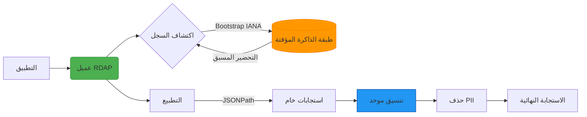

<p align="center">
  
</p>

<h1 align="center">RDAPify</h1>
<p align="center"><strong>عميل RDAP موحد وآمن وعالي الأداء</strong></p>

[](https://www.npmjs.com/package/rdapify)
[](https://www.npmjs.com/package/rdapify)
[](LICENSE)
[](https://github.com/rdapify/RDAPify/actions/workflows/ci.yml)
[](https://codecov.io/gh/rdapify/RDAPify)
[](https://www.typescriptlang.org/)
[](https://github.com/rdapify/RDAPify/blob/main/CHANGELOG.md)
[](SECURITY.md)
[](https://rdapify.com)

> **برنامج Alpha**
>
> RDAPify قيد التطوير النشط. الوظائف الأساسية (استعلامات RDAP والتخزين المؤقت وحماية SSRF) مستقرة واختبارات شاملة، لكن الواجهات البرمجية قد تتغير قبل v1.0. نرحب بـ [المشاكل](https://github.com/rdapify/RDAPify/issues) و[التعليقات](https://github.com/rdapify/RDAPify/discussions) من المجتمع أثناء تطور المشروع.

**RDAPify** يوحد استعلامات RDAP عبر جميع السجلات العالمية (Verisign و ARIN و RIPE و APNIC و LACNIC) مع حماية أمان قوية وأداء استثنائية وتجربة مطور متكاملة. هذا ليس مجرد عميل RDAP آخر — إنه منصة كاملة لمعالجة بيانات التسجيل بأمان.

> **ملاحظة:** يزيل هذا المشروع الحاجة إلى بروتوكول WHOIS التقليدي، مع الحفاظ على التوافق العكسي عند الحاجة.

## 🚀 لماذا RDAPify؟

استعلامات RDAP المباشرة معقدة — كل سجل يستخدم تنسيقات مختلفة وحدود معدل وإجراءات أمان. بدلاً من إعادة اختراع العجلة لكل مشروع:

```diff
- الحفاظ على تطبيقات WHOIS/RDAP متعددة
- التعامل اليدوي مع الاختلافات بين السجلات
- القلق المستمر حول ضعف SSRF
- الأداء غير المتوقع بدون التخزين المؤقت
+ حل موحد واحد، يختبر بصرامة، مفتوح المصدر
```

يعالج RDAPify ذكياً هذه التحديات:

- ✅ **تطبيع البيانات**: استجابة متسقة بغض النظر عن سجل المصدر
- ✅ **حماية SSRF**: منع الهجمات على البنية التحتية الداخلية
- ✅ **أداء استثنائية**: التخزين المؤقت الذكي، المعالجة المتوازية، تحسين الذاكرة
- ✅ **توافق Node.js**: التحقق من العمل على Node.js 20+؛ Bun و Deno و Cloudflare Workers مدعومة أيضاً
- ✅ **جاهز للـ GDPR**: أدوات مدمجة لحذف البيانات الشخصية تلقائياً

## 📦 التثبيت السريع

```bash
# استخدام npm
npm install rdapify

# استخدام yarn
yarn add rdapify

# استخدام pnpm
pnpm add rdapify
```

```bash
# استخدام Bun
bun add rdapify
```

## ⚡ ابدأ في 30 ثانية

### الاستخدام الأساسي

```typescript
import { RDAPClient } from 'rdapify';

// إنشء عميل بالإعدادات الافتراضية
const client = new RDAPClient();

// استعلام عن نطاق
const result = await client.domain('example.com');

console.log({
  domain: result.query,
  registrar: result.registrar?.name,
  status: result.status,
  nameservers: result.nameservers,
  created: result.events.find((e) => e.eventAction === 'registration')?.eventDate,
  expires: result.events.find((e) => e.eventAction === 'expiration')?.eventDate,
});
```

### مع خيارات الأمان والأداء

```typescript
import { RDAPClient } from 'rdapify';

// إنشاء عميل آمن مع إعدادات محسنة
const client = new RDAPClient({
  cache: true,             // ذاكرة تخزين مؤقت LRU (TTL ساعة واحدة)
  privacy: true,           // حذف PII تلقائي (GDPR/CCPA)
  retry: {
    maxAttempts: 3,
    backoff: 'exponential',
  },
});

// استعلام النطاق أو IP أو ASN أو nameserver أو entity
const domain = await client.domain('example.com');
const ip = await client.ip('8.8.8.8');
const asn = await client.asn('AS15169');
const ns = await client.nameserver('ns1.example.com');
const entity = await client.entity('ARIN-HN-1', 'https://rdap.arin.net/registry');
```

**مثال الإخراج:**

```json
{
  "query": "example.com",
  "registrar": "Internet Assigned Numbers Authority",
  "status": ["clientDeleteProhibited", "clientTransferProhibited", "clientUpdateProhibited"],
  "nameservers": ["a.iana-servers.net", "b.iana-servers.net"],
  "created": "1995-08-14T04:00:00Z",
  "expires": "2026-08-13T04:00:00Z"
}
```

### مع استعلامات Nameserver و Entity (v0.1.7+)

```typescript
import { RDAPClient } from 'rdapify';

const client = new RDAPClient();

// استعلام عن nameserver — اكتشاف تلقائي عبر bootstrap IANA DNS
const ns = await client.nameserver('ns1.example.com');
console.log(ns.ldhName);        // "ns1.example.com"
console.log(ns.ipAddresses);    // { v4: ['93.184.216.34'], v6: [...] }
console.log(ns.status);         // ['active']

// استعلام عن entity — يتطلب عنوان URL خادم صريح (لا توجد عمليات بحث عامة عن IANA)
const entity = await client.entity('ARIN-HN-1', 'https://rdap.arin.net/registry');
console.log(entity.handle);     // "ARIN-HN-1"
console.log(entity.roles);      // ['registrar', 'technical']
```

### مع المراقبة والمقاييس (v0.1.2+)

```typescript
import { RDAPClient } from 'rdapify';

// إنشاء عميل مع تمكين المراقبة
const client = new RDAPClient({
  cache: true,
  logging: {
    level: 'info', // debug, info, warn, error
    enabled: true,
  },
});

// تنفيذ الاستعلامات
await client.domain('example.com');
await client.ip('8.8.8.8');

// احصل على مقاييس الأداء
const metrics = client.getMetrics();
console.log(`معدل النجاح: ${metrics.successRate}%`);
console.log(`وقت الاستجابة المتوسط: ${metrics.avgResponseTime}ms`);
console.log(`معدل Cache Hit: ${metrics.cacheHitRate}%`);

// احصل على إحصائيات Connection Pool
const poolStats = client.getConnectionPoolStats();
console.log(`الاتصالات النشطة: ${poolStats.activeConnections}`);

// احصل على السجلات الأخيرة
const logs = client.getLogs(10);
logs.forEach((log) => {
  console.log(`[${log.level}] ${log.message}`);
});

// تنظيف الموارد
client.destroy();
```

## 🌟 المميزات الأساسية

### 🔒 أمان المؤسسات

- **حماية SSRF مدمجة**: منع الاستعلامات إلى عناوين IP الداخلية أو النطاقات الخطرة
- **التحقق من الشهادات**: رفض الاتصالات غير الآمنة بخوادم RDAP
- **تحديد المعدل**: منع حظر الخدمة بسبب الطلبات المفرطة
- **معالجة البيانات الآمنة**: حذف PII وفقاً لمتطلبات GDPR/CCPA
- **دعم المصادقة** (v0.1.1+): Basic و Bearer Token و API Key و OAuth2
- **دعم Proxy** (v0.1.1+): HTTP/HTTPS/SOCKS4/SOCKS5 مع المصادقة
- **مسار تدقيق كامل**: تتبع جميع العمليات الحرجة لأغراض الامتثال

### ⚡ أداء استثنائية

- **التخزين المؤقت الذكي**: ذاكرة تخزين مؤقت LRU مع TTL قابل للتكوين
- **التخزين المؤقت الثابت** (v0.1.1+): ذاكرة تخزين مؤقت قائمة على الملفات تبقى بعد إعادة التشغيل
- **Connection Pooling** (v0.1.2+): إعادة استخدام اتصال HTTP لتحسين الأداء بنسبة 30-40٪
- **معالجة الدفعات**: معالجة الاستعلامات المتعددة بكفاءة (أسرع 5-10 مرات)
- **ضغط الاستجابة** (v0.1.1+): دعم gzip/brotli لتقليل النطاق الترددي بنسبة 60-80٪
- **استراتيجيات إعادة المحاولة** (v0.1.1+): قاطع الدائرة مع تراجع أسي
- **أولويات الاستعلام** (v0.1.1+): قائمة انتظار ذات أولوية عالية/عادية/منخفضة
- **اكتشاف السجل**: اكتشاف Bootstrap IANA التلقائي لإيجاد السجل الصحيح
- **التحليل المحسّن**: تطبيع JSONPath السريع

### 📊 المراقبة والملاحظة (v0.1.2+)

- **جمع المقاييس**: تتبع أداء الاستعلام ومعدلات النجاح وفعالية الذاكرة المؤقتة
- **تسجيل الطلب/الاستجابة**: التسجيل المفصل مع مستويات قابلة للتكوين (debug و info و warn و error)
- **تحليل الأداء**: مراقبة أوقات الاستجابة والتعرف على الاختناقات وتحسين الاستعلامات
- **إحصائيات Connection Pool**: تتبع إعادة استخدام الاتصال واستخدام الموارد
- **التصفية الزمنية**: تحليل المقاييس خلال فترات زمنية محددة
- **إمكانيات التصدير**: تصدير المقاييس والسجلات للتحليل الخارجي

### 🧩 التكامل السلس

- **دعم TypeScript الكامل**: مكتوب بقوة مع الوثائق المضمنة
- **دعم Node.js 20+**: التحقق من العمل (Node.js و Bun و Deno و Cloudflare Workers)
- **التحقق المحسّن** (v0.1.1+): نطاقات IDN و IPv6 والنطاقات و ASN
- **استعلامات Nameserver و Entity** (v0.1.7+): `client.nameserver()` و `client.entity()` مع دعم RDAP الكامل
- **أداة CLI** (v0.1.7+): `rdapify domain/ip/asn/nameserver/entity` مع `--json` و `--no-cache` و `--timeout` و `--server` flags
- **ملعب ويب**: جرب RDAPify مباشرة على [rdapify.com/playground](https://rdapify.com/playground)
- **قوالب مدمجة مسبقاً**: لـ AWS Lambda و Azure Functions و Kubernetes والمزيد (مخطط)

### 📊 تحليلات متقدمة (مخطط)

الإصدارات المستقبلية ستشمل:

- **لوحات معلومات قابلة للتخصيص**: تتبع النطاقات والأصول الحرجة
- **تقارير آلية**: جدولة تنبيهات انتهاء الصلاحية والتغييرات المهمة
- **كشف النمط**: تحديد السلوكيات المريبة في التسجيل أو الهجمات المحتملة
- **تصور العلاقات**: فهم الملكية المعقدة وشبكات التسجيل

## 🏗️ البنية الأساسية



## 🛡️ الأمان كمبدأ أساسي

لا نتعامل مع الأمان كميزة إضافية — إنه أساسي لتصميمنا. يحمي RDAPify تطبيقاتك من:

| التهديد | آلية الحماية | الحرجية |
|--------|-------------|--------|
| SSRF | التحقق من النطاق وحظر IP الداخلية | 🔴 حرج |
| DoS | تحديد المعدل والمهل الزمنية | 🟠 مهم |
| تسرب البيانات | حذف PII وعدم تخزين الاستجابة الخام | 🔴 حرج |
| MitM | HTTPS إجباري والتحقق من الشهادة | 🟠 مهم |
| حقن البيانات | التحقق من المخطط والتحليل الصارم | 🟠 مهم |

اقرأ [وثيقة أمان RDAP الخاصة بنا](docs/security/whitepaper.md) لمزيد من التفاصيل التقنية والسيناريوهات المتقدمة.

## 📚 التوثيق

يوفر RDAPify توثيقاً شاملاً في المستودع:

- **[البدء السريع](docs/getting_started/)** - التثبيت والبدء السريع والاستعلام الأول
- **[مرجع API](docs/api_reference/)** - توثيق API TypeScript الكامل
- **[المفاهيم الأساسية](docs/core_concepts/)** - أساسيات RDAP والبنية والتطبيع
- **[دليل الأمان](docs/security/)** - حماية SSRF وحذف PII وأفضل الممارسات
- **[الأدلة](docs/guides/)** - معالجة الأخطاء واستراتيجيات التخزين المؤقت وتحسين الأداء
- **[الأمثلة](examples/)** - أمثلة كود من العالم الحقيقي وحالات الاستخدام

> **نصيحة**: التوثيق الكامل للـ API والدليل متاح في دليل [`docs/`](docs/).

## 🌐 ملعب تفاعلي

جرب RDAPify مباشرة في المتصفح — لا حاجة للتثبيت: **[rdapify.com/playground](https://rdapify.com/playground)**

## 📊 معايير الأداء

تم قياسها على **النهاية الخلفية الأصلية** (`rdapify-nd` و `cargo bench` و Criterion و Linux x86-64 وخادم HTTP وهمي). معايير pipeline TypeScript أعلى بـ ~10-20×:

| السيناريو | الكمون |
|---------|--------|
| استعلام — بدون ذاكرة مؤقتة (bootstrap + fetch + normalize) | ~180 µs |
| استعلام — **cache hit** | **~2.3 µs** (~80× أسرع) |
| قراءة الذاكرة المؤقتة (DashMap و TTL جديد) | ~124 ns |
| التحقق من عنوان URL SSRF | ~141–295 ns |

> **مع النهاية الخلفية الأصلية** (`npm install rdapify-nd`)، تعمل الطرق الخمسة الأساسية
> استعلام داخل Rust المترجم بدلاً من pipeline TypeScript — أقل
> كمون لكل استدعاء للسيناريوهات عالية الإنتاجية.
>
> ```ts
> const client = new RDAPClient({ backend: 'auto' }); // يستخدم rdapify-nd إذا تم التثبيت
> ```

## 👥 المجتمع والدعم

RDAPify مشروع مفتوح المصدر. احصل على المساعدة أو ساهم:

### 🐛 تقارير الأخطاء وطلبات الميزات
- **[مشاكل GitHub](https://github.com/rdapify/RDAPify/issues)** - الإبلاغ عن الأخطاء أو طلب الميزات

### 💬 الأسئلة والنقاشات
- **[نقاشات GitHub](https://github.com/rdapify/RDAPify/discussions)** - اطرح أسئلة وشارك الأفكار وأظهر ما بنيته

### 📧 الاتصال المباشر
- **استفسارات عامة**: contact@rdapify.com
- **مشاكل الأمان**: security@rdapify.com (انظر [SECURITY.md](SECURITY.md))
- **الدعم**: support@rdapify.com

### 🤝 المساهمة
- **[CONTRIBUTING.md](CONTRIBUTING.md)** - إرشادات المساهمة
- **[CODE_OF_CONDUCT.md](CODE_OF_CONDUCT.md)** - معايير المجتمع

## 🚧 حالة المشروع

**الإصدار الحالي**: v0.3.0 (Alpha)

### 🎉 ما هو جديد في v0.3.0

**Streaming و Monitoring و Runtime Maturity**
- ✅ **واجهة برمجية Streaming Batch**: `client.streamBatch(queries[])` — `AsyncIterable<QueryResult>` مع back-pressure (لا overflow في 1000+ استعلام)
- ✅ **Prometheus Exporter**: فئة `PrometheusExporter` مع `createHttpHandler()` لـ metrics scraping
- ✅ **لوحة معلومات Grafana**: قالب JSON مدمج `RDAPIFY_GRAFANA_DASHBOARD` — استيراد مباشر إلى Grafana
- ✅ **OpenTelemetry Traces**: `TelemetryExporter` + `ClientConfig.telemetry.endpoint` للتتبع الموزع
- ✅ **Bootstrap متعدد المناطق**: `ClientConfig.bootstrap.regions: ['us', 'eu', 'ap']` — اختيار تلقائي لأقرب مرآة IANA
- ✅ **محرك الإيقاف**: أداة `deprecated()` — تحذير وقت التشغيل عبر `process.emitWarning`، يُصدر مرة واحدة لكل مسار الكود
- ✅ **BrowserFetcher**: منتقي متوافق مع المتصفح بالكامل لبيئات المتصفح القائمة على الوكيل

### v0.2.3 — تكاملات الإطار

- ✅ **مخطط GraphQL**: مستقل عن الإطار `{ typeDefs, resolvers }` — يعمل مع graphql-yoga وأي خادم GraphQL
- ✅ **وسيط Express**: `rdapifyExpress(client)` — `GET /domain/:name` و `/ip/:address` و `/asn/:number`
- ✅ **وحدة NestJS**: `RdapifyModule.forRoot(config)` + decorator `@InjectRdapClient()`

### v0.2.2 — دعم Edge Runtime

- ✅ **دعم Deno**: `DenoFetcher` مع اكتشاف runtime `isDeno()`
- ✅ **Cloudflare Workers**: `CloudflareWorkersFetcher` — بدون اعتماديات `fs` أو `process`؛ متوافق مع الحافة
- ✅ **تصدير الحزمة**: نقاط دخول `./worker` و `./deno` و `./node`

### v0.2.1 — Bun Runtime

- ✅ **BunFetcher**: `BunFetcher implements IFetcherPort` — استخدام `Bun.fetch`؛ اختيار تلقائي عند اكتشاف Bun
- ✅ **CI**: وظيفة Bun المضافة إلى `.github/workflows/ci.yml`

### v0.2.0 — تحسينات أساسية

- ✅ **قاطع الدائرة**: الحالة الكاملة `closed → open → half-open → closed/open`
- ✅ **Redis Pipeline**: batch `getMany`/`setMany` + ضغط مفاتيح SHA-256 للمفاتيح الطويلة
- ✅ **Middleware `ctx.abort()`**: يمكن لخطافات `beforeQuery` الآن إيقاف الاستعلامات (`QueryAbortedError`)
- ✅ **أولوية Middleware**: ترتيب الأولوية الرقمي (الأقل = أولوية أعلى)
- ✅ **دعم HTTP/2**: اختياري عبر `ClientConfig.http2: boolean`

### v0.1.9 — التوفر و Bootstrap

- ✅ **توفر النطاق**: `client.checkAvailability(domain)` — RDAP فقط، يعود `{ available, expiresAt? }`
- ✅ **التوفر بالدفعات**: `client.checkAvailabilityBatch(domains[])` — دفعة متزامنة
- ✅ **اختبارات التكامل المباشرة**: إختيار عبر `npm run test:live` و `LIVE_TESTS=1` (سير عمل CI أسبوعي، لا يحجب الدمج)
- ✅ **إعداد Bootstrap متقدم**: `customServers` و override `ttl` و `fallback` إلى IANA

**الإصدارات السابقة (v0.1.0–v0.1.8)**
- ✅ نهاية خلفية أصلية Rust (`rdapify-nd`)، أداة CLI، استعلامات nameserver/entity، وضع TypeScript الصارم
- ✅ Redis cache، خطافات middleware، إزالة الاستعلام المكرر، AuditLogger، التحقق من استجابة RFC 7483
- ✅ المصادقة (Basic/Bearer/API Key/OAuth2)، proxy (HTTP/HTTPS/SOCKS4/SOCKS5)، ضغط
- ✅ استراتيجيات إعادة المحاولة، قاطع الدائرة، أولويات الاستعلام، connection pooling، مقاييس ومراقبة

انظر [CHANGELOG.md](CHANGELOG.md) للحصول على سجل إصدارات مفصل.

### ✅ مجموعة الميزات الكاملة (v0.3.0)

- ✅ **عميل RDAP**: استعلامات النطاق و IP و ASN و Nameserver و Entity مع اكتشاف bootstrap IANA التلقائي
- ✅ **توفر النطاق**: `client.checkAvailability()` + `client.checkAvailabilityBatch()` عبر RDAP
- ✅ **أداة CLI**: `rdapify domain/ip/asn/nameserver/entity` مع `--json` و `--no-cache` و `--timeout` و `--server` flags
- ✅ **حماية SSRF**: يحجب IPs الخاصة و localhost و link-local و مطابقة CIDR (IPv4/IPv6)
- ✅ **تطبيع البيانات**: تنسيق الاستجابة المتسق عبر جميع السجلات
- ✅ **حذف PII**: حذف تلقائي للبريد الإلكتروني والهواتف والعناوين (GDPR/CCPA)
- ✅ **تسجيل التدقيق**: مسار تدقيق معايير الامتثال (GDPR/SOC2/CCPA) مع محول ملف NDJSON
- ✅ **ذاكرة مؤقتة داخل الذاكرة**: ذاكرة مؤقتة LRU مع دعم TTL
- ✅ **ذاكرة مؤقتة ثابتة**: ذاكرة مؤقتة قائمة على ملف JSON
- ✅ **ذاكرة مؤقتة Redis**: محول Redis جاهز للإنتاج مع pipeline + ضغط مفاتيح
- ✅ **Connection Pooling**: إعادة استخدام اتصال HTTP (أسرع 30-40٪)
- ✅ **المقاييس والمراقبة**: تتبع الاستعلام الشامل والتحليل
- ✅ **Prometheus Exporter**: `PrometheusExporter` + `createHttpHandler()` لـ metrics scraping
- ✅ **لوحة معلومات Grafana**: قالب لوحة معلومات JSON مدمج
- ✅ **OpenTelemetry Traces**: التتبع الموزع عبر `TelemetryExporter`
- ✅ **تسجيل الطلب/الاستجابة**: تسجيل منظم مع مستويات قابلة للتكوين
- ✅ **استراتيجيات إعادة المحاولة**: قاطع الدائرة (closed/open/half-open) مع تراجع أسي
- ✅ **أولويات الاستعلام**: قائمة انتظار ذات أولوية عالية/عادية/منخفضة
- ✅ **إزالة الاستعلام المكرر**: طي الطلبات المتطابقة المتزامنة إلى واحد
- ✅ **خطافات Middleware**: خطافات دورة الحياة مع دعم `ctx.abort()` وترتيب الأولويات
- ✅ **التحقق من الاستجابة**: التحقق من مخطط RFC 7483
- ✅ **التحقق المحسّن**: نطاقات IDN و IPv6 و نطاقات و ASN
- ✅ **المصادقة**: Basic و Bearer و API Key و OAuth2
- ✅ **دعم Proxy**: HTTP/HTTPS/SOCKS4/SOCKS5 مع أنماط التجاوز
- ✅ **ضغط الاستجابة**: gzip و brotli و deflate (تقليل النطاق الترددي 60-80٪)
- ✅ **دعم HTTP/2**: اختياري عبر `ClientConfig.http2: boolean`
- ✅ **واجهة برمجية Streaming**: `client.streamBatch()` — `AsyncIterable<QueryResult>` مع back-pressure
- ✅ **Bootstrap متعدد المناطق**: `ClientConfig.bootstrap.regions` — اختيار مرآة IANA الأقرب
- ✅ **مخطط GraphQL**: قالب مستقل عن الإطار `{ typeDefs, resolvers }` لـ graphql-yoga والآخرين
- ✅ **وسيط Express**: `rdapifyExpress(client)` — توجيهات REST الجاهزة
- ✅ **وحدة NestJS**: `RdapifyModule.forRoot(config)` + decorator `@InjectRdapClient()`
- ✅ **نهاية خلفية أصلية Rust**: اختياري `rdapify-nd` (`backend: 'auto' | 'native' | 'typescript'`)
- ✅ **multi-runtime**: Node.js 20+، Bun (`BunFetcher`)، Deno (`DenoFetcher`)، Cloudflare Workers (`CloudflareWorkersFetcher`)، Browser (`BrowserFetcher`)
- ✅ **محرك الإيقاف**: تحذيرات وقت التشغيل عبر `process.emitWarning`، مرة واحدة لكل مسار الكود
- ✅ **TypeScript Strict**: تعريفات نوع كاملة مع وضع صارم
- ✅ **تغطية الاختبار**: 1066+ اختبارات (unit + integration + security) و 90.4% تغطية فرع

### 🔜 قادم في v1.0.0-rc.1

- ⏳ **API Freeze**: جميع الصادرات العامة مقفولة — لا توجد تغييرات breaking بعد هذه النقطة
- ⏳ **تدقيق أمان خارجي**: مراجعة شركة تدقيق مستقلة لـ rdapify + rdapify-rust
- ⏳ **شهادة Runtime**: تم التحقق من Bun و Deno و Cloudflare Workers في بيئات مباشرة
- ⏳ **فترة ملاحظات RC**: نافذة ملاحظات مجتمع 4 أسابيع قبل الإصدار المستقر

انظر [CHANGELOG.md](CHANGELOG.md) لسجل إصدارات مفصل.

## 🏗️ بنية الكود

يتبع RDAPify بنية نظيفة وحديثة مع الفصل الواضح للمخاوف:

### هيكل المصدر (`/src`)

يتبع RDAPify بنية hexagonal (ports & adapters):

```
src/
├── application/           # طبقة التطبيق
│   ├── client/
│   │   └── RDAPClient.ts          # نقطة دخول العميل الرئيسية
│   ├── services/
│   │   ├── QueryOrchestrator.ts   # تنسيق pipeline الاستعلام
│   │   ├── BatchProcessor.ts      # معالجة دفعات متزامنة
│   │   └── QueryPriority.ts       # قائمة انتظار أولويات (high/normal/low)
│   ├── hooks/
│   │   └── MiddlewareHooks.ts     # خطافات دورة الحياة
│   └── deduplication/
│       └── QueryDeduplicator.ts   # إزالة الاستعلام المكرر في الرحلة
│
├── infrastructure/        # طبقة البنية التحتية
│   ├── http/
│   │   ├── Fetcher.ts             # عميل HTTP مع التحقق من SSRF
│   │   ├── BootstrapDiscovery.ts  # اكتشاف سجل bootstrap IANA
│   │   ├── Normalizer.ts          # تحويل الاستجابة الخام → مطبعة
│   │   ├── RateLimiter.ts         # محدود معدل token-bucket
│   │   ├── ConnectionPool.ts      # إعادة استخدام اتصال HTTP
│   │   ├── RetryStrategy.ts       # إعادة محاولة + قاطع دائرة
│   │   ├── AuthenticationManager.ts  # Basic/Bearer/APIKey/OAuth2
│   │   ├── ProxyManager.ts        # دعم HTTP/HTTPS/SOCKS proxy
│   │   └── CompressionManager.ts  # gzip/brotli/deflate
│   ├── cache/
│   │   ├── InMemoryCache.ts       # ذاكرة مؤقتة LRU مع TTL
│   │   ├── CacheManager.ts        # موزع خلفية الذاكرة المؤقتة
│   │   ├── PersistentCache.ts     # ذاكرة مؤقتة بدعم الملفات JSON
│   │   └── RedisCache.ts          # محول Redis (peer-dependency)
│   ├── security/
│   │   ├── SSRFProtection.ts      # حجب RFC 1918 / link-local
│   │   └── PIIRedactor.ts         # حذف PII GDPR/CCPA
│   ├── logging/
│   │   ├── Logger.ts              • تسجيل الطلب/الاستجابة المنظم
│   │   └── AuditLogger.ts         # مسار التدقيق الامتثال (NDJSON)
│   ├── monitoring/
│   │   └── MetricsCollector.ts    # كمون الاستعلام و معدلات النجاح/الخطأ
│   └── validation/
│       └── ResponseValidator.ts   # التحقق من مخطط RFC 7483
│
├── shared/                # Shared kernel
│   ├── types/             # أنواع TypeScript والواجهات
│   ├── errors/            # التسلسل الهرمي للأخطاء المكتوبة (11 فئة خطأ)
│   └── utils/             # محققون ومساعدون وثوابت
│
├── core/ports/            # عقود الواجهة (hexagonal ports)
│
└── cli/
    └── index.ts           # ثنائي CLI (rdapify domain/ip/asn)
```

### مبادئ التصميم الرئيسية

1. **Hexagonal Architecture**: فصل نظيف بين طبقات التطبيق والبنية التحتية والـ shared
2. **Ports & Adapters**: تصميم يقوده الواجهة لسهولة الاختبار وتبديل الخلفية
3. **الأمان أولاً**: حماية SSRF وحذف PII مدمج في pipeline الاستعلام
4. **سلامة النوع**: TypeScript صارم مع أنواع واضحة في جميع أنحاء
5. **جاهز للامتثال**: تسجيل التدقيق لمتطلبات GDPR/SOC2/CCPA
6. **Multi-runtime**: يعمل على Node.js 20+ و Bun و Deno و Cloudflare Workers

## 📚 توثيق إضافية

- **[البدء السريع](./docs/getting-started/)** — التثبيت والبدء السريع والاستعلام الأول
- **[مرجع API](./docs/api-reference/)** — توثيق API TypeScript الكامل
- **[الأدلة](./docs/guides/)** — التخزين المؤقت ومعالجة الأخطاء والأداء والملاحظة
- **[الأمان](./docs/security/)** — حماية SSRF وحذف PII ونموذج التهديد
- **[CHANGELOG.md](./CHANGELOG.md)** — سجل إصدارات مفصل

## 🔍 التحقق من الإصدار

لا يصدّر RDAPify `./package.json` عن قصد في تصدير الحزمة لأسباب أمان وتقليل السطح البرمجي. محاولة استيراده سيرمي خطأ متوقع:

```javascript
// ❌ سيرمي ERR_PACKAGE_PATH_NOT_EXPORTED (السلوك المتوقع)
const pkg = require('rdapify/package.json');
// الخطأ: لم يتم تعريف مسار الحزمة './package.json' بواسطة "exports"
```

### طرق التحقق من الإصدار الآمن

**الطريقة 1: استخدام npm (موصى به)**
```bash
npm ls rdapify
# الإخراج: rdapify@0.1.0
```

**الطريقة 2: فحص برمجي عبر require.resolve**
```javascript
const fs = require('fs');
const path = require('path');

const entry = require.resolve('rdapify');
const pkgPath = path.join(path.dirname(entry), '..', 'package.json');
const version = JSON.parse(fs.readFileSync(pkgPath, 'utf8')).version;

console.log('إصدار rdapify:', version);
// الإخراج: 0.1.0
```

**الطريقة 3: تحقق من الإصدار المثبت في package.json**
```bash
cat node_modules/rdapify/package.json | grep version
```

يمنع هذا القرار التصميمي التعريض العرضي لبيانات وصفات الحزمة الداخلية ويحافظ على سطح برمجي عام أقل.

## 🏢 المتبنون المبكرون والملاحظات

نبحث عن متبنين مبكرين واختبارات بيتا! إذا كنت مهتماً بـ:

- اختبار المكتبة في بيئتك
- تقديم تعليقات على تصميم API
- المساهمة في قاعدة الكود
- الإبلاغ عن الأخطاء أو اقتراح الميزات

**شارك**:
- 🌐 زيارة موقعنا: [rdapify.com](https://rdapify.com)
- 🐛 افتح [GitHub Issue](https://github.com/rdapify/RDAPify/issues) للأخطاء أو الميزات
- 💬 ابدأ [GitHub Discussion](https://github.com/rdapify/RDAPify/discussions) للأسئلة أو الأفكار
- 📖 اقرأ [التوثيق](https://rdapify.com/docs)
- 🤝 تحقق من [CONTRIBUTING.md](CONTRIBUTING.md) لإرشادات المساهمة

### المشاكل المعروفة والقيود

- اختبارات خادم RDAP المباشرة معطلة افتراضياً (استخدم `LIVE_TESTS=1` لتفعيلها)
- لوحة معلومات التحليلات المتقدمة مخطط لـ v0.2.0
- التخزين المؤقت الموزع جغرافياً مخطط لـ v0.2.0

## 📜 الترخيص

RDAPify مرخصة تحت [MIT License](LICENSE) — حرة للاستخدام الشخصي والتجاري مع قيود بسيطة.

## 🙏 شكر خاص

نشكر مجتمع RDAP العالمي وفرق IANA ومطوري Regional Internet Registry (RIR) على عملهم المكثف لجعل الإنترنت أكثر شفافية وأماناً.

---

> **ملاحظة:** RDAPify مشروع مستقل غير مرتبط بأي سجل نطاقات أو سلطة إنترنت رسمية. جميع العلامات التجارية والمنتجات المذكورة ملك أصحابها.
>
> © 2025 RDAPify Contributors — مبني للمؤسسات التي لا تنازل عنها في الجودة والأمان.
> [سياسة الأمان](SECURITY.md) • [سياسة الخصوصية](PRIVACY.md) • [الترخيص](LICENSE)
