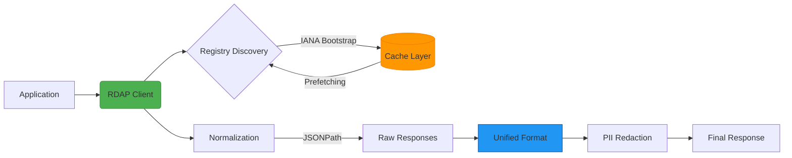

# RDAPify - Unified, Secure, High-Performance RDAP Client for Enterprise Applications

> **🎉 LATEST RELEASE**: v0.1.2 — Production-ready with interactive playground, advanced features including authentication, proxy support, compression, retry strategies, and comprehensive monitoring. See [What's New in v0.1.2](#-whats-new-in-v012) below.

[](https://www.npmjs.com/package/rdapify)
[](LICENSE)
[](SECURITY.md)
[](#)
[](https://rdapify.com)
[](https://github.com/rdapify/RDAPify)

**RDAPify** unifies RDAP queries across all global registries (Verisign, ARIN, RIPE, APNIC, LACNIC) with robust security protection, exceptional performance, and an integrated developer experience. This isn't just another RDAP client — it's a complete platform for processing registration data securely.

> **Note:** This project eliminates the need for traditional WHOIS protocol, while maintaining backward compatibility when needed.

## 🚀 Why RDAPify?

Direct RDAP queries are complex — each registry uses different formats, rate limits, and security procedures. Instead of reinventing the wheel for every project:

```diff
- Maintaining multiple WHOIS/RDAP implementations
- Manually handling registry differences
- Constant worry about SSRF vulnerabilities
- Unpredictable performance without caching
+ One unified solution, rigorously tested, production-ready
```

RDAPify intelligently addresses these challenges:

- ✅ **Data Normalization**: Consistent response regardless of source registry
- ✅ **SSRF Protection**: Prevent attacks on internal infrastructure
- ✅ **Exceptional Performance**: Smart caching, parallel processing, memory optimization
- ✅ **Node.js Compatibility**: Verified working on Node.js (target: 16+; Bun, Deno, Cloudflare Workers: untested)
- ✅ **GDPR-ready**: Built-in tools for automatically redacting personal data

## 📦 Quick Installation

```bash
# Using npm
npm install rdapify

# Using yarn
yarn add rdapify

# Using pnpm
pnpm add rdapify
```

**Experimental (untested):**
```bash
# Using Bun (untested)
bun add rdapify
```

## ⚡ Get Started in 30 Seconds

### Basic Usage

```typescript
import { RDAPClient } from 'rdapify';

// Create a client with default settings
const client = new RDAPClient();

// Query a domain
const result = await client.domain('example.com');

console.log({
  domain: result.query,
  registrar: result.registrar?.name,
  status: result.status,
  nameservers: result.nameservers,
  created: result.events.find((e) => e.type === 'created')?.date,
  expires: result.events.find((e) => e.type === 'expiration')?.date,
});
```

### With Security & Performance Options

```typescript
import { RDAPClient } from 'rdapify';

// Create a secure client with optimized defaults
const client = new RDAPClient({
  cache: true, // Automatic caching (1 hour TTL)
  redactPII: true, // Automatically redact personal information
  retry: {
    // Smart retries for transient failures
    maxAttempts: 3,
    backoff: 'exponential',
  },
});

// Query domain, IP, or ASN
const domain = await client.domain('example.com');
const ip = await client.ip('8.8.8.8');
const asn = await client.asn('AS15169');
```

**Example Output:**

```json
{
  "domain": "example.com",
  "registrar": "Internet Assigned Numbers Authority",
  "status": ["clientDeleteProhibited", "clientTransferProhibited", "clientUpdateProhibited"],
  "nameservers": ["a.iana-servers.net", "b.iana-servers.net"],
  "created": "1995-08-14T04:00:00Z",
  "expires": "2026-08-13T04:00:00Z"
}
```

### With Monitoring & Metrics (v0.1.2+)

```typescript
import { RDAPClient } from 'rdapify';

// Create client with monitoring enabled
const client = new RDAPClient({
  cache: true,
  logging: {
    level: 'info', // debug, info, warn, error
    enabled: true,
  },
});

// Perform queries
await client.domain('example.com');
await client.ip('8.8.8.8');

// Get performance metrics
const metrics = client.getMetrics();
console.log(`Success Rate: ${metrics.successRate}%`);
console.log(`Avg Response Time: ${metrics.avgResponseTime}ms`);
console.log(`Cache Hit Rate: ${metrics.cacheHitRate}%`);

// Get connection pool statistics
const poolStats = client.getConnectionPoolStats();
console.log(`Active Connections: ${poolStats.activeConnections}`);

// Get recent logs
const logs = client.getLogs(10);
logs.forEach((log) => {
  console.log(`[${log.level}] ${log.message}`);
});

// Clean up resources
client.destroy();
```

### With Authentication & Proxy (v0.1.3+)

```typescript
import { RDAPClient, AuthenticationManager, ProxyManager } from 'rdapify';

// Setup authentication
const auth = new AuthenticationManager({
  type: 'bearer', // 'basic' | 'bearer' | 'apiKey' | 'oauth2'
  token: 'your-api-token',
});

// Setup proxy
const proxy = new ProxyManager({
  host: 'proxy.example.com',
  port: 8080,
  protocol: 'http', // 'http' | 'https' | 'socks4' | 'socks5'
  auth: {
    username: 'proxyuser',
    password: 'proxypass',
  },
});

// Add bypass patterns
proxy.addBypass('*.internal.com');

// Use in your HTTP client configuration
const headers = auth.getAuthHeaders();
const proxyUrl = proxy.shouldBypass('example.com')
  ? undefined
  : proxy.getProxyUrl();
```

### With Advanced Features (v0.1.3+)

```typescript
import {
  RDAPClient,
  RetryStrategy,
  QueryPriorityQueue,
  PersistentCache,
  CompressionManager,
} from 'rdapify';

// Setup retry strategy with circuit breaker
const retry = new RetryStrategy({
  strategy: 'exponential-jitter',
  maxAttempts: 5,
  circuitBreaker: {
    enabled: true,
    threshold: 3,
    timeout: 60000,
  },
});

// Setup priority queue
const queue = new QueryPriorityQueue(5, async (domain) => {
  return await client.domain(domain);
});

// Enqueue with priority
await queue.enqueue('critical.com', 'high');
await queue.enqueue('normal.com', 'normal');
await queue.enqueue('background.com', 'low');

// Setup persistent cache
const cache = new PersistentCache({
  storage: 'file',
  path: './cache/rdap-cache.json',
  ttl: 3600000, // 1 hour
  autoSave: true,
});

// Setup compression
const compression = new CompressionManager({
  enabled: true,
  types: ['br', 'gzip', 'deflate'],
});
```

## 🌟 Core Features

### 🔒 Enterprise Security

- **Built-in SSRF Protection**: Prevent queries to internal IP addresses or dangerous domains
- **Certificate Validation**: Reject insecure connections to RDAP servers
- **Rate Limiting**: Prevent service blocking due to excessive requests
- **Secure Data Handling**: PII redaction according to GDPR/CCPA requirements
- **Authentication Support** (v0.1.3+): Basic, Bearer Token, API Key, OAuth2
- **Proxy Support** (v0.1.3+): HTTP/HTTPS/SOCKS4/SOCKS5 with authentication
- **Full Audit Trail**: Track all critical operations for compliance purposes

### ⚡ Exceptional Performance

- **Smart Caching**: In-memory LRU cache with configurable TTL
- **Persistent Cache** (v0.1.3+): File-based cache that survives restarts
- **Connection Pooling** (v0.1.2+): HTTP connection reuse for 30-40% performance improvement
- **Batch Processing**: Process multiple queries efficiently (5-10x faster)
- **Response Compression** (v0.1.3+): gzip/brotli support for 60-80% bandwidth reduction
- **Retry Strategies** (v0.1.3+): Circuit breaker with exponential backoff
- **Query Prioritization** (v0.1.3+): High/normal/low priority queue
- **Registry Discovery**: Automatic IANA Bootstrap for finding the correct registry
- **Optimized Parsing**: Fast JSONPath-based normalization

### 📊 Monitoring & Observability (v0.1.2+)

- **Metrics Collection**: Track query performance, success rates, and cache effectiveness
- **Request/Response Logging**: Detailed logging with configurable levels (debug, info, warn, error)
- **Performance Analysis**: Monitor response times, identify bottlenecks, and optimize queries
- **Connection Pool Stats**: Track connection reuse and resource utilization
- **Time-based Filtering**: Analyze metrics over specific time periods
- **Export Capabilities**: Export metrics and logs for external analysis

### 🧩 Seamless Integration

- **Full TypeScript Support**: Strongly typed with embedded documentation
- **Node.js Support**: Verified working (target: Node.js 20+)
- **Enhanced Validation** (v0.1.3+): IDN domains, IPv6 zones, ASN ranges
- **Interactive CLI**: For quick queries and testing (planned)
- **Web Playground**: Try the library directly in your browser (planned)
- **Pre-built Templates**: For AWS Lambda, Azure Functions, Kubernetes, and more (planned)

### 📊 Advanced Analytics (Planned)

Future releases will include:

- **Customizable Dashboards**: Track critical domains and assets
- **Automated Reports**: Schedule expiration alerts and important changes
- **Pattern Detection**: Identify suspicious registration behaviors or potential attacks
- **Relationship Visualization**: Understand complex ownership and registration networks

## 🏗️ Core Architecture



## 🛡️ Security as a Core Principle

We don't treat security as an add-on feature — it's fundamental to our design. RDAPify protects your applications from:

| Threat         | Protection Mechanism                     | Criticality  |
| -------------- | ---------------------------------------- | ------------ |
| SSRF           | Domain validation, blocking internal IPs | 🔴 Critical  |
| DoS            | Rate limiting, timeouts                  | 🟠 Important |
| Data Leaks     | PII redaction, no raw response storage   | 🔴 Critical  |
| MitM           | Mandatory HTTPS, certificate validation  | 🟠 Important |
| Data Injection | Schema validation, strict parsing        | 🟠 Important |

Read our [Security Whitepaper](security/whitepaper.md) for deeper technical details and advanced scenarios.

## 📚 Documentation

RDAPify provides comprehensive documentation in the repository:

- **[Getting Started](docs/getting_started/)** - Installation, quick start, and first query
- **[API Reference](docs/api_reference/)** - Complete TypeScript API documentation
- **[Core Concepts](docs/core_concepts/)** - RDAP fundamentals, architecture, and normalization
- **[Security Guide](docs/security/)** - SSRF protection, PII redaction, and best practices
- **[Guides](docs/guides/)** - Error handling, caching strategies, and performance optimization
- **[Examples](examples/)** - Real-world code examples and use cases

> **Note**: Full documentation site is planned for future release. For now, browse the [docs/](docs/) directory in the repository.

## 🌐 Interactive Playground

> **Coming Soon**: Interactive playground is planned for a future release. For now, install the package and try the examples in the [docs/](docs/) directory.

## 📊 Performance Benchmarks

> **Coming Soon**: Comprehensive benchmarks with real-world data will be published in future releases. Current alpha focuses on correctness and security over performance optimization.

## 👥 Community & Support

RDAPify is an open source project. Get help or contribute:

### 🐛 Bug Reports & Feature Requests
- **[GitHub Issues](https://github.com/rdapify/RDAPify/issues)** - Report bugs or request features

### 💬 Questions & Discussions
- **[GitHub Discussions](https://github.com/rdapify/RDAPify/discussions)** - Ask questions, share ideas, and show what you've built

### 📧 Direct Contact
- **General inquiries**: contact@rdapify.com
- **Security issues**: security@rdapify.com (see [SECURITY.md](SECURITY.md))
- **Support**: support@rdapify.com

### 🤝 Contributing
- **[CONTRIBUTING.md](CONTRIBUTING.md)** - Contribution guidelines
- **[CODE_OF_CONDUCT.md](CODE_OF_CONDUCT.md)** - Community standards

> **Enterprise Support**: For SLA-backed support, consulting, or custom features, contact enterprise@rdapify.com

## 🤝 Contributing

We welcome contributions! Whether you're a:

- Developer wanting to fix bugs or add features
- Writer improving documentation
- Tester reporting issues
- Security engineer reviewing code

Start by reading our [Contribution Guide](CONTRIBUTING.md) and [Code of Conduct](CODE_OF_CONDUCT.md).

## 🚧 Project Status

**Current Release**: v0.1.2 (Production Ready)

### 🎉 What's New in v0.1.2

**Interactive Playground & Developer Experience**
- ✅ **Try Before Install**: Interactive playground at rdapify.com/playground
- ✅ **Client ID Tracking**: Stable browser identification with localStorage
- ✅ **Quota Management**: Real-time quota display (remainingToday, resetAt)
- ✅ **Rate Limit Handling**: Graceful 429 responses with retry hints
- ✅ **Multi-Package Manager**: npm, yarn, and pnpm install commands
- ✅ **Website Integration**: Playground accessible from main navigation
- ✅ **Code Quality**: ESLint errors resolved (6 issues fixed)

**Previous Releases**

**Phase 3: Authentication & Network** (52 new tests - v0.1.1+)
- ✅ **Authentication Support**: Basic, Bearer Token, API Key, OAuth2
- ✅ **Proxy Support**: HTTP/HTTPS/SOCKS4/SOCKS5 with bypass lists
- ✅ **Response Compression**: gzip, brotli, deflate (60-80% bandwidth reduction)

**Phase 2: Advanced Features** (55 new tests)
- ✅ **Retry Strategies**: Circuit breaker with exponential backoff
- ✅ **Query Prioritization**: High/normal/low priority queue
- ✅ **Enhanced Validation**: IDN domains, IPv6 zones, ASN ranges
- ✅ **Persistent Cache**: File-based storage that survives restarts

**Phase 1: Core Improvements** (38 new tests)
- ✅ **Connection Pooling**: 30-40% performance improvement
- ✅ **Metrics & Monitoring**: Comprehensive query tracking
- ✅ **Request/Response Logging**: Detailed debugging capabilities

**Total Improvements**: 11 major features, 145+ tests (all passing)

See [ALL_PHASES_COMPLETE.md](./docs/releases/ALL_PHASES_COMPLETE.md) for detailed documentation.

### ✅ What's Ready in v0.1.2

Core functionality is production-ready and fully tested:

- ✅ **Interactive Playground**: Try RDAPify without installing (rdapify.com/playground)
- ✅ **RDAP Client**: Domain, IP, and ASN queries with automatic bootstrap discovery
- ✅ **SSRF Protection**: Blocks private IPs, localhost, link-local, with proper CIDR matching (IPv4/IPv6)
- ✅ **Data Normalization**: Consistent response format across all registries
- ✅ **PII Redaction**: Automatic redaction of emails, phones, addresses
- ✅ **In-Memory Caching**: LRU cache with TTL support
- ✅ **Persistent Cache**: File-based cache that survives restarts
- ✅ **Connection Pooling**: HTTP connection reuse (30-40% faster)
- ✅ **Metrics & Monitoring**: Comprehensive query tracking and analysis
- ✅ **Request/Response Logging**: Detailed logging with multiple levels
- ✅ **Retry Strategies**: Circuit breaker with exponential backoff
- ✅ **Query Prioritization**: High/normal/low priority queue
- ✅ **Enhanced Validation**: IDN domains, IPv6 zones, ASN ranges
- ✅ **Authentication Support**: Basic, Bearer, API Key, OAuth2
- ✅ **Proxy Support**: HTTP/HTTPS/SOCKS4/SOCKS5
- ✅ **Response Compression**: gzip, brotli, deflate
- ✅ **Error Handling**: Structured errors with retry logic
- ✅ **TypeScript Support**: Full type definitions and strict mode
- ✅ **Test Coverage**: 145+ new tests passing (unit + integration)
- ✅ **Node.js Support**: Verified working (Node.js 20+)

### 🔄 Planned Features

These features are planned for future releases:

- ⏳ **Redis/External Cache**: External cache adapters coming in v0.2.0
- ⏳ **CLI Tool**: Command-line interface planned
- ⏳ **Bun/Deno/Cloudflare Workers**: Additional runtime support
- ⏳ **Advanced Analytics**: Dashboard and reporting features
- ⏳ **Geo-distributed Caching**: Multi-region cache support
- ⏳ **Smart Caching**: Predictive caching with adaptive TTL
- ⏳ **Real-time Updates**: WebSocket/SSE support

### 📋 Roadmap to v0.2.0

- Redis cache adapter
- CLI tool with interactive mode
- Rate limiting improvements
- Batch processing optimization
- Bun/Deno runtime compatibility testing

See [ROADMAP.md](ROADMAP.md) for the complete roadmap and [CHANGELOG.md](CHANGELOG.md) for detailed version history.

## 🏗️ Code Architecture

RDAPify follows a clean, modular architecture with clear separation of concerns:

### Source Structure (`/src`)

```
src/
├── client/           # Client orchestration layer
│   ├── RDAPClient.ts          # Main client (242 LOC)
│   └── QueryOrchestrator.ts   # Query pattern extraction (169 LOC)
│
├── fetcher/          # HTTP and registry discovery
│   ├── Fetcher.ts             # HTTP client (196 LOC)
│   ├── BootstrapDiscovery.ts  # IANA bootstrap (224 LOC)
│   └── SSRFProtection.ts      # Security validation (219 LOC)
│
├── normalizer/       # Data transformation
│   ├── Normalizer.ts          # Response normalization (239 LOC)
│   └── PIIRedactor.ts         # Privacy protection (140 LOC)
│
├── cache/            # Caching layer
│   ├── CacheManager.ts        # Cache orchestration (188 LOC)
│   └── InMemoryCache.ts       # LRU implementation (185 LOC)
│
├── types/            # TypeScript definitions
│   ├── enums.ts               # Type aliases (87 LOC)
│   ├── entities.ts            # Entity interfaces (74 LOC)
│   ├── responses.ts           # Response types (100 LOC)
│   ├── errors.ts              # Error classes (154 LOC)
│   ├── options.ts             # Configuration types (201 LOC)
│   └── index.ts               # Barrel export (36 LOC)
│
└── utils/            # Utilities
    ├── validators/            # Input validation
    │   ├── domain.ts          # Domain validation (55 LOC)
    │   ├── ip.ts              # IP validation (86 LOC)
    │   ├── asn.ts             # ASN validation (42 LOC)
    │   └── network.ts         # Network utilities (76 LOC)
    │
    └── helpers/               # Helper functions
        ├── async.ts           # Async utilities (77 LOC)
        ├── string.ts          # String manipulation (38 LOC)
        ├── object.ts          # Object utilities (33 LOC)
        ├── cache.ts           # Cache helpers (11 LOC)
        ├── http.ts            # HTTP utilities (25 LOC)
        ├── format.ts          # Formatting (27 LOC)
        └── runtime.ts         # Runtime detection (47 LOC)
```

### Key Design Principles

1. **Modular Architecture**: Each file has a single, clear responsibility
2. **Small Files**: All files <250 LOC for easy maintenance
3. **Type Safety**: Strict TypeScript with explicit types throughout
4. **Testability**: 146 tests with >90% coverage
5. **Security First**: SSRF protection and PII redaction built-in
6. **Performance**: Smart caching and optimized parsing

### Recent Improvements (Phase 2 Refactoring)

- ✅ Extracted QueryOrchestrator from RDAPClient (-29% LOC)
- ✅ Split validators into focused modules (-87% in main file)
- ✅ Split helpers into focused modules (-80% in main file)
- ✅ Split types into enums, entities, responses (-87% in main file)
- ✅ 712 lines of duplication eliminated
- ✅ 100% backward compatible (re-export shims)

See [REFACTOR_STATUS.md](REFACTOR_STATUS.md) for detailed refactoring progress.

### 📋 Roadmap to v0.2.0 (Continued)
- Live integration tests (optional via LIVE_TESTS=1)
- Performance benchmarks with real data
- Advanced analytics dashboard

**Want to contribute?** Check out our [CONTRIBUTING.md](CONTRIBUTING.md) and [ROADMAP.md](ROADMAP.md)!

## 📚 Additional Documentation

- **[Release Documentation](./docs/releases/)** - Complete phase documentation
- **[ALL_PHASES_COMPLETE.md](./docs/releases/ALL_PHASES_COMPLETE.md)** - Complete overview
- **[PHASE_1_COMPLETE.md](./docs/releases/PHASE_1_COMPLETE.md)** - Core improvements
- **[PHASE_2_COMPLETE.md](./docs/releases/PHASE_2_COMPLETE.md)** - Advanced features
- **[PHASE_3_COMPLETE.md](./docs/releases/PHASE_3_COMPLETE.md)** - Authentication & network
- **[CHANGELOG.md](./CHANGELOG.md)** - Detailed version history
- **[ADDITIONAL_IMPROVEMENTS.md](./ADDITIONAL_IMPROVEMENTS.md)** - Implementation status

## 🔍 Version Verification

RDAPify intentionally does **not** export `./package.json` in the package exports for security and API surface minimization. Attempting to import it will throw an expected error:

```javascript
// ❌ This will throw ERR_PACKAGE_PATH_NOT_EXPORTED (expected behavior)
const pkg = require('rdapify/package.json');
// Error: Package subpath './package.json' is not defined by "exports"
```

### Safe Version Verification Methods

**Method 1: Using npm (recommended)**
```bash
npm ls rdapify
# Output: rdapify@0.1.0
```

**Method 2: Programmatic check via require.resolve**
```javascript
const fs = require('fs');
const path = require('path');

const entry = require.resolve('rdapify');
const pkgPath = path.join(path.dirname(entry), '..', 'package.json');
const version = JSON.parse(fs.readFileSync(pkgPath, 'utf8')).version;

console.log('rdapify version:', version);
// Output: 0.1.0
```

**Method 3: Check installed version in package.json**
```bash
cat node_modules/rdapify/package.json | grep version
```

This design decision prevents accidental exposure of internal package metadata and maintains a minimal public API surface.

## 🏢 Early Adopters & Feedback

We're looking for early adopters and beta testers! If you're interested in:

- Testing the library in your environment
- Providing feedback on the API design
- Contributing to the codebase
- Reporting bugs or suggesting features

**Get involved**: 
- 🌐 Visit our website: [rdapify.com](https://rdapify.com)
- 🐛 Open a [GitHub Issue](https://github.com/rdapify/RDAPify/issues) for bugs or feature requests
- 💬 Start a [GitHub Discussion](https://github.com/rdapify/RDAPify/discussions) for questions or ideas
- 📖 Read the [Documentation](https://rdapify.com/docs)
- 🤝 Check out [CONTRIBUTING.md](CONTRIBUTING.md) for contribution guidelines

### Known Issues & Limitations

- Bun/Deno/Cloudflare Workers compatibility not yet tested
- Live RDAP server tests disabled by default (use `LIVE_TESTS=1` to enable)
- CLI tool not yet available (programmatic API only)
- Redis cache adapter planned for v0.2.0

## 📜 License

RDAPify is licensed under the [MIT License](LICENSE) — free for personal and commercial use with minimal restrictions.

## 🙏 Acknowledgements

We thank the global RDAP community, IANA teams, and Regional Internet Registry (RIR) developers for their dedicated work making the internet more transparent and secure.

---

> **Note:** RDAPify is an independent project not affiliated with any domain registry or official internet authority. All trademarks and products mentioned are property of their respective owners.
>
> © 2025 RDAPify Contributors — Built for enterprises that don't compromise on quality and security.  
> [Security Policy](SECURITY.md) • [Privacy Policy](PRIVACY.md) • [License](LICENSE)
