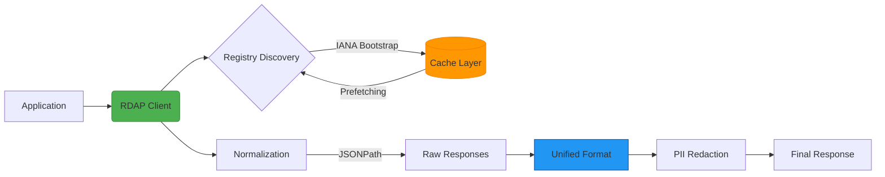

# RDAPify - Unified, Secure, High-Performance RDAP Client for Enterprise Applications

> **⚠️ ALPHA RELEASE**: This is v0.1.0-alpha.1 — core functionality is working and tested, but some advanced features are still in development. See [What's Ready](#-whats-ready-in-v010-alpha1) below.

[](https://www.npmjs.com/package/rdapify)
[](LICENSE)
[](SECURITY.md)

**RDAPify** unifies RDAP queries across all global registries (Verisign, ARIN, RIPE, APNIC, LACNIC) with robust security protection, exceptional performance, and an integrated developer experience. This isn't just another RDAP client — it's a complete platform for processing registration data securely.

> **Note:** This project eliminates the need for traditional WHOIS protocol, while maintaining backward compatibility when needed.

## 🚀 Why RDAPify?

Direct RDAP queries are complex — each registry uses different formats, rate limits, and security procedures. Instead of reinventing the wheel for every project:

```diff
- Maintaining multiple WHOIS/RDAP implementations
- Manually handling registry differences
- Constant worry about SSRF vulnerabilities
- Unpredictable performance without caching
+ One unified solution, rigorously tested, production-ready
```

RDAPify intelligently addresses these challenges:

- ✅ **Data Normalization**: Consistent response regardless of source registry
- ✅ **SSRF Protection**: Prevent attacks on internal infrastructure
- ✅ **Exceptional Performance**: Smart caching, parallel processing, memory optimization
- ✅ **Broad Compatibility**: Works on Node.js, Bun, Deno, Cloudflare Workers
- ✅ **GDPR-ready**: Built-in tools for automatically redacting personal data

## 📦 Quick Installation

```bash
# Using npm
npm install rdapify

# Using yarn
yarn add rdapify

# Using pnpm
pnpm add rdapify

# Using Bun
bun add rdapify
```

## ⚡ Get Started in 30 Seconds

```typescript
import { RDAPClient } from 'rdapify';

// Create a secure client with optimized defaults
const client = new RDAPClient({
  cache: true, // Automatic caching (1 hour TTL)
  redactPII: true, // Automatically redact personal information
  retry: {
    // Smart retries for transient failures
    maxAttempts: 3,
    backoff: 'exponential',
  },
});

// Query a domain
const result = await client.domain('example.com');

console.log({
  domain: result.query,
  registrar: result.registrar?.name,
  status: result.status,
  nameservers: result.nameservers,
  created: result.events.find((e) => e.type === 'created')?.date,
  expires: result.events.find((e) => e.type === 'expiration')?.date,
});
```

**Output:**

```json
{
  "domain": "example.com",
  "registrar": "Internet Assigned Numbers Authority",
  "status": ["clientDeleteProhibited", "clientTransferProhibited", "clientUpdateProhibited"],
  "nameservers": ["a.iana-servers.net", "b.iana-servers.net"],
  "created": "1995-08-14T04:00:00Z",
  "expires": "2026-08-13T04:00:00Z"
}
```

## 🌟 Core Features

### 🔒 Enterprise Security

- **Built-in SSRF Protection**: Prevent queries to internal IP addresses or dangerous domains
- **Certificate Validation**: Reject insecure connections to RDAP servers
- **Rate Limiting**: Prevent service blocking due to excessive requests
- **Secure Data Handling**: PII redaction according to GDPR/CCPA requirements
- **Full Audit Trail**: Track all critical operations for compliance purposes

### ⚡ Exceptional Performance

- **Advanced Caching**: Supports In-memory, Redis, and geo-distributed caching
- **Parallel Processing**: Handle 1000+ domains in seconds
- **Registry Discovery**: Automatic IANA Bootstrap for finding the correct registry
- **Offline Mode**: Work with cached data during network outages
- **Priority Queues**: Ensure critical requests are processed first

### 🧩 Seamless Integration

- **Full TypeScript Support**: Strongly typed with embedded documentation
- **Multi-environment Support**: Works on Node.js (16+), Bun, Deno, Cloudflare Workers
- **Interactive CLI**: For quick queries and testing
- **Web Playground**: Try the library directly in your browser
- **Pre-built Templates**: For AWS Lambda, Azure Functions, Kubernetes, and more

### 📊 Advanced Analytics

- **Customizable Dashboards**: Track critical domains and assets
- **Automated Reports**: Schedule expiration alerts and important changes
- **Pattern Detection**: Identify suspicious registration behaviors or potential attacks
- **Relationship Visualization**: Understand complex ownership and registration networks

## 🏗️ Core Architecture



## 🛡️ Security as a Core Principle

We don't treat security as an add-on feature — it's fundamental to our design. RDAPify protects your applications from:

| Threat         | Protection Mechanism                     | Criticality  |
| -------------- | ---------------------------------------- | ------------ |
| SSRF           | Domain validation, blocking internal IPs | 🔴 Critical  |
| DoS            | Rate limiting, timeouts                  | 🟠 Important |
| Data Leaks     | PII redaction, no raw response storage   | 🔴 Critical  |
| MitM           | Mandatory HTTPS, certificate validation  | 🟠 Important |
| Data Injection | Schema validation, strict parsing        | 🟠 Important |

Read our [Security Whitepaper](security/whitepaper.md) for deeper technical details and advanced scenarios.

## 📚 Documentation

RDAPify provides comprehensive documentation:

- **[Getting Started](docs/getting_started/)** - Installation and first query
- **[API Reference](docs/api_reference/)** - Complete TypeScript documentation
- **[Core Concepts](docs/core_concepts/)** - RDAP fundamentals and architecture
- **[Security Guide](docs/security/)** - SSRF protection and PII redaction
- **[Guides](docs/guides/)** - Error handling, caching, performance

> **Note**: Full documentation site (rdapify.com) is planned for future release. For now, browse the [docs/](docs/) directory.

## 🌐 Interactive Playground

> **Coming Soon**: Interactive playground is planned for a future release. For now, install the package and try the examples in the [docs/](docs/) directory.

## 📊 Performance Benchmarks

> **Coming Soon**: Comprehensive benchmarks with real-world data will be published in future releases. Current alpha focuses on correctness and security over performance optimization.

## 👥 Community & Support

RDAPify is an open source project. Get help or contribute:

- **[GitHub Issues](https://github.com/rdapify/rdapify/issues)** - Bug reports and feature requests
- **[GitHub Discussions](https://github.com/rdapify/rdapify/discussions)** - Questions and ideas
- **[CONTRIBUTING.md](CONTRIBUTING.md)** - Contribution guidelines

> **Note**: Community chat and enterprise support options are planned for future releases.

## 🤝 Contributing

We welcome contributions! Whether you're a:

- Developer wanting to fix bugs or add features
- Writer improving documentation
- Tester reporting issues
- Security engineer reviewing code

Start by reading our [Contribution Guide](CONTRIBUTING.md) and [Code of Conduct](CODE_OF_CONDUCT.md).

## 🚧 Project Status

**Current Release**: v0.1.0-alpha.1 (Alpha)

### ✅ What's Ready in v0.1.0-alpha.1

Core functionality is implemented and tested:

- ✅ **RDAP Client**: Domain, IP, and ASN queries with automatic bootstrap discovery
- ✅ **SSRF Protection**: Blocks private IPs, localhost, link-local, with proper CIDR matching (IPv4/IPv6)
- ✅ **Data Normalization**: Consistent response format across all registries
- ✅ **PII Redaction**: Automatic redaction of emails, phones, addresses
- ✅ **In-Memory Caching**: LRU cache with TTL support
- ✅ **Error Handling**: Structured errors with retry logic (exponential backoff)
- ✅ **TypeScript Support**: Full type definitions and strict mode
- ✅ **Test Coverage**: 146 tests passing (unit + integration with mocked fixtures)
- ✅ **Node.js Support**: Tested on Node.js 16+

### 🔄 Alpha Limitations

These features are documented but not yet implemented:

- ⏳ **Redis/External Cache**: Only in-memory cache available
- ⏳ **CLI Tool**: Not yet available (use programmatic API only)
- ⏳ **Interactive Playground**: Coming in future release
- ⏳ **Bun/Deno/Cloudflare Workers**: Not tested yet (Node.js only for now)
- ⏳ **Advanced Analytics**: Dashboard and reporting features planned
- ⏳ **Geo-distributed Caching**: Single-node caching only

### 📋 Roadmap to v0.2.0

- Redis cache adapter
- CLI tool with interactive mode
- Bun/Deno runtime compatibility testing
- Live integration tests (optional via LIVE_TESTS=1)
- Performance benchmarks with real data
- Rate limiting implementation

**Want to contribute?** Check out our [CONTRIBUTING.md](CONTRIBUTING.md) and [ROADMAP.md](ROADMAP.md)!

## 🏢 Early Adopters & Feedback

We're looking for early adopters and beta testers! If you're interested in:

- Testing the library in your environment
- Providing feedback on the API design
- Contributing to the codebase

**Get involved**: Open a [GitHub Issue](https://github.com/rdapify/rdapify/issues) or [Discussion](https://github.com/rdapify/rdapify/discussions)

## 📜 License

RDAPify is licensed under the [MIT License](LICENSE) — free for personal and commercial use with minimal restrictions.

## 🙏 Acknowledgements

We thank the global RDAP community, IANA teams, and Regional Internet Registry (RIR) developers for their dedicated work making the internet more transparent and secure.

---

> **Note:** RDAPify is an independent project not affiliated with any domain registry or official internet authority. All trademarks and products mentioned are property of their respective owners.
>
> © 2025 RDAPify Contributors — Built for enterprises that don't compromise on quality and security.  
> [Security Policy](SECURITY.md) • [Privacy Policy](PRIVACY.md) • [License](LICENSE)
