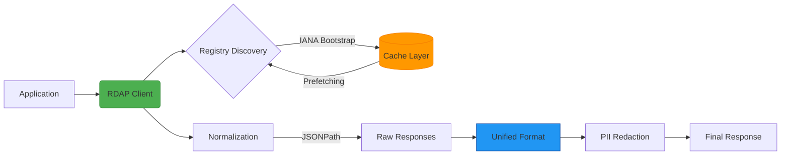

<p align="center">
  
</p>
<h1 align="center">RDAPify</h1>
<p align="center"><strong>Unified, Secure, High-Performance RDAP Client</strong></p>

[](https://www.npmjs.com/package/rdapify)
[](https://www.npmjs.com/package/rdapify)
[](LICENSE)
[](https://github.com/rdapify/RDAPify/actions/workflows/ci.yml)
[](https://codecov.io/gh/rdapify/RDAPify)
[](https://www.typescriptlang.org/)
[](https://github.com/rdapify/RDAPify/blob/main/CHANGELOG.md)
[](SECURITY.md)
[](https://rdapify.com)
[](https://github.com/rdapify/RDAPify)

> **Alpha software**
>
> RDAPify is under active development. Core functionality (RDAP queries, caching, SSRF protection) is stable and tested, but APIs and interfaces may change before v1.0. We welcome [issues](https://github.com/rdapify/RDAPify/issues) and [feedback](https://github.com/rdapify/RDAPify/discussions) from the community while the project evolves.

**RDAPify** unifies RDAP queries across all global registries (Verisign, ARIN, RIPE, APNIC, LACNIC) with robust security protection, exceptional performance, and an integrated developer experience. This isn't just another RDAP client — it's a complete platform for processing registration data securely.

> **Note:** This project eliminates the need for traditional WHOIS protocol, while maintaining backward compatibility when needed.

## 🚀 Why RDAPify?

Direct RDAP queries are complex — each registry uses different formats, rate limits, and security procedures. Instead of reinventing the wheel for every project:

```diff
- Maintaining multiple WHOIS/RDAP implementations
- Manually handling registry differences
- Constant worry about SSRF vulnerabilities
- Unpredictable performance without caching
+ One unified solution, rigorously tested, open source
```

RDAPify intelligently addresses these challenges:

- ✅ **Data Normalization**: Consistent response regardless of source registry
- ✅ **SSRF Protection**: Prevent attacks on internal infrastructure
- ✅ **Exceptional Performance**: Smart caching, parallel processing, memory optimization
- ✅ **Node.js Compatibility**: Verified working on Node.js 20+; Bun, Deno, and Cloudflare Workers also supported
- ✅ **GDPR-ready**: Built-in tools for automatically redacting personal data

## 📦 Quick Installation

```bash
# Using npm
npm install rdapify

# Using yarn
yarn add rdapify

# Using pnpm
pnpm add rdapify
```

```bash
# Using Bun
bun add rdapify
```

## ⚡ Get Started in 30 Seconds

### Basic Usage

```typescript
import { RDAPClient } from 'rdapify';

// Create a client with default settings
const client = new RDAPClient();

// Query a domain
const result = await client.domain('example.com');

console.log({
  domain: result.query,
  registrar: result.registrar?.name,
  status: result.status,
  nameservers: result.nameservers,
  created: result.events.find((e) => e.type === 'created')?.date,
  expires: result.events.find((e) => e.type === 'expiration')?.date,
});
```

### With Security & Performance Options

```typescript
import { RDAPClient } from 'rdapify';

// Create a secure client with optimized defaults
const client = new RDAPClient({
  cache: true, // Automatic caching (1 hour TTL)
  redactPII: true, // Automatically redact personal information
  retry: {
    // Smart retries for transient failures
    maxAttempts: 3,
    backoff: 'exponential',
  },
});

// Query domain, IP, ASN, nameserver, or entity
const domain = await client.domain('example.com');
const ip = await client.ip('8.8.8.8');
const asn = await client.asn('AS15169');
const ns = await client.nameserver('ns1.example.com');
const entity = await client.entity('ARIN-HN-1', 'https://rdap.arin.net/registry');
```

**Example Output:**

```json
{
  "domain": "example.com",
  "registrar": "Internet Assigned Numbers Authority",
  "status": ["clientDeleteProhibited", "clientTransferProhibited", "clientUpdateProhibited"],
  "nameservers": ["a.iana-servers.net", "b.iana-servers.net"],
  "created": "1995-08-14T04:00:00Z",
  "expires": "2026-08-13T04:00:00Z"
}
```

### With Nameserver & Entity Queries (v0.1.7+)

```typescript
import { RDAPClient } from 'rdapify';

const client = new RDAPClient();

// Query a nameserver — auto-discovers server via IANA DNS bootstrap
const ns = await client.nameserver('ns1.example.com');
console.log(ns.ldhName);        // "ns1.example.com"
console.log(ns.ipAddresses);    // { v4: ['93.184.216.34'], v6: [...] }
console.log(ns.status);         // ['active']

// Query an entity — requires explicit server URL (no global IANA bootstrap)
const entity = await client.entity('ARIN-HN-1', 'https://rdap.arin.net/registry');
console.log(entity.handle);     // "ARIN-HN-1"
console.log(entity.roles);      // ['registrar', 'technical']
```

### With Monitoring & Metrics (v0.1.2+)

```typescript
import { RDAPClient } from 'rdapify';

// Create client with monitoring enabled
const client = new RDAPClient({
  cache: true,
  logging: {
    level: 'info', // debug, info, warn, error
    enabled: true,
  },
});

// Perform queries
await client.domain('example.com');
await client.ip('8.8.8.8');

// Get performance metrics
const metrics = client.getMetrics();
console.log(`Success Rate: ${metrics.successRate}%`);
console.log(`Avg Response Time: ${metrics.avgResponseTime}ms`);
console.log(`Cache Hit Rate: ${metrics.cacheHitRate}%`);

// Get connection pool statistics
const poolStats = client.getConnectionPoolStats();
console.log(`Active Connections: ${poolStats.activeConnections}`);

// Get recent logs
const logs = client.getLogs(10);
logs.forEach((log) => {
  console.log(`[${log.level}] ${log.message}`);
});

// Clean up resources
client.destroy();
```

### With Authentication & Proxy (v0.1.2+)

```typescript
import { RDAPClient, AuthenticationManager, ProxyManager } from 'rdapify';

// Setup authentication
const auth = new AuthenticationManager({
  type: 'bearer', // 'basic' | 'bearer' | 'apiKey' | 'oauth2'
  token: 'your-api-token',
});

// Setup proxy
const proxy = new ProxyManager({
  host: 'proxy.example.com',
  port: 8080,
  protocol: 'http', // 'http' | 'https' | 'socks4' | 'socks5'
  auth: {
    username: 'proxyuser',
    password: 'proxypass',
  },
});

// Add bypass patterns
proxy.addBypass('*.internal.com');

// Use in your HTTP client configuration
const headers = auth.getAuthHeaders();
const proxyUrl = proxy.shouldBypass('example.com')
  ? undefined
  : proxy.getProxyUrl();
```

### With Advanced Features (v0.1.2+)

```typescript
import {
  RDAPClient,
  RetryStrategy,
  QueryPriorityQueue,
  PersistentCache,
  CompressionManager,
} from 'rdapify';

// Setup retry strategy with circuit breaker
const retry = new RetryStrategy({
  strategy: 'exponential-jitter',
  maxAttempts: 5,
  circuitBreaker: {
    enabled: true,
    threshold: 3,
    timeout: 60000,
  },
});

// Setup priority queue
const queue = new QueryPriorityQueue(5, async (domain) => {
  return await client.domain(domain);
});

// Enqueue with priority
await queue.enqueue('critical.com', 'high');
await queue.enqueue('normal.com', 'normal');
await queue.enqueue('background.com', 'low');

// Setup persistent cache
const cache = new PersistentCache({
  storage: 'file',
  path: './cache/rdap-cache.json',
  ttl: 3600000, // 1 hour
  autoSave: true,
});

// Setup compression
const compression = new CompressionManager({
  enabled: true,
  types: ['br', 'gzip', 'deflate'],
});
```

## 🌟 Core Features

### 🔒 Enterprise Security

- **Built-in SSRF Protection**: Prevent queries to internal IP addresses or dangerous domains
- **Certificate Validation**: Reject insecure connections to RDAP servers
- **Rate Limiting**: Prevent service blocking due to excessive requests
- **Secure Data Handling**: PII redaction according to GDPR/CCPA requirements
- **Authentication Support** (v0.1.1+): Basic, Bearer Token, API Key, OAuth2
- **Proxy Support** (v0.1.1+): HTTP/HTTPS/SOCKS4/SOCKS5 with authentication
- **Full Audit Trail**: Track all critical operations for compliance purposes

### ⚡ Exceptional Performance

- **Smart Caching**: In-memory LRU cache with configurable TTL
- **Persistent Cache** (v0.1.1+): File-based cache that survives restarts
- **Connection Pooling** (v0.1.2+): HTTP connection reuse for 30-40% performance improvement
- **Batch Processing**: Process multiple queries efficiently (5-10x faster)
- **Response Compression** (v0.1.1+): gzip/brotli support for 60-80% bandwidth reduction
- **Retry Strategies** (v0.1.1+): Circuit breaker with exponential backoff
- **Query Prioritization** (v0.1.1+): High/normal/low priority queue
- **Registry Discovery**: Automatic IANA Bootstrap for finding the correct registry
- **Optimized Parsing**: Fast JSONPath-based normalization

### 📊 Monitoring & Observability (v0.1.2+)

- **Metrics Collection**: Track query performance, success rates, and cache effectiveness
- **Request/Response Logging**: Detailed logging with configurable levels (debug, info, warn, error)
- **Performance Analysis**: Monitor response times, identify bottlenecks, and optimize queries
- **Connection Pool Stats**: Track connection reuse and resource utilization
- **Time-based Filtering**: Analyze metrics over specific time periods
- **Export Capabilities**: Export metrics and logs for external analysis

### 🧩 Seamless Integration

- **Full TypeScript Support**: Strongly typed with embedded documentation
- **Node.js 20+ Support**: Verified working (Node.js, Bun, Deno, Cloudflare Workers)
- **Enhanced Validation** (v0.1.1+): IDN domains, IPv6 zones, ASN ranges
- **Nameserver & Entity Queries** (v0.1.7+): `client.nameserver()` and `client.entity()` with full RDAP support
- **CLI Tool** (v0.1.7+): `rdapify domain/ip/asn/nameserver/entity` with `--json`, `--no-cache`, `--timeout`, `--server` flags
- **Web Playground**: Try RDAPify live at [rdapify.com/playground](https://rdapify.com/playground)
- **Pre-built Templates**: For AWS Lambda, Azure Functions, Kubernetes, and more (planned)

### 📊 Advanced Analytics (Planned)

Future releases will include:

- **Customizable Dashboards**: Track critical domains and assets
- **Automated Reports**: Schedule expiration alerts and important changes
- **Pattern Detection**: Identify suspicious registration behaviors or potential attacks
- **Relationship Visualization**: Understand complex ownership and registration networks

## 🏗️ Core Architecture


```mermaid
graph LR
A[Application] --> B(RDAP Client)
B --> C{Registry Discovery}
C -->|IANA Bootstrap| D[(Cache Layer)]
B --> E[Normalization]
E -->|JSONPath| F[Raw Responses]
F --> G[Unified Format]
G --> H[PII Redaction]
H --> I[Final Response]
D -->|Prefetching| C
style B fill:#4CAF50,stroke:#388E3C
style D fill:#FF9800,stroke:#F57C00
style G fill:#2196F3,stroke:#0D47A1
```

## 🛡️ Security as a Core Principle

We don't treat security as an add-on feature — it's fundamental to our design. RDAPify protects your applications from:

| Threat         | Protection Mechanism                     | Criticality  |
| -------------- | ---------------------------------------- | ------------ |
| SSRF           | Domain validation, blocking internal IPs | 🔴 Critical  |
| DoS            | Rate limiting, timeouts                  | 🟠 Important |
| Data Leaks     | PII redaction, no raw response storage   | 🔴 Critical  |
| MitM           | Mandatory HTTPS, certificate validation  | 🟠 Important |
| Data Injection | Schema validation, strict parsing        | 🟠 Important |

Read our [Security Whitepaper](security/whitepaper.md) for deeper technical details and advanced scenarios.

## 📚 Documentation

RDAPify provides comprehensive documentation in the repository:

- **[Getting Started](docs/getting_started/)** - Installation, quick start, and first query
- **[API Reference](docs/api_reference/)** - Complete TypeScript API documentation
- **[Core Concepts](docs/core_concepts/)** - RDAP fundamentals, architecture, and normalization
- **[Security Guide](docs/security/)** - SSRF protection, PII redaction, and best practices
- **[Guides](docs/guides/)** - Error handling, caching strategies, and performance optimization
- **[Examples](examples/)** - Real-world code examples and use cases

> **Note**: Full documentation site is planned for future release. For now, browse the [docs/](docs/) directory in the repository.

## 🌐 Interactive Playground

Try RDAPify directly in your browser — no installation required: **[rdapify.com/playground](https://rdapify.com/playground)**

## 📊 Performance Benchmarks

> **Coming Soon**: Comprehensive benchmarks with real-world data will be published in future releases. Current alpha focuses on correctness and security over performance optimization.

## 👥 Community & Support

RDAPify is an open source project. Get help or contribute:

### 🐛 Bug Reports & Feature Requests
- **[GitHub Issues](https://github.com/rdapify/RDAPify/issues)** - Report bugs or request features

### 💬 Questions & Discussions
- **[GitHub Discussions](https://github.com/rdapify/RDAPify/discussions)** - Ask questions, share ideas, and show what you've built

### 📧 Direct Contact
- **General inquiries**: contact@rdapify.com
- **Security issues**: security@rdapify.com (see [SECURITY.md](SECURITY.md))
- **Support**: support@rdapify.com

### 🤝 Contributing
- **[CONTRIBUTING.md](CONTRIBUTING.md)** - Contribution guidelines
- **[CODE_OF_CONDUCT.md](CODE_OF_CONDUCT.md)** - Community standards


## 🤝 Contributing

We welcome contributions! Whether you're a:

- Developer wanting to fix bugs or add features
- Writer improving documentation
- Tester reporting issues
- Security engineer reviewing code

Start by reading our [Contribution Guide](CONTRIBUTING.md) and [Code of Conduct](CODE_OF_CONDUCT.md).

## 🚧 Project Status

**Current Release**: v0.1.7 (Alpha)

### 🎉 What's New in v0.1.7

**Nameserver & Entity Query Support**
- ✅ **Nameserver Queries**: `client.nameserver('ns1.example.com')` — auto-discovery via IANA DNS bootstrap
- ✅ **Entity Queries**: `client.entity('ARIN-HN-1', serverUrl)` — contact/registrant/registrar lookup
- ✅ **CLI Extended**: `rdapify nameserver <hostname>`, `rdapify entity <handle> --server <url>`
- ✅ **New Types**: `NameserverResponse` and `EntityResponse` exported from main entry point
- ✅ **New Validators**: `validateNameserver`, `validateEntityHandle`, `normalizeNameserver`, `normalizeEntityHandle`
- ✅ **All query types** now support full pipeline: caching, middleware hooks, metrics, deduplication, PII redaction

### v0.1.6 — CLI Tool & Runtime Support
- ✅ **CLI Tool**: `rdapify domain <name>`, `rdapify ip <addr>`, `rdapify asn <num>` — zero external dependencies
- ✅ **CLI Flags**: `--json`, `--no-cache`, `--timeout <ms>`, `--version/-v`, `--help/-h`
- ✅ **Cloudflare Workers**: Full runtime detection and support (`isCloudflareWorkers()`)
- ✅ **Critical Redis Fix**: `RedisCache.clear()` no longer wipes the entire database

**v0.1.5 — Compliance & Middleware**
- ✅ **Redis Cache**: Production-ready Redis adapter with peer-dependency pattern
- ✅ **Middleware Hooks**: `beforeQuery`, `afterQuery`, `onError`, `onCacheHit`, `onCacheMiss`, `onRetry` lifecycle hooks
- ✅ **Query Deduplicator**: Collapses concurrent identical in-flight requests into a single Promise
- ✅ **Audit Logger**: GDPR/SOC2/CCPA-compliant audit trail with in-memory and file (NDJSON) adapters
- ✅ **Response Validator**: RFC 7483 schema validation with strict/lenient/off modes

**v0.1.4 — TypeScript Strict Mode**
- ✅ TypeScript strict mode throughout the entire codebase

**v0.1.3 — 15+ Defensive Bug Fixes**
- ✅ Normalizer null checks, BootstrapDiscovery NaN guard, Fetcher redirect validation
- ✅ ConnectionPool acquire timeout, PIIRedactor `structuredClone`, SSRFProtection IPv6 brackets
- ✅ MetricsCollector division-by-zero protection

**Previous Releases (v0.1.0–v0.1.2)**
- ✅ Authentication (Basic/Bearer/API Key/OAuth2), Proxy (HTTP/HTTPS/SOCKS4/SOCKS5), Compression (gzip/brotli/deflate)
- ✅ Retry strategies with circuit breaker, query prioritization, enhanced validation (IDN, IPv6 zones, ASN ranges)
- ✅ Connection pooling (30-40% faster), metrics & monitoring, request/response logging
- ✅ Persistent cache (file-based), interactive playground

See [CHANGELOG.md](CHANGELOG.md) for detailed version history.

### ✅ Full Feature Set (v0.1.7)

- ✅ **RDAP Client**: Domain, IP, ASN, Nameserver, and Entity queries with automatic IANA bootstrap discovery
- ✅ **CLI Tool**: Command-line interface with human-readable and JSON output (`domain`, `ip`, `asn`, `nameserver`, `entity`)
- ✅ **SSRF Protection**: Blocks private IPs, localhost, link-local, CIDR matching (IPv4/IPv6)
- ✅ **Data Normalization**: Consistent response format across all registries
- ✅ **PII Redaction**: Automatic redaction of emails, phones, addresses (GDPR/CCPA)
- ✅ **Audit Logging**: Compliance-grade audit trail (GDPR/SOC2/CCPA) with NDJSON file adapter
- ✅ **In-Memory Cache**: LRU cache with TTL support
- ✅ **Persistent Cache**: File-based cache that survives restarts
- ✅ **Redis Cache**: Production-ready Redis adapter
- ✅ **Connection Pooling**: HTTP connection reuse (30-40% faster)
- ✅ **Metrics & Monitoring**: Comprehensive query tracking and analysis
- ✅ **Request/Response Logging**: Structured logging with configurable levels
- ✅ **Retry Strategies**: Circuit breaker (closed/open/half-open) with exponential backoff
- ✅ **Query Prioritization**: High/normal/low priority queue
- ✅ **Query Deduplication**: Collapse concurrent identical requests into one
- ✅ **Middleware Hooks**: Lifecycle hooks for query pipeline customization
- ✅ **Response Validation**: RFC 7483 schema validation
- ✅ **Enhanced Validation**: IDN domains, IPv6 zones, ASN ranges
- ✅ **Authentication**: Basic, Bearer, API Key, OAuth2
- ✅ **Proxy Support**: HTTP/HTTPS/SOCKS4/SOCKS5 with bypass patterns
- ✅ **Response Compression**: gzip, brotli, deflate (60-80% bandwidth reduction)
- ✅ **Multi-runtime**: Node.js 20+, Bun, Deno, Cloudflare Workers
- ✅ **TypeScript Strict**: Full type definitions with strict mode
- ✅ **Test Coverage**: 34 test files, 620+ tests (unit + integration)

### 🔜 Coming in v0.1.8

- ⏳ **Domain Availability**: `client.checkAvailability('example.com')` — instant availability check via RDAP
- ⏳ **Bulk Availability**: `client.checkAvailabilityBatch(['a.com', 'b.com'])` — check multiple domains at once
- ⏳ **Live Integration Tests**: opt-in via `LIVE_TESTS=1` against real RDAP servers
- ⏳ **Advanced Bootstrap Config**: custom bootstrap servers, TTL overrides, redundancy fallback

### 📋 Roadmap to v0.2.0

- RDAP Testing CLI (`rdapify test server`, `rdapify test benchmark`)
- RDAP Extensions Registry (REGEXT support)
- Bootstrap Store Adapters (File, Redis, Database)
- Advanced Reporting (`client.generateReport()`)
- RFC 9083 / RFC 9535 support

See [ROADMAP.md](ROADMAP.md) for the complete roadmap and [CHANGELOG.md](CHANGELOG.md) for detailed version history.

## 🏗️ Code Architecture

RDAPify follows a clean, modular architecture with clear separation of concerns:

### Source Structure (`/src`)

RDAPify follows a hexagonal (ports & adapters) architecture:

```
src/
├── application/           # Application layer
│   ├── client/
│   │   └── RDAPClient.ts          # Main client entry point
│   ├── services/
│   │   ├── QueryOrchestrator.ts   # Query pipeline orchestration
│   │   ├── BatchProcessor.ts      # Concurrent batch processing
│   │   └── QueryPriority.ts       # Priority queue (high/normal/low)
│   ├── hooks/
│   │   └── MiddlewareHooks.ts     # Lifecycle hooks
│   └── deduplication/
│       └── QueryDeduplicator.ts   # In-flight request deduplication
│
├── infrastructure/        # Infrastructure layer
│   ├── http/
│   │   ├── Fetcher.ts             # HTTP client with SSRF validation
│   │   ├── BootstrapDiscovery.ts  # IANA bootstrap registry discovery
│   │   ├── Normalizer.ts          # Raw → normalized response transform
│   │   ├── RateLimiter.ts         # Token-bucket rate limiter
│   │   ├── ConnectionPool.ts      # HTTP connection reuse
│   │   ├── RetryStrategy.ts       # Retry + circuit breaker
│   │   ├── AuthenticationManager.ts  # Basic/Bearer/APIKey/OAuth2
│   │   ├── ProxyManager.ts        # HTTP/HTTPS/SOCKS proxy support
│   │   └── CompressionManager.ts  # gzip/brotli/deflate
│   ├── cache/
│   │   ├── InMemoryCache.ts       # LRU in-memory cache with TTL
│   │   ├── CacheManager.ts        # Cache backend dispatcher
│   │   ├── PersistentCache.ts     # File-backed JSON cache
│   │   └── RedisCache.ts          # Redis adapter (peer-dependency)
│   ├── security/
│   │   ├── SSRFProtection.ts      # RFC 1918 / link-local blocking
│   │   └── PIIRedactor.ts         # GDPR/CCPA PII redaction
│   ├── logging/
│   │   ├── Logger.ts              # Structured request/response logging
│   │   └── AuditLogger.ts         # Compliance audit trail (NDJSON)
│   ├── monitoring/
│   │   └── MetricsCollector.ts    # Query latency, success/error rates
│   └── validation/
│       └── ResponseValidator.ts   # RFC 7483 schema validation
│
├── shared/                # Shared kernel
│   ├── types/             # TypeScript types and interfaces
│   ├── errors/            # Typed error hierarchy (11 error classes)
│   └── utils/             # Validators, helpers, constants
│
├── core/ports/            # Interface contracts (hexagonal ports)
│
└── cli/
    └── index.ts           # CLI binary (rdapify domain/ip/asn)
```

### Key Design Principles

1. **Hexagonal Architecture**: Clean separation between application, infrastructure, and shared layers
2. **Ports & Adapters**: Interface-driven design for easy testing and swappable backends
3. **Security First**: SSRF protection and PII redaction built into the query pipeline
4. **Type Safety**: Strict TypeScript with explicit types throughout
5. **Compliance Ready**: Audit logging for GDPR/SOC2/CCPA requirements
6. **Multi-runtime**: Works on Node.js 20+, Bun, Deno, and Cloudflare Workers

## 📚 Additional Documentation

- **[Release Documentation](./docs/releases/)** - Complete phase documentation
- **[ALL_PHASES_COMPLETE.md](./docs/releases/ALL_PHASES_COMPLETE.md)** - Complete overview
- **[PHASE_1_COMPLETE.md](./docs/releases/PHASE_1_COMPLETE.md)** - Core improvements
- **[PHASE_2_COMPLETE.md](./docs/releases/PHASE_2_COMPLETE.md)** - Advanced features
- **[PHASE_3_COMPLETE.md](./docs/releases/PHASE_3_COMPLETE.md)** - Authentication & network
- **[CHANGELOG.md](./CHANGELOG.md)** - Detailed version history
- **[ADDITIONAL_IMPROVEMENTS.md](./ADDITIONAL_IMPROVEMENTS.md)** - Implementation status

## 🔍 Version Verification

RDAPify intentionally does **not** export `./package.json` in the package exports for security and API surface minimization. Attempting to import it will throw an expected error:

```javascript
// ❌ This will throw ERR_PACKAGE_PATH_NOT_EXPORTED (expected behavior)
const pkg = require('rdapify/package.json');
// Error: Package subpath './package.json' is not defined by "exports"
```

### Safe Version Verification Methods

**Method 1: Using npm (recommended)**
```bash
npm ls rdapify
# Output: rdapify@0.1.0
```

**Method 2: Programmatic check via require.resolve**
```javascript
const fs = require('fs');
const path = require('path');

const entry = require.resolve('rdapify');
const pkgPath = path.join(path.dirname(entry), '..', 'package.json');
const version = JSON.parse(fs.readFileSync(pkgPath, 'utf8')).version;

console.log('rdapify version:', version);
// Output: 0.1.0
```

**Method 3: Check installed version in package.json**
```bash
cat node_modules/rdapify/package.json | grep version
```

This design decision prevents accidental exposure of internal package metadata and maintains a minimal public API surface.

## 🏢 Early Adopters & Feedback

We're looking for early adopters and beta testers! If you're interested in:

- Testing the library in your environment
- Providing feedback on the API design
- Contributing to the codebase
- Reporting bugs or suggesting features

**Get involved**: 
- 🌐 Visit our website: [rdapify.com](https://rdapify.com)
- 🐛 Open a [GitHub Issue](https://github.com/rdapify/RDAPify/issues) for bugs or feature requests
- 💬 Start a [GitHub Discussion](https://github.com/rdapify/RDAPify/discussions) for questions or ideas
- 📖 Read the [Documentation](https://rdapify.com/docs)
- 🤝 Check out [CONTRIBUTING.md](CONTRIBUTING.md) for contribution guidelines

### Known Issues & Limitations

- Live RDAP server tests disabled by default (use `LIVE_TESTS=1` to enable)
- Advanced analytics dashboard planned for v0.2.0
- Geo-distributed caching planned for v0.2.0

## 📜 License

RDAPify is licensed under the [MIT License](LICENSE) — free for personal and commercial use with minimal restrictions.

## 🙏 Acknowledgements

We thank the global RDAP community, IANA teams, and Regional Internet Registry (RIR) developers for their dedicated work making the internet more transparent and secure.

---

> **Note:** RDAPify is an independent project not affiliated with any domain registry or official internet authority. All trademarks and products mentioned are property of their respective owners.
>
> © 2025 RDAPify Contributors — Built for enterprises that don't compromise on quality and security.  
> [Security Policy](SECURITY.md) • [Privacy Policy](PRIVACY.md) • [License](LICENSE)
