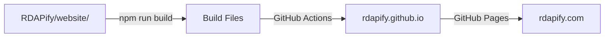

# 📦 دليل المستودعات - RDAPify

**التاريخ**: 24 يناير 2025

---

## 📂 هيكل المستودعات

لديك **مستودعين منفصلين** يعملان معاً:

### 1️⃣ المستودع الرئيسي (RDAPify)
```
📁 /home/haza/dev/rdapify/RDAPify
🔗 https://github.com/rdapify/RDAPify
```

**الغرض**: الكود المصدري والتطوير

**يحتوي على**:
- ✅ الكود المصدري (`src/`)
- ✅ الاختبارات (`tests/`)
- ✅ التوثيق (`docs/`)
- ✅ الأمثلة (`examples/`)
- ✅ ملفات الإعداد
- ✅ GitHub Actions workflows
- ✅ **مصدر الموقع** (`website/`)

**الحالة الحالية**:
- ✅ متصل بـ GitHub
- ⏳ لديك تعديلات غير محفوظة (4 ملفات جديدة)

---

### 2️⃣ مستودع الموقع (rdapify.github.io)
```
📁 /home/haza/dev/rdapify/rdapify.github.io
🔗 https://github.com/rdapify/rdapify.github.io
```

**الغرض**: استضافة الموقع المبني (GitHub Pages)

**يحتوي على**:
- ✅ `CNAME` - ملف النطاق المخصص (rdapify.com)
- ✅ `README.md` - وصف المستودع
- ⏳ سيحتوي على الملفات المبنية من Docusaurus

**الحالة الحالية**:
- ✅ متصل بـ GitHub
- ✅ نظيف (لا توجد تعديلات)
- ✅ CNAME مُعد بشكل صحيح

---

## 🔄 كيف يعملان معاً؟



### سير العمل:

1. **التطوير** في `RDAPify/website/`
   - تعديل الملفات في `website/src/`
   - تحديث التوثيق في `docs/`

2. **البناء** (Build)
   - GitHub Actions يبني الموقع تلقائياً
   - أو يدوياً: `cd website && npm run build`

3. **النشر** (Deploy)
   - GitHub Actions ينسخ الملفات المبنية
   - يرفعها إلى `rdapify.github.io`

4. **الاستضافة** (Hosting)
   - GitHub Pages يستضيف من `rdapify.github.io`
   - متاح على `rdapify.com`

---

## 🚀 الخطوات التالية

### الخطوة 1: حفظ التعديلات في المستودع الرئيسي

```bash
cd /home/haza/dev/rdapify/RDAPify

# إضافة الملفات الجديدة
git add GITHUB_ORG_READY_AR.md
git add GITHUB_ORG_STATUS.md
git add ORGANIZATION_SETUP_SUMMARY.md
git add .project/internal/planning/GITHUB_ORG_SETUP_COMPLETE.md
git add .project/internal/planning/README.md

# حفظ التعديلات
git commit -m "docs: add GitHub organization setup guides"

# رفع للمستودع
git push origin main
```

### الخطوة 2: إعداد GitHub Actions

اتبع الخطوات في **GITHUB_ORG_READY_AR.md**:

1. إنشاء Personal Access Token
2. إضافة `DEPLOY_TOKEN` للمستودع
3. تفعيل GitHub Pages
4. اختبار Deployment

### الخطوة 3: اختبار أول Deployment

بعد إعداد GitHub Actions، يمكنك اختبار:

```bash
# الطريقة 1: تشغيل يدوي من GitHub
# اذهب إلى: https://github.com/rdapify/RDAPify/actions
# اختر "Deploy Website" → "Run workflow"

# الطريقة 2: عمل تعديل بسيط
cd /home/haza/dev/rdapify/RDAPify
echo "# Test" >> website/README.md
git add website/README.md
git commit -m "test: trigger deployment"
git push
```

### الخطوة 4: التحقق من النجاح

بعد نجاح الـ deployment:

```bash
# تحقق من مستودع الموقع
cd /home/haza/dev/rdapify/rdapify.github.io
git pull

# يجب أن ترى ملفات جديدة من الـ build
ls -la
```

---

## 📋 الأوامر المفيدة

### في المستودع الرئيسي (RDAPify)

```bash
cd /home/haza/dev/rdapify/RDAPify

# تحديث من GitHub
git pull

# بناء الموقع محلياً
cd website
npm install
npm run build

# معاينة الموقع محلياً
npm start
# سيفتح على: http://localhost:3000

# رفع التعديلات
git add .
git commit -m "your message"
git push
```

### في مستودع الموقع (rdapify.github.io)

```bash
cd /home/haza/dev/rdapify/rdapify.github.io

# تحديث من GitHub (بعد deployment)
git pull

# عرض آخر commit
git log -1

# عرض الملفات
ls -la
```

---

## 🔍 فهم الملفات

### في RDAPify/website/

```
website/
├── src/              # مصدر الموقع (React components)
├── docs/             # رابط رمزي للتوثيق
├── static/           # ملفات ثابتة (صور، CNAME)
├── docusaurus.config.js  # إعدادات Docusaurus
├── sidebars.js       # هيكل القوائم الجانبية
└── package.json      # Dependencies
```

### في rdapify.github.io/ (بعد Deployment)

```
rdapify.github.io/
├── index.html        # الصفحة الرئيسية
├── docs/             # صفحات التوثيق
├── assets/           # CSS, JS, صور
├── CNAME             # ملف النطاق المخصص
└── README.md         # وصف المستودع
```

---

## ⚠️ ملاحظات مهمة

### لا تعدل في rdapify.github.io يدوياً!

❌ **خطأ**:
```bash
cd /home/haza/dev/rdapify/rdapify.github.io
# تعديل الملفات هنا
```

✅ **صحيح**:
```bash
cd /home/haza/dev/rdapify/RDAPify/website
# عدل الملفات هنا
# GitHub Actions سينشرها تلقائياً
```

**السبب**: 
- `rdapify.github.io` يُحدّث تلقائياً من GitHub Actions
- أي تعديلات يدوية ستُحذف في الـ deployment التالي

### استثناءات

الملفات التالية يمكن تعديلها في `rdapify.github.io`:
- ✅ `CNAME` - إذا أردت تغيير النطاق
- ✅ `README.md` - وصف المستودع
- ✅ `.nojekyll` - إذا احتجته

---

## 🐛 حل المشاكل

### المشكلة: الموقع لا يتحدث بعد الـ push

**الحل**:
```bash
# 1. تحقق من GitHub Actions
# https://github.com/rdapify/RDAPify/actions

# 2. تحقق من أن التعديل في المسار الصحيح
# يجب أن يكون في website/ أو docs/

# 3. تحقق من logs
# اضغط على الـ workflow الفاشل لرؤية الأخطاء
```

### المشكلة: CNAME يُحذف بعد Deployment

**الحل**:
```bash
# أضف CNAME في المستودع الرئيسي
cd /home/haza/dev/rdapify/RDAPify
echo "rdapify.com" > website/static/CNAME
git add website/static/CNAME
git commit -m "fix: add CNAME to static folder"
git push
```

### المشكلة: تعارض في rdapify.github.io

**الحل**:
```bash
cd /home/haza/dev/rdapify/rdapify.github.io

# احذف التعديلات المحلية
git reset --hard origin/main

# أو احتفظ بـ CNAME فقط
git checkout origin/main -- .
git checkout HEAD -- CNAME README.md
```

---

## 📚 الملفات المرجعية

### للإعداد
- `GITHUB_ORG_READY_AR.md` - دليل الإعداد السريع
- `GITHUB_SETUP.md` - دليل الإعداد الكامل
- `.github/workflows/deploy-website.yml` - ملف الـ workflow

### للتطوير
- `website/README.md` - دليل تطوير الموقع
- `docs/README.md` - دليل كتابة التوثيق
- `CONTRIBUTING.md` - دليل المساهمة

---

## ✅ قائمة التحقق

### الإعداد الأولي
- [x] المستودع الرئيسي متصل بـ GitHub
- [x] مستودع الموقع متصل بـ GitHub
- [x] CNAME مُعد في rdapify.github.io
- [ ] DEPLOY_TOKEN مضاف للمستودع الرئيسي
- [ ] GitHub Pages مفعّل
- [ ] أول deployment نجح

### الاستخدام اليومي
- [ ] أعرف أين أعدل الملفات (RDAPify/website/)
- [ ] أعرف كيف أختبر محلياً (npm start)
- [ ] أعرف كيف أرفع التعديلات (git push)
- [ ] أعرف كيف أتحقق من الـ deployment (GitHub Actions)

---

## 🎯 الخلاصة

### المستودعان:

1. **RDAPify** = التطوير والكود المصدري
   - عدل هنا
   - ارفع التعديلات
   - GitHub Actions يبني وينشر

2. **rdapify.github.io** = الاستضافة فقط
   - لا تعدل هنا (إلا CNAME/README)
   - يُحدّث تلقائياً
   - GitHub Pages يستضيف

### سير العمل البسيط:

```bash
# 1. عدل في RDAPify
cd /home/haza/dev/rdapify/RDAPify/website
# عدل الملفات...

# 2. ارفع التعديلات
git add .
git commit -m "docs: update something"
git push

# 3. انتظر (2-3 دقائق)
# GitHub Actions سيبني وينشر تلقائياً

# 4. تحقق من الموقع
# https://rdapify.com
```

---

**آخر تحديث**: 24 يناير 2025  
**الحالة**: المستودعات جاهزة ✅ | الإعداد مطلوب ⏳
