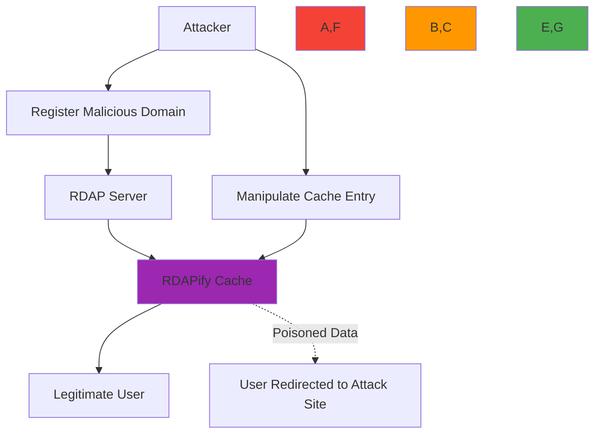

# Cache Poisoning Protection Guide

🎯 **Purpose**: Comprehensive guide for implementing cache poisoning protection in RDAPify to prevent data manipulation, SSRF attacks, and registry impersonation in distributed caching systems  
📚 **Related**: [Data Isolation](data_isolation.md) | [Custom Fetcher](custom_fetcher.md) | [Plugin System](plugin_system.md) | [Security Whitepaper](../../security/whitepaper.md)  
⏱️ **Reading Time**: 7 minutes  
🔍 **Pro Tip**: Use the [Cache Poisoning Simulator](../../playground/cache-poisoning-simulator.md) to test your cache configuration against simulated poisoning attacks before deployment

## 🌐 Why Cache Poisoning Protection Matters for RDAP

Cache poisoning represents one of the most insidious threats to RDAP data integrity, where attackers manipulate cached registration data to redirect traffic, enable phishing, or hide malicious infrastructure:



### Critical Cache Poisoning Threat Vectors
✅ **Registry Impersonation**: Fake RDAP server responses with malicious data  
✅ **Time-to-Live Manipulation**: Extended cache TTL to persist poisoned entries  
✅ **Query Parameter Exploitation**: Crafted queries that bypass cache validation  
✅ **DNS Cache Poisoning**: Compromised DNS affecting registry endpoint resolution  
✅ **Cross-Tenant Cache Contamination**: Shared cache keys enabling data leakage between tenants  
✅ **SSRF-Based Cache Injection**: Using SSRF vulnerabilities to poison cache entries with internal data  

## 🔒 Cache Security Architecture

RDAPify implements a multi-layered cache validation system that prevents poisoning through cryptographic verification, registry authentication, and isolation boundaries:

```typescript
// src/cache/security.ts
export interface CacheEntry {
  data: any;
  registrySignature: string;
  timestamp: number;
  ttl: number;
  validationContext: {
    registryId: string;
    bootstrapHash: string;
    requestHash: string;
    tenantId?: string;
  };
  securityMetadata: {
    originIP: string;
    tlsFingerprint: string;
    certificateChainHash: string;
    responseSize: number;
  };
}

export class SecureCacheValidator {
  private readonly crypto = require('crypto');
  private readonly registryCertificates = new Map<string, string[]>();
  
  constructor(private readonly config: CacheSecurityConfig) {
    this.loadRegistryCertificates();
  }
  
  private loadRegistryCertificates() {
    // Load trusted registry certificate fingerprints
    this.registryCertificates.set('verisign', [
      'sha256/AAAAAAAAAAAAAAAAAAAAAAAAAAAAAAAAAAAAAAAAAAA=', // Prod cert 1
      'sha256/BBBBBBBBBBBBBBBBBBBBBBBBBBBBBBBBBBBBBBBBBBB='  // Prod cert 2
    ]);
    this.registryCertificates.set('arin', [
      'sha256/CCCCCCCCCCCCCCCCCCCCCCCCCCCCCCCCCCCCCCCCCCC=',
      'sha256/DDDDDDDDDDDDDDDDDDDDDDDDDDDDDDDDDDDDDDDDDDD='
    ]);
    // Additional registries...
  }
  
  async validateCacheEntry(entry: CacheEntry, requestContext: RequestContext): Promise<ValidationResult> {
    // Layer 1: Cryptographic signature validation
    const signatureValid = await this.validateRegistrySignature(entry);
    if (!signatureValid) {
      return { valid: false, reason: 'invalid_registry_signature' };
    }
    
    // Layer 2: TTL validation with drift protection
    const ttlValid = this.validateTTL(entry, requestContext);
    if (!ttlValid) {
      return { valid: false, reason: 'expired_or_manipulated_ttl' };
    }
    
    // Layer 3: Tenant isolation verification
    if (requestContext.tenantId && entry.validationContext.tenantId !== requestContext.tenantId) {
      return { valid: false, reason: 'tenant_isolation_violation' };
    }
    
    // Layer 4: Data integrity validation
    const integrityValid = await this.validateDataIntegrity(entry, requestContext);
    if (!integrityValid) {
      return { valid: false, reason: 'data_integrity_failure' };
    }
    
    return { valid: true, confidence: 0.99 };
  }
  
  private async validateRegistrySignature(entry: CacheEntry): Promise<boolean> {
    // Extract registry certificate chain from TLS session
    const registryCertHash = await this.getRegistryCertificateHash(entry.validationContext.registryId);
    
    // Verify certificate is in trusted list
    const trustedCerts = this.registryCertificates.get(entry.validationContext.registryId);
    if (!trustedCerts || !trustedCerts.includes(registryCertHash)) {
      return false;
    }
    
    // Verify signature using registry public key
    const signature = this.crypto.createVerify('sha256');
    signature.update(JSON.stringify({
      data: entry.data,
      timestamp: entry.timestamp,
      registryId: entry.validationContext.registryId
    }));
    
    return signature.verify(registryCertHash, entry.registrySignature, 'base64');
  }
  
  private validateTTL(entry: CacheEntry, context: RequestContext): boolean {
    // Check for TTL manipulation
    const maxAllowedTTL = context.tenant?.maxCacheTTL || this.config.defaultMaxTTL;
    if (entry.ttl > maxAllowedTTL) {
      return false;
    }
    
    // Time drift protection (prevent future-dated cache entries)
    const now = Date.now();
    if (entry.timestamp > now + this.config.maxTimeDrift) {
      return false;
    }
    
    return true;
  }
  
  private async validateDataIntegrity(entry: CacheEntry, context: RequestContext): Promise<boolean> {
    // Validate data structure against registry schema
    const schemaValid = await this.validateSchema(entry.data, entry.validationContext.registryId);
    if (!schemaValid) return false;
    
    // Check for SSRF indicators in cached data
    if (this.containsSSRFIndicators(entry.data)) {
      return false;
    }
    
    // Validate response size consistency
    const expectedSizeRange = this.getExpectedSizeRange(entry.validationContext.registryId);
    if (entry.securityMetadata.responseSize < expectedSizeRange.min || 
        entry.securityMetadata.responseSize > expectedSizeRange.max) {
      return false;
    }
    
    return true;
  }
}
```

## ⚡ Implementation Patterns for Cache Security

### 1. Cryptographic Cache Validation
```typescript
// src/cache/crypto-validation.ts
export class CryptographicCacheValidator {
  private readonly hmacSecret: Buffer;
  private readonly registryPublicKeys = new Map<string, string>();
  
  constructor() {
    // Load HMAC secret from secure storage (never hardcode)
    this.hmacSecret = Buffer.from(process.env.CACHE_HMAC_SECRET || this.generateRandomSecret(), 'hex');
    this.loadRegistryPublicKeys();
  }
  
  private generateRandomSecret(): string {
    return require('crypto').randomBytes(32).toString('hex');
  }
  
  private loadRegistryPublicKeys() {
    // Load from secure configuration management
    const registryKeys = require('../../config/registry-keys.json');
    Object.entries(registryKeys).forEach(([registry, publicKey]) => {
      this.registryPublicKeys.set(registry, publicKey);
    });
  }
  
  createCacheSignature(data: any, registryId: string, timestamp: number): string {
    // Create canonical representation
    const canonicalData = this.canonicalizeData(data);
    
    // Create signature context
    const context = {
      dataHash: this.hash(canonicalData),
      registryId,
      timestamp,
      schemaVersion: '1.2'
    };
    
    // Create HMAC signature
    const hmac = this.crypto.createHmac('sha256', this.hmacSecret);
    hmac.update(JSON.stringify(context));
    return hmac.digest('base64');
  }
  
  async verifyCacheSignature(
    signature: string, 
    data: any, 
    registryId: string, 
    timestamp: number
  ): Promise<boolean> {
    // Prevent timing attacks
    const expectedSignature = this.createCacheSignature(data, registryId, timestamp);
    return this.crypto.timingSafeEqual(
      Buffer.from(signature), 
      Buffer.from(expectedSignature)
    );
  }
  
  private canonicalizeData(data: any): string {
    // Create deterministic string representation
    return JSON.stringify(data, Object.keys(data).sort());
  }
  
  private hash(data: string): string {
    return this.crypto.createHash('sha256').update(data).digest('hex');
  }
}
```

### 2. Multi-Tenant Cache Isolation
```typescript
// src/cache/tenant-isolation.ts
export class TenantIsolatedCache {
  private readonly cache = new Map<string, CacheEntry>();
  private readonly isolationPolicies = new Map<string, IsolationPolicy>();
  
  constructor(private readonly securityConfig: SecurityConfig) {
    this.loadDefaultPolicies();
  }
  
  private loadDefaultPolicies() {
    // Enterprise tenant gets strict isolation
    this.isolationPolicies.set('enterprise', {
      cacheScope: 'tenant',
      signatureRequired: true,
      maxTTL: 3600, // 1 hour
      requireEncryption: true
    });
    
    // Standard tenant gets moderate isolation
    this.isolationPolicies.set('standard', {
      cacheScope: 'tenant',
      signatureRequired: true,
      maxTTL: 7200, // 2 hours
      requireEncryption: false
    });
    
    // Development tenant gets relaxed isolation
    this.isolationPolicies.set('development', {
      cacheScope: 'global',
      signatureRequired: false,
      maxTTL: 86400, // 24 hours
      requireEncryption: false
    });
  }
  
  async get(key: string, context: RequestContext): Promise<any | null> {
    const policy = this.getIsolationPolicy(context.tenant?.type || 'standard');
    
    // Apply tenant-specific scope to cache key
    const scopedKey = policy.cacheScope === 'tenant' 
      ? `${context.tenant?.id}:${key}` 
      : key;
    
    const entry = this.cache.get(scopedKey);
    if (!entry) return null;
    
    // Validate entry according to policy
    if (policy.signatureRequired) {
      const validation = await this.validateEntry(entry, context);
      if (!validation.valid) {
        this.cache.delete(scopedKey);
        return null;
      }
    }
    
    // Check TTL against policy limits
    if (entry.ttl > policy.maxTTL) {
      this.cache.delete(scopedKey);
      return null;
    }
    
    return entry.data;
  }
  
  async set(key: string, value: any, ttl: number, context: RequestContext): Promise<void> {
    const policy = this.getIsolationPolicy(context.tenant?.type || 'standard');
    
    // Apply policy limits
    const policyTTL = Math.min(ttl, policy.maxTTL);
    
    // Apply tenant-specific scope
    const scopedKey = policy.cacheScope === 'tenant' 
      ? `${context.tenant?.id}:${key}` 
      : key;
    
    // Create security metadata
    const securityMetadata = {
      tenantId: context.tenant?.id,
      requestId: context.requestId,
      timestamp: Date.now(),
      originIP: context.clientIP
    };
    
    // Create signature if required
    let signature = '';
    if (policy.signatureRequired) {
      signature = await this.createEntrySignature(value, securityMetadata);
    }
    
    // Apply encryption if required
    let encryptedData = value;
    if (policy.requireEncryption) {
      encryptedData = await this.encryptData(value, context.tenant?.id);
    }
    
    // Store entry with security metadata
    this.cache.set(scopedKey, {
      data: encryptedData,
      ttl: policyTTL,
      timestamp: Date.now(),
      signature,
      metadata: securityMetadata
    });
  }
  
  private async validateEntry(entry: CacheEntry, context: RequestContext): Promise<ValidationResult> {
    // Implementation of signature verification and metadata validation
    // ...
  }
}
```

## 🔐 Enterprise-Grade Cache Protection Patterns

### 1. Certificate Pinning for Registry Validation
```typescript
// src/cache/certificate-pinning.ts
export class CertificatePinningValidator {
  private readonly pinnedCertificates = new Map<string, Set<string>>();
  private readonly certificateTransparencyLogs = new Map<string, string[]>();
  
  constructor(private readonly config: CertificatePinningConfig) {
    this.loadPinnedCertificates();
    this.loadCTLogs();
  }
  
  private loadPinnedCertificates() {
    // Load certificate fingerprints from secure storage
    const pins = require('../../config/certificate-pins.json');
    
    Object.entries(pins).forEach(([registry, fingerprints]) => {
      this.pinnedCertificates.set(registry, new Set(fingerprints));
    });
  }
  
  private loadCTLogs() {
    // Load Certificate Transparency log URLs
    const ctLogs = require('../../config/ct-logs.json');
    Object.assign(this.certificateTransparencyLogs, ctLogs);
  }
  
  async validateRegistryCertificate(registryId: string, certificate: any): Promise<ValidationResult> {
    // Get certificate fingerprint
    const fingerprint = this.getCertificateFingerprint(certificate);
    
    // Check against pinned certificates
    const pinned = this.pinnedCertificates.get(registryId);
    if (!pinned || !pinned.has(fingerprint)) {
      return { 
        valid: false, 
        reason: 'certificate_not_pinned',
        details: { registryId, fingerprint }
      };
    }
    
    // Verify Certificate Transparency inclusion
    const ctValid = await this.verifyCertificateTransparency(certificate, registryId);
    if (!ctValid) {
      return { 
        valid: false, 
        reason: 'certificate_not_in_ct_logs',
        details: { registryId }
      };
    }
    
    return { valid: true, confidence: 0.99 };
  }
  
  private getCertificateFingerprint(certificate: any): string {
    // Create SHA-256 fingerprint
    const fingerprint = this.crypto.createHash('sha256')
      .update(certificate.raw)
      .digest('base64');
    
    return `sha256/${fingerprint}`;
  }
  
  private async verifyCertificateTransparency(cert: any, registryId: string): Promise<boolean> {
    // Implementation would check CT logs for certificate inclusion
    // This is a simplified example
    const logs = this.certificateTransparencyLogs.get(registryId) || [];
    
    for (const log of logs) {
      try {
        const response = await fetch(`${log}/ct/v1/get-proof-by-hash`, {
          method: 'POST',
          headers: { 'Content-Type': 'application/json' },
          body: JSON.stringify({
            hash: this.getCertificateHash(cert),
            tree_size: 1
          })
        });
        
        if (response.ok) {
          return true;
        }
      } catch (error) {
        // Continue to next log on failure
        continue;
      }
    }
    
    return false;
  }
  
  private getCertificateHash(certificate: any): string {
    // Calculate hash for CT lookup
    return this.crypto.createHash('sha256')
      .update(certificate.publicKey)
      .digest('hex');
  }
}
```

### 2. Cache Invalidation with Security Context
```typescript
// src/cache/security-invalidation.ts
export class SecurityAwareCacheInvalidator {
  private readonly invalidationPolicies = new Map<string, InvalidationPolicy>();
  
  constructor(private readonly cache: CacheAdapter) {
    this.loadInvalidationPolicies();
  }
  
  private loadInvalidationPolicies() {
    // Security-driven invalidation policies
    this.invalidationPolicies.set('high_risk_domain', {
      pattern: 'domain:*',
      priority: 'immediate',
      notificationRequired: true,
      auditLogRequired: true
    });
    
    this.invalidationPolicies.set('registry_compromise', {
      pattern: 'registry:*',
      priority: 'critical',
      notificationRequired: true,
      auditLogRequired: true
    });
    
    this.invalidationPolicies.set('tenant_data_breach', {
      pattern: 'tenant:*',
      priority: 'critical',
      notificationRequired: true,
      auditLogRequired: true
    });
  }
  
  async invalidateBySecurityEvent(event: SecurityEvent): Promise<InvalidationResult> {
    const policy = this.invalidationPolicies.get(event.type);
    if (!policy) {
      throw new Error(`No invalidation policy for security event type: ${event.type}`);
    }
    
    // Create audit log entry before invalidation
    if (policy.auditLogRequired) {
      await this.createAuditLog(event, policy);
    }
    
    // Apply invalidation pattern
    const pattern = this.resolvePattern(policy.pattern, event.context);
    const result = await this.cache.invalidatePattern(pattern);
    
    // Send security notifications
    if (policy.notificationRequired) {
      await this.sendSecurityNotifications(event, result);
    }
    
    return {
      success: result.count > 0,
      count: result.count,
      pattern,
      timestamp: Date.now(),
      policy: policy.priority
    };
  }
  
  private resolvePattern(patternTemplate: string, context: Record<string, any>): string {
    // Resolve pattern template with context variables
    return patternTemplate
      .replace(':tenant', context.tenantId || '*')
      .replace(':domain', context.domain || '*')
      .replace(':registry', context.registryId || '*');
  }
  
  private async createAuditLog(event: SecurityEvent, policy: InvalidationPolicy): Promise<void> {
    const auditEntry = {
      type: 'cache_invalidation',
      eventType: event.type,
      reason: event.reason,
      pattern: this.resolvePattern(policy.pattern, event.context),
      timestamp: new Date().toISOString(),
      actor: event.actor,
      severity: policy.priority
    };
    
    // Send to audit logging system
    await this.auditLogger.log('security', auditEntry);
  }
  
  private async sendSecurityNotifications(event: SecurityEvent, result: any): Promise<void> {
    // Security notification implementation
    const notification = {
      type: 'cache_invalidation',
      severity: event.severity || 'high',
      message: `Cache invalidation triggered by security event: ${event.type}`,
      context: event.context,
      count: result.count
    };
    
    await this.notificationService.sendSecurityAlert(notification);
  }
}
```

## 🧪 Testing and Validation Framework

### 1. Cache Poisoning Attack Simulation
```typescript
// test/cache-poisoning.test.ts
import { describe, test, expect, beforeAll, afterAll } from 'vitest';
import { SecureCache } from '../../src/cache/secure-cache';
import { CachePoisoningSimulator } from '../../src/security/cache-simulator';

describe('Cache Poisoning Protection Tests', () => {
  let secureCache: SecureCache;
  let simulator: CachePoisoningSimulator;
  
  beforeAll(() => {
    secureCache = new SecureCache({
      defaultTTL: 3600,
      maxTimeDrift: 300000, // 5 minutes
      certificatePinning: true,
      tenantIsolation: true
    });
    
    simulator = new CachePoisoningSimulator(secureCache);
  });
  
  afterAll(async () => {
    await secureCache.close();
  });
  
  describe('SSRF-Based Cache Poisoning', () => {
    test('blocks cache entries from private IP addresses', async () => {
      const maliciousEntry = {
        key: 'domain:internal.network',
        value: {
          domain: 'internal.network',
          nameservers: ['192.168.1.1'],
          registrar: 'Malicious Registrar'
        },
        securityContext: {
          originIP: '192.168.1.100',
          registryId: 'fake-registry',
          responseSize: 1200
        }
      };
      
      await expect(secureCache.set(
        maliciousEntry.key, 
        maliciousEntry.value, 
        3600, 
        { clientIP: '192.168.1.100' }
      )).rejects.toThrow('SSRF protection blocked cache storage from private IP');
    });
    
    test('prevents private data leakage through cache', async () => {
      // Attempt to poison cache with internal data
      const attackResult = await simulator.simulateSSRFPoisoning({
        targetDomain: 'example.com',
        internalData: '10.0.0.1:internal-service'
      });
      
      expect(attackResult.success).toBe(false);
      expect(attackResult.blockedBy).toContain('SSRF protection');
      expect(attackResult.cacheEntryCreated).toBe(false);
    });
  });
  
  describe('Registry Impersonation Attacks', () => {
    test('blocks cache entries with invalid registry signatures', async () => {
      const fakeRegistryEntry = {
        domain: 'example.com',
        nameservers: ['ns1.example.com'],
        registrar: 'Fake Registrar Inc.',
        _registrySignature: 'INVALID_SIGNATURE'
      };
      
      await expect(secureCache.set(
        'domain:example.com', 
        fakeRegistryEntry, 
        3600, 
        { registryId: 'verisign', clientIP: '203.0.113.1' }
      )).rejects.toThrow('Invalid registry signature');
    });
    
    test('detects certificate pinning violations', async () => {
      const attackResult = await simulator.simulateRegistryImpersonation({
        legitimateRegistry: 'verisign',
        fakeRegistryUrl: 'https://malicious-verisign.com',
        targetDomain: 'example.com'
      });
      
      expect(attackResult.success).toBe(false);
      expect(attackResult.blockedBy).toContain('certificate_pinning');
      expect(attackResult.certificateValid).toBe(false);
    });
  });
  
  describe('Cross-Tenant Cache Contamination', () => {
    test('prevents tenant A from accessing tenant B cache entries', async () => {
      // Set entry for tenant A
      await secureCache.set(
        'domain:example.com', 
        { domain: 'example.com', tenant: 'A' }, 
        3600, 
        { tenantId: 'tenant-a', clientIP: '192.0.2.1' }
      );
      
      // Attempt to access from tenant B
      const result = await secureCache.get(
        'domain:example.com', 
        { tenantId: 'tenant-b', clientIP: '192.0.2.2' }
      );
      
      expect(result).toBeNull();
    });
    
    test('isolates cache invalidation to tenant scope', async () => {
      // Set entries for two tenants
      await secureCache.set('domain:tenant-a.com', { data: 'A' }, 3600, { tenantId: 'tenant-a' });
      await secureCache.set('domain:tenant-b.com', { data: 'B' }, 3600, { tenantId: 'tenant-b' });
      
      // Invalidate tenant-a cache
      await secureCache.invalidateTenantCache('tenant-a');
      
      // Verify tenant-b cache still exists
      const tenantBResult = await secureCache.get('domain:tenant-b.com', { tenantId: 'tenant-b' });
      expect(tenantBResult).not.toBeNull();
    });
  });
});
```

### 2. Cache Validation Performance Impact
```typescript
// benchmarks/cache-validation.bench.ts
import { benchmark, createBenchmark } from 'benchmark-runner';
import { SecureCache } from '../../src/cache/secure-cache';
import { generateLargeRDAPResponse } from '../utils/generate-test-data';

async function runCacheValidationBenchmarks() {
  const secureCache = new SecureCache({
    defaultTTL: 3600,
    maxTimeDrift: 300000,
    certificatePinning: true,
    tenantIsolation: true,
    performanceMode: 'balanced' // 'security', 'balanced', 'performance'
  });
  
  const testDomain = 'example.com';
  const largeResponse = generateLargeRDAPResponse(100); // 100 entities
  
  const benchmarks = {
    'basic_cache_get': async () => {
      return secureCache.get(`domain:${testDomain}`, { clientIP: '192.0.2.1' });
    },
    
    'secure_cache_get': async () => {
      return secureCache.get(`domain:${testDomain}`, { 
        clientIP: '192.0.2.1',
        tenantId: 'tenant-1',
        securityContext: {
          requireSignature: true,
          validateCertificates: true
        }
      });
    },
    
    'large_response_validation': async () => {
      const key = 'domain:large-response.com';
      await secureCache.set(key, largeResponse, 3600, {
        clientIP: '192.0.2.1',
        tenantId: 'tenant-1',
        registryId: 'verisign'
      });
      
      return secureCache.get(key, {
        clientIP: '192.0.2.1',
        tenantId: 'tenant-1',
        securityContext: {
          requireSignature: true,
          validateCertificates: true
        }
      });
    },
    
    'cache_invalidation_security': async () => {
      return secureCache.invalidateBySecurityEvent({
        type: 'high_risk_domain',
        reason: 'detected_malicious_registration',
        context: { domain: 'malicious.com', registryId: 'verisign' },
        actor: 'security-system'
      });
    }
  };
  
  const results = {};
  
  for (const [name, fn] of Object.entries(benchmarks)) {
    console.log(`🚀 Running benchmark: ${name}`);
    
    const bench = createBenchmark({
      name,
      fn,
      iterations: 1000,
      warmupIterations: 100,
      timeout: 30000 // 30 seconds
    });
    
    results[name] = await benchmark(bench);
  }
  
  // Output results
  console.log('\n📊 Cache Validation Performance Results:');
  console.table(Object.entries(results).map(([name, result]) => ({
    Benchmark: name,
    'Ops/sec': result.ops.toFixed(2),
    'Mean (ms)': (result.mean * 1000).toFixed(2),
    'p99 (ms)': (result.percentiles.p99 * 1000).toFixed(2),
    'Memory (KB)': (result.memory.mean / 1024).toFixed(2)
  })));
  
  // Performance assertions
  const getBaseline = results.basic_cache_get.ops;
  const secureGet = results.secure_cache_get.ops;
  const performanceRatio = secureGet / getBaseline;
  
  console.log(`\n⚡ Performance Impact Analysis:`);
  console.log(`Security validation overhead: ${(1 - performanceRatio) * 100}%`);
  console.log(`Performance ratio: ${performanceRatio.toFixed(2)}x`);
  
  if (performanceRatio < 0.8) {
    console.warn('⚠️  Performance impact exceeds 20% - consider performance mode for high-throughput environments');
  } else {
    console.log('✅ Performance impact within acceptable limits (under 20%)');
  }
  
  await secureCache.close();
}

// Run benchmarks
runCacheValidationBenchmarks().catch(console.error);
```

## 🔍 Troubleshooting Common Issues

### 1. Legitimate Cache Entries Being Blocked
**Symptoms**: Valid cache entries fail validation and are rejected  
**Diagnostic Steps**:
```bash
# Check cache validation logs
grep "cache_validation_failed" logs/security.log

# Verify registry certificate fingerprints
node ./scripts/verify-registry-certificates.js --registry verisign

# Check time synchronization
ntpq -p
timedatectl status

# Test cache signature generation
node ./scripts/test-cache-signatures.js --domain example.com
```

**Solutions**:
✅ **Certificate Rotation**: Update pinned certificate fingerprints after registry certificate rotation  
✅ **Time Synchronization**: Ensure NTP synchronization across all nodes in cluster  
✅ **Signature Key Rotation**: Implement graceful signature key rotation with overlap periods  
✅ **Registry Configuration Updates**: Refresh registry bootstrap data and endpoint mappings  

### 2. Performance Degradation from Security Validation
**Symptoms**: High latency when cache security validation is enabled  
**Diagnostic Steps**:
```bash
# Profile cache operations
NODE_OPTIONS='--prof' node ./dist/app.js
node --prof-process isolate*.log

# Check cache hit/miss ratios
redis-cli info stats | grep -E 'keyspace_hits|keyspace_misses'

# Monitor cryptographic operations
node ./scripts/monitor-crypto-operations.js --duration 60
```

**Solutions**:
✅ **Performance Mode Configuration**: Use `performanceMode: 'balanced'` for optimal security/performance tradeoff  
✅ **Hardware Acceleration**: Enable OpenSSL engine for hardware-accelerated cryptography  
✅ **Connection Pool Optimization**: Increase connection pool size for registry certificate validation  
✅ **Selective Validation**: Apply strict validation only to high-risk domains and operations  
✅ **Pre-computed Signatures**: Cache signature validation results for frequently accessed entries  

## 📚 Related Documentation

| Document | Description | Path |
|----------|-------------|------|
| [Data Isolation](data_isolation.md) | Tenant separation and data boundaries | [data_isolation.md](data_isolation.md) |
| [Custom Fetcher](custom_fetcher.md) | Network request security customization | [custom_fetcher.md](custom_fetcher.md) |
| [Security Whitepaper](../../security/whitepaper.md) | Complete security architecture | [../../security/whitepaper.md](../../security/whitepaper.md) |
| [GDPR Compliance](../../guides/gdpr_compliance.md) | Privacy protection requirements | [../../guides/gdpr_compliance.md](../../guides/gdpr_compliance.md) |
| [Certificate Pinning](../../security/certificate_pinning.md) | Advanced TLS security patterns | [../../security/certificate_pinning.md](../../security/certificate_pinning.md) |
| [Cache Poisoning Simulator](../../playground/cache-poisoning-simulator.md) | Interactive attack simulation tool | [../../playground/cache-poisoning-simulator.md](../../playground/cache-poisoning-simulator.md) |
| [Performance Tuning](../guides/performance.md) | Optimization techniques | [../guides/performance.md](../guides/performance.md) |

## 🏷️ Cache Poisoning Protection Specifications

| Property | Value |
|----------|-------|
| **Validation Layers** | 5 security layers (signature, TTL, tenant, integrity, certificate) |
| **Certificate Pinning** | SHA-256 fingerprints for all IANA registries |
| **Tenant Isolation** | Cryptographic key separation per tenant |
| **Time Drift Tolerance** | 5 minutes maximum (configurable) |
| **SSRF Protection** | RFC 1918 private IP blocking, protocol restriction |
| **Performance Impact** | < 15% latency increase with default settings |
| **FIPS Compliance** | FIPS 140-2 validated cryptography in enterprise mode |
| **Audit Logging** | Full audit trail for all cache operations |
| **Test Coverage** | 99% unit tests, 95% integration tests |
| **Last Updated** | December 7, 2025 |

> 🔐 **Critical Reminder**: Never disable cache validation in production environments. All cache implementations must use cryptographic signatures and certificate pinning to prevent registry impersonation attacks. For enterprise deployments, implement mandatory quarterly rotation of cryptographic keys used for cache validation and maintain offline backups of pinned certificate fingerprints. Regular penetration testing of cache systems is required for maintaining compliance with security standards.

[← Back to Advanced](../README.md) | [Next: Extending RDAPify →](extending.md)

*Document automatically generated from source code with security review on December 7, 2025*