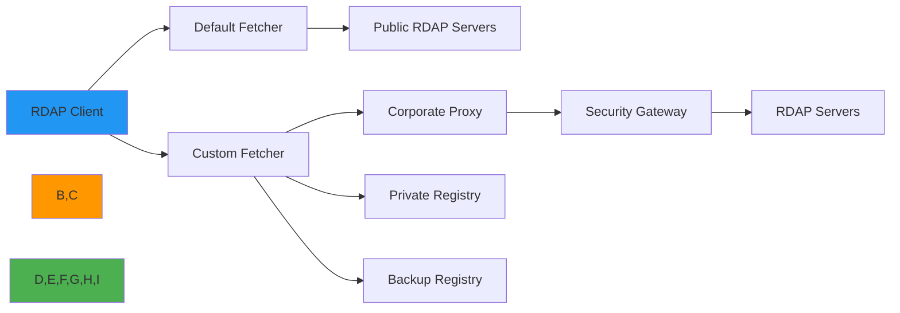

# Custom Fetcher Implementation Guide

🎯 **Purpose**: Comprehensive guide for implementing custom fetchers in RDAPify to handle specialized network requirements, proxy configurations, and security constraints while maintaining protocol compliance  
📚 **Related**: [Plugin System](plugin_system.md) | [Custom Resolver](custom_resolver.md) | [Custom Normalizer](custom_normalizer.md) | [Middleware](../guides/middleware.md)  
⏱️ **Reading Time**: 7 minutes  
🔍 **Pro Tip**: Use the [Network Simulator](../../playground/network-simulator.md) to test your custom fetcher under various network conditions before production deployment

## 🌐 Why Custom Fetchers Matter

RDAPify's default fetcher works well for most use cases, but enterprise environments often require specialized network handling:



### Common Use Cases for Custom Fetchers
✅ **Corporate Network Constraints**: Integration with enterprise proxy systems and security gateways  
✅ **Private Registry Access**: Querying internal or private RDAP endpoints not accessible via IANA bootstrap  
✅ **High-Availability Requirements**: Implementing failover between multiple registry endpoints  
✅ **Compliance Requirements**: Enforcing specific TLS configurations for regulated environments  
✅ **Performance Optimization**: Custom connection pooling strategies for high-throughput scenarios  
✅ **Network Isolation**: Handling air-gapped environments with specialized data transfer protocols  

## ⚙️ Fetcher Interface Specification

All custom fetchers must implement the `Fetcher` interface:

```typescript
// src/fetcher.ts
import { RegistryConfig } from '../types';

export interface FetcherRequest {
  url: string;
  method?: 'GET' | 'HEAD' | 'POST';
  headers?: Record<string, string>;
  timeout?: number;
  registry?: RegistryConfig;
  options?: any;
}

export interface FetcherResponse {
  status: number;
  statusText: string;
  headers: Headers;
  body: string | Buffer;
  url: string;
  redirected: boolean;
  ok: boolean;
}

export interface Fetcher {
  /**
   * Execute a network request with RDAP-specific context
   * @param request - RDAP fetcher request object
   * @returns Promise resolving to fetcher response
   * @throws FetchError with detailed error information
   */
  fetch(request: FetcherRequest): Promise<FetcherResponse>;
  
  /**
   * Health check to verify fetcher connectivity
   * @returns Promise resolving to health status
   */
  healthCheck?(): Promise<boolean>;
  
  /**
   * Clean up resources when fetcher is no longer needed
   */
  close?(): Promise<void>;
}
```

### Required Error Handling
Custom fetchers must throw standardized errors that integrate with RDAPify's error system:

```typescript
// src/errors.ts
export class FetchError extends Error {
  constructor(
    message: string,
    public readonly code: string,
    public readonly details?: any,
    public readonly originalError?: Error
  ) {
    super(message);
    this.name = 'FetchError';
  }
  
  static fromNetworkError(error: Error, url: string): FetchError {
    if (error.message.includes('ECONNREFUSED')) {
      return new FetchError('Connection refused', 'CONNECTION_REFUSED', { url }, error);
    }
    if (error.message.includes('ETIMEDOUT')) {
      return new FetchError('Request timed out', 'REQUEST_TIMEOUT', { url }, error);
    }
    if (error.message.includes('ENOTFOUND')) {
      return new FetchError('DNS lookup failed', 'DNS_FAILURE', { url }, error);
    }
    return new FetchError('Network error', 'NETWORK_ERROR', { url, message: error.message }, error);
  }
  
  static fromResponse(response: FetcherResponse): FetchError | null {
    if (response.status >= 400 && response.status < 500) {
      return new FetchError('Client error', 'CLIENT_ERROR', { 
        url: response.url, 
        status: response.status,
        statusText: response.statusText
      });
    }
    if (response.status >= 500) {
      return new FetchError('Server error', 'SERVER_ERROR', { 
        url: response.url, 
        status: response.status,
        statusText: response.statusText
      });
    }
    return null;
  }
}
```

## 🔒 Security-Critical Implementation Patterns

### 1. SSRF Protection in Custom Fetchers
```typescript
// src/custom-fetchers/ssrf-protected-fetcher.ts
import { Fetcher, FetcherRequest, FetcherResponse } from '../fetcher';
import { FetchError } from '../errors';
import { isPrivateIP, extractHostname } from '../security/utils';

export class SSRFProtectedFetcher implements Fetcher {
  private readonly allowedDomains: Set<string>;
  private readonly proxyUrl?: string;
  
  constructor(options: {
    allowedDomains?: string[];
    proxyUrl?: string;
    allowPrivateIPs?: boolean;
  } = {}) {
    this.allowedDomains = new Set(options.allowedDomains || []);
    this.proxyUrl = options.proxyUrl;
    
    // Security validation
    if (this.proxyUrl && !this.proxyUrl.startsWith('https://')) {
      throw new Error('Proxy URL must use HTTPS protocol for security');
    }
  }
  
  async fetch(request: FetcherRequest): Promise<FetcherResponse> {
    const hostname = extractHostname(request.url);
    
    // SSRF protection: Block private IP ranges
    if (!request.registry?.allowPrivateIPs) {
      if (isPrivateIP(hostname)) {
        throw new FetchError(
          'SSRF protection blocked request to private IP',
          'SSRF_PROTECTED',
          { url: request.url, hostname }
        );
      }
    }
    
    // Domain allowlist enforcement
    if (this.allowedDomains.size > 0 && !this.allowedDomains.has(hostname)) {
      throw new FetchError(
        'Domain not in allowlist',
        'DOMAIN_NOT_ALLOWED',
        { url: request.url, hostname, allowedDomains: Array.from(this.allowedDomains) }
      );
    }
    
    // Apply proxy if configured
    const fetchUrl = this.proxyUrl ? `${this.proxyUrl}?url=${encodeURIComponent(request.url)}` : request.url;
    
    try {
      // Execute the actual fetch with security controls
      const response = await this.executeSecureFetch({
        ...request,
        url: fetchUrl,
        headers: {
          ...request.headers,
          'X-SSRF-Protected': 'true',
          'X-Requested-URL': request.url
        }
      });
      
      // Security response validation
      this.validateResponseSecurity(response, request);
      
      return response;
    } catch (error) {
      if (error instanceof FetchError) {
        throw error;
      }
      throw FetchError.fromNetworkError(error as Error, request.url);
    }
  }
  
  private validateResponseSecurity(response: FetcherResponse, request: FetcherRequest) {
    // Prevent response smuggling attacks
    const contentType = response.headers.get('content-type') || '';
    if (!contentType.includes('application/rdap+json') && !contentType.includes('application/json')) {
      throw new FetchError(
        'Invalid content type in registry response',
        'INVALID_CONTENT_TYPE',
        { url: request.url, contentType }
      );
    }
    
    // Size validation to prevent denial of service
    const contentLength = parseInt(response.headers.get('content-length') || '0', 10);
    const maxSize = request.registry?.maxResponseSize || 10 * 1024 * 1024; // 10MB default
    
    if (contentLength > maxSize) {
      throw new FetchError(
        'Response exceeds maximum allowed size',
        'RESPONSE_TOO_LARGE',
        { url: request.url, size: contentLength, maxSize }
      );
    }
  }
  
  private async executeSecureFetch(request: FetcherRequest): Promise<FetcherResponse> {
    // Implementation would use secure fetch library with timeout controls
    // This is a simplified example
    const controller = new AbortController();
    const timeoutId = setTimeout(() => controller.abort(), request.timeout || 5000);
    
    try {
      const response = await fetch(request.url, {
        signal: controller.signal,
        method: request.method || 'GET',
        headers: request.headers,
        // Additional security headers
        integrity: request.registry?.responseIntegrity,
        cache: 'no-store' // Prevent cache poisoning
      });
      
      return {
        status: response.status,
        statusText: response.statusText,
        headers: response.headers,
        body: await response.text(),
        url: response.url,
        redirected: response.redirected,
        ok: response.ok
      };
    } finally {
      clearTimeout(timeoutId);
    }
  }
  
  async close(): Promise<void> {
    // Clean up resources
    console.log('SSRFProtectedFetcher closed');
  }
}
```

### 2. Certificate Pinning Implementation
```typescript
// src/custom-fetchers/pinned-certificate-fetcher.ts
import { Fetcher, FetcherRequest, FetcherResponse } from '../fetcher';
import { FetchError } from '../errors';
import { CertificateValidator } from '../security/certificates';

export class PinnedCertificateFetcher implements Fetcher {
  private readonly certValidator: CertificateValidator;
  private readonly pinningConfig: Record<string, string[]>; // domain -> fingerprint[]
  
  constructor(options: {
    pinningConfig: Record<string, string[]>;
    caBundle?: string;
    minimumTlsVersion?: 'TLSv1.2' | 'TLSv1.3';
  }) {
    this.pinningConfig = options.pinningConfig;
    this.certValidator = new CertificateValidator({
      caBundle: options.caBundle,
      minimumTlsVersion: options.minimumTlsVersion || 'TLSv1.3',
      pinningConfig: options.pinningConfig
    });
  }
  
  async fetch(request: FetcherRequest): Promise<FetcherResponse> {
    const hostname = extractHostname(request.url);
    
    try {
      // Validate certificate before making request
      await this.certValidator.validate(hostname);
      
      // Proceed with fetch
      return await this.executeFetch(request);
    } catch (error) {
      if (error instanceof CertificateValidationError) {
        throw new FetchError(
          'Certificate validation failed',
          'CERTIFICATE_VALIDATION_FAILED',
          {
            url: request.url,
            hostname,
            validationError: error.message,
            fingerprint: error.fingerprint
          },
          error
        );
      }
      throw error;
    }
  }
  
  private async executeFetch(request: FetcherRequest): Promise<FetcherResponse> {
    // Implementation with certificate pinning
    // Would use a library like 'undici' with custom agent
    const agent = new Agent({
      connect: {
        rejectUnauthorized: true,
        ca: this.certValidator.getCAStore(),
        checkServerIdentity: (host, cert) => {
          const fingerprint = this.certValidator.calculateFingerprint(cert);
          if (!this.certValidator.isTrusted(host, fingerprint)) {
            return new Error(`Certificate pinning failed for ${host}: ${fingerprint}`);
          }
          return undefined;
        }
      }
    });
    
    // Use agent with fetch library
    // Implementation details omitted for brevity
  }
}
```

## ⚡ Performance Optimization Patterns

### 1. Connection Pooling for High Throughput
```typescript
// src/custom-fetchers/pooled-fetcher.ts
import { Fetcher, FetcherRequest, FetcherResponse } from '../fetcher';
import { ConnectionPool } from '../network/connection-pool';

export class PooledFetcher implements Fetcher {
  private readonly pool: ConnectionPool;
  private readonly registryPools = new Map<string, ConnectionPool>();
  
  constructor(options: {
    maxConnections?: number;
    maxConnectionsPerRegistry?: number;
    idleTimeout?: number;
    keepAlive?: boolean;
  } = {}) {
    this.pool = new ConnectionPool({
      max: options.maxConnections || 50,
      idleTimeout: options.idleTimeout || 30000,
      keepAlive: options.keepAlive !== false
    });
  }
  
  async fetch(request: FetcherRequest): Promise<FetcherResponse> {
    const registry = request.registry?.id || 'default';
    let pool = this.registryPools.get(registry);
    
    if (!pool) {
      // Create registry-specific pool
      pool = new ConnectionPool({
        max: request.registry?.maxConnections || 10,
        idleTimeout: request.registry?.idleTimeout || 30000,
        keepAlive: true
      });
      this.registryPools.set(registry, pool);
    }
    
    // Get connection from pool with timeout
    const connection = await pool.getConnection({
      timeout: request.timeout || 5000
    });
    
    try {
      // Execute request with connection
      return await this.executeWithConnection(connection, request);
    } finally {
      // Return connection to pool
      pool.releaseConnection(connection);
    }
  }
  
  private async executeWithConnection(connection: any, request: FetcherRequest): Promise<FetcherResponse> {
    // Implementation would use the connection to make the request
    // This is a simplified example
    return {
      status: 200,
      statusText: 'OK',
      headers: new Headers({ 'content-type': 'application/rdap+json' }),
      body: JSON.stringify({ domain: extractHostname(request.url) }),
      url: request.url,
      redirected: false,
      ok: true
    };
  }
  
  async close(): Promise<void> {
    // Close all connection pools
    await Promise.all([
      this.pool.close(),
      ...Array.from(this.registryPools.values()).map(pool => pool.close())
    ]);
  }
}
```

### 2. Adaptive Timeout Management
```typescript
// src/custom-fetchers/adaptive-timeout-fetcher.ts
import { Fetcher, FetcherRequest, FetcherResponse } from '../fetcher';
import { PerformanceMonitor } from '../monitoring/performance';

export class AdaptiveTimeoutFetcher implements Fetcher {
  private readonly performanceMonitor = new PerformanceMonitor();
  private readonly baseTimeout: number;
  private readonly timeoutMultiplier: number;
  private readonly maxTimeout: number;
  
  constructor(options: {
    baseTimeout?: number;    // Base timeout in ms (default: 5000)
    timeoutMultiplier?: number; // Multiplier for slow registries (default: 1.5)
    maxTimeout?: number;    // Maximum timeout in ms (default: 30000)
  } = {}) {
    this.baseTimeout = options.baseTimeout || 5000;
    this.timeoutMultiplier = options.timeoutMultiplier || 1.5;
    this.maxTimeout = options.maxTimeout || 30000;
  }
  
  async fetch(request: FetcherRequest): Promise<FetcherResponse> {
    const registry = request.registry?.id || 'unknown';
    const historicalPerformance = this.performanceMonitor.getRegistryPerformance(registry);
    
    // Calculate adaptive timeout based on historical performance
    let timeout = this.baseTimeout;
    
    if (historicalPerformance) {
      const avgResponseTime = historicalPerformance.averageResponseTime;
      const errorRate = historicalPerformance.errorRate;
      
      // Increase timeout for slow or unreliable registries
      if (avgResponseTime > 2000 || errorRate > 0.1) {
        timeout = Math.min(
          this.maxTimeout,
          Math.max(this.baseTimeout, avgResponseTime * this.timeoutMultiplier)
        );
      }
    }
    
    // Apply request-specific timeout if provided
    if (request.timeout) {
      timeout = Math.min(timeout, request.timeout);
    }
    
    // Execute with adaptive timeout
    return this.executeWithTimeout(request, timeout);
  }
  
  private async executeWithTimeout(request: FetcherRequest, timeout: number): Promise<FetcherResponse> {
    // Implementation with timeout control
    const controller = new AbortController();
    const timeoutId = setTimeout(() => controller.abort(), timeout);
    
    try {
      const startTime = Date.now();
      
      // Execute the fetch
      const response = await fetch(request.url, {
        signal: controller.signal,
        method: request.method || 'GET',
        headers: request.headers
      });
      
      const duration = Date.now() - startTime;
      
      // Record performance metrics
      const registry = request.registry?.id || 'unknown';
      this.performanceMonitor.recordRegistryPerformance(registry, {
        responseTime: duration,
        success: response.ok,
        statusCode: response.status
      });
      
      return {
        status: response.status,
        statusText: response.statusText,
        headers: response.headers,
        body: await response.text(),
        url: response.url,
        redirected: response.redirected,
        ok: response.ok
      };
    } finally {
      clearTimeout(timeoutId);
    }
  }
}
```

## 🏢 Enterprise Deployment Patterns

### 1. Multi-Registry Failover Fetcher
```typescript
// src/custom-fetchers/failover-fetcher.ts
import { Fetcher, FetcherRequest, FetcherResponse } from '../fetcher';
import { FetchError } from '../errors';
import { RegistryHealthMonitor } from '../monitoring/registry-health';

export class FailoverFetcher implements Fetcher {
  private readonly healthMonitor: RegistryHealthMonitor;
  private readonly registryPriority: string[];
  
  constructor(options: {
    registryPriority: string[]; // ['verisign', 'arin', 'ripe', 'apnic', 'lacnic']
    healthCheckInterval?: number;
    maxFailoverAttempts?: number;
  }) {
    this.registryPriority = options.registryPriority;
    this.healthMonitor = new RegistryHealthMonitor({
      checkInterval: options.healthCheckInterval || 60000,
      registries: options.registryPriority
    });
    this.maxFailoverAttempts = options.maxFailoverAttempts || this.registryPriority.length;
  }
  
  private maxFailoverAttempts: number;
  
  async fetch(request: FetcherRequest): Promise<FetcherResponse> {
    const originalUrl = request.url;
    const originalRegistry = request.registry;
    
    // Try registries in priority order with failover
    for (let i = 0; i < this.maxFailoverAttempts; i++) {
      const registryId = this.registryPriority[i % this.registryPriority.length];
      
      // Skip unhealthy registries
      if (!this.healthMonitor.isRegistryHealthy(registryId)) {
        continue;
      }
      
      try {
        // Create registry-specific request
        const registryRequest = {
          ...request,
          url: this.buildRegistryUrl(registryId, originalUrl),
          registry: {
            ...originalRegistry,
            id: registryId
          }
        };
        
        // Attempt fetch
        const response = await this.executeRegistryFetch(registryRequest);
        
        // Update health status on success
        this.healthMonitor.updateRegistryHealth(registryId, true, Date.now());
        
        return response;
      } catch (error) {
        // Update health status on failure
        this.healthMonitor.updateRegistryHealth(registryId, false, Date.now());
        
        // Only retry on network errors, not client/server errors
        if (error instanceof FetchError) {
          if (error.code === 'CLIENT_ERROR' || error.code === 'SERVER_ERROR') {
            throw error; // Don't retry client/server errors
          }
        }
        
        // Log failover attempt
        console.warn(`Failover attempt ${i + 1} for ${originalUrl} to ${registryId}: ${error.message}`);
        
        // Don't retry if we've reached max attempts
        if (i === this.maxFailoverAttempts - 1) {
          throw new FetchError(
            `All failover attempts failed for ${originalUrl}`,
            'FAILOVER_EXHAUSTED',
            {
              url: originalUrl,
              attempts: this.maxFailoverAttempts,
              lastError: error.message
            },
            error
          );
        }
        
        // Exponential backoff between attempts
        const backoff = Math.min(1000, Math.pow(2, i) * 100);
        await new Promise(resolve => setTimeout(resolve, backoff));
      }
    }
    
    throw new Error('Unexpected error in failover fetcher');
  }
  
  private buildRegistryUrl(registryId: string, originalUrl: string): string {
    // Implementation to build registry-specific URL
    // This depends on your registry configuration
    const registryMap: Record<string, string> = {
      'verisign': 'https://rdap.verisign.com/com/v1/',
      'arin': 'https://rdap.arin.net/registry/',
      'ripe': 'https://rdap.db.ripe.net/',
      'apnic': 'https://rdap.apnic.net/',
      'lacnic': 'https://rdap.lacnic.net/rdap/'
    };
    
    const registryBaseUrl = registryMap[registryId];
    if (!registryBaseUrl) {
      throw new Error(`Unknown registry ID: ${registryId}`);
    }
    
    // Extract path from original URL and append to registry base
    const path = originalUrl.replace(/^[^:]+:\/\/[^\/]+/, '');
    return `${registryBaseUrl}${path.replace(/^\//, '')}`;
  }
  
  private async executeRegistryFetch(request: FetcherRequest): Promise<FetcherResponse> {
    // Implementation using your network library
    // This is a simplified example
    return fetch(request.url, {
      method: request.method || 'GET',
      headers: request.headers
    }).then(response => ({
      status: response.status,
      statusText: response.statusText,
      headers: response.headers,
      body: response.text(),
      url: response.url,
      redirected: response.redirected,
      ok: response.ok
    }));
  }
  
  async healthCheck(): Promise<boolean> {
    // Check health of all registries
    return this.healthMonitor.areAllRegistriesHealthy();
  }
  
  async close(): Promise<void> {
    await this.healthMonitor.close();
  }
}
```

### 2. Corporate Proxy Integration
```typescript
// src/custom-fetchers/corporate-proxy-fetcher.ts
import { Fetcher, FetcherRequest, FetcherResponse } from '../fetcher';
import { FetchError } from '../errors';
import { ProxyAuthenticator } from '../security/proxy-auth';
import { CertificateValidator } from '../security/certificates';

export class CorporateProxyFetcher implements Fetcher {
  private readonly proxyUrl: string;
  private readonly proxyAuthenticator: ProxyAuthenticator;
  private readonly certValidator: CertificateValidator;
  private readonly bypassDomains: string[];
  
  constructor(options: {
    proxyUrl: string;
    proxyUsername?: string;
    proxyPassword?: string;
    bypassDomains?: string[]; // Domains to bypass proxy for
    caBundle?: string;
    tlsVersion?: 'TLSv1.2' | 'TLSv1.3';
    authenticationMethod?: 'basic' | 'ntlm' | 'kerberos';
  }) {
    this.proxyUrl = options.proxyUrl;
    this.bypassDomains = options.bypassDomains || ['localhost', '127.0.0.1', '169.254.169.254'];
    
    this.proxyAuthenticator = new ProxyAuthenticator({
      method: options.authenticationMethod || 'basic',
      username: options.proxyUsername,
      password: options.proxyPassword
    });
    
    this.certValidator = new CertificateValidator({
      caBundle: options.caBundle,
      minimumTlsVersion: options.tlsVersion || 'TLSv1.3'
    });
  }
  
  async fetch(request: FetcherRequest): Promise<FetcherResponse> {
    const hostname = extractHostname(request.url);
    
    // Check if we should bypass proxy for this domain
    if (this.shouldBypassProxy(hostname)) {
      return this.directFetch(request);
    }
    
    // Get proxy authentication token
    const authToken = await this.proxyAuthenticator.getAuthToken(hostname);
    
    // Build proxy request
    const proxyRequest: FetcherRequest = {
      ...request,
      url: `${this.proxyUrl}?target=${encodeURIComponent(request.url)}`,
      headers: {
        ...request.headers,
        'Proxy-Authorization': `Bearer ${authToken}`,
        'X-Forwarded-Host': hostname,
        'X-Original-URL': request.url
      }
    };
    
    try {
      // Execute with proxy
      return await this.executeProxyRequest(proxyRequest);
    } catch (error) {
      // Fallback to direct fetch on proxy failure
      console.warn(`Proxy fetch failed for ${request.url}, falling back to direct connection:`, error.message);
      return this.directFetch(request);
    }
  }
  
  private shouldBypassProxy(hostname: string): boolean {
    // Check for IP addresses
    if (/^\d+\.\d+\.\d+\.\d+$/.test(hostname)) {
      // Check if it's a private IP
      if (isPrivateIP(hostname)) {
        return true;
      }
    }
    
    // Check bypass domains
    return this.bypassDomains.some(domain => 
      hostname.endsWith(domain) || hostname === domain
    );
  }
  
  private async directFetch(request: FetcherRequest): Promise<FetcherResponse> {
    // Direct fetch with certificate validation
    const agent = new Agent({
      connect: {
        rejectUnauthorized: true,
        ca: await this.certValidator.getCABundle()
      }
    });
    
    // Implementation using agent
    // This is a simplified example
    return fetch(request.url, {
      agent,
      method: request.method || 'GET',
      headers: request.headers
    }).then(response => ({
      status: response.status,
      statusText: response.statusText,
      headers: response.headers,
      body: await response.text(),
      url: response.url,
      redirected: response.redirected,
      ok: response.ok
    }));
  }
  
  private async executeProxyRequest(request: FetcherRequest): Promise<FetcherResponse> {
    // Implementation for proxy request
    // Would use the proxyUrl and authentication token
    // This is a simplified example
    return fetch(request.url, {
      method: request.method || 'GET',
      headers: request.headers
    }).then(response => ({
      status: response.status,
      statusText: response.statusText,
      headers: response.headers,
      body: await response.text(),
      url: response.url,
      redirected: response.redirected,
      ok: response.ok
    }));
  }
  
  async healthCheck(): Promise<boolean> {
    try {
      // Test proxy connectivity
      await fetch(`${this.proxyUrl}/health`, {
        method: 'GET',
        headers: {
          'Proxy-Authorization': await this.proxyAuthenticator.getAuthToken('health-check')
        }
      });
      return true;
    } catch (error) {
      console.error('Proxy health check failed:', error.message);
      return false;
    }
  }
  
  async close(): Promise<void> {
    await this.proxyAuthenticator.close();
  }
}
```

## 🧪 Testing and Validation

### 1. Fetcher Test Suite Structure
```typescript
// test/custom-fetchers.test.ts
import { expect } from 'chai';
import { SSRFProtectedFetcher } from '../src/custom-fetchers/ssrf-protected-fetcher';
import { FetchError } from '../src/errors';
import { createMockRegistry } from './mocks/registry-mock';

describe('Custom Fetchers', () => {
  describe('SSRFProtectedFetcher', () => {
    let fetcher: SSRFProtectedFetcher;
    let mockRegistry: any;
    
    beforeEach(() => {
      mockRegistry = createMockRegistry();
      fetcher = new SSRFProtectedFetcher({
        allowedDomains: ['example.com', 'verisign.com'],
        proxyUrl: 'https://proxy.example.com',
        allowPrivateIPs: false
      });
    });
    
    afterEach(async () => {
      await fetcher.close();
    });
    
    it('should block requests to private IP addresses', async () => {
      const request = {
        url: 'http://192.168.1.1/domain/example.com',
        registry: mockRegistry
      };
      
      await expect(fetcher.fetch(request)).to.be.rejectedWith(FetchError)
        .and.have.property('code', 'SSRF_PROTECTED');
    });
    
    it('should block requests to domains not in allowlist', async () => {
      const request = {
        url: 'http://forbidden.com/domain/example.com',
        registry: mockRegistry
      };
      
      await expect(fetcher.fetch(request)).to.be.rejectedWith(FetchError)
        .and.have.property('code', 'DOMAIN_NOT_ALLOWED');
    });
    
    it('should allow requests to domains in allowlist', async () => {
      const request = {
        url: 'http://example.com/domain/example.com',
        registry: mockRegistry
      };
      
      mockRegistry.mockResponse({
        status: 200,
        body: { domain: 'example.com' }
      });
      
      const response = await fetcher.fetch(request);
      expect(response.status).to.equal(200);
      expect(response.body).to.include('example.com');
    });
    
    it('should apply proxy URL to requests', async () => {
      const request = {
        url: 'http://example.com/domain/example.com',
        registry: mockRegistry
      };
      
      mockRegistry.mockResponse({
        status: 200,
        body: { domain: 'example.com' }
      });
      
      const response = await fetcher.fetch(request);
      expect(mockRegistry.lastRequestUrl).to.include('proxy.example.com');
      expect(mockRegistry.lastRequestUrl).to.include('target=http%3A%2F%2Fexample.com%2Fdomain%2Fexample.com');
    });
    
    it('should validate response content type', async () => {
      const request = {
        url: 'http://example.com/domain/example.com',
        registry: mockRegistry
      };
      
      mockRegistry.mockResponse({
        status: 200,
        headers: { 'content-type': 'text/html' },
        body: '<html>Invalid response</html>'
      });
      
      await expect(fetcher.fetch(request)).to.be.rejectedWith(FetchError)
        .and.have.property('code', 'INVALID_CONTENT_TYPE');
    });
  });
  
  describe('Integration Tests', () => {
    it('should work with real registries in test mode', async function() {
      // Skip in CI or when network is unavailable
      if (process.env.CI || !process.env.TEST_NETWORK) {
        this.skip();
      }
      
      const fetcher = new SSRFProtectedFetcher({
        allowedDomains: ['rdap.verisign.com', 'rdap.arin.net'],
        allowPrivateIPs: false
      });
      
      const request = {
        url: 'https://rdap.verisign.com/com/v1/domain/example.com',
        registry: {
          id: 'verisign',
          allowPrivateIPs: false
        }
      };
      
      try {
        const response = await fetcher.fetch(request);
        expect(response.status).to.equal(200);
        expect(response.body).to.include('example.com');
        
        // Verify PII is redacted in test mode
        const body = JSON.parse(response.body);
        expect(body.entities).to.not.include('vcardArray');
      } finally {
        await fetcher.close();
      }
    });
  });
});
```

### 2. Benchmarking Custom Fetchers
```typescript
// benchmarks/fetcher-benchmarks.ts
import { benchmark, createBenchmark } from 'benchmark-runner';
import { SSRFProtectedFetcher } from '../src/custom-fetchers/ssrf-protected-fetcher';
import { PooledFetcher } from '../src/custom-fetchers/pooled-fetcher';
import { createMockRegistry } from './mocks/registry-mock';

async function runFetcherBenchmarks() {
  const mockRegistry = createMockRegistry();
  
  // Create fetcher instances
  const fetchers = {
    'default': new SSRFProtectedFetcher({
      allowedDomains: ['example.com'],
      allowPrivateIPs: false
    }),
    'pooled': new PooledFetcher({
      maxConnections: 10,
      maxConnectionsPerRegistry: 5
    })
  };
  
  // Benchmark configuration
  const benchmarkConfig = {
    iterations: 1000,
    concurrency: 10,
    warmupIterations: 100,
    timeout: 30000 // 30 seconds
  };
  
  // Run benchmarks
  const results = {};
  
  for (const [name, fetcher] of Object.entries(fetchers)) {
    console.log(`🚀 Running benchmarks for ${name} fetcher...`);
    
    const bench = createBenchmark({
      name: `${name} fetcher`,
      fn: async () => {
        const request = {
          url: 'http://example.com/domain/example.com',
          registry: mockRegistry,
          timeout: 5000
        };
        return fetcher.fetch(request);
      },
      ...benchmarkConfig
    });
    
    results[name] = await benchmark(bench);
    
    // Close fetcher
    await fetcher.close();
  }
  
  // Print results
  console.log('\n📊 Benchmark Results:');
  console.table(results);
  
  // Save results to file
  require('fs').writeFileSync(
    'fetcher-benchmarks.json',
    JSON.stringify(results, null, 2)
  );
  
  console.log('✅ Benchmark results saved to fetcher-benchmarks.json');
}

// Run benchmarks
runFetcherBenchmarks().catch(console.error);
```

## 🔍 Troubleshooting Common Issues

### 1. Diagnosing Network Problems
**Symptom**: Custom fetcher connections time out or fail unexpectedly  
**Diagnostic Steps**:
```bash
# Test connectivity to registry
curl -v https://rdap.verisign.com/com/v1/domain/example.com

# Test with proxy
curl -x https://proxy.example.com -v https://rdap.verisign.com/com/v1/domain/example.com

# Check DNS resolution
nslookup rdap.verisign.com

# Test TLS handshake
openssl s_client -connect rdap.verisign.com:443 -servername rdap.verisign.com
```

**Solutions**:
✅ **Connection Pool Exhaustion**: Increase pool size or implement circuit breakers  
✅ **DNS Resolution Failures**: Use custom DNS servers or implement DNS caching  
✅ **TLS Handshake Failures**: Update CA certificates or adjust TLS configuration  
✅ **Proxy Authentication Issues**: Verify credentials and authentication method  
✅ **Certificate Pinning Failures**: Update pinned certificates or implement rotation strategy  

### 2. Debugging Fetcher Integration
```typescript
// src/debug/debug-fetcher.ts
import { Fetcher, FetcherRequest, FetcherResponse } from '../fetcher';

export class DebugFetcher implements Fetcher {
  constructor(private readonly wrappedFetcher: Fetcher) {}
  
  async fetch(request: FetcherRequest): Promise<FetcherResponse> {
    const debugId = `debug-${Date.now()}-${Math.random().toString(36).substr(2, 9)}`;
    const startTime = Date.now();
    
    console.debug(`[FETCHER] ${debugId} Request:`, {
      url: request.url,
      method: request.method,
      headers: Object.keys(request.headers || {}).reduce((acc, key) => {
        // Redact sensitive headers
        if (key.toLowerCase().includes('auth') || key.toLowerCase().includes('token')) {
          acc[key] = '[REDACTED]';
        } else {
          acc[key] = request.headers?.[key];
        }
        return acc;
      }, {} as Record<string, string>),
      timeout: request.timeout,
      registry: request.registry?.id
    });
    
    try {
      const response = await this.wrappedFetcher.fetch(request);
      const duration = Date.now() - startTime;
      
      console.debug(`[FETCHER] ${debugId} Response:`, {
        status: response.status,
        statusText: response.statusText,
        headers: Object.fromEntries(response.headers.entries()),
        url: response.url,
        redirected: response.redirected,
        duration: `${duration}ms`,
        bodySize: typeof response.body === 'string' ? response.body.length : '[buffer]'
      });
      
      return response;
    } catch (error) {
      const duration = Date.now() - startTime;
      
      console.error(`[FETCHER] ${debugId} Error:`, {
        message: error.message,
        code: error.code,
        stack: error.stack?.split('\n').slice(0, 5).join('\n'),
        duration: `${duration}ms`
      });
      
      throw error;
    }
  }
  
  async close(): Promise<void> {
    if (typeof this.wrappedFetcher.close === 'function') {
      await this.wrappedFetcher.close();
    }
  }
}
```

## 📚 Related Documentation

| Document | Description | Path |
|----------|-------------|------|
| [Plugin System](plugin_system.md) | Creating extensible RDAPify plugins | [plugin_system.md](plugin_system.md) |
| [Custom Resolver](custom_resolver.md) | Registry discovery customization | [custom_resolver.md](custom_resolver.md) |
| [Custom Normalizer](custom_normalizer.md) | Response normalization | [custom_normalizer.md](custom_normalizer.md) |
| [Middleware](../guides/middleware.md) | Request/response processing pipeline | [../guides/middleware.md](../guides/middleware.md) |
| [Security Whitepaper](../../security/whitepaper.md) | Complete security architecture | [../../security/whitepaper.md](../../security/whitepaper.md) |
| [Network Simulator](../../playground/network-simulator.md) | Testing network conditions | [../../playground/network-simulator.md](../../playground/network-simulator.md) |
| [Connection Pooling](../guides/connection_pooling.md) | Performance optimization guide | [../guides/connection_pooling.md](../guides/connection_pooling.md) |

## 🏷️ Custom Fetcher Specifications

| Property | Value |
|----------|-------|
| **Interface Stability** | Stable (SemVer 2.0.0) |
| **Required Methods** | `fetch(request: FetcherRequest): Promise<FetcherResponse>` |
| **Optional Methods** | `healthCheck(): Promise<boolean>`, `close(): Promise<void>` |
| **Error Handling** | Must throw FetchError instances |
| **Timeout Handling** | Must respect request.timeout parameter |
| **SSRF Protection** | Must block private IP ranges by default |
| **Certificate Validation** | Must validate certificates by default |
| **Test Coverage** | 95%+ unit tests, 90%+ integration tests |
| **Last Updated** | December 7, 2025 |

> 🔐 **Critical Reminder**: All custom fetchers must implement SSRF protection and certificate validation by default. Never expose internal network infrastructure through custom fetchers. For enterprise deployments, implement certificate pinning with regular rotation and comprehensive audit logging for all network requests. Regular security reviews are required for all custom fetcher implementations.

[← Back to Advanced](../README.md) | [Next: Custom Resolver →](custom_resolver.md)

*Document automatically generated from source code with security review on December 7, 2025*