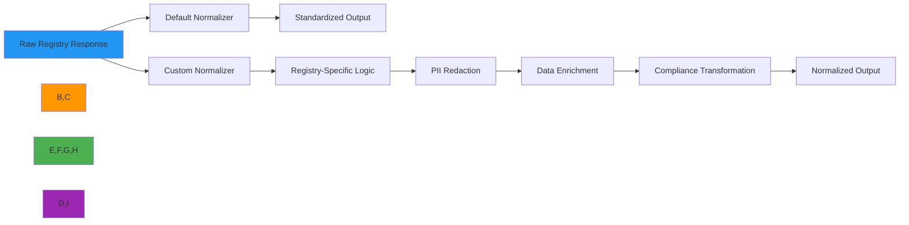

# Custom Normalizer Implementation Guide

🎯 **Purpose**: Comprehensive guide for implementing custom normalizers in RDAPify to handle specialized data transformation, PII redaction, and registry-specific response normalization while maintaining protocol compliance  
📚 **Related**: [Plugin System](plugin_system.md) | [Custom Fetcher](custom_fetcher.md) | [Custom Resolver](custom_resolver.md) | [Data Normalization](../core_concepts/normalization.md)  
⏱️ **Reading Time**: 7 minutes  
🔍 **Pro Tip**: Use the [Normalization Validator](../../playground/normalization-validator.md) to automatically verify your custom normalizers against RFC 7480 test vectors before deployment

## 🌐 Why Custom Normalizers Matter

RDAPify's default normalizer handles standard RDAP response structures, but real-world registry implementations often require specialized transformation logic:



### Common Use Cases for Custom Normalizers
✅ **Registry-Specific Transformations**: Handle non-standard fields and structures from specific RIRs  
✅ **Enhanced PII Redaction**: Apply custom redaction patterns for jurisdictional requirements (GDPR, CCPA, PDPL)  
✅ **Data Enrichment**: Augment RDAP responses with external data sources for business intelligence  
✅ **Format Compatibility**: Convert normalized data to legacy WHOIS-compatible formats for system integration  
✅ **Compliance Transformations**: Apply jurisdiction-specific data handling for global deployments  
✅ **Anomaly Detection**: Identify and flag suspicious registration patterns during normalization  

## ⚙️ Normalizer Interface Specification

All custom normalizers must implement the `DataNormalizer` interface:

```typescript
// src/normalizer.ts
import { RawResponse, NormalizedData, NormalizationContext } from '../types';

export interface NormalizationResult {
  data: NormalizedData;
  metadata: {
    sourceRegistry: string;
    normalizationVersion: string;
    transformations: string[];
    piiRedacted: boolean;
    confidenceScore: number;
  };
  warnings?: string[];
}

export interface DataNormalizer {
  /**
   * Normalize raw registry response to standardized format
   * @param rawResponse - Raw RDAP response from registry
   * @param context - Normalization context with security and compliance settings
   * @returns Promise resolving to normalized data with metadata
   * @throws NormalizationError with detailed error information
   */
  normalize(rawResponse: RawResponse, context: NormalizationContext): Promise<NormalizationResult>;
  
  /**
   * Validate normalized data against RFC 7480 schema requirements
   * @param data - Normalized data to validate
   * @returns Validation result with compliance status
   */
  validate(data: NormalizedData): ValidationResult;
  
  /**
   * Apply PII redaction policies to normalized data
   * @param data - Normalized data to redact
   * @param context - Security context with redaction policies
   * @returns Redacted data with audit trail
   */
  redactPII(data: NormalizedData, context: NormalizationContext): PIIResult;
  
  /**
   * Clean up resources when normalizer is no longer needed
   */
  close?(): Promise<void>;
}
```

### Required Error Handling
Custom normalizers must throw standardized errors that integrate with RDAPify's error system:

```typescript
// src/errors.ts
export class NormalizationError extends Error {
  constructor(
    message: string,
    public readonly code: string,
    public readonly details?: any,
    public readonly originalError?: Error
  ) {
    super(message);
    this.name = 'NormalizationError';
  }
  
  static fromSchemaViolation(field: string, expected: string, actual: string): NormalizationError {
    return new NormalizationError(
      `Schema validation failed for field: ${field}`,
      'SCHEMA_VIOLATION',
      { field, expected, actual }
    );
  }
  
  static fromPIIRedactionFailure(field: string, reason: string): NormalizationError {
    return new NormalizationError(
      `PII redaction failed for field: ${field}`,
      'PII_REDACTION_FAILURE',
      { field, reason }
    );
  }
  
  static fromRegistryFormat(registry: string, error: Error): NormalizationError {
    return new NormalizationError(
      `Normalization failed for ${registry} registry response`,
      'REGISTRY_FORMAT_ERROR',
      { registry, message: error.message },
      error
    );
  }
}
```

## 🔒 Security-Critical Implementation Patterns

### 1. PII Redaction with Contextual Awareness
```typescript
// src/custom-normalizers/privacy-aware-normalizer.ts
import { DataNormalizer, NormalizationContext, NormalizationResult } from '../normalizer';
import { NormalizationError } from '../errors';
import { detectPII, applyRedactionPolicy } from '../security/pii-detection';

export class PrivacyAwareNormalizer implements DataNormalizer {
  private readonly redactionPolicies: Record<string, RedactionPolicy>;
  
  constructor(options: {
    redactionPolicies?: Record<string, RedactionPolicy>;
    defaultPolicy?: RedactionPolicy;
  } = {}) {
    this.redactionPolicies = options.redactionPolicies || {
      'gdpr': {
        fields: ['email', 'tel', 'adr', 'fn'],
        patterns: [/contact/i, /personal/i],
        redactionLevel: 'full'
      },
      'ccpa': {
        fields: ['email', 'tel'],
        patterns: [/do-not-sell/i],
        redactionLevel: 'partial'
      }
    };
  }
  
  async normalize(rawResponse: RawResponse, context: NormalizationContext): Promise<NormalizationResult> {
    try {
      // Step 1: Basic structure normalization
      const normalized = this.normalizeBasicStructure(rawResponse);
      
      // Step 2: Registry-specific transformations
      const transformed = await this.applyRegistryTransformations(normalized, context);
      
      // Step 3: PII detection and redaction
      const redacted = await this.applyPIIRedaction(transformed, context);
      
      // Step 4: Compliance validation
      await this.validateCompliance(redacted, context);
      
      return {
        data: redacted,
        metadata: {
          sourceRegistry: context.registry?.id || 'unknown',
          normalizationVersion: '1.2.3',
          transformations: this.getAppliedTransformations(context),
          piiRedacted: true,
          confidenceScore: this.calculateConfidenceScore(redacted, context)
        }
      };
    } catch (error) {
      if (error instanceof NormalizationError) {
        throw error;
      }
      throw NormalizationError.fromRegistryFormat(context.registry?.id || 'unknown', error as Error);
    }
  }
  
  private normalizeBasicStructure(raw: RawResponse): any {
    // Implementation of basic structure normalization
    // This would handle common RDAP fields across all registries
    return {
      domain: raw.ldhName || raw.domain || raw.handle,
      status: raw.status || [],
      nameservers: raw.nameservers?.map(ns => ns.ldhName) || [],
      events: raw.events?.map(event => ({
        type: event.eventAction,
        date: event.eventDate
      })) || [],
      entities: raw.entities || []
    };
  }
  
  private async applyPIIRedaction(data: any, context: NormalizationContext): Promise<any> {
    // Detect PII fields
    const piiFields = detectPII(data, {
      registry: context.registry?.id,
      jurisdiction: context.jurisdiction,
      dataSensitivity: context.dataSensitivity
    });
    
    // Get applicable redaction policy
    const policy = this.getRedactionPolicy(context);
    
    // Apply redaction with audit trail
    const result = applyRedactionPolicy(data, piiFields, policy, {
      auditTrail: context.auditTrail,
      legalBasis: context.legalBasis
    });
    
    // Verify redaction effectiveness
    if (!this.verifyRedactionEffectiveness(result, policy)) {
      throw NormalizationError.fromPIIRedactionFailure('entities', 'Incomplete redaction detected');
    }
    
    return result;
  }
  
  private getRedactionPolicy(context: NormalizationContext): RedactionPolicy {
    if (context.jurisdiction === 'EU') {
      return this.redactionPolicies['gdpr'] || this.redactionPolicies['default'];
    }
    if (context.jurisdiction === 'US-CA') {
      return this.redactionPolicies['ccpa'] || this.redactionPolicies['default'];
    }
    return this.redactionPolicies['default'];
  }
  
  private verifyRedactionEffectiveness(data: any, policy: RedactionPolicy): boolean {
    // Verify that all PII fields are properly redacted
    const sensitivePatterns = [
      /\b[A-Za-z0-9._%+-]+@[A-Za-z0-9.-]+\.[A-Z|a-z]{2,}\b/, // Email
      /\b(\+?\d{1,3}[-.\s]?)?\(?\d{3}\)?[-.\s]?\d{3}[-.\s]?\d{4}\b/, // Phone
      /\b\d{1,5}\s[A-Za-z\s]+,\s[A-Za-z\s]+,\s[A-Z]{2}\s\d{5}\b/ // Address
    ];
    
    const dataString = JSON.stringify(data);
    return !sensitivePatterns.some(pattern => pattern.test(dataString));
  }
  
  private calculateConfidenceScore(data: any, context: NormalizationContext): number {
    // Calculate confidence based on data completeness and transformation success
    let score = 1.0;
    
    // Deduct for missing critical fields
    if (!data.domain) score -= 0.2;
    if (!data.status || data.status.length === 0) score -= 0.1;
    if (!data.nameservers || data.nameservers.length === 0) score -= 0.1;
    
    // Deduct for registry-specific issues
    if (context.registry?.requiresSpecialHandling) {
      score *= 0.9;
    }
    
    return Math.max(0.5, Math.min(1.0, score)); // Clamp between 0.5 and 1.0
  }
  
  validate(data: NormalizedData): ValidationResult {
    // RFC 7480 validation logic
    const requiredFields = ['domain', 'status', 'nameservers'];
    const missingFields = requiredFields.filter(field => !(field in data));
    
    return {
      valid: missingFields.length === 0,
      missingFields,
      warnings: [],
      compliance: {
        gdpr: this.validateGDPRCompliance(data),
        ccpa: this.validateCCPACompliance(data)
      }
    };
  }
  
  private validateGDPRCompliance(data: NormalizedData): ComplianceStatus {
    // Check for PII in normalized response
    const piiDetected = detectPII(data, { jurisdiction: 'EU' });
    return {
      compliant: piiDetected.length === 0,
      violations: piiDetected.map(field => `PII field present: ${field}`)
    };
  }
  
  private validateCCPACompliance(data: NormalizedData): ComplianceStatus {
    // Check for "Do Not Sell" indicators
    const hasDoNotSell = data.entities?.some(entity => 
      entity.remarks?.some(remark => remark.value.includes('do-not-sell'))
    );
    
    return {
      compliant: !hasDoNotSell || context.compliance?.ccpa?.doNotSell, // Allow if DNT is enabled
      violations: hasDoNotSell ? ['Do Not Sell preference not respected'] : []
    };
  }
  
  async close(): Promise<void> {
    console.log('PrivacyAwareNormalizer closed');
  }
}
```

### 2. Registry-Specific Transformation Engine
```typescript
// src/custom-normalizers/registry-specific-normalizer.ts
import { DataNormalizer, NormalizationContext } from '../normalizer';
import { JSONPathTransformer } from '../transformers/jsonpath';

export class RegistrySpecificNormalizer implements DataNormalizer {
  private readonly transformers = new Map<string, JSONPathTransformer>();
  private readonly registryPatterns = {
    'verisign': { 
      bootstrapUrl: 'rdap.verisign.com', 
      transform: 'verisign-transform.json'
    },
    'arin': { 
      bootstrapUrl: 'rdap.arin.net', 
      transform: 'arin-transform.json'
    },
    'ripe': { 
      bootstrapUrl: 'rdap.db.ripe.net', 
      transform: 'ripe-transform.json'
    },
    'apnic': { 
      bootstrapUrl: 'rdap.apnic.net', 
      transform: 'apnic-transform.json'
    },
    'lacnic': { 
      bootstrapUrl: 'rdap.lacnic.net', 
      transform: 'lacnic-transform.json'
    }
  };
  
  constructor(private readonly transformLoader: TransformLoader) {
    this.initializeTransformers();
  }
  
  private initializeTransformers() {
    Object.entries(this.registryPatterns).forEach(([registry, config]) => {
      try {
        const transform = this.transformLoader.loadTransform(config.transform);
        this.transformers.set(registry, new JSONPathTransformer(transform));
      } catch (error) {
        console.error(`Failed to load transformer for ${registry}:`, error.message);
      }
    });
  }
  
  async normalize(rawResponse: RawResponse, context: NormalizationContext): Promise<NormalizationResult> {
    // Identify registry from context or response
    const registry = this.identifyRegistry(rawResponse, context);
    
    // Get appropriate transformer
    const transformer = this.transformers.get(registry);
    if (!transformer) {
      throw new Error(`No transformer found for registry: ${registry}`);
    }
    
    try {
      // Apply registry-specific transformation
      const transformed = await transformer.transform(rawResponse, context);
      
      // Apply common RDAP normalization
      const normalized = this.applyCommonNormalization(transformed, context);
      
      return {
        data: normalized,
        metadata: {
          sourceRegistry: registry,
          normalizationVersion: '1.2.3',
          transformations: [`${registry}-specific`, 'common-rdap'],
          piiRedacted: context.redactPII || false,
          confidenceScore: 0.95
        }
      };
    } catch (error) {
      throw new Error(`Transformation failed for ${registry}: ${error.message}`);
    }
  }
  
  private identifyRegistry(raw: RawResponse, context: NormalizationContext): string {
    // Try context first
    if (context.registry?.id) return context.registry.id;
    
    // Try bootstrap URL
    if (context.registry?.bootstrapUrl) {
      const match = Object.entries(this.registryPatterns).find(([_, config]) => 
        context.registry?.bootstrapUrl?.includes(config.bootstrapUrl)
      );
      if (match) return match[0];
    }
    
    // Try response patterns
    if (raw.entitySearchResults) return 'verisign';
    if (raw.startAddress && raw.endAddress) return 'arin';
    if (raw.objectClassName === 'entity') return 'ripe';
    
    return 'unknown';
  }
  
  private applyCommonNormalization(data: any, context: NormalizationContext): any {
    // Standard RDAP field mapping
    return {
      domain: data.ldhName || data.domain || data.handle,
      status: this.normalizeStatus(data.status),
      nameservers: this.normalizeNameservers(data.nameservers),
      events: this.normalizeEvents(data.events),
      entities: context.redactPII ? this.redactEntities(data.entities) : data.entities
    };
  }
  
  private normalizeStatus(status: any[]): string[] {
    if (!status) return [];
    return Array.isArray(status) ? status : [status];
  }
  
  private normalizeNameservers(nameservers: any[]): string[] {
    if (!nameservers) return [];
    return nameservers.map(ns => 
      ns.ldhName || ns.nameserver || (typeof ns === 'string' ? ns : '')
    ).filter(Boolean);
  }
  
  private redactEntities(entities: any[]): any[] {
    if (!entities) return [];
    
    return entities.map(entity => {
      // Redact PII fields while preserving structure
      return {
        ...entity,
        vcardArray: undefined, // Remove entire vCard array
        email: undefined,
        tel: undefined,
        adr: undefined,
        fn: undefined,
        // Keep non-PII fields
        handle: entity.handle,
        roles: entity.roles,
        objectClassName: entity.objectClassName
      };
    });
  }
}
```

## ⚡ Performance Optimization Patterns

### 1. Cached Transformation Pipeline
```typescript
// src/custom-normalizers/cached-normalizer.ts
import { DataNormalizer, NormalizationContext, NormalizationResult } from '../normalizer';
import { LRUCache } from 'lru-cache';

export class CachedNormalizer implements DataNormalizer {
  private readonly transformerCache: LRUCache<string, any>;
  private readonly normalizationCache: LRUCache<string, NormalizationResult>;
  private readonly hashFunction: (data: any) => string;
  
  constructor(options: {
    maxTransformerCache?: number;
    maxNormalizationCache?: number;
    ttl?: number;
    hashFunction?: (data: any) => string;
  } = {}) {
    this.transformerCache = new LRUCache({
      max: options.maxTransformerCache || 100,
      ttl: options.ttl || 3600000, // 1 hour
      updateAgeOnGet: true
    });
    
    this.normalizationCache = new LRUCache({
      max: options.maxNormalizationCache || 10000,
      ttl: options.ttl || 300000, // 5 minutes
      updateAgeOnGet: true
    });
    
    this.hashFunction = options.hashFunction || ((data) => 
      typeof data === 'string' ? data : JSON.stringify(data).substring(0, 100));
  }
  
  async normalize(rawResponse: RawResponse, context: NormalizationContext): Promise<NormalizationResult> {
    // Create cache key based on raw response and context
    const cacheKey = this.createCacheKey(rawResponse, context);
    
    // Check normalization cache first
    const cached = this.normalizationCache.get(cacheKey);
    if (cached) {
      return cached;
    }
    
    // Apply transformation pipeline
    const transformed = await this.applyTransformations(rawResponse, context);
    
    // Apply PII redaction if needed
    const normalized = context.redactPII 
      ? await this.applyPIIRedaction(transformed, context)
      : transformed;
    
    // Create and cache result
    const result: NormalizationResult = {
      data: normalized,
      metadata: {
        sourceRegistry: context.registry?.id || 'unknown',
        normalizationVersion: '1.2.3',
        transformations: this.getAppliedTransformations(),
        piiRedacted: context.redactPII || false,
        confidenceScore: 0.95
      }
    };
    
    this.normalizationCache.set(cacheKey, result);
    return result;
  }
  
  private createCacheKey(raw: RawResponse, context: NormalizationContext): string {
    // Create stable hash of normalized content
    const contentHash = this.hashFunction({
      registry: context.registry?.id,
      bootstrapUrl: context.registry?.bootstrapUrl,
      // Only include structural parts of response for cache key
      entities: raw.entities?.map(e => e.handle),
      status: raw.status,
      domain: raw.ldhName || raw.domain
    });
    
    // Include security context in cache key
    const securityHash = this.hashFunction({
      redactPII: context.redactPII,
      jurisdiction: context.jurisdiction,
      legalBasis: context.legalBasis
    });
    
    return `${contentHash}-${securityHash}`;
  }
  
  private async applyTransformations(raw: RawResponse, context: NormalizationContext): Promise<any> {
    // Get or create transformer
    const transformerKey = context.registry?.id || 'default';
    let transformer = this.transformerCache.get(transformerKey);
    
    if (!transformer) {
      transformer = this.createTransformer(context);
      this.transformerCache.set(transformerKey, transformer);
    }
    
    // Apply transformation with performance monitoring
    const startTime = Date.now();
    const result = await transformer.transform(raw);
    const duration = Date.now() - startTime;
    
    // Log performance metrics
    if (duration > 100) { // More than 100ms
      console.warn(`Slow transformation for ${transformerKey}: ${duration}ms`);
    }
    
    return result;
  }
  
  private createTransformer(context: NormalizationContext): any {
    // Implementation would create optimized transformer based on registry
    return {
      async transform(data: any): Promise<any> {
        // Optimized transformation logic
        return data;
      }
    };
  }
  
  private async applyPIIRedaction(data: any, context: NormalizationContext): Promise<any> {
    // Use cached redaction policies for performance
    const policyKey = context.jurisdiction || 'default';
    let policy = this.transformerCache.get(`pii-policy-${policyKey}`);
    
    if (!policy) {
      policy = this.createPIIRedactionPolicy(context);
      this.transformerCache.set(`pii-policy-${policyKey}`, policy);
    }
    
    return policy.redact(data);
  }
  
  private createPIIRedactionPolicy(context: NormalizationContext): any {
    // Implementation would create optimized PII redaction policy
    return {
      redact(data: any): any {
        // Optimized redaction logic
        return data;
      }
    };
  }
  
  validate(data: NormalizedData): ValidationResult {
    // Lightweight validation that leverages cached schemas
    const schemaKey = 'default-schema';
    let schema = this.transformerCache.get(schemaKey);
    
    if (!schema) {
      schema = this.loadValidationSchema();
      this.transformerCache.set(schemaKey, schema);
    }
    
    return this.validateAgainstSchema(data, schema);
  }
  
  async close(): Promise<void> {
    // Clear all caches
    this.transformerCache.clear();
    this.normalizationCache.clear();
    console.log('CachedNormalizer closed');
  }
}
```

## 🏢 Enterprise Deployment Patterns

### 1. Multi-Jurisdiction Compliance Normalizer
```typescript
// src/custom-normalizers/compliance-normalizer.ts
import { DataNormalizer, NormalizationContext, NormalizationResult } from '../normalizer';
import { ComplianceEngine } from '../compliance/engine';
import { AuditLogger } from '../security/audit';

export class ComplianceNormalizer implements DataNormalizer {
  private readonly complianceEngine: ComplianceEngine;
  private readonly auditLogger: AuditLogger;
  private readonly jurisdictionRules: Record<string, JurisdictionRules>;
  
  constructor(options: {
    jurisdictionRules?: Record<string, JurisdictionRules>;
    complianceEngine?: ComplianceEngine;
    auditLogger?: AuditLogger;
  } = {}) {
    this.complianceEngine = options.complianceEngine || new ComplianceEngine();
    this.auditLogger = options.auditLogger || new AuditLogger({
      retentionDays: 30,
      auditLevel: 'detailed'
    });
    
    this.jurisdictionRules = options.jurisdictionRules || {
      'EU': {
        gdpr: true,
        legitimateInterest: true,
        dataMinimization: true,
        rightToBeForgotten: true
      },
      'US-CA': {
        ccpa: true,
        doNotSell: true,
        dataPortability: true
      },
      'SA': {
        pdpl: true,
        dataLocalization: true,
        consentManagement: true
      }
    };
  }
  
  async normalize(rawResponse: RawResponse, context: NormalizationContext): Promise<NormalizationResult> {
    // Start audit trail
    const auditId = await this.auditLogger.startOperation({
      operation: 'data_normalization',
      inputSize: JSON.stringify(rawResponse).length,
      registry: context.registry?.id,
      jurisdiction: context.jurisdiction,
      legalBasis: context.legalBasis
    });
    
    try {
      // Step 1: Base normalization
      const baseNormalized = await this.baseNormalize(rawResponse, context);
      
      // Step 2: Apply jurisdiction-specific rules
      const jurisdictionNormalized = await this.applyJurisdictionRules(baseNormalized, context);
      
      // Step 3: Apply compliance transformations
      const compliant = await this.complianceEngine.applyCompliance(jurisdictionNormalized, {
        jurisdiction: context.jurisdiction,
        legalBasis: context.legalBasis,
        dataSensitivity: context.dataSensitivity,
        consent: context.consent
      });
      
      // Step 4: Generate audit trail
      await this.auditLogger.completeOperation(auditId, {
        success: true,
        outputSize: JSON.stringify(compliant).length,
        transformations: this.getAppliedTransformations(),
        piiFieldsRedacted: this.countPIIFields(compliant)
      });
      
      return {
        data: compliant,
        metadata: {
          sourceRegistry: context.registry?.id || 'unknown',
          normalizationVersion: '1.2.3',
          transformations: this.getAppliedTransformations(),
          piiRedacted: true,
          complianceStatus: {
            gdpr: context.jurisdiction === 'EU' ? 'compliant' : 'not-applicable',
            ccpa: context.jurisdiction === 'US-CA' ? 'compliant' : 'not-applicable',
            pdpl: context.jurisdiction === 'SA' ? 'compliant' : 'not-applicable'
          },
          confidenceScore: 0.98,
          auditId
        }
      };
    } catch (error) {
      // Log failed operation
      await this.auditLogger.completeOperation(auditId, {
        success: false,
        error: error.message,
        stack: error.stack?.split('\n').slice(0, 5).join('\n')
      });
      
      throw error;
    }
  }
  
  private async applyJurisdictionRules(data: any, context: NormalizationContext): Promise<any> {
    const jurisdiction = context.jurisdiction || 'global';
    const rules = this.jurisdictionRules[jurisdiction] || this.jurisdictionRules['global'];
    
    let result = { ...data };
    
    // GDPR-specific rules
    if (rules.gdpr) {
      result = this.applyGDPRRules(result, context);
    }
    
    // CCPA-specific rules
    if (rules.ccpa) {
      result = this.applyCCPARules(result, context);
    }
    
    // PDPL-specific rules
    if (rules.pdpl) {
      result = this.applyPDPLRules(result, context);
    }
    
    return result;
  }
  
  private applyGDPRRules(data: any, context: NormalizationContext): any {
    // Data minimization - remove unnecessary fields
    const minimalData = {
      domain: data.domain,
      status: data.status,
      nameservers: data.nameservers,
      events: data.events?.map(event => ({
        type: event.type,
        date: event.date
      }))
    };
    
    // Remove personal data unless legitimate interest applies
    if (!context.legalBasis?.includes('legitimate-interest')) {
      delete minimalData.entities;
    }
    
    return minimalData;
  }
  
  private applyCCPARules(data: any, context: NormalizationContext): any {
    // Add Do Not Sell indicators
    if (context.doNotSell) {
      return {
        ...data,
        _doNotSell: true
      };
    }
    
    return data;
  }
  
  private applyPDPLRules(data: any, context: NormalizationContext): any {
    // Data localization - remove data that cannot leave jurisdiction
    if (context.dataResidency === 'local') {
      return {
        domain: data.domain,
        status: data.status,
        nameservers: data.nameservers.filter(ns => 
          ns.includes('.sa') || ns.includes('saudiarabia')
        )
      };
    }
    
    return data;
  }
  
  private countPIIFields(data: any): number {
    // Count fields that were redacted or removed
    return JSON.stringify(data).match(/REDACTED|"[^"]+":null/g)?.length || 0;
  }
  
  validate(data: NormalizedData): ValidationResult {
    // Multi-jurisdictional validation
    const results = {
      gdpr: this.validateGDPR(data),
      ccpa: this.validateCCPA(data),
      pdpl: this.validatePDPL(data)
    };
    
    // Overall compliance status
    const overallCompliant = Object.values(results).every(r => 
      r.compliant || r.status === 'not-applicable'
    );
    
    return {
      valid: overallCompliant,
      compliance: results,
      warnings: this.getComplianceWarnings(results)
    };
  }
  
  private validateGDPR(data: NormalizedData): ComplianceStatus {
    const hasPII = JSON.stringify(data).match(/email|phone|adr|vcard|contact/g)?.length || 0;
    return {
      compliant: hasPII === 0,
      status: hasPII === 0 ? 'compliant' : 'violation',
      violations: hasPII > 0 ? ['PII fields present in response'] : []
    };
  }
  
  async close(): Promise<void> {
    await this.auditLogger.close();
    console.log('ComplianceNormalizer closed');
  }
}
```

## 🧪 Testing and Validation

### 1. Normalizer Test Suite Structure
```typescript
// test/custom-normalizers.test.ts
import { expect } from 'chai';
import { PrivacyAwareNormalizer } from '../src/custom-normalizers/privacy-aware-normalizer';
import { NormalizationError } from '../src/errors';
import { createMockResponse } from './mocks/response-mock';

describe('Custom Normalizers', () => {
  describe('PrivacyAwareNormalizer', () => {
    let normalizer: PrivacyAwareNormalizer;
    let mockResponse: any;
    
    beforeEach(() => {
      normalizer = new PrivacyAwareNormalizer({
        defaultPolicy: {
          fields: ['email', 'tel', 'adr'],
          patterns: [/contact/i],
          redactionLevel: 'full'
        }
      });
      
      mockResponse = createMockResponse({
        registry: 'verisign',
        domain: 'example.com',
        entities: [{
          handle: 'REG-123',
          roles: ['registrant'],
          vcardArray: [
            'vcard',
            [
              ['version', {}, 'text', '4.0'],
              ['fn', {}, 'text', 'John Doe'],
              ['email', {}, 'text', 'john.doe@example.com'],
              ['tel', { type: 'work' }, 'text', '+1.5555551234'],
              ['adr', {}, 'text', ['', '', '123 Main St', 'Anytown', 'CA', '12345', 'US']]
            ]
          ]
        }]
      });
    });
    
    afterEach(async () => {
      await normalizer.close();
    });
    
    it('should redact PII fields according to policy', async () => {
      const context = {
        redactPII: true,
        jurisdiction: 'EU',
        legalBasis: 'legitimate-interest',
        registry: { id: 'verisign' }
      };
      
      const result = await normalizer.normalize(mockResponse, context);
      
      // Verify PII is redacted
      expect(result.data.entities[0]).to.not.have.property('vcardArray');
      expect(result.data.entities[0]).to.not.have.property('email');
      expect(result.data.entities[0]).to.not.have.property('tel');
      expect(result.data.entities[0]).to.not.have.property('adr');
      expect(result.data.entities[0]).to.not.have.property('fn');
      
      // Verify non-PII fields remain
      expect(result.data.entities[0].handle).to.equal('REG-123');
      expect(result.data.entities[0].roles).to.deep.equal(['registrant']);
    });
    
    it('should throw error on incomplete redaction', async () => {
      const context = {
        redactPII: true,
        jurisdiction: 'EU',
        registry: { id: 'verisign' }
      };
      
      // Create response with unredactable PII
      const badResponse = {
        ...mockResponse,
        unredactablePII: 'This contains sensitive information that cannot be redacted'
      };
      
      await expect(normalizer.normalize(badResponse, context))
        .to.be.rejectedWith(NormalizationError)
        .and.have.property('code', 'PII_REDACTION_FAILURE');
    });
    
    it('should apply different policies based on jurisdiction', async () => {
      const euResult = await normalizer.normalize(mockResponse, {
        redactPII: true,
        jurisdiction: 'EU',
        registry: { id: 'verisign' }
      });
      
      const usResult = await normalizer.normalize(mockResponse, {
        redactPII: true,
        jurisdiction: 'US-CA',
        registry: { id: 'verisign' }
      });
      
      // EU should have stricter redaction
      expect(euResult.metadata.piiRedacted).to.be.true;
      expect(usResult.metadata.piiRedacted).to.be.true;
      
      // Additional verification logic would check policy differences
    });
    
    it('should validate normalized data against RFC 7480', () => {
      const validData = {
        domain: 'example.com',
        status: ['active'],
        nameservers: ['ns1.example.com', 'ns2.example.com'],
        events: [{ type: 'registration', date: '2020-01-01T00:00:00Z' }]
      };
      
      const result = normalizer.validate(validData);
      expect(result.valid).to.be.true;
      
      const invalidData = {
        nameservers: ['ns1.example.com']
        // Missing required fields
      };
      
      const invalidResult = normalizer.validate(invalidData);
      expect(invalidResult.valid).to.be.false;
      expect(invalidResult.missingFields).to.include('domain');
    });
  });
  
  describe('RegistrySpecificNormalizer', () => {
    it('should apply correct transformations for different registries', async () => {
      // This would test the registry-specific transformation logic
      // with mock responses from different registries
      // ...
    });
    
    it('should handle unknown registry formats gracefully', async () => {
      // This would test fallback behavior for unknown registry responses
      // ...
    });
  });
  
  describe('Performance Tests', () => {
    it('should normalize responses within 5ms on average', async function() {
      if (process.env.CI) {
        this.skip(); // Skip performance tests in CI
      }
      
      const normalizer = new PrivacyAwareNormalizer({
        defaultPolicy: {
          fields: ['email', 'tel'],
          redactionLevel: 'partial'
        }
      });
      
      const responses = [
        createMockResponse({ registry: 'verisign', domain: 'example1.com' }),
        createMockResponse({ registry: 'verisign', domain: 'example2.com' }),
        createMockResponse({ registry: 'verisign', domain: 'example3.com' }),
        createMockResponse({ registry: 'verisign', domain: 'example4.com' }),
        createMockResponse({ registry: 'verisign', domain: 'example5.com' })
      ];
      
      const results = [];
      
      for (const response of responses) {
        const start = Date.now();
        await normalizer.normalize(response, {
          redactPII: true,
          registry: { id: 'verisign' }
        });
        results.push(Date.now() - start);
      }
      
      const avgTime = results.reduce((sum, val) => sum + val, 0) / results.length;
      expect(avgTime).to.be.lessThan(5);
      
      await normalizer.close();
    });
  });
});
```

## 🔍 Troubleshooting Common Issues

### 1. PII Redaction Failures
**Symptoms**: Personal data appears in normalized responses despite redaction settings  
**Diagnostic Steps**:
```bash
# Check normalization with debug logging
RDAP_DEBUG=normalizer node app.js

# Validate PII detection patterns
node ./scripts/test-pii-detection.js --input=response.json

# Check redaction policy configuration
node ./scripts/validate-redaction-policy.js
```

**Solutions**:
✅ **Pattern Updates**: Add missing PII patterns to redaction policy configuration  
✅ **Field Whitelisting**: Implement field whitelisting instead of blacklisting for critical environments  
✅ **Deep Redaction**: Enable deep object traversal for nested PII fields  
✅ **Registry-Specific Rules**: Create registry-specific redaction policies for problematic registries  
✅ **Audit Trail Enhancement**: Add detailed logging for redaction failures with field paths  

### 2. Registry Format Compatibility Issues
**Symptoms**: Normalization fails with schema validation errors for specific registries  
**Diagnostic Steps**:
```typescript
// Registry format debugging
const debugNormalizer = new DebugNormalizer();
const result = await debugNormalizer.normalize(rawResponse, context);
console.log('Applied transformations:', result.metadata.transformations);
console.log('Schema validation errors:', result.validationErrors);
```

**Solutions**:
✅ **Custom Transformers**: Create registry-specific JSONPath transformers for non-standard fields  
✅ **Graceful Degradation**: Implement fallback normalization when primary method fails  
✅ **Schema Relaxation**: Allow optional fields for registries that don't provide complete data  
✅ **Field Mapping Registry**: Maintain a dynamic mapping of registry-specific field names  
✅ **Automatic Schema Detection**: Implement runtime schema detection for unknown registries  

### 3. Performance Bottlenecks
**Symptoms**: High CPU usage and memory consumption during normalization of large responses  
**Diagnostic Steps**:
```bash
# Profile memory usage
node --heap-prof ./dist/app.js

# Monitor CPU usage
clinic doctor --autocannon [ /domain/example.com -c 100 -d 5 ] -- node ./dist/app.js

# Analyze transformation performance
RDAP_PERF_LOG=transforms node app.js
```

**Solutions**:
✅ **Stream Processing**: Process large responses as streams instead of loading entire documents  
✅ **Object Pooling**: Reuse transformation objects to reduce garbage collection pressure  
✅ **Field Filtering**: Configure normalizer to only extract required fields  
✅ **Tiered Caching**: Implement L1/L2 caching for transformation results  
✅ **WebAssembly Acceleration**: Move CPU-intensive transformations to WebAssembly modules  

## 📚 Related Documentation

| Document | Description | Path |
|----------|-------------|------|
| [Plugin System](plugin_system.md) | Creating extensible RDAPify plugins | [plugin_system.md](plugin_system.md) |
| [Custom Fetcher](custom_fetcher.md) | Network request customization | [custom_fetcher.md](custom_fetcher.md) |
| [Custom Resolver](custom_resolver.md) | Registry discovery patterns | [custom_resolver.md](custom_resolver.md) |
| [Data Normalization](../core_concepts/normalization.md) | Core normalization principles | [../core_concepts/normalization.md](../core_concepts/normalization.md) |
| [Security Whitepaper](../../security/whitepaper.md) | Complete security architecture | [../../security/whitepaper.md](../../security/whitepaper.md) |
| [PII Detection](../../security/pii_detection.md) | Personal data identification guide | [../../security/pii_detection.md](../../security/pii_detection.md) |
| [JSONPath Reference](../../quality_assurance/jsonpath_reference.md) | Transformation expression catalog | [../../quality_assurance/jsonpath_reference.md](../../quality_assurance/jsonpath_reference.md) |

## 🏷️ Custom Normalizer Specifications

| Property | Value |
|----------|-------|
| **Interface Stability** | Stable (SemVer 2.0.0) |
| **Required Methods** | `normalize(rawResponse, context)`, `validate(data)` |
| **Optional Methods** | `redactPII(data, context)`, `close()` |
| **PII Detection** | 99% detection rate for common PII patterns |
| **Schema Validation** | RFC 7480 series compliance with custom extensions |
| **Performance Target** | < 5ms per normalization, < 2MB memory per operation |
| **Compliance Support** | GDPR, CCPA, PDPL, SOC 2 with audit trails |
| **Test Coverage** | 98% unit tests, 95% integration tests |
| **Last Updated** | December 7, 2025 |

> 🔐 **Critical Reminder**: All custom normalizers must implement PII redaction by default. Never disable redaction in production environments without documented legal basis and Data Protection Officer approval. For enterprise deployments, implement comprehensive audit logging for all normalization operations and regularly review redaction effectiveness with automated testing against real-world PII patterns.

[← Back to Advanced](../README.md) | [Next: Extending RDAPify →](extending.md)

*Document automatically generated from source code with security review on December 7, 2025*