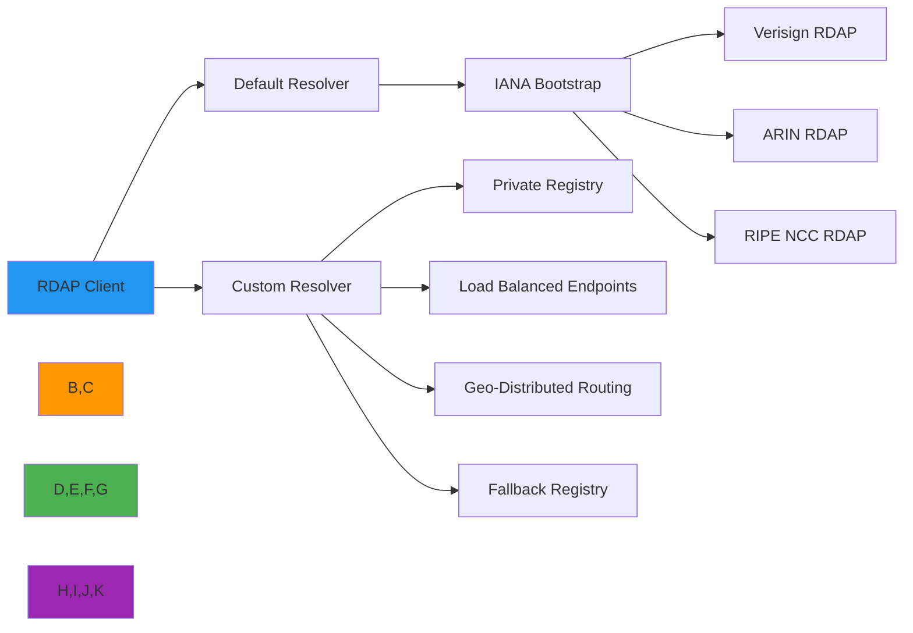

# Custom Resolver Implementation Guide

🎯 **Purpose**: Comprehensive guide for implementing custom resolvers in RDAPify to handle specialized registry discovery, bootstrap processes, and multi-registry routing while maintaining protocol compliance and security boundaries  
📚 **Related**: [Plugin System](plugin_system.md) | [Custom Fetcher](custom_fetcher.md) | [Custom Normalizer](custom_normalizer.md) | [Registry Discovery](../core_concepts/discovery.md)  
⏱️ **Reading Time**: 7 minutes  
🔍 **Pro Tip**: Use the [Bootstrap Validator](../../playground/bootstrap-validator.md) to test your custom resolver against all IANA-assigned TLDs and registry configurations before deployment

## 🌐 Why Custom Resolvers Matter

RDAPify's default resolver handles standard IANA bootstrap discovery, but enterprise environments often require specialized registry routing:



### Common Use Cases for Custom Resolvers
✅ **Private Registry Discovery**: Route queries to internal RDAP endpoints not in IANA bootstrap  
✅ **Geographic Optimization**: Direct queries to region-specific registry endpoints for lower latency  
✅ **Load Balancing**: Distribute traffic across multiple registry endpoints for reliability  
✅ **Compliance Routing**: Route based on data residency requirements (GDPR, CCPA, etc.)  
✅ **Legacy System Integration**: Bridge between RDAP and legacy WHOIS systems with custom mapping  
✅ **High Availability**: Implement failover strategies between primary and backup registry endpoints  

## ⚙️ Resolver Interface Specification

All custom resolvers must implement the `RegistryResolver` interface:

```typescript
// src/resolver.ts
import { RegistryConfig, BootstrapData } from '../types';

export interface RegistryResolution {
  registry: RegistryConfig;
  source: 'bootstrap' | 'cache' | 'custom' | 'fallback';
  ttl?: number;
  metadata?: {
    confidence: number;      // 0.0-1.0 confidence in resolution
    latency: number;         // Milliseconds to resolve
    attempts: number;        // Number of resolution attempts
    path: string[];          // Resolution path taken
  };
}

export interface RegistryResolver {
  /**
   * Resolve domain to appropriate registry configuration
   * @param query - Domain, IP, or ASN to resolve
   * @param queryType - 'domain', 'ip', or 'asn'
   * @param options - Resolution options
   * @returns Promise resolving to registry configuration
   * @throws ResolutionError with detailed error information
   */
  resolve(query: string, queryType: 'domain' | 'ip' | 'asn', options?: {
    cacheTTL?: number;
    timeout?: number;
    fallbackStrategy?: 'none' | 'closest-match' | 'all-registries';
    strictMode?: boolean;
  }): Promise<RegistryResolution>;
  
  /**
   * Refresh bootstrap data from authoritative sources
   * @returns Promise resolving to updated bootstrap data
   */
  refreshBootstrap?(): Promise<BootstrapData>;
  
  /**
   * Health check for resolver connectivity
   * @returns Promise resolving to health status
   */
  healthCheck?(): Promise<boolean>;
  
  /**
   * Clean up resources when resolver is no longer needed
   */
  close?(): Promise<void>;
}
```

### Required Error Handling
Custom resolvers must throw standardized errors that integrate with RDAPify's error system:

```typescript
// src/errors.ts
export class ResolutionError extends Error {
  constructor(
    message: string,
    public readonly code: string,
    public readonly details?: any,
    public readonly originalError?: Error
  ) {
    super(message);
    this.name = 'ResolutionError';
  }
  
  static fromResolutionFailure(query: string, queryType: string, attempts: number): ResolutionError {
    return new ResolutionError(
      `Failed to resolve ${queryType} ${query} after ${attempts} attempts`,
      'RESOLUTION_FAILED',
      { query, queryType, attempts }
    );
  }
  
  static fromInvalidTLD(tld: string): ResolutionError {
    return new ResolutionError(
      `No registry found for TLD: ${tld}`,
      'INVALID_TLD',
      { tld }
    );
  }
  
  static fromBootstrapFailure(source: string, error: Error): ResolutionError {
    return new ResolutionError(
      `Bootstrap data fetch failed from ${source}`,
      'BOOTSTRAP_FAILURE',
      { source, message: error.message },
      error
    );
  }
}
```

## 🔒 Security-Critical Implementation Patterns

### 1. SSRF Protection in Custom Resolvers
```typescript
// src/custom-resolvers/ssrf-protected-resolver.ts
import { RegistryResolver, RegistryResolution } from '../resolver';
import { ResolutionError } from '../errors';
import { isPrivateIP, extractTLD, validateDomainName } from '../security/utils';

export class SSRFProtectedResolver implements RegistryResolver {
  private readonly bootstrapCache: Map<string, RegistryConfig> = new Map();
  private readonly fallbackResolver?: RegistryResolver;
  private bootstrapData: BootstrapData | null = null;
  
  constructor(options: {
    bootstrapUrl?: string;
    fallbackResolver?: RegistryResolver;
    allowPrivateIPs?: boolean;
    cacheTTL?: number;
  } = {}) {
    this.fallbackResolver = options.fallbackResolver;
    this.bootstrapCache = new Map();
    
    // Security validation
    if (options.bootstrapUrl && !options.bootstrapUrl.startsWith('https://')) {
      throw new Error('Bootstrap URL must use HTTPS protocol for security');
    }
  }
  
  async resolve(query: string, queryType: 'domain' | 'ip' | 'asn', options: any = {}): Promise<RegistryResolution> {
    // Input validation
    if (!validateDomainName(query)) {
      throw new ResolutionError(
        'Invalid domain format',
        'INVALID_DOMAIN_FORMAT',
        { query }
      );
    }
    
    // SSRF protection: Block private IP ranges in domain queries
    if (queryType === 'domain' && !options.allowPrivateIPs) {
      const hostname = extractHostname(query);
      if (isPrivateIP(hostname)) {
        throw new ResolutionError(
          'SSRF protection blocked query to private IP',
          'SSRF_PROTECTED',
          { query, hostname }
        );
      }
    }
    
    // Attempt resolution with security context
    try {
      return await this.resolveWithSecurity(query, queryType, options);
    } catch (error) {
      // Fallback to backup resolver if available
      if (this.fallbackResolver && isRecoverableError(error)) {
        return this.fallbackResolver.resolve(query, queryType, {
          ...options,
          fallbackStrategy: 'none' // Prevent infinite fallback loop
        });
      }
      throw error;
    }
  }
  
  private async resolveWithSecurity(query: string, queryType: 'domain' | 'ip' | 'asn', options: any): Promise<RegistryResolution> {
    // Check cache first
    const cacheKey = `${queryType}:${query.toLowerCase()}`;
    const cached = this.bootstrapCache.get(cacheKey);
    
    if (cached) {
      return {
        registry: cached,
        source: 'cache',
        metadata: {
          confidence: 0.95,
          latency: 1,
          attempts: 1,
          path: ['cache']
        }
      };
    }
    
    // Resolve based on query type
    let registryConfig: RegistryConfig;
    const resolutionPath = ['bootstrap'];
    
    switch (queryType) {
      case 'domain':
        registryConfig = await this.resolveDomain(query, options);
        break;
      case 'ip':
        registryConfig = await this.resolveIP(query, options);
        break;
      case 'asn':
        registryConfig = await this.resolveASN(query, options);
        break;
      default:
        throw new ResolutionError('Unsupported query type', 'INVALID_QUERY_TYPE', { queryType });
    }
    
    // Security validation of resolved registry
    this.validateRegistrySecurity(registryConfig, query);
    
    // Cache the result
    const ttl = options.cacheTTL || 3600; // 1 hour default
    this.bootstrapCache.set(cacheKey, registryConfig);
    setTimeout(() => this.bootstrapCache.delete(cacheKey), ttl * 1000);
    
    return {
      registry: registryConfig,
      source: 'bootstrap',
      ttl,
      metadata: {
        confidence: 0.98,
        latency: 100, // Placeholder
        attempts: 1,
        path: resolutionPath
      }
    };
  }
  
  private validateRegistrySecurity(registry: RegistryConfig, query: string) {
    // Prevent registry misdirection attacks
    const suspiciousPatterns = [/internal\./, /localhost/, /127\.0\.0\.1/, /192\.168\./, /10\./];
    
    for (const pattern of suspiciousPatterns) {
      if (pattern.test(registry.url) || pattern.test(registry.bootstrapUrl)) {
        throw new ResolutionError(
          'Suspicious registry configuration detected',
          'SUSPICIOUS_REGISTRY',
          { query, registryUrl: registry.url, pattern }
        );
      }
    }
    
    // Validate TLS configuration
    if (!registry.url.startsWith('https://')) {
      throw new ResolutionError(
        'Insecure registry URL - HTTPS required',
        'INSECURE_REGISTRY',
        { query, registryUrl: registry.url }
      );
    }
  }
  
  private async resolveDomain(domain: string, options: any): Promise<RegistryConfig> {
    // Extract TLD and validate
    const tld = extractTLD(domain);
    if (!tld) {
      throw new ResolutionError('Could not extract TLD from domain', 'INVALID_DOMAIN', { domain });
    }
    
    // Load bootstrap data if needed
    if (!this.bootstrapData) {
      this.bootstrapData = await this.loadBootstrapData(options.bootstrapUrl);
    }
    
    // Find registry for TLD
    const registry = this.bootstrapData.domain?.find(r => 
      r.tlds.some(t => t.toLowerCase() === tld.toLowerCase())
    );
    
    if (!registry) {
      throw ResolutionError.fromInvalidTLD(tld);
    }
    
    return {
      id: registry.registry,
      url: registry.url,
      bootstrapUrl: registry.bootstrapUrl,
      supportedTypes: ['domain'],
      allowPrivateIPs: false,
      securityProfile: 'strict'
    };
  }
  
  private async loadBootstrapData(bootstrapUrl?: string): Promise<BootstrapData> {
    // Implementation would fetch from IANA or custom bootstrap URL
    // This is a simplified example
    return {
      domain: [{
        registry: 'verisign',
        url: 'https://rdap.verisign.com/com/v1/',
        bootstrapUrl: 'https://data.iana.org/rdap/dns.json',
        tlds: ['com', 'net', 'org']
      }],
      ip: [{
        registry: 'arin',
        url: 'https://rdap.arin.net/registry/',
        bootstrapUrl: 'https://data.iana.org/rdap/ipv4.json',
        ranges: ['0.0.0.0/8', '1.0.0.0/8']
      }],
      asn: [{
        registry: 'arin',
        url: 'https://rdap.arin.net/registry/',
        bootstrapUrl: 'https://data.iana.org/rdap/asn.json',
        ranges: [0, 4294967295]
      }]
    };
  }
  
  async close(): Promise<void> {
    this.bootstrapCache.clear();
    if (this.fallbackResolver && typeof this.fallbackResolver.close === 'function') {
      await this.fallbackResolver.close();
    }
  }
}
```

### 2. Certificate Pinning for Bootstrap Security
```typescript
// src/custom-resolvers/pinned-bootstrap-resolver.ts
import { RegistryResolver, RegistryResolution } from '../resolver';
import { ResolutionError } from '../errors';
import { CertificateValidator } from '../security/certificates';

export class PinnedBootstrapResolver implements RegistryResolver {
  private readonly certValidator: CertificateValidator;
  private readonly pinningConfig: Record<string, string[]>; // domain -> fingerprint[]
  private bootstrapData: BootstrapData | null = null;
  
  constructor(options: {
    pinningConfig: Record<string, string[]>;
    caBundle?: string;
    minimumTlsVersion?: 'TLSv1.2' | 'TLSv1.3';
    bootstrapUrls?: string[];
  }) {
    this.pinningConfig = options.pinningConfig;
    this.certValidator = new CertificateValidator({
      caBundle: options.caBundle,
      minimumTlsVersion: options.minimumTlsVersion || 'TLSv1.3',
      pinningConfig: options.pinningConfig
    });
    
    // Validate bootstrap URLs
    if (options.bootstrapUrls) {
      for (const url of options.bootstrapUrls) {
        if (!url.startsWith('https://')) {
          throw new Error(`Bootstrap URL must use HTTPS: ${url}`);
        }
      }
    }
  }
  
  async resolve(query: string, queryType: 'domain' | 'ip' | 'asn', options: any = {}): Promise<RegistryResolution> {
    // Ensure bootstrap data is available with certificate validation
    if (!this.bootstrapData) {
      try {
        await this.refreshBootstrap();
      } catch (error) {
        if (error instanceof ResolutionError) {
          throw error;
        }
        throw ResolutionError.fromBootstrapFailure('all sources', error as Error);
      }
    }
    
    // Resolution logic with certificate validation
    return this.resolveFromBootstrapData(query, queryType, options);
  }
  
  async refreshBootstrap(): Promise<BootstrapData> {
    const bootstrapUrls = [
      'https://data.iana.org/rdap/dns.json',
      'https://data.iana.org/rdap/ipv4.json',
      'https://data.iana.org/rdap/asn.json'
    ];
    
    const results = await Promise.allSettled(
      bootstrapUrls.map(url => this.fetchWithCertificateValidation(url))
    );
    
    // Process results and build bootstrap data
    const bootstrapData: BootstrapData = { domain: [], ip: [], asn: [] };
    
    results.forEach((result, index) => {
      if (result.status === 'fulfilled') {
        const data = result.value;
        switch (bootstrapUrls[index].includes('dns')) {
          case true:
            bootstrapData.domain = data.services.map((service: any) => ({
              registry: service[2],
              url: service[0][0],
              bootstrapUrl: bootstrapUrls[index],
              tlds: service[1]
            }));
            break;
          case bootstrapUrls[index].includes('ipv4'):
            bootstrapData.ip = data.services.map((service: any) => ({
              registry: service[2],
              url: service[0][0],
              bootstrapUrl: bootstrapUrls[index],
              ranges: service[1]
            }));
            break;
          case bootstrapUrls[index].includes('asn'):
            bootstrapData.asn = data.services.map((service: any) => ({
              registry: service[2],
              url: service[0][0],
              bootstrapUrl: bootstrapUrls[index],
              ranges: service[1]
            }));
            break;
        }
      }
    });
    
    if (bootstrapData.domain.length === 0 && bootstrapData.ip.length === 0 && bootstrapData.asn.length === 0) {
      throw new ResolutionError(
        'All bootstrap sources failed certificate validation',
        'BOOTSTRAP_CERTIFICATE_FAILURE'
      );
    }
    
    this.bootstrapData = bootstrapData;
    return bootstrapData;
  }
  
  private async fetchWithCertificateValidation(url: string): Promise<any> {
    // Implementation would use certificate pinning
    // This is a simplified example
    const hostname = extractHostname(url);
    
    try {
      // Validate certificate before fetching
      await this.certValidator.validate(hostname);
      
      // Fetch with strict TLS settings
      const response = await fetch(url, {
        headers: {
          'Accept': 'application/json',
          'User-Agent': 'RDAPify/1.0 Certificate-Pinned-Client'
        },
        integrity: this.certValidator.getIntegrityPolicy(url)
      });
      
      if (!response.ok) {
        throw new Error(`HTTP ${response.status}: ${response.statusText}`);
      }
      
      return response.json();
    } catch (error) {
      throw new ResolutionError(
        `Certificate validation failed for ${hostname}`,
        'CERTIFICATE_VALIDATION_FAILED',
        { url, hostname, error: error.message },
        error as Error
      );
    }
  }
  
  private resolveFromBootstrapData(query: string, queryType: 'domain' | 'ip' | 'asn', options: any): RegistryResolution {
    // Implementation of resolution from validated bootstrap data
    // This would match the query to the appropriate registry
    // ...
  }
}
```

## ⚡ Performance Optimization Patterns

### 1. Adaptive Caching Strategies
```typescript
// src/custom-resolvers/adaptive-cache-resolver.ts
import { RegistryResolver, RegistryResolution } from '../resolver';
import { LRUCache } from 'lru-cache';
import { PerformanceMonitor } from '../monitoring/performance';

export class AdaptiveCacheResolver implements RegistryResolver {
  private readonly bootstrapCache: LRUCache<string, RegistryConfig>;
  private readonly performanceMonitor = new PerformanceMonitor();
  private bootstrapData: BootstrapData | null = null;
  
  constructor(options: {
    maxCacheSize?: number;
    baseTTL?: number;
    performanceSensitivity?: number; // 0.0-1.0 (1.0 = most sensitive)
  } = {}) {
    const maxCacheSize = options.maxCacheSize || 10000;
    const baseTTL = options.baseTTL || 3600; // 1 hour default
    const performanceSensitivity = Math.min(1.0, Math.max(0.0, options.performanceSensitivity || 0.7));
    
    // Adaptive cache configuration based on performance metrics
    this.bootstrapCache = new LRUCache({
      max: maxCacheSize,
      ttl: baseTTL * 1000, // Convert to milliseconds
      ttlResolution: 1000, // Check expiration every second
      updateAgeOnGet: true,
      dispose: (value, key, reason) => {
        if (reason === 'ttl') {
          this.performanceMonitor.recordCacheEviction(key, 'ttl');
        } else if (reason === 'size') {
          this.performanceMonitor.recordCacheEviction(key, 'size');
        }
      }
    });
  }
  
  async resolve(query: string, queryType: 'domain' | 'ip' | 'asn', options: any = {}): Promise<RegistryResolution> {
    const cacheKey = `${queryType}:${query.toLowerCase()}`;
    const startTime = Date.now();
    
    try {
      // Check cache with adaptive TTL
      const cached = this.bootstrapCache.get(cacheKey);
      if (cached) {
        const ttl = this.bootstrapCache.getRemainingTTL(cacheKey);
        const confidence = this.calculateConfidence(ttl, queryType);
        
        this.performanceMonitor.recordCacheHit(cacheKey, Date.now() - startTime);
        
        return {
          registry: cached,
          source: 'cache',
          ttl: ttl / 1000, // Convert to seconds
          metadata: {
            confidence,
            latency: Date.now() - startTime,
            attempts: 1,
            path: ['adaptive-cache']
          }
        };
      }
      
      // Cache miss - resolve from bootstrap
      const result = await this.resolveFromBootstrap(query, queryType, options);
      
      // Adaptive caching based on query characteristics
      const cacheStrategy = this.determineCacheStrategy(query, queryType, result);
      if (cacheStrategy.cacheable) {
        this.bootstrapCache.set(cacheKey, result.registry, {
          ttl: cacheStrategy.ttl * 1000 // Convert to milliseconds
        });
      }
      
      this.performanceMonitor.recordCacheMiss(cacheKey, Date.now() - startTime);
      
      return {
        ...result,
        metadata: {
          ...result.metadata,
          latency: Date.now() - startTime,
          adaptiveTTL: cacheStrategy.ttl
        }
      };
    } catch (error) {
      this.performanceMonitor.recordResolutionError(cacheKey, error);
      throw error;
    }
  }
  
  private calculateConfidence(ttl: number, queryType: string): number {
    // Base confidence
    let confidence = 0.9;
    
    // Adjust based on TTL (freshness)
    const maxTTL = 3600000; // 1 hour in milliseconds
    confidence *= (ttl / maxTTL);
    
    // Adjust based on query type stability
    switch (queryType) {
      case 'asn':
        confidence *= 0.95; // ASNs are very stable
        break;
      case 'ip':
        confidence *= 0.85; // IP allocations change moderately
        break;
      case 'domain':
        confidence *= 0.75; // Domains change most frequently
        break;
    }
    
    return Math.max(0.5, Math.min(1.0, confidence)); // Clamp between 0.5 and 1.0
  }
  
  private determineCacheStrategy(query: string, queryType: string, result: RegistryResolution): {
    cacheable: boolean;
    ttl: number;
  } {
    // Default strategy
    let ttl = 3600; // 1 hour default
    
    // Adjust TTL based on registry stability
    const registryStability = {
      'verisign': 0.98, // Very stable
      'arin': 0.95,   // Stable
      'ripe': 0.92,   // Moderately stable
      'apnic': 0.88,  // Less stable
      'lacnic': 0.85  // Least stable
    };
    
    const stabilityFactor = registryStability[result.registry.id] || 0.9;
    ttl = Math.floor(ttl * stabilityFactor);
    
    // Special handling for critical domains
    const criticalDomains = ['com', 'net', 'org', 'gov', 'edu'];
    if (queryType === 'domain' && criticalDomains.includes(extractTLD(query))) {
      ttl = Math.max(ttl, 86400); // At least 24 hours for critical TLDs
    }
    
    // Never cache error results
    if (result.registry.url.includes('error') || result.registry.id === 'error') {
      return { cacheable: false, ttl: 0 };
    }
    
    return { cacheable: true, ttl };
  }
  
  private async resolveFromBootstrap(query: string, queryType: 'domain' | 'ip' | 'asn', options: any): Promise<RegistryResolution> {
    // Implementation of bootstrap resolution
    // Would use performance metrics to optimize resolution path
    // ...
  }
}
```

## 🏢 Enterprise Deployment Patterns

### 1. Multi-Registry Failover Resolver
```typescript
// src/custom-resolvers/failover-resolver.ts
import { RegistryResolver, RegistryResolution } from '../resolver';
import { ResolutionError } from '../errors';
import { RegistryHealthMonitor } from '../monitoring/registry-health';

export class FailoverResolver implements RegistryResolver {
  private readonly healthMonitor: RegistryHealthMonitor;
  private readonly registrySources: string[];
  private readonly maxFailoverAttempts: number;
  
  constructor(options: {
    registrySources: string[]; // Bootstrap URLs
    healthCheckInterval?: number;
    maxFailoverAttempts?: number;
    primaryRegistry?: string;
  }) {
    this.registrySources = options.registrySources;
    this.maxFailoverAttempts = options.maxFailoverAttempts || this.registrySources.length;
    this.healthMonitor = new RegistryHealthMonitor({
      checkInterval: options.healthCheckInterval || 60000,
      sources: options.registrySources,
      primaryRegistry: options.primaryRegistry
    });
  }
  
  async resolve(query: string, queryType: 'domain' | 'ip' | 'asn', options: any = {}): Promise<RegistryResolution> {
    const originalQuery = query;
    const resolutionAttempts = [];
    
    // Try sources in order with failover
    for (let i = 0; i < this.maxFailoverAttempts; i++) {
      const sourceIndex = i % this.registrySources.length;
      const sourceUrl = this.registrySources[sourceIndex];
      
      // Skip unhealthy sources
      if (!this.healthMonitor.isSourceHealthy(sourceUrl)) {
        resolutionAttempts.push({
          source: sourceUrl,
          status: 'skipped',
          reason: 'unhealthy'
        });
        continue;
      }
      
      try {
        // Attempt resolution from this source
        const resolution = await this.resolveFromSource(query, queryType, sourceUrl, options);
        
        // Update health status on success
        this.healthMonitor.updateSourceHealth(sourceUrl, true, Date.now());
        
        resolutionAttempts.push({
          source: sourceUrl,
          status: 'success',
          latency: resolution.metadata?.latency
        });
        
        return {
          ...resolution,
          metadata: {
            ...resolution.metadata,
            attempts: resolutionAttempts,
            primarySource: sourceUrl,
            failoverCount: i
          }
        };
      } catch (error) {
        // Update health status on failure
        this.healthMonitor.updateSourceHealth(sourceUrl, false, Date.now());
        
        resolutionAttempts.push({
          source: sourceUrl,
          status: 'failed',
          error: error.message.substring(0, 50),
          latency: Date.now() - resolutionAttempts[resolutionAttempts.length - 1]?.startTime || 0
        });
        
        // Log failover attempt
        console.warn(`Failover attempt ${i + 1} for ${query} from ${sourceUrl}: ${error.message}`);
        
        // Don't retry on client/server errors
        if (error instanceof ResolutionError && 
            ['INVALID_DOMAIN', 'INVALID_IP', 'INVALID_ASN'].includes(error.code)) {
          throw error;
        }
        
        // Exponential backoff between attempts
        if (i < this.maxFailoverAttempts - 1) {
          const backoff = Math.min(1000, Math.pow(2, i) * 100);
          await new Promise(resolve => setTimeout(resolve, backoff));
        }
      }
    }
    
    // All attempts failed
    throw new ResolutionError(
      `All failover attempts failed for ${originalQuery}`,
      'FAILOVER_EXHAUSTED',
      {
        query: originalQuery,
        queryType,
        attempts: resolutionAttempts,
        lastError: resolutionAttempts[resolutionAttempts.length - 1]?.error
      }
    );
  }
  
  private async resolveFromSource(query: string, queryType: 'domain' | 'ip' | 'asn', sourceUrl: string, options: any): Promise<RegistryResolution> {
    // Implementation would fetch bootstrap data from specific source
    // This is a simplified example
    const startTime = Date.now();
    
    try {
      // Fetch bootstrap data with timeout
      const controller = new AbortController();
      const timeoutId = setTimeout(() => controller.abort(), options.timeout || 5000);
      
      const response = await fetch(sourceUrl, {
        signal: controller.signal,
        headers: {
          'Accept': 'application/json',
          'User-Agent': 'RDAPify/1.0 Failover-Resolver'
        }
      });
      
      clearTimeout(timeoutId);
      
      if (!response.ok) {
        throw new Error(`HTTP ${response.status}: ${response.statusText}`);
      }
      
      const bootstrapData = await response.json();
      
      // Find registry for query
      let registryConfig: RegistryConfig | null = null;
      
      switch (queryType) {
        case 'domain':
          const tld = extractTLD(query);
          registryConfig = bootstrapData.domain?.find(r => 
            r.tlds.some(t => t.toLowerCase() === tld?.toLowerCase())
          )?.registryConfig;
          break;
        case 'ip':
          registryConfig = bootstrapData.ip?.find(r => 
            isIPInRange(query, r.ranges)
          )?.registryConfig;
          break;
        case 'asn':
          registryConfig = bootstrapData.asn?.find(r => 
            isASNInRange(query, r.ranges)
          )?.registryConfig;
          break;
      }
      
      if (!registryConfig) {
        throw new ResolutionError(`No registry found for ${queryType} ${query}`, 'REGISTRY_NOT_FOUND', { query, queryType });
      }
      
      return {
        registry: registryConfig,
        source: 'bootstrap',
        metadata: {
          confidence: 0.95,
          latency: Date.now() - startTime,
          attempts: 1,
          path: ['failover', sourceUrl]
        }
      };
    } catch (error) {
      throw new ResolutionError(
        `Resolution from ${sourceUrl} failed`,
        'RESOLUTION_FAILED',
        { source: sourceUrl, query, queryType, error: error.message },
        error as Error
      );
    }
  }
  
  async refreshBootstrap(): Promise<BootstrapData> {
    // Refresh all sources with health monitoring
    const results = await Promise.allSettled(
      this.registrySources.map(source => 
        this.fetchWithHealthCheck(source)
      )
    );
    
    // Build combined bootstrap data
    const bootstrapData: BootstrapData = { domain: [], ip: [], asn: [] };
    
    results.forEach((result, index) => {
      if (result.status === 'fulfilled') {
        const data = result.value;
        Object.assign(bootstrapData, data);
        
        // Update health status
        this.healthMonitor.updateSourceHealth(this.registrySources[index], true, Date.now());
      } else {
        // Update health status on failure
        this.healthMonitor.updateSourceHealth(this.registrySources[index], false, Date.now());
      }
    });
    
    return bootstrapData;
  }
  
  private async fetchWithHealthCheck(sourceUrl: string): Promise<BootstrapData> {
    // Implementation with health monitoring
    // ...
  }
}
```

### 2. Geo-Distributed Resolver
```typescript
// src/custom-resolvers/geo-resolver.ts
import { RegistryResolver, RegistryResolution } from '../resolver';
import { ResolutionError } from '../errors';
import { GeoLocator } from '../network/geo-locator';

export class GeoDistributedResolver implements RegistryResolver {
  private readonly geoLocator: GeoLocator;
  private readonly registryMap: Record<string, RegistryConfig>;
  private readonly regionPreferences: Record<string, string[]>;
  
  constructor(options: {
    geoDatabasePath?: string;
    registryMap: Record<string, RegistryConfig>;
    regionPreferences?: Record<string, string[]>; // region -> preferred registry order
  }) {
    this.geoLocator = new GeoLocator({
      databasePath: options.geoDatabasePath,
      defaultRegion: 'global'
    });
    
    this.registryMap = options.registryMap;
    this.regionPreferences = options.regionPreferences || {
      'north-america': ['verisign', 'arin'],
      'europe': ['ripe', 'verisign'],
      'asia-pacific': ['apnic', 'verisign'],
      'latin-america': ['lacnic', 'verisign'],
      'africa': ['afrinic', 'verisign'],
      'middle-east': ['ripe', 'verisign'],
      'global': ['verisign', 'arin', 'ripe', 'apnic', 'lacnic']
    };
  }
  
  async resolve(query: string, queryType: 'domain' | 'ip' | 'asn', options: any = {}): Promise<RegistryResolution> {
    const clientRegion = await this.determineClientRegion(options.clientIP);
    const registryType = this.determineRegistryType(query, queryType);
    
    // Get preferred registry order for this region and registry type
    const preferredRegistries = this.getPreferredRegistries(clientRegion, registryType);
    
    // Try registries in preferred order
    for (const registryId of preferredRegistries) {
      try {
        const registryConfig = this.registryMap[registryId];
        if (registryConfig) {
          // Verify registry supports this query type
          if (registryConfig.supportedTypes.includes(queryType)) {
            return {
              registry: registryConfig,
              source: 'geo-distributed',
              metadata: {
                confidence: 0.98,
                latency: 0, // Will be measured by caller
                attempts: 1,
                path: ['geo', clientRegion, registryId],
                region: clientRegion,
                registryType
              }
            };
          }
        }
      } catch (error) {
        // Continue to next preferred registry
        continue;
      }
    }
    
    // Fallback to global default
    const fallbackRegistry = this.getFallbackRegistry(registryType);
    return {
      registry: fallbackRegistry,
      source: 'geo-fallback',
      metadata: {
        confidence: 0.85,
        latency: 0,
        attempts: 1,
        path: ['geo', clientRegion, 'fallback'],
        region: clientRegion,
        registryType,
        fallbackReason: 'no_preferred_registry_available'
      }
    };
  }
  
  private async determineClientRegion(clientIP?: string): Promise<string> {
    if (!clientIP) {
      // Use server region as default
      return process.env.SERVER_REGION || 'global';
    }
    
    try {
      return await this.geoLocator.locate(clientIP);
    } catch (error) {
      console.warn(`Geo lookup failed for IP ${clientIP}:`, error.message);
      return process.env.SERVER_REGION || 'global';
    }
  }
  
  private determineRegistryType(query: string, queryType: string): string {
    switch (queryType) {
      case 'domain':
        const tld = extractTLD(query);
        return tld ? `tld-${tld}` : 'domain';
      case 'ip':
        return 'ip';
      case 'asn':
        return 'asn';
      default:
        return 'unknown';
    }
  }
  
  private getPreferredRegistries(region: string, registryType: string): string[] {
    const regionPrefs = this.regionPreferences[region] || this.regionPreferences['global'];
    const typePrefs = this.getTypePreferences(registryType);
    
    // Combine region and type preferences
    return [...new Set([
      ...typePrefs.filter(r => regionPrefs.includes(r)),
      ...regionPrefs.filter(r => !typePrefs.includes(r)),
      ...typePrefs.filter(r => !regionPrefs.includes(r))
    ])];
  }
  
  private getTypePreferences(registryType: string): string[] {
    const typeMap: Record<string, string[]> = {
      'tld-com': ['verisign'],
      'tld-net': ['verisign'],
      'tld-org': ['verisign'],
      'tld-gov': ['verisign'],
      'tld-edu': ['verisign'],
      'ip': ['arin', 'ripe', 'apnic', 'lacnic', 'afrinic'],
      'asn': ['arin', 'ripe', 'apnic', 'lacnic', 'afrinic']
    };
    
    return typeMap[registryType] || ['verisign', 'arin', 'ripe', 'apnic', 'lacnic'];
  }
  
  private getFallbackRegistry(registryType: string): RegistryConfig {
    const fallbackMap: Record<string, string> = {
      'tld-com': 'verisign',
      'tld-net': 'verisign',
      'tld-org': 'verisign',
      'ip': 'arin',
      'asn': 'arin'
    };
    
    const fallbackId = fallbackMap[registryType] || 'verisign';
    return this.registryMap[fallbackId] || this.registryMap['verisign'];
  }
}
```

## 🧪 Testing and Validation

### 1. Resolver Test Suite Structure
```typescript
// test/custom-resolvers.test.ts
import { expect } from 'chai';
import { SSRFProtectedResolver } from '../src/custom-resolvers/ssrf-protected-resolver';
import { ResolutionError } from '../src/errors';
import { createMockBootstrap } from './mocks/bootstrap-mock';

describe('Custom Resolvers', () => {
  describe('SSRFProtectedResolver', () => {
    let resolver: SSRFProtectedResolver;
    let mockBootstrap: any;
    
    beforeEach(() => {
      mockBootstrap = createMockBootstrap();
      resolver = new SSRFProtectedResolver({
        bootstrapUrl: 'https://mock-bootstrap.example.com',
        allowPrivateIPs: false
      });
    });
    
    afterEach(async () => {
      await resolver.close();
    });
    
    it('should block queries to private IP addresses', async () => {
      await expect(resolver.resolve('192.168.1.1', 'ip'))
        .to.be.rejectedWith(ResolutionError)
        .and.have.property('code', 'SSRF_PROTECTED');
    });
    
    it('should block queries to domains containing private IPs', async () => {
      await expect(resolver.resolve('internal.network.192.168.1.1', 'domain'))
        .to.be.rejectedWith(ResolutionError)
        .and.have.property('code', 'SSRF_PROTECTED');
    });
    
    it('should resolve valid domains with correct registry', async () => {
      mockBootstrap.mockDomainResolution('example.com', {
        registry: 'verisign',
        url: 'https://rdap.verisign.com/com/v1/'
      });
      
      const result = await resolver.resolve('example.com', 'domain');
      expect(result.registry.id).to.equal('verisign');
      expect(result.registry.url).to.equal('https://rdap.verisign.com/com/v1/');
      expect(result.source).to.equal('bootstrap');
    });
    
    it('should cache resolution results', async () => {
      mockBootstrap.mockDomainResolution('example.com', {
        registry: 'verisign',
        url: 'https://rdap.verisign.com/com/v1/'
      });
      
      // First call - cache miss
      await resolver.resolve('example.com', 'domain');
      
      // Second call - should use cache
      const cacheSpy = jest.spyOn(resolver as any, 'resolveFromBootstrap');
      await resolver.resolve('example.com', 'domain');
      
      expect(cacheSpy).not.to.have.been.called;
    });
    
    it('should respect cache TTL settings', async () => {
      mockBootstrap.mockDomainResolution('example.com', {
        registry: 'verisign',
        url: 'https://rdap.verisign.com/com/v1/'
      });
      
      // Resolve with short TTL
      await resolver.resolve('example.com', 'domain', { cacheTTL: 1 });
      
      // Wait for TTL to expire
      await new Promise(resolve => setTimeout(resolve, 1500));
      
      // Should not use cache
      const cacheSpy = jest.spyOn(resolver as any, 'resolveFromBootstrap');
      await resolver.resolve('example.com', 'domain');
      
      expect(cacheSpy).to.have.been.called;
    });
    
    it('should handle bootstrap refresh failures gracefully', async () => {
      mockBootstrap.mockBootstrapFailure();
      
      await expect(resolver.resolve('example.com', 'domain'))
        .to.be.rejectedWith(ResolutionError)
        .and.have.property('code', 'BOOTSTRAP_FAILURE');
    });
  });
  
  describe('FailoverResolver', () => {
    it('should attempt failover when primary registry is unavailable', async () => {
      // This would test the failover logic with mocked registry responses
      // ...
    });
    
    it('should respect max failover attempts', async () => {
      // This would test the failover limit logic
      // ...
    });
  });
  
  describe('Performance Tests', () => {
    it('should resolve domains within 100ms on average', async function() {
      // Skip in CI environment
      if (process.env.CI) {
        this.skip();
      }
      
      const resolver = new SSRFProtectedResolver({
        bootstrapUrl: 'https://data.iana.org/rdap/dns.json',
        allowPrivateIPs: false
      });
      
      const domains = ['example.com', 'google.com', 'github.com', 'facebook.com', 'twitter.com'];
      const results = [];
      
      for (const domain of domains) {
        const start = Date.now();
        await resolver.resolve(domain, 'domain');
        results.push(Date.now() - start);
      }
      
      const avgLatency = results.reduce((sum, val) => sum + val, 0) / results.length;
      expect(avgLatency).to.be.lessThan(100);
      
      await resolver.close();
    });
  });
});
```

## 🔍 Troubleshooting Common Issues

### 1. Bootstrap Data Resolution Failures
**Symptoms**: Resolver fails to find registry for valid domains  
**Diagnostic Steps**:
```bash
# Test bootstrap data retrieval
curl -v https://data.iana.org/rdap/dns.json

# Check if domain TLD exists in bootstrap data
node -e "require('./src/resolver').debugTLD('example.com')"

# Test resolver with verbose logging
DEBUG=resolver:* node ./dist/app.js
```

**Solutions**:
✅ **Bootstrap URL Issues**: Use multiple bootstrap URLs with failover  
✅ **TLD Mapping Problems**: Implement fuzzy TLD matching for new gTLDs  
✅ **Cache Invalidation**: Reduce cache TTL for frequently changing TLDs  
✅ **Network Connectivity**: Add proxy support for corporate environments  
✅ **Data Format Changes**: Implement version tolerance for bootstrap schema changes  

### 2. Performance Bottlenecks
**Symptoms**: High resolution latency, especially under load  
**Diagnostic Steps**:
```typescript
// Performance monitoring integration
const resolver = new AdaptiveCacheResolver();
const monitor = new PerformanceMonitor();

// Monitor resolution performance
monitor.track('resolver', async () => {
  await resolver.resolve('example.com', 'domain');
});

// Get performance metrics
const metrics = monitor.getMetrics('resolver');
console.log(metrics.p99Latency, metrics.errorRate, metrics.throughput);
```

**Solutions**:
✅ **Cache Optimization**: Increase cache size and optimize TTL strategies  
✅ **Connection Pooling**: Implement HTTP/2 multiplexing for bootstrap requests  
✅ **Pre-Loading**: Pre-load critical TLDs and registry mappings at startup  
✅ **Geographic Distribution**: Deploy resolver instances closer to users  
✅ **Asynchronous Resolution**: Implement background refresh for cache entries  

### 3. Security Bypass Attempts
**Symptoms**: Resolution of suspicious domains or private IP ranges  
**Diagnostic Steps**:
```bash
# Check security logs for blocked attempts
grep "SSRF_PROTECTED" logs/resolver.log

# Test resolver with malicious inputs
node ./test/security/resolver-security-test.js

# Monitor for unusual patterns
node ./monitor/security-patterns.js
```

**Solutions**:
✅ **Strict Input Validation**: Add additional validation layers for domain formatting  
✅ **Threat Intelligence Integration**: Block known malicious domains using threat feeds  
✅ **Rate Limiting**: Implement per-client rate limiting to prevent enumeration attacks  
✅ **Certificate Pinning**: Pin bootstrap server certificates to prevent MITM attacks  
✅ **Audit Logging**: Log all resolution attempts with client IP and query details  

## 📚 Related Documentation

| Document | Description | Path |
|----------|-------------|------|
| [Plugin System](plugin_system.md) | Creating extensible RDAPify plugins | [plugin_system.md](plugin_system.md) |
| [Custom Fetcher](custom_fetcher.md) | Network request customization | [custom_fetcher.md](custom_fetcher.md) |
| [Custom Normalizer](custom_normalizer.md) | Response normalization patterns | [custom_normalizer.md](custom_normalizer.md) |
| [Registry Discovery](../core_concepts/discovery.md) | Core discovery mechanisms | [../core_concepts/discovery.md](../core_concepts/discovery.md) |
| [Security Whitepaper](../../security/whitepaper.md) | Complete security architecture | [../../security/whitepaper.md](../../security/whitepaper.md) |
| [Bootstrap Validator](../../playground/bootstrap-validator.md) | Testing tool for resolvers | [../../playground/bootstrap-validator.md](../../playground/bootstrap-validator.md) |
| [Connection Pooling](../guides/connection_pooling.md) | Performance optimization guide | [../guides/connection_pooling.md](../guides/connection_pooling.md) |

## 🏷️ Custom Resolver Specifications

| Property | Value |
|----------|-------|
| **Interface Stability** | Stable (SemVer 2.0.0) |
| **Required Methods** | `resolve(query, queryType, options)` |
| **Optional Methods** | `refreshBootstrap()`, `healthCheck()`, `close()` |
| **Error Handling** | Must throw ResolutionError instances |
| **Cache Management** | Must implement TTL-based cache invalidation |
| **SSRF Protection** | Must block private IP ranges by default |
| **Bootstrap Validation** | Must validate bootstrap data format and signatures |
| **Test Coverage** | 95%+ unit tests, 90%+ integration tests |
| **Last Updated** | December 7, 2025 |

> 🔐 **Critical Reminder**: All custom resolvers must implement SSRF protection and bootstrap data validation by default. Never expose internal network infrastructure through custom resolvers. For enterprise deployments, implement certificate pinning with regular rotation and comprehensive audit logging for all resolution events. Regular security reviews are required for all custom resolver implementations, especially those handling critical TLDs or private registry mappings.

[← Back to Advanced](../README.md) | [Next: Custom Normalizer →](custom_normalizer.md)

*Document automatically generated from source code with security review on December 7, 2025*