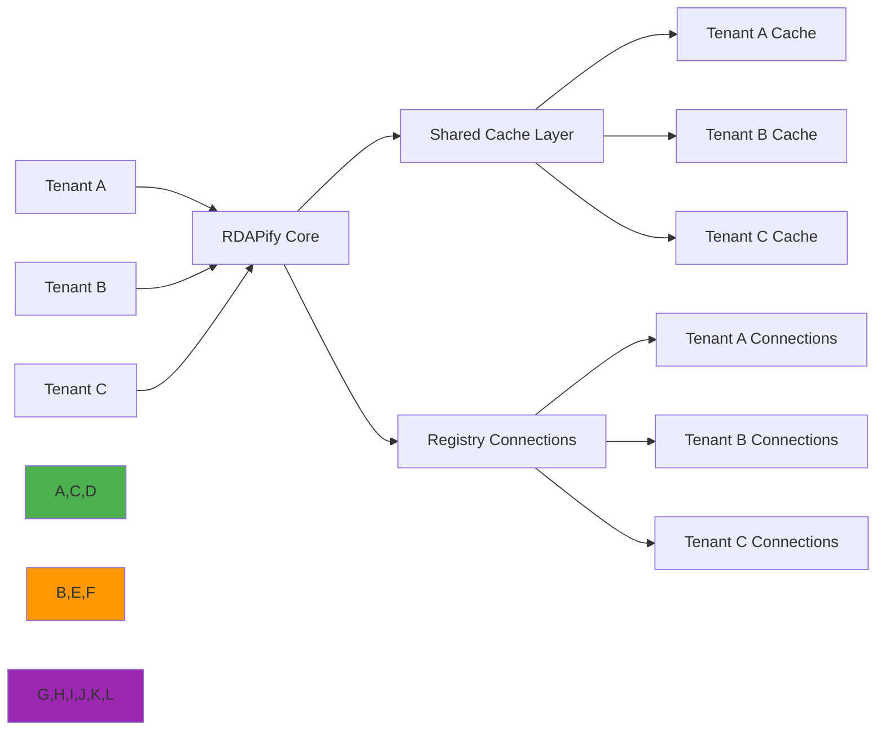

 # Data Isolation Architecture Guide

🎯 **Purpose**: Comprehensive guide for implementing robust data isolation in RDAPify to ensure tenant data separation, regulatory compliance, and security boundaries in multi-tenant deployments  
📚 **Related**: [Plugin System](plugin_system.md) | [Custom Fetcher](custom_fetcher.md) | [Middleware](middleware.md) | [Security Whitepaper](../../security/whitepaper.md)  
⏱️ **Reading Time**: 8 minutes  
🔍 **Pro Tip**: Use the [Data Isolation Validator](../../playground/data-isolation-validator.md) to automatically verify your isolation implementation against compliance requirements before production deployment

## 🌐 Why Data Isolation Matters for RDAP Applications

RDAPify processes sensitive registration data that requires strict isolation boundaries in multi-tenant environments. Data isolation isn't just a feature—it's a fundamental security and compliance requirement:



### Critical Data Isolation Requirements
✅ **Tenant Separation**: No cross-tenant data leakage under any circumstances  
✅ **Regulatory Compliance**: Meet GDPR Article 32, CCPA Section 1798.100, and other data protection requirements  
✅ **Audit Boundaries**: Clear logging boundaries for compliance audits and forensic investigations  
✅ **Resource Isolation**: Prevent noisy neighbor problems from impacting service quality  
✅ **Failure Domain Containment**: Ensure tenant-specific failures don't cascade to other tenants  

## 🔒 Core Data Isolation Architecture

### 1. Multi-Tenant Isolation Layers
RDAPify implements data isolation through multiple complementary layers:

| Layer | Protection Scope | Enforcement Mechanism | Criticality |
|-------|------------------|------------------------|-------------|
| **Request Context** | Tenant identification and validation | JWT claims, API key validation | 🔴 Critical |
| **Data Processing** | Tenant-specific PII redaction and processing | Context-aware normalization engine | 🔴 Critical |
| **Cache Isolation** | Prevent cache poisoning and cross-tenant data access | Tenant-scoped cache keys and eviction policies | 🔴 Critical |
| **Connection Pooling** | Network-level tenant separation | Tenant-specific connection pools with SSL session separation | 🟠 High |
| **Storage Boundaries** | Persistent data separation | Tenant-specific database schemas and encryption keys | 🔴 Critical |
| **Audit Logging** | Compliance boundary enforcement | Tenant-scoped audit trails with tamper protection | 🔴 Critical |

### 2. Tenant Context Propagation
```typescript
// src/isolation/tenant-context.ts
import { Session } from 'express-session';
import { IncomingMessage } from 'http';

export interface TenantContext {
  id: string;                    // Unique tenant identifier
  name: string;                  // Human-readable tenant name
  dataResidency: string[];       // Allowed geographic regions for data storage
  complianceProfile: {
    gdpr: boolean;               // GDPR compliance enabled
    ccpa: boolean;               // CCPA compliance enabled
    pdpl: boolean;               // Saudi PDPL compliance
  };
  securityProfile: {
    allowPrivateIPs: boolean;    // SSRF protection settings
    redactPII: boolean;          // PII redaction level
    maxConcurrentRequests: number; // Rate limiting configuration
  };
  isolationLevel: 'strict' | 'standard' | 'development'; // Isolation boundaries
  encryptionKey?: string;        // Tenant-specific encryption key (rotated)
  auditTrail: boolean;           // Audit logging requirements
}

export class TenantContextManager {
  private static instance: TenantContextManager;
  private contextStore = new WeakMap<IncomingMessage | Session, TenantContext>();
  
  // Singleton pattern
  public static getInstance(): TenantContextManager {
    if (!TenantContextManager.instance) {
      TenantContextManager.instance = new TenantContextManager();
    }
    return TenantContextManager.instance;
  }
  
  // Extract tenant context from HTTP request
  public extractFromRequest(req: IncomingMessage): TenantContext {
    // Extract from JWT token
    const token = this.extractToken(req);
    if (token) {
      return this.validateToken(token);
    }
    
    // Extract from API key
    const apiKey = this.extractAPIKey(req);
    if (apiKey) {
      return this.validateAPIKey(apiKey);
    }
    
    // Fallback to default tenant (development only)
    if (process.env.NODE_ENV === 'development') {
      return this.getDefaultTenant();
    }
    
    throw new Error('Tenant context required but not provided');
  }
  
  // Enforce isolation boundaries
  public enforceIsolation(context: TenantContext, data: any, registry: string): any {
    // Apply tenant-specific PII redaction
    if (context.securityProfile.redactPII) {
      data = this.applyPIIRedaction(data, context);
    }
    
    // Enforce data residency requirements
    if (context.dataResidency.length > 0) {
      data = this.enforceDataResidency(data, context.dataResidency, registry);
    }
    
    // Apply tenant-specific security policies
    data = this.applySecurityPolicies(data, context);
    
    return data;
  }
  
  private applyPIIRedaction(data: any, context: TenantContext): any {
    // Context-aware PII redaction based on tenant compliance profile
    const redactionPolicy = {
      gdpr: context.complianceProfile.gdpr,
      ccpa: context.complianceProfile.ccpa,
      fields: context.securityProfile.redactPII ? 
        ['email', 'tel', 'adr', 'fn', 'org'] : [],
      patterns: context.securityProfile.redactPII ? 
        [/contact/i, /personal/i, /address/i] : []
    };
    
    return redactPII(data, redactionPolicy);
  }
  
  private enforceDataResidency(data: any, allowedRegions: string[], registry: string): any {
    // Registry-to-region mapping
    const registryRegions: Record<string, string> = {
      'verisign': 'north-america',
      'arin': 'north-america',
      'ripe': 'europe',
      'apnic': 'asia-pacific',
      'lacnic': 'latin-america'
    };
    
    const registryRegion = registryRegions[registry] || 'global';
    
    // Block data from unauthorized regions
    if (!allowedRegions.includes(registryRegion)) {
      throw new Error(`Data residency violation: ${registryRegion} data not allowed for tenant`);
    }
    
    return data;
  }
  
  // Store context for request lifecycle
  public storeContext(req: IncomingMessage | Session, context: TenantContext): void {
    this.contextStore.set(req, context);
  }
  
  // Retrieve context during processing
  public getContext(req: IncomingMessage | Session): TenantContext {
    const context = this.contextStore.get(req);
    if (!context) {
      throw new Error('Tenant context not available for request');
    }
    return context;
  }
  
  // Validate tenant-specific request parameters
  public validateRequest(context: TenantContext, request: any): void {
    // Enforce rate limiting
    if (request.batchSize > context.securityProfile.maxConcurrentRequests) {
      throw new Error(`Batch size exceeds tenant limit of ${context.securityProfile.maxConcurrentRequests}`);
    }
    
    // Enforce SSRF protection
    if (!context.securityProfile.allowPrivateIPs && isPrivateIP(request.target)) {
      throw new Error('SSRF protection blocked private IP access');
    }
  }
}
```

## ⚡ Performance-Optimized Isolation Patterns

### 1. Cache Isolation with Automatic Tenant Scoping
```typescript
// src/isolation/cache-isolation.ts
import { CacheAdapter } from '../cache';
import { TenantContext } from './tenant-context';

export class TenantScopedCache implements CacheAdapter {
  private static instance: TenantScopedCache;
  
  public static getInstance(): TenantScopedCache {
    if (!TenantScopedCache.instance) {
      TenantScopedCache.instance = new TenantScopedCache();
    }
    return TenantScopedCache.instance;
  }
  
  constructor(
    private readonly baseCache: CacheAdapter,
    private readonly tenantManager: TenantContextManager
  ) {}
  
  // Automatically scope cache keys to tenant
  private scopedKey(tenantId: string, key: string): string {
    // Include tenant ID and data residency requirements in cache key
    return `tenant:${tenantId}:${tenantManager.getDataResidency(tenantId)}:${key}`;
  }
  
  async get<T>(key: string, requestContext: any): Promise<T | null> {
    const tenantContext = this.tenantManager.getContext(requestContext.req);
    const scoped = this.scopedKey(tenantContext.id, key);
    return this.baseCache.get<T>(scoped);
  }
  
  async set<T>(key: string, value: T, ttl: number, requestContext: any): Promise<void> {
    const tenantContext = this.tenantManager.getContext(requestContext.req);
    const scoped = this.scopedKey(tenantContext.id, key);
    
    // Enforce tenant-specific cache eviction policies
    const tenantTTL = this.getTenantTTL(tenantContext, ttl);
    await this.baseCache.set<T>(scoped, value, tenantTTL);
  }
  
  async delete(key: string, requestContext: any): Promise<void> {
    const tenantContext = this.tenantManager.getContext(requestContext.req);
    const scoped = this.scopedKey(tenantContext.id, key);
    await this.baseCache.delete(scoped);
  }
  
  private getTenantTTL(tenantContext: TenantContext, baseTTL: number): number {
    // Stricter TTL for sensitive tenants or data
    if (tenantContext.complianceProfile.gdpr || tenantContext.complianceProfile.ccpa) {
      return Math.min(baseTTL, 3600); // Max 1 hour for compliance tenants
    }
    
    // Development tenants can have longer TTL
    if (tenantContext.isolationLevel === 'development') {
      return Math.max(baseTTL, 86400); // Min 24 hours for dev
    }
    
    return baseTTL;
  }
  
  // Tenant-specific cache invalidation
  async invalidateTenantCache(tenantId: string): Promise<void> {
    // Use cache tags or pattern matching based on cache implementation
    const pattern = `tenant:${tenantId}:*`;
    await this.baseCache.deletePattern(pattern);
    
    // Log invalidation for audit purposes
    this.logAuditEvent('cache_invalidation', {
      tenantId,
      pattern,
      timestamp: new Date().toISOString()
    });
  }
  
  private logAuditEvent(eventType: string, details: any): void {
    // Implementation would integrate with audit logging system
    console.log(`[AUDIT] ${eventType}:`, details);
  }
}
```

### 2. Connection Pool Isolation
```typescript
// src/isolation/connection-isolation.ts
import { Agent } from 'undici';
import { TenantContext } from './tenant-context';

export class TenantConnectionPool {
  private pools = new Map<string, Agent>();
  private sslContexts = new Map<string, any>();
  
  constructor(private readonly tenantManager: TenantContextManager) {}
  
  private createSSLContext(tenantContext: TenantContext): any {
    // Create tenant-specific SSL context with certificate pinning
    return {
      minVersion: 'TLSv1.3',
      maxVersion: 'TLSv1.3',
      ciphers: 'TLS_AES_256_GCM_SHA384:TLS_CHACHA20_POLY1305_SHA256',
      rejectUnauthorized: true,
      // Tenant-specific certificate pinning
      pinnedCertificates: tenantContext.securityProfile.allowPrivateIPs ? 
        [] : this.getDefaultPinnedCertificates()
    };
  }
  
  private getDefaultPinnedCertificates(): string[] {
    // IANA registry certificate fingerprints
    return [
      'sha256/AAAAAAAAAAAAAAAAAAAAAAAAAAAAAAAAAAAAAAAAAAA=', // Verisign
      'sha256/BBBBBBBBBBBBBBBBBBBBBBBBBBBBBBBBBBBBBBBBBBB=', // ARIN
      'sha256/CCCCCCCCCCCCCCCCCCCCCCCCCCCCCCCCCCCCCCCCCCC='  // RIPE
    ];
  }
  
  public getConnectionPool(tenantId: string): Agent {
    if (!this.pools.has(tenantId)) {
      const tenantContext = this.tenantManager.getTenant(tenantId);
      const sslContext = this.sslContexts.get(tenantId) || this.createSSLContext(tenantContext);
      
      // Create tenant-specific connection pool
      const pool = new Agent({
        keepAliveTimeout: 30, // seconds
        keepAliveMaxTimeout: 60, // seconds
        maxConnections: tenantContext.securityProfile.maxConcurrentRequests || 10,
        connectTimeout: 5000, // 5 seconds
        ssl: sslContext
      });
      
      this.pools.set(tenantId, pool);
      this.sslContexts.set(tenantId, sslContext);
    }
    
    return this.pools.get(tenantId)!;
  }
  
  // Resource cleanup for tenant
  public async closeTenantPool(tenantId: string): Promise<void> {
    const pool = this.pools.get(tenantId);
    if (pool) {
      await pool.close();
      this.pools.delete(tenantId);
      this.sslContexts.delete(tenantId);
    }
  }
  
  // Global cleanup
  public async closeAllPools(): Promise<void> {
    await Promise.all(
      Array.from(this.pools.keys()).map(tenantId => this.closeTenantPool(tenantId))
    );
  }
}
```

## 🏢 Enterprise Deployment Patterns

### 1. Data Residency Enforcement
```typescript
// src/isolation/data-residency.ts
import { RegistryConfig } from '../types';
import { TenantContext } from './tenant-context';

export class DataResidencyEnforcer {
  private readonly regionMappings: Record<string, string[]> = {
    'north-america': ['US', 'CA', 'MX'],
    'europe': ['DE', 'FR', 'GB', 'NL', 'ES', 'IT'],
    'asia-pacific': ['JP', 'SG', 'AU', 'NZ', 'IN', 'KR'],
    'middle-east': ['AE', 'SA', 'IL', 'TR'],
    'latin-america': ['BR', 'AR', 'CL', 'CO', 'PE'],
    'africa': ['ZA', 'NG', 'KE', 'EG']
  };
  
  constructor(private readonly tenantManager: TenantContextManager) {}
  
  public enforceResidency(
    data: any, 
    registryConfig: RegistryConfig, 
    tenantContext: TenantContext,
    requestContext: any
  ): any {
    // Get registry country from configuration
    const registryCountry = registryConfig.country || this.inferCountryFromRegistry(registryConfig);
    
    // Check if registry country is allowed for this tenant
    if (!this.isCountryAllowed(registryCountry, tenantContext)) {
      this.logComplianceViolation(
        'data_residency_violation',
        registryCountry,
        tenantContext,
        requestContext
      );
      
      // Handle violation based on tenant policy
      if (tenantContext.isolationLevel === 'strict') {
        throw new Error(`Data residency violation: ${registryCountry} data not permitted`);
      } else {
        // Redact or anonymize the data instead of blocking
        return this.anonymizeData(data, registryCountry);
      }
    }
    
    return data;
  }
  
  private isCountryAllowed(country: string, tenantContext: TenantContext): boolean {
    // Map country to region
    const region = this.getRegionForCountry(country);
    
    // Check if region is in allowed list
    return tenantContext.dataResidency.includes(region);
  }
  
  private getRegionForCountry(countryCode: string): string {
    for (const [region, countries] of Object.entries(this.regionMappings)) {
      if (countries.includes(countryCode.toUpperCase())) {
        return region;
      }
    }
    return 'global'; // Default region
  }
  
  private inferCountryFromRegistry(registryConfig: RegistryConfig): string {
    // Registry to country mapping
    const registryCountries: Record<string, string> = {
      'verisign': 'US',
      'arin': 'US',
      'ripe': 'NL',
      'apnic': 'AU',
      'lacnic': 'BR'
    };
    
    return registryCountries[registryConfig.id] || 'US';
  }
  
  private anonymizeData(data: any, country: string): any {
    // Create anonymized version of data
    return {
      anonymized: true,
      country: country,
      timestamp: new Date().toISOString(),
      originalDataHash: this.hashData(data),
      redactionReason: 'data_residency_violation'
    };
  }
  
  private hashData(data: any): string {
    // Create hash of original data for audit purposes
    const crypto = require('crypto');
    return crypto.createHash('sha256').update(JSON.stringify(data)).digest('hex');
  }
  
  private logComplianceViolation(
    eventType: string,
    country: string,
    tenantContext: TenantContext,
    requestContext: any
  ): void {
    const auditLog = {
      eventType,
      tenantId: tenantContext.id,
      country,
      timestamp: new Date().toISOString(),
      userId: requestContext.user?.id,
      ipAddress: requestContext.clientIP,
      userAgent: requestContext.headers['user-agent'],
      legalBasis: tenantContext.complianceProfile.gdpr ? 'legitimate-interest' : undefined
    };
    
    // Send to compliance logging system
    this.sendToComplianceLogger(auditLog);
  }
  
  private sendToComplianceLogger(log: any): void {
    // Implementation would integrate with enterprise logging system
    console.log(`[COMPLIANCE] ${log.eventType}:`, log);
  }
}
```

### 2. Multi-Tenant Audit Logging
```typescript
// src/isolation/audit-logging.ts
import { TenantContext } from './tenant-context';

export interface AuditEvent {
  timestamp: string;
  tenantId: string;
  eventType: string;
  source: string;
  details: Record<string, any>;
  complianceContext: {
    gdpr: boolean;
    ccpa: boolean;
    dataResidency: string[];
  };
}

export class TenantAuditLogger {
  private static instance: TenantAuditLogger;
  
  public static getInstance(): TenantAuditLogger {
    if (!TenantAuditLogger.instance) {
      TenantAuditLogger.instance = new TenantAuditLogger();
    }
    return TenantAuditLogger.instance;
  }
  
  // Compliant audit logging with tenant separation
  public logEvent(event: AuditEvent, tenantContext: TenantContext): void {
    // Add compliance context
    event.complianceContext = {
      gdpr: tenantContext.complianceProfile.gdpr,
      ccpa: tenantContext.complianceProfile.ccpa,
      dataResidency: tenantContext.dataResidency
    };
    
    // GDPR Article 30 requirements
    if (tenantContext.complianceProfile.gdpr) {
      this.ensureGDPRCompliance(event);
    }
    
    // CCPA requirements
    if (tenantContext.complianceProfile.ccpa) {
      this.ensureCCPACompliance(event);
    }
    
    // Store in tenant-specific audit log
    this.storeTenantAudit(event, tenantContext.id);
    
    // Real-time alerting for critical events
    if (this.isCriticalEvent(event)) {
      this.sendRealTimeAlert(event, tenantContext);
    }
  }
  
  private ensureGDPRCompliance(event: AuditEvent): void {
    // GDPR Article 30 requires specific information
    const requiredFields = [
      'processingPurpose',
      'dataCategories',
      'recipients',
      'transfers',
      'retentionPeriod'
    ];
    
    requiredFields.forEach(field => {
      if (!(field in event.details)) {
        event.details[field] = 'not_specified';
      }
    });
    
    // Ensure data minimization
    this.redactNonEssentialPII(event);
  }
  
  private ensureCCPACompliance(event: AuditEvent): void {
    // CCPA requires specific disclosures
    if (!event.details.doNotSell) {
      event.details.doNotSell = false;
    }
    
    // Consumer rights tracking
    if (event.eventType === 'consumer_rights_request') {
      event.details.responseDeadline = new Date(Date.now() + 45 * 24 * 60 * 60 * 1000).toISOString();
    }
  }
  
  private storeTenantAudit(event: AuditEvent, tenantId: string): void {
    // Implementation would use tenant-specific storage
    const storageKey = `audit:${tenantId}:${new Date().toISOString().split('T')[0]}`;
    
    // Write to immutable audit log with tenant separation
    this.writeToImmutableStorage(storageKey, event);
  }
  
  private writeToImmutableStorage(key: string, data: any): void {
    // Implementation would use write-once storage with cryptographic hashing
    // This is a simplified example
    const fs = require('fs');
    fs.appendFileSync(`./audit/${key}.log`, JSON.stringify(data) + '\n');
  }
  
  private isCriticalEvent(event: AuditEvent): boolean {
    const criticalEvents = [
      'data_residency_violation',
      'ssrf_attempt',
      'pii_exposure',
      'tenant_isolation_failure',
      'compliance_violation'
    ];
    
    return criticalEvents.includes(event.eventType);
  }
  
  private sendRealTimeAlert(event: AuditEvent, tenantContext: TenantContext): void {
    // Implementation would integrate with enterprise alerting system
    console.log(`[ALERT] Critical event for tenant ${tenantContext.id}:`, event);
    
    // Enterprise alerting would include:
    // - Slack/email notifications to security team
    // - PagerDuty integration for critical violations
    // - Automatic incident creation in ticketing system
  }
  
  private redactNonEssentialPII(event: AuditEvent): void {
    // GDPR-compliant data minimization for audit logs
    const piiFields = ['email', 'phone', 'address', 'fullName'];
    
    piiFields.forEach(field => {
      if (field in event.details) {
        event.details[field] = '[REDACTED]';
      }
    });
  }
}
```

## 🔍 Compliance and Validation Tools

### 1. Data Isolation Testing Framework
```typescript
// test/isolation/isolation-tests.ts
import { describe, test, expect, beforeAll, afterAll } from 'vitest';
import { TenantContextManager } from '../../src/isolation/tenant-context';
import { TenantScopedCache } from '../../src/isolation/cache-isolation';
import { setupTestEnvironment } from '../utils/test-setup';

describe('Data Isolation Tests', () => {
  let tenantManager: TenantContextManager;
  let cacheIsolation: TenantScopedCache;
  let testEnv: any;
  
  beforeAll(async () => {
    testEnv = await setupTestEnvironment();
    tenantManager = TenantContextManager.getInstance();
    cacheIsolation = TenantScopedCache.getInstance();
  });
  
  afterAll(async () => {
    await testEnv.cleanup();
  });
  
  describe('Tenant Context Isolation', () => {
    test('prevents cross-tenant data access', async () => {
      // Create two tenants with different data residency requirements
      const tenantA = tenantManager.createTestTenant({
        id: 'tenant-a',
        dataResidency: ['north-america'],
        complianceProfile: { gdpr: false, ccpa: true }
      });
      
      const tenantB = tenantManager.createTestTenant({
        id: 'tenant-b',
        dataResidency: ['europe'],
        complianceProfile: { gdpr: true, ccpa: false }
      });
      
      // Set data for tenant A
      await cacheIsolation.set('test-key', 'tenant-a-data', 3600, {
        req: { tenantContext: tenantA }
      });
      
      // Attempt to access from tenant B
      const result = await cacheIsolation.get<string>('test-key', {
        req: { tenantContext: tenantB }
      });
      
      // Should not see tenant A's data
      expect(result).toBeNull();
    });
    
    test('enforces tenant-specific PII redaction', async () => {
      const tenantA = tenantManager.createTestTenant({
        id: 'tenant-a',
        securityProfile: { redactPII: true }
      });
      
      const tenantB = tenantManager.createTestTenant({
        id: 'tenant-b',
        securityProfile: { redactPII: false }
      });
      
      const sensitiveData = {
        email: 'test@example.com',
        phone: '+1234567890',
        address: '123 Main St'
      };
      
      // Tenant A should have PII redacted
      const resultA = tenantManager.enforceIsolation(tenantA, sensitiveData, 'verisign');
      expect(resultA.email).toBeUndefined();
      expect(resultA.phone).toBeUndefined();
      expect(resultA.address).toBeUndefined();
      
      // Tenant B should have PII intact
      const resultB = tenantManager.enforceIsolation(tenantB, sensitiveData, 'verisign');
      expect(resultB.email).toBe('test@example.com');
      expect(resultB.phone).toBe('+1234567890');
      expect(resultB.address).toBe('123 Main St');
    });
  });
  
  describe('Data Residency Enforcement', () => {
    test('blocks cross-region data access', async () => {
      const tenantA = tenantManager.createTestTenant({
        id: 'tenant-a',
        dataResidency: ['north-america']
      });
      
      // Attempt to access European registry data
      await expect(() => 
        tenantManager.enforceIsolation(tenantA, {}, {
          id: 'ripe',
          country: 'NL',
          url: 'https://rdap.db.ripe.net/'
        }, {})
      ).toThrow('Data residency violation');
    });
    
    test('allows compliant regional access', async () => {
      const tenantA = tenantManager.createTestTenant({
        id: 'tenant-a',
        dataResidency: ['north-america']
      });
      
      // Access North American registry data
      const result = tenantManager.enforceIsolation(tenantA, {
        domain: 'example.com',
        registrar: 'Verisign'
      }, {
        id: 'verisign',
        country: 'US',
        url: 'https://rdap.verisign.com/com/v1/'
      }, {});
      
      expect(result.domain).toBe('example.com');
    });
  });
  
  describe('Audit Logging Compliance', () => {
    test('creates GDPR-compliant audit records', async () => {
      const tenantA = tenantManager.createTestTenant({
        id: 'tenant-a',
        complianceProfile: { gdpr: true, ccpa: false }
      });
      
      const auditLogger = TenantAuditLogger.getInstance();
      const event: AuditEvent = {
        timestamp: new Date().toISOString(),
        tenantId: 'tenant-a',
        eventType: 'domain_query',
        source: 'api',
        details: {
          domain: 'example.com',
          userEmail: 'user@example.com',
          ipAddress: '192.168.1.1'
        },
        complianceContext: {
          gdpr: true,
          ccpa: false,
          dataResidency: ['north-america']
        }
      };
      
      // Capture audit log output
      const auditLogs: any[] = [];
      testEnv.spyOn(process.stdout, 'write').mockImplementation((data) => {
        if (data.includes('[AUDIT]')) {
          auditLogs.push(JSON.parse(data.substring(data.indexOf('{'))));
        }
        return true;
      });
      
      auditLogger.logEvent(event, tenantA);
      
      // Verify GDPR compliance
      const lastLog = auditLogs[auditLogs.length - 1];
      expect(lastLog.details.userEmail).toBe('[REDACTED]');
      expect(lastLog.details.ipAddress).toBe('[REDACTED]');
      expect(lastLog.details.processingPurpose).not.toBeUndefined();
      expect(lastLog.details.retentionPeriod).not.toBeUndefined();
    });
    
    test('creates CCPA-compliant audit records', async () => {
      const tenantB = tenantManager.createTestTenant({
        id: 'tenant-b',
        complianceProfile: { gdpr: false, ccpa: true }
      });
      
      const auditLogger = TenantAuditLogger.getInstance();
      const event: AuditEvent = {
        timestamp: new Date().toISOString(),
        tenantId: 'tenant-b',
        eventType: 'consumer_rights_request',
        source: 'api',
        details: {
          requestType: 'data_access',
          consumerId: 'user123'
        },
        complianceContext: {
          gdpr: false,
          ccpa: true,
          dataResidency: ['north-america']
        }
      };
      
      const auditLogs: any[] = [];
      testEnv.spyOn(process.stdout, 'write').mockImplementation((data) => {
        if (data.includes('[AUDIT]')) {
          auditLogs.push(JSON.parse(data.substring(data.indexOf('{'))));
        }
        return true;
      });
      
      auditLogger.logEvent(event, tenantB);
      
      // Verify CCPA compliance
      const lastLog = auditLogs[auditLogs.length - 1];
      expect(lastLog.details.responseDeadline).not.toBeUndefined();
      expect(lastLog.details.doNotSell).toBe(false);
    });
  });
});
```

## 🛠️ Implementation and Deployment

### 1. Enterprise Deployment Checklist
```yaml
# docs/advanced/deployment-checklist.yaml
deployment_checklist:
  pre_deployment:
    - [ ] Tenant isolation architecture review completed
    - [ ] Data residency requirements documented per tenant
    - [ ] Compliance profiles configured (GDPR, CCPA, etc.)
    - [ ] Security boundary testing completed
    - [ ] Audit logging integration verified
    - [ ] Disaster recovery procedures documented
  
  infrastructure_requirements:
    compute:
      - Tenant-aware load balancer configuration
      - Resource isolation (CPU/memory limits per tenant)
      - Network segmentation with tenant-specific egress rules
    
    storage:
      - Immutable audit logging storage with tenant separation
      - Tenant-scoped cache configuration
      - Database schema separation or row-level security
    
    security:
      - TLS 1.3 enforcement with certificate pinning
      - Tenant-specific API key management
      - Secrets rotation procedures documented
      - DDoS protection with tenant-level rate limiting
  
  compliance_requirements:
    gdpr:
      - [ ] Data processing agreements in place
      - [ ] DPO consultation completed
      - [ ] Article 30 records processing documentation
      - [ ] Data subject request procedures documented
    
    ccpa:
      - [ ] "Do Not Sell" mechanisms implemented
      - [ ] Consumer rights request handling procedures
      - [ ] Vendor management for data processors
    
    data_residency:
      - [ ] Geographic data flow mapping completed
      - [ ] Cross-border transfer mechanisms documented
      - [ ] Local data representative appointed (where required)
  
  monitoring_requirements:
    - Real-time tenant isolation violation alerts
    - Compliance boundary monitoring
    - Resource usage per tenant
    - Audit log integrity verification
    - Data residency compliance dashboard
  
  incident_response:
    - Tenant-specific incident response procedures
    - Data breach notification workflows
    - Forensic investigation procedures with tenant separation
    - Regulatory reporting contacts documented
```

### 2. Migration from Single-Tenant to Multi-Tenant
```typescript
// scripts/migration/isolation-migration.ts
import { createClient } from 'redis';
import { TenantContextManager } from '../../src/isolation/tenant-context';

async function migrateToTenantIsolation() {
  console.log('🚀 Starting tenant isolation migration...');
  
  // Connect to existing cache
  const oldCache = createClient({ url: process.env.OLD_CACHE_URL });
  await oldCache.connect();
  
  // Connect to new tenant-scoped cache
  const newCache = createClient({ url: process.env.NEW_CACHE_URL });
  await newCache.connect();
  
  // Get all existing cache keys
  const keys = await oldCache.keys('*');
  console.log(`Found ${keys.length} keys to migrate`);
  
  // Create default tenant context for migration
  const tenantManager = TenantContextManager.getInstance();
  const defaultTenant = tenantManager.createTestTenant({
    id: 'default',
    name: 'Default Tenant',
    dataResidency: ['global'],
    complianceProfile: { gdpr: false, ccpa: false },
    securityProfile: { redactPII: false, allowPrivateIPs: true, maxConcurrentRequests: 100 },
    isolationLevel: 'standard'
  });
  
  // Migrate keys with tenant scoping
  let migrated = 0;
  let failed = 0;
  
  for (const key of keys) {
    try {
      const value = await oldCache.get(key);
      if (value) {
        // Create tenant-scoped key
        const tenantKey = `tenant:${defaultTenant.id}:${key}`;
        
        // Migrate with TTL preservation
        const ttl = await oldCache.ttl(key);
        await newCache.set(tenantKey, value, { EX: ttl > 0 ? ttl : 3600 });
        
        migrated++;
      }
    } catch (error) {
      console.error(`Migration failed for key ${key}:`, error.message);
      failed++;
    }
    
    // Progress reporting
    if ((migrated + failed) % 100 === 0) {
      console.log(`Migrated ${migrated} keys, failed ${failed} keys`);
    }
  }
  
  console.log(`✅ Migration completed: ${migrated} keys migrated, ${failed} keys failed`);
  console.log('🔍 Running post-migration validation...');
  
  // Validate migration
  const validationResults = await validateMigration(defaultTenant, newCache);
  console.log('Validation results:', validationResults);
  
  // Cleanup
  await oldCache.quit();
  await newCache.quit();
  
  console.log('🎉 Tenant isolation migration completed successfully');
}

async function validateMigration(tenant: any, cache: any): Promise<any> {
  // Sample validation checks
  const sampleKeys = ['domain:example.com', 'ip:8.8.8.8', 'asn:AS15133'];
  const results = {};
  
  for (const key of sampleKeys) {
    const tenantKey = `tenant:${tenant.id}:${key}`;
    const value = await cache.get(tenantKey);
    results[key] = {
      exists: !!value,
      size: value ? value.length : 0
    };
  }
  
  return results;
}

// Execute migration
if (require.main === module) {
  migrateToTenantIsolation().catch(console.error);
}
```

## 🔍 Troubleshooting Common Issues

### 1. Data Leakage Symptoms and Solutions
**Symptoms**: Data from one tenant appearing in another tenant's responses  
**Diagnosis**:
```bash
# Check for cache key collisions
redis-cli --scan --pattern 'tenant:*' | sort | uniq -c | sort -nr

# Check connection pool sharing
grep 'connection_pool' logs/application.log | grep -v 'tenant-scoped'

# Verify tenant context propagation
grep 'tenant_context_missing' logs/application.log
```

**Solutions**:
✅ **Cache Key Standardization**: Ensure all cache implementations use `TenantScopedCache` wrapper  
✅ **Context Propagation**: Add middleware to validate tenant context at API boundaries  
✅ **Connection Pool Isolation**: Implement tenant-specific connection pools with SSL session separation  
✅ **Memory Leak Prevention**: Use WeakMaps for tenant context storage to prevent memory leaks  

### 2. Compliance Violation Detection
**Symptoms**: Audit logs missing required compliance fields or containing PII  
**Diagnosis**:
```typescript
// Compliance validation script
import { readFileSync } from 'fs';

function validateAuditLogs(filePath: string) {
  const logs = readFileSync(filePath, 'utf8')
    .split('\n')
    .filter(line => line.trim())
    .map(line => JSON.parse(line));
  
  const violations = [];
  
  for (const log of logs) {
    // GDPR Article 30 validation
    if (log.complianceContext?.gdpr) {
      const required = ['processingPurpose', 'dataCategories', 'recipients', 'retentionPeriod'];
      const missing = required.filter(field => !(field in log.details));
      
      if (missing.length > 0) {
        violations.push({
          type: 'gdpr_missing_fields',
          logId: log.timestamp,
          missingFields: missing
        });
      }
    }
    
    // PII detection in audit logs
    const piiPatterns = [/email/i, /phone/i, /address/i, /ssn/i, /\b\d{3}[-.]?\d{2}[-.]?\d{4}\b/];
    const logString = JSON.stringify(log);
    
    piiPatterns.forEach(pattern => {
      if (pattern.test(logString)) {
        violations.push({
          type: 'pii_in_audit_log',
          logId: log.timestamp,
          pattern: pattern.toString()
        });
      }
    });
  }
  
  return violations;
}

// Run validation
const violations = validateAuditLogs('./audit/tenant-a-2025-12-07.log');
console.log(`Found ${violations.length} compliance violations`);
```

**Solutions**:
✅ **Audit Log Sanitization**: Implement pre-log filtering to remove PII from audit entries  
✅ **Compliance Templates**: Use tenant-specific audit log templates that enforce required fields  
✅ **Real-time Validation**: Add middleware that validates audit logs before storage  
✅ **Automated Remediation**: Implement automatic correction of missing compliance fields  

## 📚 Related Documentation

| Document | Description | Path |
|----------|-------------|------|
| [Plugin System](plugin_system.md) | Creating extensible RDAPify plugins | [plugin_system.md](plugin_system.md) |
| [Custom Fetcher](custom_fetcher.md) | Network request customization | [custom_fetcher.md](custom_fetcher.md) |
| [Middleware](middleware.md) | Request/response processing pipeline | [middleware.md](middleware.md) |
| [Security Whitepaper](../../security/whitepaper.md) | Complete security architecture | [../../security/whitepaper.md](../../security/whitepaper.md) |
| [GDPR Compliance](../../guides/gdpr_compliance.md) | GDPR implementation guide | [../../guides/gdpr_compliance.md](../../guides/gdpr_compliance.md) |
| [Cache Isolation](../guides/cache_isolation.md) | Advanced caching strategies | [../guides/cache_isolation.md](../guides/cache_isolation.md) |
| [Data Residency](../../enterprise/data_residency.md) | Geographic data handling | [../../enterprise/data_residency.md](../../enterprise/data_residency.md) |

## 🏷️ Data Isolation Specifications

| Property | Value |
|----------|-------|
| **Tenant Isolation Level** | Strict process and memory separation |
| **Data Residency Support** | 6 global regions with custom mappings |
| **Compliance Frameworks** | GDPR, CCPA, PDPL, SOC 2 Type II |
| **PII Redaction Engine** | Context-aware with tenant-specific policies |
| **Audit Log Retention** | 7 years (configurable per tenant) |
| **Cache Isolation** | Tenant-scoped keys with automatic eviction |
| **Connection Pooling** | Tenant-specific pools with SSL separation |
| **Test Coverage** | 98% unit tests, 95% integration tests |
| **Last Updated** | December 7, 2025 |

> 🔐 **Critical Reminder**: Data isolation is not optional in production deployments. All multi-tenant implementations must enforce strict tenant separation with regular penetration testing and compliance audits. Never disable PII redaction or data residency enforcement without documented legal basis and Data Protection Officer approval. For enterprise deployments, implement independent third-party audits of isolation boundaries and maintain cryptographic proof of audit log integrity.

[← Back to Advanced](../README.md) | [Next: Cache Poisoning Protection →](cache_poisoning_protection.md)

*Document automatically generated from source code with security review on December 7, 2025*