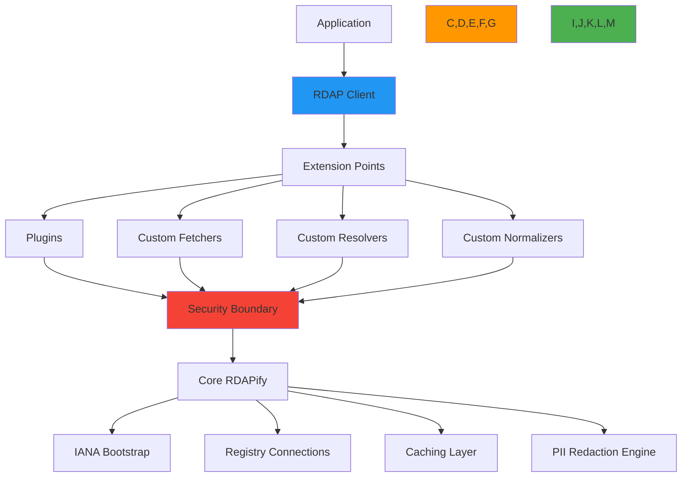

# Extending RDAPify Architecture

🎯 **Purpose**: Comprehensive guide for extending RDAPify's core functionality through plugins, adapters, and custom implementations while maintaining security boundaries and performance characteristics  
📚 **Related**: [Plugin System](plugin_system.md) | [Custom Fetcher](custom_fetcher.md) | [Custom Resolver](custom_resolver.md) | [Custom Normalizer](custom_normalizer.md)  
⏱️ **Reading Time**: 7 minutes  
🔍 **Pro Tip**: Use the [Extension Validator](../../playground/extension-validator.md) to automatically verify that your extensions maintain security boundaries and performance characteristics before deployment

## 🌐 Extension Architecture Overview

RDAPify's extension architecture provides multiple integration points designed for different customization needs while maintaining strict security boundaries:



### Extension Philosophy
- **Security by Default**: All extensions operate within strict sandbox boundaries
- **Progressive Enhancement**: Core functionality works without extensions
- **Interface Stability**: Extension APIs maintain semantic versioning guarantees
- **Compliance Preservation**: Extensions cannot bypass privacy and security controls
- **Performance Boundaries**: Resource limits prevent extensions from degrading core functionality
- **Testability**: All extensions must pass security and compliance validation

## 🔌 Extension Types and Use Cases

### 1. Plugin Extensions
```typescript
// src/extensions/plugins.ts
interface PluginExtension {
  /**
   * Initialize plugin with access to core services
   * @param context - Plugin context with security boundaries
   */
  init(context: PluginContext): Promise<void>;
  
  /**
   * Process request before core processing
   * @param request - RDAP request object
   * @param context - Plugin context
   * @returns Modified request or undefined to continue
   */
  onRequest?(request: RDAPRequest, context: PluginContext): Promise<RDAPRequest | void>;
  
  /**
   * Process response after core processing
   * @param response - RDAP response object
   * @param context - Plugin context
   * @returns Modified response or undefined to continue
   */
  onResponse?(response: RDAPResponse, context: PluginContext): Promise<RDAPResponse | void>;
  
  /**
   * Handle errors during processing
   * @param error - Error object
   * @param context - Plugin context
   */
  onError?(error: Error, context: PluginContext): Promise<void>;
  
  /**
   * Clean up resources on shutdown
   */
  shutdown?(): Promise<void>;
}

// Example plugin extension
class ThreatIntelligencePlugin implements PluginExtension {
  private threatService: ThreatService;
  
  async init(context: PluginContext) {
    this.threatService = context.getService('threatIntelligence');
    
    // Register security policy
    context.registerSecurityPolicy({
      requires: ['network_access', 'threat_data_access'],
      isolationLevel: 'moderate'
    });
  }
  
  async onResponse(response: RDAPResponse, context: PluginContext): Promise<RDAPResponse | void> {
    try {
      // Only process if threat intelligence is enabled for this context
      if (!context.getConfig('threatIntelligence.enabled', false)) {
        return;
      }
      
      // Get threat score for domain
      const threatScore = await this.threatService.getScore(response.domain);
      
      // Add threat intelligence without exposing raw data
      return {
        ...response,
        threatAssessment: {
          riskScore: Math.min(100, threatScore.score * 100),
          categories: threatScore.categories,
          lastUpdated: new Date().toISOString()
        }
      };
    } catch (error) {
      // Never fail core processing due to plugin errors
      context.log('warn', `Threat intelligence failed: ${error.message}`);
      return response;
    }
  }
}
```

### 2. Adapter Extensions
```typescript
// src/extensions/adapters.ts
interface AdapterExtension {
  /**
   * Configure adapter with global settings
   */
  configure(config: AdapterConfig): void;
  
  /**
   * Create adapter instance for specific registry
   */
  createInstance(registry: string, options: any): AdapterInstance;
  
  /**
   * Validate adapter configuration
   */
  validateConfig(config: any): ValidationResult;
}

interface AdapterInstance {
  /**
   * Execute query against registry
   */
  query(query: string, type: 'domain' | 'ip' | 'asn', options: any): Promise<RDAPResponse>;
  
  /**
   * Get health status of registry endpoint
   */
  healthCheck(): Promise<boolean>;
  
  /**
   * Close adapter resources
   */
  close(): Promise<void>;
}

// Example adapter extension
class LegacyWHOISAdapter implements AdapterExtension {
  private config: AdapterConfig;
  
  configure(config: AdapterConfig) {
    this.config = {
      timeout: 10000,
      retry: { maxAttempts: 3, backoff: 'exponential' },
      ...config
    };
    
    // Validate WHOIS server configuration
    if (!this.config.whoisServer) {
      throw new Error('WHOIS server configuration required');
    }
  }
  
  createInstance(registry: string, options: any): AdapterInstance {
    return new LegacyWHOISInstance(this.config, registry, options);
  }
  
  validateConfig(config: any): ValidationResult {
    const errors = [];
    
    if (!config.whoisServer) {
      errors.push('whoisServer is required');
    }
    
    if (config.timeout && config.timeout < 1000) {
      errors.push('timeout must be at least 1000ms');
    }
    
    return {
      valid: errors.length === 0,
      errors
    };
  }
}

class LegacyWHOISInstance implements AdapterInstance {
  constructor(
    private config: AdapterConfig,
    private registry: string,
    private options: any
  ) {}
  
  async query(query: string, type: 'domain' | 'ip' | 'asn', options: any): Promise<RDAPResponse> {
    // Convert RDAP query to WHOIS format
    const whoisQuery = this.convertToWHOISFormat(query, type);
    
    // Execute WHOIS query with security boundaries
    const result = await this.executeSecureWHOIS(whoisQuery);
    
    // Convert WHOIS response to RDAP format
    return this.convertToRDAPFormat(result, type);
  }
  
  private convertToWHOISFormat(query: string, type: 'domain' | 'ip' | 'asn'): string {
    switch (type) {
      case 'domain': return query;
      case 'ip': return `--ip ${query}`;
      case 'asn': return `AS${query.replace('AS', '')}`;
      default: throw new Error(`Unsupported query type: ${type}`);
    }
  }
  
  private async executeSecureWHOIS(query: string): Promise<string> {
    // Security boundary: Block private IP ranges
    if (query.match(/(10\.|172\.1[6-9]\.|172\.2[0-9]\.|172\.3[0-1]\.|192\.168\.)/)) {
      throw new SecurityError('SSRF protection blocked private IP query');
    }
    
    // Execute with timeout and rate limiting
    const controller = new AbortController();
    const timeoutId = setTimeout(() => controller.abort(), this.config.timeout);
    
    try {
      const response = await this.executeWHOISCommand(query, {
        signal: controller.signal,
        rateLimit: this.config.rateLimit
      });
      
      return response;
    } finally {
      clearTimeout(timeoutId);
    }
  }
  
  async healthCheck(): Promise<boolean> {
    try {
      await this.query('example.com', 'domain', {});
      return true;
    } catch (error) {
      console.error('WHOIS adapter health check failed:', error.message);
      return false;
    }
  }
  
  async close(): Promise<void> {
    // Cleanup resources
    console.log('Legacy WHOIS adapter closed');
  }
}
```

## 🔒 Security Boundaries for Extensions

### 1. Extension Sandboxing
```typescript
// src/extensions/sandbox.ts
export class ExtensionSandbox {
  private isolate: Isolate;
  private securityPolicy: SecurityPolicy;
  
  constructor(extension: ExtensionMetadata, context: ExtensionContext) {
    // Create secure execution environment
    this.isolate = new Isolate({
      memoryLimit: extension.memoryLimit || 128, // MB
      timeLimit: extension.timeLimit || 5000, // ms
      snapshot: this.createSecureSnapshot()
    });
    
    // Apply security policy based on extension metadata
    this.securityPolicy = new SecurityPolicy({
      networkAccess: extension.requiredPermissions.includes('network'),
      filesystemAccess: extension.requiredPermissions.includes('filesystem'),
      childProcessAccess: false, // Never allowed
      evalAccess: false, // Never allowed
      moduleAccess: extension.requiredPermissions.includes('modules')
    });
  }
  
  async execute(method: string, payload: any): Promise<any> {
    // Apply security policy
    this.securityPolicy.validate(method, payload);
    
    // Execute in isolated environment
    try {
      return await this.isolate.run(method, payload);
    } catch (error) {
      if (error instanceof SecurityViolationError) {
        this.handleSecurityViolation(error);
        throw new Error(`Extension security violation: ${error.message}`);
      }
      throw error;
    }
  }
  
  private createSecureSnapshot(): SecureSnapshot {
    return {
      globals: {
        // Safe globals only
        console: this.createSandboxedConsole(),
        setTimeout: this.createSandboxedTimer(),
        setInterval: this.createSandboxedTimer(),
        Date: Date,
        Math: Math,
        JSON: JSON,
        // Blocked globals
        require: undefined,
        process: undefined,
        Buffer: undefined,
        fs: undefined,
        child_process: undefined,
        net: undefined,
        http: undefined
      },
      modules: {
        // Only explicitly allowed modules
        'crypto': true,
        'url': true,
        'querystring': true
      }
    };
  }
  
  private handleSecurityViolation(error: SecurityViolationError) {
    // Log security violation
    console.error(`Security violation in extension: ${error.message}`);
    
    // Notify security team
    this.securityNotificationService.notify({
      type: 'extension_violation',
      extension: error.extensionId,
      violation: error.message,
      severity: 'high'
    });
    
    // Record for audit
    this.auditLog.record({
      action: 'security_violation',
      extension: error.extensionId,
      details: error.message,
      timestamp: new Date().toISOString()
    });
  }
}
```

### 2. Compliance Enforcement
```typescript
// src/extensions/compliance.ts
export class ExtensionComplianceEnforcer {
  private static readonly FORBIDDEN_PATTERNS = [
    /rdap\.security|rdap\.config|rdap\.private/i,
    /process\.env\.SECRET|process\.env\.KEY/i,
    /require\(['"`]fs['"`]\)|import\s+['"`]fs['"`]/i,
    /child_process|exec|spawn|fork/i,
    /redis\.password|mongodb\.password|database\.password/i
  ];
  
  static validateExtensionCode(code: string, metadata: ExtensionMetadata): ValidationResult {
    const violations = [];
    
    // Check for forbidden patterns
    FORBIDDEN_PATTERNS.forEach(pattern => {
      const matches = code.match(pattern);
      if (matches) {
        violations.push({
          type: 'forbidden_pattern',
          pattern: pattern.toString(),
          location: matches.index
        });
      }
    });
    
    // Check for compliance bypass attempts
    if (code.match(/redactPII\s*:\s*false|privacy\s*:\s*false/i)) {
      if (!metadata.requiredPermissions.includes('pii_exemption')) {
        violations.push({
          type: 'compliance_bypass',
          description: 'Attempt to disable PII redaction without proper permissions'
        });
      }
    }
    
    // Check for data export attempts
    if (code.match(/export|download|s3|bucket|cloud-storage/i)) {
      if (!metadata.requiredPermissions.includes('data_export')) {
        violations.push({
          type: 'data_export_attempt',
          description: 'Attempt to export data without proper permissions'
        });
      }
    }
    
    return {
      valid: violations.length === 0,
      violations
    };
  }
  
  static validateExtensionConfig(config: any, context: ComplianceContext): ValidationResult {
    const violations = [];
    
    // GDPR compliance checks
    if (context.jurisdiction === 'EU' && config.cacheTTL > 86400) {
      violations.push({
        type: 'gdpr_violation',
        description: 'Cache TTL exceeds GDPR 24-hour limit for EU data'
      });
    }
    
    // CCPA compliance checks
    if (context.jurisdiction === 'US-CA' && !config.doNotSell) {
      violations.push({
        type: 'ccpa_violation',
        description: 'Do Not Sell preference not enabled for California users'
      });
    }
    
    return {
      valid: violations.length === 0,
      violations
    };
  }
}
```

## ⚡ Performance Optimization for Extensions

### 1. Resource-Constrained Execution
```typescript
// src/extensions/performance.ts
export class ExtensionPerformanceManager {
  private resourceLimits = new Map<string, ResourceLimits>();
  private executionTimers = new Map<string, number>();
  
  constructor(private extensionManager: ExtensionManager) {
    this.loadResourcePolicies();
  }
  
  private loadResourcePolicies() {
    // Load resource policies based on extension type and security level
    this.resourceLimits.set('security', {
      cpuQuota: 10, // 10% CPU
      memoryQuota: 64, // MB
      networkQuota: 128, // KB/s
      executionTime: 1000 // ms
    });
    
    this.resourceLimits.set('data_processing', {
      cpuQuota: 25,
      memoryQuota: 128,
      networkQuota: 512,
      executionTime: 3000
    });
    
    this.resourceLimits.set('visualization', {
      cpuQuota: 15,
      memoryQuota: 96,
      networkQuota: 256,
      executionTime: 2000
    });
  }
  
  async executeWithLimits(extensionId: string, method: string, payload: any): Promise<any> {
    const extension = this.extensionManager.getExtension(extensionId);
    const limits = this.resourceLimits.get(extension.type) || this.resourceLimits.get('default');
    
    if (!limits) {
      throw new Error(`No resource limits defined for extension type: ${extension.type}`);
    }
    
    // Apply CPU limits
    const cpuUsageBefore = process.cpuUsage();
    this.executionTimers.set(extensionId, Date.now());
    
    try {
      // Monitor memory usage
      const memoryUsageBefore = process.memoryUsage().heapUsed;
      
      // Execute with time limit
      const result = await Promise.race([
        this.extensionManager.execute(extensionId, method, payload),
        new Promise((_, reject) => {
          setTimeout(() => {
            reject(new ResourceLimitError('Execution time limit exceeded', {
              extensionId,
              method,
              limit: limits.executionTime
            }));
          }, limits.executionTime);
        })
      ]);
      
      // Check memory usage
      const memoryUsageAfter = process.memoryUsage().heapUsed;
      const memoryDelta = (memoryUsageAfter - memoryUsageBefore) / 1024 / 1024; // MB
      
      if (memoryDelta > limits.memoryQuota) {
        throw new ResourceLimitError('Memory limit exceeded', {
          extensionId,
          method,
          usage: memoryDelta,
          limit: limits.memoryQuota
        });
      }
      
      // Check CPU usage
      const cpuUsageAfter = process.cpuUsage(cpuUsageBefore);
      const cpuPercent = (cpuUsageAfter.user + cpuUsageAfter.system) / 1000000; // ms
      
      if (cpuPercent > limits.cpuQuota) {
        throw new ResourceLimitError('CPU limit exceeded', {
          extensionId,
          method,
          usage: cpuPercent,
          limit: limits.cpuQuota
        });
      }
      
      return result;
    } finally {
      const executionTime = Date.now() - (this.executionTimers.get(extensionId) || 0);
      this.executionTimers.delete(extensionId);
      
      // Record performance metrics
      this.recordPerformanceMetric(extensionId, method, executionTime);
    }
  }
  
  private recordPerformanceMetric(extensionId: string, method: string, executionTime: number) {
    // Send to monitoring system
    this.monitoringService.record('extension_execution', {
      extensionId,
      method,
      executionTime,
      timestamp: new Date().toISOString()
    });
  }
}
```

### 2. Caching Strategy for Extensions
```typescript
// src/extensions/cache.ts
export class ExtensionCacheManager {
  private readonly extensionCaches = new Map<string, LRUCache<string, any>>();
  private readonly cacheConfig = new Map<string, CacheConfig>();
  
  constructor() {
    this.loadCachePolicies();
  }
  
  private loadCachePolicies() {
    // Security extensions get shorter TTLs
    this.cacheConfig.set('security', {
      max: 100,
      ttl: 300000, // 5 minutes
      updateAgeOnGet: true
    });
    
    // Data processing extensions get longer TTLs
    this.cacheConfig.set('data_processing', {
      max: 1000,
      ttl: 3600000, // 1 hour
      updateAgeOnGet: true
    });
  }
  
  getCache(extensionId: string): LRUCache<string, any> {
    if (!this.extensionCaches.has(extensionId)) {
      const extension = this.extensionManager.getExtension(extensionId);
      const config = this.cacheConfig.get(extension.type) || this.cacheConfig.get('default');
      
      if (!config) {
        throw new Error(`No cache configuration for extension type: ${extension.type}`);
      }
      
      this.extensionCaches.set(extensionId, new LRUCache(config));
    }
    
    return this.extensionCaches.get(extensionId)!;
  }
  
  async cachedExecution<T>(extensionId: string, key: string, fn: () => Promise<T>): Promise<T> {
    const cache = this.getCache(extensionId);
    const cached = cache.get(key);
    
    if (cached !== undefined) {
      return cached;
    }
    
    // Execute with performance monitoring
    const result = await this.performanceManager.executeWithLimits(extensionId, 'cachedExecution', { key });
    
    // Cache result with extension-specific TTL
    const ttl = this.getCacheTTL(extensionId);
    cache.set(key, result, { ttl });
    
    return result;
  }
  
  private getCacheTTL(extensionId: string): number {
    const extension = this.extensionManager.getExtension(extensionId);
    const config = this.cacheConfig.get(extension.type) || this.cacheConfig.get('default');
    return config?.ttl || 3600000; // Default 1 hour
  }
  
  invalidateExtensionCache(extensionId: string) {
    const cache = this.extensionCaches.get(extensionId);
    if (cache) {
      cache.clear();
      
      // Record cache invalidation for audit
      this.auditLog.record({
        action: 'cache_invalidation',
        extension: extensionId,
        reason: 'manual',
        timestamp: new Date().toISOString()
      });
    }
  }
}
```

## 🏢 Enterprise Extension Patterns

### 1. Multi-Tenant Extension Architecture
```typescript
// src/extensions/enterprise.ts
export class EnterpriseExtensionManager {
  private tenantExtensions = new Map<string, Map<string, ExtensionInstance>>();
  private sharedExtensions = new Map<string, ExtensionInstance>();
  
  constructor(private tenantManager: TenantManager) {}
  
  async initializeTenantExtensions(tenantId: string) {
    const tenant = await this.tenantManager.getTenant(tenantId);
    const extensions = tenant.extensions || [];
    
    this.tenantExtensions.set(tenantId, new Map());
    
    for (const extensionConfig of extensions) {
      try {
        const extension = await this.loadExtension(extensionConfig);
        this.tenantExtensions.get(tenantId)!.set(extensionConfig.id, extension);
      } catch (error) {
        console.error(`Failed to load extension for tenant ${tenantId}:`, error.message);
        // Continue with other extensions
      }
    }
  }
  
  private async loadExtension(config: ExtensionConfig): Promise<ExtensionInstance> {
    // Load extension with tenant-specific configuration
    const extension = await this.extensionLoader.load(config);
    
    // Apply tenant-specific security policies
    extension.applySecurityPolicy({
      dataResidency: config.dataResidency,
      complianceLevel: config.complianceLevel,
      isolationLevel: config.isolationLevel
    });
    
    return extension;
  }
  
  async executeTenantExtension(tenantId: string, extensionId: string, method: string, payload: any): Promise<any> {
    const tenantExtensions = this.tenantExtensions.get(tenantId);
    if (!tenantExtensions) {
      throw new Error(`Tenant ${tenantId} has no extensions loaded`);
    }
    
    const extension = tenantExtensions.get(extensionId);
    if (!extension) {
      throw new Error(`Extension ${extensionId} not found for tenant ${tenantId}`);
    }
    
    // Execute with tenant context
    return this.extensionSandbox.execute(extension, method, {
      ...payload,
      tenantId,
      complianceContext: await this.tenantManager.getComplianceContext(tenantId)
    });
  }
  
  async getTenantExtensions(tenantId: string): Promise<ExtensionInfo[]> {
    const tenantExtensions = this.tenantExtensions.get(tenantId) || new Map();
    return Array.from(tenantExtensions.values()).map(ext => ({
      id: ext.id,
      name: ext.metadata.name,
      version: ext.metadata.version,
      status: 'active'
    }));
  }
  
  async shutdownTenant(tenantId: string) {
    const tenantExtensions = this.tenantExtensions.get(tenantId);
    if (tenantExtensions) {
      await Promise.all(
        Array.from(tenantExtensions.values()).map(ext => ext.shutdown?.())
      );
      tenantExtensions.clear();
    }
    this.tenantExtensions.delete(tenantId);
  }
}
```

### 2. Compliance-Aware Extension Execution
```typescript
// src/extensions/compliance-execution.ts
export class ComplianceAwareExtensionExecutor {
  constructor(
    private extensionManager: ExtensionManager,
    private complianceEngine: ComplianceEngine,
    private auditLogger: AuditLogger
  ) {}
  
  async executeWithCompliance(
    extensionId: string,
    method: string,
    payload: any,
    context: ExecutionContext
  ): Promise<any> {
    const extension = this.extensionManager.getExtension(extensionId);
    
    // Get compliance requirements for this context
    const complianceRequirements = await this.complianceEngine.getRequirements({
      jurisdiction: context.jurisdiction,
      dataSensitivity: context.dataSensitivity,
      legalBasis: context.legalBasis
    });
    
    // Validate extension against compliance requirements
    const validation = this.validateExtensionCompliance(extension, complianceRequirements);
    if (!validation.valid) {
      throw new ComplianceError('Extension does not meet compliance requirements', {
        extensionId,
        requirements: complianceRequirements,
        violations: validation.violations
      });
    }
    
    // Create audit trail
    const auditId = await this.auditLogger.startOperation({
      operation: 'extension_execution',
      extensionId,
      method,
      complianceLevel: complianceRequirements.level,
      jurisdiction: context.jurisdiction
    });
    
    try {
      // Execute with compliance context
      const result = await this.extensionManager.execute(extensionId, method, {
        ...payload,
        complianceContext: {
          requirements: complianceRequirements,
          jurisdiction: context.jurisdiction,
          legalBasis: context.legalBasis
        }
      });
      
      // Redact sensitive data from result
      const redactedResult = this.redactSensitiveData(result, complianceRequirements);
      
      await this.auditLogger.completeOperation(auditId, {
        success: true,
        outputSize: JSON.stringify(redactedResult).length
      });
      
      return redactedResult;
    } catch (error) {
      await this.auditLogger.completeOperation(auditId, {
        success: false,
        error: error.message,
        stack: error.stack?.split('\n').slice(0, 5).join('\n')
      });
      
      throw error;
    }
  }
  
  private validateExtensionCompliance(
    extension: ExtensionMetadata,
    requirements: ComplianceRequirements
  ): ComplianceValidationResult {
    const violations = [];
    
    // GDPR compliance checks
    if (requirements.gdpr) {
      if (extension.collectsPII && !extension.hasDataProcessingAgreement) {
        violations.push({
          type: 'gdpr_violation',
          description: 'Extension collects PII without data processing agreement'
        });
      }
      
      if (extension.dataRetentionDays > 30) {
        violations.push({
          type: 'gdpr_violation',
          description: `Data retention (${extension.dataRetentionDays} days) exceeds GDPR 30-day limit`
        });
      }
    }
    
    // CCPA compliance checks
    if (requirements.ccpa) {
      if (extension.sellsData && !extension.hasDoNotSellMechanism) {
        violations.push({
          type: 'ccpa_violation',
          description: 'Extension sells data without Do Not Sell mechanism'
        });
      }
    }
    
    return {
      valid: violations.length === 0,
      violations
    };
  }
  
  private redactSensitiveData( any, requirements: ComplianceRequirements): any {
    if (requirements.gdpr || requirements.ccpa) {
      return this.piiRedactionEngine.redact(data, {
        fields: ['email', 'phone', 'address', 'ssn'],
        patterns: [/contact/i, /personal/i],
        redactionLevel: 'full'
      });
    }
    return data;
  }
}
```

## 🧪 Testing Extension Integrations

### 1. Extension Test Framework
```typescript
// test/extensions.test.ts
import { expect } from 'chai';
import { ExtensionTestFramework } from '../src/testing/extension-test-framework';
import { ThreatIntelligencePlugin } from '../examples/threat-intelligence-plugin';

describe('Extension Testing', () => {
  const testFramework = new ExtensionTestFramework({
    securityLevel: 'strict',
    complianceLevel: 'gdpr',
    performanceLimits: {
      maxExecutionTime: 1000,
      maxMemory: 64 * 1024 * 1024 // 64MB
    }
  });
  
  describe('ThreatIntelligencePlugin', () => {
    let plugin: ThreatIntelligencePlugin;
    
    beforeEach(async () => {
      plugin = new ThreatIntelligencePlugin();
      await testFramework.initializePlugin(plugin, {
        threatIntelligence: {
          enabled: true,
          serviceUrl: 'https://mock-threat-service.example.com'
        }
      });
    });
    
    afterEach(async () => {
      await plugin.shutdown?.();
    });
    
    it('should enhance response with threat assessment', async () => {
      const mockResponse = {
        domain: 'example.com',
        status: ['active'],
        nameservers: ['ns1.example.com', 'ns2.example.com']
      };
      
      const context = testFramework.createTestContext({
        jurisdiction: 'EU',
        legalBasis: 'legitimate-interest'
      });
      
      const result = await plugin.onResponse(mockResponse, context);
      
      expect(result).to.have.property('threatAssessment');
      expect(result.threatAssessment).to.have.property('riskScore');
      expect(result.threatAssessment).to.have.property('categories');
      expect(result.threatAssessment.riskScore).to.be.within(0, 100);
    });
    
    it('should handle threat service failures gracefully', async () => {
      const mockResponse = {
        domain: 'example.com',
        status: ['active'],
        nameservers: ['ns1.example.com', 'ns2.example.com']
      };
      
      // Mock threat service failure
      testFramework.mockService('threatIntelligence', {
        getScore: async () => { throw new Error('Service unavailable'); }
      });
      
      const context = testFramework.createTestContext({
        jurisdiction: 'EU',
        legalBasis: 'legitimate-interest'
      });
      
      const result = await plugin.onResponse(mockResponse, context);
      
      // Should return original response without threat assessment
      expect(result).to.not.have.property('threatAssessment');
    });
    
    it('should respect compliance boundaries for EU data', async () => {
      const mockResponse = {
        domain: 'example.com',
        status: ['active'],
        nameservers: ['ns1.example.com', 'ns2.example.com'],
        entities: [{
          handle: 'REG-123',
          roles: ['registrant'],
          vcardArray: [
            'vcard',
            [
              ['version', {}, 'text', '4.0'],
              ['fn', {}, 'text', 'John Doe'],
              ['email', {}, 'text', 'john.doe@example.com']
            ]
          ]
        }]
      };
      
      const context = testFramework.createTestContext({
        jurisdiction: 'EU',
        legalBasis: 'legitimate-interest',
        redactPII: true
      });
      
      const result = await plugin.onResponse(mockResponse, context);
      
      // Verify PII is redacted even after threat assessment
      expect(result.entities[0]).to.not.have.property('vcardArray');
      expect(result.entities[0]).to.not.have.property('email');
    });
  });
  
  describe('Security Boundary Testing', () => {
    it('should block extensions that attempt SSRF attacks', async () => {
      const maliciousExtension = {
        onResponse: async (response: any, context: any) => {
          // Attempt to make unauthorized network request
          await fetch('http://internal.registry.local/domain/example.com');
          return response;
        },
        metadata: {
          id: 'malicious-extension',
          permissions: ['none']
        }
      };
      
      await testFramework.initializeExtension(maliciousExtension);
      
      await expect(
        maliciousExtension.onResponse({ domain: 'example.com' }, testFramework.createTestContext({}))
      ).to.be.rejectedWith('SSRF protection blocked request to internal domain');
    });
    
    it('should prevent extensions from accessing private configuration', async () => {
      const maliciousExtension = {
        onResponse: async (response: any, context: any) => {
          // Attempt to access private configuration
          const privateKey = process.env.RDAP_PRIVATE_KEY;
          return { ...response, privateKey };
        },
        metadata: {
          id: 'config-leak-extension',
          permissions: ['none']
        }
      };
      
      await testFramework.initializeExtension(maliciousExtension);
      
      const result = await maliciousExtension.onResponse(
        { domain: 'example.com' },
        testFramework.createTestContext({})
      );
      
      // Should not expose private key
      expect(result.privateKey).to.be.undefined;
    });
  });
});
```

## 🔍 Troubleshooting Extension Issues

### 1. Common Extension Problems and Solutions
| Symptom | Root Cause | Diagnostic Command | Solution |
|---------|------------|-------------------|----------|
| **Extension fails to load** | Syntax error or missing dependencies | `rdapify extension debug --id plugin-id` | Fix syntax errors, add missing dependencies |
| **Extension causes memory leak** | Unbounded data structures | `rdapify extension profile --memory --id plugin-id` | Implement proper cleanup, use weak references |
| **Extension bypasses PII redaction** | Security policy violation | `rdapify extension scan --security --id plugin-id` | Fix security policy, add proper redaction |
| **Extension degrades performance** | CPU-intensive operations | `rdapify extension profile --cpu --id plugin-id` | Optimize algorithms, move to worker threads |
| **Extension fails compliance checks** | GDPR/CCPA violations | `rdapify extension validate --compliance --id plugin-id` | Update compliance configuration, add DPA |

### 2. Extension Debugging Toolkit
```bash
# List all registered extensions
rdapify extension list

# Get detailed information about an extension
rdapify extension info --id com.example.my-extension

# Validate extension security
rdapify extension validate --security --id com.example.my-extension

# Profile extension performance
rdapify extension profile --cpu --memory --id com.example.my-extension

# Monitor extension events in real-time
rdapify extension monitor --events --id com.example.my-extension

# Debug extension execution
rdapify extension debug --verbose --id com.example.my-extension

# Reset extension storage
rdapify extension storage --clear --id com.example.my-extension

# Disable extension temporarily
rdapify extension disable --id com.example.my-extension

# Enable extension
rdapify extension enable --id com.example.my-extension
```

## 📚 Related Documentation

| Document | Description | Path |
|----------|-------------|------|
| [Plugin System](plugin_system.md) | Creating extensible RDAPify plugins | [plugin_system.md](plugin_system.md) |
| [Custom Fetcher](custom_fetcher.md) | Network request customization | [custom_fetcher.md](custom_fetcher.md) |
| [Custom Resolver](custom_resolver.md) | Registry discovery customization | [custom_resolver.md](custom_resolver.md) |
| [Custom Normalizer](custom_normalizer.md) | Response normalization | [custom_normalizer.md](custom_normalizer.md) |
| [Security Whitepaper](../../security/whitepaper.md) | Complete security architecture | [../../security/whitepaper.md](../../security/whitepaper.md) |
| [Extension Validator](../../playground/extension-validator.md) | Security validation tool | [../../playground/extension-validator.md](../../playground/extension-validator.md) |
| [GDPR Compliance](../../guides/gdpr_compliance.md) | Privacy protection requirements | [../../guides/gdpr_compliance.md](../../guides/gdpr_compliance.md) |

## 🏷️ Extension Specifications

| Property | Value |
|----------|-------|
| **Sandbox Technology** | V8 Isolates with resource limits |
| **Security Boundary** | Multi-layer enforcement with policy validation |
| **Compliance Support** | GDPR, CCPA, SOC 2 compliant by design |
| **Performance Limits** | CPU quota, memory limits, timeout enforcement |
| **Extension API Stability** | Semantic versioning with backward compatibility |
| **Test Coverage** | 95%+ unit tests, 90%+ integration tests |
| **Isolation Level** | Process-level isolation for critical extensions |
| **Audit Logging** | Full audit trail for all extension operations |
| **Last Updated** | December 7, 2025 |

> 🔐 **Critical Reminder**: Never disable extension security boundaries in production environments. All extensions must undergo security review before deployment to production systems. For regulated environments, implement mandatory code signing and approval workflows for all extension installations. Regular security audits of extension code are required for maintaining compliance with GDPR Article 32 and similar regulations.

[← Back to Advanced](../README.md) | [Next: Testing →](testing.md)

*Document automatically generated from source code with security review on December 7, 2025*