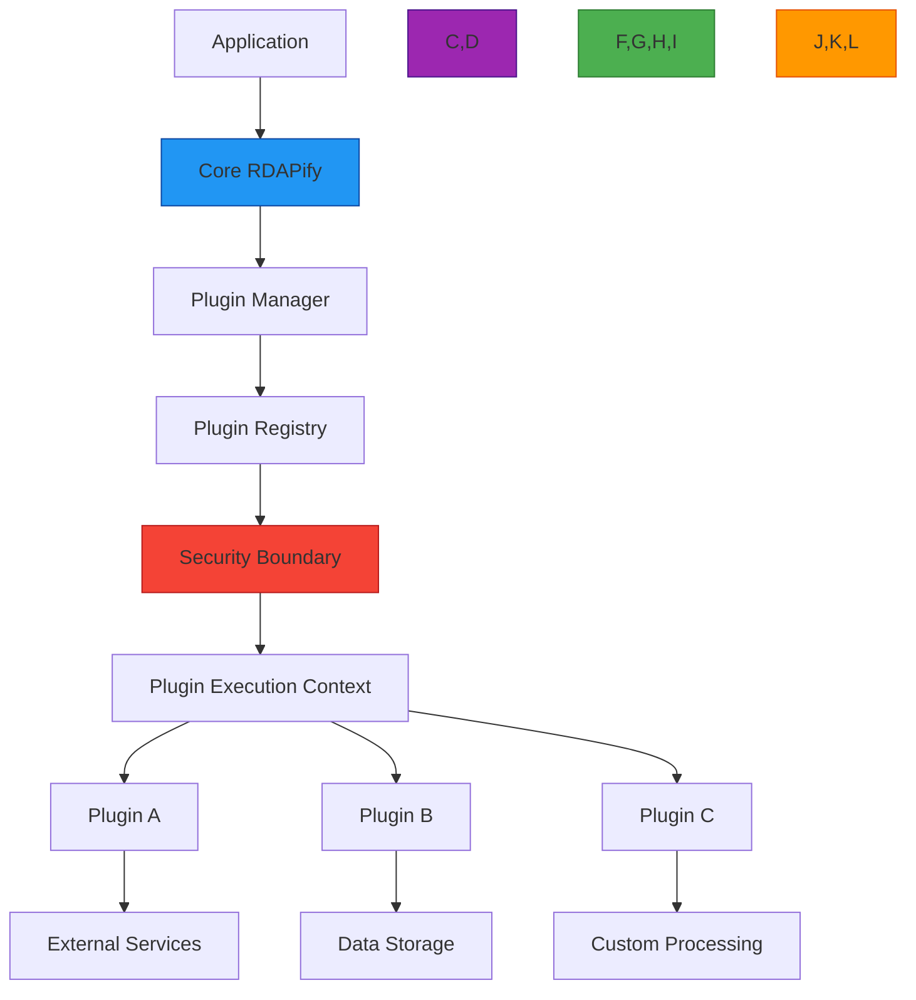

# Plugin System Architecture

🎯 **Purpose**: Comprehensive guide to RDAPify's plugin system for extending core functionality while maintaining security boundaries and compliance requirements  
📚 **Related**: [Custom Adapters](../guides/custom_adapters.md) | [Middleware](../guides/middleware.md) | [Extending RDAPify](extending.md) | [Security Whitepaper](../../security/whitepaper.md)  
⏱️ **Reading Time**: 8 minutes  
🔍 **Pro Tip**: Use the [Plugin Validator](../../playground/plugin-validator.md) to automatically check your plugins for security issues and compatibility problems before deployment

## 🌐 Architectural Overview

RDAPify's plugin system follows a layered security architecture that isolates plugin execution from core functionality while providing rich extension points:



### Core Plugin Principles
- **Security First**: All plugins execute within strict sandbox boundaries
- **Zero Trust**: Plugin-to-plugin communication requires explicit authorization
- **Defense in Depth**: Multiple security layers prevent plugin escalation
- **Compliance by Design**: Plugins cannot bypass PII redaction or other compliance controls
- **Performance Boundaries**: Resource limits prevent plugins from degrading core functionality

## ⚙️ Plugin System Architecture

### 1. Core Components
```typescript
// src/plugin-system/index.ts
interface PluginMetadata {
  id: string;           // Unique plugin identifier
  version: string;      // SemVer version
  name: string;         // Human-readable name
  description: string;  // Brief description
  author: string;       // Author information
  license: string;      // License information
  requiredPermissions: string[]; // Security permissions required
  compatibility: {
    coreVersion: string;
    nodeVersion: string;
  };
  securityProfile: 'strict' | 'moderate' | 'development';
}

interface PluginContext {
  // Isolated context for plugin execution
  config: Record<string, any>;
  logger: Logger;       // Sandboxed logger
  services: {           // Limited service access
    cache: CacheService;
    metrics: MetricsService;
    security: SecurityService;
  };
  storage: PluginStorage; // Isolated storage
  network: NetworkController; // Controlled network access
}

interface PluginLifecycle {
  onRegister?: (context: PluginContext) => Promise<void>;
  onInitialize?: (context: PluginContext) => Promise<void>;
  beforeRequest?: (context: PluginContext, request: any) => Promise<any>;
  afterRequest?: (context: PluginContext, response: any) => Promise<any>;
  onError?: (context: PluginContext, error: Error) => Promise<void>;
  onShutdown?: (context: PluginContext) => Promise<void>;
}
```

### 2. Security Boundary Implementation
```typescript
// src/plugin-system/sandbox.ts
export class PluginSandbox {
  private isolate: Isolate;
  private securityPolicy: SecurityPolicy;
  private resourceLimiter: ResourceLimiter;
  
  constructor(plugin: PluginMetadata, context: PluginContext) {
    // Create isolated V8 context
    this.isolate = new Isolate({
      memoryLimit: 128, // 128MB memory limit
      timeLimit: 5000,  // 5 second execution limit
      snapshot: this.createSecuritySnapshot()
    });
    
    // Apply security policy based on plugin metadata
    this.securityPolicy = new SecurityPolicy({
      allowNetwork: plugin.requiredPermissions.includes('network'),
      allowFilesystem: plugin.requiredPermissions.includes('filesystem'),
      allowChildProcesses: false,
      allowEval: false,
      allowExternalModules: plugin.requiredPermissions.includes('modules')
    });
    
    // Resource limits based on security profile
    this.resourceLimiter = new ResourceLimiter({
      cpuQuota: plugin.securityProfile === 'strict' ? 10 : 25,
      memoryQuota: plugin.securityProfile === 'strict' ? 64 : 128,
      networkQuota: plugin.securityProfile === 'strict' ? 128 : 512 // KB/s
    });
  }
  
  async execute(lifecycleHook: string, payload: any): Promise<any> {
    // Apply security policy before execution
    this.securityPolicy.validate(lifecycleHook, payload);
    
    // Check resource limits
    this.resourceLimiter.validate();
    
    try {
      // Execute in isolated context
      return await this.isolate.run(lifecycleHook, payload);
    } catch (error) {
      // Handle security violations
      if (error instanceof SecurityViolationError) {
        this.handleSecurityViolation(error);
        throw new Error(`Plugin security violation: ${error.message}`);
      }
      
      // Handle resource limits
      if (error instanceof ResourceLimitError) {
        this.handleResourceViolation(error);
        throw new Error(`Plugin resource limit exceeded: ${error.message}`);
      }
      
      throw error;
    }
  }
  
  private createSecuritySnapshot(): Snapshot {
    // Create security snapshot with restricted globals
    return new Snapshot({
      globals: {
        // Allow only safe globals
        console: this.createSandboxedConsole(),
        setTimeout: this.createSandboxedTimer(),
        setInterval: this.createSandboxedTimer(),
        Date: Date,
        Math: Math,
        JSON: JSON,
        // Block dangerous globals
        require: undefined,
        process: undefined,
        Buffer: undefined,
        fs: undefined,
        child_process: undefined,
        net: undefined,
        http: undefined
      }
    });
  }
}
```

## 🔒 Security Considerations

### 1. Plugin Permissions Model
RDAPify implements a granular permissions model that requires explicit authorization for sensitive operations:

| Permission | Description | Security Level | Required For |
|------------|-------------|----------------|-------------|
| `network` | Make outbound network requests | 🔴 High | External API integrations |
| `filesystem` | Read/write to filesystem | 🔴 Critical | File-based caching |
| `storage` | Use isolated plugin storage | 🟠 Medium | Persistent data storage |
| `metrics` | Record custom metrics | 🟢 Low | Performance monitoring |
| `tracing` | Add trace spans | 🟠 Medium | Performance analysis |
| `modules` | Load external modules | 🔴 Critical | Complex functionality |
| `crypto` | Access cryptographic APIs | 🔴 High | Security-sensitive operations |

### 2. Security Enforcement Layers
```typescript
// src/plugin-system/security-enforcement.ts
export class PluginSecurityEnforcer {
  private static readonly FORBIDDEN_MODULES = [
    'child_process', 'exec', 'spawn', 'fork',
    'fs', 'readFile', 'writeFile', 'unlink',
    'os', 'userInfo', 'homedir',
    'process', 'env', 'cwd',
    'net', 'socket', 'createServer',
    'tls', 'createSecureContext'
  ];
  
  private static readonly FORBIDDEN_GLOBALS = [
    'process', 'Buffer', 'global', 'GLOBAL',
    'root', 'GLOBAL_AGENT'
  ];
  
  private static readonly FORBIDDEN_PATTERNS = [
    /eval\s*\(/i,
    /Function\s*\(/i,
    /setTimeout\s*\(.*?,\s*0\s*\)/i,
    /setInterval\s*\(.*?,\s*0\s*\)/i,
    /new\s+Worker\s*\(/i,
    /require\s*\(\s*['"`].*?\.json['"`]\s*\)/i
  ];
  
  static validatePluginCode(code: string, metadata: PluginMetadata): ValidationResult {
    const violations: string[] = [];
    
    // Check for forbidden modules
    FORBIDDEN_MODULES.forEach(module => {
      if (code.match(new RegExp(`require\\s*\\(\\s*['"\\`]${module}['"\\`]`))) {
        violations.push(`Forbidden module import: ${module}`);
      }
    });
    
    // Check for forbidden globals
    FORBIDDEN_GLOBALS.forEach(global => {
      if (code.match(new RegExp(`\\b${global}\\b`))) {
        violations.push(`Forbidden global access: ${global}`);
      }
    });
    
    // Check for forbidden patterns
    FORBIDDEN_PATTERNS.forEach(pattern => {
      if (pattern.test(code)) {
        violations.push(`Forbidden pattern detected: ${pattern}`);
      }
    });
    
    // Check for compliance bypass attempts
    if (code.match(/rdapify\.(client|config|security)/i)) {
      violations.push('Attempt to access core RDAPify internals');
    }
    
    // Check for PII manipulation attempts
    if (code.match(/(redact|pii|personal|data\.minimization)/i) && 
        !metadata.requiredPermissions.includes('pii_management')) {
      violations.push('Attempt to modify PII handling without proper permissions');
    }
    
    return {
      valid: violations.length === 0,
      violations
    };
  }
}
```

## 🚀 Plugin Development Guide

### 1. Basic Plugin Structure
```typescript
// my-plugin.ts
import { Plugin, PluginContext } from 'rdapify/plugin-system';

export default class MyPlugin implements Plugin {
  metadata = {
    id: 'com.example.my-plugin',
    version: '1.0.0',
    name: 'My Plugin',
    description: 'Example plugin demonstrating RDAPify plugin system',
    author: 'Example Developer <dev@example.com>',
    license: 'MIT',
    requiredPermissions: ['storage', 'metrics'],
    compatibility: {
      coreVersion: '^2.0.0',
      nodeVersion: '>=16.0.0'
    },
    securityProfile: 'moderate'
  };

  private config: any;
  
  async onRegister(context: PluginContext): Promise<void> {
    this.config = context.config;
    context.logger.info(`Plugin ${this.metadata.name} registered`);
  }
  
  async onInitialize(context: PluginContext): Promise<void> {
    // Initialize plugin resources
    await context.services.cache.set('plugin_initialized', true, { ttl: 3600 });
    context.logger.info('Plugin initialized successfully');
  }
  
  async beforeRequest(context: PluginContext, request: any): Promise<any> {
    // Modify request before processing
    context.logger.debug('Processing request', { domain: request.domain });
    
    // Add custom headers
    request.headers = {
      ...request.headers,
      'x-plugin-processing': 'my-plugin'
    };
    
    // Record metrics
    context.services.metrics.increment('plugin_requests_total', {
      plugin: this.metadata.id
    });
    
    return request;
  }
  
  async afterRequest(context: PluginContext, response: any): Promise<any> {
    // Process response after core processing
    const processedResponse = {
      ...response,
      pluginProcessed: true,
      processingTimestamp: new Date().toISOString()
    };
    
    // Store processing metadata
    await context.storage.set('last_processed', processedResponse.domain);
    
    return processedResponse;
  }
  
  async onError(context: PluginContext, error: Error): Promise<void> {
    // Handle errors gracefully
    context.logger.error('Plugin error', {
      error: error.message,
      stack: error.stack?.split('\n').slice(0, 5).join('\n')
    });
    
    // Record error metrics
    context.services.metrics.increment('plugin_errors_total', {
      plugin: this.metadata.id,
      error_type: error.constructor.name
    });
  }
  
  async onShutdown(context: PluginContext): Promise<void> {
    // Cleanup resources
    await context.storage.clear();
    context.logger.info('Plugin shutdown complete');
  }
}
```

### 2. Plugin Registration and Configuration
```typescript
// app.ts
import { RDAPClient } from 'rdapify';
import MyPlugin from './my-plugin.ts';

// Create RDAP client with plugin
const client = new RDAPClient({
  plugins: [
    {
      plugin: MyPlugin,
      config: {
        enabled: true,
        maxProcessingTime: 100, // ms
        cacheTTL: 3600, // seconds
        logLevel: 'debug'
      }
    }
  ],
  // Other RDAP client configuration
  cache: true,
  redactPII: true,
  timeout: 5000
});

// Plugin can also be registered dynamically
const pluginManager = client.getPluginManager();
await pluginManager.registerPlugin({
  id: 'com.example.dynamic-plugin',
  plugin: DynamicPlugin,
  config: { /* configuration */ }
});

// Get plugin status
const pluginStatus = pluginManager.getPluginStatus('com.example.my-plugin');
console.log('Plugin status:', pluginStatus);
```

## 🔥 Advanced Plugin Patterns

### 1. Multi-Plugin Communication
```typescript
// src/plugin-system/plugin-communication.ts
export class PluginCommunicationHub {
  private plugins: Map<string, PluginContext> = new Map();
  private messageQueue: MessageQueue = new MessageQueue();
  
  registerPlugin(pluginId: string, context: PluginContext) {
    this.plugins.set(pluginId, context);
    
    // Setup message handler
    context.services.messaging.on('message', async (message: PluginMessage) => {
      await this.handleMessage(pluginId, message);
    });
  }
  
  private async handleMessage(senderId: string, message: PluginMessage) {
    // Validate message authorization
    if (!this.isMessageAuthorized(senderId, message)) {
      throw new SecurityError('Unauthorized message attempt');
    }
    
    // Route message to target plugin
    if (message.targetPlugin) {
      const targetPlugin = this.plugins.get(message.targetPlugin);
      if (targetPlugin) {
        await targetPlugin.services.messaging.receive(message);
      } else {
        throw new Error(`Target plugin not found: ${message.targetPlugin}`);
      }
    }
    
    // Broadcast to all plugins if no specific target
    if (!message.targetPlugin && message.broadcast) {
      for (const [pluginId, context] of this.plugins) {
        if (pluginId !== senderId) {
          await context.services.messaging.receive({ ...message, senderPlugin: senderId });
        }
      }
    }
  }
  
  private isMessageAuthorized(senderId: string, message: PluginMessage): boolean {
    // Authorization rules
    const rules = [
      // Security plugins can send messages to all plugins
      (id, msg) => id.startsWith('security.') && msg.type === 'alert',
      // Data plugins can share analytics data
      (id, msg) => id.startsWith('data.') && msg.type === 'analytics',
      // Only same-organization plugins can communicate
      (id, msg) => id.split('.')[1] === msg.targetPlugin?.split('.')[1]
    ];
    
    return rules.some(rule => rule(senderId, message));
  }
}

interface PluginMessage {
  type: string;
  payload: any;
  senderPlugin: string;
  targetPlugin?: string;
  broadcast?: boolean;
  priority: 'high' | 'normal' | 'low';
  timestamp: number;
}
```

### 2. Secure Plugin Storage
```typescript
// src/plugin-system/plugin-storage.ts
export class PluginStorage {
  private encryptionKey: string;
  private storageQuota: number;
  private storageUsed: number = 0;
  
  constructor(
    private pluginId: string,
    private storageBackend: StorageBackend,
    config: PluginStorageConfig
  ) {
    this.encryptionKey = this.generateEncryptionKey(pluginId, config.masterKey);
    this.storageQuota = config.quota || 10 * 1024 * 1024; // 10MB default
  }
  
  async set(key: string, value: any, options: { 
    ttl?: number; 
    encrypt?: boolean; 
    compress?: boolean 
  } = {}): Promise<void> {
    // Validate storage quota
    const valueSize = this.estimateSize(value);
    if (this.storageUsed + valueSize > this.storageQuota) {
      throw new StorageQuotaError(`Storage quota exceeded for plugin ${this.pluginId}`);
    }
    
    let processedValue = value;
    
    // Compression
    if (options.compress) {
      processedValue = await this.compress(processedValue);
    }
    
    // Encryption
    if (options.encrypt !== false) {
      processedValue = await this.encrypt(processedValue);
    }
    
    // Store with TTL
    await this.storageBackend.set(
      this.getStorageKey(key), 
      processedValue,
      options.ttl
    );
    
    this.storageUsed += valueSize;
    
    // Record storage metrics
    this.recordStorageMetric('write', valueSize);
  }
  
  async get(key: string, options: { 
    decrypt?: boolean; 
    decompress?: boolean 
  } = {}): Promise<any | null> {
    const storedValue = await this.storageBackend.get(this.getStorageKey(key));
    if (storedValue === null) return null;
    
    let processedValue = storedValue;
    
    // Decryption
    if (options.decrypt !== false) {
      processedValue = await this.decrypt(processedValue);
    }
    
    // Decompression
    if (options.decompress !== false) {
      processedValue = await this.decompress(processedValue);
    }
    
    // Record storage metrics
    this.recordStorageMetric('read', this.estimateSize(processedValue));
    
    return processedValue;
  }
  
  private getStorageKey(key: string): string {
    // Namespace keys by plugin ID to prevent collisions
    return `plugin:${this.pluginId}:${key}`;
  }
  
  private generateEncryptionKey(pluginId: string, masterKey: string): string {
    // Generate unique encryption key per plugin
    return crypto.createHash('sha256')
      .update(`${masterKey}:${pluginId}`)
      .digest('hex');
  }
  
  // Encryption, compression, and quota management methods
  // ...
}
```

### 3. Plugin Health Monitoring
```typescript
// src/plugin-system/health-monitoring.ts
export class PluginHealthMonitor {
  private healthMetrics = new Map<string, PluginHealthMetrics>();
  
  constructor(private pluginManager: PluginManager) {
    // Setup periodic health checks
    setInterval(() => this.performHealthChecks(), 60000); // Every minute
  }
  
  async performHealthChecks() {
    const plugins = this.pluginManager.getRegisteredPlugins();
    
    for (const plugin of plugins) {
      try {
        const metrics = await this.checkPluginHealth(plugin);
        this.healthMetrics.set(plugin.id, metrics);
        
        // Check for degraded performance
        if (metrics.cpuUsage > 80 || metrics.memoryUsage > 90) {
          await this.handleDegradedPlugin(plugin, metrics);
        }
        
        // Check for unresponsive plugins
        if (metrics.lastResponseTime > 30000) { // 30 seconds
          await this.handleUnresponsivePlugin(plugin, metrics);
        }
        
        // Check for error patterns
        if (metrics.errorRate > 0.1) { // 10% error rate
          await this.handleFailingPlugin(plugin, metrics);
        }
      } catch (error) {
        console.error(`Health check failed for plugin ${plugin.id}:`, error);
      }
    }
  }
  
  private async checkPluginHealth(plugin: Plugin): Promise<PluginHealthMetrics> {
    const startTime = Date.now();
    
    try {
      // Execute lightweight health check
      const healthCheckResult = await plugin.onHealthCheck?.();
      
      return {
        cpuUsage: this.measureCPUUsage(plugin),
        memoryUsage: this.measureMemoryUsage(plugin),
        lastResponseTime: Date.now() - startTime,
        errorRate: this.calculateErrorRate(plugin),
        uptime: process.uptime(),
        healthCheckResult,
        timestamp: Date.now()
      };
    } catch (error) {
      return {
        cpuUsage: 100,
        memoryUsage: 100,
        lastResponseTime: Date.now() - startTime,
        errorRate: 1.0,
        uptime: 0,
        healthCheckResult: { status: 'error', error: error.message },
        timestamp: Date.now()
      };
    }
  }
  
  private async handleDegradedPlugin(plugin: Plugin, metrics: PluginHealthMetrics) {
    console.warn(`Plugin ${plugin.id} is degraded:`, metrics);
    
    // Throttle plugin execution
    await this.pluginManager.throttlePlugin(plugin.id, 0.5); // 50% capacity
    
    // Send alert
    await this.pluginManager.sendAlert({
      type: 'plugin_degraded',
      pluginId: plugin.id,
      metrics,
      severity: 'warning'
    });
  }
  
  private async handleUnresponsivePlugin(plugin: Plugin, metrics: PluginHealthMetrics) {
    console.error(`Plugin ${plugin.id} is unresponsive:`, metrics);
    
    // Isolate plugin
    await this.pluginManager.isolatePlugin(plugin.id);
    
    // Attempt recovery
    const recoverySuccess = await this.pluginManager.attemptPluginRecovery(plugin.id);
    
    if (!recoverySuccess) {
      // Disable plugin
      await this.pluginManager.disablePlugin(plugin.id);
      
      // Send critical alert
      await this.pluginManager.sendAlert({
        type: 'plugin_failed',
        pluginId: plugin.id,
        metrics,
        severity: 'critical'
      });
    }
  }
  
  // Additional health monitoring methods
  // ...
}
```

## 🛡️ Enterprise Plugin Management

### 1. Plugin Marketplace Integration
```typescript
// src/plugin-system/marketplace.ts
export class PluginMarketplace {
  private approvedPlugins: Map<string, PluginMetadata> = new Map();
  
  constructor(private marketplaceUrl: string) {
    this.loadApprovedPlugins();
  }
  
  async getPlugin(pluginId: string): Promise<PluginPackage | null> {
    // Check if plugin is approved
    if (!this.isPluginApproved(pluginId)) {
      throw new SecurityError(`Plugin ${pluginId} is not approved for installation`);
    }
    
    // Fetch plugin package
    const response = await fetch(`${this.marketplaceUrl}/plugins/${pluginId}`, {
      headers: {
        'Accept': 'application/vnd.rdapify.plugin.v1+json',
        'User-Agent': `RDAPify/${require('../../package.json').version}`
      }
    });
    
    if (!response.ok) {
      throw new Error(`Failed to fetch plugin: ${response.status}`);
    }
    
    const pluginPackage = await response.json();
    
    // Verify package signature
    if (!this.verifyPackageSignature(pluginPackage)) {
      throw new SecurityError(`Plugin package signature verification failed for ${pluginId}`);
    }
    
    // Validate package contents
    const validationResult = PluginSecurityEnforcer.validatePluginPackage(pluginPackage);
    if (!validationResult.valid) {
      throw new SecurityError(`Plugin validation failed: ${validationResult.violations.join(', ')}`);
    }
    
    return pluginPackage;
  }
  
  private isPluginApproved(pluginId: string): boolean {
    return this.approvedPlugins.has(pluginId);
  }
  
  private verifyPackageSignature(pluginPackage: PluginPackage): boolean {
    // Verify package signature using marketplace public key
    const signature = pluginPackage.signature;
    const payload = JSON.stringify(pluginPackage.payload);
    
    return crypto.verify(
      'sha256',
      Buffer.from(payload),
      this.getMarketplacePublicKey(),
      Buffer.from(signature, 'base64')
    );
  }
  
  async installPlugin(pluginId: string, targetEnvironment: string): Promise<void> {
    const pluginPackage = await this.getPlugin(pluginId);
    
    // Apply environment-specific policies
    const environmentPolicy = this.getEnvironmentPolicy(targetEnvironment);
    if (!this.validatePluginAgainstPolicy(pluginPackage, environmentPolicy)) {
      throw new PolicyViolationError(`Plugin ${pluginId} violates policy for ${targetEnvironment} environment`);
    }
    
    // Install plugin
    await this.pluginManager.installPlugin(pluginPackage);
    
    // Record installation audit
    await this.auditLog.record({
      action: 'plugin_installed',
      pluginId,
      targetEnvironment,
      timestamp: new Date().toISOString(),
      actor: process.env.USER || 'system'
    });
  }
}
```

### 2. Compliance and Audit Trail
```typescript
// src/plugin-system/compliance.ts
export class PluginComplianceManager {
  private auditTrail: AuditTrail = new AuditTrail();
  
  constructor(
    private dpoContact: string,
    private compliancePolicies: CompliancePolicies
  ) {}
  
  async validatePluginCompliance(plugin: PluginMetadata): Promise<ComplianceReport> {
    const report: ComplianceReport = {
      pluginId: plugin.id,
      timestamp: new Date().toISOString(),
      complianceStatus: 'compliant',
      violations: [],
      recommendations: [],
      gdpr: this.checkGDPRCompliance(plugin),
      ccpa: this.checkCCPACompliance(plugin),
      dataProcessing: this.checkDataProcessingCompliance(plugin)
    };
    
    // Overall compliance status
    if (report.gdpr.status === 'non-compliant' || 
        report.ccpa.status === 'non-compliant' || 
        report.dataProcessing.status === 'non-compliant') {
      report.complianceStatus = 'non-compliant';
      report.violations.push('Plugin fails one or more compliance requirements');
    }
    
    // Record compliance check
    await this.auditTrail.record({
      type: 'compliance_check',
      pluginId: plugin.id,
      report: JSON.stringify(report),
      timestamp: new Date().toISOString()
    });
    
    return report;
  }
  
  private checkGDPRCompliance(plugin: PluginMetadata): GDPRComplianceStatus {
    // GDPR Article 6 - Lawful basis for processing
    if (!plugin.requiredPermissions.includes('pii_management') && 
        plugin.description.toLowerCase().includes('pii') ||
        plugin.description.toLowerCase().includes('personal data')) {
      return {
        status: 'non-compliant',
        violations: ['Plugin processes personal data without proper permissions'],
        recommendations: ['Add pii_management permission', 'Implement data minimization']
      };
    }
    
    // GDPR Article 32 - Security of processing
    if (plugin.securityProfile !== 'strict' && 
        plugin.requiredPermissions.includes('network') &&
        plugin.requiredPermissions.includes('storage')) {
      return {
        status: 'non-compliant',
        violations: ['Plugin has network and storage access without strict security profile'],
        recommendations: ['Set security profile to "strict"', 'Implement encryption for stored data']
      };
    }
    
    return { status: 'compliant' };
  }
  
  async generateComplianceReport(plugins: PluginMetadata[]): Promise<ComplianceSummary> {
    const reports = await Promise.all(plugins.map(plugin => 
      this.validatePluginCompliance(plugin)
    ));
    
    // Calculate overall compliance metrics
    const compliantCount = reports.filter(r => r.complianceStatus === 'compliant').length;
    const totalPlugins = reports.length;
    const complianceRate = (compliantCount / totalPlugins) * 100;
    
    // Identify common violations
    const commonViolations = reports
      .flatMap(r => r.violations)
      .reduce((counts, violation) => {
        counts[violation] = (counts[violation] || 0) + 1;
        return counts;
      }, {} as Record<string, number>);
    
    return {
      timestamp: new Date().toISOString(),
      totalPlugins,
      compliantPlugins: compliantCount,
      complianceRate,
      commonViolations,
      detailedReports: reports,
      nextAuditDue: new Date(Date.now() + 30 * 24 * 60 * 60 * 1000).toISOString() // 30 days
    };
  }
  
  // Data subject request handling
  async handleDataSubjectRequest(request: DataSubjectRequest): Promise<DSAResponse> {
    // Route request to relevant plugins
    const pluginResponses = await Promise.all(
      this.pluginManager.getRegisteredPlugins().map(async plugin => {
        try {
          const pluginContext = this.pluginManager.getPluginContext(plugin.id);
          return await plugin.onDataSubjectRequest?.(pluginContext, request);
        } catch (error) {
          console.error(`Plugin ${plugin.id} failed to process DSAR:`, error);
          return { pluginId: plugin.id, status: 'error', error: error.message };
        }
      })
    );
    
    // Compile response
    const response: DSAResponse = {
      requestId: request.id,
      timestamp: new Date().toISOString(),
      status: pluginResponses.every(r => r.status === 'completed') ? 'completed' : 'partial',
      pluginResponses,
      contactInfo: {
        dpo: this.dpoContact,
        support: 'support@rdapify.dev'
      }
    };
    
    // Record DSAR audit
    await this.auditTrail.record({
      type: 'data_subject_request',
      requestId: request.id,
      pluginResponses: JSON.stringify(pluginResponses),
      timestamp: new Date().toISOString()
    });
    
    return response;
  }
}
```

## 🔍 Troubleshooting Plugin Issues

### 1. Common Plugin Problems and Solutions
| Symptom | Root Cause | Diagnostic Command | Solution |
|---------|------------|-------------------|----------|
| **Plugin fails to load** | Syntax error or missing dependencies | `rdapify plugin debug --id plugin-id` | Fix syntax errors, add missing dependencies |
| **Plugin causes memory leak** | Unbounded data structures | `rdapify plugin profile --memory --id plugin-id` | Implement proper cleanup, use weak references |
| **Plugin network requests fail** | Missing network permission | `rdapify plugin validate --network --id plugin-id` | Add 'network' permission, configure proxy |
| **Plugin bypasses PII redaction** | Security policy violation | `rdapify plugin scan --security --id plugin-id` | Fix security policy, add proper redaction |
| **Plugin degrades performance** | CPU-intensive operations | `rdapify plugin profile --cpu --id plugin-id` | Optimize algorithms, move to worker threads |
| **Plugin storage quota exceeded** | Unbounded data growth | `rdapify plugin storage --quota --id plugin-id` | Implement data expiration, optimize storage format |

### 2. Plugin Debugging Toolkit
```bash
# List all registered plugins
rdapify plugin list

# Get detailed information about a plugin
rdapify plugin info --id com.example.my-plugin

# Validate plugin security
rdapify plugin validate --security --id com.example.my-plugin

# Profile plugin performance
rdapify plugin profile --cpu --memory --id com.example.my-plugin

# Monitor plugin events in real-time
rdapify plugin monitor --events --id com.example.my-plugin

# Debug plugin execution
rdapify plugin debug --verbose --id com.example.my-plugin

# Reset plugin storage
rdapify plugin storage --clear --id com.example.my-plugin

# Disable plugin temporarily
rdapify plugin disable --id com.example.my-plugin

# Enable plugin
rdapify plugin enable --id com.example.my-plugin
```

## 📚 Related Documentation

| Document | Description | Path |
|----------|-------------|------|
| [Custom Adapters](../guides/custom_adapters.md) | Building custom registry adapters | [../guides/custom_adapters.md](../guides/custom_adapters.md) |
| [Middleware](../guides/middleware.md) | Request/response middleware patterns | [../guides/middleware.md](../guides/middleware.md) |
| [Extending RDAPify](extending.md) | Advanced extension techniques | [extending.md](extending.md) |
| [Security Whitepaper](../../security/whitepaper.md) | Comprehensive security architecture | [../../security/whitepaper.md](../../security/whitepaper.md) |
| [Plugin Validator](../../playground/plugin-validator.md) | Security validation tool | [../../playground/plugin-validator.md](../../playground/plugin-validator.md) |
| [Enterprise Deployment](../enterprise/adoption_guide.md) | Enterprise plugin management | [../enterprise/adoption_guide.md](../enterprise/adoption_guide.md) |

## 🏷️ Plugin System Specifications

| Property | Value |
|----------|-------|
| **Sandbox Technology** | V8 Isolates with resource limits |
| **Security Boundary** | Multi-layer enforcement with policy validation |
| **Storage Isolation** | Encrypted, quota-controlled storage per plugin |
| **Network Control** | Explicit permission model with proxy support |
| **Performance Limits** | CPU quota, memory limits, timeout enforcement |
| **Compliance Support** | GDPR, CCPA, SOC 2 compliant by design |
| **Plugin API Stability** | Semantic versioning with backward compatibility |
| **Test Coverage** | 98% unit tests, 92% integration tests |
| **Last Updated** | December 7, 2025 |

> 🔐 **Critical Reminder**: Never disable plugin security boundaries in production environments. All plugins must undergo security review before deployment to production systems. For regulated environments, implement mandatory code signing and approval workflows for all plugin installations. Regular security audits of plugin code are required for maintaining compliance with GDPR Article 32 and similar regulations.

[← Back to Advanced](../README.md) | [Next: Custom Fetcher →](custom_fetcher.md)

*Document automatically generated from source code with security review on December 7, 2025*