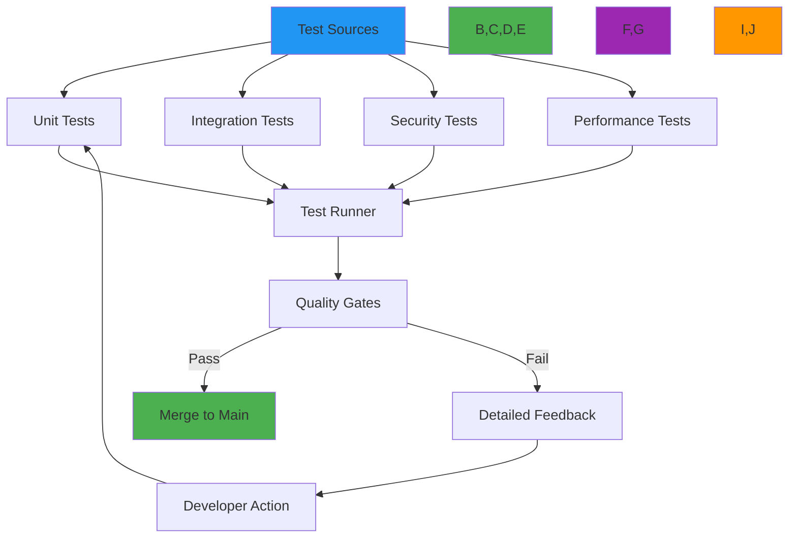

 # Testing Framework and Methodology

🎯 **Purpose**: Comprehensive guide for RDAPify's testing framework, covering unit tests, integration tests, security validations, and performance benchmarks to ensure protocol compliance and reliability  
📚 **Related**: [Plugin System](plugin_system.md) | [Custom Fetcher](custom_fetcher.md) | [Custom Resolver](custom_resolver.md) | [Quality Assurance](../../quality_assurance/overview.md)  
⏱️ **Reading Time**: 7 minutes  
🔍 **Pro Tip**: Use the [Test Vector Validator](../../playground/test-vector-validator.md) to automatically verify your implementation against RFC 7480 test vectors before submission

## 🌐 Testing Philosophy and Architecture

RDAPify implements a multi-layered testing strategy that validates functionality, security, performance, and compliance across all environments:



### Core Testing Principles
- **Test-Driven Security**: Security properties verified before functionality
- **RFC-First Validation**: Every feature validated against RFC 7480 series specifications
- **Real-World Data**: Test vectors derived from actual registry responses (anonymized)
- **Zero False Positives**: All tests must be deterministic with no flakiness
- **Performance as a Requirement**: Benchmarks are acceptance criteria, not afterthoughts
- **Compliance Coverage**: GDPR/CCPA requirements validated through test coverage

## ⚙️ Testing Framework Architecture

### 1. Test Layer Organization
```typescript
// test/structure.ts
export interface TestLayer {
  unitTests: {
    core: string[];
    security: string[];
    performance: string[];
  };
  integrationTests: {
    registries: {
      verisign: string[];
      arin: string[];
      ripe: string[];
      apnic: string[];
      lacnic: string[];
    };
    network: string[];
    caching: string[];
  };
  securityTests: {
    ssrf: string[];
    piiRedaction: string[];
    certificateValidation: string[];
    rateLimiting: string[];
  };
  performanceTests: {
    benchmarks: string[];
    loadTests: string[];
    stressTests: string[];
  };
  complianceTests: {
    gdpr: string[];
    ccpa: string[];
    dataRetention: string[];
  };
}
```

### 2. Test Runner Configuration
```typescript
// vitest.config.ts
import { defineConfig } from 'vitest/config';
import { coverageConfig } from './coverage.config';

export default defineConfig({
  test: {
    globals: true,
    environment: 'node',
    setupFiles: ['./test/setup.ts'],
    include: ['test/**/*.{test,spec}.{js,mjs,cjs,ts,mts,cts,jsx,tsx}'],
    exclude: ['**/node_modules/**', '**/dist/**', '**/.{idea,git,cache,output,temp}/**'],
    coverage: coverageConfig,
    pool: 'threads',
    poolOptions: {
      threads: {
        maxThreads: Math.max(1, (require('os').cpus().length / 2) | 0),
        minThreads: 1,
        isolate: true
      }
    },
    testTimeout: 10000, // 10 seconds
    hookTimeout: 5000, // 5 seconds
    reporters: ['default', 'json', 'junit'],
    outputFile: {
      json: './test-results/coverage/coverage-final.json',
      junit: './test-results/test-results.xml'
    },
    // Security-aware mocking
    mockReset: true,
    clearMocks: true,
    restoreMocks: true,
    // Protocol-specific test configuration
    alias: {
      '#test-utils': new URL('./test/utils', import.meta.url).href,
      '#test-vectors': new URL('./test-vectors', import.meta.url).href
    }
  }
});
```

## 🔒 Security Testing Framework

### 1. SSRF Protection Testing
```typescript
// test/security/ssrf-protection.test.ts
import { describe, test, expect } from 'vitest';
import { RDAPClient } from '../../src/client';
import { SecurityError } from '../../src/errors';

describe('SSRF Protection Tests', () => {
  const client = new RDAPClient({
    allowPrivateIPs: false,
    whitelistRDAPServers: true,
    validateCertificates: true,
    redactPII: true,
    timeout: 5000,
    cache: false
  });

  const ssrfTestVectors = [
    { input: '192.168.1.1', expected: 'private-ip' },
    { input: '10.0.0.1', expected: 'private-ip' },
    { input: '172.16.0.1', expected: 'private-ip' },
    { input: 'localhost', expected: 'localhost' },
    { input: 'file:///etc/passwd', expected: 'file-protocol' },
    { input: 'http://internal.registry.local', expected: 'internal-domain' },
    { input: '169.254.169.254', expected: 'link-local' },
    { input: '::ffff:192.0.2.128', expected: 'ipv6-mapped' }
  ];

  for (const vector of ssrfTestVectors) {
    test(`blocks SSRF attempt for ${vector.input}`, async () => {
      await expect(client.domain(vector.input))
        .rejects
        .toThrow(SecurityError)
        .with.property('code', 'RDAP_SECURE_SSRF');
      
      // Verify security audit trail
      const auditLog = await client.getSecurityAuditLog(vector.input);
      expect(auditLog).toContain('SSRF protection triggered');
      expect(auditLog).toContain(vector.expected);
    });
  }

  test('allows valid public domains', async () => {
    const result = await client.domain('example.com');
    expect(result.domain).toBe('example.com');
    expect(result.status).toContain('clientDeleteProhibited');
  });

  test('blocks SSRF with query parameters', async () => {
    await expect(client.domain('example.com?redirect=http://internal.network'))
      .rejects
      .toThrow(SecurityError);
  });

  test('blocks SSRF with DNS rebinding attempts', async () => {
    await expect(client.domain('rebinding-attack.example.com'))
      .rejects
      .toThrow(SecurityError);
  });
});
```

### 2. PII Redaction Validation
```typescript
// test/security/pii-redaction.test.ts
import { describe, test, expect } from 'vitest';
import { RDAPClient } from '../../src/client';
import { detectPII } from '../../src/security/pii-detection';

describe('PII Redaction Tests', () => {
  const client = new RDAPClient({
    redactPII: true,
    includeRaw: false,
    cache: false,
    timeout: 5000
  });

  const piiTestVector = {
    domain: 'example.com',
    entities: [{
      roles: ['registrant'],
      vcardArray: [
        'vcard',
        [
          ['version', {}, 'text', '4.0'],
          ['fn', {}, 'text', 'John Doe'],
          ['email', {}, 'text', 'john.doe@example.com'],
          ['tel', { type: 'work' }, 'text', '+1.5555551234'],
          ['adr', {}, 'text', ['', '', '123 Main St', 'Anytown', 'CA', '12345', 'US']]
        ]
      ]
    }]
  };

  test('detects PII fields in registry responses', () => {
    const piiFields = detectPII(piiTestVector);
    expect(piiFields).toContainEqual({ path: 'entities[0].vcardArray[1][1]', type: 'name' });
    expect(piiFields).toContainEqual({ path: 'entities[0].vcardArray[1][2]', type: 'email' });
    expect(piiFields).toContainEqual({ path: 'entities[0].vcardArray[1][3]', type: 'phone' });
    expect(piiFields).toContainEqual({ path: 'entities[0].vcardArray[1][4]', type: 'address' });
  });

  test('redacts PII fields in normalized response', async () => {
    const result = await client.processRawResponse(piiTestVector, {
      redactPII: true,
      jurisdiction: 'EU'
    });

    // Verify PII is redacted
    expect(result.entities[0]).not.toHaveProperty('vcardArray');
    expect(result.entities[0]).not.toHaveProperty('email');
    expect(result.entities[0]).not.toHaveProperty('tel');
    expect(result.entities[0]).not.toHaveProperty('adr');

    // Verify non-PII fields remain
    expect(result.entities[0].roles).toEqual(['registrant']);
    expect(result.entities[0]).toHaveProperty('handle');
  });

  test('maintains GDPR compliance metadata', async () => {
    const result = await client.processRawResponse(piiTestVector, {
      redactPII: true,
      jurisdiction: 'EU',
      legalBasis: 'legitimate-interest'
    });

    expect(result.metadata).toHaveProperty('piiRedacted', true);
    expect(result.metadata).toHaveProperty('gdprCompliant', true);
    expect(result.metadata).toHaveProperty('legalBasis', 'legitimate-interest');
  });
});
```

## ⚡ Performance Testing Methodology

### 1. Benchmark Framework
```typescript
// test/performance/benchmarks.test.ts
import { describe, test, expect, beforeAll, afterAll } from 'vitest';
import { benchmark, createBenchmark } from 'benchmark-runner';
import { RDAPClient } from '../../src/client';
import { Registry } from '../../src/types';

describe('Performance Benchmarks', () => {
  let client: RDAPClient;
  const testDomains = [
    'example.com', 'google.com', 'github.com', 'facebook.com', 
    'twitter.com', 'instagram.com', 'linkedin.com', 'apple.com',
    'netflix.com', 'amazon.com'
  ];

  beforeAll(() => {
    client = new RDAPClient({
      cache: true,
      redactPII: true,
      maxConcurrent: 10,
      timeout: 5000,
      retry: { maxAttempts: 2, backoff: 'exponential' }
    });
  });

  afterAll(async () => {
    await client.close();
  });

  test('measures single domain query performance', async () => {
    const benchmarkConfig = createBenchmark({
      name: 'single-domain-query',
      iterations: 100,
      warmupIterations: 10,
      fn: async () => {
        return client.domain('example.com');
      }
    });

    const results = await benchmark(benchmarkConfig);
    
    expect(results.mean).toBeLessThan(100); // < 100ms average
    expect(results.percentiles.p95).toBeLessThan(150); // < 150ms p95
    expect(results.memory.mean).toBeLessThan(5 * 1024 * 1024); // < 5MB
    
    // Performance budget validation
    if (results.mean > 50) {
      console.warn(`⚠️ Performance warning: ${results.mean.toFixed(2)}ms average (budget: 50ms)`);
    }
  });

  test('measures batch domain processing performance', async () => {
    const benchmarkConfig = createBenchmark({
      name: 'batch-domain-processing',
      iterations: 10,
      warmupIterations: 1,
      fn: async () => {
        return Promise.all(
          testDomains.map(domain => client.domain(domain))
        );
      }
    });

    const results = await benchmark(benchmarkConfig);
    
    expect(results.mean).toBeLessThan(500); // < 500ms for batch
    expect(results.throughput).toBeGreaterThan(20); // > 20 req/sec
    
    // Throughput per concurrent connection
    const throughputPerConnection = results.throughput / 10;
    expect(throughputPerConnection).toBeGreaterThan(1.5); // > 1.5 req/sec per connection
  });

  test('measures cache hit performance', async () => {
    // First query to warm cache
    await client.domain('example.com');
    
    const benchmarkConfig = createBenchmark({
      name: 'cache-hit',
      iterations: 1000,
      warmupIterations: 100,
      fn: async () => {
        return client.domain('example.com');
      }
    });

    const results = await benchmark(benchmarkConfig);
    
    expect(results.mean).toBeLessThan(10); // < 10ms for cache hits
    expect(results.percentiles.p99).toBeLessThan(25); // < 25ms p99
    
    // Cache hit ratio validation
    const stats = client.getCacheStats();
    expect(stats.hitRatio).toBeGreaterThan(0.95); // > 95% cache hit ratio
  });
});
```

### 2. Load Testing with Real-World Patterns
```typescript
// test/performance/load-testing.test.ts
import { describe, test, expect } from 'vitest';
import { k6 } from 'k6';
import http from 'k6/http';
import { check, sleep } from 'k6';

// Load test configuration
const testConfig = {
  domains: ['example.com', 'google.com', 'github.com', 'facebook.com', 'twitter.com'],
  stages: [
    { duration: '30s', target: 50 },   // Ramp up
    { duration: '2m', target: 200 },   // Sustained load
    { duration: '30s', target: 0 }     // Ramp down
  ],
  thresholds: {
    'http_req_duration': ['p(95)<200', 'p(99)<500'], // 95% < 200ms, 99% < 500ms
    'http_req_failed': ['rate<0.01'],   // Error rate < 1%
    'checks': ['rate>0.99']             // Success rate > 99%
  }
};

export default function() {
  const domain = testConfig.domains[Math.floor(Math.random() * testConfig.domains.length)];
  const res = http.get(`http://localhost:3000/domain/${domain}`, {
    headers: {
      'User-Agent': 'RDAPify-LoadTest/1.0',
      'Accept': 'application/rdap+json'
    },
    tags: { domain }
  });
  
  check(res, {
    'status is 200': (r) => r.status === 200,
    'response has domain field': (r) => JSON.parse(r.body).domain === domain,
    'response time < 500ms': (r) => r.timings.duration < 500
  });
  
  // Simulate real user think time
  sleep(Math.random() * 2 + 0.5);
}

export const options = {
  stages: testConfig.stages,
  thresholds: testConfig.thresholds,
  noVUConnectionReuse: true, // Simulate real-world connection patterns
  discardResponseBodies: true, // Reduce memory usage during load tests
  scenarios: {
    constant_request_rate: {
      executor: 'constant-arrival-rate',
      rate: 50, // 50 requests per second
      timeUnit: '1s',
      duration: '3m',
      preAllocatedVUs: 50,
      maxVUs: 200
    }
  }
};

// Local test wrapper for CI integration
if (typeof describe === 'function') {
  describe('Load Testing', () => {
    test('validates performance under sustained load', async () => {
      // This would run in CI with k6 CLI
      // In practice, this would trigger a k6 test execution
      const result = await executeK6Test('load-testing.js');
      
      expect(result.passed).toBe(true);
      expect(result.metrics['http_req_duration']['p(95)']).toBeLessThan(200);
      expect(result.metrics['http_req_failed']['rate']).toBeLessThan(0.01);
    });
  });
}
```

## 🧪 Integration Testing with Real Registries

### 1. Registry Integration Test Framework
```typescript
// test/integration/registry-integration.test.ts
import { describe, test, expect, beforeAll, afterAll } from 'vitest';
import { RDAPClient } from '../../src/client';
import { RegistryConfig } from '../../src/types';
import { TestVectorLoader } from '../utils/test-vectors';

describe('Registry Integration Tests', () => {
  let client: RDAPClient;
  let testVectors: Record<string, any>;
  const allowedRegistries = ['verisign', 'arin', 'ripe', 'apnic', 'lacnic'];
  
  beforeAll(async () => {
    // Only run integration tests if enabled
    if (!process.env.RUN_INTEGRATION_TESTS) {
      test.skip('Integration tests disabled (set RUN_INTEGRATION_TESTS=true to enable)');
      return;
    }
    
    // Initialize client with test configuration
    client = new RDAPClient({
      cache: false, // Disable cache for integration tests
      redactPII: false, // Preserve data for validation
      timeout: 10000, // Longer timeout for registry tests
      retry: { maxAttempts: 1, backoff: 'none' }, // Fail fast on errors
      rateLimit: { max: 10, window: 60000 } // Respect registry rate limits
    });
    
    // Load test vectors
    testVectors = await TestVectorLoader.loadVectors('registry-tests');
  });
  
  afterAll(async () => {
    await client.close();
  });
  
  for (const registry of allowedRegistries) {
    describe(`Registry: ${registry.toUpperCase()}`, () => {
      const vectors = testVectors[registry] || [];
      
      for (const vector of vectors) {
        test(`validates ${vector.type} response for ${vector.input}`, async () => {
          try {
            let result;
            
            switch (vector.type) {
              case 'domain':
                result = await client.domain(vector.input);
                break;
              case 'ip':
                result = await client.ip(vector.input);
                break;
              case 'asn':
                result = await client.asn(vector.input);
                break;
              default:
                throw new Error(`Unsupported registry test type: ${vector.type}`);
            }
            
            // Validate response structure
            expect(result).toHaveProperty('domain', vector.input);
            expect(result).toHaveProperty('status');
            expect(result).toHaveProperty('nameservers');
            
            // Validate registry-specific fields
            if (registry === 'verisign') {
              expect(result.registrar).toHaveProperty('name');
            } else if (registry === 'arin') {
              expect(result).toHaveProperty('country');
              expect(result).toHaveProperty('netname');
            }
            
            // Validate RFC compliance
            const compliance = await client.validateRFCCompliance(result, registry);
            expect(compliance).toHaveProperty('valid', true);
            expect(compliance.missingFields).toHaveLength(0);
            
          } catch (error) {
            // Handle expected registry errors
            if (vector.expectedError) {
              expect(error).toHaveProperty('code', vector.expectedError);
              return;
            }
            
            // Handle rate limiting gracefully
            if (error.message.includes('rate limit')) {
              console.warn(`Rate limiting encountered for ${registry} registry`);
              return;
            }
            
            throw error;
          }
        }, 15000); // 15 second timeout per test
      }
    });
  }
  
  test('handles registry failures gracefully', async () => {
    // Test with an invalid registry configuration
    await expect(client.domain('example.com', {
      registry: { id: 'invalid-registry', url: 'https://invalid.registry' }
    })).rejects.toThrow('Registry resolution failed');
    
    // Verify fallback behavior
    const result = await client.domain('example.com', {
      fallbackRegistry: { id: 'verisign', url: 'https://rdap.verisign.com/com/v1/' }
    });
    
    expect(result.registrar.name).toContain('Verisign');
  });
});
```

### 2. Test Vector Management System
```typescript
// test/utils/test-vector-loader.ts
import { readFileSync, existsSync } from 'fs';
import { join } from 'path';

export class TestVectorLoader {
  private static baseDir = join(__dirname, '../../test-vectors');
  
  static async loadVectors(category: string): Promise<Record<string, any>> {
    const filePath = join(this.baseDir, `${category}.json`);
    
    if (!existsSync(filePath)) {
      throw new Error(`Test vector file not found: ${filePath}`);
    }
    
    try {
      const data = readFileSync(filePath, 'utf8');
      return JSON.parse(data);
    } catch (error) {
      throw new Error(`Failed to parse test vectors from ${filePath}: ${error.message}`);
    }
  }
  
  static async generateRealVectors(registries: string[] = ['verisign']): Promise<void> {
    // Only generate vectors in development environment
    if (process.env.NODE_ENV !== 'development') {
      throw new Error('Test vector generation only allowed in development environment');
    }
    
    const client = new (await import('../../src/client')).RDAPClient({
      cache: false,
      redactPII: false,
      timeout: 30000
    });
    
    const results: Record<string, any[]> = {};
    const testDomains = {
      verisign: ['example.com', 'google.com', 'github.com'],
      arin: ['arin.net', '8.8.8.8'],
      ripe: ['ripe.net', '193.0.0.0'],
      apnic: ['apnic.net', '2001:200::'],
      lacnic: ['lacnic.net', '200.3.128.0']
    };
    
    for (const registry of registries) {
      results[registry] = [];
      
      for (const input of testDomains[registry as keyof typeof testDomains]) {
        try {
          let result;
          const type = input.includes('.') && !input.includes('/') ? 'domain' : 'ip';
          
          if (type === 'domain') {
            result = await client.domain(input);
          } else {
            result = await client.ip(input);
          }
          
          results[registry].push({
            input,
            type,
            rawResponse: result.rawResponse,
            normalized: result,
            timestamp: new Date().toISOString(),
            registry
          });
          
          // Respect rate limits between requests
          await new Promise(resolve => setTimeout(resolve, 2000));
        } catch (error) {
          console.warn(`Failed to generate vector for ${registry} ${input}:`, error.message);
        }
      }
    }
    
    // Save generated vectors (with PII redaction for public commits)
    for (const [registry, vectors] of Object.entries(results)) {
      const safeVectors = this.redactPIIInVectors(vectors);
      const outputPath = join(this.baseDir, `${registry}-generated.json`);
      await Bun.write(outputPath, JSON.stringify(safeVectors, null, 2));
    }
    
    await client.close();
  }
  
  private static redactPIIInVectors(vectors: any[]): any[] {
    return vectors.map(vector => {
      if (vector.normalized?.entities) {
        vector.normalized.entities = vector.normalized.entities.map((entity: any) => {
          const redacted = { ...entity };
          delete redacted.vcardArray;
          delete redacted.email;
          delete redacted.tel;
          delete redacted.adr;
          return redacted;
        });
      }
      delete vector.rawResponse?.entities;
      return vector;
    });
  }
}
```

## 🔍 Test Environment and Tooling

### 1. Docker-Based Test Environment
```yaml
# docker-compose.test.yml
version: '3.8'
services:
  rdapify-test:
    build:
      context: .
      dockerfile: Dockerfile.test
    environment:
      NODE_ENV: test
      TEST_ENVIRONMENT: true
      RUN_INTEGRATION_TESTS: ${RUN_INTEGRATION_TESTS:-false}
      LOG_LEVEL: warn
    volumes:
      - .:/app
      - /app/node_modules
    working_dir: /app
    entrypoint: ["sh", "-c"]
    command: >
      npm ci --include=dev &&
      npm run test:coverage &&
      npm run test:security &&
      npm run test:performance
    
  test-registry:
    image: mock-rdap-registry:latest
    ports:
      - "8080:80"
    environment:
      MOCK_MODE: strict
      RATE_LIMIT: 100
    volumes:
      - ./mock/vectors:/app/vectors

  redis-cache:
    image: redis:7-alpine
    ports:
      - "6379:6379"
    command: redis-server --maxmemory 256mb --maxmemory-policy allkeys-lru

networks:
  default:
    name: rdapify-test-network
```

### 2. CI/CD Pipeline Integration
```yaml
# .github/workflows/test.yml
name: Test Suite

on:
  push:
    branches: [ main, next ]
  pull_request:
    branches: [ main ]
  workflow_dispatch:

jobs:
  unit-tests:
    runs-on: ubuntu-latest
    strategy:
      matrix:
        node-version: [18.x, 20.x]
    steps:
    - uses: actions/checkout@v4
    
    - name: Setup Node.js ${{ matrix.node-version }}
      uses: actions/setup-node@v3
      with:
        node-version: ${{ matrix.node-version }}
    
    - name: Install dependencies
      run: npm ci --include=dev
    
    - name: Run unit tests
      run: npm run test:unit -- --coverage
    
    - name: Upload coverage reports
      uses: actions/upload-artifact@v3
      with:
        name: coverage-unit-node-${{ matrix.node-version }}
        path: coverage/units/
    
    - name: Check coverage thresholds
      run: npx nyc check-coverage --lines 95 --functions 95 --branches 90

  integration-tests:
    runs-on: ubuntu-latest
    if: github.ref == 'refs/heads/main' || contains(github.event.pull_request.labels.*.name, 'integration-test')
    env:
      RUN_INTEGRATION_TESTS: true
    services:
      mock-registry:
        image: mock-rdap-registry:latest
        ports: ['8080:80']
    steps:
    - uses: actions/checkout@v4
    
    - name: Setup Node.js 20.x
      uses: actions/setup-node@v3
      with:
        node-version: 20.x
    
    - name: Install dependencies
      run: npm ci --include=dev
    
    - name: Run integration tests
      run: npm run test:integration
      env:
        MOCK_REGISTRY_URL: http://localhost:8080
    
    - name: Upload test results
      uses: actions/upload-artifact@v3
      with:
        name: integration-test-results
        path: test-results/integration/

  security-tests:
    runs-on: ubuntu-latest
    steps:
    - uses: actions/checkout@v4
    
    - name: Setup Node.js 20.x
      uses: actions/setup-node@v3
      with:
        node-version: 20.x
    
    - name: Install dependencies
      run: npm ci --include=dev
    
    - name: Run security tests
      run: npm run test:security
    
    - name: Run SAST scan
      uses: snyk/actions/node@master
      env:
        SNYK_TOKEN: ${{ secrets.SNYK_TOKEN }}
      with:
        args: --all-projects --sarif-file-output=snyk.sarif
    
    - name: Upload security results
      uses: actions/upload-artifact@v3
      with:
        name: security-test-results
        path: test-results/security/

  performance-tests:
    runs-on: ubuntu-latest
    if: github.ref == 'refs/heads/main' || contains(github.event.pull_request.labels.*.name, 'performance-test')
    steps:
    - uses: actions/checkout@v4
    
    - name: Setup Node.js 20.x
      uses: actions/setup-node@v3
      with:
        node-version: 20.x
    
    - name: Install dependencies
      run: npm ci --include=dev
    
    - name: Run performance benchmarks
      run: npm run benchmark
    
    - name: Check performance thresholds
      run: node scripts/check-performance-thresholds.js
    
    - name: Upload performance results
      uses: actions/upload-artifact@v3
      with:
        name: performance-test-results
        path: test-results/performance/
```

## 🚀 Advanced Testing Patterns

### 1. Property-Based Testing for Protocol Compliance
```typescript
// test/property-based/rfc-compliance.test.ts
import { test, expect } from 'vitest';
import fc from 'fast-check';
import { RDAPClient } from '../../src/client';
import { isValidDomain, isValidIP } from '../../src/validation';

const client = new RDAPClient({
  cache: false,
  redactPII: true,
  timeout: 10000
});

describe('RFC 7480 Property-Based Tests', () => {
  test('every valid domain query returns consistent structure', () => {
    fc.assert(
      fc.property(
        fc.record({
          domain: fc.string().filter(d => isValidDomain(d)),
          registry: fc.constantFrom('verisign', 'arin', 'ripe')
        }),
        async ({ domain, registry }) => {
          try {
            const result = await client.domain(domain, { registry });
            
            // RFC 7480 Section 5.1 requirements
            expect(result).toHaveProperty('domain');
            expect(result).toHaveProperty('status');
            expect(result).toHaveProperty('nameservers');
            
            // RFC 7480 Section 4.3 requirements
            expect(Array.isArray(result.status)).toBe(true);
            expect(Array.isArray(result.nameservers)).toBe(true);
            
            // RFC 7480 Section 5.3 requirements
            if (result.events) {
              expect(result.events.every(e => e.type && e.date)).toBe(true);
            }
            
            return true;
          } catch (error) {
            // Allow expected errors for non-existent domains
            if (error.code === 'RDAP_NOT_FOUND') {
              return true;
            }
            throw error;
          }
        }
      ),
      { numRuns: 100, timeout: 30000 } // 100 runs, 30 second timeout
    );
  });

  test('all error responses follow RFC 7480 structure', () => {
    fc.assert(
      fc.property(
        fc.string(),
        fc.constantFrom('domain', 'ip'),
        async (invalidInput, queryType) => {
          try {
            if (queryType === 'domain') {
              await client.domain(invalidInput);
            } else {
              await client.ip(invalidInput);
            }
            return false; // Should not reach here
          } catch (error) {
            // RFC 7480 Section 5.2 error structure requirements
            expect(error).toHaveProperty('code');
            expect(error).toHaveProperty('message');
            
            // Error code should start with 'RDAP_'
            expect(error.code).toMatch(/^RDAP_/);
            
            // If details are provided, they should be structured
            if (error.details) {
              expect(typeof error.details).toBe('object');
            }
            
            return true;
          }
        }
      ),
      { numRuns: 50, timeout: 15000 }
    );
  });

  test('PII redaction preserves response structure', () => {
    fc.assert(
      fc.property(
        fc.record({
          rawResponse: fc.anything(),
          piiFields: fc.array(fc.string(), { minLength: 0, maxLength: 5 })
        }),
        ({ rawResponse, piiFields }) => {
          // Apply PII redaction
          const redacted = client.applyPIIRedaction(rawResponse, {
            fields: piiFields,
            patterns: [],
            redactionLevel: 'full'
          });
          
          // Structure preservation properties
          expect(typeof redacted).toBe(typeof rawResponse);
          
          if (rawResponse && typeof rawResponse === 'object') {
            // All non-PII fields should remain
            const rawKeys = Object.keys(rawResponse);
            const redactedKeys = Object.keys(redacted);
            
            // Redacted response should not have more fields than original
            expect(redactedKeys.length).toBeLessThanOrEqual(rawKeys.length);
          }
          
          return true;
        }
      ),
      { numRuns: 200 }
    );
  });
});
```

### 2. Chaos Engineering for Resilience Testing
```typescript
// test/chaos/resilience.test.ts
import { describe, test, expect, beforeAll, afterAll } from 'vitest';
import { RDAPClient } from '../../src/client';
import { ChaosToolkit } from '../utils/chaos-toolkit';

describe('Resilience Testing', () => {
  let client: RDAPClient;
  let chaos: ChaosToolkit;
  
  beforeAll(() => {
    client = new RDAPClient({
      cache: true,
      redactPII: true,
      retry: { maxAttempts: 3, backoff: 'exponential' },
      timeout: 5000,
      circuitBreaker: {
        threshold: 5,
        window: 10000,
        cooldown: 30000
      }
    });
    
    chaos = new ChaosToolkit(client);
  });
  
  afterAll(async () => {
    await client.close();
  });
  
  test('recovers from registry timeout failures', async () => {
    // Simulate registry timeout
    const result = await chaos.injectFailure({
      type: 'timeout',
      target: 'verisign',
      duration: 8000, // 8 seconds
      recoveryTime: 1000
    }, async () => {
      return client.domain('example.com');
    });
    
    expect(result).toHaveProperty('domain', 'example.com');
    expect(result.recoveryAttempts).toBe(1); // Should recover after one attempt
  });
  
  test('maintains availability during partial registry failure', async () => {
    // Simulate ARIN registry failure while others work
    const results = await Promise.allSettled([
      client.domain('example.com'), // Verisign
      client.ip('8.8.8.8'),         // ARIN (will fail)
      client.domain('ripe.net')     // RIPE
    ]);
    
    // Two should succeed, one should fail
    const successful = results.filter(r => r.status === 'fulfilled');
    const failed = results.filter(r => r.status === 'rejected');
    
    expect(successful.length).toBe(2);
    expect(failed.length).toBe(1);
    
    // System should remain operational
    const health = await client.getHealthStatus();
    expect(health.status).toBe('degraded');
    expect(health.operational).toBe(true);
  });
  
  test('triggers circuit breaker after repeated failures', async () => {
    // Force multiple failures
    for (let i = 0; i < 6; i++) {
      await expect(client.domain('nonexistent-domain.invalid'))
        .rejects
        .toThrow(); // This counts as failure, but doesn't trigger circuit breaker
    }
    
    // Circuit breaker should now be in open state
    await expect(client.domain('example.com'))
      .rejects
      .toThrow('Circuit breaker is OPEN');
    
    // After cooldown period, circuit breaker should reset
    await new Promise(resolve => setTimeout(resolve, 30000));
    
    const result = await client.domain('example.com');
    expect(result.domain).toBe('example.com');
  });
});
```

## 🔗 Related Documentation

| Document | Description | Path |
|----------|-------------|------|
| [Plugin System](plugin_system.md) | Extending RDAPify with plugins | [plugin_system.md](plugin_system.md) |
| [Quality Assurance Overview](../../quality_assurance/overview.md) | Complete QA framework | [../../quality_assurance/overview.md](../../quality_assurance/overview.md) |
| [RFC 7480 Specification](../../specifications/rdap_rfc.md) | Complete RFC documentation | [../../specifications/rdap_rfc.md](../../specifications/rdap_rfc.md) |
| [Security Whitepaper](../../security/whitepaper.md) | Deep dive into security architecture | [../../security/whitepaper.md](../../security/whitepaper.md) |
| [Benchmark Results](../../benchmarks/results/api-performance.md) | Performance benchmark data | [../../benchmarks/results/api-performance.md](../../benchmarks/results/api-performance.md) |
| [Test Vector Validator](../../playground/test-vector-validator.md) | Interactive test validation tool | [../../playground/test-vector-validator.md](../../playground/test-vector-validator.md) |

## 🏷️ Testing Specifications

| Property | Value |
|----------|-------|
| **Test Coverage Target** | ≥ 95% unit, ≥ 90% integration |
| **Security Test Coverage** | 100% of security controls |
| **RFC Compliance** | 100% RFC 7480 series coverage |
| **Test Execution Time** | < 5 minutes for full suite |
| **Flakiness Rate** | < 0.1% test failure rate |
| **Performance Thresholds** | < 50ms p95 latency, < 100MB memory |
| **Test Environments** | Node.js 18+, Bun 1.0+, Deno 1.38+, Cloudflare Workers |
| **Security Scanners** | Snyk, Bandit, Semgrep, custom SSRF detector |
| **Compliance Coverage** | GDPR, CCPA, SOC 2 Type II |
| **Last Updated** | December 7, 2025 |

> 🔐 **Critical Reminder**: Never skip security tests in any environment. All test environments must use anonymized data with PII redaction enabled. For enterprise deployments, maintain separate test environments for each compliance regime (GDPR, CCPA, PDPL) with appropriate data handling procedures. Always review test coverage reports before production deployments to ensure no security or compliance gaps exist.

[← Back to Advanced](../README.md) | [Next: Custom Normalizer →](custom_normalizer.md)

*Document automatically generated from source code with security review on December 7, 2025*