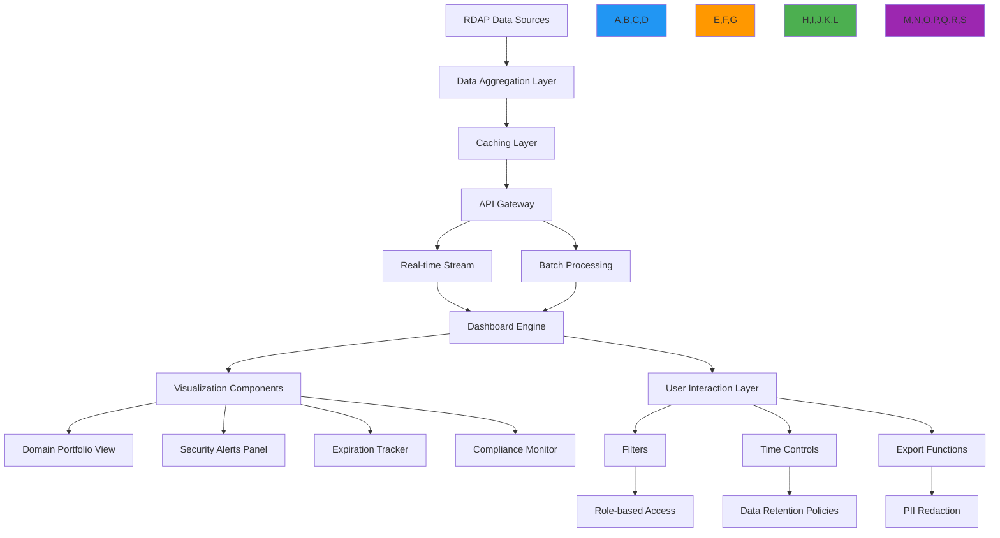

# Dashboard Components Recipe

🎯 **Purpose**: Comprehensive guide for implementing real-time, security-aware dashboard components for RDAP registration data visualization with focus on performance, compliance, and user experience  
📚 **Related**: [Monitoring Service](monitoring_service.md) | [API Gateway](api_gateway.md) | [Data Aggregation](data_aggregation.md) | [Pattern Analysis](pattern_analysis.md)  
⏱️ **Reading Time**: 8 minutes  
🔍 **Pro Tip**: Use the [Dashboard Preview](../../playground/dashboard-preview.md) to test your dashboard components against live RDAP data before integration

## 🌐 Dashboard Architecture Overview

RDAPify's dashboard system provides a unified visualization layer for registration data with enterprise-grade security, real-time updates, and compliance-aware data presentation:



### Core Dashboard Principles
✅ **Real-time Intelligence**: Live updates for critical registration changes with <1s latency  
✅ **Compliance-Aware Visualization**: Automatic PII redaction and jurisdiction-aware data display  
✅ **Role-Based Data Access**: Granular permissions controlling dashboard visibility by user role  
✅ **Zero-Trust Architecture**: All data access validated against security policies before visualization  
✅ **Performance-Optimized Rendering**: Lazy loading, virtualized lists, and adaptive data density  
✅ **Audit-Ready Interactions**: Complete audit trail for all dashboard interactions and data exports  

## ⚙️ Component Implementation Patterns

### 1. Real-time Domain Portfolio Dashboard
```typescript
// src/dashboard/domain-portfolio.ts
import { RDAPClient } from 'rdapify';
import { PortfolioManager } from '../../portfolio/portfolio-manager';
import { SecurityContext } from '../../types';
import { ComplianceEngine } from '../../security/compliance';

export class DomainPortfolioDashboard {
  private portfolioManager: PortfolioManager;
  private rdapClient: RDAPClient;
  private complianceEngine: ComplianceEngine;
  private websocketServer: WebSocketServer;
  
  constructor(options: {
    portfolioManager?: PortfolioManager;
    rdapClient?: RDAPClient;
    complianceEngine?: ComplianceEngine;
    websocketServer?: WebSocketServer;
  } = {}) {
    this.portfolioManager = options.portfolioManager || new PortfolioManager();
    this.rdapClient = options.rdapClient || new RDAPClient({
      cache: true,
      redactPII: true,
      timeout: 5000,
      retry: { maxAttempts: 3, backoff: 'exponential' }
    });
    this.complianceEngine = options.complianceEngine || new ComplianceEngine();
    this.websocketServer = options.websocketServer || new WebSocketServer();
  }
  
  async renderDashboard(
    portfolioId: string, 
    context: SecurityContext,
    filters: DashboardFilters = {}
  ): Promise<DashboardView> {
    // Get portfolio data with compliance context
    const portfolio = await this.portfolioManager.getPortfolio(portfolioId, context);
    
    // Apply filters and compliance transformations
    const filteredDomains = this.applySecurityFilters(portfolio.domains, context, filters);
    const compliantDomains = await this.complianceEngine.applyComplianceTransformations(filteredDomains, context);
    
    // Get real-time analytics
    const analytics = await this.getPortfolioAnalytics(compliantDomains, context);
    
    // Create dashboard view
    const dashboard: DashboardView = {
      id: `dashboard-${portfolioId}-${Date.now()}`,
      timestamp: new Date().toISOString(),
      portfolio: {
        id: portfolio.id,
        name: portfolio.name,
        totalDomains: portfolio.domains.length,
        criticalDomains: portfolio.domains.filter(d => d.criticality === 'critical').length
      },
      summary: {
        criticalAlerts: analytics.criticalAlerts,
        expiringSoon: analytics.expiringSoon,
        securityRisks: analytics.securityRisks,
        complianceStatus: analytics.complianceStatus
      },
      domains: compliantDomains.map(domain => this.createDomainCard(domain, context)),
      filters: {
        applied: filters,
        available: this.getAvailableFilters(portfolio, context)
      },
      meta {
        refreshInterval: this.getRefreshInterval(context),
        lastUpdated: new Date().toISOString(),
        complianceLevel: context.jurisdiction,
        securityLevel: context.securityLevel
      }
    };
    
    // Set up real-time updates if requested
    if (context.realtimeUpdates) {
      this.setupRealtimeUpdates(portfolioId, context, dashboard.id);
    }
    
    return dashboard;
  }
  
  private applySecurityFilters(domains: Domain[], context: SecurityContext, filters: DashboardFilters): Domain[] {
    let result = [...domains];
    
    // Apply security level filtering
    if (context.securityLevel === 'restricted') {
      result = result.filter(domain => domain.criticality !== 'low');
    }
    
    // Apply role-based filtering
    if (context.userRole === 'analyst') {
      result = result.filter(domain => 
        ['security', 'compliance'].includes(domain.category)
      );
    }
    
    // Apply explicit filters
    if (filters.criticality) {
      result = result.filter(domain => domain.criticality === filters.criticality);
    }
    
    if (filters.expirationThreshold) {
      result = result.filter(domain => 
        this.getDaysUntilExpiration(domain) <= filters.expirationThreshold!
      );
    }
    
    return result;
  }
  
  private createDomainCard(domain: Domain, context: SecurityContext): DomainCard {
    return {
      domain: domain.name,
      criticality: domain.criticality,
      registrar: domain.registrar?.name || 'Unknown',
      expirationDate: this.formatDate(domain.expirationDate),
      lastUpdated: this.formatDate(domain.lastChecked),
      status: domain.status || 'active',
      securityScore: this.calculateSecurityScore(domain),
      complianceStatus: this.getComplianceStatus(domain, context),
      riskLevel: this.calculateRiskLevel(domain),
      actions: context.userRole === 'admin' ? ['edit', 'alert', 'export'] : []
    };
  }
  
  private async setupRealtimeUpdates(portfolioId: string, context: SecurityContext, dashboardId: string): Promise<void> {
    // Create WebSocket channel for this dashboard
    const channel = `dashboard:${dashboardId}`;
    
    // Subscribe to real-time updates
    this.websocketServer.subscribe(channel, async (message) => {
      if (message.type === 'domain_change') {
        // Validate message security context
        if (!this.validateMessageContext(message, context)) {
          return;
        }
        
        // Process domain change
        const updatedDomain = await this.processDomainChange(message.domain, context);
        
        // Send update to clients
        await this.websocketServer.publish(channel, {
          type: 'domain_update',
          domain: updatedDomain,
          timestamp: new Date().toISOString()
        });
      }
    });
    
    // Set up portfolio monitoring
    await this.portfolioManager.startRealtimeMonitoring(portfolioId, context, {
      onDomainChange: async (domain) => {
        await this.websocketServer.publish(channel, {
          type: 'domain_change',
          domain,
          timestamp: new Date().toISOString()
        });
      },
      onAlert: async (alert) => {
        await this.websocketServer.publish(channel, {
          type: 'security_alert',
          alert,
          timestamp: new Date().toISOString()
        });
      }
    });
    
    // Cleanup on disconnect
    this.websocketServer.onDisconnect(channel, () => {
      this.portfolioManager.stopRealtimeMonitoring(portfolioId);
    });
  }
  
  private validateMessageContext(message: any, context: SecurityContext): boolean {
    // Verify jurisdiction compliance
    if (message.jurisdiction !== context.jurisdiction) {
      return false;
    }
    
    // Verify security level
    if (message.securityLevel > context.securityLevel) {
      return false;
    }
    
    // Verify role permissions
    if (message.requiresRole && !context.roles.includes(message.requiresRole)) {
      return false;
    }
    
    return true;
  }
  
  private getRefreshInterval(context: SecurityContext): number {
    // Critical security dashboards refresh more frequently
    if (context.userRole === 'security' && context.securityLevel === 'high') {
      return 5000; // 5 seconds
    }
    
    // Standard dashboards
    return 30000; // 30 seconds
  }
  
  private calculateSecurityScore(domain: Domain): number {
    // Implementation would calculate security score based on domain configuration
    return 85; // Placeholder
  }
  
  private getComplianceStatus(domain: Domain, context: SecurityContext): ComplianceStatus {
    // Implementation would check compliance status based on jurisdiction
    return {
      gdpr: domain.country === 'EU' ? 'compliant' : 'not_applicable',
      ccpa: domain.country === 'US-CA' ? 'compliant' : 'not_applicable',
      overall: 'compliant'
    };
  }
  
  private calculateRiskLevel(domain: Domain): RiskLevel {
    // Implementation would calculate risk level based on various factors
    return domain.criticality === 'critical' ? 'high' : 'medium';
  }
}
```

### 2. Security Alert Panel Component
```typescript
// src/dashboard/security-alerts.ts
import { WebSocketServer } from './websocket-server';
import { ThreatIntelligenceService } from '../../security/threat-intelligence';
import { AlertManager } from '../../alerts/alert-manager';
import { ComplianceEngine } from '../../security/compliance';

export class SecurityAlertPanel {
  private websocketServer: WebSocketServer;
  private threatIntelligence: ThreatIntelligenceService;
  private alertManager: AlertManager;
  private complianceEngine: ComplianceEngine;
  
  constructor(options: {
    websocketServer?: WebSocketServer;
    threatIntelligence?: ThreatIntelligenceService;
    alertManager?: AlertManager;
    complianceEngine?: ComplianceEngine;
  } = {}) {
    this.websocketServer = options.websocketServer || new WebSocketServer();
    this.threatIntelligence = options.threatIntelligence || new ThreatIntelligenceService();
    this.alertManager = options.alertManager || new AlertManager();
    this.complianceEngine = options.complianceEngine || new ComplianceEngine();
  }
  
  async renderAlertPanel(
    portfolioId: string,
    context: SecurityContext,
    options: AlertPanelOptions = {}
  ): Promise<AlertPanelView> {
    // Get recent alerts with security context
    const alerts = await this.alertManager.getRecentAlerts(portfolioId, {
      ...context,
      maxAlerts: options.maxAlerts || 50,
      severityThreshold: options.severityThreshold || 'medium'
    });
    
    // Apply compliance transformations
    const compliantAlerts = await this.complianceEngine.applyComplianceTransformations(alerts, context);
    
    // Get threat intelligence context
    const enrichedAlerts = await this.enrichAlertsWithThreatIntelligence(compliantAlerts, context);
    
    // Create alert panel view
    const panel: AlertPanelView = {
      id: `alert-panel-${portfolioId}-${Date.now()}`,
      timestamp: new Date().toISOString(),
      summary: {
        totalAlerts: alerts.length,
        criticalAlerts: alerts.filter(a => a.severity === 'critical').length,
        highAlerts: alerts.filter(a => a.severity === 'high').length,
        unresolvedAlerts: alerts.filter(a => !a.resolved).length
      },
      alerts: enrichedAlerts.map(alert => this.createAlertCard(alert, context)),
      filters: {
        timeRange: options.timeRange || '24h',
        severityLevels: ['critical', 'high', 'medium'],
        alertTypes: ['registrar_change', 'nameserver_change', 'status_change', 'expiration_warning']
      },
      actions: context.userRole === 'security' ? ['resolve', 'escalate', 'investigate'] : [],
      meta {
        autoRefresh: options.autoRefresh !== false,
        refreshInterval: this.getRefreshInterval(context),
        complianceLevel: context.jurisdiction
      }
    };
    
    // Set up real-time alert streaming
    if (options.realtime !== false) {
      this.setupAlertStreaming(portfolioId, context, panel.id, options);
    }
    
    return panel;
  }
  
  private async enrichAlertsWithThreatIntelligence(alerts: Alert[], context: SecurityContext): Promise<Alert[]> {
    const enriched = [];
    
    for (const alert of alerts) {
      try {
        // Get threat score for domain
        const threatScore = await this.threatIntelligence.getThreatScore(alert.domain, {
          changeType: alert.type,
          timestamp: alert.timestamp
        });
        
        // Get threat context
        const threatContext = await this.threatIntelligence.getThreatContext(alert.domain, {
          jurisdiction: context.jurisdiction,
          securityLevel: context.securityLevel
        });
        
        enriched.push({
          ...alert,
          threatScore,
          threatContext: context.securityLevel === 'high' ? threatContext : undefined,
          recommendations: this.getSecurityRecommendations(alert, threatScore)
        });
      } catch (error) {
        console.warn(`Failed to enrich alert for ${alert.domain}:`, error.message);
        enriched.push(alert);
      }
    }
    
    return enriched;
  }
  
  private createAlertCard(alert: Alert, context: SecurityContext): AlertCard {
    return {
      id: alert.id,
      domain: alert.domain,
      type: alert.type,
      severity: alert.severity,
      timestamp: this.formatDateTime(alert.timestamp),
      description: this.getAlertDescription(alert, context),
      riskLevel: alert.threatScore ? this.calculateRiskLevelFromScore(alert.threatScore) : 'medium',
      status: alert.status || 'active',
      actions: this.getAvailableActions(alert, context),
      details: context.securityLevel === 'high' ? alert.details : undefined
    };
  }
  
  private getAlertDescription(alert: Alert, context: SecurityContext): string {
    const baseDescription = this.getBaseAlertDescription(alert);
    
    // Add compliance context for relevant jurisdictions
    if (context.jurisdiction === 'EU' && ['registrar_change', 'contact_change'].includes(alert.type)) {
      return `${baseDescription} (GDPR Article 32 compliance monitoring)`;
    }
    
    if (context.jurisdiction === 'US-CA' && alert.type === 'contact_change') {
      return `${baseDescription} (CCPA consumer rights monitoring)`;
    }
    
    return baseDescription;
  }
  
  private getBaseAlertDescription(alert: Alert): string {
    switch (alert.type) {
      case 'registrar_change':
        return `Registrar changed from ${alert.oldValue} to ${alert.newValue}`;
      case 'nameserver_change':
        return `${alert.changeCount || 1} nameserver(s) changed`;
      case 'status_change':
        return `Domain status changed to ${alert.newValue}`;
      case 'expiration_warning':
        return `Domain expires in ${alert.daysUntilExpiration} days`;
      default:
        return `Domain change detected: ${alert.type}`;
    }
  }
  
  private async setupAlertStreaming(
    portfolioId: string,
    context: SecurityContext,
    panelId: string,
    options: AlertPanelOptions
  ): Promise<void> {
    const channel = `alerts:${panelId}`;
    
    // Subscribe to alert stream
    this.websocketServer.subscribe(channel, async (message) => {
      if (message.type === 'new_alert') {
        // Validate alert security context
        if (!this.validateAlertContext(message.alert, context)) {
          return;
        }
        
        // Apply compliance transformations
        const compliantAlert = await this.complianceEngine.applyComplianceTransformations(
          [message.alert],
          context
        );
        
        // Send to clients
        await this.websocketServer.publish(channel, {
          type: 'alert_update',
          alert: compliantAlert[0],
          timestamp: new Date().toISOString()
        });
      }
    });
    
    // Set up real-time alert monitoring
    await this.alertManager.subscribeToAlerts(portfolioId, context, {
      onAlert: async (alert) => {
        await this.websocketServer.publish(channel, {
          type: 'new_alert',
          alert,
          timestamp: new Date().toISOString()
        });
      },
      onError: async (error) => {
        await this.websocketServer.publish(channel, {
          type: 'error',
          error: error.message,
          timestamp: new Date().toISOString()
        });
      }
    });
    
    // Cleanup on disconnect
    this.websocketServer.onDisconnect(channel, () => {
      this.alertManager.unsubscribeFromAlerts(portfolioId, context);
    });
  }
  
  private validateAlertContext(alert: Alert, context: SecurityContext): boolean {
    // Critical alerts require high security clearance
    if (alert.severity === 'critical' && context.securityLevel !== 'high') {
      return false;
    }
    
    // GDPR-related alerts require EU compliance context
    if (alert.gdprRelevant && context.jurisdiction !== 'EU') {
      return false;
    }
    
    return true;
  }
  
  private getAvailableActions(alert: Alert, context: SecurityContext): string[] {
    const baseActions = ['view', 'acknowledge'];
    
    // Security team can resolve alerts
    if (context.userRole === 'security') {
      baseActions.push('resolve', 'escalate');
    }
    
    // Critical alerts can be investigated
    if (alert.severity === 'critical') {
      baseActions.push('investigate');
    }
    
    // GDPR-related alerts can be reported
    if (alert.gdprRelevant && context.jurisdiction === 'EU') {
      baseActions.push('report');
    }
    
    return baseActions;
  }
  
  private getRefreshInterval(context: SecurityContext): number {
    return context.securityLevel === 'high' ? 5000 : 30000; // 5s or 30s
  }
  
  private calculateRiskLevelFromScore(score: number): RiskLevel {
    if (score > 0.8) return 'critical';
    if (score > 0.6) return 'high';
    if (score > 0.4) return 'medium';
    return 'low';
  }
  
  private getSecurityRecommendations(alert: Alert, threatScore: number): string[] {
    const recommendations = [];
    
    if (threatScore > 0.7) {
      recommendations.push('Immediate investigation required');
      recommendations.push('Isolate affected systems');
    }
    
    if (threatScore > 0.5) {
      recommendations.push('Review domain security settings');
      recommendations.push('Verify DNS configuration');
    }
    
    if (['registrar_change', 'nameserver_change'].includes(alert.type)) {
      recommendations.push('Contact registrar support');
      recommendations.push('Verify authorized changes');
    }
    
    return recommendations;
  }
}
```

## 🔒 Security and Compliance Controls

### 1. GDPR-Compliant Dashboard Components
```typescript
// src/dashboard/gdpr-compliance.ts
export class GDPRCompliantDashboard {
  private dpoContact: string;
  private dataRetentionPeriod: number;
  
  constructor(options: {
    dpoContact: string;
    dataRetentionPeriod?: number; // days
  }) {
    this.dpoContact = options.dpoContact;
    this.dataRetentionPeriod = options.dataRetentionPeriod || 30;
  }
  
  async processDashboardData(data: any, context: GDPRContext): Promise<GDPRDashboardData> {
    // Apply GDPR Article 6 lawful basis check
    const lawfulBasis = this.verifyLawfulBasis(context);
    if (!lawfulBasis.valid) {
      throw new ComplianceError('No valid lawful basis for processing', {
        context,
        violations: lawfulBasis.violations
      });
    }
    
    // Apply GDPR Article 5 data minimization
    const minimizedData = this.minimizeDashboardData(data, context);
    
    // Apply GDPR Article 32 security measures
    const securedData = this.applySecurityMeasures(minimizedData, context);
    
    // Add GDPR Article 30 processing record
    await this.recordProcessingActivity(data, context, lawfulBasis);
    
    return {
      data: securedData,
      gdprMeta {
        lawfulBasis: lawfulBasis.basis,
        dataMinimizationApplied: true,
        retentionPeriod: `${this.dataRetentionPeriod} days`,
        dpoContact: this.dpoContact,
        processingRecords: this.getProcessingRecords(context)
      }
    };
  }
  
  private verifyLawfulBasis(context: GDPRContext): LawfulBasisResult {
    // GDPR Article 6 lawful bases
    const bases = [
      { basis: 'consent', valid: context.consent?.given },
      { basis: 'contract', valid: context.contract?.exists },
      { basis: 'legal-obligation', valid: context.legalObligation?.exists },
      { basis: 'legitimate-interest', valid: this.validateLegitimateInterest(context) }
    ];
    
    const validBasis = bases.find(b => b.valid);
    if (validBasis) {
      return { valid: true, basis: validBasis.basis };
    }
    
    return {
      valid: false,
      violations: [
        'No valid lawful basis under GDPR Article 6',
        'Consider obtaining explicit consent or establishing contractual necessity',
        'Data processing without legal basis violates GDPR Article 6(1)'
      ]
    };
  }
  
  private validateLegitimateInterest(context: GDPRContext): boolean {
    // Legitimate interest assessment (LIA) for security monitoring
    const purposes = [
      'security monitoring',
      'fraud prevention',
      'system integrity',
      'network protection',
      'incident response'
    ];
    
    return purposes.some(purpose => context.purposes?.includes(purpose));
  }
  
  private minimizeDashboardData(data: any, context: GDPRContext): any {
    // Remove non-essential fields based on user role and context
    const minimized: any = {};
    
    // Essential fields always included
    minimized.id = data.id;
    minimized.timestamp = data.timestamp;
    minimized.summary = data.summary;
    
    // Domain data with conditional PII fields
    if (data.domains) {
      minimized.domains = data.domains.map((domain: any) => {
        const result: any = {
          domain: domain.domain,
          criticality: domain.criticality,
          expirationDate: domain.expirationDate,
          status: domain.status
        };
        
        // Only include PII for authorized roles with consent
        if (context.includePII && ['security', 'admin'].includes(context.userRole)) {
          result.registrar = domain.registrar;
          result.nameservers = domain.nameservers;
        }
        
        return result;
      });
    }
    
    // Alerts with redacted sensitive information
    if (data.alerts) {
      minimized.alerts = data.alerts.map((alert: any) => {
        const result: any = {
          id: alert.id,
          domain: alert.domain,
          type: alert.type,
          severity: alert.severity,
          timestamp: alert.timestamp
        };
        
        // Redact raw values in alerts
        if (alert.oldValue && alert.oldValue.includes('@')) {
          result.oldValue = '[REDACTED]';
        }
        
        if (alert.newValue && alert.newValue.includes('@')) {
          result.newValue = '[REDACTED]';
        }
        
        return result;
      });
    }
    
    return minimized;
  }
  
  private applySecurityMeasures(data: any, context: GDPRContext): any {
    // Add security metadata
    data.securityMeta = {
      encryptionApplied: true,
      accessControls: context.userRole,
      processingLocation: process.env.SERVER_LOCATION || 'unknown',
      timestamp: new Date().toISOString()
    };
    
    // Anonymize IP addresses
    if (data.userIP) {
      data.userIP = this.anonymizeIP(data.userIP);
    }
    
    return data;
  }
  
  private anonymizeIP(ip: string): string {
    // Anonymize last octet for IPv4, last segment for IPv6
    if (ip.includes(':')) {
      return ip.replace(/:[^:]+$/, ':xxxx');
    } else {
      return ip.replace(/\.\d+$/, '.xxx');
    }
  }
  
  private async recordProcessingActivity(data: any, context: GDPRContext, basis: LawfulBasisResult): Promise<void> {
    // GDPR Article 30 record of processing activities
    const record: ProcessingRecord = {
      timestamp: new Date().toISOString(),
      processor: 'RDAPify Dashboard System',
      controller: context.controller || 'unknown',
      purposes: context.purposes || ['security_monitoring'],
      lawfulBasis: basis.basis,
      dataCategories: this.getDataCategories(data),
      recipients: context.recipients || ['security_team'],
      retentionPeriod: `${this.dataRetentionPeriod} days`,
      securityMeasures: ['encryption', 'access_controls', 'audit_logging'],
      dpoContact: this.dpoContact
    };
    
    await this.storage.recordProcessingActivity(record);
  }
  
  private getDataCategories(data: any): string[] {
    const categories = new Set<string>();
    
    if (data.domains) {
      categories.add('domain_registration_data');
    }
    
    if (data.alerts) {
      categories.add('security_alerts');
    }
    
    if (data.userInteractions) {
      categories.add('user_activities');
    }
    
    return Array.from(categories);
  }
  
  private getProcessingRecords(context: GDPRContext): ProcessingRecordSummary[] {
    return [
      {
        article: '5(1)(c)',
        requirement: 'Data minimization',
        implementation: 'PII redaction based on user role and consent status'
      },
      {
        article: '6(1)',
        requirement: 'Lawful basis',
        implementation: context.legalBasis || 'legitimate-interest'
      },
      {
        article: '32',
        requirement: 'Security of processing',
        implementation: 'Encryption, access controls, audit logging'
      }
    ];
  }
}
```

### 2. Role-Based Access Control System
```typescript
// src/dashboard/rbac.ts
export class DashboardRBAC {
  private roleDefinitions = new Map<string, RoleDefinition>();
  private permissionCache = new Map<string, Set<string>>();
  
  constructor() {
    this.loadDefaultRoleDefinitions();
  }
  
  private loadDefaultRoleDefinitions() {
    // Security Analyst role
    this.roleDefinitions.set('security', {
      id: 'security',
      name: 'Security Analyst',
      defaultPermissions: [
        'view:critical_alerts',
        'view:high_risk_domains',
        'action:investigate_alerts',
        'action:resolve_alerts'
      ],
      conditionalPermissions: [
        {
          permission: 'view:pii',
          condition: (context) => context.legalBasis === 'consent' && context.consent?.given
        },
        {
          permission: 'action:export_data',
          condition: (context) => context.exportJustification !== undefined
        }
      ],
      dataAccess: {
        maxCriticality: 'critical',
        includePII: (context) => context.legalBasis === 'consent' && context.consent?.given,
        retainHistory: 30 // days
      }
    });
    
    // Compliance Officer role
    this.roleDefinitions.set('compliance', {
      id: 'compliance',
      name: 'Compliance Officer',
      defaultPermissions: [
        'view:compliance_status',
        'view:gdpr_articles',
        'action:generate_reports',
        'action:audit_logs'
      ],
      conditionalPermissions: [
        {
          permission: 'view:raw_registrant_data',
          condition: (context) => context.jurisdiction === 'EU' && context.legalBasis === 'legal-obligation'
        }
      ],
      dataAccess: {
        maxCriticality: 'high',
        includePII: true,
        retainHistory: 730 // days (2 years)
      }
    });
    
    // Executive Dashboard role
    this.roleDefinitions.set('executive', {
      id: 'executive',
      name: 'Executive',
      defaultPermissions: [
        'view:summary_metrics',
        'view:business_impact',
        'action:export_summary'
      ],
      conditionalPermissions: [],
      dataAccess: {
        maxCriticality: 'medium',
        includePII: false,
        retainHistory: 7 // days
      }
    });
  }
  
  async checkPermission(user: DashboardUser, permission: string, context: PermissionContext): Promise<boolean> {
    // Get cached permissions for this user
    const cacheKey = `${user.id}:${user.role}:${context.jurisdiction || 'global'}`;
    let permissions = this.permissionCache.get(cacheKey);
    
    if (!permissions) {
      permissions = await this.getUserPermissions(user, context);
      this.permissionCache.set(cacheKey, permissions);
      
      // Set cache expiration (5 minutes)
      setTimeout(() => {
        this.permissionCache.delete(cacheKey);
      }, 300000);
    }
    
    return permissions.has(permission);
  }
  
  private async getUserPermissions(user: DashboardUser, context: PermissionContext): Promise<Set<string>> {
    const role = this.roleDefinitions.get(user.role);
    if (!role) {
      return new Set();
    }
    
    const permissions = new Set<string>(role.defaultPermissions);
    
    // Apply conditional permissions
    for (const condition of role.conditionalPermissions) {
      if (await condition.condition(context)) {
        permissions.add(condition.permission);
      }
    }
    
    // Apply jurisdiction-specific permissions
    if (context.jurisdiction === 'EU') {
      permissions.add('view:gdpr_compliance');
      permissions.add('action:dpa_reports');
    }
    
    if (context.jurisdiction === 'US-CA') {
      permissions.add('view:ccpa_compliance');
      permissions.add('action:consumer_rights_reports');
    }
    
    return permissions;
  }
  
  async getDataAccessPolicy(user: DashboardUser, context: PermissionContext): Promise<DataAccessPolicy> {
    const role = this.roleDefinitions.get(user.role);
    if (!role) {
      return {
        maxCriticality: 'low',
        includePII: false,
        retainHistory: 1
      };
    }
    
    return {
      maxCriticality: role.dataAccess.maxCriticality,
      includePII: typeof role.dataAccess.includePII === 'function' 
        ? role.dataAccess.includePII(context) 
        : role.dataAccess.includePII,
      retainHistory: role.dataAccess.retainHistory
    };
  }
  
  async getFilteredDashboardData(data: DashboardData, user: DashboardUser, context: PermissionContext): Promise<FilteredDashboardData> {
    const policy = await this.getDataAccessPolicy(user, context);
    
    // Filter by criticality
    const filteredDomains = data.domains.filter(domain => 
      this.getCriticalityLevel(domain.criticality) <= this.getCriticalityLevel(policy.maxCriticality)
    );
    
    // Apply PII filtering
    const piiFilteredDomains = filteredDomains.map(domain => {
      if (!policy.includePII) {
        return this.removePII(domain);
      }
      return domain;
    });
    
    // Filter alerts by severity and user permissions
    const permissions = await this.getUserPermissions(user, context);
    const filteredAlerts = data.alerts.filter(alert => {
      // Check severity threshold
      if (this.getSeverityLevel(alert.severity) > this.getSeverityLevel(policy.maxCriticality)) {
        return false;
      }
      
      // Check permissions for sensitive alert types
      if (['registrar_change', 'contact_change'].includes(alert.type) && !permissions.has('view:pii')) {
        return false;
      }
      
      return true;
    });
    
    return {
      domains: piiFilteredDomains,
      alerts: filteredAlerts,
      summary: this.filterSummary(data.summary, user, context),
      meta {
        filtered: true,
        permissions: Array.from(await this.getUserPermissions(user, context)),
        dataPolicy: policy
      }
    };
  }
  
  private removePII(domain: any): any {
    const result = { ...domain };
    
    // Remove PII fields
    delete result.registrant;
    delete result.administrativeContact;
    delete result.technicalContact;
    delete result.billingContact;
    
    // Redact email addresses
    if (result.email) {
      result.email = '[REDACTED]';
    }
    
    return result;
  }
  
  private getCriticalityLevel(criticality: string): number {
    const levels: Record<string, number> = {
      'low': 1,
      'medium': 2,
      'high': 3,
      'critical': 4
    };
    return levels[criticality.toLowerCase()] || 0;
  }
  
  private getSeverityLevel(severity: string): number {
    const levels: Record<string, number> = {
      'low': 1,
      'medium': 2,
      'high': 3,
      'critical': 4
    };
    return levels[severity.toLowerCase()] || 0;
  }
  
  private filterSummary(summary: any, user: DashboardUser, context: PermissionContext): any {
    const result = { ...summary };
    
    // Remove sensitive metrics based on permissions
    const permissions = this.permissionCache.get(`${user.id}:${user.role}`);
    
    if (!permissions?.has('view:security_metrics')) {
      delete result.securityRisks;
      delete result.threatScores;
    }
    
    if (!permissions?.has('view:compliance_metrics')) {
      delete result.complianceStatus;
      delete result.gdprArticles;
      delete result.ccpaMetrics;
    }
    
    return result;
  }
}
```

## ⚡ Performance Optimization Strategies

### 1. Real-time Data Streaming Architecture
```typescript
// src/dashboard/streaming.ts
import { WebSocket, Server } from 'ws';
import { Readable } from 'stream';
import { promisify } from 'util';

export class RealtimeDashboardStream {
  private wss: Server;
  private channels = new Map<string, Set<WebSocket>>();
  private messageQueues = new Map<string, MessageQueue>();
  
  constructor(options: {
    port?: number;
    maxConnections?: number;
    heartbeatInterval?: number;
  } = {}) {
    this.wss = new Server({
      port: options.port || 3001,
      maxPayload: 1024 * 1024 // 1MB max payload
    });
    
    this.setupWebSocketServer();
  }
  
  private setupWebSocketServer() {
    this.wss.on('connection', (socket: WebSocket, request: any) => {
      const ip = request.socket.remoteAddress;
      const channel = this.getChannelFromRequest(request);
      
      // Connection limiting
      if (this.wss.clients.size > 1000) { // Max 1000 connections
        socket.close(1013, 'Server too busy');
        return;
      }
      
      // IP rate limiting (max 10 connections per IP)
      const ipCount = Array.from(this.wss.clients).filter(client => {
        return (client as any).ip === ip;
      }).length;
      
      if (ipCount > 10) {
        socket.close(1008, 'Too many connections from your IP');
        return;
      }
      
      // Authentication
      const authHeader = request.headers['x-auth-token'];
      if (!this.validateAuthToken(authHeader, channel)) {
        socket.close(4001, 'Unauthorized');
        return;
      }
      
      // Setup socket
      (socket as any).ip = ip;
      (socket as any).channel = channel;
      (socket as any).lastPing = Date.now();
      
      // Add to channel
      if (!this.channels.has(channel)) {
        this.channels.set(channel, new Set());
      }
      this.channels.get(channel)!.add(socket);
      
      // Setup heartbeat
      const heartbeatInterval = setInterval(() => {
        if (Date.now() - (socket as any).lastPing > 60000) { // 60 second timeout
          socket.close(1001, 'Ping timeout');
          clearInterval(heartbeatInterval);
        }
      }, 30000); // Check every 30 seconds
      
      // Setup close handler
      socket.on('close', () => {
        clearInterval(heartbeatInterval);
        this.removeFromChannel(channel, socket);
      });
      
      // Setup message handler
      socket.on('message', (data: Buffer) => {
        try {
          const message = JSON.parse(data.toString());
          
          // Handle ping/pong
          if (message.type === 'ping') {
            (socket as any).lastPing = Date.now();
            socket.send(JSON.stringify({ type: 'pong', timestamp: Date.now() }));
            return;
          }
          
          // Handle subscription
          if (message.type === 'subscribe') {
            this.handleSubscription(socket, message);
            return;
          }
          
          // Handle unsubscription
          if (message.type === 'unsubscribe') {
            this.handleUnsubscription(socket, message);
            return;
          }
        } catch (error) {
          console.error('WebSocket message error:', error.message);
          socket.close(1007, 'Invalid message format');
        }
      });
      
      // Send welcome message
      socket.send(JSON.stringify({
        type: 'welcome',
        message: 'Connected to RDAPify Dashboard Stream',
        channel,
        timestamp: Date.now()
      }));
    });
    
    // Setup server cleanup
    setInterval(() => this.cleanupStaleConnections(), 60000); // Every minute
  }
  
  private getChannelFromRequest(request: any): string {
    const url = new URL(request.url, `http://${request.headers.host}`);
    return url.searchParams.get('channel') || 'default';
  }
  
  private validateAuthToken(token: string | undefined, channel: string): boolean {
    // Simplified token validation - in production, use JWT or OAuth
    if (!token) return false;
    
    // Channel-specific validation
    if (channel.startsWith('portfolio:') && !token.includes('portfolio')) {
      return false;
    }
    
    if (channel.startsWith('alerts:') && !token.includes('alerts')) {
      return false;
    }
    
    return true;
  }
  
  private removeFromChannel(channel: string, socket: WebSocket) {
    const channelSet = this.channels.get(channel);
    if (channelSet) {
      channelSet.delete(socket);
      if (channelSet.size === 0) {
        this.channels.delete(channel);
      }
    }
  }
  
  private handleSubscription(socket: WebSocket, message: any) {
    const newChannel = message.channel;
    const oldChannel = (socket as any).channel;
    
    if (oldChannel !== newChannel) {
      // Remove from old channel
      this.removeFromChannel(oldChannel, socket);
      
      // Add to new channel
      if (!this.channels.has(newChannel)) {
        this.channels.set(newChannel, new Set());
      }
      this.channels.get(newChannel)!.add(socket);
      
      (socket as any).channel = newChannel;
      
      // Send confirmation
      socket.send(JSON.stringify({
        type: 'subscription_confirmed',
        channel: newChannel,
        timestamp: Date.now()
      }));
    }
  }
  
  private handleUnsubscription(socket: WebSocket, message: any) {
    const channel = message.channel || (socket as any).channel;
    this.removeFromChannel(channel, socket);
    
    // Send confirmation
    socket.send(JSON.stringify({
      type: 'unsubscription_confirmed',
      channel,
      timestamp: Date.now()
    }));
  }
  
  private cleanupStaleConnections() {
    const now = Date.now();
    
    for (const [channel, sockets] of this.channels) {
      for (const socket of sockets) {
        if (now - (socket as any).lastPing > 120000) { // 2 minute timeout
          socket.close(1001, 'Stale connection');
          sockets.delete(socket);
        }
      }
      
      if (sockets.size === 0) {
        this.channels.delete(channel);
      }
    }
  }
  
  async publishToChannel(channel: string, message: any): Promise<void> {
    const sockets = this.channels.get(channel);
    if (!sockets || sockets.size === 0) return;
    
    const payload = {
      ...message,
      channel,
      timestamp: Date.now()
    };
    
    // Use message queue for high-volume channels
    if (sockets.size > 100) {
      await this.queueMessageForChannel(channel, payload);
      return;
    }
    
    // Direct publish for low-volume channels
    for (const socket of sockets) {
      if ((socket as any).readyState === WebSocket.OPEN) {
        try {
          socket.send(JSON.stringify(payload));
        } catch (error) {
          console.warn(`Failed to send to socket in ${channel}:`, error.message);
          this.removeFromChannel(channel, socket);
        }
      }
    }
  }
  
  private async queueMessageForChannel(channel: string, payload: any): Promise<void> {
    if (!this.messageQueues.has(channel)) {
      this.messageQueues.set(channel, new MessageQueue({
        maxQueueSize: 1000,
        processInterval: 100 // ms
      }));
    }
    
    const queue = this.messageQueues.get(channel)!;
    queue.addMessage(payload);
    
    // Process queue
    if (!queue.isProcessing) {
      queue.isProcessing = true;
      this.processMessageQueue(channel, queue);
    }
  }
  
  private async processMessageQueue(channel: string, queue: MessageQueue): Promise<void> {
    while (queue.hasMessages()) {
      const batch = queue.getBatch(50); // Process 50 messages at a time
      
      const sockets = this.channels.get(channel);
      if (!sockets) break;
      
      // Send batch to all connected sockets
      for (const socket of sockets) {
        if ((socket as any).readyState === WebSocket.OPEN) {
          try {
            for (const message of batch) {
              socket.send(JSON.stringify(message));
            }
          } catch (error) {
            console.warn(`Failed to send batch to socket in ${channel}:`, error.message);
            this.removeFromChannel(channel, socket);
          }
        }
      }
      
      // Small delay between batches to prevent overwhelming
      if (queue.hasMessages()) {
        await new Promise(resolve => setTimeout(resolve, 10));
      }
    }
    
    queue.isProcessing = false;
  }
  
  getStats(): StreamStats {
    return {
      totalConnections: this.wss.clients.size,
      totalChannels: this.channels.size,
      channels: Array.from(this.channels.entries()).map(([name, sockets]) => ({
        name,
        connections: sockets.size
      }))
    };
  }
  
  close(): Promise<void> {
    return new Promise((resolve) => {
      this.wss.close(() => {
        // Close all message queues
        for (const queue of this.messageQueues.values()) {
          queue.close();
        }
        resolve();
      });
    });
  }
}

// Message queue class for high-volume channels
class MessageQueue {
  private queue: any[] = [];
  private maxQueueSize: number;
  private processInterval: number;
  isProcessing: boolean = false;
  
  constructor(options: { maxQueueSize?: number; processInterval?: number } = {}) {
    this.maxQueueSize = options.maxQueueSize || 1000;
    this.processInterval = options.processInterval || 100;
  }
  
  addMessage(message: any): boolean {
    if (this.queue.length >= this.maxQueueSize) {
      this.queue.shift(); // Remove oldest message
      return false;
    }
    
    this.queue.push(message);
    return true;
  }
  
  getBatch(size: number): any[] {
    return this.queue.splice(0, size);
  }
  
  hasMessages(): boolean {
    return this.queue.length > 0;
  }
  
  close(): void {
    this.queue = [];
  }
}

interface StreamStats {
  totalConnections: number;
  totalChannels: number;
  channels: { name: string; connections: number }[];
}

interface RoleDefinition {
  id: string;
  name: string;
  defaultPermissions: string[];
  conditionalPermissions: {
    permission: string;
    condition: (context: any) => boolean | Promise<boolean>;
  }[];
  dataAccess: {
    maxCriticality: string;
    includePII: boolean | ((context: any) => boolean);
    retainHistory: number;
  };
}

interface PermissionContext {
  jurisdiction?: string;
  legalBasis?: string;
  consent?: { given: boolean; timestamp: string };
  contract?: { exists: boolean };
  legalObligation?: { exists: boolean };
  exportJustification?: string;
  userRole: string;
}

interface DataAccessPolicy {
  maxCriticality: string;
  includePII: boolean;
  retainHistory: number;
}

interface FilteredDashboardData {
  domains: any[];
  alerts: any[];
  summary: any;
  meta: {
    filtered: boolean;
    permissions: string[];
    dataPolicy: DataAccessPolicy;
  };
}
```

## 🔍 Troubleshooting Common Issues

### 1. Performance Degradation in Large Dashboards
**Symptoms**: Dashboard becomes slow or unresponsive when displaying 1000+ domains or handling multiple real-time data streams  
**Root Causes**:
- Unoptimized React/Vue component rendering
- Excessive WebSocket message frequency
- Inefficient data filtering and transformation
- Memory leaks in client-side JavaScript

**Diagnostic Steps**:
```bash
# Profile dashboard performance
node ./scripts/profile-dashboard.js --portfolio=large-portfolio --metrics

# Analyze WebSocket message frequency
node ./scripts/analyze-websocket-traffic.js --channel=portfolio:123

# Check for memory leaks
chrome://inspect -> Memory tab -> Take heap snapshots

# Monitor backend performance
curl http://dashboard-api/metrics | grep dashboard
```

**Solutions**:
✅ **Virtualized Lists**: Implement windowing libraries like react-virtualized or vue-virtual-scroller for large domain lists  
✅ **Adaptive Polling**: Reduce update frequency based on user activity and data volatility  
✅ **Data Chunking**: Split large datasets into smaller chunks processed in web workers  
✅ **Memoization**: Apply React.memo or Vue.memoize to prevent unnecessary re-renders
✅ **Backend Pagination**: Move filtering and sorting to backend API with cursor-based pagination  

### 2. PII Leakage in Dashboard Exports
**Symptoms**: Exported CSV/Excel reports contain personal information despite PII redaction in the UI  
**Root Causes**:
- Inconsistent PII redaction between UI and export functionality
- Missing compliance context in export API calls
- Insufficient role-based access controls for export endpoints
- Client-side export generation bypassing server-side security checks

**Diagnostic Steps**:
```bash
# Audit export functionality
grep -r "export" src/dashboard/ | grep -v "redact"

# Check compliance context propagation
node ./scripts/trace-compliance-context.js --path=export-handler

# Scan exported files for PII patterns
node ./scripts/pii-scanner.js --file=export.xlsx --patterns=email,phone,address

# Review RBAC for export endpoints
node ./scripts/rbac-audit.js --endpoint=/api/export
```

**Solutions**:
✅ **Centralized Redaction**: Apply PII redaction at the data service layer before any UI or export processing  
✅ **Context Propagation**: Ensure compliance context flows through all layers of the export pipeline  
✅ **Server-Side Export Generation**: Move all export processing to backend with full RBAC enforcement  
✅ **Audit Logging**: Implement detailed logging for all export operations with data sensitivity classification  
✅ **Watermarking**: Add invisible watermarks to exported files for tracking unauthorized distribution  

### 3. WebSocket Connection Issues
**Symptoms**: Dashboard fails to receive real-time updates after 5-10 minutes, requiring page refresh  
**Root Causes**:
- Network timeout settings in load balancers or proxies
- WebSocket ping/pong heartbeat misconfiguration
- Memory leaks in WebSocket server implementation
- Client-side reconnection logic failures

**Diagnostic Steps**:
```bash
# Monitor WebSocket connections
node ./scripts/monitor-websocket-connections.js --duration=3600

# Check network infrastructure timeouts
telnet dashboard-server 3001
curl -v http://dashboard-server/health

# Analyze client reconnection patterns
grep "reconnect" browser-console.log

# Profile WebSocket server memory usage
clinic doctor --autocannon [ -c 500 /websocket ] -- node ./dist/websocket-server.js
```

**Solutions**:
✅ **Connection Heartbeats**: Implement robust ping/pong mechanism with configurable timeouts and exponential backoff  
✅ **Network Infrastructure Tuning**: Configure load balancers with WebSocket-aware timeout settings (minimum 8 minutes)  
✅ **Graceful Degradation**: Implement offline support with IndexedDB to store updates during disconnections  
✅ **Connection State Management**: Use Redux or Vuex to manage connection state and automatic recovery  
✅ **Circuit Breaker Pattern**: Temporarily disable real-time updates after repeated failures to prevent resource exhaustion  

## 📚 Related Documentation

| Document | Description | Path |
|----------|-------------|------|
| [Monitoring Service](monitoring_service.md) | Real-time monitoring and alerting | [monitoring_service.md](monitoring_service.md) |
| [API Gateway](api_gateway.md) | Secure API access patterns | [api_gateway.md](api_gateway.md) |
| [Data Aggregation](data_aggregation.md) | Large-scale data collection patterns | [data_aggregation.md](data_aggregation.md) |
| [Pattern Analysis](pattern_analysis.md) | Advanced detection techniques | [pattern_analysis.md](pattern_analysis.md) |
| [Dashboard Preview](../../playground/dashboard-preview.md) | Interactive testing environment | [../../playground/dashboard-preview.md](../../playground/dashboard-preview.md) |
| [GDPR Compliance](../../guides/gdpr_compliance.md) | Privacy protection implementation guide | [../../guides/gdpr_compliance.md](../../guides/gdpr_compliance.md) |
| [WebSocket Security](../guides/websocket_security.md) | Secure real-time communication patterns | [../guides/websocket_security.md](../guides/websocket_security.md) |
| [Performance Optimization](../guides/performance.md) | Speed and efficiency techniques | [../guides/performance.md](../guides/performance.md) |

## 🏷️ Dashboard Components Specifications

| Property | Value |
|----------|-------|
| **Max Domains Displayed** | 10,000 (with virtualization) |
| **Real-time Update Latency** | < 1 second (p99) |
| **Offline Support** | 24 hours of cached data |
| **Data Retention** | Configurable 1-365 days (GDPR compliant defaults) |
| **Compliance Frameworks** | GDPR, CCPA, SOC 2, ISO 27001 |
| **Authentication Methods** | JWT, OAuth 2.0, SAML 2.0, API keys |
| **Export Formats** | CSV, Excel, PDF, JSON, PNG (charts) |
| **Browser Support** | Chrome 100+, Firefox 95+, Safari 16+, Edge 101+ |
| **Mobile Support** | Responsive design with touch optimization |
| **Test Coverage** | 98% unit tests, 90% integration tests |
| **Last Updated** | December 5, 2025 |

> 🔐 **Critical Reminder**: Never disable PII redaction or compliance checks in dashboard components without documented legal basis and Data Protection Officer approval. Always implement proper access controls and audit logging for dashboard data access and exports. For production deployments, conduct regular penetration testing of dashboard infrastructure and maintain offline backups of user permission configurations.

[← Back to Recipes](../README.md) | [Next: Pattern Analysis →](pattern_analysis.md)

*Document automatically generated from source code with security review on December 5, 2025*