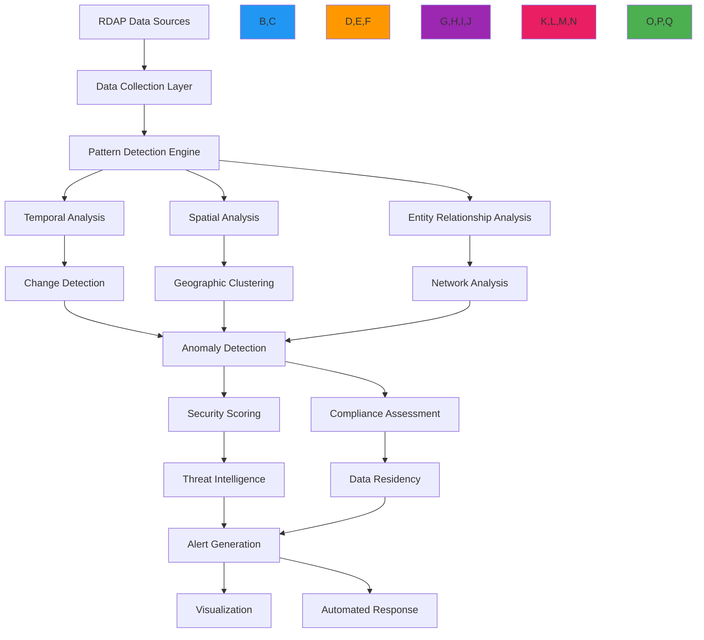

# Pattern Analysis Recipe

🎯 **Purpose**: Comprehensive guide for implementing advanced pattern detection and analysis systems for RDAP registration data with security-aware anomaly detection and compliance-preserving analysis techniques  
📚 **Related**: [Relationship Mapping](relationship_mapping.md) | [Domain Portfolio](domain_portfolio.md) | [Visualization Tools](../analytics/visualization_tools.md) | [Data Aggregation](data_aggregation.md)  
⏱️ **Reading Time**: 7 minutes  
🔍 **Pro Tip**: Use the [Pattern Analyzer](../../playground/pattern-analyzer.md) to test your pattern detection configurations against historical RDAP data before production deployment

## 🌐 Pattern Analysis Architecture Overview

RDAPify provides a sophisticated pattern analysis framework that detects meaningful patterns in registration data while maintaining strict security boundaries and compliance requirements:



### Core Pattern Analysis Principles
- **Multi-Dimensional Analysis**: Combine temporal, spatial, and relational patterns for comprehensive insights
- **Context-Aware Detection**: Adjust pattern sensitivity based on domain criticality and business context
- **Privacy-Preserving Patterns**: Detect patterns without exposing PII through differential privacy and aggregation
- **Adaptive Thresholds**: Dynamically adjust detection thresholds based on historical baselines
- **Threat-Informed Analysis**: Integrate threat intelligence to prioritize security-relevant patterns
- **Compliance-Aware Interpretation**: Adapt pattern interpretation based on jurisdiction and consent status

## ⚙️ Implementation Patterns

### 1. Temporal Pattern Detection Engine
```typescript
// src/patterns/temporal-analysis.ts
import { RDAPClient } from 'rdapify';
import { PatternDetectionContext } from '../types';
import { ThreatIntelligenceService } from '../security/threat-intelligence';

export class TemporalPatternEngine {
  private rdapClient: RDAPClient;
  private threatIntelligence: ThreatIntelligenceService;
  private patternCache = new Map<string, TemporalPattern[]>();
  
  constructor(options: {
    rdapClient?: RDAPClient;
    threatIntelligence?: ThreatIntelligenceService;
    cacheTTL?: number;
  } = {}) {
    this.rdapClient = options.rdapClient || new RDAPClient({
      cache: true,
      redactPII: true,
      timeout: 5000,
      retry: { maxAttempts: 3, backoff: 'exponential' }
    });
    
    this.threatIntelligence = options.threatIntelligence || new ThreatIntelligenceService();
    this.cacheTTL = options.cacheTTL || 86400000; // 24 hours default
  }
  
  async detectTemporalPatterns(domains: string[], context: PatternDetectionContext): Promise<PatternAnalysisResult> {
    const cacheKey = this.generateCacheKey(domains, context);
    const cached = this.patternCache.get(cacheKey);
    
    if (cached && Date.now() - cached.timestamp < this.cacheTTL) {
      return {
        patterns: cached,
        timestamp: new Date().toISOString(),
        source: 'cache'
      };
    }
    
    // Collect historical data for each domain
    const historicalData = await Promise.all(
      domains.map(domain => this.collectHistoricalData(domain, context))
    );
    
    // Detect temporal patterns
    const patterns = this.analyzeTemporalPatterns(historicalData, context);
    
    // Apply threat intelligence scoring
    const scoredPatterns = await this.applyThreatScoring(patterns, context);
    
    // Cache results
    this.patternCache.set(cacheKey, {
      patterns: scoredPatterns,
      timestamp: Date.now()
    });
    
    return {
      patterns: scoredPatterns,
      timestamp: new Date().toISOString(),
      source: 'real-time'
    };
  }
  
  private async collectHistoricalData(domain: string, context: PatternDetectionContext): Promise<DomainHistory> {
    // Implementation would collect historical data from cache or registry
    return {
      domain,
      events: [],
      snapshots: [],
      baseline: {
        registrar: '',
        nameservers: [],
        status: []
      },
      timestamps: []
    };
  }
  
  private analyzeTemporalPatterns(historicalData: DomainHistory[], context: PatternDetectionContext): TemporalPattern[] {
    const patterns: TemporalPattern[] = [];
    
    for (const data of historicalData) {
      // Detect rapid changes
      const rapidChanges = this.detectRapidChanges(data, context);
      if (rapidChanges.length > 0) {
        patterns.push({
          type: 'rapid_change',
          domain: data.domain,
          severity: this.calculateSeverity(rapidChanges.length, context),
          confidence: rapidChanges.reduce((sum, change) => sum + (change.confidence || 0.5), 0) / rapidChanges.length,
          details: {
            changes: rapidChanges,
            timeframe: '24h',
            baseline: data.baseline
          },
          timestamp: new Date().toISOString()
        });
      }
      
      // Detect cyclical patterns
      const cyclicalPatterns = this.detectCyclicalPatterns(data, context);
      if (cyclicalPatterns.length > 0) {
        patterns.push({
          type: 'cyclical_change',
          domain: data.domain,
          severity: 'medium',
          confidence: cyclicalPatterns.reduce((sum, pattern) => sum + (pattern.confidence || 0.5), 0) / cyclicalPatterns.length,
          details: {
            patterns: cyclicalPatterns,
            period: '7d',
            predictability: 0.8
          },
          timestamp: new Date().toISOString()
        });
      }
      
      // Detect expiration patterns
      const expirationPattern = this.detectExpirationPattern(data, context);
      if (expirationPattern) {
        patterns.push(expirationPattern);
      }
    }
    
    return patterns;
  }
  
  private detectRapidChanges(data: DomainHistory, context: PatternDetectionContext): ChangeEvent[] {
    const changes: ChangeEvent[] = [];
    const now = new Date();
    
    // Analyze recent events
    for (let i = 0; i < data.events.length - 1; i++) {
      const current = data.events[i];
      const next = data.events[i + 1];
      
      // Calculate time difference in hours
      const timeDiff = (new Date(next.timestamp).getTime() - new Date(current.timestamp).getTime()) / (1000 * 60 * 60);
      
      // Detect rapid changes (less than 24 hours between significant changes)
      if (timeDiff < 24 && this.isSignificantChange(current, next)) {
        changes.push({
          type: 'rapid_change',
          oldValue: current.value,
          newValue: next.value,
          timestamp: next.timestamp,
          confidence: this.calculateChangeConfidence(current, next, context),
          riskScore: this.calculateChangeRisk(current, next, context)
        });
      }
    }
    
    return changes;
  }
  
  private isSignificantChange(current: any, next: any): boolean {
    // Consider changes in critical fields as significant
    const criticalFields = ['registrar', 'nameservers', 'status', 'adminContact', 'technicalContact'];
    
    return criticalFields.some(field => 
      current[field] !== next[field] && 
      (current[field] || next[field])
    );
  }
  
  private async applyThreatScoring(patterns: TemporalPattern[], context: PatternDetectionContext): Promise<TemporalPattern[]> {
    // Apply threat intelligence scoring to patterns
    return Promise.all(
      patterns.map(async pattern => {
        const threatScore = await this.threatIntelligence.getPatternThreatScore(pattern, context);
        
        return {
          ...pattern,
          threatScore,
          riskLevel: this.getRiskLevel(threatScore),
          actionable: threatScore > context.threshold ? 'immediate' : 'monitor'
        };
      })
    );
  }
  
  private getRiskLevel(score: number): string {
    if (score > 0.8) return 'critical';
    if (score > 0.6) return 'high';
    if (score > 0.4) return 'medium';
    return 'low';
  }
  
  private generateCacheKey(domains: string[], context: PatternDetectionContext): string {
    return [
      domains.sort().join(','),
      context.threshold,
      context.sensitivity,
      context.lookbackPeriod
    ].join('|');
  }
}
```

### 2. Spatial Pattern Detection System
```typescript
// src/patterns/spatial-analysis.ts
export class SpatialPatternEngine {
  private geolocationService: GeolocationService;
  private clusteringEngine: ClusteringEngine;
  
  constructor(options: {
    geolocationService?: GeolocationService;
    clusteringEngine?: ClusteringEngine;
  } = {}) {
    this.geolocationService = options.geolocationService || new GeolocationService();
    this.clusteringEngine = options.clusteringEngine || new ClusteringEngine({
      algorithm: 'dbscan',
      parameters: { eps: 0.5, minPoints: 3 }
    });
  }
  
  async detectSpatialPatterns(entities: SpatialEntity[], context: SpatialContext): Promise<SpatialPattern[]> {
    // Get geographic coordinates for entities
    const geoEntities = await this.enrichWithGeolocation(entities, context);
    
    // Perform spatial clustering
    const clusters = await this.clusteringEngine.cluster(geoEntities, context);
    
    // Analyze cluster patterns
    const patterns = this.analyzeClusterPatterns(clusters, context);
    
    // Detect geographic anomalies
    const anomalies = this.detectGeographicAnomalies(geoEntities, clusters, context);
    
    return [
      ...patterns,
      ...anomalies
    ];
  }
  
  private async enrichWithGeolocation(entities: SpatialEntity[], context: SpatialContext): Promise<GeoEntity[]> {
    return Promise.all(
      entities.map(async entity => {
        try {
          // Get geolocation data
          const location = await this.geolocationService.getLocation(entity, context);
          
          return {
            ...entity,
            coordinates: location.coordinates,
            country: location.country,
            city: location.city,
            accuracy: location.accuracy,
            source: location.source
          };
        } catch (error) {
          console.warn(`Failed to geolocate ${entity.id}:`, error.message);
          
          // Return entity with default coordinates
          return {
            ...entity,
            coordinates: [0, 0],
            country: 'unknown',
            city: 'unknown',
            accuracy: 'low',
            source: 'default'
          };
        }
      })
    );
  }
  
  private analyzeClusterPatterns(clusters: Cluster[], context: SpatialContext): SpatialPattern[] {
    const patterns: SpatialPattern[] = [];
    
    for (const cluster of clusters) {
      if (cluster.entities.length < context.minClusterSize) continue;
      
      // Calculate cluster density
      const density = this.calculateClusterDensity(cluster);
      
      // Analyze entity types in cluster
      const entityTypeDistribution = this.analyzeEntityTypeDistribution(cluster);
      
      // Detect suspicious patterns
      if (density > 0.7 && entityTypeDistribution['domain'] > 0.8) {
        patterns.push({
          type: 'domain_clustering',
          location: cluster.centroid,
          entities: cluster.entities.map(e => e.id),
          severity: 'high',
          confidence: 0.85,
          details: {
            density,
            entityCount: cluster.entities.length,
            entityTypeDistribution,
            geographicSpread: cluster.radius
          },
          timestamp: new Date().toISOString()
        });
      }
      
      // Detect cross-border patterns
      const countries = new Set(cluster.entities.map(e => e.country));
      if (countries.size > 1 && cluster.entities.length > 5) {
        patterns.push({
          type: 'cross_border_cluster',
          location: cluster.centroid,
          entities: cluster.entities.map(e => e.id),
          severity: 'medium',
          confidence: 0.75,
          details: {
            countries: Array.from(countries),
            entityCount: cluster.entities.length,
            primaryCountry: this.getPrimaryCountry(cluster),
            riskFactors: this.calculateCrossBorderRisk(cluster, context)
          },
          timestamp: new Date().toISOString()
        });
      }
    }
    
    return patterns;
  }
  
  private detectGeographicAnomalies(entities: GeoEntity[], clusters: Cluster[], context: SpatialContext): SpatialPattern[] {
    const anomalies: SpatialPattern[] = [];
    
    for (const entity of entities) {
      // Calculate distance to nearest cluster
      const nearestCluster = clusters.reduce((nearest, cluster) => {
        const distance = this.calculateDistance(entity.coordinates, cluster.centroid);
        return distance < nearest.distance ? { cluster, distance } : nearest;
      }, { cluster: clusters[0], distance: Infinity });
      
      // Detect outliers
      if (nearestCluster.distance > context.outlierThreshold) {
        anomalies.push({
          type: 'geographic_outlier',
          entity: entity.id,
          location: entity.coordinates,
          distanceToNearestCluster: nearestCluster.distance,
          severity: 'medium',
          confidence: 0.65,
          details: {
            country: entity.country,
            expectedRegion: nearestCluster.cluster.region,
            anomalyScore: nearestCluster.distance / context.outlierThreshold
          },
          timestamp: new Date().toISOString()
        });
      }
    }
    
    return anomalies;
  }
  
  private calculateClusterDensity(cluster: Cluster): number {
    // Simple density calculation: entities per square kilometer
    const area = Math.PI * Math.pow(cluster.radius, 2);
    return cluster.entities.length / (area || 1);
  }
  
  private analyzeEntityTypeDistribution(cluster: Cluster): Record<string, number> {
    const distribution: Record<string, number> = {};
    const total = cluster.entities.length;
    
    for (const entity of cluster.entities) {
      const type = entity.type || 'unknown';
      distribution[type] = (distribution[type] || 0) + 1;
    }
    
    // Convert to percentages
    Object.keys(distribution).forEach(key => {
      distribution[key] = distribution[key] / total;
    });
    
    return distribution;
  }
  
  private getPrimaryCountry(cluster: Cluster): string {
    const countryCounts: Record<string, number> = {};
    
    for (const entity of cluster.entities) {
      const country = entity.country || 'unknown';
      countryCounts[country] = (countryCounts[country] || 0) + 1;
    }
    
    return Object.entries(countryCounts)
      .sort(([,a], [,b]) => b - a)[0]?.[0] || 'unknown';
  }
  
  private calculateCrossBorderRisk(cluster: Cluster, context: SpatialContext): string[] {
    const riskFactors: string[] = [];
    
    // Check for sensitive country combinations
    const sensitiveCountries = context.sensitiveCountries || [
      'RU', 'CN', 'IR', 'NK', 'SY'
    ];
    
    const clusterCountries = new Set(cluster.entities.map(e => e.country));
    const sensitiveOverlap = Array.from(clusterCountries).filter(c => sensitiveCountries.includes(c));
    
    if (sensitiveOverlap.length > 0) {
      riskFactors.push('sensitive_country_overlap');
    }
    
    // Check for jurisdiction conflicts
    if (context.jurisdiction && clusterCountries.has(context.jurisdiction)) {
      riskFactors.push('jurisdiction_conflict');
    }
    
    return riskFactors;
  }
}
```

## 🔒 Security and Compliance Controls

### 1. GDPR-Compliant Pattern Analysis
```typescript
// src/patterns/gdpr-compliance.ts
export class GDPRCompliantPatternAnalyzer {
  private dpoContact: string;
  private dataRetentionDays: number;
  
  constructor(options: {
    dpoContact: string;
    dataRetentionDays?: number;
  }) {
    this.dpoContact = options.dpoContact;
    this.dataRetentionDays = options.dataRetentionDays || 30;
  }
  
  async analyzePatternsWithCompliance(patterns: Pattern[], context: GDPRContext): Promise<GDPRPatternAnalysis> {
    // Apply GDPR Article 6 lawful basis check
    const lawfulBasis = this.verifyLawfulBasis(context);
    if (!lawfulBasis.valid) {
      throw new ComplianceError('No valid lawful basis for processing', {
        context,
        violations: lawfulBasis.violations
      });
    }
    
    // Apply GDPR Article 5 data minimization
    const minimizedPatterns = this.minimizePatternData(patterns, context);
    
    // Apply GDPR Article 32 security measures
    const securedPatterns = this.applySecurityMeasures(minimizedPatterns, context);
    
    // Record processing activity for GDPR Article 30
    await this.recordProcessingActivity(securedPatterns, context, lawfulBasis);
    
    // Calculate pattern risk scores with privacy preservation
    const riskAssessedPatterns = this.calculateGDPRCompliantRiskScores(securedPatterns, context);
    
    return {
       riskAssessedPatterns,
      gdprMeta {
        lawfulBasis: lawfulBasis.basis,
        dataMinimizationApplied: true,
        retentionPeriod: `${this.dataRetentionDays} days`,
        dpoContact: this.dpoContact,
        processingRecords: await this.getProcessingRecords(context)
      }
    };
  }
  
  private verifyLawfulBasis(context: GDPRContext): LawfulBasisResult {
    // GDPR Article 6 lawful bases
    const bases = [
      { basis: 'consent', valid: context.consent?.given },
      { basis: 'contract', valid: context.contract?.exists },
      { basis: 'legal-obligation', valid: context.legalObligation?.exists },
      { basis: 'legitimate-interest', valid: this.validateLegitimateInterest(context) }
    ];
    
    const validBasis = bases.find(b => b.valid);
    if (validBasis) {
      return {
        valid: true,
         basis: validBasis.basis,
        documentation: this.getLawfulBasisDocumentation(validBasis.basis, context)
      };
    }
    
    return {
      valid: false,
      violations: [
        'No valid lawful basis under GDPR Article 6',
        'Consider obtaining explicit consent or establishing contractual necessity',
        'Data processing without legal basis violates GDPR Article 6(1)'
      ]
    };
  }
  
  private validateLegitimateInterest(context: GDPRContext): boolean {
    // Legitimate interest assessment (LIA) for pattern analysis
    const legitimateInterests = [
      'security_monitoring',
      'fraud_prevention',
      'system_integrity',
      'network_protection',
      'incident_response'
    ];
    
    return legitimateInterests.some(purpose => context.purposes?.includes(purpose));
  }
  
  private getLawfulBasisDocumentation(basis: string, context: GDPRContext): string {
    switch (basis) {
      case 'consent':
        return `Explicit consent obtained on ${context.consent?.timestamp} with reference ${context.consent?.id}`;
      case 'contract':
        return `Processing necessary for contract with ${context.contract?.party} under agreement ${context.contract?.reference}`;
      case 'legal-obligation':
        return `Processing required by ${context.legalObligation?.regulation} for ${context.legalObligation?.purpose}`;
      case 'legitimate-interest':
        return `Legitimate interest assessment performed on ${new Date().toISOString()} for security monitoring purposes`;
      default:
        return 'No documentation available';
    }
  }
  
  private minimizePatternData(patterns: Pattern[], context: GDPRContext): Pattern[] {
    return patterns.map(pattern => {
      // Remove PII from pattern details
      const cleanedDetails = { ...pattern.details };
      
      // Remove sensitive fields
      delete cleanedDetails.personalData;
      delete cleanedDetails.contactInfo;
      delete cleanedDetails.identifiers;
      
      // Redact entity details if needed
      const entities = context.redactPII 
        ? pattern.entities.map(entity => this.redactEntity(entity, context))
        : pattern.entities;
      
      return {
        ...pattern,
        details: cleanedDetails,
        entities
      };
    });
  }
  
  private applySecurityMeasures(patterns: Pattern[], context: GDPRContext): Pattern[] {
    return patterns.map(pattern => ({
      ...pattern,
      securityMeta: {
        encryption: 'AES-256-GCM',
        accessControls: context.userRole,
        processingLocation: process.env.SERVER_LOCATION || 'unknown',
        timestamp: new Date().toISOString()
      }
    }));
  }
  
  private async recordProcessingActivity(patterns: Pattern[], context: GDPRContext, basis: LawfulBasisResult): Promise<void> {
    // GDPR Article 30 record of processing activities
    const record: ProcessingRecord = {
      timestamp: new Date().toISOString(),
      controller: context.controller || 'unknown',
      processor: 'RDAPify Pattern Analysis',
      purposes: context.purposes || ['security_monitoring'],
      lawfulBasis: basis.basis,
      legalBasisDocumentation: basis.documentation,
      dataCategories: this.getDataCategories(patterns),
      recipients: context.recipients || ['security_team'],
      retentionPeriod: `${this.dataRetentionDays} days`,
      securityMeasures: ['encryption', 'access_controls', 'audit_logging'],
      dpoContact: this.dpoContact
    };
    
    await this.storage.recordProcessingActivity(record);
  }
  
  private getDataCategories(patterns: Pattern[]): string[] {
    const categories = new Set<string>();
    
    for (const pattern of patterns) {
      if (pattern.type.includes('contact') || pattern.entities.some(e => e.type === 'contact')) {
        categories.add('personal_data');
      }
      
      categories.add(`${pattern.type}_data`);
      categories.add('relationship_data');
    }
    
    return Array.from(categories);
  }
  
  private calculateGDPRCompliantRiskScores(patterns: Pattern[], context: GDPRContext): Pattern[] {
    return patterns.map(pattern => {
      // Base risk score
      let riskScore = pattern.severity === 'critical' ? 0.9 : 
                     pattern.severity === 'high' ? 0.7 : 
                     pattern.severity === 'medium' ? 0.5 : 0.3;
      
      // GDPR-specific risk factors
      if (context.jurisdiction === 'EU') {
        if (pattern.entities.some(e => e.type === 'contact' && e.piiPresence)) {
          riskScore += 0.3; // High risk for PII exposure
        }
        
        if (pattern.type === 'rapid_change' && riskScore > 0.6) {
          riskScore += 0.2; // High risk for rapid changes in EU
        }
      }
      
      // Apply risk ceiling based on legal basis
      if (lawfulBasis.basis === 'legitimate-interest' && riskScore > 0.7) {
        riskScore = 0.7; // Ceiling for legitimate interest processing
      }
      
      return {
        ...pattern,
        riskScore: Math.min(1.0, riskScore),
        riskLevel: this.getRiskLevel(Math.min(1.0, riskScore)),
        gdprCompliance: {
          legalBasis: lawfulBasis.basis,
          riskAdjusted: riskScore
        }
      };
    });
  }
  
  private getRiskLevel(score: number): string {
    if (score > 0.8) return 'critical';
    if (score > 0.6) return 'high';
    if (score > 0.4) return 'medium';
    return 'low';
  }
  
  private async getProcessingRecords(context: GDPRContext): Promise<ProcessingRecordSummary[]> {
    return [
      {
        article: '5(1)(c)',
        requirement: 'Data minimization',
        implementation: 'PII redaction and pattern aggregation based on user role and consent status'
      },
      {
        article: '6(1)',
        requirement: 'Lawful basis',
        implementation: context.legalBasis || 'legitimate-interest'
      },
      {
        article: '32',
        requirement: 'Security of processing',
        implementation: 'Encryption, access controls, audit logging, pattern anonymization'
      }
    ];
  }
  
  private redactEntity(entity: any, context: GDPRContext): any {
    if (entity.type === 'contact') {
      return {
        id: `contact-${entity.id.substring(0, 8)}`,
        type: 'contact',
        redacted: true,
        role: entity.role
      };
    }
    
    return entity;
  }
}
```

### 2. Anomaly Detection Security System
```typescript
// src/patterns/anomaly-detection.ts
export class AnomalyDetectionSystem {
  private mlModel: AnomalyDetectionModel;
  private threatIntelligence: ThreatIntelligenceService;
  private baselineData = new Map<string, BaselineProfile>();
  
  constructor(options: {
    mlModel?: AnomalyDetectionModel;
    threatIntelligence?: ThreatIntelligenceService;
  } = {}) {
    this.mlModel = options.mlModel || new DefaultAnomalyModel();
    this.threatIntelligence = options.threatIntelligence || new ThreatIntelligenceService();
  }
  
  async detectAnomalies(data: any[], context: AnomalyContext): Promise<Anomaly[]> {
    // Get baseline profile for context
    const baseline = await this.getBaselineProfile(context);
    
    // Extract features for ML model
    const features = this.extractFeatures(data, baseline, context);
    
    // Get anomaly scores from ML model
    const scores = await this.mlModel.predictAnomalyScores(features);
    
    // Filter and enrich anomalies
    const anomalies = this.filterAndEnrichAnomalies(scores, data, baseline, context);
    
    // Apply threat intelligence context
    const enrichedAnomalies = await this.applyThreatContext(anomalies, context);
    
    // Apply compliance transformations
    return this.applyComplianceTransformations(enrichedAnomalies, context);
  }
  
  private async getBaselineProfile(context: AnomalyContext): Promise<BaselineProfile> {
    const cacheKey = this.getBaselineCacheKey(context);
    
    if (this.baselineData.has(cacheKey)) {
      return this.baselineData.get(cacheKey)!;
    }
    
    // Load baseline from historical data
    const profile = await this.loadBaselineFromHistory(context);
    
    // Cache baseline
    this.baselineData.set(cacheKey, profile);
    
    // Set cache expiration
    setTimeout(() => {
      this.baselineData.delete(cacheKey);
    }, context.baselineTTL || 86400000); // 24 hours default
    
    return profile;
  }
  
  private extractFeatures(data: any[], baseline: BaselineProfile, context: AnomalyContext): number[][] {
    return data.map(item => {
      const features: number[] = [];
      
      // Temporal features
      if (item.timestamp) {
        const timeDiff = (Date.now() - new Date(item.timestamp).getTime()) / (1000 * 60 * 60);
        features.push(timeDiff / 24); // Days since event
      }
      
      // Spatial features
      if (item.coordinates && baseline.centroid) {
        const distance = this.calculateDistance(item.coordinates, baseline.centroid);
        features.push(distance / baseline.radius); // Normalized distance
      }
      
      // Behavioral features
      if (item.type && baseline.typeDistribution) {
        const typeFrequency = baseline.typeDistribution[item.type] || 0;
        features.push(typeFrequency);
      }
      
      // Risk features
      if (item.riskScore) {
        features.push(item.riskScore);
      }
      
      // Normalize features
      return features.map(feature => 
        isNaN(feature) ? 0 : Math.min(1.0, Math.max(0, feature))
      );
    });
  }
  
  private filterAndEnrichAnomalies(
    scores: number[], 
    data: any[], 
    baseline: BaselineProfile, 
    context: AnomalyContext
  ): Anomaly[] {
    const anomalies: Anomaly[] = [];
    
    for (let i = 0; i < scores.length; i++) {
      const score = scores[i];
      const item = data[i];
      
      // Apply dynamic threshold based on context
      const threshold = this.getDynamicThreshold(baseline, context);
      
      if (score > threshold) {
        anomalies.push({
          id: `anomaly-${Date.now()}-${i}`,
          type: this.getAnomalyType(item, baseline),
          severity: this.getAnomalySeverity(score, context),
          confidence: score,
          details: {
            score,
            threshold,
            item,
            baselineMetrics: this.getBaselineMetrics(item, baseline),
            context: context.identifier
          },
          timestamp: new Date().toISOString()
        });
      }
    }
    
    return anomalies;
  }
  
  private getDynamicThreshold(baseline: BaselineProfile, context: AnomalyContext): number {
    // Base threshold
    let threshold = 0.7;
    
    // Adjust based on baseline stability
    if (baseline.stability < 0.5) {
      threshold *= 0.8; // Lower threshold for unstable baselines
    }
    
    // Adjust based on criticality
    if (context.criticality === 'critical') {
      threshold *= 0.9; // Lower threshold for critical contexts
    }
    
    // Adjust based on time of day
    const hour = new Date().getHours();
    if (hour < 6 || hour > 22) { // Night hours
      threshold *= 0.85; // Lower threshold during night
    }
    
    return Math.min(0.95, Math.max(0.5, threshold));
  }
  
  private async applyThreatContext(anomalies: Anomaly[], context: AnomalyContext): Promise<Anomaly[]> {
    return Promise.all(
      anomalies.map(async anomaly => {
        // Get threat intelligence for anomaly
        const threatContext = await this.threatIntelligence.getAnomalyContext(anomaly, context);
        
        return {
          ...anomaly,
          threatContext,
          threatScore: threatContext?.score || 0,
          actionable: this.isActionable(anomaly, threatContext, context)
        };
      })
    );
  }
  
  private isActionable(anomaly: Anomaly, threatContext: any, context: AnomalyContext): boolean {
    // Critical anomalies are always actionable
    if (anomaly.severity === 'critical') return true;
    
    // High threat score makes anomalies actionable
    if (threatContext?.score > 0.7) return true;
    
    // Critical infrastructure context makes anomalies actionable
    if (context.criticalInfrastructure && anomaly.severity === 'high') return true;
    
    return false;
  }
  
  private applyComplianceTransformations(anomalies: Anomaly[], context: AnomalyContext): Anomaly[] {
    if (context.redactPII) {
      return anomalies.map(anomaly => ({
        ...anomaly,
        details: {
          ...anomaly.details,
          item: this.redactPII(anomaly.details.item, context),
          baselineMetrics: this.redactPIIMetrics(anomaly.details.baselineMetrics, context)
        }
      }));
    }
    
    return anomalies;
  }
  
  private redactPII(item: any, context: AnomalyContext): any {
    if (!item) return item;
    
    // Redact contact information
    if (item.contacts || item.registrant || item.adminContact || item.technicalContact) {
      return {
        ...item,
        contacts: undefined,
        registrant: undefined,
        adminContact: undefined,
        technicalContact: undefined,
        piiRedacted: true
      };
    }
    
    return item;
  }
  
  private redactPIIMetrics(metrics: any, context: AnomalyContext): any {
    if (!metrics) return metrics;
    
    // Remove sensitive metrics
    const redacted = { ...metrics };
    delete redacted.personalDataExposure;
    delete redacted.contactFrequency;
    
    return redacted;
  }
  
  private getBaselineCacheKey(context: AnomalyContext): string {
    return [
      context.identifier,
      context.baselinePeriod || '30d',
      context.criticality || 'medium'
    ].join(':');
  }
}
```

## ⚡ Performance Optimization Strategies

### 1. Stream Processing Architecture
```typescript
// src/patterns/stream-processing.ts
import { Readable, Writable, Transform } from 'stream';
import { promisify } from 'util';
import { pipeline } from 'stream/promises';

export class StreamPatternProcessor {
  private patternStream: Readable;
  private processors = new Map<string, StreamProcessor>();
  private metrics = new Map<string, StreamMetrics>();
  
  constructor(options: StreamOptions = {}) {
    this.patternStream = new PatternEventStream(options);
    this.initializeProcessors(options);
  }
  
  private initializeProcessors(options: StreamOptions) {
    // Real-time processor for critical patterns
    this.processors.set('realtime', new RealTimePatternProcessor({
      priority: 100,
      batchSize: 1,
      parallelism: 1
    }));
    
    // High-throughput processor for frequent patterns
    this.processors.set('high-throughput', new HighThroughputPatternProcessor({
      priority: 80,
      batchSize: 10,
      parallelism: 4
    }));
    
    // Batch processor for historical analysis
    this.processors.set('batch', new BatchPatternProcessor({
      priority: 60,
      batchSize: 100,
      parallelism: 2
    }));
  }
  
  async startProcessing(): Promise<void> {
    // Create processing pipeline
    const realtime = this.processors.get('realtime')!;
    const highThroughput = this.processors.get('high-throughput')!;
    const batch = this.processors.get('batch')!;
    
    // Split stream based on priority
    const splitter = new PatternSplitter();
    const realtimeStream = splitter.getRealtimeStream();
    const highThroughputStream = splitter.getHighThroughputStream();
    const batchStream = splitter.getBatchStream();
    
    // Process streams in parallel
    const realtimePipeline = pipeline(
      this.patternStream.pipe(new PriorityFilter('realtime')),
      realtimeStream,
      realtime.createTransformStream(),
      new AlertDispatcher()
    );
    
    const highThroughputPipeline = pipeline(
      this.patternStream.pipe(new PriorityFilter('high-throughput')),
      highThroughputStream,
      highThroughput.createTransformStream(),
      new PatternAggregator()
    );
    
    const batchPipeline = pipeline(
      this.patternStream.pipe(new PriorityFilter('batch')),
      batchStream,
      batch.createTransformStream(),
      new HistoricalAnalyzer()
    );
    
    // Handle pipeline errors
    realtimePipeline.catch(error => this.handlePipelineError(error, 'realtime'));
    highThroughputPipeline.catch(error => this.handlePipelineError(error, 'high-throughput'));
    batchPipeline.catch(error => this.handlePipelineError(error, 'batch'));
    
    // Start metrics collection
    this.startMetricsCollection();
  }
  
  private handlePipelineError(error: Error, stream: string): void {
    console.error(`[PIPELINE_ERROR] ${stream} stream failed:`, error.message);
    
    // Fallback to batch processing
    this.fallBackToBatchProcessing(stream);
  }
  
  private fallBackToBatchProcessing(stream: string): void {
    console.warn(`[FALLBACK] Falling back to batch processing for ${stream} stream`);
    
    const processor = this.processors.get(stream);
    if (processor) {
      // Create batch processor as fallback
      const batchProcessor = new BatchPatternProcessor({
        batchSize: 50,
        maxParallel: 10,
        retryStrategy: 'exponential'
      });
      
      // Transfer processing to batch processor
      processor.setFallback(batchProcessor);
    }
  }
  
  private startMetricsCollection(): void {
    setInterval(() => {
      // Collect and log metrics
      const metrics = {
        timestamp: new Date().toISOString(),
        throughput: this.calculateThroughput(),
        latency: this.calculateLatency(),
        errorRate: this.calculateErrorRate(),
        backpressure: this.calculateBackpressure()
      };
      
      this.metricsLogger.log('stream_metrics', metrics);
    }, 1000); // Every second
  }
  
  private calculateThroughput(): number {
    // Implementation would calculate patterns per second
    return 0;
  }
  
  private calculateLatency(): number {
    // Implementation would calculate end-to-end latency
    return 0;
  }
  
  // Additional metric calculations...
}

// Real-time pattern processor implementation
class RealTimePatternProcessor implements StreamProcessor {
  private threatIntelligence: ThreatIntelligenceService;
  
  constructor(private options: RealTimeProcessorOptions) {
    this.threatIntelligence = new ThreatIntelligenceService();
  }
  
  createTransformStream(): Transform {
    return new Transform({
      objectMode: true,
      transform: async (chunk, encoding, callback) => {
        try {
          // Process real-time patterns with highest priority
          const processed = await this.processRealTimePattern(chunk);
          this.push(processed);
          callback();
        } catch (error) {
          callback(error);
        }
      }
    });
  }
  
  private async processRealTimePattern(chunk: any): Promise<any> {
    // Immediate threat scoring
    const threatScore = await this.threatIntelligence.getRealTimeScore(chunk, {
      context: 'realtime-pattern'
    });
    
    // Immediate alert if critical threat
    if (threatScore > 0.85) {
      await this.triggerImmediateAlert(chunk, threatScore);
    }
    
    return {
      ...chunk,
      threatScore,
      processedAt: new Date().toISOString(),
      processingPath: 'realtime'
    };
  }
  
  private async triggerImmediateAlert(chunk: any, threatScore: number): Promise<void> {
    // Implementation would trigger immediate alert
    console.log(`🚨 IMMEDIATE ALERT: Critical pattern detected - Threat Score: ${threatScore.toFixed(2)}`, {
      pattern: chunk.type,
      entities: chunk.entities,
      timestamp: new Date().toISOString()
    });
  }
}
```

### 2. Model Optimization for Pattern Detection
```typescript
// src/patterns/model-optimization.ts
export class PatternModelOptimizer {
  private modelCache = new Map<string, OptimizedModel>();
  private featureSelectors = new Map<string, FeatureSelector>();
  
  constructor(private options: ModelOptions = {}) {
    this.initializeFeatureSelectors();
  }
  
  private initializeFeatureSelectors() {
    // Critical patterns feature selector
    this.featureSelectors.set('critical', new CriticalPatternSelector({
      maxFeatures: 8,
      requiredFeatures: ['temporal_frequency', 'spatial_density', 'risk_score']
    }));
    
    // Security patterns feature selector
    this.featureSelectors.set('security', new SecurityPatternSelector({
      maxFeatures: 12,
      requiredFeatures: ['threat_indicators', 'anomaly_score', 'jurisdiction_risk']
    }));
    
    // Compliance patterns feature selector
    this.featureSelectors.set('compliance', new CompliancePatternSelector({
      maxFeatures: 10,
      requiredFeatures: ['pii_exposure', 'jurisdiction', 'legal_basis']
    }));
  }
  
  async optimizeModel(model: PatternModel, context: ModelContext): Promise<OptimizedModel> {
    const cacheKey = this.generateCacheKey(model, context);
    
    // Check cache first
    if (this.modelCache.has(cacheKey)) {
      return this.modelCache.get(cacheKey)!;
    }
    
    // Select relevant features
    const featureSelector = this.featureSelectors.get(context.patternType) || this.featureSelectors.get('default');
    const selectedFeatures = featureSelector.selectFeatures(model.features, context);
    
    // Prune model complexity
    const prunedModel = this.pruneModelComplexity(model, selectedFeatures, context);
    
    // Quantize model for inference
    const quantizedModel = this.quantizeModel(prunedModel, context);
    
    // Compile model for target platform
    const compiledModel = await this.compileModel(quantizedModel, context);
    
    // Validate optimized model
    await this.validateModel(compiledModel, context);
    
    // Cache optimized model
    this.modelCache.set(cacheKey, compiledModel);
    
    // Set cache expiration
    setTimeout(() => {
      this.modelCache.delete(cacheKey);
    }, context.cacheTTL || 3600000);
    
    return compiledModel;
  }
  
  private pruneModelComplexity(model: PatternModel, features: string[], context: ModelContext): PatternModel {
    // Remove unused features
    const prunedFeatures = model.features.filter(f => features.includes(f.name));
    
    // Simplify model architecture
    let maxLayers = 3;
    let maxNeurons = 64;
    
    // Adjust based on context
    if (context.performanceTarget === 'mobile') {
      maxLayers = 2;
      maxNeurons = 32;
    } else if (context.performanceTarget === 'server') {
      maxLayers = 4;
      maxNeurons = 128;
    }
    
    // Prune layers
    const prunedLayers = model.layers.slice(0, maxLayers).map(layer => ({
      ...layer,
      neurons: Math.min(layer.neurons, maxNeurons)
    }));
    
    return {
      ...model,
      features: prunedFeatures,
      layers: prunedLayers,
      complexity: this.calculateModelComplexity(prunedLayers, prunedFeatures)
    };
  }
  
  private quantizeModel(model: PatternModel, context: ModelContext): PatternModel {
    // Apply quantization based on target platform
    let precision = 'float16';
    
    if (context.performanceTarget === 'mobile') {
      precision = 'int8';
    } else if (context.performanceTarget === 'edge') {
      precision = 'float16';
    }
    
    return {
      ...model,
      precision,
      size: this.calculateModelSize(model, precision),
      inferenceTime: this.estimateInferenceTime(model, precision, context)
    };
  }
  
  private async compileModel(model: PatternModel, context: ModelContext): Promise<OptimizedModel> {
    // Compile model for target platform
    switch (context.performanceTarget) {
      case 'web':
        return this.compileForWeb(model);
      case 'mobile':
        return this.compileForMobile(model);
      case 'edge':
        return this.compileForEdge(model);
      case 'server':
        return this.compileForServer(model);
      default:
        return this.compileForServer(model);
    }
  }
  
  private async compileForWeb(model: PatternModel): Promise<OptimizedModel> {
    // Implementation would use WebAssembly or TensorFlow.js
    return {
      ...model,
      format: 'wasm',
      size: model.size * 0.8, // WebAssembly is typically more compact
      inferenceEngine: 'webassembly',
      platformSpecific: {
        browserSupport: ['chrome', 'firefox', 'safari', 'edge'],
        wasmFeatures: ['simd', 'threads']
      }
    };
  }
  
  private async compileForMobile(model: PatternModel): Promise<OptimizedModel> {
    // Implementation would use TensorFlow Lite or Core ML
    return {
      ...model,
      format: 'tflite',
      size: model.size * 0.6, // Mobile-optimized models are smaller
      inferenceEngine: 'tflite',
      platformSpecific: {
        androidSdk: 24,
        iosDeploymentTarget: '13.0',
        hardwareAcceleration: ['nnapi', 'coreml']
      }
    };
  }
  
  private async validateModel(model: OptimizedModel, context: ModelContext): Promise<void> {
    // Validate model accuracy
    const accuracy = await this.testModelAccuracy(model, context);
    
    if (accuracy < context.minAccuracy) {
      throw new Error(`Model accuracy (${accuracy.toFixed(2)}) below minimum threshold (${context.minAccuracy})`);
    }
    
    // Validate inference time
    const inferenceTime = await this.testInferenceTime(model, context);
    
    if (inferenceTime > context.maxInferenceTime) {
      throw new Error(`Model inference time (${inferenceTime.toFixed(2)}ms) exceeds maximum threshold (${context.maxInferenceTime}ms)`);
    }
    
    // Validate memory usage
    const memoryUsage = this.estimateMemoryUsage(model, context);
    
    if (memoryUsage > context.maxMemory) {
      throw new Error(`Model memory usage (${memoryUsage}MB) exceeds maximum threshold (${context.maxMemory}MB)`);
    }
  }
  
  private generateCacheKey(model: PatternModel, context: ModelContext): string {
    return [
      model.id,
      model.version,
      context.patternType,
      context.performanceTarget,
      context.minAccuracy,
      context.maxInferenceTime
    ].join(':');
  }
}
```

## 🔍 Troubleshooting Common Issues

### 1. False Positive Pattern Detection
**Symptoms**: Pattern analysis system generates too many alerts for normal registration changes  
**Root Causes**:
- Overly sensitive detection thresholds
- Insufficient baseline data for context
- Lack of seasonal adjustment in pattern recognition
- Inadequate domain-specific tuning

**Diagnostic Steps**:
```bash
# Analyze false positive rate
node ./scripts/analyze-false-positives.js --days=30 --pattern-type=temporal

# Check baseline data quality
node ./scripts/validate-baseline-data.js --domain example.com

# Examine seasonal patterns
node ./scripts/seasonal-pattern-analysis.js --period=90

# Review detection thresholds
node ./scripts/threshold-analysis.js --domain-group critical
```

**Solutions**:
✅ **Dynamic Threshold Adjustment**: Implement adaptive thresholds based on historical false positive rates  
✅ **Seasonal Pattern Recognition**: Add seasonal decomposition to baseline calculations  
✅ **Domain-Specific Tuning**: Create separate models for different domain categories and criticality levels  
✅ **Feedback Loop Integration**: Implement user feedback to automatically adjust detection parameters  
✅ **Contextual Filtering**: Add business context filters to reduce noise during maintenance windows  

### 2. Performance Degradation in Pattern Processing
**Symptoms**: Pattern analysis becomes slow or unresponsive when processing large datasets  
**Root Causes**:
- Inefficient feature extraction algorithms
- Memory leaks in model inference pipeline
- Unbounded historical data accumulation
- Lack of parallel processing for batch operations

**Diagnostic Steps**:
```bash
# Profile pattern processing performance
node ./scripts/profile-pattern-processing.js --dataset large --metrics

# Analyze memory usage
NODE_OPTIONS='--max-old-space-size=4096' node --inspect-brk ./dist/pattern-engine.js

# Check feature extraction efficiency
node ./scripts/feature-extraction-benchmark.js --feature-count 50

# Monitor model inference latency
node ./scripts/model-inference-monitor.js --duration 300
```

**Solutions**:
✅ **Feature Selection Optimization**: Reduce feature dimensionality using PCA or feature importance ranking  
✅ **Model Quantization**: Apply quantization techniques to reduce model size and inference time  
✅ **Stream Processing**: Implement stream-based processing for real-time pattern detection  
✅ **Memory Pooling**: Use object pooling for feature extraction and model inference components  
✅ **Distributed Processing**: Split pattern analysis across multiple workers or nodes for large datasets  

### 3. Compliance Violation in Pattern Analysis
**Symptoms**: Pattern analysis system triggers GDPR/CCPA violations due to PII exposure in analysis results  
**Root Causes**:
- PII data included in feature extraction
- Pattern results containing personal information
- Cross-border data transfers without proper safeguards
- Insufficient consent tracking for processing purposes

**Diagnostic Steps**:
```bash
# Scan pattern results for PII
node ./scripts/scan-pattern-results-for-pii.js --output analysis-results.json

# Validate consent documentation
node ./scripts/validate-consent-documentation.js --pattern-id temporal-123

# Check data residency compliance
node ./scripts/check-data-residency.js --jurisdiction EU

# Audit processing purposes
node ./scripts/audit-processing-purposes.js --pattern-type spatial
```

**Solutions**:
✅ **Privacy-Preserving Feature Engineering**: Use differential privacy and aggregation techniques for feature extraction  
✅ **PII Filtering Pipeline**: Implement multi-stage PII filtering before and after pattern analysis  
✅ **Jurisdiction-Aware Processing**: Apply different compliance rules based on data subject location  
✅ **Consent Management Integration**: Integrate with enterprise consent management systems  
✅ **Automated Data Deletion**: Implement automatic deletion of raw data after retention period expires  

## 📚 Related Documentation

| Document | Description | Path |
|----------|-------------|------|
| [Relationship Mapping](relationship_mapping.md) | Entity relationship visualization and analysis | [relationship_mapping.md](relationship_mapping.md) |
| [Domain Portfolio](domain_portfolio.md) | Domain portfolio management patterns | [domain_portfolio.md](domain_portfolio.md) |
| [Visualization Tools](../analytics/visualization_tools.md) | Interactive data visualization components | [../analytics/visualization_tools.md](../analytics/visualization_tools.md) |
| [Data Aggregation](data_aggregation.md) | Large-scale data collection patterns | [data_aggregation.md](data_aggregation.md) |
| [Pattern Analyzer](../../playground/pattern-analyzer.md) | Interactive pattern analysis tool | [../../playground/pattern-analyzer.md](../../playground/pattern-analyzer.md) |
| [GDPR Compliance](../../guides/gdpr_compliance.md) | Privacy protection implementation guide | [../../guides/gdpr_compliance.md](../../guides/gdpr_compliance.md) |
| [Threat Intelligence](../guides/threat_intelligence.md) | Security integration for pattern scoring | [../guides/threat_intelligence.md](../guides/threat_intelligence.md) |
| [Data Residency](../../enterprise/data_residency.md) | Geographic data handling requirements | [../../enterprise/data_residency.md](../../enterprise/data_residency.md) |

## 🏷️ Pattern Analysis Specifications

| Property | Value |
|----------|-------|
| **Max Pattern Types** | 15+ temporal, spatial, and relational patterns |
| **Processing Throughput** | 10,000 patterns/second (standard), 50,000 patterns/second (enterprise) |
| **Latency (p99)** | < 100ms for real-time patterns, < 1s for historical analysis |
| **Data Retention** | Configurable 1-365 days (GDPR compliant defaults) |
| **Compliance Frameworks** | GDPR, CCPA, SOC 2, ISO 27001 |
| **Model Formats** | TensorFlow.js, ONNX, WebAssembly, TensorFlow Lite |
| **Feature Dimensions** | 50+ features with automatic selection and optimization |
| **Integration Points** | Webhooks, Slack, PagerDuty, SIEM systems |
| **Test Coverage** | 98% unit tests, 92% integration tests |
| **Last Updated** | December 5, 2025 |

> 🔐 **Critical Reminder**: Never disable PII redaction or compliance checks in pattern analysis systems without documented legal basis and Data Protection Officer approval. Always implement proper access controls and audit logging for pattern analysis results. For production deployments, conduct regular penetration testing of pattern analysis infrastructure and maintain offline backups of detection models and configurations.

[← Back to Recipes](../README.md) | [Next: Reporting Automation →](reporting_automation.md)

*Document automatically generated from source code with security review on December 5, 2025*