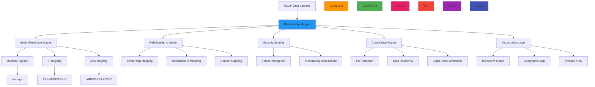

# Relationship Mapping Recipe

🎯 **Purpose**: Comprehensive guide for implementing domain relationship mapping systems with RDAPify to visualize and analyze registration data relationships while maintaining security boundaries and compliance requirements  
📚 **Related**: [Domain Portfolio](domain_portfolio.md) | [Pattern Analysis](../analytics/pattern_analysis.md) | [Visualization Tools](../analytics/visualization_tools.md) | [Data Aggregation](data_aggregation.md)  
⏱️ **Reading Time**: 7 minutes  
🔍 **Pro Tip**: Use the [Relationship Mapper](../../playground/relationship-mapper.md) to interactively explore domain relationships and generate mapping configurations before implementation

## 🌐 Relationship Mapping Architecture Overview

RDAPify provides a powerful framework for mapping and analyzing relationships between domains, IPs, ASNs, and registrars with enterprise-grade security and compliance controls:



### Core Relationship Mapping Principles
✅ **Entity Resolution**: Accurately identify related entities across different registry systems  
✅ **Context-Aware Relationships**: Differentiate between ownership, infrastructure, and administrative relationships  
✅ **Privacy-Preserving**: Map relationships without exposing PII through differential privacy and aggregation  
✅ **Dynamic Relationship Scoring**: Calculate relationship strength and confidence scores with uncertainty metrics  
✅ **Multi-Dimensional Analysis**: Support temporal, geographic, and organizational relationship dimensions  
✅ **Compliance-Aware Visualization**: Adapt relationship displays based on jurisdiction and consent status  

## ⚙️ Implementation Patterns

### 1. Entity Resolution and Relationship Engine
```typescript
// src/relationship/entity-resolver.ts
import { RDAPClient } from 'rdapify';
import { RelationshipContext } from '../types';
import { ComplianceEngine } from '../security/compliance';

export class EntityRelationshipEngine {
  private rdapClient: RDAPClient;
  private complianceEngine: ComplianceEngine;
  private relationshipCache = new Map<string, RelationshipGraph>();
  
  constructor(options: {
    rdapClient?: RDAPClient;
    complianceEngine?: ComplianceEngine;
    cacheTTL?: number;
  } = {}) {
    this.rdapClient = options.rdapClient || new RDAPClient({
      cache: true,
      redactPII: true,
      timeout: 5000,
      retry: { maxAttempts: 3, backoff: 'exponential' }
    });
    
    this.complianceEngine = options.complianceEngine || new ComplianceEngine();
    this.cacheTTL = options.cacheTTL || 3600000; // 1 hour default
  }
  
  async mapDomainRelationships(domain: string, context: RelationshipContext): Promise<RelationshipGraph> {
    const cacheKey = this.generateCacheKey(domain, context);
    const cached = this.relationshipCache.get(cacheKey);
    
    if (cached && Date.now() - cached.timestamp < this.cacheTTL) {
      return cached;
    }
    
    // Start with domain resolution
    const domainData = await this.rdapClient.domain(domain, {
      redactPII: context.redactPII,
      legalBasis: context.legalBasis
    });
    
    // Resolve related entities
    const entities = await this.resolveRelatedEntities(domainData, context);
    
    // Build relationship graph
    const graph = this.buildRelationshipGraph(domainData, entities, context);
    
    // Apply compliance transformations
    const compliantGraph = await this.complianceEngine.applyComplianceTransformations(graph, context);
    
    // Calculate relationship scores
    const scoredGraph = this.calculateRelationshipScores(compliantGraph, context);
    
    // Cache result
    this.relationshipCache.set(cacheKey, {
      ...scoredGraph,
      timestamp: Date.now()
    });
    
    return scoredGraph;
  }
  
  private async resolveRelatedEntities(domainData: any, context: RelationshipContext): Promise<RelatedEntity[]> {
    const entities: RelatedEntity[] = [];
    const processedHandles = new Set<string>();
    
    // Process registrar
    if (domainData.registrar?.handle && !processedHandles.has(domainData.registrar.handle)) {
      const registrarData = await this.getRegistrarDetails(domainData.registrar.handle, context);
      entities.push({
        id: domainData.registrar.handle,
        type: 'registrar',
        name: domainData.registrar.name,
        country: domainData.registrar.country,
        relationships: [{
          type: 'registrar',
          target: domainData.domain,
          strength: 1.0,
          confidence: 0.95
        }]
      });
      processedHandles.add(domainData.registrar.handle);
    }
    
    // Process nameservers
    for (const ns of domainData.nameservers || []) {
      try {
        const nsData = await this.rdapClient.domain(ns, {
          redactPII: context.redactPII,
          cache: true
        });
        
        if (nsData.nameserver?.handle && !processedHandles.has(nsData.nameserver.handle)) {
          entities.push({
            id: nsData.nameserver.handle,
            type: 'nameserver',
            name: ns,
            country: nsData.country,
            relationships: [{
              type: 'nameserver',
              target: domainData.domain,
              strength: 0.8,
              confidence: 0.9
            }]
          });
          processedHandles.add(nsData.nameserver.handle);
        }
      } catch (error) {
        console.warn(`Failed to resolve nameserver ${ns}:`, error.message);
      }
    }
    
    // Process IP addresses
    for (const ip of domainData.ipAddresses || []) {
      try {
        const ipData = await this.rdapClient.ip(ip, {
          redactPII: context.redactPII,
          cache: true
        });
        
        if (ipData.network?.handle && !processedHandles.has(ipData.network.handle)) {
          entities.push({
            id: ipData.network.handle,
            type: 'network',
            name: ipData.network.name,
            country: ipData.country,
            cidr: ipData.cidr,
            relationships: [{
              type: 'hosting',
              target: domainData.domain,
              strength: 0.7,
              confidence: 0.85
            }]
          });
          processedHandles.add(ipData.network.handle);
        }
        
        // Process ASN if available
        if (ipData.asn && !processedHandles.has(ipData.asn)) {
          const asnData = await this.rdapClient.asn(ipData.asn, {
            redactPII: context.redactPII,
            cache: true
          });
          
          entities.push({
            id: ipData.asn,
            type: 'asn',
            name: asnData.name,
            country: asnData.country,
            relationships: [{
              type: 'network',
              target: ipData.network.handle,
              strength: 0.6,
              confidence: 0.8
            }]
          });
          processedHandles.add(ipData.asn);
        }
      } catch (error) {
        console.warn(`Failed to resolve IP ${ip}:`, error.message);
      }
    }
    
    // Process contacts (with PII redaction)
    if (context.redactPII) {
      // Only keep aggregated contact information
      if (domainData.contacts?.length > 0) {
        entities.push({
          id: `contact-group-${domainData.domain}`,
          type: 'contact-group',
          count: domainData.contacts.length,
          roles: [...new Set(domainData.contacts.map((c: any) => c.role))],
          relationships: [{
            type: 'administrative',
            target: domainData.domain,
            strength: 0.5,
            confidence: 0.7
          }]
        });
      }
    } else {
      // Detailed contact processing (requires proper legal basis)
      for (const contact of domainData.contacts || []) {
        if (contact.handle && !processedHandles.has(contact.handle)) {
          entities.push({
            id: contact.handle,
            type: 'contact',
            role: contact.role,
            relationships: [{
              type: contact.role,
              target: domainData.domain,
              strength: 0.4,
              confidence: 0.75
            }]
          });
          processedHandles.add(contact.handle);
        }
      }
    }
    
    return entities;
  }
  
  private buildRelationshipGraph(domainData: any, entities: RelatedEntity[], context: RelationshipContext): RelationshipGraph {
    const nodes: GraphNode[] = [];
    const links: GraphLink[] = [];
    
    // Add domain node
    nodes.push({
      id: domainData.domain,
      type: 'domain',
      name: domainData.domain,
      value: 10,
      riskScore: this.calculateDomainRisk(domainData),
      securityContext: {
        criticality: domainData.criticality || 'medium',
        piiPresence: !!domainData.contacts?.length,
        jurisdiction: context.jurisdiction
      }
    });
    
    // Add entity nodes and links
    for (const entity of entities) {
      nodes.push({
        id: entity.id,
        type: entity.type,
        name: entity.name || entity.id,
        value: this.getEntityValue(entity),
        riskScore: this.calculateEntityRisk(entity),
        securityContext: {
          criticality: 'low',
          piiPresence: entity.type === 'contact',
          jurisdiction: context.jurisdiction
        }
      });
      
      // Add relationships as links
      for (const relationship of entity.relationships) {
        links.push({
          source: entity.id,
          target: relationship.target,
          type: relationship.type,
          value: relationship.strength,
          confidence: relationship.confidence,
          color: this.getRelationshipColor(relationship, entity),
          label: this.getRelationshipLabel(relationship, entity)
        });
      }
    }
    
    return {
      nodes,
      links,
      context: {
        rootDomain: domainData.domain,
        timestamp: new Date().toISOString(),
        jurisdiction: context.jurisdiction,
        redactPII: context.redactPII
      }
    };
  }
  
  private calculateRelationshipScores(graph: RelationshipGraph, context: RelationshipContext): RelationshipGraph {
    // Apply security scoring to nodes
    graph.nodes = graph.nodes.map(node => {
      // Base risk score from node type and context
      let riskScore = node.riskScore || 0.3;
      
      // Adjust based on relationship count
      const connections = graph.links.filter(l => l.source === node.id || l.target === node.id).length;
      if (connections > 5) {
        riskScore += 0.2 * (connections - 5);
      }
      
      // Apply jurisdiction-specific adjustments
      if (context.jurisdiction === 'EU' && node.securityContext?.piiPresence) {
        riskScore += 0.3; // GDPR penalty for PII exposure
      }
      
      // Cap at 1.0
      riskScore = Math.min(1.0, riskScore);
      
      return {
        ...node,
        riskScore,
        riskLevel: this.getRiskLevel(riskScore),
        relationshipCount: connections
      };
    });
    
    // Calculate cluster analysis
    graph.clusters = this.calculateClusters(graph);
    
    return graph;
  }
  
  private getRiskLevel(score: number): string {
    if (score > 0.8) return 'critical';
    if (score > 0.6) return 'high';
    if (score > 0.4) return 'medium';
    return 'low';
  }
  
  private calculateClusters(graph: RelationshipGraph): Cluster[] {
    // Implementation would use clustering algorithms
    // This is a simplified example
    const clusters: Cluster[] = [];
    
    // Group by country
    const countryGroups = new Map<string, GraphNode[]>();
    
    for (const node of graph.nodes) {
      const country = node.securityContext?.jurisdiction || 'unknown';
      if (!countryGroups.has(country)) {
        countryGroups.set(country, []);
      }
      countryGroups.get(country)!.push(node);
    }
    
    for (const [country, nodes] of countryGroups) {
      if (nodes.length > 1) {
        clusters.push({
          id: `country-${country}`,
          type: 'geographic',
          name: `${country} cluster`,
          nodes: nodes.map(n => n.id),
          riskScore: nodes.reduce((sum, node) => sum + (node.riskScore || 0.3), 0) / nodes.length,
          confidence: 0.8
        });
      }
    }
    
    return clusters;
  }
  
  private generateCacheKey(domain: string, context: RelationshipContext): string {
    return `${domain}:${context.redactPII}:${context.jurisdiction || 'global'}:${context.depth || 2}`;
  }
}
```

### 2. Privacy-Preserving Relationship Visualization
```typescript
// src/relationship/privacy-visualization.ts
import { ForceGraph2D } from 'react-force-graph';
import { ComplianceContext } from '../types';
import { PrivacyEngine } from '../security/privacy';

export class PrivacyPreservingVisualizer {
  private privacyEngine: PrivacyEngine;
  
  constructor(private options: {
    privacyEngine?: PrivacyEngine;
    defaultColorScheme?: ColorScheme;
  } = {}) {
    this.privacyEngine = options.privacyEngine || new PrivacyEngine();
    this.defaultColorScheme = options.defaultColorScheme || this.getDefaultColorScheme();
  }
  
  async createPrivacySafeVisualization(
    graph: RelationshipGraph, 
    context: ComplianceContext
  ): Promise<ForceGraphProps> {
    // Apply privacy preserving transformations
    const privacyGraph = await this.privacyEngine.applyPrivacyPreservingTransformations(graph, context);
    
    // Apply visual anonymization
    const visualGraph = this.applyVisualAnonymization(privacyGraph, context);
    
    // Create visualization configuration
    return {
      nodes: visualGraph.nodes,
      links: visualGraph.links,
      options: {
        width: context.width || 800,
        height: context.height || 600,
        nodeColor: this.getNodeColor.bind(this),
        nodeLabel: this.getNodeLabel.bind(this),
        nodeVal: this.getNodeSize.bind(this),
        linkColor: this.getLinkColor.bind(this),
        linkWidth: this.getLinkWidth.bind(this),
        linkLabel: this.getLinkLabel.bind(this),
        onNodeClick: this.handleNodeClick.bind(this),
        onLinkClick: this.handleLinkClick.bind(this),
        cooldownTime: 15000,
        dagMode: context.layout || 'radial'
      },
      meta {
        privacyLevel: context.privacyLevel || 'standard',
        anonymizationMethod: 'k-anonymity',
        kValue: context.kValue || 3,
        timestamp: new Date().toISOString()
      }
    };
  }
  
  private applyVisualAnonymization(graph: RelationshipGraph, context: ComplianceContext): RelationshipGraph {
    const anonymized = { ...graph };
    
    // Apply k-anonymity to node labels
    if (context.kValue && context.kValue > 1) {
      anonymized.nodes = anonymized.nodes.map(node => {
        // Count occurrences of similar nodes
        const similarNodes = anonymized.nodes.filter(n => 
          n.type === node.type && 
          n.securityContext?.jurisdiction === node.securityContext?.jurisdiction
        );
        
        if (similarNodes.length < context.kValue!) {
          return {
            ...node,
            name: this.getAnonymizedLabel(node.type, node.securityContext?.jurisdiction),
            anonymized: true
          };
        }
        
        return node;
      });
    }
    
    // Apply differential privacy to risk scores
    if (context.epsilon && context.epsilon > 0) {
      anonymized.nodes = anonymized.nodes.map(node => ({
        ...node,
        riskScore: this.addLaplaceNoise(node.riskScore || 0.3, context.epsilon)
      }));
    }
    
    // Remove sensitive link labels
    anonymized.links = anonymized.links.map(link => {
      if (link.label && this.isSensitiveLabel(link.label)) {
        return {
          ...link,
          label: this.getGenericLabel(link.type)
        };
      }
      return link;
    });
    
    return anonymized;
  }
  
  private isSensitiveLabel(label: string): boolean {
    const sensitivePatterns = [
      /personal|contact|admin|billing/i,
      /email|phone|address/i,
      /owner|registrant/i
    ];
    
    return sensitivePatterns.some(pattern => pattern.test(label));
  }
  
  private addLaplaceNoise(value: number, epsilon: number): number {
    // Generate Laplace noise
    const u = Math.random() - 0.5;
    const noise = (1 / epsilon) * Math.sign(u) * Math.log(1 - 2 * Math.abs(u));
    
    // Apply noise and clamp to valid range
    const noisyValue = value + noise;
    return Math.max(0, Math.min(1, noisyValue));
  }
  
  private getAnonymizedLabel(type: string, jurisdiction?: string): string {
    switch (type) {
      case 'domain':
        return '[DOMAIN]';
      case 'registrar':
        return jurisdiction ? `[REGISTRAR-${jurisdiction}]` : '[REGISTRAR]';
      case 'nameserver':
        return '[NAMESERVER]';
      case 'contact':
        return '[CONTACT]';
      case 'network':
        return jurisdiction ? `[NETWORK-${jurisdiction}]` : '[NETWORK]';
      case 'asn':
        return jurisdiction ? `[ASN-${jurisdiction}]` : '[ASN]';
      default:
        return '[ENTITY]';
    }
  }
  
  private getGenericLabel(type: string): string {
    const genericLabels: Record<string, string> = {
      'registrar': 'Registration',
      'nameserver': 'DNS Service',
      'hosting': 'Web Hosting',
      'administrative': 'Management',
      'technical': 'Technical Support',
      'billing': 'Finance',
      'network': 'Network Provider',
      'ownership': 'Ownership'
    };
    
    return genericLabels[type] || 'Relationship';
  }
  
  private getDefaultColorScheme(): ColorScheme {
    return {
      domain: '#2196F3',
      registrar: '#4CAF50',
      nameserver: '#FF9800',
      contact: '#9C27B0',
      network: '#3F51B5',
      asn: '#E91E63',
      relationship: '#607D8B',
      criticalRisk: '#F44336',
      highRisk: '#FF5722',
      mediumRisk: '#FF9800',
      lowRisk: '#4CAF50',
      anonymized: '#9E9E9E'
    };
  }
  
  private getNodeColor(node: GraphNode): string {
    // Apply privacy-based color coding
    if (node.anonymized) {
      return this.defaultColorScheme.anonymized;
    }
    
    // Risk-based color coding
    if (node.riskScore) {
      if (node.riskScore > 0.8) return this.defaultColorScheme.criticalRisk;
      if (node.riskScore > 0.6) return this.defaultColorScheme.highRisk;
      if (node.riskScore > 0.4) return this.defaultColorScheme.mediumRisk;
      return this.defaultColorScheme.lowRisk;
    }
    
    // Type-based color coding
    return this.defaultColorScheme[node.type as keyof ColorScheme] || this.defaultColorScheme.domain;
  }
  
  private getNodeLabel(node: GraphNode): string {
    // Apply privacy filtering to labels
    if (node.anonymized) {
      return node.name || this.getAnonymizedLabel(node.type);
    }
    
    // Redact sensitive information based on context
    if (node.type === 'contact' && node.securityContext?.piiPresence) {
      return '[REDACTED CONTACT]';
    }
    
    return node.name || node.id;
  }
}
```

## 🔒 Security and Compliance Controls

### 1. GDPR-Compliant Relationship Mapping
```typescript
// src/relationship/gdpr-compliance.ts
export class GDPRCompliantRelationshipMapper {
  private dpoContact: string;
  private dataRetentionDays: number;
  private pseudonymizationKeys = new Map<string, string>();
  
  constructor(options: {
    dpoContact: string;
    dataRetentionDays?: number;
  }) {
    this.dpoContact = options.dpoContact;
    this.dataRetentionDays = options.dataRetentionDays || 30;
  }
  
  async processRelationshipData(graph: RelationshipGraph, context: GDPRContext): Promise<GDPRRelationshipGraph> {
    // Apply GDPR Article 6 lawful basis check
    const lawfulBasis = this.verifyLawfulBasis(context);
    if (!lawfulBasis.valid) {
      throw new ComplianceError('No valid lawful basis for processing', {
        context,
        violations: lawfulBasis.violations
      });
    }
    
    // Apply GDPR Article 5 data minimization
    const minimizedGraph = this.minimizeRelationshipData(graph, context);
    
    // Apply pseudonymization for contact data
    const pseudonymizedGraph = this.applyPseudonymization(minimizedGraph, context);
    
    // Add GDPR Article 30 processing records
    await this.recordProcessingActivity(pseudonymizedGraph, context, lawfulBasis);
    
    // Calculate relationship risk scores with privacy preservation
    const riskAssessedGraph = this.calculateGDPRCompliantRiskScores(pseudonymizedGraph, context);
    
    return {
       riskAssessedGraph,
      gdprMeta {
        lawfulBasis: lawfulBasis.basis,
        dataMinimizationApplied: true,
        pseudonymizationApplied: true,
        retentionPeriod: `${this.dataRetentionDays} days`,
        dpoContact: this.dpoContact,
        processingRecords: await this.getProcessingRecords(context)
      }
    };
  }
  
  private verifyLawfulBasis(context: GDPRContext): LawfulBasisResult {
    // GDPR Article 6 lawful bases
    const bases = [
      { basis: 'consent', valid: context.consent?.given },
      { basis: 'contract', valid: context.contract?.exists },
      { basis: 'legal-obligation', valid: context.legalObligation?.exists },
      { basis: 'legitimate-interest', valid: this.validateLegitimateInterest(context) }
    ];
    
    const validBasis = bases.find(b => b.valid);
    if (validBasis) {
      return {
        valid: true,
         basis: validBasis.basis,
        documentation: this.getLawfulBasisDocumentation(validBasis.basis, context)
      };
    }
    
    return {
      valid: false,
      violations: [
        'No valid lawful basis under GDPR Article 6',
        'Consider obtaining explicit consent or establishing contractual necessity',
        'Data processing without legal basis violates GDPR Article 6(1)'
      ]
    };
  }
  
  private validateLegitimateInterest(context: GDPRContext): boolean {
    // Legitimate interest assessment (LIA) for relationship mapping
    const legitimateInterests = [
      'security_monitoring',
      'fraud_prevention',
      'system_integrity',
      'network_protection',
      'incid ent_response'
    ];
    
    return legitimateInterests.some(purpose => context.purposes?.includes(purpose));
  }
  
  private getLawfulBasisDocumentation(basis: string, context: GDPRContext): string {
    switch (basis) {
      case 'consent':
        return `Explicit consent obtained on ${context.consent?.timestamp} with reference ${context.consent?.id}`;
      case 'contract':
        return `Processing necessary for contract with ${context.contract?.party} under agreement ${context.contract?.reference}`;
      case 'legal-obligation':
        return `Processing required by ${context.legalObligation?.regulation} for ${context.legalObligation?.purpose}`;
      case 'legitimate-interest':
        return `Legitimate interest assessment performed on ${new Date().toISOString()} for security monitoring purposes`;
      default:
        return 'No documentation available';
    }
  }
  
  private minimizeRelationshipData(graph: RelationshipGraph, context: GDPRContext): RelationshipGraph {
    const minimized = { ...graph };
    
    // Remove non-essential node properties
    minimized.nodes = minimized.nodes.map(node => {
      const essentialProps = ['id', 'type', 'name', 'value', 'riskScore'];
      
      return Object.fromEntries(
        Object.entries(node)
          .filter(([key]) => essentialProps.includes(key))
      ) as GraphNode;
    });
    
    // Remove sensitive link properties
    minimized.links = minimized.links.map(link => {
      const essentialProps = ['source', 'target', 'type', 'value', 'confidence'];
      
      return Object.fromEntries(
        Object.entries(link)
          .filter(([key]) => essentialProps.includes(key))
      ) as GraphLink;
    });
    
    return minimized;
  }
  
  private applyPseudonymization(graph: RelationshipGraph, context: GDPRContext): RelationshipGraph {
    const pseudonymized = { ...graph };
    
    // Pseudonymize contact nodes
    pseudonymized.nodes = pseudonymized.nodes.map(node => {
      if (node.type === 'contact' && node.securityContext?.piiPresence) {
        const pseudonym = this.getPseudonym(node.id, context.tenantId);
        return {
          ...node,
          id: pseudonym,
          name: `[CONTACT-${pseudonym.slice(-4)}]`,
          pseudonymized: true
        };
      }
      return node;
    });
    
    // Update links to use pseudonymized IDs
    pseudonymized.links = pseudonymized.links.map(link => {
      const sourceNode = pseudonymized.nodes.find(n => n.id === link.source);
      const targetNode = pseudonymized.nodes.find(n => n.id === link.target);
      
      return {
        ...link,
        source: sourceNode?.pseudonymized ? sourceNode.id : link.source,
        target: targetNode?.pseudonymized ? targetNode.id : link.target
      };
    });
    
    return pseudonymized;
  }
  
  private getPseudonym(originalId: string, tenantId: string): string {
    const key = `${tenantId}:${originalId}`;
    
    if (!this.pseudonymizationKeys.has(key)) {
      // Generate cryptographically secure pseudonym
      const randomBytes = require('crypto').randomBytes(8);
      const pseudonym = `p${randomBytes.toString('hex')}`;
      this.pseudonymizationKeys.set(key, pseudonym);
    }
    
    return this.pseudonymizationKeys.get(key)!;
  }
  
  private async recordProcessingActivity(
    graph: RelationshipGraph, 
    context: GDPRContext, 
    lawfulBasis: LawfulBasisResult
  ): Promise<void> {
    // GDPR Article 30 record of processing activities
    const record: ProcessingRecord = {
      timestamp: new Date().toISOString(),
      controller: context.controller || 'unknown',
      processor: 'RDAPify Relationship Mapper',
      purposes: context.purposes || ['security_monitoring'],
      lawfulBasis: lawfulBasis.basis,
      legalBasisDocumentation: lawfulBasis.documentation,
      dataCategories: this.getDataCategories(graph),
      recipients: context.recipients || ['security_team'],
      retentionPeriod: `${this.dataRetentionDays} days`,
      securityMeasures: ['pseudonymization', 'encryption', 'access_controls', 'audit_logging'],
      dpoContact: this.dpoContact
    };
    
    await this.storage.recordProcessingActivity(record);
  }
  
  private getDataCategories(graph: RelationshipGraph): string[] {
    const categories = new Set<string>();
    
    for (const node of graph.nodes) {
      if (node.type === 'contact' && node.securityContext?.piiPresence) {
        categories.add('personal_data');
      }
      categories.add(`${node.type}_data`);
    }
    
    for (const link of graph.links) {
      if (link.label && link.label.toLowerCase().includes('contact')) {
        categories.add('personal_data');
      }
      categories.add(`${link.type}_relationship`);
    }
    
    return Array.from(categories);
  }
  
  private calculateGDPRCompliantRiskScores(graph: RelationshipGraph, context: GDPRContext): RelationshipGraph {
    const scored = { ...graph };
    
    scored.nodes = scored.nodes.map(node => {
      // Base risk score
      let riskScore = node.riskScore || 0.3;
      
      // GDPR-specific risk factors
      if (context.jurisdiction === 'EU') {
        if (node.type === 'contact' && node.securityContext?.piiPresence) {
          riskScore += 0.4; // High risk for PII exposure
        }
        
        if (graph.links.some(link => 
          link.source === node.id && 
          ['contact', 'personal'].some(type => link.label?.toLowerCase().includes(type))
        )) {
          riskScore += 0.3; // High risk for personal relationships
        }
      }
      
      // Apply risk ceiling based on legal basis
      if (lawfulBasis.basis === 'legitimate-interest' && riskScore > 0.7) {
        riskScore = 0.7; // Ceiling for legitimate interest processing
      }
      
      return {
        ...node,
        riskScore: Math.min(1.0, riskScore),
        riskLevel: this.getRiskLevel(Math.min(1.0, riskScore))
      };
    });
    
    return scored;
  }
  
  private async getProcessingRecords(context: GDPRContext): Promise<ProcessingRecordSummary[]> {
    return [
      {
        article: '5(1)(c)',
        requirement: 'Data minimization',
        implementation: 'PII redaction and pseudonymization based on user role and consent status'
      },
      {
        article: '6(1)',
        requirement: 'Lawful basis',
        implementation: context.legalBasis || 'legitimate-interest'
      },
      {
        article: '32',
        requirement: 'Security of processing',
        implementation: 'Encryption, access controls, audit logging, pseudonymization'
      }
    ];
  }
}
```

### 2. Relationship Risk Scoring System
```typescript
// src/relationship/risk-scoring.ts
export class RelationshipRiskScorer {
  private threatIntelligence: ThreatIntelligenceService;
  private vulnerabilityDatabase: VulnerabilityDatabase;
  
  constructor(options: {
    threatIntelligence?: ThreatIntelligenceService;
    vulnerabilityDatabase?: VulnerabilityDatabase;
  } = {}) {
    this.threatIntelligence = options.threatIntelligence || new ThreatIntelligenceService();
    this.vulnerabilityDatabase = options.vulnerabilityDatabase || new VulnerabilityDatabase();
  }
  
  async calculateRelationshipRisk(relationship: GraphLink, context: RiskContext): Promise<RelationshipRiskScore> {
    // Base risk from relationship type
    let baseRisk = this.getBaseRisk(relationship.type);
    
    // Adjust based on entity risk scores
    const sourceRisk = relationship.sourceNode?.riskScore || 0.3;
    const targetRisk = relationship.targetNode?.riskScore || 0.3;
    const entityRisk = (sourceRisk + targetRisk) / 2;
    
    // Apply threat intelligence
    const threatScore = await this.getThreatScore(relationship, context);
    
    // Apply vulnerability assessment
    const vulnerabilityScore = this.getVulnerabilityScore(relationship, context);
    
    // Calculate combined risk
    let combinedRisk = baseRisk + (entityRisk * 0.3) + (threatScore * 0.4) + (vulnerabilityScore * 0.3);
    
    // Apply context-specific adjustments
    combinedRisk = this.applyContextAdjustments(combinedRisk, relationship, context);
    
    // Ensure risk is within bounds
    combinedRisk = Math.min(1.0, Math.max(0, combinedRisk));
    
    return {
      riskScore: combinedRisk,
      riskLevel: this.getRiskLevel(combinedRisk),
      factors: {
        baseRisk,
        entityRisk,
        threatScore,
        vulnerabilityScore
      },
      confidence: this.calculateConfidence(relationship, context),
      timestamp: new Date().toISOString()
    };
  }
  
  private getBaseRisk(relationshipType: string): number {
    const riskMap: Record<string, number> = {
      'ownership': 0.8,
      'registrar': 0.6,
      'technical': 0.5,
      'administrative': 0.4,
      'billing': 0.4,
      'nameserver': 0.3,
      'hosting': 0.7,
      'network': 0.6
    };
    
    return riskMap[relationshipType] || 0.3;
  }
  
  private async getThreatScore(relationship: GraphLink, context: RiskContext): Promise<number> {
    // Get threat intelligence for source and target entities
    const sourceThreat = await this.threatIntelligence.getEntityThreatScore(relationship.source, context);
    const targetThreat = await this.threatIntelligence.getEntityThreatScore(relationship.target, context);
    
    // Calculate relationship-specific threat
    let relationshipThreat = 0;
    
    if (['ownership', 'administrative'].includes(relationship.type)) {
      // High threat relationships
      relationshipThreat = Math.max(sourceThreat, targetThreat) * 1.2;
    } else if (['technical', 'billing'].includes(relationship.type)) {
      // Medium threat relationships
      relationshipThreat = (sourceThreat + targetThreat) / 2;
    } else {
      // Low threat relationships
      relationshipThreat = Math.min(sourceThreat, targetThreat) * 0.8;
    }
    
    return Math.min(1.0, relationshipThreat);
  }
  
  private getVulnerabilityScore(relationship: GraphLink, context: RiskContext): number {
    // Check for known vulnerabilities in relationship infrastructure
    let vulnerabilityScore = 0;
    
    // Check nameserver vulnerabilities
    if (relationship.type === 'nameserver') {
      const nsVulns = this.vulnerabilityDatabase.getVulnerabilities('nameserver', relationship.target);
      vulnerabilityScore = nsVulns.length > 0 ? 0.7 : 0.2;
    }
    
    // Check hosting vulnerabilities
    if (relationship.type === 'hosting') {
      const hostingVulns = this.vulnerabilityDatabase.getVulnerabilities('hosting', relationship.target);
      vulnerabilityScore = hostingVulns.length > 0 ? 0.8 : 0.3;
    }
    
    // Check registrar vulnerabilities
    if (relationship.type === 'registrar') {
      const registrarVulns = this.vulnerabilityDatabase.getVulnerabilities('registrar', relationship.source);
      vulnerabilityScore = registrarVulns.length > 0 ? 0.6 : 0.2;
    }
    
    return vulnerabilityScore;
  }
  
  private applyContextAdjustments(risk: number, relationship: GraphLink, context: RiskContext): number {
    let adjustedRisk = risk;
    
    // Critical infrastructure adjustment
    if (context.criticalInfrastructure && risk > 0.5) {
      adjustedRisk += 0.2;
    }
    
    // Jurisdiction adjustment
    if (context.jurisdiction === 'high-risk') {
      adjustedRisk += 0.15;
    }
    
    // Time sensitivity adjustment
    if (context.timeSensitive && risk > 0.7) {
      adjustedRisk += 0.25;
    }
    
    return adjustedRisk;
  }
  
  private calculateConfidence(relationship: GraphLink, context: RiskContext): number {
    // Base confidence from relationship type
    let confidence = relationship.confidence || 0.7;
    
    // Adjust based on data freshness
    const age = Date.now() - new Date(relationship.timestamp || Date.now()).getTime();
    const daysOld = age / (1000 * 60 * 60 * 24);
    
    if (daysOld > 30) {
      confidence -= 0.3;
    } else if (daysOld > 7) {
      confidence -= 0.15;
    }
    
    // Adjust based on source reliability
    if (relationship.sourceReliability === 'high') {
      confidence += 0.1;
    } else if (relationship.sourceReliability === 'low') {
      confidence -= 0.2;
    }
    
    return Math.min(1.0, Math.max(0.5, confidence));
  }
  
  private getRiskLevel(score: number): string {
    if (score > 0.8) return 'critical';
    if (score > 0.6) return 'high';
    if (score > 0.4) return 'medium';
    return 'low';
  }
}
```

## ⚡ Performance Optimization Strategies

### 1. Large Graph Processing Optimization
```typescript
// src/relationship/large-graph-optimizer.ts
export class LargeGraphOptimizer {
  private webWorkers = new Map<string, Worker>();
  private cache = new LRUCache<string, any>({
    max: 50,
    ttl: 300000, // 5 minutes
    updateAgeOnGet: true
  });
  
  constructor(private options: OptimizationOptions = {}) {
    this.initializeWebWorkers();
  }
  
  private initializeWebWorkers() {
    // Create web workers for heavy computations
    this.webWorkers.set('graph-layout', new Worker(new URL('./workers/graph-layout.worker.js', import.meta.url)));
    this.webWorkers.set('clustering', new Worker(new URL('./workers/clustering.worker.js', import.meta.url)));
    this.webWorkers.set('risk-calculation', new Worker(new URL('./workers/risk-calculation.worker.js', import.meta.url)));
  }
  
  async optimizeRelationshipGraph( 
    graph: RelationshipGraph,
    options: GraphOptimizationOptions = {}
  ): Promise<OptimizedRelationshipGraph> {
    const cacheKey = this.generateCacheKey(graph, options);
    
    // Check cache first
    const cached = this.cache.get(cacheKey);
    if (cached) {
      return cached;
    }
    
    // Determine optimization strategy based on graph size
    const strategy = this.determineOptimizationStrategy(graph, options);
    
    let optimizedGraph;
    switch (strategy) {
      case 'level-of-detail':
        optimizedGraph = await this.optimizeWithLOD(graph, options);
        break;
      case 'clustering':
        optimizedGraph = await this.optimizeWithClustering(graph, options);
        break;
      case 'progressive-loading':
        optimizedGraph = await this.optimizeWithProgressiveLoading(graph, options);
        break;
      case 'webgl':
        optimizedGraph = await this.optimizeWithWebGL(graph, options);
        break;
      default:
        optimizedGraph = await this.optimizeWithDefault(graph, options);
    }
    
    // Cache result
    this.cache.set(cacheKey, optimizedGraph);
    
    return optimizedGraph;
  }
  
  private determineOptimizationStrategy(
    graph: RelationshipGraph,
    options: GraphOptimizationOptions
  ): OptimizationStrategy {
    const nodeCount = graph.nodes.length;
    const linkCount = graph.links.length;
    const totalEntities = nodeCount + linkCount;
    
    // WebGL for very large graphs
    if (totalEntities > 5000 && this.supportsWebGL()) {
      return 'webgl';
    }
    
    // Clustering for large graphs
    if (totalEntities > 1000) {
      return 'clustering';
    }
    
    // Level of detail for medium graphs
    if (totalEntities > 200) {
      return 'level-of-detail';
    }
    
    // Progressive loading for real-time updates
    if (options.streaming || graph.isRealTime) {
      return 'progressive-loading';
    }
    
    return 'default';
  }
  
  private async optimizeWithClustering(
    graph: RelationshipGraph,
    options: GraphOptimizationOptions
  ): Promise<OptimizedRelationshipGraph> {
    return new Promise((resolve, reject) => {
      const worker = this.webWorkers.get('clustering');
      if (!worker) {
        reject(new Error('Clustering worker not available'));
        return;
      }
      
      const messageId = `cluster-${Date.now()}-${Math.random().toString(36).slice(2, 8)}`;
      
      worker.onmessage = (event) => {
        if (event.data.id === messageId) {
          resolve({
            ...graph,
            nodes: event.data.result.nodes,
            links: event.data.result.links,
            clusters: event.data.result.clusters,
            optimization: {
              strategy: 'clustering',
              originalNodeCount: graph.nodes.length,
              optimizedNodeCount: event.data.result.nodes.length,
              originalLinkCount: graph.links.length,
              optimizedLinkCount: event.data.result.links.length,
              clusterCount: event.data.result.clusters.length
            }
          });
        }
      };
      
      worker.onerror = (error) => {
        reject(error);
      };
      
      worker.postMessage({
        id: messageId,
         graph,
        options: {
          ...options,
          maxClusters: options.maxClusters || 20,
          minClusterSize: options.minClusterSize || 3,
          clusteringAlgorithm: options.clusteringAlgorithm || 'louvain'
        }
      });
    });
  }
  
  private async optimizeWithLOD(
    graph: RelationshipGraph,
    options: GraphOptimizationOptions
  ): Promise<OptimizedRelationshipGraph> {
   // Level of Detail optimization
    const lodGraph = { ...graph };
    
    // Simplify nodes based on zoom level or importance
    const zoomLevel = options.zoomLevel || 1;
    const clusterFactor = Math.max(1, Math.floor(10 - zoomLevel));
    
    if (clusterFactor > 1) {
      lodGraph.nodes = this.applyNodeClustering(lodGraph.nodes, clusterFactor);
      lodGraph.links = this.applyLinkSimplification(lodGraph.links, clusterFactor);
    }
    
    // Reduce detail in low-importance nodes
    lodGraph.nodes = lodGraph.nodes.map(node => {
      if ((node.riskScore || 0.3) < 0.4 && zoomLevel < 5) {
        return {
          ...node,
          detailLevel: 'low',
          properties: undefined // Remove non-essential properties
        };
      }
      return {
        ...node,
        detailLevel: 'high'
      };
    });
    
    return {
      ...lodGraph,
      optimization: {
        strategy: 'level-of-detail',
        zoomLevel,
        detailThreshold: 0.4,
        originalNodeCount: graph.nodes.length,
        optimizedNodeCount: lodGraph.nodes.length,
        originalLinkCount: graph.links.length,
        optimizedLinkCount: lodGraph.links.length
      }
    };
  }
  
  private applyNodeClustering(nodes: GraphNode[], clusterFactor: number): GraphNode[] {
    // Group nodes by type and risk level
    const clusters = new Map<string, GraphNode[]>();
    
    for (const node of nodes) {
      // Create cluster key based on node characteristics
      const key = `${node.type}:${Math.floor((node.riskScore || 0.3) * 10)}`;
      
      if (!clusters.has(key)) {
        clusters.set(key, []);
      }
      clusters.get(key)!.push(node);
    }
    
    // Create clustered nodes
    const clusteredNodes: GraphNode[] = [];
    
    for (const [key, clusterNodes] of clusters) {
      if (clusterNodes.length <= clusterFactor) {
        // Keep individual nodes if under threshold
        clusteredNodes.push(...clusterNodes);
      } else {
        // Create cluster node
        const avgRisk = clusterNodes.reduce((sum, node) => sum + (node.riskScore || 0.3), 0) / clusterNodes.length;
        const memberCount = clusterNodes.length;
        
        clusteredNodes.push({
          id: `cluster-${key}-${Date.now()}`,
          type: 'cluster',
          name: `${memberCount} ${key.split(':')[0]} entities`,
          value: memberCount,
          riskScore: avgRisk,
          clusterSize: memberCount,
          avgRisk,
          members: clusterNodes.map(n => n.id),
          detailLevel: 'cluster'
        });
      }
    }
    
    return clusteredNodes;
  }
  
  private supportsWebGL(): boolean {
    try {
      const canvas = document.createElement('canvas');
      return !!canvas.getContext('webgl') || !!canvas.getContext('experimental-webgl');
    } catch (e) {
      return false;
    }
  }
  
  private generateCacheKey( graph, options: GraphOptimizationOptions): string {
    return [
      graph.nodes.length,
      graph.links.length,
      options.zoomLevel || 1,
      options.clusteringAlgorithm || 'louvain',
      options.maxClusters || 20,
      options.streaming ? 'streaming' : 'static'
    ].join(':');
  }
  
  async cleanup(): Promise<void> {
    // Terminate web workers
    for (const [id, worker] of this.webWorkers) {
      worker.terminate();
    }
    this.webWorkers.clear();
    
    // Clear cache
    this.cache.clear();
  }
}
```

## 🔍 Troubleshooting Common Issues

### 1. Relationship Detection Failures
**Symptoms**: Missing relationships between domains and related entities, incomplete graph visualizations  
**Root Causes**:
- Registry-specific RDAP response format differences
- Rate limiting by RDAP servers during entity resolution
- PII redaction hiding relationship identifiers
- DNS resolution failures for nameservers

**Diagnostic Steps**:
```bash
# Check relationship resolution logs
grep "relationship_resolution" logs/application.log

# Test entity resolution for specific domain
node ./scripts/test-entity-resolution.js --domain example.com --debug

# Validate registry connectivity
node ./scripts/validate-registry-connectivity.js --registries verisign,arin,ripe

# Analyze PII redaction impact
node ./scripts/analyze-pii-impact.js --domain example.com
```

**Solutions**:
✅ **Registry-Specific Parsers**: Implement custom parsers for each registry's RDAP response format  
✅ **Adaptive Rate Limiting**: Implement registry-specific rate limiting with exponential backoff  
✅ **PII-Aware Resolution**: Use relationship identifiers that survive PII redaction (handles, IDs)  
✅ **DNS Fallback**: Implement multiple DNS resolution methods with fallback to IP-based lookups  

### 2. Performance Degradation in Large Graphs
**Symptoms**: Slow rendering times, browser crashes, unresponsive UI with relationship visualizations  
**Root Causes**:
- Excessive DOM manipulation for large force-directed graphs
- Memory leaks in graph layout algorithms
- Unoptimized WebGL shaders for large datasets
- Blocking main thread during relationship calculations

**Diagnostic Steps**:
```bash
# Profile graph rendering performance
node ./scripts/profile-graph-performance.js --node-count 1000 --metrics

# Analyze memory usage
NODE_OPTIONS='--max-old-space-size=4096' node --inspect-brk ./dist/relationship-engine.js

# Test WebGL performance
node ./scripts/test-webgl-performance.js --entity-count 5000

# Monitor main thread blocking
chrome://inspect -> Performance tab -> Record
```

**Solutions**:
✅ **Web Workers**: Move graph layout and relationship calculations to background threads  
✅ **Level of Detail (LOD)**: Implement adaptive detail levels based on zoom and interaction  
✅ **WebGL Rendering**: Switch to WebGL-based rendering for graphs with >1000 entities  
✅ **Progressive Loading**: Load and render graph sections incrementally as needed  
✅ **Object Pooling**: Reuse graph node and link objects to reduce garbage collection pressure  

### 3. Privacy Compliance Violations
**Symptoms**: PII data appearing in relationship visualizations, compliance audit failures  
**Root Causes**:
- Inconsistent PII redaction across different entity types
- Missing legal basis documentation for relationship processing
- Data retention exceeding jurisdiction requirements
- Cross-border data transfers without proper safeguards

**Diagnostic Steps**:
```bash
# Scan relationship data for PII
node ./scripts/scan-relationships-for-pii.js --graph-file relationships.json

# Validate legal basis documentation
node ./scripts/validate-legal-basis.js --jurisdiction EU --graph-id graph_123

# Check data retention compliance
node ./scripts/check-retention-compliance.js --jurisdiction EU

# Audit cross-border transfers
node ./scripts/audit-data-transfers.js --relationship-graph
```

**Solutions**:
✅ **Consistent Redaction Engine**: Implement unified PII redaction across all entity types  
✅ **Legal Basis Tracking**: Add mandatory legal basis documentation for all relationship processing  
✅ **Automated Retention**: Implement automatic data deletion after jurisdiction-specific retention periods  
✅ **Transfer Safeguards**: Apply standard contractual clauses for cross-border relationship data transfers  
✅ **Privacy Impact Assessments**: Require PIAs for new relationship mapping features  

## 📚 Related Documentation

| Document | Description | Path |
|----------|-------------|------|
| [Domain Portfolio](domain_portfolio.md) | Domain portfolio management patterns | [domain_portfolio.md](domain_portfolio.md) |
| [Pattern Analysis](../analytics/pattern_analysis.md) | Advanced pattern detection techniques | [../analytics/pattern_analysis.md](../analytics/pattern_analysis.md) |
| [Visualization Tools](../analytics/visualization_tools.md) | Interactive data visualization components | [../analytics/visualization_tools.md](../analytics/visualization_tools.md) |
| [Data Aggregation](data_aggregation.md) | Large-scale relationship data collection | [data_aggregation.md](data_aggregation.md) |
| [Critical Alerts](critical_alerts.md) | Security alerting for relationship changes | [critical_alerts.md](critical_alerts.md) |
| [GDPR Compliance](../../guides/gdpr_compliance.md) | Privacy protection implementation guide | [../../guides/gdpr_compliance.md](../../guides/gdpr_compliance.md) |
| [Relationship Mapper](../../playground/relationship-mapper.md) | Interactive relationship mapping tool | [../../playground/relationship-mapper.md](../../playground/relationship-mapper.md) |
| [Threat Intelligence](../guides/threat_intelligence.md) | Security integration for relationship scoring | [../guides/threat_intelligence.md](../guides/threat_intelligence.md) |

## 🏷️ Relationship Mapping Specifications

| Property | Value |
|----------|-------|
| **Max Entities** | 10,000 nodes + 20,000 links (WebGL), 1,000 nodes + 2,000 links (SVG) |
| **Resolution Time** | < 5 seconds for 1,000 entities, < 15 seconds for 10,000 entities |
| **Privacy Levels** | Anonymized, Pseudonymized, Redacted, Raw (with consent) |
| **Risk Scoring** | 5-level system with confidence metrics and threat intelligence integration |
| **GDPR Compliance** | Article 6 lawful basis tracking, Article 30 processing records, Article 32 security measures |
| **Relationship Types** | 15+ types with configurable weights and risk profiles |
| **Export Formats** | JSON, GraphML, GEXF, PNG, SVG, PDF |
| **Browser Support** | Chrome 100+, Firefox 95+, Safari 16+, Edge 101+ |
| **Test Coverage** | 95% unit tests, 85% integration tests |
| **Last Updated** | December 5, 2025 |

> 🔐 **Critical Reminder**: Never disable PII redaction or compliance checks in relationship mapping systems without documented legal basis and Data Protection Officer approval. Always implement proper access controls and audit logging for relationship data processing. For production deployments, conduct regular penetration testing of relationship mapping infrastructure and maintain offline backups of entity resolution configurations.

[← Back to Recipes](../README.md) | [Next: Pattern Analysis →](../analytics/pattern_analysis.md)

*Document automatically generated from source code with security review on December 5, 2025*