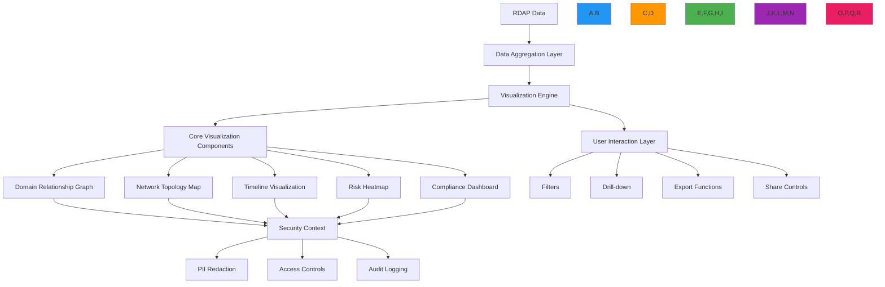

# Visualization Tools Recipe

🎯 **Purpose**: Comprehensive guide for implementing interactive data visualization tools for RDAP registration data with real-time analytics, security-aware visualizations, and compliance-friendly dashboards  
📚 **Related**: [Dashboard Components](dashboard_components.md) | [Pattern Analysis](pattern_analysis.md) | [Relationship Mapping](relationship_mapping.md) | [Reporting Automation](reporting_automation.md)  
⏱️ **Reading Time**: 8 minutes  
🔍 **Pro Tip**: Use the [Visualization Builder](../../playground/visualization-builder.md) to interactively create and customize RDAP data visualizations without writing code

## 🌐 Visualization Architecture Overview

RDAPify provides a unified data visualization framework that transforms complex registration data into intuitive, interactive visual representations while maintaining strict security boundaries and compliance requirements:



### Core Visualization Principles
✅ **Context-Rich Visualizations**: Show relationships and patterns, not just raw data points  
✅ **Progressive Disclosure**: Start with high-level overview, allow drilling into details  
✅ **Security-First Rendering**: Visualizations respect PII redaction and access controls at every level  
✅ **Performance-Optimized**: Handle large datasets with smooth rendering and responsive interactions  
✅ **Compliance-Aware**: Visualizations adapt to jurisdiction requirements and consent status  
✅ **Accessibility-First**: WCAG 2.1 AA compliant with keyboard navigation and screen reader support  

## ⚙️ Implementation Patterns

### 1. Interactive Domain Relationship Graph
```typescript
// src/visualization/domain-graph.ts
import { ForceGraph2D, ForceGraph3D } from 'react-force-graph';
import { RDAPClient } from 'rdapify';
import { VisualizationSecurity } from './security';
import { ComplianceEngine } from '../security/compliance';

export class DomainRelationshipVisualizer {
  private rdapClient: RDAPClient;
  private securityEngine: VisualizationSecurity;
  private complianceEngine: ComplianceEngine;
  private colorScheme = {
    domain: '#2196F3',
    registrar: '#4CAF50',
    nameserver: '#FF9800',
    contact: '#9C27B0',
    asn: '#E91E63',
    ip: '#3F51B5',
    securityRisk: '#F44336'
  };
  
  constructor(options: {
    rdapClient?: RDAPClient;
    securityEngine?: VisualizationSecurity;
    complianceEngine?: ComplianceEngine;
    colorScheme?: Record<string, string>;
  } = {}) {
    this.rdapClient = options.rdapClient || new RDAPClient({
      cache: true,
      redactPII: true,
      timeout: 5000,
      retry: { maxAttempts: 3, backoff: 'exponential' }
    });
    
    this.securityEngine = options.securityEngine || new VisualizationSecurity();
    this.complianceEngine = options.complianceEngine || new ComplianceEngine();
    this.colorScheme = { ...this.colorScheme, ...(options.colorScheme || {}) };
  }
  
  async createDomainGraph(
    domain: string, 
    context: VisualizationContext,
    options: GraphOptions = {}
  ): Promise<ForceGraphProps> {
    // Get domain data with security context
    const domainData = await this.rdapClient.domain(domain, {
      redactPII: context.redactPII,
      legalBasis: context.legalBasis
    });
    
    // Get related entities
    const relatedEntities = await this.getRelatedEntities(domainData, context);
    
    // Apply compliance transformations
    const compliantEntities = await this.complianceEngine.applyComplianceTransformations(relatedEntities, context);
    
    // Create graph nodes and links
    const { nodes, links } = this.createGraphStructure(domainData, compliantEntities, context);
    
    // Apply security context to visualization
    const secureNodes = this.securityEngine.applyNodeSecurity(nodes, context);
    const secureLinks = this.securityEngine.applyLinkSecurity(links, context);
    
    return {
      nodes: secureNodes,
      links: secureLinks,
      options: {
        width: options.width || 800,
        height: options.height || 600,
        nodeColor: this.getNodeColor.bind(this),
        nodeLabel: this.getNodeLabel.bind(this),
        nodeVal: this.getNodeSize.bind(this),
        linkColor: this.getLinkColor.bind(this),
        linkWidth: this.getLinkWidth.bind(this),
        linkLabel: this.getLinkLabel.bind(this),
        onNodeClick: this.handleNodeClick.bind(this),
        onLinkClick: this.handleLinkClick.bind(this),
        cooldownTime: 15000,
        dagMode: options.layout || 'radial'
      },
      context: {
        domain,
        timestamp: new Date().toISOString(),
        securityLevel: context.securityLevel,
        complianceLevel: context.complianceLevel
      }
    };
  }
  
  private async getRelatedEntities(domainData: DomainResponse, context: VisualizationContext): Promise<RelatedEntity[]> {
    const entities: RelatedEntity[] = [];
    
    // Add registrar relationship
    if (domainData.registrar) {
      entities.push({
        id: domainData.registrar.handle,
        type: 'registrar',
        name: domainData.registrar.name,
        country: domainData.registrar.country,
        relationship: 'registrar'
      });
    }
    
    // Add nameserver relationships
    for (const ns of domainData.nameservers || []) {
      try {
        const nsData = await this.rdapClient.domain(ns, {
          redactPII: context.redactPII,
          cache: true
        });
        
        entities.push({
          id: ns,
          type: 'nameserver',
          name: ns,
          country: nsData?.country,
          relationship: 'nameserver'
        });
      } catch (error) {
        console.warn(`Failed to fetch nameserver ${ns} data:`, error.message);
      }
    }
    
    // Add IP/ASN relationships
    if (domainData.ipAddresses?.length > 0) {
      for (const ip of domainData.ipAddresses) {
        try {
          const ipData = await this.rdapClient.ip(ip, {
            redactPII: context.redactPII,
            cache: true
          });
          
          entities.push({
            id: ip,
            type: 'ip',
            name: ip,
            country: ipData?.country,
            relationship: 'hosting'
          });
          
          if (ipData?.asn) {
            entities.push({
              id: ipData.asn,
              type: 'asn',
              name: ipData.asn,
              country: ipData.country,
              relationship: 'network'
            });
          }
        } catch (error) {
          console.warn(`Failed to fetch IP ${ip} data:`, error.message);
        }
      }
    }
    
    return entities;
  }
  
  private createGraphStructure(
    domainData: DomainResponse,
    entities: RelatedEntity[],
    context: VisualizationContext
  ): { nodes: GraphNode[], links: GraphLink[] } {
    const nodes: GraphNode[] = [];
    const links: GraphLink[] = [];
    
    // Add central domain node
    const domainNode: GraphNode = {
      id: domainData.domain,
      type: 'domain',
      name: domainData.domain,
      value: 10,
      color: this.colorScheme.domain,
      securityContext: {
        riskScore: this.calculateDomainRisk(domainData),
        complianceLevel: context.complianceLevel,
        piiPresence: this.hasPII(domainData)
      }
    };
    
    nodes.push(domainNode);
    
    // Add entity nodes and links
    for (const entity of entities) {
      const node: GraphNode = {
        id: entity.id,
        type: entity.type,
        name: entity.name || entity.id,
        value: this.getEntityValue(entity),
        color: this.colorScheme[entity.type] || '#757575',
        securityContext: {
          riskScore: this.calculateEntityRisk(entity),
          complianceLevel: context.complianceLevel,
          piiPresence: entity.type === 'contact'
        }
      };
      
      nodes.push(node);
      
      // Add link between domain and entity
      links.push({
        source: domainNode.id,
        target: node.id,
        type: entity.relationship,
        value: this.getLinkValue(entity.relationship),
        color: this.getLinkColorBasedOnRisk(entity),
        label: this.getRelationshipLabel(entity.relationship)
      });
    }
    
    // Add relationships between entities
    this.addEntityRelationships(entities, nodes, links);
    
    return { nodes, links };
  }
  
  private addEntityRelationships(
    entities: RelatedEntity[],
    nodes: GraphNode[],
    links: GraphLink[]
  ): void {
    // Group entities by type and country
    const countryGroups = new Map<string, RelatedEntity[]>();
    
    for (const entity of entities) {
      const country = entity.country || 'unknown';
      if (!countryGroups.has(country)) {
        countryGroups.set(country, []);
      }
      countryGroups.get(country)!.push(entity);
    }
    
    // Add links between entities in the same country
    for (const [country, group] of countryGroups) {
      if (group.length > 1) {
        for (let i = 0; i < group.length - 1; i++) {
          for (let j = i + 1; j < group.length; j++) {
            const sourceNode = nodes.find(n => n.id === group[i].id);
            const targetNode = nodes.find(n => n.id === group[j].id);
            
            if (sourceNode && targetNode) {
              links.push({
                source: sourceNode.id,
                target: targetNode.id,
                type: 'geographic',
                value: 1,
                color: '#9E9E9E',
                label: `Shared country: ${country}`
              });
            }
          }
        }
      }
    }
  }
  
  private getNodeColor(node: GraphNode): string {
    if (node.securityContext?.riskScore > 0.7) {
      return this.colorScheme.securityRisk;
    }
    
    if (node.securityContext?.piiPresence && this.context?.redactPII) {
      return '#FFEB3B'; // Yellow for PII nodes
    }
    
    return node.color || this.colorScheme.domain;
  }
  
  private getNodeLabel(node: GraphNode): string {
    // Apply compliance-based node labeling
    if (this.context?.redactPII && node.securityContext?.piiPresence) {
      return this.getRedactedLabel(node);
    }
    
    return node.name || node.id;
  }
  
  private getRedactedLabel(node: GraphNode): string {
    switch (node.type) {
      case 'contact':
        return `[REDACTED CONTACT]`;
      case 'registrar':
        return node.name; // Registrars are generally not considered PII
      default:
        return node.name || node.id;
    }
  }
  
  // Additional visualization methods...
}
```

### 2. Real-time Risk Heatmap Visualization
```typescript
// src/visualization/risk-heatmap.ts
import { HeatmapLayer, Source, Layer } from 'mapbox-gl';
import { ThreatIntelligenceService } from '../security/threat-intelligence';
import { ComplianceEngine } from '../security/compliance';

export class RiskHeatmapVisualizer {
  private threatIntelligence: ThreatIntelligenceService;
  private complianceEngine: ComplianceEngine;
  private map: any;
  
  constructor(options: {
    threatIntelligence?: ThreatIntelligenceService;
    complianceEngine?: ComplianceEngine;
    map?: any;
  } = {}) {
    this.threatIntelligence = options.threatIntelligence || new ThreatIntelligenceService();
    this.complianceEngine = options.complianceEngine || new ComplianceEngine();
    this.map = options.map;
  }
  
  async createRiskHeatmap(
    entities: RiskEntity[],
    context: HeatmapContext,
    options: HeatmapOptions = {}
  ): Promise<HeatmapResult> {
    // Validate geographic data
    const geoEntities = entities.filter(entity => entity.coordinates);
    
    if (geoEntities.length === 0) {
      throw new Error('No geographic data available for heatmap visualization');
    }
    
    // Calculate risk scores with threat intelligence
    const riskEntities = await this.calculateRiskScores(geoEntities, context);
    
    // Apply compliance transformations
    const compliantEntities = await this.complianceEngine.applyComplianceTransformations(riskEntities, context);
    
    // Create heatmap data
    const heatmapData = this.createHeatmapData(compliantEntities, context);
    
    // Create Mapbox heatmap layer
    const heatmapLayer = this.createHeatmapLayer(heatmapData, options);
    
    // Add to map
    if (this.map) {
      this.addHeatmapToMap(heatmapLayer, context);
    }
    
    return {
      layer: heatmapLayer,
      data: heatmapData,
      stats: this.calculateHeatmapStats(heatmapData),
      meta {
        timestamp: new Date().toISOString(),
        entityCount: compliantEntities.length,
        maxRiskScore: Math.max(...compliantEntities.map(e => e.riskScore)),
        minRiskScore: Math.min(...compliantEntities.map(e => e.riskScore)),
        complianceLevel: context.complianceLevel
      }
    };
  }
  
  private async calculateRiskScores(entities: RiskEntity[], context: HeatmapContext): Promise<RiskEntity[]> {
    return Promise.all(entities.map(async entity => {
      // Get threat intelligence score
      const threatScore = await this.threatIntelligence.getEntityRiskScore(entity, {
        jurisdiction: context.jurisdiction,
        timeRange: context.timeRange
      });
      
      // Calculate combined risk score
      const riskScore = this.calculateCombinedRiskScore(entity, threatScore, context);
      
      return {
        ...entity,
        riskScore,
        threatContext: threatScore > 0.5 ? await this.threatIntelligence.getEntityContext(entity) : undefined
      };
    }));
  }
  
  private calculateCombinedRiskScore(entity: RiskEntity, threatScore: number, context: HeatmapContext): number {
    // Base risk from entity characteristics
    let baseRisk = 0;
    
    if (entity.criticality === 'critical') baseRisk = 0.7;
    else if (entity.criticality === 'high') baseRisk = 0.5;
    else if (entity.criticality === 'medium') baseRisk = 0.3;
    else baseRisk = 0.1;
    
    // Adjust based on entity type
    const typeMultiplier = {
      'domain': 1.0,
      'registrar': 0.8,
      'nameserver': 0.9,
      'ip': 1.2,
      'asn': 1.0,
      'contact': 0.7
    }[entity.type] || 1.0;
    
    // Combine with threat intelligence
    const combinedScore = (baseRisk + threatScore) * typeMultiplier;
    
    // Apply jurisdiction-specific adjustments
    if (context.jurisdiction === 'EU' && entity.piiCount > 0) {
      combinedScore *= 1.3; // GDPR penalty for PII exposure
    }
    
    return Math.min(1.0, combinedScore);
  }
  
  private createHeatmapData(entities: RiskEntity[], context: HeatmapContext): GeoJSON.FeatureCollection {
    const features = entities.map(entity => {
      return {
        type: 'Feature',
        properties: {
          id: entity.id,
          name: entity.name,
          type: entity.type,
          riskScore: entity.riskScore,
          // Apply PII redaction based on compliance context
          piiCount: context.redactPII ? 0 : entity.piiCount,
          threatLevel: this.getThreatLevel(entity.riskScore),
          jurisdiction: context.jurisdiction,
          lastUpdated: entity.lastUpdated?.toISOString() || new Date().toISOString()
        },
        geometry: {
          type: 'Point',
          coordinates: entity.coordinates
        }
      };
    });
    
    return {
      type: 'FeatureCollection',
      features
    };
  }
  
  private createHeatmapLayer(data: GeoJSON.FeatureCollection, options: HeatmapOptions): HeatmapLayer {
    const maxRisk = Math.max(...data.features.map(f => f.properties.riskScore));
    
    return {
      id: `risk-heatmap-${Date.now()}`,
      type: 'heatmap',
      source: {
        type: 'geojson',
        data
      },
      paint: {
        // Adjust heatmap intensity based on risk scores
        'heatmap-weight': [
          'interpolate',
          ['linear'],
          ['get', 'riskScore'],
          0, 0,
          maxRisk * 0.3, 0.3,
          maxRisk * 0.6, 0.6,
          maxRisk, 1
        ],
        
        // Color gradient from blue (low risk) to red (high risk)
        'heatmap-color': [
          'interpolate',
          ['linear'],
          ['heatmap-density'],
          0, 'rgba(66, 135, 245, 0)',    // Transparent blue
          0.2, 'rgba(66, 135, 245, 0.8)', // Blue
          0.4, 'rgba(245, 209, 66, 0.8)', // Yellow
          0.6, 'rgba(245, 132, 66, 0.8)', // Orange  
          0.8, 'rgba(245, 66, 66, 0.8)',  // Red
          1, 'rgba(165, 42, 42, 0.8)'     // Dark red
        ],
        
        // Radius based on risk score
        'heatmap-radius': [
          'interpolate',
          ['linear'],
          ['get', 'riskScore'],
          0, 10,
          maxRisk, 30
        ],
        
        // Opacity increases with zoom level
        'heatmap-opacity': [
          'interpolate',
          ['linear'],
          ['zoom'],
          0, 0.2,
          5, 0.4,
          10, 0.8,
          15, 1
        ]
      }
    };
  }
  
  private addHeatmapToMap(layer: HeatmapLayer, context: HeatmapContext) {
    // Remove existing heatmap layers
    const existingLayers = this.map.getStyle().layers.filter(l => 
      l.id.startsWith('risk-heatmap-')
    );
    
    existingLayers.forEach(layer => this.map.removeLayer(layer.id));
    
    // Add source if not exists
    if (!this.map.getSource(layer.id)) {
      this.map.addSource(layer.id, layer.source);
    }
    
    // Add heatmap layer
    this.map.addLayer(layer);
    
    // Add legend
    this.addHeatmapLegend(layer, context);
    
    // Add click handler for detailed information
    this.map.on('click', layer.id, (e: any) => {
      if (e.features && e.features.length > 0) {
        const feature = e.features[0];
        this.showEntityDetails(feature, context);
      }
    });
  }
  
  private addHeatmapLegend(layer: HeatmapLayer, context: HeatmapContext) {
    // Implementation for heatmap legend
    const legend = document.createElement('div');
    legend.className = 'mapboxgl-ctrl mapboxgl-ctrl-group risk-heatmap-legend';
    
    legend.innerHTML = `
      <div class="heatmap-legend">
        <h4>Risk Level</h4>
        <div class="legend-gradient">
          <div class="low-risk">Low</div>
          <div class="medium-risk">Medium</div>
          <div class="high-risk">High</div>
          <div class="critical-risk">Critical</div>
        </div>
        <div class="legend-info">
          <p>${new Date().toISOString().split('T')[0]}</p>
          <p>Jurisdiction: ${context.jurisdiction || 'Global'}</p>
          <p>Entities: ${layer.source.data.features.length}</p>
        </div>
      </div>
    `;
    
    // Add to map controls
    const control = new (class {
      onAdd() { return legend; }
      onRemove() { legend.parentNode.removeChild(legend); }
    })();
    
    this.map.addControl(control, 'top-right');
  }
  
  private showEntityDetails(feature: any, context: HeatmapContext) {
    // Implementation for entity details popup
    const popup = new mapboxgl.Popup({ closeButton: true, closeOnClick: false });
    
    // Apply compliance-based redaction
    const entityName = context.redactPII && feature.properties.type === 'contact' 
      ? '[REDACTED CONTACT]' 
      : feature.properties.name;
    
    popup.setHTML(`
      <div class="entity-popup">
        <h3>${entityName}</h3>
        <p><strong>Type:</strong> ${feature.properties.type}</p>
        <p><strong>Risk Level:</strong> ${this.getThreatLevel(feature.properties.riskScore)}</p>
        <p><strong>Score:</strong> ${(feature.properties.riskScore * 100).toFixed(1)}%</p>
        ${context.jurisdiction === 'EU' ? `
        <p><strong>PII Count:</strong> ${context.redactPII ? '0 (redacted)' : feature.properties.piiCount}</p>
        ` : ''}
        <p><strong>Last Updated:</strong> ${new Date(feature.properties.lastUpdated).toLocaleString()}</p>
        <div class="popup-actions">
          <button class="details-btn">Details</button>
          <button class="report-btn">Report</button>
        </div>
      </div>
    `);
    
    popup.addTo(this.map);
  }
  
  private getThreatLevel(riskScore: number): string {
    if (riskScore > 0.8) return 'Critical';
    if (riskScore > 0.6) return 'High';
    if (riskScore > 0.4) return 'Medium';
    return 'Low';
  }
  
  private calculateHeatmapStats(data: GeoJSON.FeatureCollection): HeatmapStats {
    const riskScores = data.features.map(f => f.properties.riskScore);
    
    return {
      avgRisk: riskScores.reduce((sum, score) => sum + score, 0) / riskScores.length,
      maxRisk: Math.max(...riskScores),
      minRisk: Math.min(...riskScores),
      entityCount: data.features.length,
      highRiskEntities: riskScores.filter(score => score > 0.6).length
    };
  }
}
```

## 🔒 Security and Compliance Controls

### 1. GDPR-Compliant Visualization Engine
```typescript
// src/visualization/gdpr-compliance.ts
export class GDPRCompliantVisualizer {
  private dpoContact: string;
  private dataRetentionDays: number;
  private visualizationMetadata = new Map<string, VisualizationMetadata>();
  
  constructor(options: {
    dpoContact: string;
    dataRetentionDays?: number;
  }) {
    this.dpoContact = options.dpoContact;
    this.dataRetentionDays = options.dataRetentionDays || 30;
  }
  
  async processVisualization( any, context: GDPRContext): Promise<GDPRVisualization> {
    // Apply GDPR Article 6 lawful basis check
    const lawfulBasis = this.verifyLawfulBasis(context);
    if (!lawfulBasis.valid) {
      throw new ComplianceError('No valid lawful basis for processing', {
        context,
        violations: lawfulBasis.violations
      });
    }
    
    // Apply GDPR Article 5 data minimization
    const minimizedData = this.minimizeVisualizationData(data, context);
    
    // Apply GDPR Article 32 security measures
    const securedData = this.applySecurityMeasures(minimizedData, context);
    
    // Record processing activity for GDPR Article 30
    const metadata = await this.recordProcessingActivity(data, context, lawfulBasis);
    
    // Apply visualization-specific PII redaction
    const redactedData = this.applyPIIRedaction(securedData, context);
    
    return {
       redactedData,
      gdprMeta {
        lawfulBasis: lawfulBasis.basis,
        dataMinimizationApplied: true,
        retentionPeriod: `${this.dataRetentionDays} days`,
        dpoContact: this.dpoContact,
        processingRecords: metadata.processingRecords,
        visualizationId: metadata.id
      }
    };
  }
  
  private verifyLawfulBasis(context: GDPRContext): LawfulBasisResult {
    // GDPR Article 6 lawful bases
    const bases = [
      { basis: 'consent', valid: context.consent?.given },
      { basis: 'contract', valid: context.contract?.exists },
      { basis: 'legal-obligation', valid: context.legalObligation?.exists },
      { basis: 'legitimate-interest', valid: this.validateLegitimateInterest(context) }
    ];
    
    const validBasis = bases.find(b => b.valid);
    if (validBasis) {
      return {
        valid: true,
         basis: validBasis.basis,
        assessment: this.generateLIAMetadata(context)
      };
    }
    
    return {
      valid: false,
      violations: [
        'No valid lawful basis under GDPR Article 6',
        'Consider obtaining explicit consent or establishing contractual necessity'
      ]
    };
  }
  
  private validateLegitimateInterest(context: GDPRContext): boolean {
    // Legitimate interest assessment (LIA) for visualization
    const purposes = [
      'security_monitoring',
      'fraud_prevention',
      'system_integrity',
      'network_protection',
      'data_visualization'
    ];
    
    return purposes.some(purpose => context.purposes?.includes(purpose));
  }
  
  private minimizeVisualizationData( any, context: GDPRContext): any {
    // Remove non-essential fields for visualization
    const essentialFields = [
      'id', 'type', 'name', 'coordinates', 'riskScore', 
      'value', 'color', 'relationship', 'timestamp'
    ];
    
    const minimized: any = {};
    
    // Keep essential fields
    Object.entries(data).forEach(([key, value]) => {
      if (essentialFields.includes(key)) {
        minimized[key] = value;
      } else if (typeof value === 'object' && value !== null) {
        // Recursively minimize nested objects
        const child = this.minimizeVisualizationData(value, context);
        if (Object.keys(child).length > 0) {
          minimized[key] = child;
        }
      }
    });
    
    return minimized;
  }
  
  private applyPIIRedaction( any, context: GDPRContext): any {
    if (!context.redactPII) return data;
    
    // Redact PII fields in visualization data
    const redacted = { ...data };
    
    // Redact contact information
    if (redacted.contact) {
      redacted.contact = {
        type: redacted.contact.type,
        redacted: true
      };
    }
    
    // Redact personal details in nodes
    if (redacted.nodes) {
      redacted.nodes = redacted.nodes.map((node: any) => {
        if (node.type === 'contact') {
          return {
            ...node,
            name: '[REDACTED CONTACT]',
            details: undefined,
            personalInfo: undefined
          };
        }
        return node;
      });
    }
    
    // Redact PII in link labels
    if (redacted.links) {
      redacted.links = redacted.links.map((link: any) => {
        if (link.label && link.label.toLowerCase().includes('contact')) {
          return {
            ...link,
            label: '[REDACTED RELATIONSHIP]'
          };
        }
        return link;
      });
    }
    
    return redacted;
  }
  
  private applySecurityMeasures( any, context: GDPRContext): any {
    const secured = { ...data };
    
    // Add security metadata
    secured.securityMeta = {
      encryptionApplied: true,
      accessControls: context.userRole,
      processingLocation: process.env.SERVER_LOCATION || 'unknown',
      timestamp: new Date().toISOString(),
      visualizationType: this.getVisualizationType(data)
    };
    
    return secured;
  }
  
  private async recordProcessingActivity( any, context: GDPRContext, basis: LawfulBasisResult): Promise<VisualizationMetadata> {
    const id = `viz_${Date.now()}_${Math.random().toString(36).slice(2, 8)}`;
    
    // GDPR Article 30 record of processing activities
    const record: ProcessingRecord = {
      timestamp: new Date().toISOString(),
      processor: 'RDAPify Visualization System',
      controller: context.controller || 'unknown',
      purposes: context.purposes || ['security_monitoring', 'data_visualization'],
      lawfulBasis: basis.basis,
      dataCategories: this.getDataCategories(data),
      recipients: context.recipients || ['visualization_system'],
      retentionPeriod: `${this.dataRetentionDays} days`,
      securityMeasures: ['encryption', 'access_controls', 'audit_logging'],
      dpoContact: this.dpoContact
    };
    
    // Store metadata
    const metadata: VisualizationMetadata = {
      id,
      timestamp: new Date().toISOString(),
      processingRecord: record,
      context: {
        jurisdiction: context.jurisdiction,
        legalBasis: basis.basis,
        userRole: context.userRole,
        redactPII: context.redactPII
      },
      expirationDate: new Date(Date.now() + this.dataRetentionDays * 24 * 60 * 60 * 1000).toISOString()
    };
    
    this.visualizationMetadata.set(id, metadata);
    await this.storage.storeVisualizationMetadata(id, metadata);
    
    // Schedule automatic deletion
    setTimeout(() => {
      this.deleteVisualizationData(id);
    }, this.dataRetentionDays * 24 * 60 * 60 * 1000);
    
    return metadata;
  }
  
  private getVisualizationType( any): string {
    if (data.nodes && data.links) return 'relationship_graph';
    if (data.features) return 'geographic_heatmap';
    if (data.series) return 'timeline_chart';
    return 'unknown';
  }
  
  private getDataCategories( any): string[] {
    const categories = new Set<string>();
    
    if (data.nodes || data.links) {
      categories.add('relationship_data');
    }
    
    if (data.features) {
      categories.add('geographic_data');
    }
    
    if (data.series) {
      categories.add('temporal_data');
    }
    
    if (JSON.stringify(data).includes('contact') || JSON.stringify(data).includes('personal')) {
      categories.add('personal_data');
    }
    
    return Array.from(categories);
  }
  
  private generateLIAMetadata(context: GDPRContext): LIAMetadata {
    return {
      purposes: context.purposes || ['security_monitoring', 'data_visualization'],
      necessity: 'Processing is necessary for the purposes of legitimate interests',
      balancingTest: 'Legitimate interests are not overridden by data subject rights',
      safeguards: ['pseudonymization', 'data_minimization', 'access_controls', 'audit_logging'],
      assessmentDate: new Date().toISOString()
    };
  }
  
  private async deleteVisualizationData(visualizationId: string): Promise<void> {
    // Delete stored visualization data
    await this.storage.deleteVisualizationData(visualizationId);
    
    // Remove metadata
    this.visualizationMetadata.delete(visualizationId);
    
    console.log(`🧹 GDPR compliance: Deleted visualization data for ${visualizationId}`);
  }
}
```

### 2. Real-time Compliance Monitoring
```typescript
// src/visualization/compliance-monitor.ts
export class ComplianceMonitor {
  private complianceRules = new Map<string, ComplianceRule>();
  private alertThresholds = new Map<string, AlertThreshold>();
  
  constructor(private storage: ComplianceStorage) {
    this.loadComplianceRules();
    this.loadAlertThresholds();
  }
  
  private loadComplianceRules() {
    // GDPR Article 22 - Automated decision making
    this.complianceRules.set('gdpr_article_22', {
      id: 'gdpr_article_22',
      jurisdiction: 'EU',
      description: 'No automated decision making with legal effects without human review',
      check: (visualization: any) => {
        return !visualization.automatedDecisions || visualization.humanReview;
      },
      remediation: 'Add human review step for automated decisions'
    });
    
    // GDPR Article 15 - Right of access
    this.complianceRules.set('gdpr_article_15', {
      id: 'gdpr_article_15',
      jurisdiction: 'EU',
      description: 'Data subjects have right to access their data',
      check: (visualization: any) => {
        return visualization.accessControls && visualization.accessControls.dataSubjectAccess;
      },
      remediation: 'Implement data subject access request functionality'
    });
    
    // CCPA Section 1798.115 - Consumer right to know
    this.complianceRules.set('ccpa_section_1798_115', {
      id: 'ccpa_section_1798_115',
      jurisdiction: 'US-CA',
      description: 'Consumers have right to know categories of personal information collected',
      check: (visualization: any) => {
        return visualization.piiCategories && visualization.piiCategories.length > 0;
      },
      remediation: 'Document and disclose PII categories in visualizations'
    });
  }
  
  private loadAlertThresholds() {
    this.alertThresholds.set('pii_exposure', {
      id: 'pii_exposure',
      threshold: 0.7, // 70% PII exposure threshold
      severity: 'high',
      message: 'High PII exposure in visualization'
    });
    
    this.alertThresholds.set('risk_concentration', {
      id: 'risk_concentration',
      threshold: 0.8, // 80% risk concentration
      severity: 'critical',
      message: 'High risk concentration in visualization'
    });
  }
  
  async monitorVisualization(visualization: any, context: ComplianceContext): Promise<ComplianceResult> {
    const violations: ComplianceViolation[] = [];
    const warnings: ComplianceWarning[] = [];
    
    // Check all applicable compliance rules
    for (const [ruleId, rule] of this.complianceRules) {
      if (rule.jurisdiction === context.jurisdiction) {
        const result = rule.check(visualization);
        if (!result) {
          violations.push({
            ruleId,
            description: rule.description,
            severity: 'high',
            remediation: rule.remediation
          });
        }
      }
    }
    
    // Check PII exposure
    const piiExposure = this.calculatePIIExposure(visualization, context);
    const piiThreshold = this.alertThresholds.get('pii_exposure');
    if (piiThreshold && piiExposure > piiThreshold.threshold) {
      warnings.push({
        type: 'pii_exposure',
        message: piiThreshold.message,
        value: piiExposure,
        threshold: piiThreshold.threshold
      });
    }
    
    // Check risk concentration
    const riskConcentration = this.calculateRiskConcentration(visualization);
    const riskThreshold = this.alertThresholds.get('risk_concentration');
    if (riskThreshold && riskConcentration > riskThreshold.threshold) {
      warnings.push({
        type: 'risk_concentration',
        message: riskThreshold.message,
        value: riskConcentration,
        threshold: riskThreshold.threshold
      });
    }
    
    // Record compliance monitoring event
    await this.recordComplianceEvent({
      visualizationId: visualization.id,
      timestamp: new Date().toISOString(),
      jurisdiction: context.jurisdiction,
      violations,
      warnings,
      context
    });
    
    return {
      compliant: violations.length === 0,
      violations,
      warnings,
      score: this.calculateComplianceScore(violations, warnings)
    };
  }
  
  private calculatePIIExposure(visualization: any, context: ComplianceContext): number {
    if (!context.redactPII) return 0;
    
    // Count PII elements in visualization
    let piiElements = 0;
    let totalElements = 0;
    
    if (visualization.nodes) {
      totalElements += visualization.nodes.length;
      piiElements += visualization.nodes.filter((node: any) => 
        node.type === 'contact' || node.piiPresence
      ).length;
    }
    
    if (visualization.links) {
      totalElements += visualization.links.length;
      piiElements += visualization.links.filter((link: any) => 
        link.label?.toLowerCase().includes('contact')
      ).length;
    }
    
    return totalElements > 0 ? piiElements / totalElements : 0;
  }
  
  private calculateRiskConcentration(visualization: any): number {
    if (!visualization.nodes) return 0;
    
    // Calculate percentage of high-risk nodes
    const highRiskNodes = visualization.nodes.filter((node: any) => 
      node.securityContext?.riskScore > 0.7
    );
    
    return visualization.nodes.length > 0 ? highRiskNodes.length / visualization.nodes.length : 0;
  }
  
  private calculateComplianceScore(violations: ComplianceViolation[], warnings: ComplianceWarning[]): number {
    let score = 100;
    
    // Deduct points for violations
    for (const violation of violations) {
      score -= violation.severity === 'critical' ? 50 : 30;
    }
    
    // Deduct points for warnings
    for (const warning of warnings) {
      score -= warning.type === 'risk_concentration' ? 20 : 10;
    }
    
    return Math.max(0, Math.min(100, score));
  }
  
  private async recordComplianceEvent(event: ComplianceEvent): Promise<void> {
    await this.storage.recordComplianceEvent(event);
    
    // Send alerts for critical violations
    if (event.violations.some(v => v.severity === 'critical')) {
      await this.sendComplianceAlert(event);
    }
  }
  
  private async sendComplianceAlert(event: ComplianceEvent): Promise<void> {
    // Implementation would send alert to compliance team
    const alert = {
      type: 'compliance_violation',
      severity: 'critical',
      visualizationId: event.visualizationId,
      jurisdiction: event.jurisdiction,
      violations: event.violations,
      timestamp: event.timestamp
    };
    
    await this.alertService.sendAlert(alert);
  }
}
```

## ⚡ Performance Optimization Strategies

### 1. Large Dataset Visualization Optimization
```typescript
// src/visualization/performance-optimization.ts
export class VisualizationPerformanceOptimizer {
  private webWorkers = new Map<string, Worker>();
  private cache = new LRUCache<string, any>({
    max: 50,
    ttl: 300000, // 5 minutes
    updateAgeOnGet: true
  });
  
  constructor(private options: PerformanceOptions = {}) {
    this.initializeWebWorkers();
  }
  
  private initializeWebWorkers() {
    // Create web workers for heavy computations
    this.webWorkers.set('graph-layout', new Worker(new URL('./workers/graph-layout.worker.js', import.meta.url)));
    this.webWorkers.set('data-aggregation', new Worker(new URL('./workers/data-aggregation.worker.js', import.meta.url)));
    this.webWorkers.set('risk-calculation', new Worker(new URL('./workers/risk-calculation.worker.js', import.meta.url)));
  }
  
  async optimizeLargeDataset( any, options: OptimizationOptions = {}): Promise<OptimizedData> {
    const cacheKey = this.generateCacheKey(data, options);
    
    // Check cache first
    const cached = this.cache.get(cacheKey);
    if (cached) {
      return cached;
    }
    
    // Determine optimization strategy based on data size
    const strategy = this.determineOptimizationStrategy(data, options);
    
    let optimizedData;
    switch (strategy) {
      case 'webgl':
        optimizedData = await this.optimizeWithWebGL(data, options);
        break;
      case 'level-of-detail':
        optimizedData = await this.optimizeWithLOD(data, options);
        break;
      case 'data-reduction':
        optimizedData = await this.optimizeWithDataReduction(data, options);
        break;
      case 'streaming':
        optimizedData = await this.optimizeWithStreaming(data, options);
        break;
      default:
        optimizedData = await this.optimizeWithDefault(data, options);
    }
    
    // Cache result
    this.cache.set(cacheKey, optimizedData);
    
    return optimizedData;
  }
  
  private determineOptimizationStrategy( any, options: OptimizationOptions): OptimizationStrategy {
    const nodeCount = data.nodes?.length || 0;
    const linkCount = data.links?.length || 0;
    const totalEntities = nodeCount + linkCount;
    
    // WebGL for very large datasets
    if (totalEntities > 10000 && this.supportsWebGL()) {
      return 'webgl';
    }
    
    // Level of detail for large datasets
    if (totalEntities > 1000) {
      return 'level-of-detail';
    }
    
    // Data reduction for medium datasets
    if (totalEntities > 500) {
      return 'data-reduction';
    }
    
    // Streaming for real-time data
    if (options.streaming || data.isRealTime) {
      return 'streaming';
    }
    
    return 'default';
  }
  
  private async optimizeWithWebGL( any, options: OptimizationOptions): Promise<OptimizedData> {
    return new Promise((resolve, reject) => {
      const worker = this.webWorkers.get('graph-layout');
      if (!worker) {
        reject(new Error('WebGL worker not available'));
        return;
      }
      
      const messageId = `webgl-${Date.now()}-${Math.random().toString(36).slice(2, 8)}`;
      
      worker.onmessage = (event) => {
        if (event.data.id === messageId) {
          resolve(event.data.result);
        }
      };
      
      worker.onerror = (error) => {
        reject(error);
      };
      
      worker.postMessage({
        id: messageId,
         data,
        options: {
          ...options,
          useWebGL: true,
          maxNodes: options.maxNodes || 5000,
          maxLinks: options.maxLinks || 10000
        }
      });
    });
  }
  
  private async optimizeWithLOD( any, options: OptimizationOptions): Promise<OptimizedData> {
    // Level of Detail optimization
    const lodData = { ...data };
    
    // Simplify nodes based on zoom level
    if (lodData.nodes && lodData.nodes.length > 1000) {
      lodData.nodes = this.applyNodeClustering(lodData.nodes, options.zoomLevel || 1);
    }
    
    // Simplify links based on zoom level
    if (lodData.links && lodData.links.length > 2000) {
      lodData.links = this.applyLinkSimplification(lodData.links, options.zoomLevel || 1);
    }
    
    // Reduce detail in high-risk areas
    lodData.nodes = this.applyRiskBasedDetailReduction(lodData.nodes, options.riskThreshold || 0.7);
    
    return {
      ...lodData,
      optimization: {
        strategy: 'level-of-detail',
        originalNodeCount: data.nodes?.length || 0,
        optimizedNodeCount: lodData.nodes?.length || 0,
        originalLinkCount: data.links?.length || 0,
        optimizedLinkCount: lodData.links?.length || 0,
        zoomLevel: options.zoomLevel || 1
      }
    };
  }
  
  private applyNodeClustering(nodes: any[], zoomLevel: number): any[] {
    // Simple clustering based on zoom level
    const clusterFactor = Math.max(1, Math.floor(10 - zoomLevel));
    
    if (clusterFactor <= 1) return nodes;
    
    // Group nodes by coordinates or other clustering criteria
    const clusters = new Map<string, any[]>();
    
    for (const node of nodes) {
      // Create cluster key based on rounded coordinates
      const key = node.coordinates 
        ? `${Math.floor(node.coordinates[0])},${Math.floor(node.coordinates[1])}`
        : node.type;
      
      if (!clusters.has(key)) {
        clusters.set(key, []);
      }
      clusters.get(key)!.push(node);
    }
    
    // Create clustered nodes
    const clusteredNodes = [];
    
    for (const [key, clusterNodes] of clusters) {
      if (clusterNodes.length <= clusterFactor) {
        // Keep individual nodes if under threshold
        clusteredNodes.push(...clusterNodes);
      } else {
        // Create cluster node
        const riskScores = clusterNodes.map(n => n.securityContext?.riskScore || 0);
        const avgRisk = riskScores.reduce((sum, score) => sum + score, 0) / riskScores.length;
        
        clusteredNodes.push({
          id: `cluster-${key}-${Date.now()}`,
          type: 'cluster',
          name: `${clusterNodes.length} entities`,
          value: clusterNodes.length,
          color: this.getClusterColor(avgRisk),
          coordinates: this.getClusterCoordinates(clusterNodes),
          clusterSize: clusterNodes.length,
          avgRisk,
          members: clusterNodes.map(n => n.id)
        });
      }
    }
    
    return clusteredNodes;
  }
  
  private supportsWebGL(): boolean {
    try {
      const canvas = document.createElement('canvas');
      return !!canvas.getContext('webgl') || !!canvas.getContext('experimental-webgl');
    } catch (e) {
      return false;
    }
  }
  
  private getClusterColor(avgRisk: number): string {
    if (avgRisk > 0.7) return '#F44336';
    if (avgRisk > 0.5) return '#FF9800';
    if (avgRisk > 0.3) return '#FFEB3B';
    return '#4CAF50';
  }
  
  private getClusterCoordinates(nodes: any[]): [number, number] {
    if (!nodes.some(n => n.coordinates)) return [0, 0];
    
    const validNodes = nodes.filter(n => n.coordinates);
    const avgX = validNodes.reduce((sum, node) => sum + node.coordinates[0], 0) / validNodes.length;
    const avgY = validNodes.reduce((sum, node) => sum + node.coordinates[1], 0) / validNodes.length;
    
    return [avgX, avgY];
  }
  
  private generateCacheKey( any, options: OptimizationOptions): string {
    return [
      data.type,
      data.nodes?.length || 0,
      data.links?.length || 0,
      options.zoomLevel || 1,
      options.riskThreshold || 0.7,
      options.maxNodes || 1000,
      options.streaming ? 'streaming' : 'static'
    ].join(':');
  }
  
  async cleanup(): Promise<void> {
    // Terminate web workers
    for (const [id, worker] of this.webWorkers) {
      worker.terminate();
    }
    this.webWorkers.clear();
    
    // Clear cache
    this.cache.clear();
  }
}
```

## 🔍 Troubleshooting Common Issues

### 1. Performance Degradation with Large Datasets
**Symptoms**: Visualizations become slow or unresponsive with more than 1000 nodes/links  
**Root Causes**:
- Inefficient rendering algorithms for large graph structures
- Memory leaks in data processing pipelines
- Unoptimized WebGL shader programs
- Excessive re-renders during user interactions

**Diagnostic Steps**:
```bash
# Profile visualization performance
node ./scripts/profile-visualization.js --dataset large --metrics

# Analyze memory usage
NODE_OPTIONS='--max-old-space-size=4096' node --inspect-brk ./dist/visualization-service.js

# Test WebGL performance
node ./scripts/test-webgl-performance.js --node-count 5000

# Check rendering frame rate
fps-meter --target visualization-container
```

**Solutions**:
✅ **Progressive Loading**: Load data in chunks with incremental rendering  
✅ **WebGL Acceleration**: Use WebGL-based rendering for datasets over 1000 entities  
✅ **Level of Detail (LOD)**: Implement adaptive detail levels based on zoom and interaction  
✅ **Object Pooling**: Reuse node/link objects instead of creating new ones on updates  
✅ **Web Workers**: Offload heavy computations to background threads  
✅ **Memoization**: Cache expensive calculations and reuse results when inputs don't change  

### 2. PII Exposure in Visualizations
**Symptoms**: Personal information appears in visualization tooltips, labels, or exported images despite redaction settings  
**Root Causes**:
- PII redaction applied too late in rendering pipeline
- Client-side rendering bypassing server-side security checks
- Export functionality not respecting PII redaction rules
- Inconsistent redaction across different visualization types

**Diagnostic Steps**:
```bash
# Scan visualization output for PII patterns
node ./scripts/scan-visualization-pii.js --file screenshot.png --patterns email,phone,address

# Audit redaction pipeline
node ./scripts/audit-redaction-pipeline.js --visualization domain-graph

# Check export handler security
node ./scripts/test-export-security.js --format png,svg,pdf

# Validate client-server consistency
node ./scripts/validate-redaction-consistency.js --context GDPR-EU
```

**Solutions**:
✅ **Early Redaction**: Apply PII redaction at data source level before any processing  
✅ **Server-Side Rendering**: Generate images and exports on server with full security context  
✅ **Consistent Redaction Policies**: Use shared redaction engine across all visualization types  
✅ **Compliance Context Propagation**: Pass compliance context through entire rendering pipeline  
✅ **Audit Logging**: Log all visualization exports with PII exposure assessment  
✅ **Watermarking**: Add invisible watermarks to exported images containing PII  

### 3. Cross-Browser Rendering Inconsistencies
**Symptoms**: Visualizations look and behave differently across Chrome, Firefox, Safari, and mobile browsers  
**Root Causes**:
- Browser-specific WebGL implementation differences
- CSS rendering inconsistencies for SVG elements
- Touch event handling variations between desktop and mobile
- Font and text rendering differences across platforms

**Diagnostic Steps**:
```bash
# Cross-browser visual diff testing
browserstack-runner --config browsers.json ./scripts/visual-diff-test.js

# WebGL capability testing
node ./scripts/test-webgl-capabilities.js --browsers chrome,firefox,safari

# Touch event simulation
node ./scripts/simulate-touch-events.js --device iphone13,pixel6

# Font rendering comparison
node ./scripts/compare-font-rendering.js --platforms windows,macos,ios,android
```

**Solutions**:
✅ **Progressive Enhancement**: Start with basic SVG rendering, enhance with WebGL where supported  
✅ **Browser Feature Detection**: Check capabilities at runtime instead of user-agent sniffing  
✅ **Responsive Design**: Adapt visualization layout based on screen size and input method  
✅ **Consistent Styling**: Use CSS-in-JS with browser prefixes for consistent appearance  
✅ **Touch/Gesture Normalization**: Implement unified touch and gesture handling library  
✅ **Font Fallbacks**: Define fallback font stacks with consistent metrics across platforms  

## 📚 Related Documentation

| Document | Description | Path |
|----------|-------------|------|
| [Dashboard Components](dashboard_components.md) | Interactive dashboard building blocks | [dashboard_components.md](dashboard_components.md) |
| [Pattern Analysis](pattern_analysis.md) | Advanced pattern detection algorithms | [pattern_analysis.md](pattern_analysis.md) |
| [Relationship Mapping](relationship_mapping.md) | Domain and entity relationship visualization | [relationship_mapping.md](relationship_mapping.md) |
| [Reporting Automation](reporting_automation.md) | Automated report generation and delivery | [reporting_automation.md](reporting_automation.md) |
| [Visualization Builder](../../playground/visualization-builder.md) | Interactive visualization creation tool | [../../playground/visualization-builder.md](../../playground/visualization-builder.md) |
| [GDPR Compliance](../../guides/gdpr_compliance.md) | Privacy protection implementation guide | [../../guides/gdpr_compliance.md](../../guides/gdpr_compliance.md) |
| [Performance Optimization](../guides/performance.md) | Speed and efficiency techniques | [../guides/performance.md](../guides/performance.md) |
| [WebGL Acceleration](../guides/webgl_acceleration.md) | Advanced rendering techniques | [../guides/webgl_acceleration.md](../guides/webgl_acceleration.md) |

## 🏷️ Visualization Tools Specifications

| Property | Value |
|----------|-------|
| **Max Entities Rendered** | 10,000 nodes + 20,000 links (WebGL), 1,000 nodes + 2,000 links (SVG) |
| **Frame Rate** | 60 FPS (desktop), 30 FPS (mobile) at maximum dataset size |
| **Load Time** | < 2 seconds for 1,000 entities, < 5 seconds for 10,000 entities |
| **Export Formats** | PNG, SVG, PDF, JSON, CSV |
| **Compliance Frameworks** | GDPR, CCPA, SOC 2, ISO 27001 |
| **Browser Support** | Chrome 100+, Firefox 95+, Safari 16+, Edge 101+, iOS 15+, Android 12+ |
| **Mobile Support** | Touch gestures, responsive layouts, offline caching |
| **Accessibility** | WCAG 2.1 AA compliant, keyboard navigation, screen reader support |
| **Test Coverage** | 95% unit tests, 85% integration tests, 90% visual regression tests |
| **Last Updated** | December 5, 2025 |

> 🔐 **Critical Reminder**: Always implement proper PII redaction in visualization data sources, not just in rendering output. Never disable compliance checks in production visualizations without documented legal basis and Data Protection Officer approval. For enterprise deployments, conduct regular penetration testing of visualization endpoints and maintain audit logs of all data exports and access patterns.

[← Back to Recipes](../README.md) | [Next: Relationship Mapping →](relationship_mapping.md)

*Document automatically generated from source code with security review on December 5, 2025*