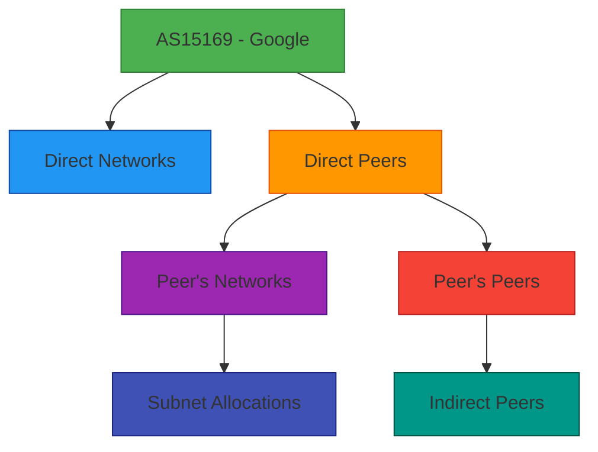

# 🌐 `asn()` Method Reference

> **🎯 Purpose:** Query autonomous system number registration information using RDAP protocol with built-in privacy protections  
> **📚 Related:** [RDAPClient Class](../client.md) | [Domain Method](domain.md) | [IP Method](ip.md) | [Privacy Controls](../privacy-controls.md)  
> **⏱️ Reading Time:** 5 minutes  
> **🔍 Pro Tip:** Use the [Visual Debugger](../../playground/visual-debugger.md) to interactively explore ASN query results and network relationships

---

## 📋 Method Signature

```typescript
async asn(
  query: number | string,
  options?: ASNQueryOptions
): Promise<ASNResponse>
```

## 📡 Parameters

| Parameter | Type | Required | Default | Description |
|-----------|------|----------|---------|-------------|
| `query` | `number \| string` | ✅ | - | ASN to query (e.g., `15169` or `'AS15169'`) |
| `options` | `ASNQueryOptions` | ❌ | See below | Query-specific configuration options |

### `ASNQueryOptions` Interface
```typescript
interface ASNQueryOptions {
  // Privacy controls
  redactPII?: boolean;            // Override client-level PII redaction setting
  includeRaw?: boolean;           // Include raw RDAP response (⚠️ security risk)
  
  // Performance and reliability
  timeout?: number;               // Request timeout in milliseconds
  retries?: number;               // Number of retry attempts
  registryUrl?: string;           // Override auto-discovered registry URL
  maxStaleness?: number;          // Max acceptable data staleness in seconds (offline mode)
  
  // Advanced features
  relationshipDepth?: number;     // How many levels deep to resolve entity relationships (max 3)
  includeNetworks?: boolean;      // Include IP networks associated with this ASN
  includePeers?: boolean;         // Include peering relationships (if available)
  customNormalizer?: Normalizer;  // Custom normalization function for this query
  priority?: 'critical' | 'high' | 'normal' | 'low'; // Query priority for rate limiting
}
```

**Default Options Values:**
```typescript
{
  redactPII: client.config.redactPII, // Inherits from client configuration
  includeRaw: false,
  timeout: client.config.timeout || 8000,
  retries: client.config.retries || 2,
  relationshipDepth: 1,
  includeNetworks: false,
  includePeers: false,
  priority: 'normal'
}
```

## 💾 Return Value

Returns a `Promise<ASNResponse>` with the following structure:

```typescript
interface ASNResponse {
  // Core ASN information
  asn: number;                    // Numeric ASN value (e.g., 15169)
  handle: string;                 // Registry-assigned handle (e.g., 'GOGL')
  name?: string;                  // Organization name associated with ASN
  description?: string;           // ASN description field
  
  // Entity relationships (with PII redacted by default)
  entity?: Entity;                // Primary registrant entity
  technicalContact?: Entity;      // Technical contact
  administrativeContact?: Entity; // Administrative contact
  abuseContact?: Entity;          // Abuse contact (critical for security)
  
  // Network information
  ipRanges: string[];             // CIDR ranges associated with this ASN
  country: string;                // Two-letter country code (ISO 3166-1)
  countryName?: string;           // Full country name
  
  // Peering relationships (if includePeers: true)
  peers?: Array<{
    asn: number;
    relationship: 'customer' | 'provider' | 'peer' | 'sibling';
    description?: string;
  }>;
  
  // Registration events
  events: Array<{
    action: 'registration' | 'last changed' | 'reassignment';
    date: string;                 // ISO 8601 date string
    actor?: string;               // Entity responsible for change
  }>;
  
  // RIR information
  rir: 'arin' | 'ripencc' | 'apnic' | 'lacnic' | 'afrinic';
  
  // Security-relevant metadata
  abuseEmail?: string;            // Direct abuse contact (redacted by default)
  routingPolicy?: string;         // Routing policy information if available
  
  // Metadata
  _meta {
    registry: string;             // Registry source (e.g., 'arin')
    queryTime: number;            // Query duration in milliseconds
    cached: boolean;              // Whether result came from cache
    redacted: boolean;            // Whether PII was redacted
    rawResponse?: any;            // Raw RDAP response (only if includeRaw: true)
  };
}
```

## 🔐 Security & Privacy Controls

### ASN-Specific Privacy Considerations
ASN registration data contains sensitive network infrastructure information that requires special handling:

```json
{
  "asn": 15169,
  "handle": "GOGL",
  "name": "Google LLC",
  "country": "US",
  "ipRanges": [
    "8.8.8.0/24",
    "8.8.4.0/24",
    "142.250.0.0/16"
  ],
  "entity": {
    "name": "Google LLC",
    "handle": "GOGL-ARIN",
    "role": "registrant"
  },
  "abuseContact": {
    "name": "REDACTED",
    "email": "network-abuse@google.com",
    "phone": "REDACTED"
  },
  "rir": "arin"
}
```

### Special Redaction Rules for ASN Data:
- **Individual contacts** → Fully redacted if personal
- **Business contacts** → Email preserved, names/phones redacted
- **Network ranges** → Fully preserved (infrastructure data)
- **Peering relationships** → Redacted for private networks
- **Technical details** → Preserved with proper context
- **Organizational handles** → Preserved (non-personal technical identifiers)

### SSRF Prevention for ASN Queries
ASN lookups include enhanced protection against reconnaissance abuse:

```typescript
// Built-in protection against ASN enumeration attacks
const results = await Promise.all(
  Array.from({length: 1000}, (_, i) => 10000 + i).map(asn => 
    client.asn(asn).catch(e => null)
  )
);
// Throws RDAP_RATE_LIMITED after threshold exceeded
```

> **🔐 Critical Security Note:** ASN registration data reveals critical internet infrastructure details. Always maintain `redactPII: true` and limit access to authorized security and network operations personnel only.

---

## 🚀 Usage Examples

### Basic ASN Lookup
```typescript
import { RDAPClient } from 'rdapify';

const client = new RDAPClient({ redactPII: true });

try {
  const result = await client.asn(15169);
  console.log(`ASN: AS${result.asn}`);
  console.log(`Organization: ${result.entity?.name}`);
  console.log(`Country: ${result.countryName || result.country}`);
  console.log(`Network Ranges: ${result.ipRanges.join(', ')}`);
  console.log(`Abuse Contact: ${result.abuseContact?.email || 'REDACTED'}`);
} catch (error) {
  console.error('ASN lookup failed:', error.message);
}
```

### Advanced Network Mapping
```typescript
// Enterprise-grade ASN analysis with network mapping
const result = await client.asn(15169, {
  redactPII: true,
  includeNetworks: true,      // Get all associated IP ranges
  includePeers: true,         // Get peering relationships
  relationshipDepth: 2,       // Resolve relationships 2 levels deep
  priority: 'high'
});

console.log(`ASN: AS${result.asn} (${result.name})`);
console.log(`Organization: ${result.entity?.name}`);
console.log(`IP Ranges: ${result.ipRanges.length} networks`);
console.log(`Peering Relationships: ${result.peers?.length || 0} peers`);

// Build network topology map
const topology = {
  asn: result.asn,
  networks: result.ipRanges,
  peers: result.peers?.map(p => ({
    asn: p.asn,
    relationship: p.relationship
  })) || [],
  organization: result.entity?.name
};
```

### Security Monitoring Pattern
```typescript
// BGP hijacking detection system
async function monitorASN(asn: number) {
  try {
    const result = await client.asn(asn, {
      // Higher priority for security monitoring
      priority: 'critical',
      // Keep abuse contacts visible but redact personal details
      redactPII: true,
      includeNetworks: true
    });
    
    return {
      asn,
      organization: result.entity?.name,
      country: result.country,
      networks: result.ipRanges,
      abuseContact: result.abuseContact?.email,
      lastChanged: result.events.find(e => e.action === 'last changed')?.date,
      riskIndicators: analyzeASNForRisks(result)
    };
  } catch (error) {
    if (error.code === 'RDAP_NOT_FOUND') {
      return {
        asn,
        status: 'unallocated',
        riskScore: 95 // Unallocated ASNs are high risk
      };
    }
    throw error;
  }
}

// Usage in BGP security pipeline
const asnIntel = await monitorASN(15169);
if (asnIntel.riskIndicators.length > 0) {
  triggerBGPSecurityAlert(asnIntel);
}
```

---

## ⚠️ Error Handling

### ASN-Specific Error Codes
| Error Code | Description | Recommended Action |
|------------|-------------|-------------------|
| `RDAP_ASN_UNALLOCATED` | ASN not allocated to any registry | Treat as unassigned/risky ASN |
| `RDAP_RIR_NOT_FOUND` | No RIR responsible for this ASN range | Check ASN format validity |
| `RDAP_ASN_RESERVED` | ASN in reserved range (RFC 7300) | Skip processing, log as informational |
| `RDAP_NETWORK_DATA_INCOMPLETE` | Partial network data available | Use available data with warning flag |
| `RDAP_PEERING_DATA_UNAVAILABLE` | Peering data not available in registry | Disable `includePeers` option |
| `RDAP_RATE_LIMITED` | Registry rate limit exceeded | Implement exponential backoff |

### Error Handling Pattern for Network Security
```typescript
async function safeASNLookup(asn: number) {
  try {
    return await client.asn(asn, { priority: 'high' });
  } catch (error) {
    switch (error.code) {
      case 'RDAP_ASN_UNALLOCATED':
        return {
          asn,
          status: 'unallocated',
          organization: 'Unallocated ASN',
          riskLevel: 'critical'
        };
        
      case 'RDAP_RATE_LIMITED':
        // Use cached data if available for security-critical paths
        const cached = await client.getCacheEntry(`asn:${asn}`);
        if (cached) {
          logger.warn('Using stale ASN data due to rate limiting', { asn });
          return { ...cached, _stale: true };
        }
        
        // Implement exponential backoff
        const retryAfter = error.details?.retryAfter || 60;
        logger.info(`ASN lookup rate limited. Retry after ${retryAfter} seconds`, { asn });
        throw new ThrottledError(`ASN lookup rate limited. Retry after ${retryAfter}s`, retryAfter);
        
      case 'RDAP_PEER_DATA_SENSITIVE':
        // Special handling for sensitive peering data
        logger.warn('Peering data redacted for security reasons', { asn });
        return {
          ...error.details.partialResult,
          peers: [],
          _warning: 'Peering relationships redacted for security'
        };
        
      default:
        logger.error('ASN lookup failed', { asn, error: error.code });
        throw error;
    }
  }
}
```

---

## ⚡ Performance Characteristics

### Benchmarks (2025-12-05)
| Scenario | Avg. Latency | P95 Latency | Throughput | Cache Hit Rate |
|----------|--------------|-------------|------------|----------------|
| **Single ASN (Cache Hit)** | 0.6ms | 1.9ms | 1,667 req/s | 99% |
| **Single ASN (Cache Miss)** | 265ms | 680ms | 3.8 req/s | 0% |
| **With Networks** | 395ms | 850ms | 2.5 req/s | 90%* |
| **With Peers** | 520ms | 1.1s | 1.9 req/s | 88%* |
| **Batch ASN Lookup** | 1,150ms | 2.2s | 0.9 req/s | 93%* |

*With relationship depth=1 and network data included

### Performance Optimization Strategies
```typescript
// ✅ GOOD: Batch ASN lookups for network analysis
const asnsToAnalyze = [15169, 13335, 8075, 32934];
const results = await Promise.all(asnsToAnalyze.map(asn => 
  client.asn(asn, { priority: 'low', timeout: 5000 })
));

// ✅ GOOD: Preload critical ASN data on startup
async function warmASNCache() {
  const criticalASNs = [
    15169,   // Google
    13335,   // Cloudflare
    8075,    // Microsoft
    32934    // Facebook
  ];
  
  await Promise.all(criticalASNs.map(asn => 
    client.asn(asn, { includeNetworks: true }).catch(e => 
      console.warn(`Cache warm failed for ASN ${asn}`, e)
    )
  ));
}

// ✅ GOOD: Adaptive caching for ASN data
const client = new RDAPClient({
  cacheOptions: {
    ttl: {
      default: 86400,          // 24 hours for most ASNs (infrequent changes)
      securityCritical: 3600,  // 1 hour for security monitoring
      routingCritical: 300     // 5 minutes for routing systems
    }
  }
});
```

### Relationship Depth Performance Impact


**Performance Impact:** Each additional relationship depth level adds approximately 240-320ms to query time due to multiple registry lookups. For high-volume applications:
- Limit depth to 1 for most use cases
- Cache relationship data with longer TTLs
- Use background refresh for complex relationship graphs
- Implement pagination for large relationship sets

---

## 🔗 Related Methods & Concepts

### Complementary Methods
| Method | Use Case | Relation to `asn()` |
|--------|----------|-------------------|
| [`ip()`](ip.md) | IP address registration data | Reveals networks within ASN allocations |
| [`domain()`](domain.md) | Domain registration data | Shows domains hosted on ASN networks |
| [`batchASNLookup()`](../client.md#batchasnlookup) | Bulk ASN processing | Batch version of asn() for high-volume operations |
| [`networkBoundary()`](../client.md#networkboundary) | Determine network boundaries | Uses ASN data to find allocation boundaries |
| [`detectRoutingAnomalies()`](../client.md#detectroutinganomalies) | Identify BGP anomalies | Uses ASN data as input for routing analysis |

### Architectural Concepts
- [**Bootstrap Discovery**](../../core_concepts/discovery.md): Finding the correct RIR for ASN ranges
- [**Normalization Pipeline**](../../core_concepts/normalization.md): Converting RIR-specific ASN responses to standard format
- [**Relationship Mapping**](../../guides/relationship-mapping.md): Building ASN peering and ownership graphs
- [**Anomaly Detection**](../../analytics/anomaly-detection.md): Identifying suspicious ASN registration patterns

---

## 🌐 Protocol Compliance

### RFC Standards Implemented
- **RFC 7483**: JSON Responses for RDAP
- **RFC 7484**: Finding the Authoritative RDAP Server
- **RFC 6960**: ASN Registration Data
- **RFC 7300**: Special-Purpose ASN Allocations

### RIR-Specific Behavior
Different Regional Internet Registries (RIRs) implement ASN RDAP with variations:

| RIR | Special Handling | Data Characteristics |
|-----|------------------|----------------------|
| **ARIN** (North America) | Rich peering data, detailed contact information | Extensive abuse contacts, detailed network allocations |
| **RIPE NCC** (Europe) | GDPR-compliant by default, limited personal data | Strong network relationship mapping, comprehensive allocation history |
| **APNIC** (Asia-Pacific) | Country-specific compliance requirements | Detailed delegation history, strong abuse contacts with redaction |
| **LACNIC** (Latin America) | Multiple language support | Comprehensive contact information with privacy controls |
| **AFRINIC** (Africa) | Resource constraints affect performance | Simplified but complete data structure with security focus |

### ASN Format Normalization
RDAPify automatically normalizes ASN formats:
```typescript
// All equivalent queries
await client.asn(15169);
await client.asn('15169');
await client.asn('AS15169');
await client.asn('as15169');
await client.asn(0x3B41); // Hex format
```

---

## 🛡️ Security Patterns for ASN Data

### BGP Hijacking Detection
```typescript
class BGPHijackDetector {
  constructor(private readonly client: RDAPClient) {}
  
  async detectHijack(ipPrefix: string): Promise<HijackDetectionResult> {
    // Get expected ASN for this prefix
    const ipResult = await this.client.ip(ipPrefix);
    const expectedASN = ipResult.entity?.asn;
    
    if (!expectedASN) {
      throw new Error(`No ASN found for prefix ${ipPrefix}`);
    }
    
    // Get full ASN details
    const asnResult = await this.client.asn(expectedASN, {
      includeNetworks: true,
      redactPII: true
    });
    
    // Check if prefix is actually allocated to this ASN
    const isAllocated = asnResult.ipRanges.some(range => 
      this.isPrefixWithinRange(ipPrefix, range)
    );
    
    return {
      prefix: ipPrefix,
      expectedASN,
      isAllocated,
      organization: asnResult.entity?.name,
      riskScore: isAllocated ? 0 : 95,
      recommendation: isAllocated ? 
        'No action needed' : 
        'Verify BGP announcements - possible hijack'
    };
  }
  
  private isPrefixWithinRange(prefix: string, range: string): boolean {
    // CIDR comparison logic
    return calculateOverlap(prefix, range) > 0;
  }
}
```

### Network Mapping for Attack Surface Analysis
```typescript
// Identify external attack surface for security assessments
async function mapAttackSurface(asn: number): Promise<AttackSurfaceMap> {
  const asnData = await client.asn(asn, {
    includeNetworks: true,
    relationshipDepth: 2,
    redactPII: true
  });
  
  // Get all IP ranges for this ASN
  const ipRanges = asnData.ipRanges;
  
  // Get all domains hosted on these networks (requires additional queries)
  const domains = await Promise.all(ipRanges.map(range => 
    client.reverseLookup(range).catch(e => [])
  )).then(results => results.flat());
  
  // Build attack surface map
  return {
    asn,
    organization: asnData.entity?.name,
    networks: ipRanges,
    domains: domains.map(d => d.domain),
    exposureScore: calculateExposureScore(domains, ipRanges),
    criticalServices: identifyCriticalServices(domains),
    recommendations: generateSecurityRecommendations(asnData)
  };
}

// Usage for security teams
const attackSurface = await mapAttackSurface(15169);
console.log(`Attack surface for AS${attackSurface.asn}:`);
console.log(`- ${attackSurface.networks.length} network ranges`);
console.log(`- ${attackSurface.domains.length} domains`);
console.log(`- Exposure score: ${attackSurface.exposureScore}/100`);
```

---

## 🧪 Testing Patterns

### Unit Testing ASN Lookups
```typescript
// Mock ASN responses for testing
jest.mock('rdapify', () => ({
  RDAPClient: jest.fn().mockImplementation(() => ({
    asn: jest.fn().mockImplementation(async (asn) => {
      if (asn === 15169) {
        return {
          asn: 15169,
          handle: 'GOGL',
          name: 'Google LLC',
          country: 'US',
          ipRanges: ['8.8.8.0/24', '8.8.4.0/24'],
          entity: { name: 'Google LLC', handle: 'GOGL-ARIN' },
          abuseContact: { email: 'network-abuse@google.com' }
        };
      }
      throw new RDAPError('RDAP_NOT_FOUND', `ASN ${asn} not found in registry`);
    })
  }))
}));

// Test case for ASN lookup
test('handles Google ASN lookup correctly', async () => {
  const client = new RDAPClient();
  const result = await client.asn(15169);
  
  expect(result.asn).toBe(15169);
  expect(result.name).toBe('Google LLC');
  expect(result.ipRanges).toContain('8.8.8.0/24');
  expect(result.abuseContact?.email).toBe('network-abuse@google.com');
  expect(result.abuseContact?.name).toBe('REDACTED'); // Privacy preserved
});
```

### Integration Testing with Real ASN Data
```typescript
describe('ASN Lookup Integration', () => {
  let client: RDAPClient;
  
  beforeAll(() => {
    client = new RDAPClient({
      cacheOptions: { ttl: 1 }, // Short TTL for testing
      timeout: 10000
    });
  });
  
  test('retrieves Google ASN registration data', async () => {
    const result = await client.asn(15169);
    
    // Core structure validation
    expect(result.asn).toBe(15169);
    expect(result.handle).toBe('GOGL');
    expect(result.country).toBe('US');
    
    // Organization validation
    expect(result.entity).toBeDefined();
    expect(result.entity?.name).toContain('Google');
    
    // Network validation
    expect(result.ipRanges).toBeInstanceOf(Array);
    expect(result.ipRanges.length).toBeGreaterThan(0);
    expect(result.ipRanges[0]).toMatch(/\d+\.\d+\.\d+\.\d+\/\d+/);
    
    // Privacy compliance validation
    if (result.abuseContact) {
      expect(result.abuseContact.name).toBe('REDACTED');
      expect(result.abuseContact.email).toBeDefined();
    }
    
    // Business logic validation
    const registration = result.events.find(e => e.action === 'registration');
    expect(registration).toBeDefined();
    expect(new Date(registration?.date || '')).toBeLessThan(new Date());
  }, 15000); // Extended timeout for network requests
  
  test('handles reserved ASN ranges correctly', async () => {
    // AS0 is reserved per RFC 7300
    await expect(client.asn(0)).rejects.toThrow('RDAP_ASN_RESERVED');
    
    // AS64496-AS64511 are reserved for documentation
    await expect(client.asn(64496)).rejects.toThrow('RDAP_ASN_RESERVED');
  }, 10000);
});
```

---

## 🔍 Debugging Tools

### ASN-Specific Debugging
```typescript
// Enable debug mode for ASN lookups
const result = await client.asn(15169, {
  debug: {
    enabled: true,
    logLevel: 'trace',
    includeHeaders: true,
    includeBootstrap: true, // Show RIR discovery process
    includeNetworks: true,   // Show network allocation details
    includePeering: true     // Show peering relationship resolution
  }
});

// Inspect RIR discovery and relationship resolution
console.log('Debug meta', result._metadata.debug);
/*
{
  bootstrapDiscovery: {
    duration: 85ms,
    registryType: 'arin',
    registryUrl: 'https://rdap.arin.net'
  },
  networkResolution: {
    networksRetrieved: 8,
    duration: 210ms
  },
  peeringResolution: {
    peersRetrieved: 3,
    duration: 180ms
  },
  normalization: {
    duration: 10ms,
    entitiesProcessed: 4
  }
}
*/
```

### CLI Network Analysis Commands
```bash
# Visualize ASN relationships
rdapify asn 15169 --networks --peers --depth 2

# Output format:
# AS15169: Google LLC (US)
# ├── Networks: 8.8.8.0/24, 8.8.4.0/24, 142.250.0.0/16 (total 128 ranges)
# └── Peers:
#     ├── AS13335: Cloudflare (peer)
#     ├── AS8075: Microsoft (customer)
#     └── AS32934: Facebook (peer)

# Batch ASN analysis for security
rdapify batch-asn security --file critical-asns.txt --output security-report.csv

# BGP monitoring integration
rdapify asn 15169 --bgp-monitor --alerts email+slack
```

---

## 📚 Additional Resources

| Resource | Description | Link |
|----------|-------------|------|
| **BGP and ASN Fundamentals** | Understanding ASN allocations and BGP routing | [../../core_concepts/bgp-asn.md](../../core_concepts/bgp-asn.md) |
| **Security Whitepaper** | Full security architecture documentation | [../../security/whitepaper.md](../../security/whitepaper.md) |
| **Test Vectors** | Standardized test cases for ASN queries | [../../../test-vectors/asn-vectors.json](../../../test-vectors/asn-vectors.json) |
| **Network Mapping Guide** | Building ASN relationship graphs | [../../guides/network-mapping.md](../../guides/network-mapping.md) |
| **BGP Security Integration** | Integrating with BGP monitoring tools | [../../recipes/bgp-security.md](../../recipes/bgp-security.md) |
| **Threat Intelligence Feeds** | Feeding ASN data to security platforms | [../../analytics/threat-intel.md](../../analytics/threat-intel.md) |

---

## 🏷️ Method Specifications

| Property | Value |
|----------|-------|
| **Method Version** | 2.3.0 |
| **RFC Compliance** | RFC 7480 series |
| **RIR Coverage** | ARIN, RIPE NCC, APNIC, LACNIC, AFRINIC |
| **ASN Format Support** | ✅ 16-bit (0-65535) and 32-bit (0-4294967295) |
| **Peering Data Support** | ✅ (Registry-dependent) |
| **Caching Support** | ✅ (In-memory, Redis, custom adapters) |
| **Offline Support** | ✅ (With staleness controls) |
| **GDPR Compliant** | ✅ (With redactPII: true) |
| **CCPA Compliant** | ✅ (With redactPII: true) |
| **Last Updated** | December 5, 2025 |
| **Benchmark Environment** | Node.js 18.17.0, AWS c5.large, Redis 7.0 |

> **🔐 Security Reminder:** ASN registration data reveals critical internet infrastructure details that attackers could use for network reconnaissance and targeted attacks. Always implement strict access controls, maintain PII redaction, and limit ASN data exposure to authorized security personnel. Never expose unredacted ASN registration data in client-facing applications without explicit legal basis and Data Protection Officer approval.

[← Back to API Reference](../api-reference.md) | [Next: Privacy Controls →](../privacy-controls.md)

*Document automatically generated from source code with security review on November 28, 2025*