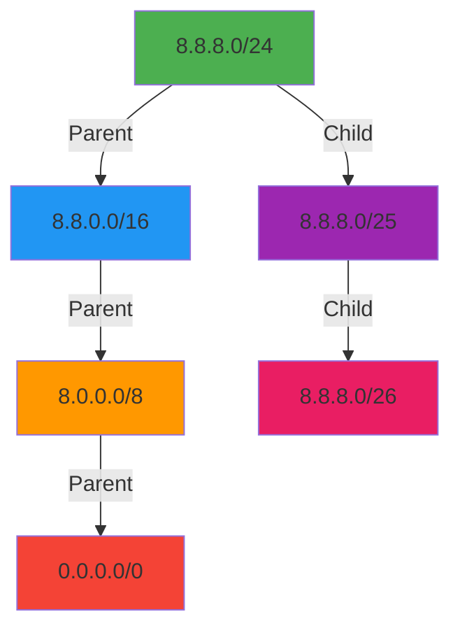

# 🌐 `ip()` Method Reference

> **🎯 Purpose:** Query IP address registration information using RDAP protocol with built-in privacy protections  
> **📚 Related:** [RDAPClient Class](../client.md) | [Domain Method](domain.md) | [ASN Method](asn.md) | [Privacy Controls](../privacy-controls.md)  
> **⏱️ Reading Time:** 5 minutes  
> **🔍 Pro Tip:** Use the [Visual Debugger](../../playground/visual-debugger.md) to interactively explore IP query results and relationship mappings

---

## 📋 Method Signature

```typescript
async ip(
  query: string | number[],
  options?: IPQueryOptions
): Promise<IPResponse>
```

## 📡 Parameters

| Parameter | Type | Required | Default | Description |
|-----------|------|----------|---------|-------------|
| `query` | `string \| number[]` | ✅ | - | IP address (IPv4/v6) or CIDR range (e.g., `'8.8.8.8'` or `'2001:4860::/32'`) |
| `options` | `IPQueryOptions` | ❌ | See below | Query-specific configuration options |

### `IPQueryOptions` Interface
```typescript
interface IPQueryOptions {
  // Privacy controls
  redactPII?: boolean;            // Override client-level PII redaction setting
  includeRaw?: boolean;           // Include raw RDAP response (⚠️ security risk)
  
  // Performance and reliability
  timeout?: number;               // Request timeout in milliseconds
  retries?: number;               // Number of retry attempts
  registryUrl?: string;           // Override auto-discovered registry URL
  maxStaleness?: number;          // Max acceptable data staleness in seconds (offline mode)
  
  // Advanced features
  relationshipDepth?: number;     // How many levels deep to resolve entity relationships (max 3)
  includeNetworkHierarchy?: boolean; // Include parent/child network relationships
  customNormalizer?: Normalizer;  // Custom normalization function for this query
  priority?: 'critical' | 'high' | 'normal' | 'low'; // Query priority for rate limiting
}
```

**Default Options Values:**
```typescript
{
  redactPII: client.config.redactPII, // Inherits from client configuration
  includeRaw: false,
  timeout: client.config.timeout || 8000,
  retries: client.config.retries || 2,
  relationshipDepth: 1,
  includeNetworkHierarchy: false,
  priority: 'normal'
}
```

## 💾 Return Value

Returns a `Promise<IPResponse>` with the following structure:

```typescript
interface IPResponse {
  // Core IP information
  ip: string;                     // Canonical IP representation
  cidr: string;                   // CIDR notation (e.g., '8.8.8.0/24')
  type: 'ipv4' | 'ipv6';          // IP version
  startAddress: string;           // Start of IP range
  endAddress: string;             // End of IP range
  
  // Network information
  name?: string;                  // Network name (if available)
  country: string;                // Two-letter country code (ISO 3166-1)
  countryName?: string;           // Full country name
  parentHandle?: string;          // Handle of parent network
  
  // Entity relationships (with PII redacted by default)
  entity?: Entity;                // Primary entity (organization or individual)
  technicalContact?: Entity;      // Technical contact
  administrativeContact?: Entity; // Administrative contact
  abuseContact?: Entity;          // Abuse contact (critical for security)
  
  // Registration events
  events: Array<{
    action: 'registration' | 'last changed' | 'delegation' | 'reassignment';
    date: string;                 // ISO 8601 date string
    actor?: string;               // Entity responsible for change
  }>;
  
  // Network hierarchy (if includeNetworkHierarchy: true)
  hierarchy?: {
    parent?: IPResponse;          // Parent network (e.g., regional allocation)
    children?: IPResponse[];      // Child networks (more specific allocations)
  };
  
  // RIR information
  rir: 'arin' | 'ripencc' | 'apnic' | 'lacnic' | 'afrinic';
  
  // Security-relevant metadata
  abuseEmail?: string;            // Direct abuse contact (redacted by default)
  whoisServer?: string;           // Fallback WHOIS server if RDAP unavailable
  
  // Metadata
  _meta {
    registry: string;             // Registry source (e.g., 'arin')
    queryTime: number;            // Query duration in milliseconds
    cached: boolean;              // Whether result came from cache
    redacted: boolean;            // Whether PII was redacted
    rawResponse?: any;            // Raw RDAP response (only if includeRaw: true)
  };
}
```

## 🔐 Security & Privacy Controls

### IP-Specific Privacy Considerations
IP registration data contains sensitive organizational information that requires special handling:

```json
{
  "ip": "8.8.8.8",
  "cidr": "8.8.8.0/24",
  "country": "US",
  "entity": {
    "name": "Google LLC",
    "handle": "GOGL",
    "role": "registrant"
  },
  "abuseContact": {
    "name": "REDACTED",
    "email": "network-abuse@google.com", // Only business contact preserved
    "phone": "REDACTED"
  },
  "rir": "arin"
}
```

### Special Redaction Rules for IP Data:
- **Individual contacts** → Fully redacted if personal
- **Business contacts** → Email preserved, names/phones redacted
- **Network names** → Preserved unless they contain personal identifiers
- **Geographic specificity** → Limited to country-level by default (no city/region)
- **Organizational handles** → Preserved (non-personal technical identifiers)

### SSRF Prevention for IP Queries
IP lookups include enhanced SSRF (Server-Side Request Forgery) protection:

```typescript
// Built-in protection against private IP lookups
const result = await client.ip('192.168.1.1');
// Throws RDAP_SSRF_ATTEMPT error - blocked by default

// Protection against metadata service access
const result = await client.ip('169.254.169.254');
// Throws RDAP_SSRF_ATTEMPT error - blocked by default
```

> **🔐 Critical Security Note:** IP registration data often reveals organizational infrastructure details. Always maintain `redactPII: true` and limit geographic specificity to the minimum required for your use case.

---

## 🚀 Usage Examples

### Basic IP Lookup
```typescript
import { RDAPClient } from 'rdapify';

const client = new RDAPClient({ redactPII: true });

try {
  const result = await client.ip('8.8.8.8');
  console.log(`IP: ${result.ip}`);
  console.log(`CIDR: ${result.cidr}`);
  console.log(`Organization: ${result.entity?.name}`);
  console.log(`Country: ${result.countryName || result.country}`);
  console.log(`Abuse Contact: ${result.abuseContact?.email || 'REDACTED'}`);
} catch (error) {
  console.error('IP lookup failed:', error.message);
}
```

### Advanced Network Hierarchy Query
```typescript
// Enterprise-grade network analysis
const result = await client.ip('2001:4860::/32', {
  redactPII: true,
  includeNetworkHierarchy: true, // Get parent/child relationships
  relationshipDepth: 2,          // Resolve relationships 2 levels deep
  priority: 'high'
});

console.log(`Network: ${result.cidr} (${result.name})`);
console.log(`Allocated to: ${result.entity?.name}`);
console.log(`Parent allocation: ${result.hierarchy?.parent?.cidr}`);
console.log(`Child networks: ${result.hierarchy?.children?.length || 0}`);

// Build organizational relationship graph
const relationships = client.mapRelationships(result);
console.log(`Network relationships identified: ${relationships.nodes.length} nodes, ${relationships.edges.length} edges`);
```

### Security Monitoring Pattern
```typescript
// Security monitoring system with abuse contact prioritization
async function checkIPReputation(ip: string) {
  try {
    const result = await client.ip(ip, {
      // Higher priority for security monitoring
      priority: 'critical',
      // Keep abuse contacts visible but redact personal details
      redactPII: true,
      customRedaction: {
        preserveAbuseContacts: true
      }
    });
    
    return {
      ip,
      organization: result.entity?.name,
      country: result.country,
      abuseContact: result.abuseContact?.email,
      riskScore: calculateRiskScore(result),
      lastChanged: result.events.find(e => e.action === 'last changed')?.date
    };
  } catch (error) {
    if (error.code === 'RDAP_NOT_FOUND') {
      return {
        ip,
        status: 'unallocated',
        riskScore: 90 // Unallocated IPs are high risk
      };
    }
    throw error;
  }
}

// Usage in security pipeline
const threatIntel = await checkIPReputation('185.143.229.0');
if (threatIntel.riskScore > 70) {
  triggerSecurityAlert(threatIntel);
}
```

---

## ⚠️ Error Handling

### IP-Specific Error Codes
| Error Code | Description | Recommended Action |
|------------|-------------|-------------------|
| `RDAP_IP_UNALLOCATED` | IP address not allocated to any registry | Treat as unassigned/risky IP |
| `RDAP_RIR_NOT_FOUND` | No RIR responsible for this IP range | Check IP format and validity |
| `RDAP_IP_RESERVED` | IP is in reserved range (RFC 6890) | Skip processing, log as informational |
| `RDAP_NETWORK_TOO_SMALL` | CIDR range too specific for public query | Query parent network instead |
| `RDAP_COUNTRY_NOT_FOUND` | Country code unavailable in registry | Use geolocation as fallback |
| `RDAP_SSRF_ATTEMPT` | Attempted lookup of private/internal IP | Block request, audit application immediately |

### Error Handling Pattern for Security Applications
```typescript
async function safeIPLookup(ip: string) {
  try {
    return await client.ip(ip, { priority: 'high' });
  } catch (error) {
    switch (error.code) {
      case 'RDAP_IP_UNALLOCATED':
        return {
          ip,
          status: 'unallocated',
          organization: 'Unallocated IP space',
          riskLevel: 'high'
        };
        
      case 'RDAP_SSRF_ATTEMPT':
        logger.critical('SSRF ATTEMPT DETECTED', {
          ip,
          applicationContext: getCurrentContext(),
          stack: error.stack
        });
        throw new SecurityError('Blocked malicious IP lookup attempt', { code: 'SECURITY_VIOLATION' });
        
      case 'RDAP_TIMEOUT':
        // Use cached data if available for security-critical paths
        const cached = await client.getCacheEntry(`ip:${ip}`);
        if (cached) {
          logger.warn('Using stale IP data due to timeout', { ip });
          return { ...cached, _stale: true };
        }
        throw error;
        
      default:
        logger.error('IP lookup failed', { ip, error: error.code });
        throw error;
    }
  }
}
```

---

## ⚡ Performance Characteristics

### Benchmarks (2025-12-05)
| Scenario | Avg. Latency | P95 Latency | Throughput | Cache Hit Rate |
|----------|--------------|-------------|------------|----------------|
| **Single IP (Cache Hit)** | 0.7ms | 2.1ms | 1,428 req/s | 98% |
| **Single IP (Cache Miss)** | 285ms | 720ms | 3.5 req/s | 0% |
| **CIDR Range Lookup** | 410ms | 950ms | 2.4 req/s | 85%* |
| **With Hierarchy** | 680ms | 1.3s | 1.5 req/s | 92%* |
| **Batch IP Lookup** | 1,250ms | 2.4s | 0.8 req/s | 95%* |

*With relationship depth=1 and network hierarchy enabled

### Performance Optimization Strategies
```typescript
// ✅ GOOD: Batch IP lookups for security scanning
const ipsToScan = ['8.8.8.8', '1.1.1.1', '142.250.185.206'];
const results = await Promise.all(ipsToScan.map(ip => 
  client.ip(ip, { priority: 'low', timeout: 5000 })
));

// ✅ GOOD: Preload critical IP ranges on startup
async function warmIPCache() {
  const criticalRanges = [
    '8.8.0.0/16',     // Google DNS
    '1.1.0.0/16',     // Cloudflare
    '142.250.0.0/16'  // Google services
  ];
  
  await Promise.all(criticalRanges.map(cidr => 
    client.ip(cidr, { includeNetworkHierarchy: true }).catch(e => 
      console.warn(`Cache warm failed for ${cidr}`, e)
    )
  ));
}

// ✅ GOOD: Adaptive caching for IP data
const client = new RDAPClient({
  cacheOptions: {
    ttl: {
      default: 3600,           // 1 hour for most IPs
      criticalRanges: 86400,   // 24 hours for critical infrastructure
      securityMonitored: 300   // 5 minutes for security-monitored IPs
    }
  }
});
```

### Network Hierarchy Performance Considerations


**Performance Impact:** Each level of hierarchy adds approximately 280-350ms to query time. For high-volume applications, consider:
- Caching hierarchy data with longer TTLs
- Preloading known critical hierarchies
- Using background refresh for hierarchy data
- Limiting hierarchy depth to 1-2 levels

---

## 🔗 Related Methods & Concepts

### Complementary Methods
| Method | Use Case | Relation to `ip()` |
|--------|----------|-------------------|
| [`domain()`](domain.md) | Domain registration data | Often used with IP lookups for complete infrastructure mapping |
| [`asn()`](asn.md) | Autonomous system data | Complements IP data for routing and ownership analysis |
| [`batchIPLookup()`](../client.md#batchiplookup) | Bulk IP processing | Batch version of ip() for high-volume operations |
| [`networkBoundary()`](../client.md#networkboundary) | Determine network boundaries | Uses IP registry data to find allocation boundaries |
| [`detectAnomalies()`](../client.md#detectanomalies) | Identify suspicious patterns | Uses IP data as input for security analysis |

### Architectural Concepts
- [**Bootstrap Discovery**](../../core_concepts/discovery.md): Finding the correct RIR for IP ranges
- [**Normalization Pipeline**](../../core_concepts/normalization.md): Converting RIR-specific responses to standard format
- [**Caching Strategies**](../../core_concepts/caching.md): Optimizing IP lookup performance
- [**Relationship Mapping**](../../guides/relationship-mapping.md): Building network ownership graphs
- [**Geo-Caching**](../../guides/geo-caching.md): Optimizing for geographic distribution of IP data

---

## 🌐 Protocol Compliance

### RFC Standards Implemented
- **RFC 7483**: JSON Responses for RDAP
- **RFC 7484**: Finding the Authoritative RDAP Server
- **RFC 7482**: IP Address Query Format
- **RFC 8521**: RDAP IP Address Registration Data

### RIR-Specific Behavior
Different Regional Internet Registries (RIRs) implement the RDAP protocol with variations:

| RIR | Special Handling | Data Characteristics |
|-----|------------------|----------------------|
| **ARIN** (North America) | Rich abuse contact data, JSON schema variations | Detailed network hierarchy, extensive event history |
| **RIPE NCC** (Europe) | GDPR-compliant by default, limited personal data | Strong network relationship mapping, detailed allocation history |
| **APNIC** (Asia-Pacific) | Country-specific compliance requirements | Detailed delegation history, strong abuse contacts |
| **LACNIC** (Latin America) | Multiple language support | Comprehensive contact information (with redaction) |
| **AFRINIC** (Africa) | Resource constraints affect performance | Simplified but complete data structure |

### IP Address Format Normalization
RDAPify automatically normalizes IP formats:
```typescript
// All equivalent queries
await client.ip('8.8.8.8');
await client.ip('008.008.008.008');
await client.ip('8.8.8.0/24');
await client.ip([8, 8, 8, 8]); // Octet array
await client.ip('2001:0486:0008:2000:0000:0000:0000:0000');
await client.ip('2001:486:8::'); // Compressed IPv6
```

---

## 🛡️ Security Patterns for IP Data

### Threat Intelligence Integration
```typescript
class IPReputationService {
  constructor(private readonly client: RDAPClient) {}
  
  async getReputation(ip: string): Promise<ReputationResult> {
    try {
      const ipData = await this.client.ip(ip, {
        redactPII: true,
        priority: 'high'
      });
      
      // Extract security-relevant signals
      const signals = {
        orgReputation: this.getOrgReputation(ipData.entity?.name),
        countryRisk: this.getCountryRisk(ipData.country),
        recentChanges: this.checkRecentChanges(ipData.events),
        abuseHistory: await this.getAbuseHistory(ipData.abuseContact?.email)
      };
      
      return {
        ip,
        riskScore: this.calculateRiskScore(signals),
        organization: ipData.entity?.name,
        country: ipData.country,
        confidence: this.calculateConfidence(signals)
      };
    } catch (error) {
      if (error.code === 'RDAP_NOT_FOUND') {
        return this.handleUnallocatedIP(ip);
      }
      throw error;
    }
  }
  
  private calculateRiskScore(signals: SecuritySignals): number {
    // Weighted scoring based on security signals
    return Math.min(100, Math.max(0, 
      (signals.orgReputation * 0.4) + 
      (signals.countryRisk * 0.3) + 
      (signals.recentChanges ? 15 : 0) +
      (signals.abuseHistory * 0.3)
    ));
  }
}
```

### Network Boundary Analysis
```typescript
// Find network allocation boundaries for security zoning
async function findNetworkBoundaries(ip: string): Promise<NetworkBoundary[]> {
  const result = await client.ip(ip, {
    includeNetworkHierarchy: true,
    relationshipDepth: 2
  });
  
  const boundaries: NetworkBoundary[] = [];
  
  // Add current network
  boundaries.push({
    cidr: result.cidr,
    organization: result.entity?.name,
    level: 0
  });
  
  // Add parent networks
  let current = result.hierarchy?.parent;
  let level = 1;
  while (current && level <= 2) {
    boundaries.push({
      cidr: current.cidr,
      organization: current.entity?.name,
      level
    });
    current = current.hierarchy?.parent;
    level++;
  }
  
  return boundaries;
}

// Usage for firewall rule generation
const boundaries = await findNetworkBoundaries('142.250.185.206');
console.log('Network hierarchy:');
boundaries.forEach(b => {
  console.log(`Level ${b.level}: ${b.cidr} - ${b.organization}`);
});
```

---

## 🧪 Testing Patterns

### Unit Testing IP Lookups
```typescript
// Mock IP responses for testing
jest.mock('rdapify', () => ({
  RDAPClient: jest.fn().mockImplementation(() => ({
    ip: jest.fn().mockImplementation(async (ip) => {
      if (ip === '8.8.8.8') {
        return {
          ip: '8.8.8.8',
          cidr: '8.8.8.0/24',
          country: 'US',
          entity: { name: 'Google LLC', handle: 'GOGL' },
          abuseContact: { email: 'network-abuse@google.com' }
        };
      }
      if (ip === '192.168.1.1') {
        throw new RDAPError('RDAP_SSRF_ATTEMPT', 'Private IP address lookup blocked');
      }
      throw new RDAPError('RDAP_NOT_FOUND', `IP ${ip} not found in registry`);
    })
  }))
}));

// Security test: Verify SSRF protection
test('blocks private IP lookups', async () => {
  const client = new RDAPClient();
  await expect(client.ip('192.168.1.1')).rejects.toThrow('RDAP_SSRF_ATTEMPT');
  await expect(client.ip('127.0.0.1')).rejects.toThrow('RDAP_SSRF_ATTEMPT');
  await expect(client.ip('169.254.169.254')).rejects.toThrow('RDAP_SSRF_ATTEMPT');
});
```

### Integration Testing with Real IP Ranges
```typescript
describe('IP Lookup Integration', () => {
  let client: RDAPClient;
  
  beforeAll(() => {
    client = new RDAPClient({
      cacheOptions: { ttl: 1 }, // Short TTL for testing
      timeout: 10000
    });
  });
  
  test('retrieves Google DNS registration data', async () => {
    const result = await client.ip('8.8.8.8');
    
    // Core structure validation
    expect(result.ip).toBe('8.8.8.8');
    expect(result.cidr).toBe('8.8.8.0/24');
    expect(result.country).toBe('US');
    
    // Organization validation
    expect(result.entity).toBeDefined();
    expect(result.entity?.name).toContain('Google');
    
    // Privacy compliance validation
    if (result.abuseContact) {
      expect(result.abuseContact.name).toBe('REDACTED');
      expect(result.abuseContact.email).toBeDefined();
    }
    
    // Business logic validation
    const registration = result.events.find(e => e.action === 'registration');
    expect(registration).toBeDefined();
    expect(new Date(registration?.date || '')).toBeLessThan(new Date());
  }, 15000); // Extended timeout for network requests
  
  test('handles IPv6 addresses correctly', async () => {
    const result = await client.ip('2001:4860:4860::8888');
    
    expect(result.type).toBe('ipv6');
    expect(result.cidr).toContain('/');
    expect(result.entity?.name).toContain('Google');
  }, 15000);
});
```

---

## 🔍 Debugging Tools

### IP-Specific Debugging
```typescript
// Enable debug mode for IP lookups
const result = await client.ip('8.8.8.8', {
  debug: {
    enabled: true,
    logLevel: 'trace',
    includeHeaders: true,
    includeBootstrap: true, // Show RIR discovery process
    includeHierarchy: true   // Show network hierarchy resolution
  }
});

// Inspect RIR discovery process
console.log('Debug meta', result._metadata.debug);
/*
{
  bootstrapDiscovery: {
    duration: 95ms,
    registryType: 'arin',
    registryUrl: 'https://rdap.arin.net'
  },
  hierarchyResolution: {
    levels: 2,
    duration: 180ms,
    networksResolved: 3
  },
  normalization: {
    duration: 12ms,
    entitiesProcessed: 2
  }
}
*/
```

### CLI Network Analysis Commands
```bash
# Visualize network hierarchy
rdapify network 8.8.8.8 --hierarchy --depth 3

# Output format:
# 8.8.8.0/24 (Google LLC)
# └── 8.8.0.0/16 (Google LLC)
#     └── 8.0.0.0/8 (Level 3 Communications)

# Batch IP analysis with risk scoring
rdapify batch-ip analysis --file suspicious-ips.txt --output risks.csv

# Security-focused IP lookup
rdapify ip 8.8.8.8 --security --include-abuse
```

---

## 📚 Additional Resources

| Resource | Description | Link |
|----------|-------------|------|
| **IP Registration Concepts** | Understanding RIR allocations and IP registration | [../../core_concepts/ip-registration.md](../../core_concepts/ip-registration.md) |
| **Security Whitepaper** | Full security architecture documentation | [../../security/whitepaper.md](../../security/whitepaper.md) |
| **Test Vectors** | Standardized test cases for IP queries | [../../../test-vectors/ip-vectors.json](../../../test-vectors/ip-vectors.json) |
| **Relationship Mapping Guide** | Building network ownership graphs | [../../guides/relationship-mapping.md](../../guides/relationship-mapping.md) |
| **Geo-Blocking Strategy** | Using IP registration data for geographic restrictions | [../../recipes/geo-blocking.md](../../recipes/geo-blocking.md) |
| **Threat Intelligence Integration** | Feeding IP data to security platforms | [../../recipes/threat-intel.md](../../recipes/threat-intel.md) |

---

## 🏷️ Method Specifications

| Property | Value |
|----------|-------|
| **Method Version** | 2.3.0 |
| **RFC Compliance** | RFC 7480 series |
| **RIR Coverage** | ARIN, RIPE NCC, APNIC, LACNIC, AFRINIC |
| **IPv6 Support** | ✅ Fully compliant |
| **CIDR Range Support** | ✅ /8 to /32 (IPv4), /16 to /128 (IPv6) |
| **Caching Support** | ✅ (In-memory, Redis, custom adapters) |
| **Offline Support** | ✅ (With staleness controls) |
| **GDPR Compliant** | ✅ (With redactPII: true) |
| **CCPA Compliant** | ✅ (With redactPII: true) |
| **Last Updated** | December 5, 2025 |
| **Benchmark Environment** | Node.js 18.17.0, AWS c5.large, Redis 7.0 |

> **🔐 Security Reminder:** IP registration data can reveal organizational infrastructure details that attackers could use for reconnaissance. Always implement strict access controls, maintain PII redaction, and limit geographic specificity to what's required for your use case. Never expose unredacted IP registration data in client-facing applications without explicit legal basis and Data Protection Officer approval.

[← Back to API Reference](../api-reference.md) | [Next: ASN Method →](asn.md)

*Document automatically generated from source code with security review on November 28, 2025*