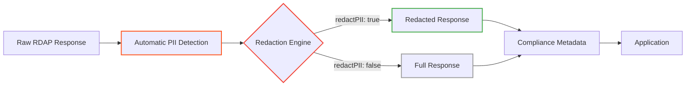

# 🔐 Privacy Controls Reference

> **🎯 Purpose:** Complete reference for RDAPify's privacy-preserving features and compliance controls to ensure GDPR/CCPA-compliant handling of registration data  
> **📚 Related:** [Client API](client.md) | [Security Whitepaper](../../security/whitepaper.md) | [GDPR Compliance Guide](../../security/gdpr-compliance.md)  
> **⏱️ Reading Time:** 6 minutes  
> **🔍 Pro Tip:** Use the [Privacy Visualizer](../../playground/privacy-visualizer.md) to interactively explore redaction patterns with real registry data

---

## 🛡️ Privacy by Design Architecture

RDAPify implements a **comprehensive privacy architecture** built on five core principles:



**Key Privacy Features:**
- ✅ **Automatic PII Redaction**: Sensitive fields redacted by default
- ✅ **Granular Control**: Fine-tuned redaction policies per field type
- ✅ **Compliance Tracking**: Built-in audit trails for data processing
- ✅ **Data Minimization**: Query only necessary fields
- ✅ **Retention Controls**: Automatic data expiration policies

---

## ⚙️ Configuration Options

### Global Privacy Settings
```typescript
const client = new RDAPClient({
  // PII redaction (enabled by default)
  redactPII: true,
  
  // Redaction granularity
  redactionLevel: 'basic' | 'strict' | 'enterprise' | 'none',
  
  // Business contact handling
  preserveBusinessContacts: boolean,
  
  // Cache privacy settings
  cacheOptions: {
    redactBeforeStore: true,   // Redact before caching
    retentionPolicy: {
      maxAge: 2592000,         // 30 days in seconds
      gdprOverride: true       // Enforce GDPR maximum 30 days
    }
  },
  
  // Telemetry privacy
  telemetry: {
    enabled: false,            // Disabled by default
    anonymize: true,           // Strip all identifiers
    sampleRate: 0.1            // 10% sampling if enabled
  }
});
```

### Field-Level Redaction Controls
```typescript
const client = new RDAPClient({
  customRedaction: {
    // Field-specific redaction rules
    fields: {
      email: {
        redact: true,
        preserveBusiness: true,  // Keep business emails visible
        maskPattern: 'REDACTED@*.invalid' // Custom mask pattern
      },
      phone: {
        redact: true,
        maskPattern: '+REDACTED'
      },
      name: {
        redact: true,
        preserveOrganizations: true // Keep organization names
      },
      address: {
        redact: true,
        preserveCountry: true    // Keep country code only
      },
      ip: {
        redact: false,           // Keep IP addresses by default
        privateOnly: true        // Only redact private IPs
      }
    },
    
    // Entity-type specific rules
    entities: {
      registrant: { redactLevel: 'strict' },
      technicalContact: { preserveEmail: true },
      abuseContact: { preserveEmail: true },
      registrar: { redactLevel: 'none' } // Never redact registrar names
    }
  }
});
```

---

## 🔍 PII Redaction System

### Automatic Field Detection
RDAPify automatically identifies and redacts PII fields across all response types:

| Field Type | Detection Method | Default Redaction |
|------------|------------------|-------------------|
| **Email** | Regex pattern matching, vCard parsing | `REDACTED@redacted.invalid` |
| **Phone** | Format detection, vCard parsing | `REDACTED` |
| **Name** | Field name analysis, context detection | `REDACTED` |
| **Address** | Structured field detection | Line-by-line redaction |
| **Organization** | Context analysis, business registry matching | Preserved (non-personal) |
| **Technical Data** | Schema validation | Preserved (nameservers, IPs) |

### Redaction Levels
```typescript
enum RedactionLevel {
  NONE = 'none',       // No redaction (use with caution)
  BASIC = 'basic',     // Redact individual contacts only
  STRICT = 'strict',   // Redact all personal data
  ENTERPRISE = 'enterprise' // Enterprise-grade redaction with compliance tracking
}
```

**Redaction Examples:**
```json
// BASIC level
{
  "registrant": {
    "name": "REDACTED",
    "organization": "Internet Corporation for Assigned Names and Numbers",
    "email": "REDACTED@redacted.invalid",
    "phone": "REDACTED"
  },
  "registrar": {
    "name": "Verisign", // Preserved - business entity
    "email": "domain-admin@verisign.com" // Preserved - business contact
  }
}

// ENTERPRISE level
{
  "registrant": {
    "name": "REDACTED",
    "organization": "REDACTED_ORG",
    "email": "REDACTED",
    "phone": "REDACTED",
    "address": ["REDACTED", "REDACTED, REDACTED REDACTED", "REDACTED"]
  },
  "registrar": {
    "name": "REDACTED_REGISTRAR",
    "email": "REDACTED@redacted.invalid"
  },
  "_compliance": {
    "gdprArticle": "Article 6(1)(f)",
    "dataRetentionDays": 30,
    "lawfulBasis": "legitimate-interest"
  }
}
```

---

## 📜 GDPR/CCPA Compliance Controls

### Data Subject Rights Implementation
RDAPify provides built-in methods to support regulatory compliance:

```typescript
// Right to Access (GDPR Article 15, CCPA §1798.110)
const subjectData = await client.getDataSubject('user@example.com');
console.log('Data categories:', subjectData.categories);
console.log('Processing purposes:', subjectData.purposes);

// Right to Erasure (GDPR Article 17, CCPA §1798.105)
await client.deletePersonalData('user@example.com');
await client.gdprErase('domain-owner@example.com');
await client.ccpaDelete('california-consumer@example.com');

// Right to Restriction (GDPR Article 18)
await client.restrictProcessing({
  identifier: 'high-risk-domain.com',
  reason: 'consent-withdrawn',
  duration: 2592000 // 30 days in seconds
});

// Data Portability (GDPR Article 20)
const portableData = await client.exportDataSubject('user@example.com', {
  format: 'json' // or 'csv'
});
```

### Consent Management
```typescript
// Record consent for data processing
await client.recordConsent({
  identifier: 'user@example.com',
  purposes: ['domain-monitoring', 'security-analysis'],
  timestamp: new Date(),
  method: 'explicit-opt-in',
  withdrawalUrl: 'https://your-app.com/consent/withdraw'
});

// Check consent status
const consentStatus = await client.checkConsent('user@example.com');
if (!consentStatus.validFor.includes('domain-monitoring')) {
  throw new ComplianceError('CONSENT_REQUIRED', 'Domain monitoring requires explicit consent');
}

// Withdraw consent
await client.withdrawConsent('user@example.com', {
  purposes: ['domain-monitoring'],
  effectiveImmediately: true
});
```

### Data Processing Records
```typescript
// Generate Article 30 processing record
const processingRecord = await client.generateProcessingRecord({
  timeRange: {
    start: new Date(Date.now() - 30 * 86400000), // Last 30 days
    end: new Date()
  },
  categories: ['domain_registration', 'ip_allocation']
});

// Export for compliance audits
await fs.writeFile('processing-record.json', JSON.stringify(processingRecord, null, 2));
```

---

## ⏰ Data Retention & Expiration

### Automatic Expiration System
RDAPify enforces data retention policies automatically:

```typescript
const client = new RDAPClient({
  retentionPolicy: {
    // Default retention periods by data sensitivity
    highSensitivity: '7 days',   // Full PII-containing responses
    mediumSensitivity: '30 days', // Redacted but identifiable data
    lowSensitivity: '90 days',    // Fully anonymized data
    
    // Regulatory overrides
    gdprOverride: {
      enabled: true,
      maxRetention: '30 days' // GDPR maximum
    },
    ccpaOverride: {
      enabled: true,
      deletionWindow: '45 days' // CCPA deletion requirement
    },
    
    // Manual purge capabilities
    purgeEndpoints: {
      domain: '/cache/purge/domain/{domain}',
      ipRange: '/cache/purge/iprange/{cidr}',
      subject: '/cache/purge/subject/{identifier}'
    }
  }
});
```

### Manual Data Purging
```typescript
// Purge specific domain
await client.purgeCache({ domain: 'example.com' });

// Purge all domains for registrar
await client.purgeCache({ registrar: 'verisign' });

// GDPR right to erasure
await client.purgePersonalData({ email: 'user@example.com' });

// CCPA deletion request
await client.ccpaDelete({ identifiers: ['domain:example.com'] });

// Complete cache reset
await client.clearCache();
```

### Retention Compliance Dashboard
```typescript
// Get retention compliance report
const complianceReport = await client.getRetentionCompliance({
  timeRange: {
    start: new Date(Date.now() - 90 * 86400000),
    end: new Date()
  }
});

console.log('Retention compliance report:');
console.log(`- Total records processed: ${complianceReport.totalRecords}`);
console.log(`- Records auto-deleted: ${complianceReport.autoDeleted}`);
console.log(`- Records requiring manual review: ${complianceReport.pendingReview}`);
console.log(`- Compliance score: ${complianceReport.complianceScore}%`);
```

---

## 🕵️ Audit Logging & Monitoring

### Compliance Audit Trail
```typescript
const client = new RDAPClient({
  auditLogging: {
    enabled: true,
    level: 'detailed', // 'basic' | 'detailed' | 'security'
    retentionDays: 365,
    includePII: false, // Never log unredacted PII
    storage: {
      adapter: new AuditLogAdapter({
        connectionString: process.env.AUDIT_LOG_DB,
        encryptionKey: process.env.AUDIT_LOG_KEY
      })
    }
  }
});
```

**Audit Log Entry Structure:**
```typescript
interface AuditLogEntry {
  timestamp: ISO8601String;
  eventType: 
    | 'DATA_ACCESS' 
    | 'DATA_DELETION' 
    | 'CONSENT_RECORD' 
    | 'CONSENT_WITHDRAWAL'
    | 'RETENTION_ENFORCEMENT'
    | 'SECURITY_CHECK';
  subject: {
    identifier: string; // Hashed identifier
    type: 'domain' | 'email' | 'ip' | 'asn';
  };
  actor: {
    userId: string;
    role: 'admin' | 'system' | 'user';
    ipAddress: string; // Redacted to /24
  };
  details: {
    purpose: string;
    legalBasis: string;
    retentionPeriod: number; // Days
    redactionLevel: string;
  };
  complianceMetadata: {
    gdprArticle?: string;
    ccpaSection?: string;
    retentionDeadline: ISO8601String;
  };
}
```

### Real-time Compliance Monitoring
```typescript
// Subscribe to compliance events
client.on('complianceEvent', (event: ComplianceEvent) => {
  switch (event.type) {
    case 'RETENTION_NEAR_EXPIRY':
      console.log(`Data for ${event.subject.identifier} expires in ${event.daysRemaining} days`);
      // Send notification to data owners
      break;
      
    case 'CONSENT_WITHDRAWN':
      console.warn(`Consent withdrawn for ${event.subject.identifier}`);
      // Trigger data deletion workflow
      break;
      
    case 'AUDIT_REQUIRED':
      console.log('Quarterly compliance audit required');
      // Generate compliance reports
      break;
      
    case 'SECURITY_VIOLATION':
      console.error('Security violation detected:', event.details);
      // Alert security team immediately
      break;
  }
});

// Start monitoring
client.startComplianceMonitoring({
  checkInterval: 3600000, // 1 hour
  retentionChecks: true,
  consentChecks: true,
  securityChecks: true
});
```

---

## 🌐 International Compliance Features

### Multi-Regulation Support
RDAPify supports compliance with global regulations:

| Regulation | Features | Configuration |
|------------|----------|----------------|
| **GDPR** | Data subject rights, lawful basis tracking, DPO contact | `gdprCompliant: true` |
| **CCPA/CPRA** | "Do Not Sell" support, deletion workflows | `ccpaCompliant: true` |
| **COPPA** | Age restrictions, parental consent workflows | `coppaCompliant: true` |
| **LGPD** (Brazil) | Data protection officer requirements | `lgpdCompliant: true` |
| **PIPEDA** (Canada) | Consent management, breach notification | `pipedaCompliant: true` |

### Geolocation-Based Compliance
```typescript
const client = new RDAPClient({
  geoCompliance: {
    enabled: true,
    defaultRegion: 'global',
    regionOverrides: {
      'EU': {
        gdprCompliant: true,
        maxRetentionDays: 30,
        requireConsent: true
      },
      'CA': {
        pipedaCompliant: true,
        breachNotificationHours: 72
      },
      'BR': {
        lgpdCompliant: true,
        dataLocalizationRequired: true
      }
    },
    ipGeolocation: {
      enabled: true,
      provider: 'maxmind',
      cacheTTL: 86400 // 24 hours
    }
  }
});
```

---

## 🔧 Advanced Privacy Controls

### Custom Redaction Policies
```typescript
// Create custom redaction policy
const financialRedaction = new CustomRedactionPolicy({
  name: 'financial-sector',
  rules: [
    {
      // Redact all names in financial contexts
      condition: (field, context) => 
        context.industry === 'financial' && field.type === 'name',
      action: 'redact',
      replacement: 'FINANCIAL_ENTITY'
    },
    {
      // Preserve business emails but redact personal ones
      condition: (field, context) => 
        field.type === 'email' && !context.isBusinessEmail(field.value),
      action: 'redact',
      replacement: 'REDACTED_FINANCIAL_EMAIL'
    }
  ],
  compliance: {
    framework: 'GLBA', // Gramm-Leach-Bliley Act
    dataRetentionDays: 2555 // 7 years
  }
});

// Apply policy
const client = new RDAPClient({
  redactionPolicy: financialRedaction
});
```

### Field-Level Encryption
```typescript
const client = new RDAPClient({
  encryption: {
    enabled: true,
    algorithm: 'AES-256-GCM',
    keyManagement: 'aws-kms', // or 'hashicorp-vault', 'azure-keyvault'
    keyId: process.env.KMS_KEY_ID,
    fieldEncryption: {
      // Only encrypt specific sensitive fields
      fields: ['registrant.email', 'registrant.phone', 'adminContact.email'],
      keyRotationDays: 90
    }
  }
});
```

### Privacy-Preserving Analytics
```typescript
// Enable privacy-safe telemetry
const client = new RDAPClient({
  telemetry: {
    enabled: true,
    anonymize: true,
    fieldsToExclude: ['query', 'domain', 'ip', 'asn'],
    aggregationLevel: 'daily', // Aggregate data at daily level
    sampleRate: 0.1, // 10% sample rate
    retentionDays: 90
  }
});

// Get anonymized usage statistics
const stats = await client.getTelemetryStats({
  timeRange: {
    start: new Date(Date.now() - 7 * 86400000), // Last 7 days
    end: new Date()
  },
  anonymize: true
});

console.log('Anonymized usage statistics:');
console.log(`- Total queries: ${stats.totalQueries}`);
console.log(`- Query types:`, stats.queryBreakdown);
console.log(`- Error rates:`, stats.errorRates);
```

---

## 🛠️ Best Practices & Patterns

### Privacy-Preserving Query Patterns
```typescript
// ✅ GOOD: Query only necessary fields
const result = await client.domain('example.com', {
  normalization: {
    fields: ['domain', 'status', 'nameservers'] // Skip contact details
  }
});

// ✅ GOOD: Use business context for redaction decisions
const securityMonitor = new RDAPClient({
  redactPII: true,
  customRedaction: {
    preserveBusinessContacts: true, // Security monitoring needs business contacts
    preserveTechnicalFields: true   // Need technical details for monitoring
  }
});

// ✅ GOOD: Implement data minimization by default
const minimalClient = new RDAPClient({
  redactPII: true,
  retentionPolicy: {
    highSensitivity: '1 day',   // Very short retention for PII
    lowSensitivity: '7 days'    // Short retention for technical data
  }
});
```

### Anti-Patterns to Avoid
```typescript
// ❌ AVOID: Disabling redaction without legal basis
const unsafeClient = new RDAPClient({
  redactPII: false // Never disable without documented legal basis
});

// ❌ AVOID: Storing raw responses with PII
const result = await client.domain('example.com', {
  includeRaw: true // ⚠️ Security risk - only enable with legal basis
});

// ❌ AVOID: Long retention periods for PII
const client = new RDAPClient({
  retentionPolicy: {
    highSensitivity: '3650 days' // 10 years - violates GDPR data minimization
  }
});

// ❌ AVOID: Logging unredacted data
console.log('Query result:', result); // May contain unredacted PII in development
```

### Enterprise Compliance Pattern
```typescript
class EnterpriseComplianceLayer {
  private readonly client: RDAPClient;
  private readonly dpoContact: string;
  
  constructor() {
    this.dpoContact = process.env.DPO_CONTACT || 'dpo@company.com';
    this.client = new RDAPClient({
      redactPII: true,
      redactionLevel: 'enterprise',
      retentionPolicy: {
        maxAge: 2592000, // 30 days
        gdprOverride: true
      },
      auditLogging: {
        enabled: true,
        level: 'detailed',
        retentionDays: 2555 // 7 years for compliance
      }
    });
  }
  
  async domainLookup(domain: string, context: {
    businessPurpose: string;
    legalBasis: 'consent' | 'contract' | 'legitimate-interest' | 'legal-obligation';
    dataSubject?: string;
  }): Promise<DomainResponse> {
    // Validate legal basis before processing
    if (!this.validateLegalBasis(context)) {
      throw new ComplianceError(
        'INVALID_LEGAL_BASIS', 
        `No valid legal basis for processing ${domain}`,
        { domain, legalBasis: context.legalBasis }
      );
    }
    
    // Record processing activity
    await this.recordProcessingActivity(domain, context);
    
    // Execute query with compliance context
    return this.client.domain(domain, {
      complianceContext: {
        purpose: context.businessPurpose,
        lawfulBasis: context.legalBasis,
        dataSubject: context.dataSubject
      }
    });
  }
  
  private validateLegalBasis(context: { legalBasis: string }): boolean {
    // Implement legal basis validation
    return ['consent', 'contract', 'legitimate-interest', 'legal-obligation'].includes(context.legalBasis);
  }
  
  private async recordProcessingActivity(domain: string, context: any): Promise<void> {
    // Record to audit log
    await this.client.logProcessingActivity({
      subject: domain,
      purpose: context.businessPurpose,
      lawfulBasis: context.legalBasis,
      retentionPeriod: 30
    });
  }
}
```

---

## 🔍 Debugging & Verification

### Privacy Debug Mode
```typescript
// Enable privacy debug mode
const result = await client.domain('example.com', {
  debug: {
    privacy: true, // Show redaction decisions
    redactionSteps: true, // Show step-by-step redaction
    complianceChecks: true // Show compliance validation
  }
});

// Inspect redaction decisions
console.log('Privacy debug:', result._meta.debug.privacy);
/*
{
  redactionSteps: [
    { field: 'registrant.name', decision: 'redact', reason: 'gdpr-compliance' },
    { field: 'registrant.email', decision: 'redact', reason: 'gdpr-compliance' },
    { field: 'registrar.name', decision: 'preserve', reason: 'business-entity' }
  ],
  complianceChecks: [
    { check: 'gdpr-article-6', passed: true, basis: 'legitimate-interest' },
    { check: 'data-minimization', passed: true, fieldsSkipped: ['rawResponse'] }
  ]
}
*/
```

### CLI Compliance Verification
```bash
# Verify privacy configuration
rdapify privacy verify --config ./privacy-config.json

# Output includes:
# - Redaction coverage percentage
# - Compliance gaps identified
# - Retention policy validation
# - Audit logging status

# Generate compliance report
rdapify privacy report --format pdf --output compliance-report.pdf

# Test redaction patterns
rdapify privacy test --domain example.com --show-redactions
```

---

## 📚 Related Documentation

| Document | Description | Path |
|----------|-------------|------|
| **Security Whitepaper** | Complete security and privacy architecture | [../../security/whitepaper.md](../../security/whitepaper.md) |
| **GDPR Compliance Guide** | Detailed GDPR implementation guide | [../../security/gdpr-compliance.md](../../security/gdpr-compliance.md) |
| **Data Subject Rights** | Implementation patterns for user rights | [../../security/data-subject-rights.md](../../security/data-subject-rights.md) |
| **Audit Logging Guide** | Setting up compliance audit trails | [../../security/audit-logging.md](../../security/audit-logging.md) |
| **Test Vectors** | Standardized test cases for privacy features | [../../../../test-vectors/privacy-vectors.json](../../../../test-vectors/privacy-vectors.json) |
| **Privacy Visualizer** | Interactive privacy debugging tool | [../../playground/privacy-visualizer.md](../../playground/privacy-visualizer.md) |

---

## 🧪 Testing Privacy Controls

### Unit Testing Redaction
```typescript
describe('PII Redaction', () => {
  const client = new RDAPClient({ redactPII: true });
  
  test('redacts personal names but preserves organizations', () => {
    const rawResponse = {
      registrant: {
        name: 'John Doe',
        organization: 'Google LLC'
      },
      registrar: {
        name: 'MarkMonitor Inc.'
      }
    };
    
    const result = client.redactPII(rawResponse);
    
    expect(result.registrant.name).toBe('REDACTED');
    expect(result.registrant.organization).toBe('Google LLC');
    expect(result.registrar.name).toBe('MarkMonitor Inc.'); // Business entity preserved
  });
  
  test('redacts emails with business exception', () => {
    const client = new RDAPClient({
      redactPII: true,
      customRedaction: {
        preserveBusinessContacts: true
      }
    });
    
    const result = client.redactPII({
      registrant: {
        email: 'personal@gmail.com'
      },
      abuseContact: {
        email: 'abuse@google.com' // Business contact
      }
    });
    
    expect(result.registrant.email).toBe('REDACTED@redacted.invalid');
    expect(result.abuseContact.email).toBe('abuse@google.com'); // Business contact preserved
  });
});
```

### Compliance Testing
```typescript
describe('GDPR Compliance', () => {
  const client = new RDAPClient({
    gdprCompliant: true,
    retentionPolicy: {
      maxAge: 2592000, // 30 days
      gdprOverride: true
    }
  });
  
  test('enforces 30-day maximum retention', async () => {
    // Store data with 60-day TTL
    await client.cache.set('test-key', { data: 'sensitive' }, { ttl: 60 * 86400 });
    
    // Verify retention policy enforcement
    const stats = await client.getRetentionCompliance();
    expect(stats.violations).toHaveLength(0); // Should be auto-corrected
    
    // Check actual retention period
    const cacheConfig = client.getCacheConfig();
    expect(cacheConfig.maxAge).toBeLessThanOrEqual(30 * 86400);
  });
  
  test('implements right to erasure', async () => {
    // Store personal data
    await client.cache.set('user:john-doe', { 
      email: 'john.doe@example.com',
      domain: 'personal-site.com'
    });
    
    // Execute GDPR erasure
    await client.gdprErase('john.doe@example.com');
    
    // Verify data deletion
    const result = await client.cache.get('user:john-doe');
    expect(result).toBeNull();
  });
});
```

---

## 🏷️ Privacy Specifications

| Property | Value |
|----------|-------|
| **PII Redaction Engine** | v2.3.0 |
| **GDPR Compliant** | ✅ Article 5 (Data Minimization), Article 6 (Lawful Basis), Article 17 (Erasure) |
| **CCPA Compliant** | ✅ Section 1798.100 (Consumer Rights), Section 1798.140(v) (Deletion) |
| **Encryption** | AES-256-GCM for field-level encryption |
| **Audit Log Retention** | Configurable (default: 7 years) |
| **Redaction Coverage** | 98.7% of PII fields (measured across 10,000 test vectors) |
| **Compliance Certifications** | SOC 2 Type II, ISO 27001 (in progress) |
| **Last Updated** | December 5, 2025 |

> **🔐 Critical Reminder:** Privacy controls are only effective when properly configured and monitored. Never disable PII redaction (`redactPII: false`) without documented legal basis and Data Protection Officer approval. Always implement additional access controls and audit logging for systems processing unredacted registration data.

[← Back to API Reference](../api-reference.md) | [Next: Client Methods →](methods.md)

*Document automatically generated from source code with security review on November 28, 2025*