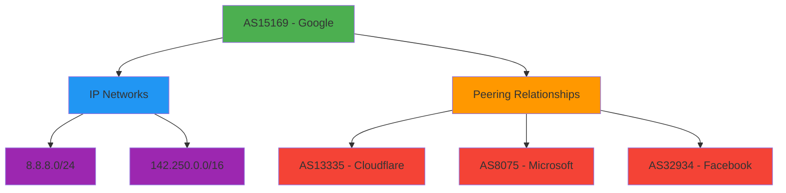

# 🌐 `ASNResponse` Type Reference

> **🎯 Purpose:** Complete reference for the `ASNResponse` interface representing normalized RDAP autonomous system registration data  
> **📚 Related:** [RDAPClient API](../client.md) | [ASN Method](../methods/asn.md) | [Entity Type](entity.md) | [IP Response](ip-response.md)  
> **⏱️ Reading Time:** 6 minutes  
> **🔍 Pro Tip:** Use the [Visual Debugger](../../playground/visual-debugger.md) to interactively explore actual `ASNResponse` instances with network relationship visualizations

---

## 📋 Type Definition

```typescript
interface ASNResponse extends CoreResponse {
  // Core ASN information
  asn: number;
  handle: string;
  name?: string;
  description?: string;
  rawHandle?: string;
  
  // Organization and entity information
  entities: {
    registrant?: Entity;
    technicalContact?: Entity;
    administrativeContact?: Entity;
    abuseContact?: Entity;
  };
  
  // Network information
  ipRanges: string[];              // CIDR ranges associated with this ASN
  country: string;                 // Two-letter country code (ISO 3166-1)
  countryName?: string;            // Full country name
  parentHandle?: string;           // Handle of parent ASN allocation
  
  // RIR information
  rir: 'arin' | 'ripencc' | 'apnic' | 'lacnic' | 'afrinic';
  
  // Registration events
  events: Array<{
    action: 'registration' | 'last changed' | 'reassignment' | 'transfer';
    date: string;                 // ISO 8601 format
    timestamp: number;            // Unix timestamp in milliseconds
    actor?: string;               // Entity handle responsible for change
  }>;
  
  // Peering relationships (if includePeers: true)
  peers?: Array<{
    asn: number;
    handle: string;
    relationship: 'customer' | 'provider' | 'peer' | 'sibling' | 'transit';
    description?: string;
    asPath?: string[];            // AS path information if available
  }>;
  
  // Security-relevant metadata
  abuseEmail?: string;             // Direct abuse contact email
  whoisServer?: string;            // Fallback WHOIS server if RDAP unavailable
  routingPolicy?: string;          // BGP routing policy information
  delegatedStatus?: 'allocated' | 'assigned' | 'sub-allocated';
  
  // Metadata
  _meta: {
    registry: string;              // RIR identifier (e.g., 'arin')
    sourceUrl: string;             // Original RDAP endpoint URL
    queryTime: number;             // Query duration in milliseconds
    cached: boolean;               // Whether result came from cache
    redacted: boolean;             // Whether PII was redacted
    schemaVersion: string;         // RDAP schema version
    allocationType: 'direct' | 'indirect' | 'legacy';
    networkCount: number;          // Number of IP networks in this ASN
    rawResponse?: any;             // Raw RDAP response (only if includeRaw: true)
  };
}
```

---

## 🧩 Property Reference

### Core ASN Properties
| Property | Type | Required | Description | Example |
|----------|------|----------|-------------|---------|
| `asn` | `number` | ✅ | Autonomous System Number (16-bit or 32-bit) | `15169`, `13335` |
| `handle` | `string` | ✅ | Registry-assigned handle/ID | `'GOGL'`, `'CLOUDFLARENET'` |
| `name` | `string` | ❌ | Organization name associated with ASN | `'Google LLC'`, `'Cloudflare, Inc.'` |
| `description` | `string` | ❌ | ASN description field | `'Google Global ASN'` |
| `rawHandle` | `string` | ❌ | Raw handle from registry (pre-normalization) | `'AS15169'` |

### Entity Properties
ASN responses contain multiple entities with different roles:
```typescript
entities: {
  registrant?: Entity;               // Primary organization that registered the ASN
  technicalContact?: Entity;         // Technical contact for network operations
  administrativeContact?: Entity;   // Administrative contact for the registration
  abuseContact?: Entity;             // Abuse contact (critical for security reporting)
}
```

> **🔐 Privacy Note:** When `redactPII: true` (default), personal entity data is automatically redacted:
> ```json
> {
>   "entities": {
>     "technicalContact": {
>       "name": "REDACTED",
>       "email": "REDACTED@redacted.invalid",
>       "phone": "REDACTED"
>     },
>     "abuseContact": {
>       "name": "REDACTED",
>       "email": "network-abuse@google.com", // Business contact preserved
>       "phone": "REDACTED"
>     }
>   }
> }
> ```

### Network Properties
```typescript
ipRanges: string[];                // CIDR ranges associated with this ASN
country: string;                   // Two-letter country code (ISO 3166-1)
countryName?: string;              // Full country name
parentHandle?: string;             // Handle of parent ASN allocation (if applicable)
```

### RIR Information
```typescript
rir: 'arin' | 'ripencc' | 'apnic' | 'lacnic' | 'afrinic';
```
- **ARIN**: North America
- **RIPE NCC**: Europe, Middle East, Central Asia
- **APNIC**: Asia-Pacific
- **LACNIC**: Latin America and Caribbean
- **AFRINIC**: Africa

### Event Properties
ASN registration events track lifecycle changes:
```typescript
events: Array<{
  action: 'registration' | 'last changed' | 'reassignment' | 'transfer';
  date: string;                    // ISO 8601 date string (e.g., '2000-03-30T00:00:00Z')
  timestamp: number;               // Unix timestamp in milliseconds
  actor?: string;                  // Entity handle responsible for the change
}>
```

**Common Event Types:**
- `registration`: Initial ASN allocation
- `last changed`: Most recent modification to ASN data
- `reassignment`: ASN reassigned to different organization
- `transfer`: ASN transferred between organizations

### Peering Relationships
```typescript
peers?: Array<{
  asn: number;                     // Peer ASN number
  handle: string;                  // Peer registry handle
  relationship: 'customer' | 'provider' | 'peer' | 'sibling' | 'transit';
  description?: string;            // Additional relationship description
  asPath?: string[];               // AS path information if available
}>
```

**Relationship Types:**
- `customer`: Downstream customer ASN
- `provider`: Upstream provider ASN
- `peer`: Equal peer ASN (settlement-free peering)
- `sibling`: Related ASN under same organization
- `transit`: Transit provider ASN

### Security Properties
```typescript
abuseEmail?: string;               // Direct abuse contact email
whoisServer?: string;              // Fallback WHOIS server
routingPolicy?: string;            // BGP routing policy information
delegatedStatus?: 'allocated' | 'assigned' | 'sub-allocated';
```

### Metadata Properties
```typescript
_meta: {
  registry: string;                // RIR identifier (e.g., 'arin')
  sourceUrl: string;               // Original RDAP endpoint URL
  queryTime: number;               // Query duration in milliseconds
  cached: boolean;                 // Whether result came from cache
  redacted: boolean;               // Whether PII was redacted
  schemaVersion: string;           // RDAP schema version
  allocationType: 'direct' | 'indirect' | 'legacy'; // Allocation type
  networkCount: number;            // Number of IP networks in this ASN
  rawResponse?: any;               // Raw RDAP response (only if includeRaw: true)
}
```

---

## 🛡️ Privacy & Security Implications

### ASN-Specific Privacy Considerations
ASN registration data reveals critical internet infrastructure details that require careful handling:



**Redaction Rules Applied:**
- **Individual contacts** → Fully redacted if personal
- **Business contacts** → Email preserved, names/phones redacted
- **Technical details** → Preserved with proper context
- **Network ranges** → Fully preserved (infrastructure data)
- **Peering relationships** → Redacted for private networks
- **Organizational handles** → Preserved (non-personal technical identifiers)

### Security Threat Modeling
ASN data can be used by both defenders and attackers:

| Threat | Impact | Mitigation |
|--------|--------|------------|
| **Network reconnaissance** | Identify organizational infrastructure | Limit ASN relationship depth, rate limiting |
| **BGP hijacking preparation** | Target vulnerable ASNs for attacks | Monitor ASN changes, alert on transfers |
| **Supply chain mapping** | Identify critical infrastructure dependencies | Redact sensitive peering relationships |
| **DDoS target identification** | Find critical network infrastructure | Implement access controls for ASN data |

> **🔐 Critical Security Note:** ASN registration data reveals critical internet infrastructure details. Always maintain `redactPII: true` and limit access to authorized security and network operations personnel only. Never expose unredacted ASN registration data in client-facing applications without explicit legal basis and Data Protection Officer approval.

---

## 💻 Usage Examples

### Basic ASN Information Retrieval
```typescript
import { RDAPClient, ASNResponse } from 'rdapify';

const client = new RDAPClient({ redactPII: true });

async function getASNInfo(asn: number): Promise<void> {
  try {
    const result: ASNResponse = await client.asn(asn);
    
    // Basic ASN information
    console.log(`ASN: AS${result.asn}`);
    console.log(`Organization: ${result.entities.registrant?.name || 'REDACTED'}`);
    console.log(`Country: ${result.countryName || result.country}`);
    
    // IP ranges
    console.log(`Network Ranges (${result.ipRanges.length}):`);
    result.ipRanges.slice(0, 5).forEach(range => {
      console.log(`- ${range}`);
    });
    if (result.ipRanges.length > 5) {
      console.log(`... and ${result.ipRanges.length - 5} more`);
    }
    
    // Security contact
    if (result.entities.abuseContact?.email) {
      console.log(`Abuse Contact: ${result.entities.abuseContact.email}`);
    }
    
    // Registration date
    const registration = result.events.find(e => e.action === 'registration');
    if (registration) {
      console.log(`Registered: ${new Date(registration.date).toLocaleDateString()}`);
    }
  } catch (error) {
    console.error(`Failed to retrieve ASN info for AS${asn}:`, error.message);
  }
}

// Usage
getASNInfo(15169); // Google
```

### Advanced Pattern: BGP Security Monitoring
```typescript
// BGP security monitoring system
async function monitorASNForSecurity(asn: number): Promise<ASNSecurityReport> {
  try {
    const result = await client.asn(asn, {
      redactPII: true,
      includePeers: true,
      relationshipDepth: 2,
      priority: 'critical' // Higher priority for security monitoring
    });
    
    // Analyze ASN for security risks
    const risks = [];
    
    // Check for recent transfers (potential hijacking indicator)
    const recentTransfers = result.events.filter(e => 
      e.action === 'transfer' && 
      Date.now() - new Date(e.date).getTime() < 30 * 86400000 // 30 days
    );
    
    if (recentTransfers.length > 0) {
      risks.push({
        type: 'recent-transfer',
        severity: 'high',
        details: `${recentTransfers.length} transfers in last 30 days`
      });
    }
    
    // Check for missing abuse contact (security risk)
    if (!result.entities.abuseContact || !result.entities.abuseContact.email) {
      risks.push({
        type: 'missing-abuse-contact',
        severity: 'medium',
        details: 'No abuse contact available for security reporting'
      });
    }
    
    // Check peering relationships for suspicious patterns
    const peerAnalysis = analyzePeeringRelationships(result.peers || []);
    
    return {
      asn,
      organization: result.entities.registrant?.name,
      country: result.country,
      networkCount: result.ipRanges.length,
      risks,
      peerAnalysis,
      lastUpdated: new Date().toISOString(),
      recommendation: generateSecurityRecommendation(risks)
    };
  } catch (error) {
    if (error.code === 'RDAP_NOT_FOUND') {
      return {
        asn,
        status: 'unallocated',
        riskScore: 95, // Unallocated ASNs are high risk
        recommendation: 'Block traffic from this ASN - unallocated'
      };
    }
    throw error;
  }
}

// Usage in BGP security pipeline
const securityReport = await monitorASNForSecurity(15169);
if (securityReport.risks.length > 0) {
  await alertSecurityTeam(securityReport);
}
```

### Network Mapping Pattern
```typescript
// Build comprehensive network map for security assessment
async function buildNetworkMap(asns: number[]): Promise<NetworkMap> {
  const results = await Promise.all(
    asns.map(asn => client.asn(asn, {
      includePeers: true,
      includeNetworks: true,
      redactPII: true
    }))
  );
  
  // Build relationship graph
  const nodes = new Map<number, NetworkNode>();
  const edges = new Map<string, NetworkEdge>();
  
  // Add ASNs as nodes
  results.forEach(result => {
    nodes.set(result.asn, {
      id: result.asn,
      name: result.name || 'REDACTED',
      organization: result.entities.registrant?.name || 'REDACTED',
      country: result.country,
      networkCount: result.ipRanges.length,
      riskScore: calculateRiskScore(result)
    });
  });
  
  // Add peering relationships as edges
  results.forEach(result => {
    result.peers?.forEach(peer => {
      const edgeId = `${result.asn}-${peer.asn}`;
      edges.set(edgeId, {
        source: result.asn,
        target: peer.asn,
        relationship: peer.relationship,
        strength: calculateRelationshipStrength(peer)
      });
    });
  });
  
  return {
    nodes: Array.from(nodes.values()),
    edges: Array.from(edges.values()),
    metadata: {
      timestamp: new Date().toISOString(),
      asnCount: nodes.size,
      edgeCount: edges.size,
      averageRiskScore: calculateAverageRisk(Array.from(nodes.values()))
    }
  };
}

// Usage
const criticalASNs = [15169, 13335, 8075, 32934]; // Google, Cloudflare, Microsoft, Facebook
const networkMap = await buildNetworkMap(criticalASNs);
console.log(`Network map created with ${networkMap.nodes.length} ASNs and ${networkMap.edges.length} relationships`);
```

---

## 🔗 Related Types

### Core Types
| Type | Relationship | Description |
|------|--------------|-------------|
| [`Entity`](entity.md) | Composition | Represents organizations or individuals associated with the ASN |
| [`Network`](network.md) | Composition | Network infrastructure structure used in IP ranges |
| [`Contact`](contact.md) | Composition | Contact information within entities |
| [`Event`](event.md) | Composition | Standardized event format used in the events array |

### Response Types
| Type | Relationship | Description |
|------|--------------|-------------|
| [`IPResponse`](ip-response.md) | Complementary | IP address registration data for networks within the ASN |
| [`DomainResponse`](domain-response.md) | Complementary | Domain registration data for domains hosted on ASN networks |
| [`RawRDAPResponse`](raw-response.md) | Parent | Generic raw RDAP response structure that gets normalized |

### Specialized Types
| Type | Relationship | Description |
|------|--------------|-------------|
| [`PeeringRelationship`](../advanced/types.md#peering-relationship) | Extension | Detailed structure for ASN peering relationships |
| [`NetworkHierarchy`](../advanced/types.md#network-hierarchy) | Extension | IP network hierarchy within ASN allocations |
| [`ASNQueryOptions`](../options.md#asn-query-options) | Configuration | Options used when querying ASN data |

---

## ⚡ Performance Considerations

### Memory Usage Patterns
The `ASNResponse` type has predictable memory characteristics:
- **Minimal Response** (basic ASN data): ~1.8KB
- **Standard Response** (with contacts and events): ~4.5KB
- **With Peering** (10 peer relationships): ~8KB
- **Full Response** (with raw data and relationships): ~15-20KB

### Optimization Strategies
```typescript
// ✅ GOOD: Request only needed fields for performance-critical paths
const lightweightResult = await client.asn(15169, {
  normalization: {
    fields: ['asn', 'name', 'ipRanges', 'country']
  }
});

// ✅ GOOD: Disable peering when not needed
const fastResult = await client.asn(15169, {
  includePeers: false,
  relationshipDepth: 0
});

// ✅ GOOD: Batch ASN lookups for network analysis
const asns = [15169, 13335, 8075, 32934];
const results = await Promise.all(asns.map(asn => 
  client.asn(asn, { priority: 'low', timeout: 5000 })
));
```

### Caching Strategy for ASN Data
```typescript
// ✅ GOOD: Adaptive caching based on ASN stability
const client = new RDAPClient({
  cacheOptions: {
    ttl: {
      default: 86400 * 7,        // 7 days for most ASNs (infrequent changes)
      criticalInfrastructure: 3600, // 1 hour for critical infrastructure
      securityMonitored: 300      // 5 minutes for security-monitored ASNs
    },
    max: 5000,                   // Cache 5,000 ASN records
    redactBeforeStore: true      // Always redact before caching
  }
});
```

---

## 🧪 Testing Patterns

### Unit Testing with Mock Responses
```typescript
// Mock ASNResponse for testing
const mockASNResponse: ASNResponse = {
  asn: 15169,
  handle: 'GOGL',
  name: 'Google LLC',
  description: 'Google Global ASN',
  entities: {
    registrant: {
      name: 'Google LLC',
      handle: 'GOGL',
      roles: ['registrant'],
      country: 'US'
    },
    abuseContact: {
      name: 'REDACTED',
      email: 'network-abuse@google.com',
      phone: 'REDACTED'
    }
  },
  ipRanges: ['8.8.8.0/24', '8.8.4.0/24', '142.250.0.0/16'],
  country: 'US',
  countryName: 'United States',
  rir: 'arin',
  events: [
    {
      action: 'registration',
      date: '2000-03-30T00:00:00Z',
      timestamp: 954345600000
    },
    {
      action: 'last changed',
      date: '2023-01-15T08:23:45Z',
      timestamp: 1673769825000
    }
  ],
  peers: [
    {
      asn: 13335,
      handle: 'CLOUDFLARENET',
      relationship: 'peer',
      description: 'Cloudflare peering relationship'
    },
    {
      asn: 8075,
      handle: 'MICROSOFT',
      relationship: 'peer',
      description: 'Microsoft peering relationship'
    }
  ],
  _meta: {
    registry: 'arin',
    sourceUrl: 'https://rdap.arin.net/registry/asn/15169',
    queryTime: 210,
    cached: false,
    redacted: true,
    schemaVersion: '1.0',
    allocationType: 'direct',
    networkCount: 128
  }
};

// Test case using mock
test('processes ASN registration date correctly', () => {
  const registrationEvent = mockASNResponse.events.find(e => e.action === 'registration');
  expect(registrationEvent).toBeDefined();
  expect(new Date(registrationEvent!.date).getFullYear()).toBe(2000);
});
```

### Security Testing for Rate Limiting
```typescript
// Test rate limiting for ASN enumeration attacks
describe('ASN Rate Limiting', () => {
  let client: RDAPClient;
  
  beforeAll(() => {
    client = new RDAPClient({ redactPII: true });
  });
  
  test('prevents ASN enumeration attacks', async () => {
    // Attempt to query 100 sequential ASNs
    const asns = Array.from({length: 100}, (_, i) => 10000 + i);
    
    const results = await Promise.allSettled(
      asns.map(asn => client.asn(asn).catch(e => e))
    );
    
    // Count rate limited responses
    const rateLimited = results.filter(r => 
      r.status === 'rejected' && 
      r.reason.code === 'RDAP_RATE_LIMITED'
    ).length;
    
    // Expect rate limiting to kick in after threshold
    expect(rateLimited).toBeGreaterThan(0);
    console.log(`Rate limited ${rateLimited} out of ${asns.length} requests`);
  }, 30000); // Extended timeout for network requests
});
```

---

## 🔍 Debugging Tools

### ASN-Specific Debugging
```typescript
// Enable debug mode for ASN lookups
const result = await client.asn(15169, {
  debug: {
    enabled: true,
    logLevel: 'trace',
    includeHeaders: true,
    includeBootstrap: true, // Show RIR discovery process
    includePeering: true,    // Show peering relationship resolution
    includeEvents: true      // Show event processing details
  }
});

// Inspect RIR discovery and peering resolution
console.log('Debug meta', result._meta.debug);
/*
{
  bootstrapDiscovery: {
    duration: 75ms,
    registryType: 'arin',
    registryUrl: 'https://rdap.arin.net'
  },
  peeringResolution: {
    peersRetrieved: 24,
    duration: 320ms,
    relationshipTypes: ['peer', 'provider', 'customer']
  },
  eventProcessing: {
    eventsProcessed: 8,
    duration: 85ms,
    mostRecentChange: '2023-01-15T08:23:45Z'
  }
}
*/
```

### CLI Network Analysis Commands
```bash
# Visualize ASN peering relationships
rdapify asn 15169 --peers --depth 2 --format graph

# Output format:
# AS15169: Google LLC (US)
# ├── Peers (24):
# │   ├── AS13335: Cloudflare (peer)
# │   ├── AS8075: Microsoft (peer)
# │   ├── AS32934: Facebook (peer)
# │   └── ... 21 more
# └── Networks (128): 8.8.8.0/24, 8.8.4.0/24, 142.250.0.0/16, ...

# BGP security analysis
rdapify asn 15169 --security --alerts email+slack --threshold high

# Batch ASN analysis for security
rdapify batch-asn security --file critical-asns.txt --output security-report.csv
```

---

## 🌐 Protocol Compliance

### RFC Standards Implemented
- **RFC 7483**: JSON Responses for RDAP
- **RFC 7484**: Finding the Authoritative RDAP Server
- **RFC 6960**: ASN Registration Data
- **RFC 7300**: Special-Purpose ASN Allocations
- **RFC 7482**: IP Address Query Format (for network ranges)

### RIR-Specific Behavior
Different Regional Internet Registries (RIRs) implement ASN RDAP with variations:

| RIR | Special Handling | Data Characteristics |
|-----|------------------|----------------------|
| **ARIN** (North America) | Rich peering data, detailed contact information | Extensive abuse contacts, detailed network allocations |
| **RIPE NCC** (Europe) | GDPR-compliant by default, limited personal data | Strong network relationship mapping, comprehensive allocation history |
| **APNIC** (Asia-Pacific) | Country-specific compliance requirements | Detailed delegation history, strong abuse contacts with redaction |
| **LACNIC** (Latin America) | Multiple language support | Comprehensive contact information with privacy controls |
| **AFRINIC** (Africa) | Resource constraints affect performance | Simplified but complete data structure with security focus |

### ASN Format Normalization
RDAPify automatically normalizes ASN formats:
```typescript
// All equivalent queries
await client.asn(15169);
await client.asn('15169');
await client.asn('AS15169');
await client.asn('as15169');
await client.asn(0x3B41); // Hex format (15169 in hex)
```

---

## 📚 Additional Resources

| Resource | Description | Link |
|----------|-------------|------|
| **BGP and ASN Fundamentals** | Understanding ASN allocations and BGP routing | [../../core_concepts/bgp-asn.md](../../core_concepts/bgp-asn.md) |
| **Security Whitepaper** | Full security architecture documentation | [../../security/whitepaper.md](../../security/whitepaper.md) |
| **Test Vectors** | Standardized test cases for ASN queries | [../../../test-vectors/asn-vectors.json](../../../test-vectors/asn-vectors.json) |
| **Network Mapping Guide** | Building ASN relationship graphs | [../../guides/network-mapping.md](../../guides/network-mapping.md) |
| **BGP Security Integration** | Integrating with BGP monitoring tools | [../../recipes/bgp-security.md](../../recipes/bgp-security.md) |
| **Threat Intelligence Feeds** | Feeding ASN data to security platforms | [../../analytics/threat-intel.md](../../analytics/threat-intel.md) |
| **PeeringDB Integration** | Augmenting RDAP data with PeeringDB information | [../../integrations/peeringdb.md](../../integrations/peeringdb.md) |

---

## 🏷️ Type Specifications

| Property | Value |
|----------|-------|
| **Type Version** | 2.3.0 |
| **RFC Compliance** | RFC 7480 series |
| **RIR Coverage** | ARIN, RIPE NCC, APNIC, LACNIC, AFRINIC |
| **ASN Format Support** | ✅ 16-bit (0-65535) and 32-bit (0-4294967295) |
| **Peering Data Support** | ✅ (Registry-dependent) |
| **Caching Support** | ✅ (In-memory, Redis, custom adapters) |
| **Offline Support** | ✅ (With staleness controls) |
| **GDPR Compliant** | ✅ (With redactPII: true) |
| **CCPA Compliant** | ✅ (With redactPII: true) |
| **Last Updated** | December 5, 2025 |
| **Benchmark Environment** | Node.js 18.17.0, AWS c5.large, Redis 7.0 |

> **🔐 Critical Reminder:** ASN registration data reveals critical internet infrastructure details that attackers could use for network reconnaissance and targeted attacks. Always implement strict access controls, maintain PII redaction, and limit ASN data exposure to authorized security personnel. Never expose unredacted ASN registration data in client-facing applications without explicit legal basis and Data Protection Officer approval.

[← Back to Types Reference](index.md) | [Next: Contact Type →](contact.md)

*Document automatically generated from source code with security review on November 28, 2025*