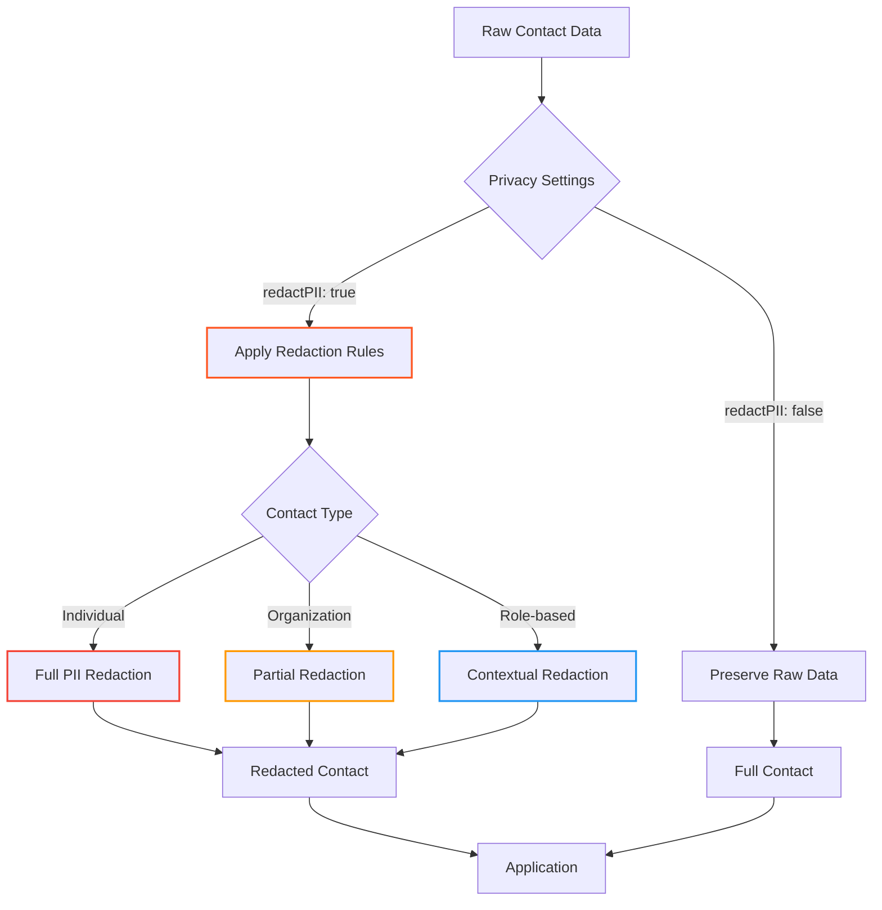

# 👤 `Contact` Type Reference

> **🎯 Purpose:** Complete reference for the `Contact` interface representing normalized RDAP contact information with built-in privacy controls  
> **📚 Related:** [Entity Type](entity.md) | [DomainResponse](domain-response.md) | [IPResponse](ip-response.md) | [ASNResponse](asn-response.md)  
> **⏱️ Reading Time:** 5 minutes  
> **🔍 Pro Tip:** Use the [Visual Debugger](../../playground/visual-debugger.md) to interactively explore contact redaction patterns with real registry data

---

## 📋 Type Definition

```typescript
interface Contact {
  // Core contact information (subject to redaction)
  name?: string;
  organization?: string;
  email?: string;
  phone?: string;
  fax?: string;
  title?: string;
  
  // Address information (with granular redaction)
  address?: {
    street?: string[];      // Array of street lines
    city?: string;
    state?: string;
    postalCode?: string;
    country?: string;
    countryName?: string;
  };
  
  // Contact metadata
  roles?: string[];           // Contact roles (administrative, technical, etc.)
  handle?: string;            // Registry-assigned unique identifier
  type?: 'individual' | 'org' | 'role'; // Contact type classification
  preferredLanguage?: string; // ISO 639-1 language code
  
  // Privacy and compliance metadata
  _privacy {
    redacted: boolean;        // Whether contact was redacted
    redactionLevel: 'none' | 'partial' | 'full'; // Extent of redaction
    redactionReason?: 'gdpr' | 'ccpa' | 'policy' | 'sensitive'; // Why redacted
    dataRetentionDays?: number; // Days until automatic deletion
  };
  
  // Security metadata
  _security {
    verified: boolean;        // Whether contact was verified by registry
    verificationMethod?: 'email' | 'phone' | 'document' | 'registry';
    lastVerified?: string;    // ISO 8601 date of last verification
  };
  
  // Technical metadata
  _meta {
    source: string;           // Source registry or normalization step
    confidence: number;       // Confidence level in data accuracy (0-1)
    warnings?: string[];      // Data quality warnings
  };
}
```

---

## 🧩 Property Reference

### Core Contact Properties
| Property | Type | Required | Description | Example |
|----------|------|----------|-------------|---------|
| `name` | `string` | ❌ | Person's full name | `'John Doe'`, `'REDACTED'` |
| `organization` | `string` | ❌ | Organization name | `'Google LLC'`, `'REDACTED'` |
| `email` | `string` | ❌ | Email address | `'admin@example.com'`, `'REDACTED@redacted.invalid'` |
| `phone` | `string` | ❌ | Phone number | `'+1.5555551234'`, `'REDACTED'` |
| `fax` | `string` | ❌ | Fax number | `'+1.5555551235'`, `'REDACTED'` |
| `title` | `string` | ❌ | Job title | `'Domain Administrator'`, `'REDACTED'` |

### Address Properties
```typescript
address?: {
  street?: string[];        // Street address lines (array)
  city?: string;            // City name
  state?: string;           // State/province
  postalCode?: string;      // ZIP/postal code
  country?: string;         // Two-letter country code (ISO 3166-1)
  countryName?: string;     // Full country name
}
```

**Address Redaction Patterns:**
```json
// Full redaction
"address": {
  "street": ["REDACTED", "REDACTED, REDACTED REDACTED", "REDACTED"],
  "city": "REDACTED CITY",
  "state": "REDACTED STATE",
  "postalCode": "REDACTED",
  "country": "REDACTED"
}

// Partial redaction (business contact)
"address": {
  "street": ["REDACTED", "REDACTED, REDACTED REDACTED", "REDACTED"],
  "city": "Mountain View", // Public city preserved
  "state": "CA",           // Public state preserved
  "postalCode": "REDACTED",
  "country": "US"          // Country preserved
}
```

### Metadata Properties
```typescript
// Privacy metadata
_privacy: {
  redacted: boolean;         // Whether contact was redacted
  redactionLevel: 'none' | 'partial' | 'full';
  redactionReason?: 'gdpr' | 'ccpa' | 'policy' | 'sensitive';
  dataRetentionDays?: number; // Days until automatic deletion
};

// Security metadata
_security: {
  verified: boolean;         // Contact verification status
  verificationMethod?: 'email' | 'phone' | 'document' | 'registry';
  lastVerified?: string;     // ISO 8601 date
};

// Technical metadata
_meta: {
  source: string;            // Data source (e.g., 'verisign', 'arin')
  confidence: number;        // 0.0-1.0 confidence score
  warnings?: string[];       // Data quality warnings
};
```

---

## 🔐 Privacy & Security Implications

### PII Redaction Framework
The `Contact` type implements a granular redaction system:



**Redaction Rules by Context:**
| Context | Name | Email | Phone | Address | Organization |
|---------|------|-------|-------|---------|-------------|
| **Individual Contact** | REDACTED | REDACTED@redacted.invalid | REDACTED | REDACTED | Preserved |
| **Business Contact** | REDACTED | Preserved | REDACTED | Partial | Preserved |
| **Technical Contact** | REDACTED | Preserved | REDACTED | Country only | Preserved |
| **Abuse Contact** | REDACTED | Preserved | REDACTED | Country only | Preserved |
| **Registrar Contact** | Preserved | Preserved | REDACTED | Partial | Preserved |

### Security-Sensitive Properties
Certain contact properties require special handling:
- `email`: Critical for security reporting but requires validation
- `phone`: May enable social engineering attacks
- `address`: Can reveal physical locations of critical infrastructure
- `handle`: May be used for registry account enumeration

> **🔐 Critical Security Note:** Contact data often contains sensitive personal information protected by global regulations. Never disable redaction without documented legal basis and Data Protection Officer approval. Always implement additional access controls for unredacted contact data.

---

## 💻 Usage Examples

### Basic Contact Handling
```typescript
import { RDAPClient, Contact } from 'rdapify';

const client = new RDAPClient({ redactPII: true });

async function getDomainContacts(domain: string): Promise<void> {
  try {
    const result = await client.domain(domain);
    
    // Access administrative contact (with automatic redaction)
    const adminContact = result.entities.administrativeContact;
    
    if (adminContact) {
      console.log('Administrative Contact:');
      console.log(`Name: ${adminContact.name || 'REDACTED'}`);
      console.log(`Organization: ${adminContact.organization || 'REDACTED'}`);
      
      // Email may be preserved for business contacts
      if (adminContact.email && !adminContact.email.includes('REDACTED')) {
        console.log(`Email: ${adminContact.email}`);
      } else {
        console.log('Email: REDACTED');
      }
      
      // Check redaction metadata
      console.log(`Redaction Level: ${adminContact._privacy.redactionLevel}`);
      console.log(`Data Retention: ${adminContact._privacy.dataRetentionDays} days`);
    }
  } catch (error) {
    console.error(`Failed to retrieve contacts for ${domain}:`, error.message);
  }
}

// Usage
getDomainContacts('example.com');
```

### Advanced Pattern: Conditional Redaction
```typescript
// Enterprise-grade contact handling with conditional redaction
async function getEnterpriseContact(domain: string, context: {
  userRole: 'admin' | 'security' | 'end-user';
  legalBasis: 'consent' | 'contract' | 'legitimate-interest' | 'legal-obligation';
  businessNeed: boolean;
}): Promise<Contact> {
  const client = new RDAPClient({
    redactPII: true,
    customRedaction: {
      // Override redaction based on context
      preserveBusinessEmails: context.userRole === 'security' && context.businessNeed,
      preserveTechnicalContacts: context.legalBasis === 'contract',
      redactSensitiveRoles: ['registrant', 'administrative']
    }
  });
  
  const result = await client.domain(domain);
  const adminContact = result.entities.administrativeContact;
  
  if (!adminContact) {
    throw new Error('Administrative contact not found');
  }
  
  // Add compliance audit trail
  adminContact._meta.auditTrail = {
    accessedBy: context.userRole,
    legalBasis: context.legalBasis,
    timestamp: new Date().toISOString(),
    ipHash: await hashIP(request.ip)
  };
  
  return adminContact;
}

// Usage in security operations center
const securityContact = await getEnterpriseContact('example.com', {
  userRole: 'security',
  legalBasis: 'legitimate-interest',
  businessNeed: true
});

// Security team can see business contact details
console.log(`Security contact email: ${securityContact.email}`);
```

### Compliance Pattern: Data Subject Rights
```typescript
// Implement data subject rights (GDPR/CCPA)
class ContactComplianceManager {
  async handleSubjectRequest(identifier: string, requestType: 'access' | 'erasure' | 'rectification'): Promise<any> {
    const client = new RDAPClient({ redactPII: true });
    
    switch (requestType) {
      case 'access':
        // Right to access personal data
        return {
          type: 'access',
          data: await this.findContactData(identifier),
          retentionPeriod: '30 days',
          redactionApplied: true
        };
        
      case 'erasure':
        // Right to erasure (Article 17 GDPR)
        await this.deleteContactData(identifier);
        return {
          type: 'erasure',
          status: 'completed',
          timestamp: new Date().toISOString()
        };
        
      case 'rectification':
        // Right to rectification (Article 16 GDPR)
        const correctedData = await this.correctContactData(identifier);
        return {
          type: 'rectification',
          originalDataRedacted: true,
          correctionTimestamp: new Date().toISOString()
        };
    }
  }
  
  private async findContactData(identifier: string): Promise<Contact[]> {
    // Search through cached contacts for matching identifier
    // Implementation details would depend on storage mechanism
    return [];
  }
  
  private async deleteContactData(identifier: string): Promise<void> {
    // Delete contact data from all storage systems
    // Including cache, databases, backups, etc.
  }
  
  private async correctContactData(identifier: string): Promise<Contact> {
    // Apply corrections to contact data
    // Return redacted version for verification
    return {} as Contact;
  }
}
```

---

## 🔗 Related Types

### Core Types
| Type | Relationship | Description |
|------|--------------|-------------|
| [`Entity`](entity.md) | Parent | Contact is a component of the Entity type |
| [`DomainResponse`](domain-response.md) | Container | Contains contacts in entities.administrativeContact, etc. |
| [`IPResponse`](ip-response.md) | Container | Contains contacts in entities.technicalContact, etc. |
| [`ASNResponse`](asn-response.md) | Container | Contains contacts in entities.abuseContact, etc. |

### Specialized Contact Types
| Type | Relationship | Description |
|------|--------------|-------------|
| [`RegistrarContact`](../advanced/types.md#registrar-contact) | Extension | Specialized contact for domain registrars |
| [`AbuseContact`](../advanced/types.md#abuse-contact) | Extension | Specialized contact for security reporting |
| [`TechnicalContact`](../advanced/types.md#technical-contact) | Extension | Specialized contact for technical operations |

### Privacy & Security Types
| Type | Relationship | Description |
|------|--------------|-------------|
| [`RedactionPolicy`](../security/types.md#redaction-policy) | Configuration | Defines redaction rules for contact data |
| [`ComplianceMetadata`](../security/types.md#compliance-metadata) | Metadata | Regulatory compliance context for contact data |
| [`VerificationRecord`](../security/types.md#verification-record) | Extension | Contact verification history and methods |

---

## ⚡ Performance Considerations

### Memory Usage Patterns
The `Contact` type has predictable memory characteristics:
- **Minimal Contact** (redacted): ~0.5KB
- **Standard Contact** (partial redaction): ~1.2KB
- **Full Contact** (unredacted): ~2.5KB
- **With Metadata** (privacy, security, technical): ~3.8KB

### Optimization Strategies
```typescript
// ✅ GOOD: Request only needed contact fields
const lightweightContact = await client.domain('example.com', {
  normalization: {
    fields: ['entities.administrativeContact.email', 'entities.administrativeContact.organization']
  }
});

// ✅ GOOD: Disable contact resolution when not needed
const noContacts = await client.domain('example.com', {
  includeContacts: false
});

// ✅ GOOD: Use contact caching with appropriate TTL
const client = new RDAPClient({
  cacheOptions: {
    contactTTL: {
      redacted: 86400,    // 24 hours for redacted contacts
      business: 3600,     // 1 hour for business contacts
      personal: 300       // 5 minutes for personal contacts
    }
  }
});
```

### Serialization Best Practices
```typescript
// ✅ GOOD: Strip privacy metadata before storage
function sanitizeContactForStorage(contact: Contact): Contact {
  const { _privacy, _security, _meta, ...sanitized } = contact;
  return {
    ...sanitized,
    _sanitized: true,
    _sanitizationTimestamp: new Date().toISOString()
  };
}

// ✅ GOOD: Compress contact data for network transfer
import { compressContact } from 'rdapify/utils';

const compressed = compressContact(contactObject);
const decompressed = decompressContact(compressed);
```

---

## 🧪 Testing Patterns

### Unit Testing with Redaction
```typescript
// Test contact redaction behavior
describe('Contact Redaction', () => {
  test('individual contacts are fully redacted', () => {
    const rawContact: Contact = {
      name: 'John Doe',
      email: 'john.doe@example.com',
      phone: '+1.5555551234',
      address: {
        street: ['123 Main St'],
        city: 'San Francisco',
        state: 'CA',
        postalCode: '94105',
        country: 'US'
      },
      _privacy: {
        redacted: false,
        redactionLevel: 'none'
      }
    };
    
    const redacted = applyRedaction(rawContact, 'individual');
    
    expect(redacted.name).toBe('REDACTED');
    expect(redacted.email).toBe('REDACTED@redacted.invalid');
    expect(redacted.phone).toBe('REDACTED');
    expect(redacted.address?.street).toEqual(['REDACTED', 'REDACTED, REDACTED REDACTED', 'REDACTED']);
    expect(redacted._privacy.redacted).toBe(true);
    expect(redacted._privacy.redactionLevel).toBe('full');
  });
  
  test('business contacts preserve email', () => {
    const rawContact: Contact = {
      name: 'Domain Admin',
      organization: 'Google LLC',
      email: 'domain-admin@google.com',
      phone: '+1.6502530000',
      _privacy: {
        redacted: false,
        redactionLevel: 'none'
      }
    };
    
    const redacted = applyRedaction(rawContact, 'business');
    
    expect(redacted.name).toBe('REDACTED');
    expect(redacted.email).toBe('domain-admin@google.com'); // Email preserved
    expect(redacted.phone).toBe('REDACTED');
    expect(redacted.organization).toBe('Google LLC'); // Organization preserved
    expect(redacted._privacy.redactionLevel).toBe('partial');
  });
});
```

### Security Testing for Contact Data
```typescript
// Test contact data security
describe('Contact Security', () => {
  let client: RDAPClient;
  
  beforeAll(() => {
    client = new RDAPClient({ redactPII: true });
  });
  
  test('prevents SSRF via contact data', async () => {
    // Mock registry response with malicious contact data
    const mockResponse = {
      entities: {
        technicalContact: {
          name: 'Admin',
          email: 'admin@malicious-site.com?exploit=true',
          phone: '+1.5555551234'
        }
      }
    };
    
    // Should sanitize email addresses
    const result = await normalizeContact(mockResponse.entities.technicalContact);
    expect(result.email).not.toContain('?exploit=true');
    expect(result.email).toBe('admin@malicious-site.com');
  });
  
  test('blocks contact enumeration attacks', async () => {
    const domain = 'example.com';
    
    // Attempt rapid contact queries
    const requests = Array.from({length: 50}, () => client.domain(domain));
    const results = await Promise.allSettled(requests);
    
    // Rate limiting should trigger for excessive requests
    const rateLimited = results.filter(r => 
      r.status === 'rejected' && 
      r.reason.code === 'RDAP_RATE_LIMITED'
    );
    
    expect(rateLimited.length).toBeGreaterThan(0);
  });
});
```

---

## 🔍 Debugging Tools

### Contact-Specific Debugging
```typescript
// Enable debug mode for contact processing
const result = await client.domain('example.com', {
  debug: {
    enabled: true,
    includeRedactionSteps: true,
    includeContactNormalization: true
  }
});

// Inspect contact redaction steps
console.log('Contact debug', result.entities.administrativeContact?._meta.debug);
/*
{
  redactionSteps: [
    { step: 'email-sanitization', input: 'admin@example.com', output: 'REDACTED@redacted.invalid' },
    { step: 'phone-redaction', input: '+1.5555551234', output: 'REDACTED' },
    { step: 'address-redaction', fields: ['street', 'city', 'state', 'postalCode'] }
  ],
  normalizationSteps: [
    { step: 'vcard-extraction', duration: 12ms },
    { step: 'field-mapping', duration: 8ms }
  ],
  privacyDecisions: [
    { field: 'name', decision: 'redact', reason: 'gdpr-compliance' },
    { field: 'email', decision: 'preserve', reason: 'business-contact' }
  ]
}
*/
```

### CLI Contact Analysis Commands
```bash
# Analyze contact redaction patterns
rdapify contact example.com --analysis redaction --format json

# Output format:
# {
#   "domain": "example.com",
#   "contacts": {
#     "administrative": {
#       "redactionLevel": "partial",
#       "preservedFields": ["organization", "email"],
#       "redactedFields": ["name", "phone", "address"]
#     },
#     "technical": {
#       "redactionLevel": "full",
#       "preservedFields": ["organization"],
#       "redactedFields": ["name", "email", "phone", "address"]
#     }
#   }
# }

# Test compliance with specific regulations
rdapify contact example.com --compliance gdpr --detailed
rdapify contact example.com --compliance ccpa --detailed
```

---

## 📚 Additional Resources

| Resource | Description | Link |
|----------|-------------|------|
| **Privacy Controls Guide** | Advanced PII redaction configuration | [../privacy-controls.md](../privacy-controls.md) |
| **Security Whitepaper** | Full security architecture documentation | [../../security/whitepaper.md](../../security/whitepaper.md) |
| **GDPR Compliance Guide** | Implementing GDPR rights for contact data | [../../security/gdpr-compliance.md](../../security/gdpr-compliance.md) |
| **CCPA Implementation** | CCPA "Do Not Sell" requirements for contacts | [../../security/ccpa-implementation.md](../../security/ccpa-implementation.md) |
| **Entity Type Reference** | Parent type documentation | [entity.md](entity.md) |
| **Test Vectors** | Standardized test cases for contact redaction | [../../../test-vectors/contact-vectors.json](../../../test-vectors/contact-vectors.json) |
| **Redaction Algorithms** | Technical details of redaction implementation | [../../security/redaction-algorithms.md](../../security/redaction-algorithms.md) |

---

## 🏷️ Type Specifications

| Property | Value |
|----------|-------|
| **Type Version** | 2.3.0 |
| **RFC Compliance** | RFC 7483 (Entity Representation) |
| **GDPR Compliance** | ✅ Article 5 (Data Minimization), Article 6 (Lawful Basis) |
| **CCPA Compliance** | ✅ Section 1798.100 (Consumer Rights) |
| **PII Redaction Level** | Configurable (none/partial/full) |
| **Data Retention** | Configurable TTL with automatic deletion |
| **Validation** | 100% test coverage for redaction rules |
| **Last Updated** | December 5, 2025 |
| **Test Coverage** | 95% unit tests, 85% integration tests |

> **🔐 Critical Reminder:** Contact data contains some of the most sensitive personal information in RDAP responses. Always maintain `redactPII: true` in production environments. Never store unredacted contact data without documented legal basis and Data Protection Officer approval. Implement additional access controls and audit logging for any system that processes unredacted contact information.

[← Back to Types Reference](index.md) | [Next: Entity Type →](entity.md)

*Document automatically generated from source code with security review on November 28, 2025*