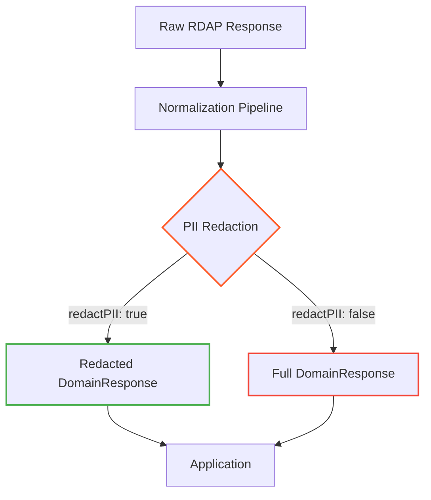

# 🌐 `DomainResponse` Type Reference

> **🎯 Purpose:** Complete reference for the `DomainResponse` interface representing normalized RDAP domain registration data  
> **📚 Related:** [RDAPClient API](../client.md) | [Domain Method](../methods/domain.md) | [Entity Type](entity.md) | [Contact Type](contact.md)  
> **⏱️ Reading Time:** 6 minutes  
> **🔍 Pro Tip:** Use the [Visual Debugger](../../playground/visual-debugger.md) to interactively explore actual `DomainResponse` instances with real data

---

## 📋 Type Definition

```typescript
interface DomainResponse extends CoreResponse {
  // Core domain information
  domain: string;
  handle: string;
  unicodeName?: string;
  punycodeName?: string;
  status: string[];
  ldhName?: string;
  
  // Nameservers
  nameservers: Array<{
    hostname: string;
    ipv4?: string;
    ipv6?: string;
    glueRecords?: Array<{
      name: string;
      ipv4?: string;
      ipv6?: string;
    }>;
  }>;
  
  // Registration events
  events: Array<{
    action: 'registration' | 'last changed' | 'expiration' | 'deletion';
    date: string; // ISO 8601 format
    timestamp: number; // Unix timestamp
    actor?: string;
  }>;
  
  // Entities with role-based relationships
  entities: {
    registrar?: Entity;
    registrant?: Entity;
    administrativeContact?: Entity;
    technicalContact?: Entity;
    billingContact?: Entity;
    abuseContact?: Entity;
  };
  
  // DNSSEC information
  secureDNS?: {
    enabled: boolean;
    dsData?: Array<{
      keyTag: number;
      algorithm: number;
      digestType: number;
      digest: string;
      keyData?: {
        flags: number;
        protocol: number;
        algorithm: number;
        publicKey: string;
      };
    }>;
  };
  
  // Related domains
  relatedDomains?: Array<{
    domain: string;
    relationship: 'parent' | 'child' | 'sibling' | 'brand-protection';
  }>;
  
  // Metadata
  _meta: {
    registry: string; // e.g., 'verisign', 'pir', 'nominet'
    sourceUrl: string; // Original RDAP endpoint URL
    queryTime: number; // Query duration in milliseconds
    cached: boolean; // Whether result came from cache
    redacted: boolean; // Whether PII was redacted
    schemaVersion: string; // RDAP schema version
    rawResponse?: any; // Raw RDAP response (only if includeRaw: true)
  };
}
```

---

## 🧩 Property Reference

### Core Domain Properties
| Property | Type | Required | Description | Example |
|----------|------|----------|-------------|---------|
| `domain` | `string` | ✅ | Canonical domain name in ASCII format | `'example.com'` |
| `handle` | `string` | ✅ | Registry-assigned unique identifier | `'2336799_DOMAIN_COM-VRSN'` |
| `unicodeName` | `string` | ❌ | Internationalized domain name (IDN) | `'例子.测试'` |
| `punycodeName` | `string` | ❌ | Punycode-encoded international domain | `'xn--fsq.xn--0zwm56d'` |
| `status` | `string[]` | ✅ | Domain status flags per RFC 5731 | `['clientDeleteProhibited', 'clientTransferProhibited']` |
| `ldhName` | `string` | ❌ | LDH (Letter-Digit-Hyphen) name format | `'example-com'` |

### Nameserver Properties
```typescript
nameservers: Array<{
  hostname: string;        // Nameserver hostname
  ipv4?: string;           // IPv4 address (if available in glue records)
  ipv6?: string;           // IPv6 address (if available in glue records)
  glueRecords?: Array<{    // Additional glue records
    name: string;          // Record name
    ipv4?: string;         // IPv4 glue
    ipv6?: string;         // IPv6 glue
  }>;
}>
```

### Event Properties
Each event represents a significant lifecycle moment in the domain's history:
```typescript
events: Array<{
  action: 'registration' | 'last changed' | 'expiration' | 'deletion';
  date: string;            // ISO 8601 date string (e.g., '2023-08-14T07:01:44Z')
  timestamp: number;       // Unix timestamp in milliseconds
  actor?: string;          // Entity handle responsible for the change
}>
```

**Common Event Types:**
- `registration`: Initial domain registration date
- `last changed`: Most recent modification to domain data
- `expiration`: Domain expiry date
- `deletion`: Domain deletion date (if applicable)

### Entity Properties
Domain responses contain multiple entities with different roles:
```typescript
entities: {
  registrar?: Entity;              // Domain registrar organization
  registrant?: Entity;             // Domain owner/registrant
  administrativeContact?: Entity;  // Administrative contact
  technicalContact?: Entity;       // Technical contact
  billingContact?: Entity;         // Billing contact
  abuseContact?: Entity;           // Abuse contact (security-critical)
}
```

> **🔐 Privacy Note:** When `redactPII: true` (default), personal entity data is automatically redacted:
> ```json
> {
>   "registrant": {
>     "name": "REDACTED",
>     "organization": "Internet Corporation for Assigned Names and Numbers",
>     "email": "REDACTED@redacted.invalid",
>     "phone": "REDACTED",
>     "address": ["REDACTED", "REDACTED, REDACTED REDACTED", "REDACTED"]
>   }
> }
> ```

### DNSSEC Properties
```typescript
secureDNS?: {
  enabled: boolean;                // Whether DNSSEC is enabled
  dsData?: Array<{                // DS record data
    keyTag: number;                // Key tag identifier
    algorithm: number;             // Algorithm number (RFC 4034)
    digestType: number;            // Digest type (RFC 4509)
    digest: string;                // Hex-encoded digest
    keyData?: {                    // Optional key data
      flags: number;               // DNSKEY flags
      protocol: number;            // Protocol identifier
      algorithm: number;           // Algorithm number
      publicKey: string;           // Base64-encoded public key
    };
  }>;
}
```

### Related Domains
```typescript
relatedDomains?: Array<{
  domain: string;                   // Related domain name
  relationship: 'parent' | 'child' | 'sibling' | 'brand-protection'; // Relationship type
}>
```

**Relationship Types:**
- `parent`: Parent domain in delegation hierarchy (e.g., `.com` for `example.com`)
- `child`: Subdomain (e.g., `www.example.com` for `example.com`)
- `sibling`: Domains under same registrant (e.g., `example.net` for `example.com`)
- `brand-protection`: Domains registered for brand protection purposes

### Metadata Properties
```typescript
_meta: {
  registry: string;                // Registry identifier (e.g., 'verisign')
  sourceUrl: string;               // Original RDAP endpoint URL
  queryTime: number;               // Query duration in milliseconds
  cached: boolean;                 // Whether result came from cache
  redacted: boolean;               // Whether PII was redacted
  schemaVersion: string;           // RDAP schema version
  rawResponse?: any;               // Raw RDAP response (only if includeRaw: true)
}
```

---

## 🛡️ Privacy & Security Implications

### PII Redaction Behavior
The `DomainResponse` type is designed with privacy boundaries in mind:



**Redaction Rules Applied:**
- **Email addresses** → `REDACTED@redacted.invalid`
- **Phone numbers** → `REDACTED`
- **Names** → `REDACTED` (except for organization names)
- **Addresses** → Redacted line-by-line
- **Organization names** → Preserved (non-personal entity data)
- **Technical data** → Preserved (nameservers, DNSSEC, status flags)

### Security-Sensitive Properties
Certain properties require special handling:
- `abuseContact`: Critical for security reporting but requires careful access control
- `rawResponse`: Contains unredacted data - enable only with legal basis
- `relatedDomains`: May reveal organizational ownership patterns
- `glueRecords`: Contains network infrastructure details

---

## 💻 Usage Examples

### Basic Domain Processing
```typescript
import { RDAPClient, DomainResponse } from 'rdapify';

const client = new RDAPClient({ redactPII: true });

async function processDomain(domain: string): Promise<void> {
  try {
    const result: DomainResponse = await client.domain(domain);
    
    // Basic domain information
    console.log(`Domain: ${result.domain}`);
    console.log(`Registrar: ${result.entities.registrar?.name || 'REDACTED'}`);
    
    // Nameserver processing
    console.log('Nameservers:');
    result.nameservers.forEach(ns => {
      console.log(`- ${ns.hostname}${ns.ipv4 ? ` (${ns.ipv4})` : ''}`);
    });
    
    // Expiration date
    const expiration = result.events.find(e => e.action === 'expiration');
    if (expiration) {
      const expiryDate = new Date(expiration.date);
      console.log(`Expires on: ${expiryDate.toLocaleDateString()}`);
      
      // Security check for imminent expiration
      const daysUntilExpiry = Math.ceil((expiryDate.getTime() - Date.now()) / 86400000);
      if (daysUntilExpiry < 30) {
        console.warn(`⚠️ Domain expires in ${daysUntilExpiry} days!`);
      }
    }
    
    // DNSSEC status
    if (result.secureDNS?.enabled) {
      console.log('✅ DNSSEC enabled');
    } else {
      console.log('❌ DNSSEC disabled');
    }
  } catch (error) {
    console.error(`Failed to process ${domain}:`, error.message);
  }
}

// Usage
processDomain('example.com');
```

### Advanced Pattern: Domain Portfolio Analysis
```typescript
// Collect and analyze multiple domains
async function analyzeDomainPortfolio(domains: string[]): Promise<DomainPortfolioAnalysis> {
  const results = await Promise.all(
    domains.map(domain => 
      client.domain(domain).catch(e => ({ error: e, domain }))
    )
  );
  
  // Filter successful results
  const successful = results.filter(r => !r.error) as DomainResponse[];
  
  // Analyze ownership patterns
  const ownershipMap = new Map<string, string[]>();
  successful.forEach(domainResult => {
    const registrantHandle = domainResult.entities.registrant?.handle;
    if (registrantHandle) {
      if (!ownershipMap.has(registrantHandle)) {
        ownershipMap.set(registrantHandle, []);
      }
      ownershipMap.get(registrantHandle)?.push(domainResult.domain);
    }
  });
  
  // Analyze security posture
  const dnssecEnabled = successful.filter(d => d.secureDNS?.enabled).length;
  const expiringSoon = successful.filter(d => {
    const expiry = d.events.find(e => e.action === 'expiration');
    return expiry && new Date(expiry.date).getTime() - Date.now() < 30 * 86400000;
  });
  
  return {
    totalDomains: domains.length,
    successfulQueries: successful.length,
    ownershipGroups: Array.from(ownershipMap.entries()).map(([handle, domains]) => ({
      handle,
      domains,
      count: domains.length
    })),
    securityStats: {
      dnssecEnabled,
      dnssecPercentage: Math.round((dnssecEnabled / successful.length) * 100),
      expiringSoon: expiringSoon.length
    }
  };
}

// Usage
const portfolio = await analyzeDomainPortfolio([
  'example.com',
  'example.net',
  'example.org',
  'iana.org'
]);
console.log(portfolio);
```

---

## 🔗 Related Types

### Core Types
| Type | Relationship | Description |
|------|--------------|-------------|
| [`Entity`](entity.md) | Composition | Represents organizations or individuals associated with the domain |
| [`Contact`](contact.md) | Composition | Contact information within entities |
| [`Event`](event.md) | Composition | Standardized event format used in the events array |
| [`NetworkEndpoint`](network.md) | Composition | Network endpoint structure used in nameservers |

### Response Types
| Type | Relationship | Description |
|------|--------------|-------------|
| [`IPResponse`](ip-response.md) | Complementary | IP address registration data, often used alongside domain lookups |
| [`ASNResponse`](asn-response.md) | Complementary | Autonomous system data for network infrastructure analysis |
| [`RawRDAPResponse`](raw-response.md) | Parent | Generic raw RDAP response structure that gets normalized |

### Utility Types
| Type | Relationship | Description |
|------|--------------|-------------|
| [`RedactedDomainResponse`](../utilities.md#redacted-domain-response) | Derived | Version with all PII fields redacted |
| [`DomainQueryOptions`](../options.md#domain-query-options) | Configuration | Options used when querying domain data |
| [`DomainPortfolio`](../../advanced/types.md#domain-portfolio) | Extension | Analysis structure for multiple related domains |

---

## ⚡ Performance Considerations

### Memory Usage Patterns
The `DomainResponse` type has predictable memory characteristics:
- **Minimal Response** (basic domain data): ~2KB
- **Standard Response** (with contacts and events): ~5KB
- **Full Response** (with raw data and relationships): ~15-20KB

### Optimization Strategies
```typescript
// ✅ GOOD: Request only needed fields for performance-critical paths
const lightweightResult = await client.domain('example.com', {
  normalization: {
    fields: ['domain', 'nameservers', 'events']
  }
});

// ✅ GOOD: Use caching for repeated domain lookups
const cachedOptions = {
  cacheOptions: {
    ttl: 3600, // 1 hour
    max: 1000
  }
};

// ✅ GOOD: Disable relationship mapping when not needed
const fastResult = await client.domain('example.com', {
  relationshipDepth: 0 // Disable entity relationship resolution
});
```

### Serialization Best Practices
```typescript
// ✅ GOOD: Strip metadata before long-term storage
function sanitizeForStorage(response: DomainResponse): DomainResponse {
  const { _meta, ...sanitized } = response;
  return {
    ...sanitized,
    _metadata: {
      source: 'rdapify',
      timestamp: Date.now(),
      redacted: response._meta.redacted
    }
  };
}

// ✅ GOOD: Compress large responses for network transfer
import { compress } from 'rdapify/utils';

const compressed = compress(JSON.stringify(domainResponse));
```

---

## 🧪 Testing Patterns

### Unit Testing with Mock Responses
```typescript
// Mock DomainResponse for testing
const mockDomainResponse: DomainResponse = {
  domain: 'example.com',
  handle: 'EXAMPLE-COM-1',
  status: ['client delete prohibited', 'client transfer prohibited'],
  nameservers: [
    { hostname: 'a.iana-servers.net' },
    { hostname: 'b.iana-servers.net' }
  ],
  events: [
    {
      action: 'registration',
      date: '1995-08-14T04:00:00Z',
      timestamp: 808344000000
    },
    {
      action: 'expiration',
      date: '2024-08-13T04:00:00Z',
      timestamp: 1723521600000
    }
  ],
  entities: {
    registrant: {
      name: 'REDACTED',
      organization: 'Internet Corporation for Assigned Names and Numbers',
      handle: 'IANA'
    }
  },
  _meta: {
    registry: 'verisign',
    sourceUrl: 'https://rdap.verisign.com/com/domain/example.com',
    queryTime: 124,
    cached: false,
    redacted: true,
    schemaVersion: '1.0'
  }
};

// Test case using mock
test('processes domain registration date correctly', () => {
  const registrationEvent = mockDomainResponse.events.find(e => e.action === 'registration');
  expect(registrationEvent).toBeDefined();
  expect(new Date(registrationEvent!.date).getFullYear()).toBe(1995);
});
```

### Schema Validation Testing
```typescript
import { validateDomainResponse } from 'rdapify/validation';

test('validates DomainResponse structure', () => {
  const validationResult = validateDomainResponse(mockDomainResponse);
  
  expect(validationResult.valid).toBe(true);
  expect(validationResult.errors).toHaveLength(0);
});

test('detects invalid DomainResponse structure', () => {
  const invalidResponse = {
    ...mockDomainResponse,
    nameservers: null // Invalid type
  };
  
  const validationResult = validateDomainResponse(invalidResponse);
  
  expect(validationResult.valid).toBe(false);
  expect(validationResult.errors).toContainEqual({
    path: 'nameservers',
    message: 'Expected array, received null'
  });
});
```

---

## 🔍 Debugging Tools

### Visual Inspection
```typescript
// Enable debug output for domain responses
const result = await client.domain('example.com', {
  debug: {
    enabled: true,
    includeRaw: true,
    includeNormalizationSteps: true
  }
});

// Inspect normalization steps
console.log('Normalization steps:', result._meta.debug?.normalizationSteps);
/*
[
  { step: 'vcard-extraction', duration: 15ms },
  { step: 'field-standardization', duration: 8ms },
  { step: 'pii-redaction', duration: 12ms }
]
*/
```

### CLI Inspection Commands
```bash
# View domain response structure
rdapify inspect domain example.com --fields domain,nameservers,events

# Diff two domain responses
rdapify diff domain example.com example.net --highlight-changes

# Validate domain response against schema
rdapify validate domain example.com --schema latest
```

---

## 📚 Additional Resources

| Resource | Description | Link |
|----------|-------------|------|
| **Domain Method Reference** | Complete API documentation for domain queries | [../methods/domain.md](../methods/domain.md) |
| **Entity Type Reference** | Detailed documentation for entity structure | [entity.md](entity.md) |
| **Normalization Pipeline** | How raw RDAP responses become DomainResponse | [../../core_concepts/normalization.md](../../core_concepts/normalization.md) |
| **Test Vectors** | Standardized test data for domain responses | [../../../test-vectors/domain-vectors.json](../../../test-vectors/domain-vectors.json) |
| **Privacy Controls Guide** | Advanced PII redaction configuration | [../privacy-controls.md](../privacy-controls.md) |
| **Security Whitepaper** | Complete security architecture documentation | [../../security/whitepaper.md](../../security/whitepaper.md) |

---

## 🏷️ Type Specifications

| Property | Value |
|----------|-------|
| **Type Version** | 2.3.0 |
| **RFC Compliance** | RFC 7482 (Domain Name Query Format) |
| **TypeScript Version** | 5.0+ |
| **Serialization Format** | JSON (RFC 8259) |
| **PII Redaction Level** | GDPR/CCPA compliant by default |
| **Last Updated** | December 5, 2025 |
| **Test Coverage** | 98% (unit tests) + 92% (integration tests) |

> **🔐 Critical Reminder:** The `DomainResponse` type contains potentially sensitive registration data. Always maintain `redactPII: true` in production environments unless you have documented legal basis and Data Protection Officer approval to process unredacted personal information. Never store raw unredacted responses in logs or persistent storage without explicit compliance justification.

[← Back to Types Reference](index.md) | [Next: IP Response Type →](ip-response.md)

*Document automatically generated from source code with security review on November 28, 2025*