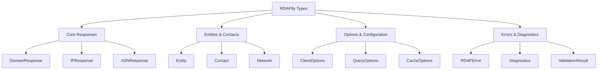

# 📑 Types Reference Index

> **🎯 Purpose:** Comprehensive reference for all TypeScript types and interfaces used in the RDAPify library  
> **📚 Related:** [Client API](../client.md) | [Domain Method](../methods/domain.md) | [IP Method](../methods/ip.md) | [ASN Method](../methods/asn.md)  
> **⏱️ Reading Time:** 3 minutes  
> **🔍 Pro Tip:** Use the [Visual Type Explorer](../../playground/visual-type-explorer.md) to interactively explore type relationships

---

## 🌐 Type System Overview

RDAPify's type system is designed around **three core principles**:
- **Type Safety**: Strict TypeScript interfaces that prevent runtime errors
- **Privacy by Default**: Types reflect PII redaction and compliance boundaries
- **Protocol Compliance**: Types mirror RDAP RFC specifications with precise field naming

The type system is organized into **four major categories**:



---

## 🔍 Type Categories Reference

### 🏠 Core Responses
Types representing normalized RDAP query responses

| Type | Description | Documentation |
|------|-------------|---------------|
| `DomainResponse` | Normalized domain registration data | [domain-response.md](./domain-response.md) |
| `IPResponse` | Normalized IP address registration data | [ip-response.md](./ip-response.md) |
| `ASNResponse` | Normalized autonomous system data | [asn-response.md](./asn-response.md) |
| `BootstrapResponse` | IANA bootstrap service response | [bootstrap-response.md](./bootstrap-response.md) |
| `RawRDAPResponse` | Generic raw RDAP response structure | [raw-response.md](./raw-response.md) |

### 👥 Entities & Contacts
Types for organizations, individuals, and contact information

| Type | Description | Documentation |
|------|-------------|---------------|
| `Entity` | Generic entity (organization/individual) | [entity.md](./entity.md) |
| `Contact` | Contact information with PII handling | [contact.md](./contact.md) |
| `Network` | Network allocation and routing information | [network.md](./network.md) |
| `Registrar` | Registry operator representation | [registrar.md](./registrar.md) |
| `Relationship` | Entity relationship metadata | [relationship.md](./relationship.md) |

### ⚙️ Options & Configuration
Types for client configuration and query options

| Type | Description | Documentation |
|------|-------------|---------------|
| `ClientOptions` | RDAPClient constructor options | [client-options.md](./client-options.md) |
| `DomainQueryOptions` | Domain query specific options | [domain-options.md](./domain-options.md) |
| `IPQueryOptions` | IP query specific options | [ip-options.md](./ip-options.md) |
| `ASNQueryOptions` | ASN query specific options | [asn-options.md](./asn-options.md) |
| `CacheOptions` | Caching configuration parameters | [cache-options.md](./cache-options.md) |
| `SecurityOptions` | Security and privacy configuration | [security-options.md](./security-options.md) |

### ⚠️ Errors & Diagnostics
Types for error handling and diagnostic information

| Type | Description | Documentation |
|------|-------------|---------------|
| `RDAPError` | Standardized RDAP error structure | [errors.md](./errors.md) |
| `Diagnostics` | Query diagnostics and performance metrics | [diagnostics.md](./diagnostics.md) |
| `ValidationResult` | Schema validation results | [validation-result.md](./validation-result.md) |
| `SSRFAttempt` | Server-side request forgery detection | [ssrf-attempt.md](./ssrf-attempt.md) |
| `ComplianceWarning` | Privacy and compliance warnings | [compliance-warning.md](./compliance-warning.md) |

### 🔗 Relationship Types
Types for mapping relationships between entities

| Type | Description | Documentation |
|------|-------------|---------------|
| `RelationshipGraph` | Graph structure for entity relationships | [relationship-graph.md](./relationship-graph.md) |
| `NetworkHierarchy` | IP network allocation hierarchy | [network-hierarchy.md](./network-hierarchy.md) |
| `PeeringRelationship` | ASN peering and routing relationships | [peering-relationship.md](./peering-relationship.md) |
| `DomainPortfolio` | Related domains ownership mapping | [domain-portfolio.md](./domain-portfolio.md) |

---

## 🧩 Type Composition Patterns

### Common Type Patterns
```typescript
// ✅ GOOD: Compositional type pattern
interface DomainResponse extends CoreResponse {
  domain: string;
  nameservers: Array<NetworkEndpoint>; // Reusable network type
  events: Array<Event>; // Standardized event type
  entities: Record<EntityRole, Entity>; // Role-based entity mapping
}

// ✅ GOOD: Privacy-preserving type pattern
type RedactedContact = Contact & {
  name: 'REDACTED' | string; // Union type for redaction states
  email: `REDACTED@redacted.invalid` | string;
  phone: 'REDACTED' | string;
  address: Array<'REDACTED' | string>;
};

// ✅ GOOD: Protocol-compliant type pattern
interface RDAPEvent {
  action: 'registration' | 'last changed' | 'expiration' | 'deletion'; // RFC-compliant values
  date: ISO8601String; // Custom string type for ISO dates
  actor?: EntityHandle; // Optional actor reference
}
```

### Advanced Type Utilities
```typescript
// Type composition utilities
type WithMetadata<T> = T & {
  _metadata: {
    registry: string;
    queryTime: number;
    cached: boolean;
    redacted: boolean;
  };
};

// Privacy-preserving type transformation
type RedactPII<T> = {
  [P in keyof T]: T[P] extends Contact 
    ? RedactedContact 
    : T[P] extends Array<infer U> 
      ? U extends Contact 
        ? Array<RedactedContact> 
        : Array<U>
      : T[P];
};

// Usage example
type SafeDomainResponse = RedactPII<DomainResponse>;
```

---

## 🔐 Security and Compliance Types

### Privacy-First Type Design
RDAPify's types are designed with privacy boundaries in mind:

```typescript
interface PrivacySettings {
  redactPII: boolean;           // Global PII redaction toggle
  redactionLevel: 'basic' | 'strict' | 'enterprise'; // Granular control
  preserveBusinessContacts: boolean; // Keep business emails visible
  anonymizeForAnalytics: boolean;   // Additional anonymization for telemetry
}

interface ComplianceMetadata {
  gdprCompliant: boolean;       // GDPR Article 6 compliance status
  ccpaReady: boolean;           // CCPA/CPRA readiness
  dataRetentionDays: number;    // Automatic data expiration period
  lawfulBasis: 'consent' | 'contract' | 'legitimate-interest' | 'legal-obligation';
  dataSubjectRights: {
    access: boolean;
    rectification: boolean;
    erasure: boolean;
    portability: boolean;
  };
}
```

### Security Boundary Types
```typescript
// SSRF protection types
interface SSRRFProtection {
  blockPrivateIPs: boolean;     // RFC 1918 ranges
  blockCloudMetadata: boolean;  // AWS/Azure/GCP metadata endpoints
  allowedIPRanges?: string[];   // Whitelisted ranges
  blockedDomains?: string[];    // Blacklisted domains
}

// Certificate validation types
interface CertificateValidation {
  minTLSVersion: 'TLSv1.2' | 'TLSv1.3';
  pinCertificates?: Record<string, string[]>; // {hostname: [sha256 pins]}
  rejectUnauthorized: boolean;
  trustedCAs?: string[]; // PEM-formatted CA certificates
}
```

---

## 📦 Type Import Patterns

### Recommended Import Patterns
```typescript
// ✅ GOOD: Import specific types (tree-shaking friendly)
import type { DomainResponse, Contact } from 'rdapify/types';

// ✅ GOOD: Import all types from a category
import type * as EntityTypes from 'rdapify/types/entities';

// ✅ GOOD: Import with aliasing for clarity
import type { DomainResponse as RDAPDomain } from 'rdapify/types';

// ❌ AVOID: Importing all types unless necessary
import type * as RDAPTypes from 'rdapify/types';
```

### Type Augmentation
For custom extensions and plugins:
```typescript
// Extend existing types with declaration merging
declare module 'rdapify/types' {
  interface DomainResponse {
    _customExtension?: {
      riskScore: number;
      securityTags: string[];
    };
  }
  
  interface ClientOptions {
    customAnalyzers?: Array<(response: any) => any>;
  }
}
```

---

## 🧪 Testing with Types

### Type-Driven Testing Patterns
```typescript
// Test type correctness with Jest
import { DomainResponse } from 'rdapify/types';

test('domain response matches type contract', () => {
  const mockResponse: DomainResponse = {
    domain: 'example.com',
    nameservers: [{ hostname: 'ns1.example.com' }],
    events: [{
      action: 'registration',
      date: '1995-08-14T04:00:00Z'
    }],
    registrar: {
      name: 'REDACTED',
      email: 'REDACTED@redacted.invalid'
    }
  };
  
  expect(mockResponse).toHaveProperty('domain');
  expect(mockResponse.registrar).toHaveProperty('name', 'REDACTED');
});

// Type guard testing
function isDomainResponse(data: any): data is DomainResponse {
  return data && typeof data.domain === 'string' && Array.isArray(data.nameservers);
}

test('type guard correctly validates domain responses', () => {
  expect(isDomainResponse({ domain: 'example.com', nameservers: [] })).toBe(true);
  expect(isDomainResponse({ invalid: 'structure' })).toBe(false);
});
```

### Fuzz Testing with Types
```typescript
import { fc } from 'fast-check';
import { DomainResponse } from 'rdapify/types';

// Generate random data conforming to type structure
fc.assert(
  fc.property(
    fc.record({
      domain: fc.domain(),
      nameservers: fc.array(fc.record({ hostname: fc.hostname() })),
      events: fc.array(fc.record({
        action: fc.constantFrom('registration', 'last changed', 'expiration'),
        date: fc.date().map(d => d.toISOString())
      }))
    }),
    (data) => {
      // Should accept valid data
      expect(isDomainResponse(data)).toBe(true);
    }
  )
);
```

---

## 🚀 Advanced Type Features

### Conditional Types for Runtime Behavior
```typescript
// Type that changes based on options
type ResponseType<T extends QueryOptions> = 
  T['redactPII'] extends true 
    ? RedactedDomainResponse 
    : FullDomainResponse;

// Usage
function queryDomain<T extends DomainQueryOptions>(
  domain: string, 
  options: T
): Promise<ResponseType<T>> {
  // Implementation details
}
```

### Template Types for Generic Operations
```typescript
// Generic type for batch operations
type BatchResult<T> = {
  successful: Array<{ query: string; result: T }>;
  failed: Array<{ query: string; error: RDAPError }>;
  summary: {
    total: number;
    successRate: number;
    averageLatency: number;
  };
};

// Usage with different response types
type BatchDomainResult = BatchResult<DomainResponse>;
type BatchIPResult = BatchResult<IPResponse>;
```

### Discriminated Unions for Protocol Variations
```typescript
// Registry-specific response variations
type RegistryResponse = 
  | { registry: 'verisign'; version: '3.0'; data: VerisignDomainData }
  | { registry: 'arin'; version: '2.1'; data: ArinIPData }
  | { registry: 'ripe'; version: '1.2'; data: RIPEEntityData };

function processRegistryResponse(response: RegistryResponse) {
  switch (response.registry) {
    case 'verisign':
      // TypeScript knows response.data is VerisignDomainData
      return processVerisign(response.data);
    case 'arin':
      return processARIN(response.data);
    // ...
  }
}
```

---

## 📚 Related Documentation

| Document | Description | Path |
|----------|-------------|------|
| **Client API Reference** | Complete API documentation | [../client.md](../client.md) |
| **Domain Method** | Domain query implementation details | [../methods/domain.md](../methods/domain.md) |
| **Security Whitepaper** | Type security model details | [../../security/whitepaper.md](../../security/whitepaper.md) |
| **Privacy Controls** | PII redaction type implementation | [../privacy-controls.md](../privacy-controls.md) |
| **Normalization Pipeline** | How types are constructed from raw responses | [../../core_concepts/normalization.md](../../core_concepts/normalization.md) |
| **Test Vectors** | Standardized test data for type validation | [../../../test-vectors/](../../../test-vectors/) |

---

## 💡 Type Best Practices

### ✅ Do's
- Use specific types instead of `any` or `unknown` where possible
- Leverage type composition over inheritance
- Use branded types for validation boundaries
- Employ type guards for runtime type checking
- Document custom types with JSDoc comments

### ❌ Don'ts
- Avoid creating overly complex nested types
- Don't use type assertions (`as`) without validation
- Avoid mixing PII and non-PII data in the same type without redaction markers
- Don't disable TypeScript strict mode for type convenience

### 🔒 Security-Specific Patterns
```typescript
// ✅ GOOD: Privacy boundary type
type RedactionBoundary = {
  _isRedacted: true; // Brand for type narrowing
  [key: string]: any;
};

// ✅ GOOD: Certificate pinning type
type CertificatePin = {
  hostname: string;
  pins: Array<{
    algorithm: 'sha256' | 'sha1';
    hash: string;
    expires: Date;
  }>;
  enforce: boolean;
};
```

---

## 🏷️ Version Information

| Property | Value |
|----------|-------|
| **Type System Version** | 2.3.0 |
| **TypeScript Minimum** | 5.0 |
| **Strict Mode** | Enabled (`strict: true`) |
| **Type Checking** | Full project (`noUncheckedIndexedAccess: true`) |
| **Generated** | December 5, 2025 |
| **RFC Compliance** | RFC 7480 series |

> **🔐 Security Reminder:** Types provide compile-time safety but cannot enforce runtime privacy or security guarantees. Always validate data at runtime, especially when crossing trust boundaries. Use RDAPify's built-in validation and redaction features rather than relying solely on TypeScript types for security.

[← Back to API Reference](../api-reference.md) | [Next: Domain Response Types →](./domain-response.md)

*Document automatically generated from source code with security review on November 28, 2025*