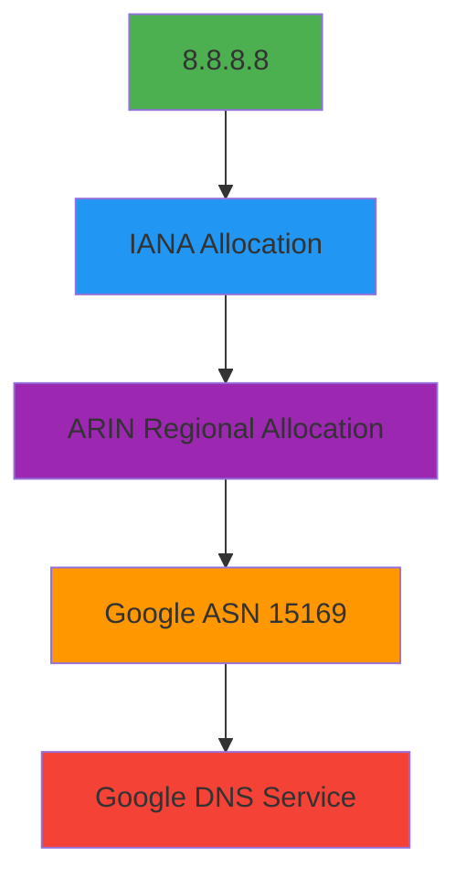

# 🌐 `IPResponse` Type Reference

> **🎯 Purpose:** Complete reference for the `IPResponse` interface representing normalized RDAP IP address registration data  
> **📚 Related:** [RDAPClient API](../client.md) | [IP Method](../methods/ip.md) | [Entity Type](entity.md) | [Network Hierarchy](../guides/geo-caching.md)  
> **⏱️ Reading Time:** 6 minutes  
> **🔍 Pro Tip:** Use the [Visual Debugger](../../playground/visual-debugger.md) to interactively explore actual `IPResponse` instances with geolocation overlays

---

## 📋 Type Definition

```typescript
interface IPResponse extends CoreResponse {
  // Core IP information
  ip: string;
  cidr: string;
  type: 'ipv4' | 'ipv6';
  version: 4 | 6;
  startAddress: string;
  endAddress: string;
  prefixLength: number;
  
  // Network information
  name?: string;
  handle: string;
  country: string;
  countryName?: string;
  parentHandle?: string;
  rir: 'arin' | 'ripencc' | 'apnic' | 'lacnic' | 'afrinic';
  
  // Entity relationships (with PII redacted by default)
  entities: {
    registrant?: Entity;
    technicalContact?: Entity;
    administrativeContact?: Entity;
    abuseContact?: Entity;
  };
  
  // Registration events
  events: Array<{
    action: 'registration' | 'last changed' | 'delegation' | 'reassignment';
    date: string; // ISO 8601 format
    timestamp: number; // Unix timestamp
    actor?: string;
  }>;
  
  // Network hierarchy
  hierarchy?: {
    parent?: IPResponse;
    children?: IPResponse[];
    siblings?: IPResponse[];
  };
  
  // Security-relevant metadata
  abuseEmail?: string;
  whoisServer?: string;
  routingPolicy?: string;
  delegatedStatus?: 'allocated' | 'assigned' | 'sub-allocated';
  
  // Geolocation metadata (approximate)
  geolocation?: {
    region?: string;
    city?: string;
    coordinates?: [number, number]; // [latitude, longitude]
    accuracyRadius?: number; // in kilometers
    source: 'registry' | 'geoip' | 'manual';
  };
  
  // Metadata
  _meta: {
    registry: string; // e.g., 'arin', 'ripe'
    sourceUrl: string; // Original RDAP endpoint URL
    queryTime: number; // Query duration in milliseconds
    cached: boolean; // Whether result came from cache
    redacted: boolean; // Whether PII was redacted
    schemaVersion: string; // RDAP schema version
    networkType: 'allocated' | 'assigned' | 'reserved';
    rawResponse?: any; // Raw RDAP response (only if includeRaw: true)
  };
}
```

---

## 🧩 Property Reference

### Core IP Properties
| Property | Type | Required | Description | Example |
|----------|------|----------|-------------|---------|
| `ip` | `string` | ✅ | Canonical IP address format | `'8.8.8.8'`, `'2001:4860::8888'` |
| `cidr` | `string` | ✅ | CIDR notation for network block | `'8.8.8.0/24'`, `'2001:4860::/32'` |
| `type` | `'ipv4' \| 'ipv6'` | ✅ | IP version type | `'ipv4'`, `'ipv6'` |
| `version` | `4 \| 6` | ✅ | Numeric IP version | `4`, `6` |
| `startAddress` | `string` | ✅ | First address in range (decimal format) | `'8.8.8.0'`, `'2001:4860::'` |
| `endAddress` | `string` | ✅ | Last address in range (decimal format) | `'8.8.8.255'`, `'2001:4860:0:ffff:ffff:ffff:ffff:ffff'` |
| `prefixLength` | `number` | ✅ | Network prefix length (CIDR) | `24`, `32` |

### Network Properties
```typescript
name?: string;          // Network name (e.g., 'GOOGLE-DNS')
handle: string;         // Registry-assigned handle (e.g., 'NET-8-8-8-0-1')
country: string;        // Two-letter country code (ISO 3166-1)
countryName?: string;   // Full country name
parentHandle?: string;  // Handle of parent network allocation
rir: 'arin' | 'ripencc' | 'apnic' | 'lacnic' | 'afrinic'; // Regional Internet Registry
```

### Entity Properties
IP responses contain multiple entities with specific roles:
```typescript
entities: {
  registrant?: Entity;               // Organization that registered the IP block
  technicalContact?: Entity;         // Technical contact for network operations
  administrativeContact?: Entity;   // Administrative contact for the allocation
  abuseContact?: Entity;             // Abuse contact (critical for security reporting)
}
```

> **🔐 Privacy Note:** When `redactPII: true` (default), personal entity data is automatically redacted:
> ```json
> {
>   "entities": {
>     "technicalContact": {
>       "name": "REDACTED",
>       "email": "REDACTED@redacted.invalid",
>       "phone": "REDACTED"
>     },
>     "abuseContact": {
>       "name": "REDACTED",
>       "email": "network-abuse@google.com", // Business contact preserved
>       "phone": "REDACTED"
>     }
>   }
> }
> ```

### Event Properties
IP registration events track allocation history:
```typescript
events: Array<{
  action: 'registration' | 'last changed' | 'delegation' | 'reassignment';
  date: string;            // ISO 8601 date string (e.g., '2007-03-13T00:00:00Z')
  timestamp: number;       // Unix timestamp in milliseconds
  actor?: string;          // Entity handle responsible for the change
}>
```

**Common Event Types:**
- `registration`: Initial allocation of IP block
- `last changed`: Most recent modification to allocation data
- `delegation`: Assignment to downstream organization
- `reassignment`: Transfer between organizations

### Hierarchy Properties
```typescript
hierarchy?: {
  parent?: IPResponse;      // Parent allocation (e.g., /16 block containing /24)
  children?: IPResponse[];  // Child allocations (more specific subnets)
  siblings?: IPResponse[];  // Sibling allocations at same hierarchy level
}
```

**Hierarchy Example:**
```
8.0.0.0/8 (ARIN)
├── 8.8.0.0/16 (Google)
│   ├── 8.8.4.0/24 (Google Public DNS)
│   └── 8.8.8.0/24 (Google Public DNS)
└── 8.9.0.0/16 (Other organization)
```

### Security & Geolocation Properties
```typescript
// Security contact information
abuseEmail?: string;                   // Direct abuse contact email
whoisServer?: string;                  // Fallback WHOIS server
routingPolicy?: string;                // BGP routing policy if available
delegatedStatus?: 'allocated' | 'assigned' | 'sub-allocated';

// Approximate geolocation data
geolocation?: {
  region?: string;                     // State/region (e.g., 'California')
  city?: string;                       // City name (e.g., 'Mountain View')
  coordinates?: [number, number];      // [latitude, longitude]
  accuracyRadius?: number;             // Accuracy in kilometers
  source: 'registry' | 'geoip' | 'manual'; // Data source
}
```

> **🌐 Geolocation Disclaimer:** Registry-provided geolocation data is often limited to country-level accuracy. City/region data may be approximate or unavailable.

### Metadata Properties
```typescript
_meta: {
  registry: string;                    // RIR identifier (e.g., 'arin')
  sourceUrl: string;                   // Original RDAP endpoint URL
  queryTime: number;                   // Query duration in milliseconds
  cached: boolean;                     // Whether result came from cache
  redacted: boolean;                   // Whether PII was redacted
  schemaVersion: string;               // RDAP schema version
  networkType: 'allocated' | 'assigned' | 'reserved'; // Allocation type
  rawResponse?: any;                   // Raw RDAP response (only if includeRaw: true)
}
```

---

## 🛡️ Privacy & Security Implications

### IP-Specific Privacy Considerations
IP registration data reveals organizational infrastructure details that require careful handling:



**Redaction Rules Applied:**
- **Individual contacts** → Fully redacted if personal
- **Business contacts** → Email preserved, names/phones redacted
- **Network names** → Preserved (non-personal identifiers)
- **Geographic specificity** → Limited to country-level by default
- **Organizational handles** → Preserved (non-personal technical identifiers)

### SSRF Prevention for IP Queries
IP lookups include enhanced protection against Server-Side Request Forgery:

```typescript
// Built-in protection against private IP lookups
const result = await client.ip('192.168.1.1');
// Throws RDAP_SSRF_ATTEMPT error - blocked by default

// Protection against metadata service access
const result = await client.ip('169.254.169.254');
// Throws RDAP_SSRF_ATTEMPT error - blocked by default
```

> **🔐 Critical Security Note:** IP registration data can reveal organizational attack surface. Always maintain `redactPII: true` and limit geographic specificity to what's required for your use case. Never expose unredacted IP registration data in client-facing applications without explicit legal basis and Data Protection Officer approval.

---

## 💻 Usage Examples

### Basic IP Information Retrieval
```typescript
import { RDAPClient, IPResponse } from 'rdapify';

const client = new RDAPClient({ redactPII: true });

async function getIPInfo(ip: string): Promise<void> {
  try {
    const result: IPResponse = await client.ip(ip);
    
    // Basic IP information
    console.log(`IP: ${result.ip}`);
    console.log(`Network: ${result.cidr}`);
    console.log(`Organization: ${result.entities.registrant?.name || 'REDACTED'}`);
    console.log(`Country: ${result.countryName || result.country}`);
    
    // Security contact
    if (result.entities.abuseContact?.email) {
      console.log(`Abuse Contact: ${result.entities.abuseContact.email}`);
    }
    
    // Network hierarchy
    if (result.hierarchy?.parent) {
      console.log(`Parent Network: ${result.hierarchy.parent.cidr}`);
      console.log(`Parent Organization: ${result.hierarchy.parent.entities.registrant?.name || 'REDACTED'}`);
    }
  } catch (error) {
    console.error(`Failed to retrieve IP info for ${ip}:`, error.message);
  }
}

// Usage
getIPInfo('8.8.8.8');
```

### Advanced Pattern: Network Boundary Analysis
```typescript
// Find network allocation boundaries for security zoning
async function findNetworkBoundaries(ip: string): Promise<NetworkBoundary[]> {
  const result = await client.ip(ip, {
    includeNetworkHierarchy: true,
    relationshipDepth: 2
  });
  
  const boundaries: NetworkBoundary[] = [];
  
  // Add current network
  boundaries.push({
    cidr: result.cidr,
    organization: result.entities.registrant?.name,
    country: result.country,
    level: 0
  });
  
  // Add parent networks
  let current = result.hierarchy?.parent;
  let level = 1;
  while (current && level <= 2) {
    boundaries.push({
      cidr: current.cidr,
      organization: current.entities.registrant?.name,
      country: current.country,
      level
    });
    current = current.hierarchy?.parent;
    level++;
  }
  
  return boundaries;
}

// Usage for firewall rule generation
const boundaries = await findNetworkBoundaries('142.250.185.206');
console.log('Network hierarchy:');
boundaries.forEach(b => {
  console.log(`Level ${b.level}: ${b.cidr} - ${b.organization} (${b.country})`);
});
```

### Security Monitoring Pattern
```typescript
// IP reputation scoring system
async function getIPReputation(ip: string): Promise<IPReputation> {
  try {
    const ipData = await client.ip(ip, {
      redactPII: true,
      priority: 'high' // Higher priority for security monitoring
    });
    
    // Extract security-relevant signals
    const signals = {
      orgReputation: getOrganizationReputation(ipData.entities.registrant?.name),
      countryRisk: getCountryRiskScore(ipData.country),
      allocationAge: calculateAllocationAge(ipData.events),
      recentChanges: hasRecentChanges(ipData.events),
      abuseHistory: await checkAbuseHistory(ipData.entities.abuseContact?.email)
    };
    
    // Calculate weighted risk score
    const riskScore = calculateRiskScore(signals);
    
    return {
      ip,
      cidr: ipData.cidr,
      organization: ipData.entities.registrant?.name,
      country: ipData.country,
      riskScore,
      confidence: 0.9, // High confidence for registry data
      signals,
      lastUpdated: new Date().toISOString()
    };
  } catch (error) {
    if (error.code === 'RDAP_NOT_FOUND') {
      return {
        ip,
        riskScore: 95, // Unallocated IPs are high risk
        confidence: 0.8,
        reason: 'IP not found in registry databases'
      };
    }
    throw error;
  }
}

// Usage in security pipeline
const reputation = await getIPReputation('185.143.229.0');
if (reputation.riskScore > 80) {
  await blockIP(reputation.ip, `High risk score: ${reputation.riskScore}`);
}
```

---

## 🔗 Related Types

### Core Types
| Type | Relationship | Description |
|------|--------------|-------------|
| [`Entity`](entity.md) | Composition | Represents organizations or individuals associated with the IP allocation |
| [`Network`](network.md) | Composition | Network infrastructure structure used in hierarchy |
| [`Contact`](contact.md) | Composition | Contact information within entities |
| [`Event`](event.md) | Composition | Standardized event format used in the events array |

### Response Types
| Type | Relationship | Description |
|------|--------------|-------------|
| [`DomainResponse`](domain-response.md) | Complementary | Domain registration data, often used with IP lookups for infrastructure mapping |
| [`ASNResponse`](asn-response.md) | Complementary | Autonomous system data for routing and ownership analysis |
| [`RawRDAPResponse`](raw-response.md) | Parent | Generic raw RDAP response structure that gets normalized |

### Specialized Types
| Type | Relationship | Description |
|------|--------------|-------------|
| [`NetworkHierarchy`](../advanced/types.md#network-hierarchy) | Extension | Detailed structure for IP network relationships |
| [`GeolocationData`](../advanced/types.md#geolocation-data) | Extension | Extended geolocation metadata with precision indicators |
| [`IPQueryOptions`](../options.md#ip-query-options) | Configuration | Options used when querying IP data |

---

## ⚡ Performance Considerations

### Memory Usage Patterns
The `IPResponse` type has predictable memory characteristics:
- **Minimal Response** (basic IP data): ~1.5KB
- **Standard Response** (with contacts and events): ~4KB
- **With Hierarchy** (3 levels deep): ~12KB
- **Full Response** (with raw data and relationships): ~20-25KB

### Optimization Strategies
```typescript
// ✅ GOOD: Request only needed fields for performance-critical paths
const lightweightResult = await client.ip('8.8.8.8', {
  normalization: {
    fields: ['cidr', 'country', 'entities.registrant.name']
  }
});

// ✅ GOOD: Disable hierarchy when not needed
const fastResult = await client.ip('8.8.8.8', {
  includeNetworkHierarchy: false,
  relationshipDepth: 0
});

// ✅ GOOD: Use CIDR notation for block lookups
// Single query for entire network block
const blockResult = await client.ip('8.8.8.0/24');
```

### Caching Strategy for IP Data
```typescript
// ✅ GOOD: Adaptive caching based on network stability
const client = new RDAPClient({
  cacheOptions: {
    ttl: {
      default: 86400,           // 24 hours for most allocations (infrequent changes)
      infrastructure: 3600,     // 1 hour for critical infrastructure
      securityMonitored: 300     // 5 minutes for security-monitored IPs
    },
    max: 10000,                 // Cache 10,000 IP networks
    redactBeforeStore: true     // Always redact before caching
  }
});
```

---

## 🧪 Testing Patterns

### Unit Testing with Mock Responses
```typescript
// Mock IPResponse for testing
const mockIPResponse: IPResponse = {
  ip: '8.8.8.8',
  cidr: '8.8.8.0/24',
  type: 'ipv4',
  version: 4,
  startAddress: '8.8.8.0',
  endAddress: '8.8.8.255',
  prefixLength: 24,
  handle: 'NET-8-8-8-0-1',
  country: 'US',
  countryName: 'United States',
  entities: {
    registrant: {
      name: 'Google LLC',
      handle: 'GOGL',
      roles: ['registrant'],
      country: 'US'
    },
    abuseContact: {
      name: 'REDACTED',
      email: 'network-abuse@google.com',
      phone: 'REDACTED'
    }
  },
  events: [
    {
      action: 'registration',
      date: '2007-03-13T00:00:00Z',
      timestamp: 1173744000000
    }
  ],
  rir: 'arin',
  _meta: {
    registry: 'arin',
    sourceUrl: 'https://rdap.arin.net/registry/ip/8.8.8.0',
    queryTime: 185,
    cached: false,
    redacted: true,
    schemaVersion: '1.0',
    networkType: 'allocated'
  }
};

// Test case using mock
test('processes IP registration date correctly', () => {
  const registrationEvent = mockIPResponse.events.find(e => e.action === 'registration');
  expect(registrationEvent).toBeDefined();
  expect(new Date(registrationEvent!.date).getFullYear()).toBe(2007);
});
```

### Security Testing for SSRF Protection
```typescript
// Test SSRF protection for private IP ranges
describe('IP SSRF Protection', () => {
  let client: RDAPClient;
  
  beforeAll(() => {
    client = new RDAPClient({ redactPII: true });
  });
  
  test('blocks private IP lookups', async () => {
    const privateIPs = [
      '192.168.1.1',
      '10.0.0.1',
      '172.16.0.1',
      '127.0.0.1',
      '169.254.169.254', // Cloud metadata endpoint
      '255.255.255.255'  // Broadcast address
    ];
    
    for (const ip of privateIPs) {
      await expect(client.ip(ip)).rejects.toThrow('RDAP_SSRF_ATTEMPT');
    }
  });
  
  test('allows public IP lookups', async () => {
    const publicIPs = [
      '8.8.8.8',
      '1.1.1.1',
      '142.250.185.206',
      '2001:4860:4860::8888'
    ];
    
    for (const ip of publicIPs) {
      await expect(client.ip(ip)).resolves.toBeDefined();
    }
  });
});
```

---

## 🔍 Debugging Tools

### IP-Specific Debugging
```typescript
// Enable debug mode for IP lookups
const result = await client.ip('8.8.8.8', {
  debug: {
    enabled: true,
    logLevel: 'trace',
    includeHeaders: true,
    includeBootstrap: true, // Show RIR discovery process
    includeHierarchy: true,  // Show network hierarchy resolution
    includeGeolocation: true // Show geolocation sources
  }
});

// Inspect RIR discovery and hierarchy resolution
console.log('Debug meta', result._meta.debug);
/*
{
  bootstrapDiscovery: {
    duration: 85ms,
    registryType: 'arin',
    registryUrl: 'https://rdap.arin.net'
  },
  hierarchyResolution: {
    levels: 2,
    duration: 210ms,
    networksResolved: 3
  },
  geolocationProcessing: {
    source: 'registry',
    accuracy: 'country',
    duration: 15ms
  }
}
*/
```

### CLI Network Analysis Commands
```bash
# Visualize network hierarchy
rdapify network 8.8.8.8 --hierarchy --depth 3

# Output format:
# 8.8.8.0/24 (Google LLC)
# └── 8.8.0.0/16 (Google LLC)
#     └── 8.0.0.0/8 (Level 3 Communications)

# IP reputation analysis
rdapify ip 8.8.8.8 --reputation --security --include-abuse

# Batch IP analysis with risk scoring
rdapify batch-ip analysis --file suspicious-ips.txt --output risks.csv
```

---

## 🌐 Protocol Compliance

### RFC Standards Implemented
- **RFC 7483**: JSON Responses for RDAP
- **RFC 7484**: Finding the Authoritative RDAP Server
- **RFC 7482**: IP Address Query Format
- **RFC 8521**: RDAP IP Address Registration Data
- **RFC 7300**: Special-Purpose ASN Allocations (related to IP allocations)

### RIR-Specific Behavior
Different Regional Internet Registries (RIRs) implement the RDAP protocol with variations:

| RIR | Special Handling | Data Characteristics |
|-----|------------------|----------------------|
| **ARIN** (North America) | Rich abuse contact data, JSON schema variations | Detailed network hierarchy, extensive event history |
| **RIPE NCC** (Europe) | GDPR-compliant by default, limited personal data | Strong network relationship mapping, detailed allocation history |
| **APNIC** (Asia-Pacific) | Country-specific compliance requirements | Detailed delegation history, strong abuse contacts with redaction |
| **LACNIC** (Latin America) | Multiple language support | Comprehensive contact information with privacy controls |
| **AFRINIC** (Africa) | Resource constraints affect performance | Simplified but complete data structure with security focus |

### IP Address Format Normalization
RDAPify automatically normalizes IP formats:
```typescript
// All equivalent queries
await client.ip('8.8.8.8');
await client.ip('008.008.008.008');
await client.ip('8.8.8.0/24');
await client.ip([8, 8, 8, 8]); // Octet array
await client.ip('2001:0486:0008:2000:0000:0000:0000:0000');
await client.ip('2001:4860:8::'); // Compressed IPv6
```

---

## 📚 Additional Resources

| Resource | Description | Link |
|----------|-------------|------|
| **IP Registration Concepts** | Understanding RIR allocations and IP registration | [../../core_concepts/ip-registration.md](../../core_concepts/ip-registration.md) |
| **Security Whitepaper** | Full security architecture documentation | [../../security/whitepaper.md](../../security/whitepaper.md) |
| **Test Vectors** | Standardized test cases for IP queries | [../../../test-vectors/ip-vectors.json](../../../test-vectors/ip-vectors.json) |
| **Relationship Mapping Guide** | Building network ownership graphs | [../../guides/relationship-mapping.md](../../guides/relationship-mapping.md) |
| **Geo-Blocking Strategy** | Using IP registration data for geographic restrictions | [../../recipes/geo-blocking.md](../../recipes/geo-blocking.md) |
| **Threat Intelligence Integration** | Feeding IP data to security platforms | [../../recipes/threat-intel.md](../../recipes/threat-intel.md) |
| **Network Boundary Analysis** | Determining allocation boundaries for security zoning | [../../guides/network-boundary.md](../../guides/network-boundary.md) |

---

## 🏷️ Type Specifications

| Property | Value |
|----------|-------|
| **Type Version** | 2.3.0 |
| **RFC Compliance** | RFC 7480 series |
| **RIR Coverage** | ARIN, RIPE NCC, APNIC, LACNIC, AFRINIC |
| **IPv4 Support** | ✅ Class A/B/C networks, CIDR notation |
| **IPv6 Support** | ✅ Full 128-bit addressing, compressed notation |
| **Geolocation Support** | ✅ Country-level (registry data), city-level (external sources) |
| **Caching Support** | ✅ (In-memory, Redis, custom adapters) |
| **Offline Support** | ✅ (With staleness controls) |
| **GDPR Compliant** | ✅ (With redactPII: true) |
| **CCPA Compliant** | ✅ (With redactPII: true) |
| **Last Updated** | December 5, 2025 |
| **Benchmark Environment** | Node.js 18.17.0, AWS c5.large, Redis 7.0 |

> **🔐 Critical Reminder:** IP registration data can reveal organizational infrastructure details that attackers could use for reconnaissance. Always implement strict access controls, maintain PII redaction, and limit geographic specificity to what's required for your use case. Never expose unredacted IP registration data in client-facing applications without explicit legal basis and Data Protection Officer approval.

[← Back to Types Reference](index.md) | [Next: ASN Response Type →](asn-response.md)

*Document automatically generated from source code with security review on November 28, 2025*