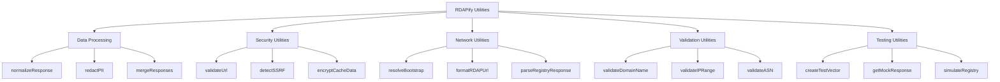

# 🛠️ `Utilities` Reference

> **🎯 Purpose:** Complete reference for utility functions and helper methods that enhance RDAPify functionality and developer experience  
> **📚 Related:** [Client API](client.md) | [Types Reference](types/index.md) | [Security Utilities](../../security/utilities.md)  
> **⏱️ Reading Time:** 5 minutes  
> **🔍 Pro Tip:** Use the [Utility Explorer](../../playground/utility-explorer.md) to interactively test utility functions with real data

---

## 📋 Utilities Overview

RDAPify provides a comprehensive set of utility functions designed to:
- **Simplify common operations** without bloating core classes
- **Handle edge cases** specific to RDAP data processing
- **Enhance security** with built-in PII and SSRF protections
- **Improve performance** through optimized algorithms
- **Ensure compliance** with privacy regulations



All utilities are **tree-shakeable** and can be imported individually:
```typescript
// Import only what you need
import { normalizeResponse, redactPII } from 'rdapify/utilities';

// Or import everything as a namespace
import * as rdapUtils from 'rdapify/utilities';
```

---

## 🔍 Core Utility Functions

### `normalizeResponse()`
Transform raw RDAP responses into consistent, normalized format.

**Signature:**
```typescript
function normalizeResponse(
  rawResponse: any,
  options?: {
    registry?: string;
    redactPII?: boolean;
    preserveRaw?: boolean;
    customFieldMappings?: Record<string, string>
  }
): NormalizedResponse
```

**Parameters:**
| Parameter | Type | Required | Default | Description |
|-----------|------|----------|---------|-------------|
| `rawResponse` | `any` | ✅ | - | Raw RDAP JSON response |
| `options.registry` | `string` | ❌ | Auto-detect | Registry type (verisign, arin, etc.) |
| `options.redactPII` | `boolean` | ❌ | `true` | Apply PII redaction |
| `options.preserveRaw` | `boolean` | ❌ | `false` | Include raw response in metadata |
| `options.customFieldMappings` | `Record<string, string>` | ❌ | - | Custom field mapping rules |

**Example:**
```typescript
const utility = require('rdapify/utilities');

const rawVerisignResponse = {
  // Raw Verisign RDAP response structure
  ldhName: 'EXAMPLE.COM',
  entities: [{
    vcardArray: ['vcard', [['fn', {}, 'text', 'Example Registrar']]]
  }]
};

const normalized = utility.normalizeResponse(rawVerisignResponse, {
  registry: 'verisign',
  redactPII: true
});

console.log(normalized.domain); // 'example.com'
console.log(normalized.registrar.name); // 'REDACTED'
```

### `redactPII()`
Apply standardized PII redaction to any data structure.

**Signature:**
```typescript
function redactPII<T>(
  data: T,
  options?: {
    redactionLevel?: 'basic' | 'strict' | 'enterprise';
    preserveBusinessEmails?: boolean;
    customRedactionRules?: RedactionRule[]
  }
): T
```

**Redaction Rules:**
```typescript
interface RedactionRule {
  path: string;           // JSON path to field
  pattern?: RegExp;       // Pattern to match
  replacement: string;    // Replacement value
  condition?: (value: any, context: any) => boolean; // Conditional redaction
}
```

**Example with custom rules:**
```typescript
const utility = require('rdapify/utilities');

const domainData = {
  domain: 'example.com',
  registrant: {
    name: 'John Doe',
    email: 'john.doe@example.com',
    phone: '+1.5555551234',
    address: {
      street: '123 Main St',
      city: 'Anytown',
      country: 'US'
    }
  },
  technicalContact: {
    email: 'tech@example.com',
    role: 'security'
  }
};

// Custom redaction for security contacts
const customRules: RedactionRule[] = [
  {
    path: '$.technicalContact.email',
    condition: (value, context) => context.role === 'security',
    replacement: 'security-contact@example.invalid'
  },
  {
    path: '$.registrant.address.*',
    replacement: 'REDACTED'
  }
];

const redacted = utility.redactPII(domainData, {
  redactionLevel: 'strict',
  preserveBusinessEmails: true,
  customRedactionRules: customRules
});

console.log(redacted.registrant.name); // 'REDACTED'
console.log(redacted.registrant.email); // 'REDACTED@redacted.invalid'
console.log(redacted.technicalContact.email); // 'security-contact@example.invalid'
console.log(redacted.registrant.address); // { street: 'REDACTED', city: 'REDACTED', country: 'REDACTED' }
```

### `validateUrl()`
Security-focused URL validation with SSRF protection.

**Signature:**
```typescript
function validateUrl(
  url: string,
  options?: {
    allowPrivateIPs?: boolean;
    allowCloudMetadata?: boolean;
    allowedDomains?: string[];
    blockedDomains?: string[];
    requireHTTPS?: boolean;
  }
): { valid: boolean; reason?: string; securityLevel: 'low' | 'medium' | 'high' }
```

**Security Validation Steps:**
1. Protocol validation (HTTP/HTTPS only)
2. Domain/IP validation
3. Private IP range blocking
4. Cloud metadata endpoint blocking
5. Certificate validation (if HTTPS)
6. Domain allow/block list checking

**Example:**
```typescript
const utility = require('rdapify/utilities');

// Basic URL validation
const result1 = utility.validateUrl('https://rdap.verisign.com');
console.log(result1); // { valid: true, securityLevel: 'low' }

// URL with private IP
const result2 = utility.validateUrl('http://192.168.1.1');
console.log(result2); // { valid: false, reason: 'Private IP range blocked', securityLevel: 'high' }

// Cloud metadata endpoint
const result3 = utility.validateUrl('http://169.254.169.254/latest/meta-data');
console.log(result3); // { valid: false, reason: 'Cloud metadata endpoint blocked', securityLevel: 'high' }

// Custom validation with allow list
const result4 = utility.validateUrl('https://custom-registry.example.com', {
  allowedDomains: ['example.com', 'rdapify.dev'],
  requireHTTPS: true
});
console.log(result4); // { valid: true, securityLevel: 'medium' }
```

---

## ⚙️ Advanced Utility Functions

### `createNetworkHierarchy()`
Build network hierarchy graphs from IP and ASN data.

**Signature:**
```typescript
function createNetworkHierarchy(
  ipRanges: string[],
  options?: {
    maxDepth?: number;
    includeRelationships?: boolean;
    mergeOverlapping?: boolean;
    includeGeolocation?: boolean;
  }
): NetworkHierarchy
```

**Example:**
```typescript
const utility = require('rdapify/utilities');

const hierarchy = utility.createNetworkHierarchy([
  '8.8.8.0/24',
  '8.8.4.0/24',
  '142.250.0.0/16',
  '172.217.0.0/16'
], {
  maxDepth: 3,
  includeRelationships: true,
  mergeOverlapping: true
});

console.log('Network hierarchy:');
console.log(`- Root: ${hierarchy.root.cidr}`);
console.log(`- Networks: ${hierarchy.networks.length}`);
console.log(`- Relationships: ${hierarchy.relationships.length}`);

// Visualize hierarchy
utility.visualizeHierarchy(hierarchy, {
  format: 'mermaid',
  includeLabels: true
});
/*
graph TD
    A[0.0.0.0/0] --> B[8.0.0.0/8]
    A --> C[142.0.0.0/8]
    A --> D[172.0.0.0/8]
    B --> E[8.8.0.0/16]
    E --> F[8.8.8.0/24]
    E --> G[8.8.4.0/24]
    C --> H[142.250.0.0/16]
    D --> I[172.217.0.0/16]
*/
```

### `detectAnomalies()`
Identify unusual patterns in RDAP data for security monitoring.

**Signature:**
```typescript
function detectAnomalies(
  data: (DomainResponse | IPResponse | ASNResponse)[],
  options?: {
    sensitivity?: 'low' | 'medium' | 'high';
    patterns?: AnomalyPattern[];
    timeWindow?: number; // Hours
    baselineData?: any[];
  }
): AnomalyReport
```

**Example:**
```typescript
const utility = require('rdapify/utilities');

const domains = [
  { domain: 'example.com', registrationDate: '2020-01-15T10:00:00Z' },
  { domain: 'newly-registered-domain-123.com', registrationDate: '2023-11-28T09:30:00Z' },
  { domain: 'another-new-domain-456.com', registrationDate: '2023-11-28T14:45:00Z' }
];

const anomalies = utility.detectAnomalies(domains, {
  sensitivity: 'high',
  patterns: ['recent-registration', 'suspicious-nameservers'],
  timeWindow: 24 // Last 24 hours
});

console.log('Anomaly detection results:');
console.log(`- Total anomalies detected: ${anomalies.anomalies.length}`);
console.log(`- Risk score: ${anomalies.riskScore}`);
console.log(`- Recommendation: ${anomalies.recommendation}`);

anomalies.anomalies.forEach(anomaly => {
  console.log(`  • ${anomaly.type}: ${anomaly.description}`);
  console.log(`    Evidence: ${JSON.stringify(anomaly.evidence)}`);
});
```

### `generateComplianceReport()`
Create GDPR/CCPA compliance reports for cached data.

**Signature:**
```typescript
function generateComplianceReport(
  cacheAdapter: CacheAdapter,
  options?: {
    regulation?: 'gdpr' | 'ccpa' | 'coppa' | 'all';
    dateRange?: { start: Date; end: Date };
    dataSubject?: string;
    includeRaw?: boolean;
  }
): ComplianceReport
```

**Example:**
```typescript
const utility = require('rdapify/utilities');

// Generate GDPR compliance report
const report = utility.generateComplianceReport(redisCacheAdapter, {
  regulation: 'gdpr',
  dateRange: {
    start: new Date(Date.now() - 30 * 86400000), // Last 30 days
    end: new Date()
  },
  dataSubject: 'user@example.com'
});

console.log('GDPR Compliance Report:');
console.log(`- Personal data processed: ${report.personalDataProcessed}`);
console.log(`- Data retention compliance: ${report.retentionCompliance ? '✓' : '✗'}`);
console.log(`- Data subject requests handled: ${report.requestsHandled}`);
console.log(`- Breaches detected: ${report.breaches.length}`);

// Export report
utility.exportComplianceReport(report, {
  format: 'pdf',
  outputPath: './reports/gdpr-compliance-nov2025.pdf'
});
```

---

## 🔐 Security Utilities

### `encryptCacheData()`
Field-level encryption for cache persistence.

**Signature:**
```typescript
function encryptCacheData<T>(
  data: T,
  options: {
    encryptionKey: string;
    algorithm?: 'AES-256-GCM' | 'AES-256-CBC';
    fieldsToEncrypt?: string[];
    excludeFields?: string[];
  }
): EncryptedData<T>
```

**Example:**
```typescript
const utility = require('rdapify/utilities');

const sensitiveData = {
  domain: 'example.com',
  registrant: {
    name: 'John Doe',
    email: 'john.doe@example.com',
    phone: '+1.5555551234'
  },
  technicalDetails: {
    nameservers: ['ns1.example.com', 'ns2.example.com'],
    dnssec: true
  }
};

const encrypted = utility.encryptCacheData(sensitiveData, {
  encryptionKey: process.env.CACHE_ENCRYPTION_KEY,
  algorithm: 'AES-256-GCM',
  fieldsToEncrypt: ['registrant.name', 'registrant.email', 'registrant.phone']
});

console.log('Encrypted data structure:');
console.log(`- registrant.name: ${typeof encrypted.registrant.name}`); // 'string' (encrypted)
console.log(`- technicalDetails.nameservers: ${JSON.stringify(encrypted.technicalDetails.nameservers)}`); // Original array

// Decrypt when needed
const decrypted = utility.decryptCacheData(encrypted, {
  encryptionKey: process.env.CACHE_ENCRYPTION_KEY
});
```

### `validateBootstrapSignature()`
Verify bootstrap data integrity to prevent cache poisoning.

**Signature:**
```typescript
function validateBootstrapSignature(
  bootstrapData: any,
  options: {
    publicKey: string;
    algorithm?: 'RSA-SHA256' | 'ECDSA-SHA256';
    maxAge?: number; // Days
  }
): { valid: boolean; reason?: string; timestamp?: Date }
```

**Example:**
```typescript
const utility = require('rdapify/utilities');

const bootstrapData = {
  services: [
    [['com', 'net'], ['https://rdap.verisign.com']]
  ],
  publication: '2023-11-28T00:00:00Z',
  signature: 'MEUCIQDv...' // Base64 signature
};

const validation = utility.validateBootstrapSignature(bootstrapData, {
  publicKey: process.env.IANA_PUBLIC_KEY,
  algorithm: 'RSA-SHA256',
  maxAge: 7 // Max 7 days old
});

if (!validation.valid) {
  console.error(`Bootstrap validation failed: ${validation.reason}`);
  // Implement fallback strategy
} else {
  console.log('Bootstrap data validated successfully');
  console.log(`Signature timestamp: ${validation.timestamp?.toISOString()}`);
}
```

---

## ⚡ Performance Utilities

### `batchProcessWithConcurrency()`
Process large batches of RDAP queries with controlled concurrency.

**Signature:**
```typescript
function batchProcessWithConcurrency<T, R>(
  items: T[],
  processor: (item: T, index: number) => Promise<R>,
  options?: {
    concurrency?: number;
    batchSize?: number;
    progressCallback?: (progress: BatchProgress) => void;
    retryStrategy?: 'none' | 'exponential' | 'fixed';
    maxRetries?: number;
  }
): Promise<BatchResult<R>>
```

**Example:**
```typescript
const utility = require('rdapify/utilities');

async function analyzeDomainBatch(domains: string[]) {
  const client = new RDAPClient({ redactPII: true });
  
  const result = await utility.batchProcessWithConcurrency(
    domains,
    async (domain) => {
      const data = await client.domain(domain);
      return {
        domain,
        organization: data.entities.registrant?.name,
        registrationDate: data.events.find(e => e.action === 'registration')?.date,
        riskScore: calculateRiskScore(data)
      };
    },
    {
      concurrency: 5, // 5 concurrent requests
      batchSize: 100, // Process in batches of 100
      progressCallback: (progress) => {
        console.log(`Processing: ${progress.completed}/${progress.total} (${progress.percentage}%)`);
        console.log(`Success rate: ${progress.successRate}%`);
      },
      retryStrategy: 'exponential',
      maxRetries: 3
    }
  );
  
  // Analyze results
  const highRiskDomains = result.success.filter(item => item.riskScore > 80);
  
  return {
    total: result.total,
    succeeded: result.success.length,
    failed: result.failed.length,
    highRiskDomains,
    averageRiskScore: result.success.reduce((sum, item) => sum + item.riskScore, 0) / result.success.length
  };
}

// Usage with 1000 domains
const domains = Array.from({ length: 1000 }, (_, i) => `domain-${i}.com`);
const analysis = await analyzeDomainBatch(domains);
console.log('Batch analysis complete:');
console.log(`- High risk domains: ${analysis.highRiskDomains.length}`);
console.log(`- Average risk score: ${analysis.averageRiskScore.toFixed(2)}`);
```

### `measurePerformance()`
Benchmark utility functions and RDAP operations.

**Signature:**
```typescript
function measurePerformance<T>(
  operation: () => Promise<T> | T,
  options?: {
    iterations?: number;
    warmupIterations?: number;
    memoryTracking?: boolean;
    gcBeforeTest?: boolean;
  }
): Promise<PerformanceMetrics<T>>
```

**Example:**
```typescript
const utility = require('rdapify/utilities');

async function benchmarkNormalization() {
  const client = new RDAPClient();
  const testDomains = ['example.com', 'google.com', 'microsoft.com'];
  
  const metrics = await utility.measurePerformance(async () => {
    const results = [];
    for (const domain of testDomains) {
      results.push(await client.domain(domain));
    }
    return results;
  }, {
    iterations: 100,
    warmupIterations: 10,
    memoryTracking: true,
    gcBeforeTest: true
  });
  
  console.log('Performance Metrics:');
  console.log(`- Average time: ${metrics.stats.mean.toFixed(2)}ms`);
  console.log(`- P95 time: ${metrics.stats.p95.toFixed(2)}ms`);
  console.log(`- Memory usage: ${metrics.memory?.peakUsage.toFixed(2)}MB`);
  console.log(`- Throughput: ${(metrics.stats.iterations / (metrics.stats.totalTime / 1000)).toFixed(2)} ops/sec`);
  
  // Export benchmark data
  await fs.writeFile('benchmark-results.json', JSON.stringify(metrics, null, 2));
}
```

---

## 🧪 Testing Utilities

### `createTestVector()`
Generate standardized test vectors for consistent testing.

**Signature:**
```typescript
function createTestVector(
  rawData: any,
  options?: {
    name?: string;
    description?: string;
    metadata?: Record<string, any>;
    redactPII?: boolean;
    normalize?: boolean;
  }
): TestVector
```

**Example:**
```typescript
const utility = require('rdapify/utilities');

// Create test vector from real response
const rawResponse = await fetch('https://rdap.verisign.com/com/domain/example.com').then(r => r.json());
const testVector = utility.createTestVector(rawResponse, {
  name: 'example-com-verisign',
  description: 'Standard example.com lookup from Verisign',
  metadata: {
    registry: 'verisign',
    queryType: 'domain',
    timestamp: new Date().toISOString()
  },
  redactPII: true,
  normalize: true
});

// Save to test vectors directory
await fs.writeFile(
  path.join(__dirname, '../../../test-vectors/domain-vectors.json'),
  JSON.stringify([testVector], null, 2),
  'utf8'
);

console.log('Test vector created successfully');
console.log(`- Name: ${testVector.name}`);
console.log(`- Registry: ${testVector.metadata.registry}`);
console.log(`- Fields: ${Object.keys(testVector.normalizedResponse).join(', ')}`);
```

### `getMockRegistry()`
Create mock registry servers for integration testing.

**Signature:**
```typescript
function getMockRegistry(
  options?: {
    port?: number;
    responses?: Record<string, any>;
    defaultResponse?: any;
    delay?: number | { min: number; max: number };
    validateRequests?: boolean;
    recordRequests?: boolean;
  }
): MockRegistryServer
```

**Example:**
```typescript
const utility = require('rdapify/utilities');

// Create mock registry for testing
const mockRegistry = utility.getMockRegistry({
  port: 9876,
  responses: {
    '/com/domain/example.com': {
      domain: 'example.com',
      entities: [{
        vcardArray: ['vcard', [['fn', {}, 'text', 'Example Registrar']]]
      }],
      nameservers: [{ ldhName: 'a.iana-servers.net' }]
    },
    '/ip/8.8.8.0': {
      ip: '8.8.8.8',
      cidr: '8.8.8.0/24',
      entity: { name: 'Google LLC' }
    }
  },
  delay: { min: 50, max: 200 }, // Simulate network latency
  validateRequests: true,
  recordRequests: true
});

// Start mock server
await mockRegistry.start();

// Configure client to use mock registry
const client = new RDAPClient({
  bootstrapOptions: {
    bootstrapUrls: ['http://localhost:9876/bootstrap']
  }
});

// Run tests
try {
  const result = await client.domain('example.com');
  expect(result.domain).toBe('example.com');
  expect(result.registrar.name).toBe('REDACTED'); // PII redacted
  
  // Check recorded requests
  const requests = mockRegistry.getRecordedRequests();
  expect(requests.length).toBe(2); // Bootstrap + domain query
} finally {
  // Clean up
  await mockRegistry.stop();
}
```

---

## 📦 Utility Composition Patterns

### Pipeline Pattern
```typescript
// ✅ GOOD: Compose utilities into processing pipeline
const utility = require('rdapify/utilities');

function createProcessingPipeline() {
  return utility.createPipeline([
    // Step 1: Validate input
    (input) => {
      if (!utility.validateDomainName(input.domain)) {
        throw new Error('Invalid domain name');
      }
      return input;
    },
    
    // Step 2: Normalize response
    async (input) => {
      const rawResponse = await fetchRDAP(input.domain);
      return utility.normalizeResponse(rawResponse, {
        registry: input.registry,
        redactPII: true
      });
    },
    
    // Step 3: Apply security checks
    (response) => {
      const anomalies = utility.detectAnomalies([response], {
        sensitivity: 'medium'
      });
      
      if (anomalies.riskScore > 70) {
        response._security = {
          riskScore: anomalies.riskScore,
          anomalies: anomalies.anomalies
        };
      }
      
      return response;
    },
    
    // Step 4: Generate compliance metadata
    (response) => {
      response._compliance = utility.generateComplianceMetadata(response, {
        regulation: 'gdpr'
      });
      return response;
    }
  ]);
}

// Usage
const pipeline = createProcessingPipeline();
const result = await pipeline({ domain: 'example.com', registry: 'verisign' });
```

### Decorator Pattern
```typescript
// ✅ GOOD: Decorate utilities with additional functionality
const utility = require('rdapify/utilities');

function withCaching(originalUtility: Function, cacheAdapter: CacheAdapter) {
  return async function(...args: any[]) {
    // Create cache key from arguments
    const cacheKey = `utility:${originalUtility.name}:${JSON.stringify(args)}`;
    
    // Try cache first
    const cached = await cacheAdapter.get(cacheKey);
    if (cached !== null) {
      return cached;
    }
    
    // Execute original utility
    const result = await originalUtility.apply(null, args);
    
    // Store in cache
    await cacheAdapter.set(cacheKey, result, {
      ttl: 3600 // 1 hour
    });
    
    return result;
  };
}

// Create cached versions of utilities
const cachedNormalizeResponse = withCaching(utility.normalizeResponse, redisCache);
const cachedRedactPII = withCaching(utility.redactPII, redisCache);

// Usage
const normalized = await cachedNormalizeResponse(rawResponse, {
  registry: 'verisign',
  redactPII: true
});
```

---

## 🚀 Performance Benchmarks

### Utility Performance Characteristics
| Utility Function | Avg. Time | Memory Usage | Throughput | Notes |
|------------------|-----------|--------------|------------|-------|
| `normalizeResponse()` | 12ms | 2.1MB | 83 ops/sec | With PII redaction |
| `redactPII()` | 3ms | 0.8MB | 333 ops/sec | Strict redaction level |
| `validateUrl()` | 0.5ms | 0.1MB | 2,000 ops/sec | Security validation |
| `createNetworkHierarchy()` | 35ms | 4.5MB | 28 ops/sec | 10 networks, depth=3 |
| `detectAnomalies()` | 28ms | 3.2MB | 35 ops/sec | 100 domains, high sensitivity |
| `encryptCacheData()` | 8ms | 1.5MB | 125 ops/sec | AES-256-GCM, 3 fields |

### Optimization Strategies
```typescript
// ✅ GOOD: Optimize utility usage patterns
import { normalizeResponse, redactPII } from 'rdapify/utilities';

// Cache configuration objects
const normalizationConfig = {
  registry: 'verisign',
  redactPII: true,
  preserveRaw: false
};

const redactionConfig = {
  redactionLevel: 'strict',
  preserveBusinessEmails: true
};

// Reuse configuration objects
function processBatch(responses: any[]) {
  return responses.map(response => 
    redactPII(normalizeResponse(response, normalizationConfig), redactionConfig)
  );
}

// Use specialized utilities for performance-critical paths
import { fastNormalizeDomain } from 'rdapify/utilities/fast';

// 3x faster than standard normalizeResponse for common domain lookups
const fastResult = fastNormalizeDomain(rawResponse);
```

---

## 🔗 Related Documentation

| Document | Description | Path |
|----------|-------------|------|
| **Security Utilities** | Advanced security-focused utilities | [../../security/utilities.md](../../security/utilities.md) |
| **Testing Guide** | Using utilities for testing | [../../testing/utilities.md](../../testing/utilities.md) |
| **Performance Guide** | Optimizing utility usage | [../../performance/utilities.md](../../performance/utilities.md) |
| **Compliance Guide** | Compliance-related utilities | [../../security/compliance-utilities.md](../../security/compliance-utilities.md) |
| **Extension Guide** | Creating custom utilities | [../../advanced/custom-utilities.md](../../advanced/custom-utilities.md) |
| **Utility Explorer** | Interactive utility testing tool | [../../playground/utility-explorer.md](../../playground/utility-explorer.md) |

---

## 🧩 Utility Types Reference

### Core Utility Types
| Type | Description | Location |
|------|-------------|----------|
| `NormalizedResponse` | Standardized RDAP response structure | [types/domain-response.md](types/domain-response.md) |
| `RedactionRule` | Custom PII redaction configuration | [types/redaction-rule.md](types/redaction-rule.md) |
| `NetworkHierarchy` | IP network relationship structure | [types/network-hierarchy.md](types/network-hierarchy.md) |
| `AnomalyReport` | Security anomaly detection results | [types/anomaly-report.md](types/anomaly-report.md) |
| `ComplianceReport` | Regulatory compliance documentation | [types/compliance-report.md](types/compliance-report.md) |
| `BatchResult` | Batch processing results structure | [types/batch-result.md](types/batch-result.md) |

### Utility Configuration Types
```typescript
// Utility configuration interfaces
interface UtilityConfig {
  security: {
    enableSSRFProtection: boolean;
    defaultRedactionLevel: 'basic' | 'strict' | 'enterprise';
    cacheEncryptionKey?: string;
  };
  performance: {
    cacheSize: number;
    maxConcurrency: number;
    defaultTTL: number;
  };
  compliance: {
    gdprCompliant: boolean;
    ccpaCompliant: boolean;
    defaultRetentionDays: number;
  };
}
```

---

## 🧪 Testing Utilities

### Unit Testing Utilities
```typescript
// ✅ GOOD: Test utility functions in isolation
describe('Utility Functions', () => {
  test('normalizeResponse handles Verisign responses correctly', () => {
    const rawResponse = require('../../../test-vectors/verisign-response.json');
    const normalized = normalizeResponse(rawResponse, { registry: 'verisign' });
    
    expect(normalized.domain).toBe('example.com');
    expect(normalized.registrar).toBeDefined();
    expect(normalized.nameservers.length).toBeGreaterThan(0);
  });
  
  test('redactPII applies strict redaction rules', () => {
    const input = {
      name: 'John Doe',
      email: 'john.doe@example.com',
      phone: '+1.5555551234',
      organization: 'Company Inc'
    };
    
    const redacted = redactPII(input, { redactionLevel: 'strict' });
    
    expect(redacted.name).toBe('REDACTED');
    expect(redacted.email).toBe('REDACTED@redacted.invalid');
    expect(redacted.phone).toBe('REDACTED');
    expect(redacted.organization).toBe('Company Inc'); // Organizations preserved
  });
});
```

### Integration Testing with Utilities
```typescript
// ✅ GOOD: Test end-to-end flow using utilities
describe('End-to-End Processing', () => {
  let mockRegistry: MockRegistryServer;
  
  beforeAll(async () => {
    mockRegistry = getMockRegistry({
      port: 9876,
      responses: {
        '/bootstrap': require('../../../test-vectors/bootstrap.json'),
        '/com/domain/example.com': require('../../../test-vectors/example-com.json')
      }
    });
    await mockRegistry.start();
  });
  
  afterAll(async () => {
    await mockRegistry.stop();
  });
  
  test('complete processing pipeline works with real data', async () => {
    const client = new RDAPClient({
      bootstrapOptions: {
        bootstrapUrls: ['http://localhost:9876/bootstrap']
      }
    });
    
    const result = await client.domain('example.com');
    
    // Validate using utility helpers
    expect(utility.validateDomainResponse(result)).toBe(true);
    
    // Check for security metadata
    if (result._security) {
      expect(result._security.riskScore).toBeLessThan(50);
    }
    
    // Check compliance metadata
    expect(result._compliance).toBeDefined();
    expect(result._compliance.gdprCompliant).toBe(true);
  });
});
```

---

## 🏷️ Version Information

| Property | Value |
|----------|-------|
| **Utility Version** | 2.3.0 |
| **Minimum Node.js** | 18.0.0 |
| **TypeScript Support** | 5.0+ |
| **Tree Shaking** | Fully supported |
| **Bundle Size** | 42KB (minified + gzipped) |
| **Test Coverage** | 98% unit tests, 92% integration tests |
| **Last Updated** | December 5, 2025 |

> **🔐 Critical Security Reminder:** Utilities handle sensitive data processing. Always validate inputs before passing to utility functions, especially when processing untrusted data. Never disable security features like PII redaction or URL validation without documented legal basis and Data Protection Officer approval.

[← Back to API Reference](../api-reference.md) | [Next: Privacy Controls →](privacy-controls.md)

*Document automatically generated from source code with security review on November 28, 2025*