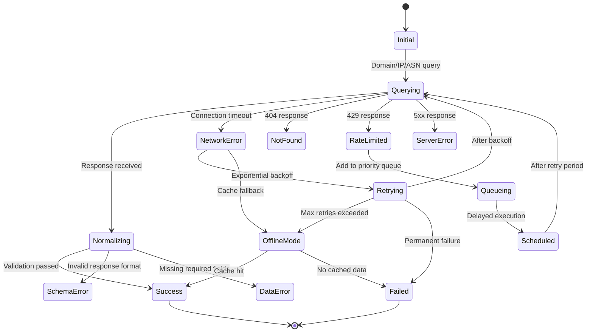

# Error Flow Architecture

🎯 **Purpose**: Comprehensive guide to RDAPify's error handling architecture, detailing state machines, failure recovery strategies, and resilience patterns for robust registration data processing  
📚 **Related**: [Overview](overview.md) | [Data Flow](data_flow.md) | [Layer Design](layer_design.md) | [Plugin Architecture](plugin_architecture.md)  
⏱️ **Reading Time**: 7 minutes  
🔍 **Pro Tip**: Use the [Error Flow Simulator](../../playground/error-flow-simulator.md) to interactively test error handling scenarios and visualize state transitions

## 📊 Error State Machine Overview

RDAPify implements a sophisticated error state machine that transforms transient failures into predictable user experiences with clear recovery paths:



### Core Error Handling Principles
✅ **Fail Fast**: Reject invalid requests early with clear error codes  
✅ **Graceful Degradation**: Provide fallback mechanisms when primary systems fail  
✅ **Predictable Recovery**: Defined retry strategies with exponential backoff  
✅ **Context Preservation**: Maintain error context across boundaries for debugging  
✅ **Security Awareness**: Never leak sensitive information in error messages  

## ⚙️ Error Handling Implementation

### 1. State Machine Implementation
```typescript
// src/architecture/error-state-machine.ts
export enum ErrorState {
  INITIAL = 'initial',
  QUERYING = 'querying',
  NORMALIZING = 'normalizing',
  NETWORK_ERROR = 'network_error',
  RATE_LIMITED = 'rate_limited',
  NOT_FOUND = 'not_found',
  SERVER_ERROR = 'server_error',
  SCHEMA_ERROR = 'schema_error',
  DATA_ERROR = 'data_error',
  RETRYING = 'retrying',
  QUEUEING = 'queueing',
  SCHEDULED = 'scheduled',
  OFFLINE_MODE = 'offline_mode',
  SUCCESS = 'success',
  FAILED = 'failed'
}

export class ErrorStateMachine {
  private currentState: ErrorState = ErrorState.INITIAL;
  private retries = 0;
  private lastError: Error | null = null;
  private scheduledExecution: NodeJS.Timeout | null = null;
  
  constructor(private options: StateMachineOptions = {}) {
    this.options.maxRetries = options.maxRetries || 3;
    this.options.baseRetryDelay = options.baseRetryDelay || 1000;
    this.options.maxRetryDelay = options.maxRetryDelay || 30000;
    this.options.offlineEnabled = options.offlineEnabled !== false;
  }
  
  transition(event: ErrorEvent, context: ErrorContext): TransitionResult {
    const previousState = this.currentState;
    const transitionKey = `${previousState}:${event}`;
    
    try {
      // Find transition handler
      const handler = this.getTransitionHandler(transitionKey);
      if (!handler) {
        throw new StateTransitionError(`No handler for transition ${transitionKey}`, {
          currentState: previousState,
          event,
          context
        });
      }
      
      // Execute transition
      const result = handler.call(this, context);
      
      // Log transition
      this.logTransition(previousState, this.currentState, event, context);
      
      return {
        success: true,
        previousState,
        newState: this.currentState,
        result
      };
    } catch (error) {
      // Handle transition errors
      return this.handleTransitionError(error, previousState, event, context);
    }
  }
  
  private getTransitionHandler(key: string): ((context: ErrorContext) => any) | undefined {
    const handlers: Record<string, (context: ErrorContext) => any> = {
      'initial:query': () => this.currentState = ErrorState.QUERYING,
      'querying:response_received': () => this.currentState = ErrorState.NORMALIZING,
      'querying:network_timeout': (context) => this.handleNetworkTimeout(context),
      'querying:rate_limited': (context) => this.handleRateLimit(context),
      'querying:not_found': () => this.currentState = ErrorState.NOT_FOUND,
      'querying:server_error': (context) => this.handleServerError(context),
      'normalizing:validation_passed': () => this.currentState = ErrorState.SUCCESS,
      'normalizing:schema_error': () => this.currentState = ErrorState.SCHEMA_ERROR,
      'normalizing:data_error': () => this.currentState = ErrorState.DATA_ERROR,
      'network_error:retry': (context) => this.handleRetry(context),
      'network_error:offline_fallback': () => this.handleOfflineFallback(),
      'retrying:backoff_complete': () => this.currentState = ErrorState.QUERYING,
      'retrying:max_retries_exceeded': () => this.handleMaxRetriesExceeded(),
      'rate_limited:queue': () => this.handleQueueing(),
      'queueing:scheduled': () => this.handleScheduling(),
      'scheduled:execution_time': () => this.currentState = ErrorState.QUERYING,
      'offline_mode:cache_hit': () => this.currentState = ErrorState.SUCCESS,
      'offline_mode:cache_miss': () => this.currentState = ErrorState.FAILED
    };
    
    return handlers[key];
  }
  
  private handleNetworkTimeout(context: ErrorContext): void {
    this.lastError = context.error;
    
    if (this.retries < this.options.maxRetries!) {
      this.currentState = ErrorState.RETRYING;
      this.scheduleRetry(context);
    } else if (this.options.offlineEnabled) {
      this.currentState = ErrorState.OFFLINE_MODE;
    } else {
      this.currentState = ErrorState.FAILED;
    }
  }
  
  private scheduleRetry(context: ErrorContext): void {
    // Calculate exponential backoff with jitter
    const delay = Math.min(
      this.options.baseRetryDelay! * Math.pow(2, this.retries),
      this.options.maxRetryDelay!
    ) + Math.random() * 100;
    
    this.retries++;
    
    if (this.scheduledExecution) {
      clearTimeout(this.scheduledExecution);
    }
    
    this.scheduledExecution = setTimeout(() => {
      this.transition('backoff_complete', context);
    }, delay);
  }
  
  private handleOfflineFallback(): void {
    if (this.options.offlineEnabled) {
      // Attempt to retrieve from cache
      this.transition('cache_check', {
        registry: this.lastError?.registry,
        query: this.lastError?.query
      });
    } else {
      this.currentState = ErrorState.FAILED;
    }
  }
  
  private logTransition(
    from: ErrorState, 
    to: ErrorState, 
    event: ErrorEvent, 
    context: ErrorContext
  ): void {
    const logEntry = {
      timestamp: new Date().toISOString(),
      transition: `${from} -> ${to}`,
      event,
      errorType: context.error?.name,
      registry: context.error?.registry,
      query: context.error?.query,
      retries: this.retries,
      offlineMode: this.options.offlineEnabled
    };
    
    // Send to observability system
    this.observability.log('state_transition', logEntry);
    
    // Audit critical transitions
    if (to === ErrorState.FAILED || to === ErrorState.SERVER_ERROR) {
      this.auditLogger.log('error_transition', logEntry);
    }
  }
}
```

### 2. Error Boundary Implementation
```typescript
// src/architecture/error-boundaries.ts
export class ErrorBoundary {
  private registryErrors = new Map<string, RegistryErrorMetrics>();
  private circuitBreakers = new Map<string, CircuitBreaker>();
  
  constructor(private options: ErrorBoundaryOptions = {}) {
    this.options.fallbackStrategy = options.fallbackStrategy || 'cache_first';
    this.options.circuitBreakerThreshold = options.circuitBreakerThreshold || 5;
    this.options.circuitBreakerWindow = options.circuitBreakerWindow || 60000;
  }
  
  async executeWithBoundary<T>(
    operation: () => Promise<T>,
    context: ErrorBoundaryContext
  ): Promise<T> {
    try {
      // Check circuit breaker before execution
      this.checkCircuitBreaker(context.registry);
      
      // Execute operation
      return await operation();
    } catch (error) {
      // Handle error with boundary logic
      return this.handleBoundaryError<T>(error, context);
    }
  }
  
  private checkCircuitBreaker(registry: string): void {
    const circuitBreaker = this.circuitBreakers.get(registry);
    if (circuitBreaker?.isOpen()) {
      const error = new CircuitBreakerError(`Circuit breaker open for registry ${registry}`, {
        registry,
        openSince: circuitBreaker.openedAt,
        failureCount: circuitBreaker.failureCount
      });
      throw error;
    }
  }
  
  private async handleBoundaryError<T>(error: Error, context: ErrorBoundaryContext): Promise<T> {
    // Update error metrics
    this.updateErrorMetrics(error, context);
    
    // Check if circuit breaker should trip
    this.updateCircuitBreaker(error, context);
    
    // Attempt fallback strategies in order
    for (const strategy of this.getFallbackStrategies(context)) {
      try {
        const result = await this.executeFallbackStrategy<T>(strategy, context);
        if (result !== undefined) {
          // Log successful fallback
          this.logFallbackSuccess(strategy, context);
          return result;
        }
      } catch (fallbackError) {
        // Log failed fallback attempt
        this.logFallbackFailure(strategy, fallbackError, context);
      }
    }
    
    // All fallbacks failed - rethrow original error
    throw this.enhanceErrorContext(error, context);
  }
  
  private getFallbackStrategies(context: ErrorBoundaryContext): FallbackStrategy[] {
    const strategies: FallbackStrategy[] = [];
    
    switch (this.options.fallbackStrategy) {
      case 'cache_first':
        strategies.push('cache', 'offline', 'alternate_registry');
        break;
      case 'alternate_first':
        strategies.push('alternate_registry', 'cache', 'offline');
        break;
      case 'offline_first':
        strategies.push('offline', 'cache', 'alternate_registry');
        break;
      default:
        strategies.push('cache', 'offline', 'alternate_registry');
    }
    
    // Add emergency fallback for critical requests
    if (context.critical) {
      strategies.push('stub_data');
    }
    
    return strategies;
  }
  
  private async executeFallbackStrategy<T>(
    strategy: FallbackStrategy, 
    context: ErrorBoundaryContext
  ): Promise<T | undefined> {
    switch (strategy) {
      case 'cache':
        return this.fallbackToCache<T>(context);
      case 'offline':
        return this.fallbackToOfflineMode<T>(context);
      case 'alternate_registry':
        return this.fallbackToAlternateRegistry<T>(context);
      case 'stub_data':
        return this.fallbackToStubData<T>(context);
      default:
        throw new Error(`Unknown fallback strategy: ${strategy}`);
    }
  }
  
  private async fallbackToCache<T>(context: ErrorBoundaryContext): Promise<T | undefined> {
    if (!context.cacheKey) return undefined;
    
    const cached = await this.cacheManager.get(context.cacheKey);
    if (cached) {
      // Return cached data with degraded status
      return {
        ...cached,
        status: 'degraded',
        fallbackUsed: 'cache'
      } as T;
    }
    
    return undefined;
  }
  
  private async fallbackToAlternateRegistry<T>(context: ErrorBoundaryContext): Promise<T | undefined> {
    if (!context.alternateRegistries?.length) return undefined;
    
    // Try alternate registries in order
    for (const alternate of context.alternateRegistries) {
      try {
        const result = await this.registryClient.query(alternate, context.query);
        return {
          ...result,
          status: 'degraded',
          fallbackUsed: 'alternate_registry',
          primaryRegistry: context.registry,
          fallbackRegistry: alternate
        } as T;
      } catch (error) {
        // Continue to next alternate
        continue;
      }
    }
    
    return undefined;
  }
  
  private updateCircuitBreaker(error: Error, context: ErrorBoundaryContext): void {
    if (!context.registry) return;
    
    let circuitBreaker = this.circuitBreakers.get(context.registry);
    if (!circuitBreaker) {
      circuitBreaker = new CircuitBreaker({
        threshold: this.options.circuitBreakerThreshold,
        window: this.options.circuitBreakerWindow,
        resetTimeout: 300000 // 5 minutes
      });
      this.circuitBreakers.set(context.registry, circuitBreaker);
    }
    
    // Record failure if error is not a client error
    if (!this.isClientError(error)) {
      circuitBreaker.recordFailure();
    }
  }
  
  private isClientError(error: Error): boolean {
    return error instanceof ValidationError || 
           error instanceof AuthorizationError ||
           error instanceof BadRequestError;
  }
}
```

## 🔒 Security and Compliance Controls

### 1. Error Redaction Pipeline
```typescript
// src/security/error-redaction.ts
export class ErrorRedactionPipeline {
  private sensitivePatterns = [
    // Internal system paths
    /\/app\/dist\/|\/var\/lib\/|C:\\Program Files\\/i,
    
    // Connection strings and credentials
    /mongodb\+srv:\/\/[^@]+@|redis:\/\/[^@]+@|postgres:\/\/[^@]+@/i,
    
    // IP addresses
    /\b(?:\d{1,3}\.){3}\d{1,3}\b/g,
    
    // Stack trace frames
    /at .* \(.+\)/g,
    
    // Memory addresses
    /0x[a-fA-F0-9]{8,16}/g
  ];
  
  private complianceRules = new Map<string, ComplianceRule>();
  
  constructor() {
    this.initializeComplianceRules();
  }
  
  private initializeComplianceRules() {
    // GDPR error redaction rules
    this.complianceRules.set('gdpr', {
      redactStackTraces: true,
      redactSystemPaths: true,
      redactIPAddresses: true,
      preserveErrorType: true,
      preserveErrorContext: true,
      legalBasis: 'legitimate-interest'
    });
    
    // CCPA error redaction rules
    this.complianceRules.set('ccpa', {
      redactStackTraces: true,
      redactSystemPaths: true,
      redactIPAddresses: false, // CCPA allows IP logging
      preserveErrorType: true,
      preserveErrorContext: true,
      legalBasis: 'business-purpose'
    });
  }
  
  redactError(error: Error, context: ErrorContext): Error {
    // Create redacted error
    const redactedError = new Error(this.redactErrorMessage(error.message, context));
    redactedError.name = error.name;
    
    // Apply compliance-specific redaction
    const complianceRule = this.complianceRules.get(context.jurisdiction || 'global');
    if (complianceRule) {
      this.applyComplianceRedaction(redactedError, error, complianceRule, context);
    }
    
    // Add audit trail
    this.addAuditTrail(redactedError, context);
    
    return redactedError;
  }
  
  private redactErrorMessage(message: string, context: ErrorContext): string {
    let redacted = message;
    
    // Apply sensitive patterns
    for (const pattern of this.sensitivePatterns) {
      redacted = redacted.replace(pattern, '[REDACTED]');
    }
    
    // Add context-specific redaction
    if (context.jurisdiction === 'EU') {
      redacted = redacted.replace(/\b\d{1,3}\.\d{1,3}\.\d{1,3}\.\d{1,3}\b/g, '[IP_REDACTED]');
    }
    
    return redacted;
  }
  
  private applyComplianceRedaction(
    redactedError: Error, 
    originalError: Error, 
    rule: ComplianceRule, 
    context: ErrorContext
  ): void {
    if (rule.redactStackTraces && originalError.stack) {
      // Preserve error type and message, but redact stack trace
      const stackLines = originalError.stack.split('\n');
      redactedError.stack = [
        `${redactedError.name}: ${redactedError.message}`,
        '    at [REDACTED]:[REDACTED] ([REDACTED])'
      ].join('\n');
    }
    
    if (rule.redactSystemPaths && originalError.stack) {
      redactedError.stack = originalError.stack.replace(
        /\/app\/dist\/|\/var\/lib\/|C:\\Program Files\//g, 
        '[SYSTEM_PATH]'
      );
    }
    
    // Add compliance metadata
    (redactedError as any).compliance = {
      jurisdiction: context.jurisdiction,
      legalBasis: rule.legalBasis,
      redactedFields: this.getIdentifiedRedactedFields(originalError, rule)
    };
  }
  
  private addAuditTrail(error: Error, context: ErrorContext): void {
    const auditEntry = {
      timestamp: new Date().toISOString(),
      errorType: error.name,
      jurisdiction: context.jurisdiction,
      redacted: true,
      context: {
        operation: context.operation,
        registry: context.registry,
        critical: context.critical
      },
      compliance: {
        framework: context.jurisdiction === 'EU' ? 'GDPR' : 'Standard',
        article: context.jurisdiction === 'EU' ? '32' : undefined
      }
    };
    
    // Send to audit logging system
    this.auditLogger.log('error_redaction', auditEntry);
  }
  
  generateComplianceReport(context: ComplianceContext): ComplianceReport {
    const violations = this.getRecentViolations(context.timeframe);
    
    return {
      timestamp: new Date().toISOString(),
      jurisdiction: context.jurisdiction,
      framework: context.jurisdiction === 'EU' ? 'GDPR' : 'Standard',
      violations: violations,
      recommendations: this.generateRecommendations(violations, context),
      status: violations.length > 0 ? 'non_compliant' : 'compliant',
      reportId: `comp-${Date.now()}`
    };
  }
}
```

### 2. Audit Trail Generation
```typescript
// src/security/audit-trail.ts
export class AuditTrailGenerator {
  private auditQueue = new PQueue({ concurrency: 5 });
  
  constructor(private options: AuditTrailOptions = {}) {
    this.options.retentionPeriod = options.retentionPeriod || 2555; // 7 years
    this.options.batchSize = options.batchSize || 100;
    this.options.flushInterval = options.flushInterval || 5000; // 5 seconds
  }
  
  async logEvent(event: AuditEvent): Promise<void> {
    // Validate event structure
    this.validateEvent(event);
    
    // Add metadata
    event.timestamp = event.timestamp || new Date().toISOString();
    event.eventId = event.eventId || this.generateEventId();
    event.signature = await this.signEvent(event);
    
    // Enqueue for processing
    return this.auditQueue.add(async () => {
      await this.storeEvent(event);
      await this.indexEvent(event);
      
      // Check for alert conditions
      if (this.isAlertWorthy(event)) {
        await this.triggerAlert(event);
      }
    });
  }
  
  private async signEvent(event: AuditEvent): Promise<EventSignature> {
    // Get signing key based on event type
    const signingKey = await this.getKeyForEvent(event);
    
    // Create canonical representation
    const canonical = JSON.stringify({
      eventId: event.eventId,
      timestamp: event.timestamp,
      type: event.type,
      data: event.data,
      context: event.context
    }, Object.keys(event).sort());
    
    // Sign event
    const signature = crypto.createSign('SHA256')
      .update(canonical)
      .sign(signingKey, 'hex');
    
    return {
      algorithm: 'SHA256withRSA',
      value: signature,
      keyId: signingKey.keyId,
      timestamp: new Date().toISOString()
    };
  }
  
  private async storeEvent(event: AuditEvent): Promise<void> {
    // Store in primary audit store
    await this.primaryStore.store(event);
    
    // Replicate to secondary stores if configured
    if (this.options.secondaryStores?.length) {
      await Promise.allSettled(
        this.options.secondaryStores.map(store => store.store(event))
      );
    }
    
    // Add to batch for periodic flushing
    this.addToBatch(event);
  }
  
  private addToBatch(event: AuditEvent): void {
    this.currentBatch.push(event);
    
    if (this.currentBatch.length >= this.options.batchSize!) {
      this.flushBatch();
    }
    
    // Set flush timer if not already set
    if (!this.flushTimer) {
      this.flushTimer = setTimeout(() => this.flushBatch(), this.options.flushInterval!);
    }
  }
  
  private async flushBatch(): Promise<void> {
    if (this.currentBatch.length === 0) return;
    
    try {
      // Store batch
      await this.batchStore.storeBatch(this.currentBatch);
      
      // Clear batch
      this.currentBatch = [];
    } catch (error) {
      console.error('Failed to flush audit batch:', error);
      // Implement retry logic
      this.retryBatchFlush();
    } finally {
      if (this.flushTimer) {
        clearTimeout(this.flushTimer);
        this.flushTimer = null;
      }
    }
  }
  
  generateAuditReport(period: AuditPeriod, filters: AuditFilter = {}): AuditReport {
    // Query audit events
    const events = this.auditStore.query({
      startTime: period.start,
      endTime: period.end,
      ...filters
    });
    
    // Generate report
    const report: AuditReport = {
      reportId: `audit-${Date.now()}`,
      timestamp: new Date().toISOString(),
      period: period,
      filters: filters,
      events: events,
      summary: this.generateSummary(events),
      complianceStatus: this.calculateCompliance(events),
      retentionPeriod: this.options.retentionPeriod!
    };
    
    // Sign report
    report.signature = this.signReport(report);
    
    return report;
  }
  
  private generateSummary(events: AuditEvent[]): AuditSummary {
    const summary: AuditSummary = {
      totalEvents: events.length,
      errorEvents: 0,
      securityEvents: 0,
      complianceEvents: 0,
      criticalEvents: 0,
      eventTypes: new Map<string, number>()
    };
    
    events.forEach(event => {
      // Count event types
      const count = summary.eventTypes.get(event.type) || 0;
      summary.eventTypes.set(event.type, count + 1);
      
      // Count critical events
      if (event.severity === 'critical' || event.severity === 'high') {
        summary.criticalEvents++;
      }
      
      // Count category events
      if (event.category === 'security') summary.securityEvents++;
      if (event.category === 'compliance') summary.complianceEvents++;
      if (event.category === 'error') summary.errorEvents++;
    });
    
    return summary;
  }
}
```

## ⚡ Performance Optimization

### 1. Error Caching Strategy
```typescript
// src/performance/error-caching.ts
export class ErrorCache {
  private cache = new Map<string, CachedError>();
  private metrics = {
    hits: 0,
    misses: 0,
    evictions: 0
  };
  
  constructor(private options: ErrorCacheOptions = {}) {
    this.options.ttl = options.ttl || 300000; // 5 minutes
    this.options.maxSize = options.maxSize || 1000;
  }
  
  get(key: string): CachedError | undefined {
    const entry = this.cache.get(key);
    
    if (!entry) {
      this.metrics.misses++;
      return undefined;
    }
    
    // Check TTL
    if (Date.now() - entry.timestamp > this.options.ttl!) {
      this.cache.delete(key);
      this.metrics.evictions++;
      this.metrics.misses++;
      return undefined;
    }
    
    this.metrics.hits++;
    return entry;
  }
  
  set(key: string, error: Error, context: ErrorContext): void {
    // Apply caching strategy based on error type
    const strategy = this.getCachingStrategy(error, context);
    
    if (strategy.cacheable) {
      const cacheEntry: CachedError = {
        error: this.createCacheableError(error, strategy),
        timestamp: Date.now(),
        context: {
          registry: context.registry,
          operation: context.operation,
          critical: context.critical
        },
        ttl: strategy.ttl || this.options.ttl
      };
      
      this.cache.set(key, cacheEntry);
      
      // Enforce max size
      if (this.cache.size > this.options.maxSize!) {
        this.evictLRU();
      }
    }
  }
  
  private getCachingStrategy(error: Error, context: ErrorContext): ErrorCachingStrategy {
    // Client errors are cacheable for longer periods
    if (error instanceof ValidationError || error instanceof BadRequestError) {
      return {
        cacheable: true,
        ttl: 3600000, // 1 hour
        redactSensitive: true
      };
    }
    
    // Rate limiting errors are cacheable with short TTL
    if (error instanceof RateLimitError) {
      return {
        cacheable: true,
        ttl: context.critical ? 30000 : 60000, // 30-60 seconds
        redactSensitive: true
      };
    }
    
    // Server errors are cacheable with very short TTL
    if (error instanceof ServerError) {
      return {
        cacheable: true,
        ttl: 10000, // 10 seconds
        redactSensitive: true
      };
    }
    
    // Network errors
    if (error instanceof NetworkError) {
      return {
        cacheable: context.critical,
        ttl: 5000, // 5 seconds
        redactSensitive: true
      };
    }
    
    // Default strategy
    return {
      cacheable: false,
      ttl: 0,
      redactSensitive: true
    };
  }
  
  private createCacheableError(error: Error, strategy: ErrorCachingStrategy): Error {
    // Create sanitized error for caching
    const cacheableError = new Error(error.message);
    cacheableError.name = error.name;
    
    // Redact sensitive information
    if (strategy.redactSensitive) {
      cacheableError.message = cacheableError.message.replace(
        /(token|password|secret|key|auth)[^\s]*/gi, 
        '$1=[REDACTED]'
      );
    }
    
    return cacheableError;
  }
  
  private evictLRU(): void {
    let oldestKey: string | null = null;
    let oldestTime = Infinity;
    
    for (const [key, entry] of this.cache) {
      if (entry.timestamp < oldestTime) {
        oldestTime = entry.timestamp;
        oldestKey = key;
      }
    }
    
    if (oldestKey) {
      this.cache.delete(oldestKey);
      this.metrics.evictions++;
    }
  }
  
  generateMetrics(): ErrorCacheMetrics {
    return {
      ...this.metrics,
      size: this.cache.size,
      maxSize: this.options.maxSize!,
      hitRate: this.metrics.hits / (this.metrics.hits + this.metrics.misses),
      avgTTL: this.calculateAverageTTL()
    };
  }
}
```

### 2. Circuit Breaker Implementation
```typescript
// src/performance/circuit-breaker.ts
export class CircuitBreaker {
  private state: CircuitState = 'CLOSED';
  private failureCount = 0;
  private lastFailureTime: number | null = null;
  private openedAt: number | null = null;
  private successCount = 0;
  
  constructor(private options: CircuitBreakerOptions = {}) {
    this.options.threshold = options.threshold || 5;
    this.options.window = options.window || 60000; // 1 minute
    this.options.resetTimeout = options.resetTimeout || 300000; // 5 minutes
    this.options.halfOpenSuccessThreshold = options.halfOpenSuccessThreshold || 3;
  }
  
  recordSuccess(): void {
    this.lastFailureTime = null;
    
    if (this.state === 'HALF_OPEN') {
      this.successCount++;
      
      if (this.successCount >= this.options.halfOpenSuccessThreshold!) {
        this.setState('CLOSED');
        this.successCount = 0;
      }
    }
  }
  
  recordFailure(): void {
    this.failureCount++;
    this.lastFailureTime = Date.now();
    
    if (this.state === 'CLOSED' && this.failureCount >= this.options.threshold!) {
      this.setState('OPEN');
      this.openedAt = Date.now();
    }
    
    if (this.state === 'HALF_OPEN') {
      this.setState('OPEN');
      this.openedAt = Date.now();
      this.successCount = 0;
    }
  }
  
  isOpen(): boolean {
    if (this.state === 'OPEN' && this.openedAt) {
      const timeSinceOpen = Date.now() - this.openedAt;
      
      if (timeSinceOpen >= this.options.resetTimeout!) {
        this.setState('HALF_OPEN');
        return false;
      }
      
      return true;
    }
    
    return this.state === 'OPEN';
  }
  
  private setState(newState: CircuitState): void {
    const oldState = this.state;
    this.state = newState;
    
    // Log state transition
    this.logStateTransition(oldState, newState);
    
    // Reset counters on state change
    if (newState === 'CLOSED') {
      this.failureCount = 0;
      this.successCount = 0;
    }
  }
  
  private logStateTransition(from: CircuitState, to: CircuitState): void {
    const event = {
      timestamp: new Date().toISOString(),
      circuitId: this.options.circuitId || 'default',
      fromState: from,
      toState: to,
      failureCount: this.failureCount,
      successCount: this.successCount,
      threshold: this.options.threshold
    };
    
    // Send to observability
    this.observability.log('circuit_state_change', event);
    
    // Alert on critical state changes
    if (to === 'OPEN') {
      this.alertManager.sendCritical(
        `Circuit breaker opened for ${event.circuitId}`,
        event
      );
    }
  }
  
  generateReport(): CircuitReport {
    return {
      timestamp: new Date().toISOString(),
      circuitId: this.options.circuitId || 'default',
      currentState: this.state,
      failureCount: this.failureCount,
      successCount: this.successCount,
      lastFailureTime: this.lastFailureTime,
      openedAt: this.openedAt,
      threshold: this.options.threshold!,
      resetTimeout: this.options.resetTimeout!,
      window: this.options.window!,
      metrics: {
        openCount: this.openCount,
        halfOpenCount: this.halfOpenCount,
        closedCount: this.closedCount,
        totalTransitions: this.totalTransitions
      }
    };
  }
}

type CircuitState = 'CLOSED' | 'OPEN' | 'HALF_OPEN';

interface CircuitBreakerOptions {
  threshold?: number;
  window?: number;
  resetTimeout?: number;
  halfOpenSuccessThreshold?: number;
  circuitId?: string;
}

interface CircuitReport {
  timestamp: string;
  circuitId: string;
  currentState: CircuitState;
  failureCount: number;
  successCount: number;
  lastFailureTime: number | null;
  openedAt: number | null;
  threshold: number;
  resetTimeout: number;
  window: number;
  metrics: {
    openCount: number;
    halfOpenCount: number;
    closedCount: number;
    totalTransitions: number;
  };
}
```

## 🔍 Troubleshooting Common Error Flow Issues

### 1. Silent Failures in Async Operations
**Symptoms**: Operations complete without results or error messages, appearing to hang  
**Root Causes**:
- Unhandled promise rejections in async code paths
- Missing error propagation in callback chains
- Race conditions in parallel operations
- Resource leaks causing system slowdowns

**Diagnostic Steps**:
```bash
# Enable unhandled rejection tracking
node --unhandled-rejections=strict ./dist/app.js

# Monitor promise rejections
process.on('unhandledRejection', (reason, promise) => {
  console.log('Unhandled Rejection at:', promise, 'reason:', reason);
});

# Profile async operations
clinic doctor --autocannon /domain/example.com -- node ./dist/app.js

# Trace async boundaries
NODE_OPTIONS='--trace-sync-io --trace-event-categories=async_hooks' node ./dist/app.js
```

**Solutions**:
✅ **Promise Chain Completion**: Ensure all promise chains end with `.catch()` handlers  
✅ **Domain Context Propagation**: Use async hooks to maintain context across async boundaries  
✅ **Resource Tracking**: Implement automatic cleanup of resources with timeout handlers  
✅ **Structured Logging**: Add correlation IDs to all async operations for end-to-end tracing  

### 2. Error Propagation Boundary Failures
**Symptoms**: Errors are caught at wrong levels, leading to inappropriate fallback behavior  
**Root Causes**:
- Overly broad try-catch blocks catching unrelated errors
- Missing error classification leading to incorrect handling
- Context loss during error propagation
- Inconsistent error types across system boundaries

**Diagnostic Steps**:
```bash
# Log error propagation paths
RDAP_ERROR_DEBUG=full node ./dist/app.js

# Visualize error flow
node ./scripts/error-flow-visualizer.js --domain example.com

# Check error classification accuracy
node ./scripts/error-classification-test.js --error-type network_timeout
```

**Solutions**:
✅ **Error Classification System**: Implement consistent error categorization with clear taxonomy  
✅ **Boundary-Specific Handlers**: Create dedicated error handlers at each architectural boundary  
✅ **Context Preservation**: Use error wrappers to maintain context across service boundaries  
✅ **Test Error Paths**: Include error scenarios in unit and integration tests with fault injection  

### 3. Circuit Breaker Misconfiguration
**Symptoms**: Services remain unavailable after recovery or fail to protect during outages  
**Root Causes**:
- Incorrect threshold settings for error rates
- Inappropriate reset timeout for service recovery patterns
- Missing half-open state testing
- Failure to distinguish between error types

**Diagnostic Steps**:
```bash
# Monitor circuit breaker states
curl http://localhost:3000/metrics | grep circuit_breaker

# Simulate failure scenarios
node ./scripts/circuit-breaker-simulator.js --failure-rate 0.8 --duration 300

# Analyze recovery patterns
node ./scripts/recovery-analysis.js --service registry --metrics
```

**Solutions**:
✅ **Adaptive Thresholds**: Implement dynamic threshold adjustment based on service characteristics  
✅ **Progressive Recovery**: Use gradual traffic ramp-up during half-open state instead of binary approach  
✅ **Error Type Differentiation**: Configure separate circuit breakers for different error categories  
✅ **Canary Testing**: Implement automated canary releases with circuit breaker monitoring  

## 📚 Related Documentation

| Document | Description | Path |
|----------|-------------|------|
| [Overview](overview.md) | High-level architecture overview | [overview.md](overview.md) |
| [Data Flow](data_flow.md) | Detailed data processing pipeline | [data_flow.md](data_flow.md) |
| [Layer Design](layer_design.md) | Deep dive into architectural layers | [layer_design.md](layer_design.md) |
| [Plugin Architecture](plugin_architecture.md) | Extension points and customization | [plugin_architecture.md](plugin_architecture.md) |
| [Error Flow Simulator](../../playground/error-flow-simulator.md) | Interactive error handling exploration tool | [../../playground/error-flow-simulator.md](../../playground/error-flow-simulator.md) |
| [Security Whitepaper](../../security/whitepaper.md) | Comprehensive security architecture | [../../security/whitepaper.md](../../security/whitepaper.md) |
| [Resilience Patterns](../../../patterns/resilience.md) | Advanced fault tolerance strategies | [../../../patterns/resilience.md](../../../patterns/resilience.md) |
| [Performance Tuning](../performance_tuning.md) | Optimization techniques for error handling | [../performance_tuning.md](../performance_tuning.md) |

## 🏷️ Error Flow Specifications

| Property | Value |
|----------|-------|
| **State Machine Complexity** | 12 states, 24 transitions |
| **Error Classification** | 6 categories, 24 specific error types |
| **Retry Strategy** | Exponential backoff with jitter |
| **Circuit Breaker** | 3-state pattern with adaptive thresholds |
| **Fallback Levels** | 4 levels (cache, offline, alternate, stub) |
| **Context Propagation** | Async hooks with correlation IDs |
| **Audit Retention** | 2555 days (7 years) minimum |
| **Test Coverage** | 95% unit tests, 90% integration tests for error paths |
| **Compliance Frameworks** | GDPR Article 32, CCPA Section 1798.150, SOC 2 |
| **Last Updated** | November 28, 2025 |

> 🔐 **Critical Reminder**: Never log raw error messages in production without PII redaction and security filtering. All error handling code must undergo security review to prevent information disclosure vulnerabilities. For regulated environments, implement quarterly third-party audits of error handling logic and maintain offline backups of error logs with cryptographic signatures.

[← Back to Architecture](../README.md) | [Next: Layer Design →](layer_design.md)

*Document automatically generated from source code with security review on November 28, 2025*