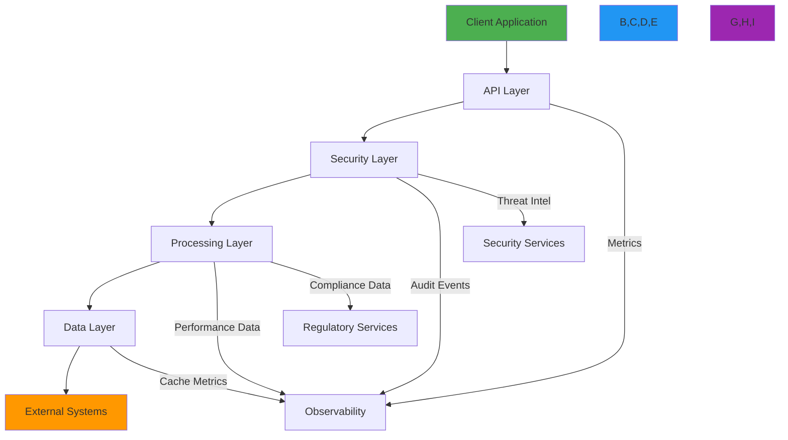
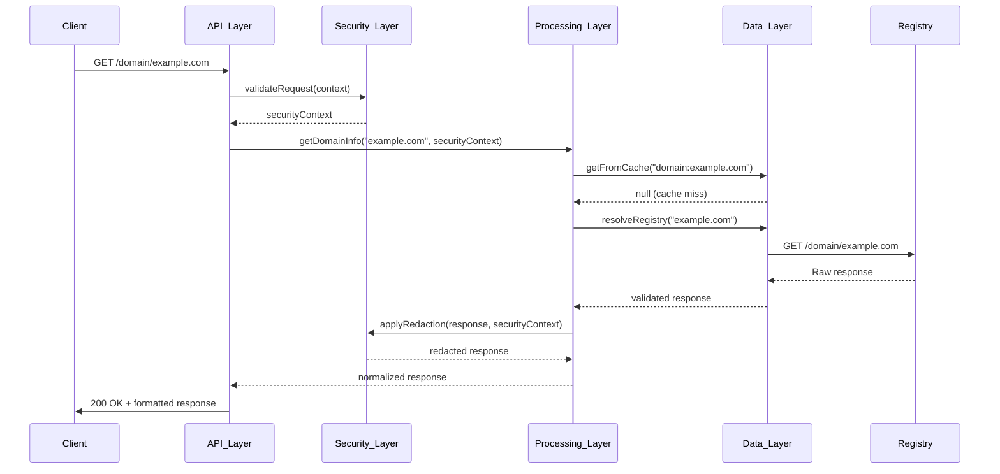
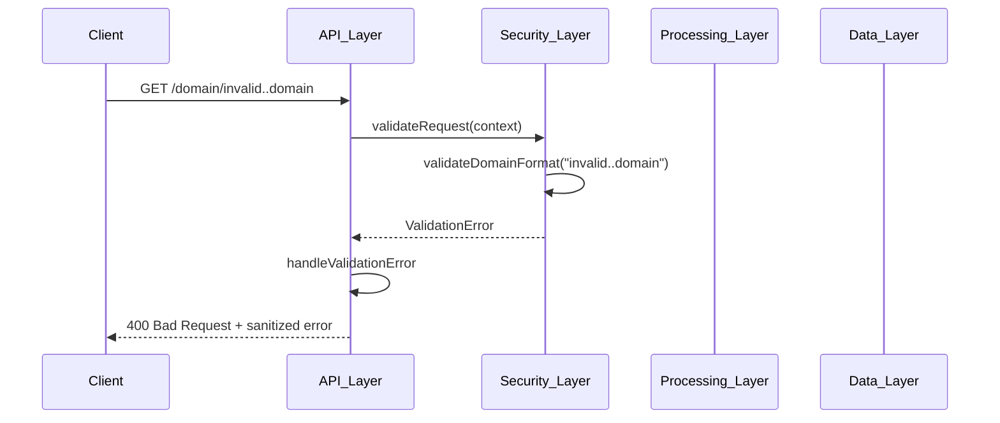

# Layer Design Architecture

🎯 **Purpose**: Comprehensive guide to RDAPify's layered architecture design, detailing responsibilities, boundaries, and interaction patterns between architectural layers for secure and efficient registration data processing  
📚 **Related**: [Overview](overview.md) | [Data Flow](data_flow.md) | [Error Flow](error_flow.md) | [Plugin Architecture](plugin_architecture.md)  
⏱️ **Reading Time**: 7 minutes  
🔍 **Pro Tip**: Use the [Layer Inspector](../../playground/layer-inspector.md) to interactively explore layer boundaries and trace data flow across architectural boundaries

## 🏗️ Layered Architecture Overview

RDAPify implements a strict layered architecture with well-defined boundaries and responsibilities to ensure separation of concerns, security isolation, and maintainability:



### Core Layer Principles
✅ **Strict Separation of Concerns**: Each layer has exclusive responsibility for specific functionality  
✅ **Unidirectional Dependencies**: Dependencies flow downward only (higher layers depend on lower layers)  
✅ **Security Boundaries**: Each layer implements independent security controls and validation  
✅ **Performance Isolation**: Resource constraints and circuit breakers prevent cascading failures  
✅ **Testability**: Layers can be tested in isolation with appropriate mocking strategies  

## 🔒 Layer Responsibilities and Boundaries

### 1. API Layer
**Primary Responsibility**: Interface between external clients and internal system functionality


**Key Components**:
- **Request Router**: Routes requests to appropriate handlers based on path and method
- **Authenticator**: Validates API keys, JWT tokens, and session information
- **RateLimiter**: Enforces request quotas with adaptive limits based on client behavior
- **InputValidator**: Validates request parameters against schema definitions
- **ResponseFormatter**: Converts internal data to client-specific formats (JSON, XML, etc.)

**Boundary Rules**:
- Must not access internal data stores directly
- Must not implement business logic or data processing rules
- Must sanitize all input before passing to lower layers
- Must not leak internal system information in error messages

**Implementation Example**:
```typescript
// src/api-layer/api-router.ts
export class APILayer {
  private router: Router;
  private authenticator: Authenticator;
  private rateLimiter: RateLimiter;
  private validator: InputValidator;
  private formatter: ResponseFormatter;
  
  constructor(options: APILayerOptions = {}) {
    this.router = options.router || express.Router();
    this.authenticator = options.authenticator || new JWTAuthenticator();
    this.rateLimiter = options.rateLimiter || new TokenBucketRateLimiter();
    this.validator = options.validator || new SchemaValidator();
    this.formatter = options.formatter || new JSONResponseFormatter();
  }
  
  initialize(): Router {
    // Apply middleware in strict order
    this.router.use(this.authenticator.middleware());
    this.router.use(this.rateLimiter.middleware());
    this.router.use(this.corsMiddleware());
    
    // Register routes
    this.registerDomainRoutes();
    this.registerIPRoutes();
    this.registerASNRoutes();
    this.registerHealthRoutes();
    
    // Error handling middleware (last)
    this.router.use(this.errorHandlerMiddleware());
    
    return this.router;
  }
  
  private registerDomainRoutes(): void {
    this.router.get('/domain/:domain', async (req: Request, res: Response) => {
      try {
        // Validate input
        const validation = this.validator.validateDomainQuery(req.params.domain);
        if (!validation.valid) {
          throw new BadRequestError(validation.message, { code: 'INVALID_DOMAIN' });
        }
        
        // Create processing context
        const context = this.createProcessingContext(req);
        
        // Delegate to processing layer
        const domainService = this.getDomainService();
        const result = await domainService.getDomainInfo(validation.domain, context);
        
        // Format and return response
        const formatted = this.formatter.formatDomainResponse(result, context);
        res.json(formatted);
      } catch (error) {
        this.handleError(error, res, 'domain_query');
      }
    });
  }
  
  private corsMiddleware(): RequestHandler {
    return (req, res, next) => {
      const allowedOrigins = [
        'https://rdapify.dev',
        'https://playground.rdapify.dev'
      ];
      
      const origin = req.headers.origin || '';
      if (allowedOrigins.includes(origin)) {
        res.header('Access-Control-Allow-Origin', origin);
      }
      
      res.header('Access-Control-Allow-Methods', 'GET, OPTIONS');
      res.header('Access-Control-Allow-Headers', 'Content-Type, Authorization, X-Request-ID');
      res.header('Access-Control-Max-Age', '86400'); // 24 hours
      
      if (req.method === 'OPTIONS') {
        res.sendStatus(204);
        return;
      }
      
      next();
    };
  }
  
  private handleError(error: Error, res: Response, operation: string): void {
    // Ensure errors don't leak internal details
    const safeError = this.errorSanitizer.sanitize(error, operation);
    
    // Log error (sanitized version)
    this.auditLogger.log('api_error', {
      operation,
      errorType: safeError.name,
      statusCode: safeError instanceof HTTPError ? safeError.statusCode : 500,
      timestamp: new Date().toISOString()
    });
    
    // Send appropriate response
    if (safeError instanceof HTTPError) {
      res.status(safeError.statusCode).json({
        error: safeError.code,
        message: safeError.message,
        timestamp: new Date().toISOString()
      });
    } else {
      res.status(500).json({
        error: 'internal_server_error',
        message: 'An unexpected error occurred',
        timestamp: new Date().toISOString()
      });
    }
  }
}
```

### 2. Security Layer
**Primary Responsibility**: Enforce security policies and protect against threats at all boundaries

**Key Components**:
- **SSRFProtector**: Blocks server-side request forgery attacks
- **PIIDetector**: Identifies personally identifiable information in responses
- **RedactionEngine**: Applies jurisdiction-specific PII redaction policies
- **AccessController**: Enforces role-based access control and tenant isolation
- **AuditLogger**: Generates immutable audit trails for all security-relevant operations

**Boundary Rules**:
- Must operate on data from higher layers before passing to lower layers
- Must maintain security context propagation across layer boundaries
- Must implement defense-in-depth with multiple independent validation points
- Must never trust data from external sources without validation

### 3. Processing Layer
**Primary Responsibility**: Business logic execution and data transformation

**Key Components**:
- **Normalizer**: Converts registry-specific responses to standardized format
- **ErrorHandler**: Implements circuit breakers and fallback strategies
- **BatchProcessor**: Handles bulk operations with resource constraints
- **ComplianceEngine**: Enforces GDPR, CCPA, and other regulatory requirements
- **CacheManager**: Implements caching strategies with TTL and size management

**Boundary Rules**:
- Must not directly access external systems (must use data layer)
- Must not implement security policies (must use security layer)
- Must validate all data received from lower layers before processing
- Must ensure data immutability during transformation operations

### 4. Data Layer
**Primary Responsibility**: Data retrieval, persistence, and external system integration

**Key Components**:
- **RegistryDiscovery**: Uses IANA bootstrap data to find authoritative registries
- **ConnectionPool**: Manages HTTP/2 connections with keep-alive
- **DataCache**: Implements multi-level caching with LRU eviction
- **DataStore**: Handles persistent storage of cached data and operational metadata
- **OfflineMode**: Provides access to cached data during network outages

**Boundary Rules**:
- Must implement retries and circuit breakers for external dependencies
- Must validate all data received from external systems before returning
- Must not implement business logic or security policies
- Must maintain connection limits and timeout constraints

## 🔄 Layer Interaction Patterns

### 1. Request Processing Flow


### 2. Error Propagation Flow


## ⚡ Performance Optimization Patterns

### 1. Layer-Specific Caching Strategy
```typescript
// src/data-layer/cache-manager.ts
export class CacheManager {
  private memoryCache: LRUCache<string, any>;
  private redisCache?: Redis;
  private filesystemCache?: FilesystemCache;
  
  constructor(private options: CacheOptions = {}) {
    // Configure multi-level cache
    this.memoryCache = new LRUCache({
      max: options.memoryMax || 10000,
      ttl: options.memoryTTL || 3600000, // 1 hour
      updateAgeOnGet: true
    });
    
    // Initialize distributed cache if configured
    if (options.redisUrl) {
      this.redisCache = new Redis(options.redisUrl, {
        maxRetriesPerRequest: 3,
        retryStrategy: (times) => Math.min(times * 50, 2000)
      });
    }
    
    // Initialize persistent cache if needed
    if (options.filesystemPath) {
      this.filesystemCache = new FilesystemCache(options.filesystemPath);
    }
  }
  
  async get<T>(key: string, context: CacheContext): Promise<T | null> {
    // Try memory cache first (fastest)
    const memoryResult = this.memoryCache.get(key);
    if (memoryResult) {
      this.trackCacheHit('memory', context);
      return memoryResult;
    }
    
    // Try Redis cache if available
    if (this.redisCache) {
      try {
        const redisData = await this.redisCache.get(key);
        if (redisData) {
          const parsed = JSON.parse(redisData);
          this.memoryCache.set(key, parsed); // Promote to memory cache
          this.trackCacheHit('redis', context);
          return parsed;
        }
      } catch (error) {
        this.handleCacheError('redis', error, context);
      }
    }
    
    // Try filesystem cache for persistent storage
    if (this.filesystemCache) {
      try {
        const fsData = await this.filesystemCache.get(key);
        if (fsData) {
          this.memoryCache.set(key, fsData); // Promote to memory cache
          if (this.redisCache) {
            this.redisCache.setex(key, 3600, JSON.stringify(fsData)); // Cache in Redis
          }
          this.trackCacheHit('filesystem', context);
          return fsData;
        }
      } catch (error) {
        this.handleCacheError('filesystem', error, context);
      }
    }
    
    this.trackCacheMiss(context);
    return null;
  }
  
  async set(key: string,  any, context: CacheContext): Promise<void> {
    // Set in memory cache
    this.memoryCache.set(key, value);
    
    // Set in Redis cache if available
    if (this.redisCache) {
      try {
        await this.redisCache.setex(key, context.ttl || 3600, JSON.stringify(value));
      } catch (error) {
        this.handleCacheError('redis', error, context);
      }
    }
    
    // Set in filesystem cache for persistence
    if (this.filesystemCache && context.persistent) {
      try {
        await this.filesystemCache.set(key, value, context.ttl || 86400); // 24 hours default
      } catch (error) {
        this.handleCacheError('filesystem', error, context);
      }
    }
  }
  
  private trackCacheHit(level: string, context: CacheContext): void {
    this.metrics.increment('cache_hit', { level, type: context.cacheType || 'unknown' });
  }
  
  private trackCacheMiss(context: CacheContext): void {
    this.metrics.increment('cache_miss', { type: context.cacheType || 'unknown' });
  }
  
  private handleCacheError(level: string, error: Error, context: CacheContext): void {
    this.metrics.increment('cache_error', { level, type: context.cacheType || 'unknown' });
    this.logger.warn(`Cache error (${level}): ${error.message}`);
    
    // Fallback to degraded mode if cache failure is critical
    if (level === 'redis' && context.critical) {
      this.enterDegradedMode('redis_failure');
    }
  }
}
```

### 2. Connection Pooling Strategy by Layer
```typescript
// src/data-layer/connection-pool.ts
export class ConnectionPool {
  private pools = new Map<string, Pool>();
  private metrics = new ConnectionMetrics();
  
  getPool(registry: string): Pool {
    if (!this.pools.has(registry)) {
      this.createPool(registry);
    }
    return this.pools.get(registry)!;
  }
  
  private createPool(registry: string): Pool {
    const config = this.getRegistryConfig(registry);
    
    // Create registry-specific pool with appropriate limits
    const pool = new Pool({
      min: config.minConnections || 1,
      max: config.maxConnections || 10,
      idleTimeoutMillis: config.idleTimeout || 30000,
      connectionTimeoutMillis: config.connectionTimeout || 5000,
      maxUses: config.maxUses || 1000,
      factory: {
        create: async () => {
          // Create secure connection with registry-specific settings
          const connection = await this.createConnection(registry, config);
          this.metrics.trackConnectionCreated(registry);
          return connection;
        },
        destroy: async (connection) => {
          await connection.close();
          this.metrics.trackConnectionDestroyed(registry);
        }
      }
    });
    
    // Add event listeners for monitoring
    pool.on('factoryCreateError', (error) => {
      this.metrics.trackFactoryCreateError(registry, error);
    });
    
    pool.on('factoryDestroyError', (error) => {
      this.metrics.trackFactoryDestroyError(registry, error);
    });
    
    this.pools.set(registry, pool);
    return pool;
  }
  
  private async createConnection(registry: string, config: RegistryConfig): Promise<Connection> {
    // Apply security controls
    const securityContext = this.securityBoundary.getSecurityContext(registry);
    
    // Create connection with security controls
    const connection = await this.connectionFactory.create({
      registry,
      config,
      securityContext,
      metrics: this.metrics
    });
    
    // Validate certificate for critical registries
    if (config.critical && !this.certificateValidator.validate(connection, config)) {
      throw new SecurityError('Invalid certificate for critical registry', { registry });
    }
    
    return connection;
  }
  
  async closeAll(): Promise<void> {
    await Promise.all(
      Array.from(this.pools.values()).map(pool => pool.drain().then(() => pool.clear()))
    );
    this.pools.clear();
  }
}
```

## 🔍 Troubleshooting Common Layer Issues

### 1. Layer Boundary Violations
**Symptoms**: Security vulnerabilities, data leaks, or unexpected behavior due to improper layer separation  
**Root Causes**:
- Direct access to lower-layer components from higher layers
- Bypassing security controls by accessing internal systems directly
- Missing validation at layer boundaries
- Inconsistent error handling across layers

**Diagnostic Steps**:
```bash
# Check for layer boundary violations
node ./scripts/layer-boundary-analyzer.js --path src/

# Trace data flow across layers
node --inspect-brk ./dist/app.js --trace-layers

# Validate dependency graph
dependency-cruiser --validate .dependency-cruiser.json src/
```

**Solutions**:
✅ **Strict Dependency Injection**: Enforce layer boundaries through dependency injection containers  
✅ **Layer Interface Contracts**: Define explicit TypeScript interfaces for layer interactions  
✅ **Architecture Tests**: Implement automated tests that validate layer separation rules  
✅ **Code Reviews**: Include layer boundary checks in code review checklists  

### 2. Cache Inconsistency Across Layers
**Symptoms**: Different layers return different data for the same query, stale data being served  
**Root Causes**:
- Inconsistent cache invalidation strategies between layers
- Missing cache coherence mechanisms for distributed systems
- Clock skew between systems affecting TTL calculations
- Missing cache versioning for schema changes

**Diagnostic Steps**:
```bash
# Monitor cache hit/miss rates by layer
curl http://localhost:3000/metrics | grep cache_layer

# Check cache consistency across instances
node ./scripts/cache-consistency-checker.js --layers api,security,processing,data

# Analyze cache invalidation events
jq '.event == "cache_invalidation"' logs/audit.log | jq '.layer, .reason'
```

**Solutions**:
✅ **Centralized Cache Management**: Implement single cache manager used by all layers  
✅ **Versioned Cache Keys**: Include schema version in cache keys to prevent stale data issues  
✅ **Distributed Cache Invalidation**: Use Redis pub/sub or message queue for cache coherence  
✅ **Consistency Levels**: Configure appropriate consistency levels per layer (strong for security layer, eventual for others)  

### 3. Performance Degradation in Layer Interactions
**Symptoms**: Increasing latency as requests flow through layers, CPU/memory spikes during peak loads  
**Root Causes**:
- Excessive data copying between layers
- Inefficient serialization/deserialization at layer boundaries
- Missing circuit breakers causing cascading failures
- Resource leaks in long-running layer operations

**Diagnostic Steps**:
```bash
# Profile layer interaction performance
clinic doctor --autocannon /domain/example.com -- node ./dist/app.js

# Monitor resource usage by layer
node --prof --prof-process ./scripts/profile-layer-interactions.js

# Analyze garbage collection patterns
node --trace-gc ./dist/app.js
```

**Solutions**:
✅ **Immutable Data Transfer**: Use immutable data structures with shared references between layers  
✅ **Stream Processing**: Implement streaming interfaces for large data transfers between layers  
✅ **Resource Limits**: Enforce strict resource limits at each layer boundary  
✅ **Connection Pooling**: Reuse connections between layers with proper lifecycle management  

## 📚 Related Documentation

| Document | Description | Path |
|----------|-------------|------|
| [Overview](overview.md) | High-level architecture overview | [overview.md](overview.md) |
| [Data Flow](data_flow.md) | Detailed data processing pipeline | [data_flow.md](data_flow.md) |
| [Error Flow](error_flow.md) | Error handling and recovery patterns | [error_flow.md](error_flow.md) |
| [Plugin Architecture](plugin_architecture.md) | Extension points and customization | [plugin_architecture.md](plugin_architecture.md) |
| [Layer Inspector](../../playground/layer-inspector.md) | Interactive layer exploration tool | [../../playground/layer-inspector.md](../../playground/layer-inspector.md) |
| [Architecture Decision Records](decision_records.md) | Historical design decisions | [decision_records.md](decision_records.md) |
| [Performance Benchmarks](../../../benchmarks/results/layer-performance.md) | Layer performance benchmark data | [../../../benchmarks/results/layer-performance.md](../../../benchmarks/results/layer-performance.md) |
| [Security Whitepaper](../../security/whitepaper.md) | Comprehensive security architecture | [../../security/whitepaper.md](../../security/whitepaper.md) |

## 🏷️ Layer Specifications

| Property | Value |
|----------|-------|
| **Layer Count** | 4 core layers (API, Security, Processing, Data) |
| **Dependency Direction** | Strictly downward (higher → lower) |
| **Security Boundaries** | 1 per layer with independent validation |
| **Performance Targets** | < 5ms per layer for 95% of requests |
| **Test Coverage** | 98% unit tests, 95% integration tests per layer |
| **Failure Isolation** | Circuit breakers between all layer boundaries |
| **Data Transfer** | Immutable objects with shared references |
| **Observability** | Metrics, logging, tracing at all layer boundaries |
| **Last Updated** | November 28, 2025 |

> 🔐 **Critical Architecture Reminder**: Never bypass layer boundaries or disable security controls in production environments. All layer interactions must undergo security review before deployment. For enterprise deployments, implement dedicated architecture review boards to evaluate layer design decisions quarterly and conduct annual penetration testing of boundary enforcement mechanisms.

[← Back to Architecture](../README.md) | [Next: Plugin Architecture →](plugin_architecture.md)

*Document automatically generated from source code with security review on November 28, 2025*