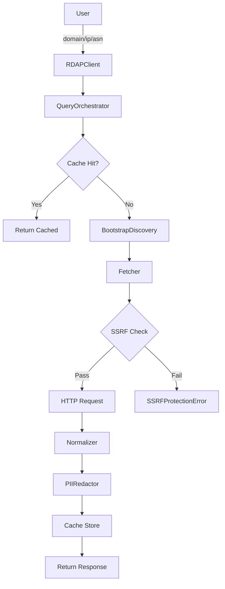
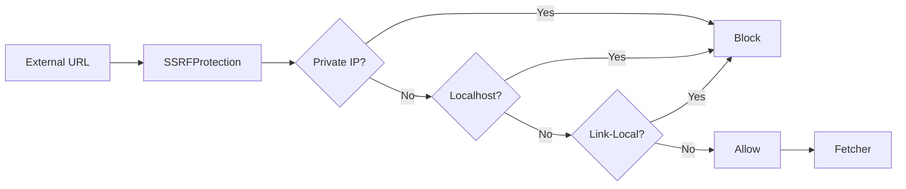

# Architecture Overview

## Current Architecture (v0.1.0-alpha.4)

RDAPify follows a **modular, layered design** with clear separation of concerns.

### Module Structure

```
src/
├── client/              # Public API & Orchestration
│   ├── RDAPClient.ts           # Main client class
│   └── QueryOrchestrator.ts    # Query execution logic
│
├── fetcher/             # HTTP & Discovery
│   ├── Fetcher.ts              # HTTP client with retry
│   ├── BootstrapDiscovery.ts   # IANA bootstrap service
│   └── SSRFProtection.ts       # Security layer
│
├── normalizer/          # Data Transformation
│   ├── Normalizer.ts           # Response normalization
│   └── PIIRedactor.ts          # Privacy controls
│
├── cache/               # Caching Infrastructure
│   ├── CacheManager.ts         # Cache orchestration
│   └── InMemoryCache.ts        # LRU cache implementation
│
├── types/               # Type Definitions
│   ├── entities.ts             # RDAP entities
│   ├── enums.ts                # Enumerations
│   ├── errors.ts               # Error hierarchy
│   ├── options.ts              # Configuration types
│   ├── responses.ts            # Response models
│   └── index.ts                # Public types
│
└── utils/               # Utilities
    ├── validators/             # Input validation
    └── helpers/                # Helper functions
```

### Data Flow



### Key Design Principles

#### 1. Security by Default
- All external URLs validated through `SSRFProtection`
- Private IP ranges blocked (RFC 1918)
- Certificate validation enforced
- PII redaction enabled by default

#### 2. Privacy by Design
- Automatic PII detection and redaction
- GDPR/CCPA compliance built-in
- Configurable privacy controls
- No data retention beyond cache TTL

#### 3. Performance Optimized
- Smart caching with LRU eviction
- Configurable TTL (default: 1 hour)
- Bootstrap data cached (24 hours)
- Parallel query support

#### 4. Error Resilience
- Retry logic with exponential backoff
- Graceful degradation
- Detailed error context
- Type-safe error handling

### Component Responsibilities

#### RDAPClient
- **Purpose:** Public API surface
- **Responsibilities:**
  - Configuration management
  - Component initialization
  - Public method exposure
- **Dependencies:** All other modules

#### QueryOrchestrator
- **Purpose:** Query execution pipeline
- **Responsibilities:**
  - Validation → Cache → Discovery → Fetch → Normalize → Redact
  - Common query pattern enforcement
  - Error propagation
- **Dependencies:** Cache, Bootstrap, Fetcher, Normalizer, PIIRedactor

#### Fetcher
- **Purpose:** HTTP communication
- **Responsibilities:**
  - HTTP requests with timeout
  - Redirect handling
  - Response parsing
  - SSRF protection integration
- **Dependencies:** SSRFProtection

#### BootstrapDiscovery
- **Purpose:** RDAP server discovery
- **Responsibilities:**
  - IANA bootstrap data fetching
  - TLD/IP/ASN to server mapping
  - Bootstrap cache management
- **Dependencies:** Fetcher

#### Normalizer
- **Purpose:** Response standardization
- **Responsibilities:**
  - Raw RDAP → typed response
  - Field extraction and mapping
  - Consistent output format
- **Dependencies:** None (pure transformation)

#### PIIRedactor
- **Purpose:** Privacy protection
- **Responsibilities:**
  - PII pattern detection
  - Data redaction
  - Configurable redaction rules
- **Dependencies:** None (pure transformation)

#### CacheManager
- **Purpose:** Cache orchestration
- **Responsibilities:**
  - Cache strategy selection
  - TTL management
  - Statistics tracking
- **Dependencies:** ICache implementations

### Security Architecture



**SSRF Protection Rules:**
- Block RFC 1918 private ranges (10.0.0.0/8, 172.16.0.0/12, 192.168.0.0/16)
- Block localhost (127.0.0.0/8, ::1)
- Block link-local (169.254.0.0/16, fe80::/10)
- Block multicast and broadcast
- Validate before DNS resolution (prevent DNS rebinding)

### Future Architecture (v0.2.0+)

**Planned improvements:**
1. **Layered Architecture:** Strict core/infrastructure/domain/security separation
2. **Plugin System:** Extensible cache/fetcher/normalizer adapters
3. **Multi-Runtime:** Native Bun/Deno/Cloudflare Workers support
4. **Advanced Caching:** Redis, geo-distributed, hierarchical
5. **Observability:** Metrics, tracing, structured logging

See `ROADMAP.md` for detailed timeline.

### Testing Strategy

- **Unit Tests:** Individual module behavior
- **Integration Tests:** End-to-end client functionality
- **Fixtures:** Real RDAP responses from major registries
- **Coverage:** &gt;90% code coverage maintained

### Performance Characteristics

- **Cold start:** ~50-100ms (bootstrap fetch)
- **Cached query:** &lt;1ms
- **Uncached query:** ~100-500ms (network dependent)
- **Memory:** ~10-50MB (depends on cache size)
- **Throughput:** 100+ queries/second (cached)

### Dependencies

**Production:**
- `ipaddr.js` - IP address parsing and CIDR matching
- `tslib` - TypeScript runtime helpers

**Zero external HTTP dependencies** - uses native `fetch` API.

### Compatibility

- **Node.js:** 16.x, 18.x, 20.x+
- **TypeScript:** 5.x
- **Module Systems:** ESM + CJS
- **Future:** Bun, Deno, Cloudflare Workers

---

**Last Updated:** 2026-01-24  
**Version:** 0.1.0-alpha.4
