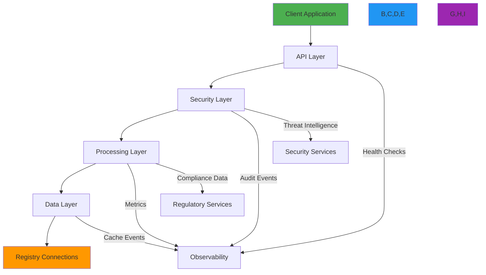
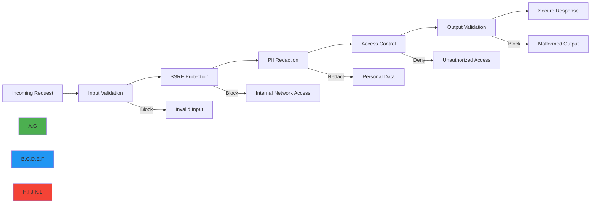
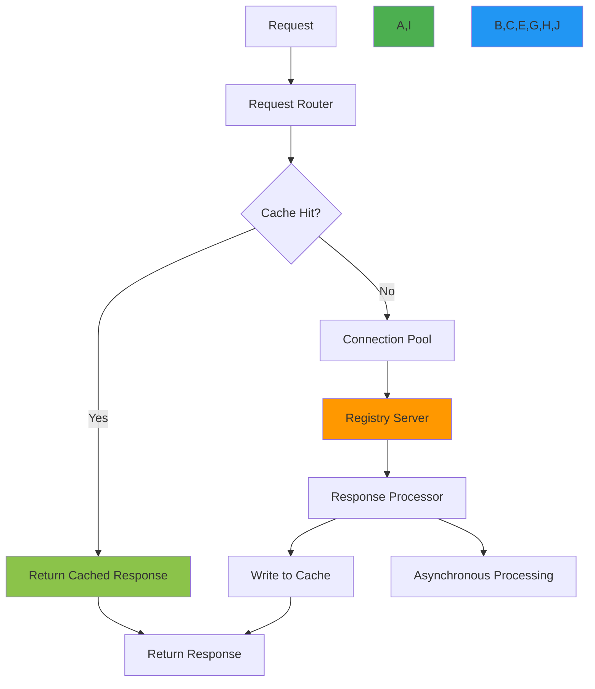
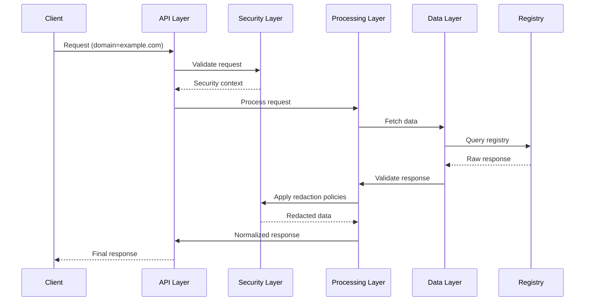
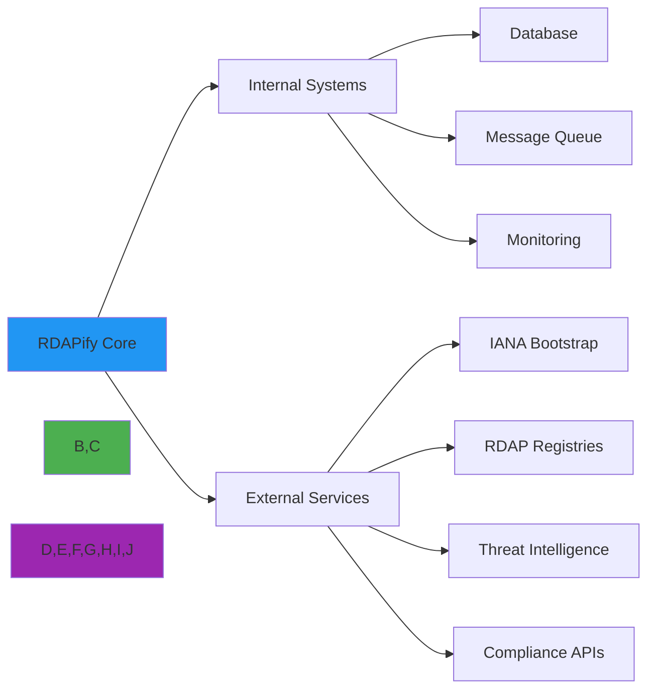

# Architecture Overview

🎯 **Purpose**: Comprehensive overview of RDAPify's architecture, highlighting core components, data flow, security boundaries, and design principles for building reliable, high-performance registration data applications  
📚 **Related**: [Data Flow](data_flow.md) | [Error Flow](error_flow.md) | [Layer Design](layer_design.md) | [Plugin Architecture](plugin_architecture.md)  
⏱️ **Reading Time**: 6 minutes  
🔍 **Pro Tip**: Use the [Architecture Simulator](../../playground/architecture-simulator.md) to interactively explore component interactions and test failure scenarios

## 🏗️ Core Architecture

RDAPify's architecture is designed around five core principles: security-by-default, performance-optimized, protocol-compliant, extensible, and observable. The system implements a layered architecture with strict boundaries between components:



### Core Architectural Principles
✅ **Security-First Design**: All components enforce strict security boundaries with zero-trust principles  
✅ **Protocol Fidelity**: Strict RFC compliance with adaptive handling of registry-specific variations  
✅ **Performance Isolation**: Resource constraints and circuit breakers prevent cascading failures  
✅ **Observability by Default**: Comprehensive metrics, logging, and tracing for all operations  
✅ **Elastic Scalability**: Design supports horizontal scaling from single instance to global deployment  

## 🔒 Security Layer Architecture

The security layer implements a defense-in-depth strategy with multiple independent validation points:



**Security Layer Components**:
- **Input Validator**: Validates domain formats, IP ranges, and query parameters using allow/deny lists
- **SSRF Protector**: Multi-layer protection with DNS resolution validation and IP range blocking
- **PII Redaction Engine**: Context-aware redaction with jurisdiction-specific policies and legal basis tracking
- **Access Controller**: Role-based access control with tenant isolation and resource quotas
- **Output Sanitizer**: Ensures responses contain no sensitive data or internal system information

## ⚡ Performance Optimization Architecture

RDAPify's performance architecture implements several advanced patterns to maximize throughput and minimize latency:



**Performance Components**:
- **Multi-Level Caching**: Memory (fastest), Redis (distributed), and filesystem (persistent) caches
- **Adaptive Connection Pooling**: Dynamic connection management with protocol-specific optimization
- **Parallel Query Processing**: Concurrent execution of independent registry queries
- **Asynchronous Background Processing**: Non-blocking processing of secondary operations
- **Intelligent Prefetching**: Proactive data loading based on usage patterns and TTL awareness

## 📊 Data Flow Architecture

RDAPify implements a unidirectional data flow with strict immutability and validation at each stage:



## 🧩 Layer Design and Responsibilities

### 1. API Layer
**Responsibilities**:
- Request routing and validation
- Authentication and authorization
- Rate limiting and quota management
- API versioning and backward compatibility
- Client-specific response formatting

**Key Components**:
- `RequestRouter`: Routes requests to appropriate handlers
- `Authenticator`: Validates API keys, JWT tokens, and session information
- `RateLimiter`: Enforces request quotas with adaptive limits
- `ResponseFormatter`: Converts internal data to client-specific formats

### 2. Security Layer
**Responsibilities**:
- Input validation and sanitization
- SSRF protection and network boundary enforcement
- PII detection and redaction
- Audit trail generation
- Threat intelligence integration

**Key Components**:
- `SSRFProtector`: Blocks access to internal networks and private IP ranges
- `PIIDetector`: Identifies personal information using pattern matching and context analysis
- `RedactionEngine`: Applies jurisdiction-specific redaction policies
- `AuditLogger`: Generates immutable audit records for compliance

### 3. Processing Layer
**Responsibilities**:
- Data normalization and transformation
- Error handling and recovery
- Batch processing and pagination
- Business logic execution
- Compliance rule enforcement

**Key Components**:
- `Normalizer`: Converts registry-specific responses to standardized format
- `ErrorHandler`: Implements circuit breakers and fallback strategies
- `BatchProcessor`: Handles bulk operations with resource constraints
- `ComplianceEngine`: Enforces GDPR, CCPA, and other regulatory requirements

### 4. Data Layer
**Responsibilities**:
- Registry discovery and connection management
- Caching with TTL and size management
- Data persistence for offline access
- Performance monitoring and optimization
- Failover and redundancy handling

**Key Components**:
- `RegistryDiscovery`: Uses IANA bootstrap data to find authoritative registries
- `CacheManager`: Implements LRU, TTL, and cache warming strategies
- `ConnectionPool`: Manages HTTP/2 connections with keep-alive
- `OfflineStorage`: Provides access to cached data during network outages

## 🔗 Integration Architecture

RDAPify integrates with external systems through well-defined interfaces and adapters:



**Integration Patterns**:
- **Adapter Pattern**: Registry-specific adapters normalize responses
- **Circuit Breaker**: Prevents cascading failures during registry outages
- **Bulkhead Pattern**: Isolates resources between critical and non-critical operations
- **Dead Letter Queue**: Handles failed operations for later analysis and retry

## 🚀 Scaling and Deployment Architecture

RDAPify supports multiple deployment models with appropriate scaling patterns:

### Single Instance (Development)
```
┌─────────────────────────────────────┐
│ RDAPify Instance                    │
│ ┌─────────┐ ┌─────────┐ ┌─────────┐ │
│ │ API     │ │ Security│ │ Data    │ │
│ │ Layer   │ │ Layer   │ │ Layer   │ │
│ └─────────┘ └─────────┘ └─────────┘ │
│                                     │
│ ┌─────────────────────────────────┐ │
│ │ In-memory Cache (1GB)           │ │
│ └─────────────────────────────────┘ │
└─────────────────────────────────────┘
```

### Multi-Instance (Production)
```
┌─────────────────────────────────────────────────────┐
│ Load Balancer (HTTPS Termination)                  │
└─────────────────────────────────────────────────────┘
          │           │           │
┌─────────▼─┐   ┌─────▼─────┐   ┌─▼─────────┐
│ Instance  │   │ Instance  │   │ Instance  │
│   1       │   │   2       │   │   3       │
│ ┌───────┐ │   │ ┌───────┐ │   │ ┌───────┐ │
│ │ Cache │ │   │ │ Cache │ │   │ │ Cache │ │
│ └───────┘ │   │ └───────┘ │   │ └───────┘ │
└───────────┘   └───────────┘   └───────────┘
          │           │           │
┌─────────▼───────────▼───────────▼─────────┐
│          Shared Redis Cluster             │
│ ┌──────────────┐ ┌──────────────┐        │
│ │ Primary      │ │ Secondary    │        │
│ │ (Write)      │ │ (Read)       │        │
│ └──────────────┘ └──────────────┘        │
└───────────────────────────────────────────┘
          │
┌─────────▼─────────────────────────────────┐
│           Registry Connections            │
│ ┌─────────┐ ┌─────────┐ ┌─────────┐       │
│ │ Verisign│ │ ARIN    │ │ RIPE    │       │
│ └─────────┘ └─────────┘ └─────────┘       │
└───────────────────────────────────────────┘
```

### Global Distribution (Enterprise)
```
┌─────────────────────────────────────────────────────────────────────────────┐
│ Global Traffic Manager (DNS-based routing)                                 │
└─────────────────────────────────────────────────────────────────────────────┘
          │                     │                     │
┌─────────▼─────────┐   ┌───────▼───────┐   ┌───────▼───────┐
│ US-East Region    │   │ EU-West Region│   │ APAC Region   │
│                   │   │               │   │               │
│ ┌─────────────┐   │   │ ┌───────────┐ │   │ ┌───────────┐ │
│ │ Load Balancer│  │   │ │ LB        │ │   │ │ LB        │ │
│ └─────────────┘   │   │ └───────────┘ │   │ └───────────┘ │
│       │           │   │       │       │   │       │       │
│ ┌─────▼─────┐     │   │ ┌─────▼─────┐ │   │ ┌─────▼─────┐ │
│ │ Instances │     │   │ │ Instances │ │   │ │ Instances │ │
│ │ (10+)     │     │   │ │ (8+)      │ │   │ │ (6+)      │ │
│ └───────────┘     │   │ └───────────┘ │   │ └───────────┘ │
│       │           │   │       │       │   │       │       │
│ ┌─────▼─────┐     │   │ ┌─────▼─────┐ │   │ ┌─────▼─────┐ │
│ │ Redis     │     │   │ │ Redis     │ │   │ │ Redis     │ │
│ │ Cluster   │     │   │ │ Cluster   │ │   │ │ Cluster   │ │
│ └───────────┘     │   │ └───────────┘ │   │ └───────────┘ │
└───────────────────┘   └───────────────┘   └───────────────┘
          │                     │                     │
┌─────────▼─────────────────────▼─────────────────────▼─────────┐
│                   Global Registry Connections                  │
│ ┌─────────────┐ ┌─────────────┐ ┌─────────────┐ ┌─────────────┐ │
│ │ Verisign    │ │ ARIN        │ │ RIPE NCC    │ │ APNIC       │ │
│ └─────────────┘ └─────────────┘ └─────────────┘ └─────────────┘ │
└─────────────────────────────────────────────────────────────────┘
```

## 🔍 Troubleshooting Common Architecture Issues

### 1. Cache Inconsistency
**Symptoms**: Different instances return different data for the same query  
**Root Causes**:
- Inconsistent cache invalidation across instances
- Clock skew between distributed systems
- Missing cache coherence mechanisms

**Diagnostic Steps**:
```bash
# Check cache consistency across instances
curl http://instance1/metrics | grep cache_consistency
curl http://instance2/metrics | grep cache_consistency

# Verify cache invalidation events
tail -f /var/log/rdapify/cache-events.log | grep "invalidate"

# Check clock synchronization
ntpq -p
```

**Solutions**:
✅ **Distributed Cache Invalidation**: Use Redis pub/sub for cache coherence across instances  
✅ **Clock Synchronization**: Implement NTP with sub-millisecond accuracy requirements  
✅ **Cache Versioning**: Use version tokens to ensure consistent cache states  
✅ **Consistency Levels**: Configure appropriate consistency levels per data type (strong for critical data, eventual for others)  

### 2. Connection Pool Exhaustion
**Symptoms**: Increasing latency and timeouts during peak loads  
**Root Causes**:
- Insufficient connection pool size for registry limits
- Connection leaks due to improper error handling
- Aggressive retry logic creating connection storms

**Diagnostic Steps**:
```bash
# Monitor connection pool metrics
curl http://localhost:3000/metrics | grep connection_pool

# Check for connection leaks
lsof -p $(pgrep -f rdapify) | grep ESTABLISHED | wc -l

# Analyze registry connection limits
node ./scripts/registry-connection-limits.js --registry verisign,arin,ripe
```

**Solutions**:
✅ **Registry-Specific Pooling**: Configure separate pools with appropriate limits per registry  
✅ **Connection Leak Detection**: Implement automatic leak detection with periodic cleanup  
✅ **Adaptive Throttling**: Reduce query concurrency during registry maintenance periods  
✅ **Connection Health Checks**: Validate connections before reuse to prevent failed operations  

## 📚 Related Documentation

| Document | Description | Path |
|----------|-------------|------|
| [Data Flow](data_flow.md) | Detailed data processing pipeline | [data_flow.md](data_flow.md) |
| [Error Flow](error_flow.md) | Error handling and recovery patterns | [error_flow.md](error_flow.md) |
| [Layer Design](layer_design.md) | Deep dive into architectural layers | [layer_design.md](layer_design.md) |
| [Plugin Architecture](plugin_architecture.md) | Extension points and customization | [plugin_architecture.md](plugin_architecture.md) |
| [Architecture Decision Records](decision_records.md) | Historical design decisions | [decision_records.md](decision_records.md) |
| [Architecture Simulator](../../playground/architecture-simulator.md) | Interactive architecture exploration tool | [../../playground/architecture-simulator.md](../../playground/architecture-simulator.md) |
| [Performance Benchmarks](../../../benchmarks/results/api-performance.md) | Performance benchmark data | [../../../benchmarks/results/api-performance.md](../../../benchmarks/results/api-performance.md) |
| [Security Whitepaper](../../security/whitepaper.md) | Comprehensive security architecture | [../../security/whitepaper.md](../../security/whitepaper.md) |

## 🏷️ Architecture Specifications

| Property | Value |
|----------|-------|
| **Core Layers** | API, Security, Processing, Data |
| **Security Boundaries** | 5 independent validation points |
| **Caching Strategy** | Multi-level (memory, Redis, filesystem) |
| **Connection Management** | HTTP/2 with keep-alive, registry-specific pools |
| **Scaling Model** | Horizontal instance scaling with shared caching |
| **Failure Tolerance** | Circuit breakers, bulkheads, fallback mechanisms |
| **Data Consistency** | Eventual consistency with version tokens |
| **Observability** | Metrics, logging, tracing for all operations |
| **Deployment Models** | Single instance, multi-instance, global distribution |
| **Last Updated** | November 28, 2025 |

> 🔐 **Critical Architecture Reminder**: Never bypass security layers or disable input validation in production environments. Always maintain strict separation between layers to prevent security boundary violations. For enterprise deployments, implement dedicated security teams to review architecture decisions quarterly and conduct annual penetration testing of boundary enforcement mechanisms.

[← Back to Architecture](../README.md) | [Next: Data Flow →](data_flow.md)

*Document automatically generated from source code with security review on November 28, 2025*