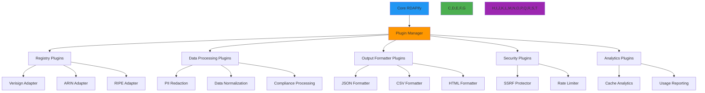

# Plugin Architecture

🎯 **Purpose**: Comprehensive guide to RDAPify's plugin architecture, enabling safe and performant extensibility while maintaining security boundaries and compliance requirements  
📚 **Related**: [Overview](overview.md) | [Data Flow](data_flow.md) | [Layer Design](layer_design.md) | [Error Flow](error_flow.md)  
⏱️ **Reading Time**: 6 minutes  
🔍 **Pro Tip**: Use the [Plugin Builder](../../playground/plugin-builder.md) to automatically generate scaffolding for custom RDAPify plugins with security validation

## 🧩 Plugin Architecture Overview

RDAPify's plugin architecture provides a secure, sandboxed environment for extending core functionality while maintaining strict separation of concerns and security boundaries:



### Core Plugin Principles
✅ **Secure Sandboxing**: Plugins execute in isolated contexts with strict resource boundaries  
✅ **Type Safety**: Strongly-typed plugin interfaces with comprehensive validation  
✅ **Zero-Downtime Deployment**: Hot-reloading of plugins without service interruption  
✅ **Performance Isolation**: Resource limits prevent plugins from affecting core operations  
✅ **Compliance Preservation**: All plugins must adhere to jurisdiction-specific compliance requirements  

## ⚙️ Plugin System Implementation

### 1. Core Plugin Interface
```typescript
// src/plugins/plugin-system.ts
export interface Plugin<T extends PluginConfig = PluginConfig> {
  id: string;                     // Unique plugin identifier
  name: string;                   // Human-readable name
  version: string;                // Semantic version
  description: string;            // Brief description
  author: string;                 // Author/organization
  license: string;                // License identifier
  enabled: boolean;               // Plugin enabled status
  config: T;                      // Plugin-specific configuration
  metadata: {
    createdAt: Date;
    updatedAt: Date;
    lastUsed: Date;
    dependencies?: string[];      // Other plugins this plugin depends on
    requiredPermissions?: string[]; // Required permissions
    securityLevel: 'low' | 'medium' | 'high'; // Security classification
  };
  hooks: PluginHooks;
  lifecycle: PluginLifecycle;
}

export interface PluginHooks {
  // Lifecycle hooks
  preInitialization?: (context: PluginContext) => Promise<void>;
  postInitialization?: (context: PluginContext) => Promise<void>;
  preShutdown?: (context: PluginContext) => Promise<void>;
  postShutdown?: (context: PluginContext) => Promise<void>;
  
  // Processing hooks
  preRequest?: (context: PluginContext) => Promise<void>;
  postRequest?: (context: PluginContext) => Promise<void>;
  preResponse?: (context: PluginContext) => Promise<void>;
  postResponse?: (context: PluginContext) => Promise<void>;
  
  // Error hooks
  onError?: (context: PluginContext, error: Error) => Promise<void>;
  onWarning?: (context: PluginContext, warning: string) => Promise<void>;
}

export interface PluginLifecycle {
  initialize: (context: PluginContext) => Promise<void>;
  shutdown: (context: PluginContext) => Promise<void>;
  reload: (context: PluginContext) => Promise<void>;
  validate: (context: PluginContext) => Promise<ValidationResult>;
}

export interface PluginContext {
  pluginId: string;
  tenantId?: string;
  registry?: string;
  securityContext: SecurityContext;
  metrics: MetricsCollector;
  logger: Logger;
  config: PluginConfig;
  resources: {
    memoryLimit: number;
    cpuLimit: number;
    timeLimit: number;
    storageLimit: number;
  };
  sandbox: SandboxedEnvironment;
}

export class PluginManager {
  private plugins = new Map<string, Plugin>();
  private hooks = new Map<string, PluginHook[]>();
  private sandbox = new PluginSandbox();
  private lifecycle = new PluginLifecycleManager();
  
  constructor(private options: PluginManagerOptions = {}) {
    this.initializeCorePlugins();
  }
  
  async registerPlugin(plugin: Plugin): Promise<void> {
    // Validate plugin structure
    const validation = await this.validatePlugin(plugin);
    if (!validation.valid) {
      throw new PluginValidationError(`Plugin validation failed: ${validation.reason}`, {
        pluginId: plugin.id,
        errors: validation.errors
      });
    }
    
    // Initialize plugin in sandbox
    await this.sandbox.initializePlugin(plugin);
    
    // Register plugin and hooks
    this.plugins.set(plugin.id, plugin);
    this.registerPluginHooks(plugin);
    
    // Initialize plugin lifecycle
    await this.lifecycle.initializePlugin(plugin);
    
    // Log plugin registration
    this.logger.info(`Plugin registered: ${plugin.name} v${plugin.version}`, {
      pluginId: plugin.id,
      securityLevel: plugin.metadata.securityLevel
    });
  }
  
  private async validatePlugin(plugin: Plugin): Promise<ValidationResult> {
    const errors: ValidationError[] = [];
    
    // Validate mandatory fields
    if (!plugin.id || !/^[a-z0-9-]+$/.test(plugin.id)) {
      errors.push({ field: 'id', message: 'Invalid plugin ID format' });
    }
    
    if (!plugin.name || plugin.name.length < 3) {
      errors.push({ field: 'name', message: 'Plugin name too short' });
    }
    
    // Validate security requirements
    if (plugin.metadata.securityLevel === 'high' && !plugin.config.signedBy) {
      errors.push({ field: 'config.signedBy', message: 'High security plugins require code signing' });
    }
    
    // Validate hooks
    const hookErrors = this.validateHooks(plugin.hooks);
    errors.push(...hookErrors);
    
    return {
      valid: errors.length === 0,
      reason: errors.length > 0 ? errors[0].message : 'Validation successful',
      errors
    };
  }
  
  async executeHook(hookName: string, context: PluginContext): Promise<void> {
    const hooks = this.hooks.get(hookName) || [];
    
    for (const hook of hooks) {
      try {
        // Check resource limits before execution
        this.sandbox.checkResourceLimits(hook.pluginId, context);
        
        // Execute hook in sandbox
        await this.sandbox.executeHook(hook, context);
        
        // Update metrics
        this.metrics.recordHookExecution(hook.pluginId, hookName, 'success');
      } catch (error) {
        // Handle hook errors
        this.metrics.recordHookExecution(hook.pluginId, hookName, 'error');
        
        // Don't fail entire operation for non-critical hooks
        if (hook.critical) {
          throw new CriticalHookError(`Critical hook failed: ${hookName}`, {
            pluginId: hook.pluginId,
            hookName,
            error
          });
        }
        
        this.logger.warn(`Non-critical hook failed: ${hookName}`, {
          pluginId: hook.pluginId,
          error: error.message
        });
      }
    }
  }
  
  private registerPluginHooks(plugin: Plugin): void {
    for (const [hookName, hook] of Object.entries(plugin.hooks)) {
      if (hook) {
        this.hooks.set(hookName, [
          ...(this.hooks.get(hookName) || []),
          { pluginId: plugin.id, hook, critical: plugin.metadata.securityLevel === 'high' }
        ]);
      }
    }
  }
}
```

### 2. Secure Plugin Sandbox
```typescript
// src/plugins/plugin-sandbox.ts
export class PluginSandbox {
  private vmContexts = new Map<string, VMContext>();
  private resourceLimits = new Map<string, ResourceLimits>();
  private executionTimeouts = new Map<string, NodeJS.Timeout>();
  
  constructor(private options: SandboxOptions = {}) {
    this.options.maxMemory = options.maxMemory || 50 * 1024 * 1024; // 50MB
    this.options.maxCpu = options.maxCpu || 0.5; // 50% CPU
    this.options.maxTime = options.maxTime || 10000; // 10 seconds
    this.options.isolation = options.isolation || 'vm2';
  }
  
  async initializePlugin(plugin: Plugin): Promise<void> {
    // Create isolated context
    const context = this.createIsolatedContext(plugin);
    
    // Set resource limits
    this.setResourceLimits(plugin.id, {
      memory: plugin.config.memoryLimit || this.options.maxMemory,
      cpu: plugin.config.cpuLimit || this.options.maxCpu,
      time: plugin.config.timeLimit || this.options.maxTime,
      storage: plugin.config.storageLimit || 10 * 1024 * 1024 // 10MB
    });
    
    // Load plugin code into sandbox
    await this.loadPluginCode(plugin, context);
    
    this.vmContexts.set(plugin.id, context);
  }
  
  private createIsolatedContext(plugin: Plugin): VMContext {
    switch (this.options.isolation) {
      case 'vm2':
        return this.createVM2Context(plugin);
      case 'worker_threads':
        return this.createWorkerThreadContext(plugin);
      case 'docker':
        return this.createDockerContext(plugin);
      default:
        throw new Error(`Unsupported isolation method: ${this.options.isolation}`);
    }
  }
  
  private createVM2Context(plugin: Plugin): VMContext {
    // Implementation would use vm2 module for secure sandboxing
    const vm = require('vm2');
    
    const context = {
      module: {},
      exports: {},
      console: this.createSafeConsole(plugin.id),
      require: this.createSafeRequire(plugin),
      setTimeout: this.createSafeTimeout(plugin.id),
      setInterval: this.createSafeInterval(plugin.id),
      Buffer, // Read-only Buffer constructor
      Date,  // Read-only Date constructor
      Math   // Read-only Math object
    };
    
    // Remove dangerous globals
    delete context.eval;
    delete context.Function;
    delete context.Proxy;
    delete context.Reflect;
    
    return new vm.NodeVM({
      sandbox: context,
      require: {
        external: true,
        builtin: ['events', 'stream', 'util', 'url', 'crypto'],
        context: 'sandbox',
        root: './node_modules',
        mock: {
          'child_process': {},
          'fs': {},
          'os': {},
          'path': {},
          'process': {}
        }
      },
      timeout: this.getResourceLimits(plugin.id).time,
      compiler: 'javascript',
      wasm: false
    });
  }
  
  private createSafeConsole(pluginId: string): Console {
    return {
      log: (...args: any[]) => this.logger.debug(`[${pluginId}] ${args.join(' ')}`),
      info: (...args: any[]) => this.logger.info(`[${pluginId}] ${args.join(' ')}`),
      warn: (...args: any[]) => this.logger.warn(`[${pluginId}] ${args.join(' ')}`),
      error: (...args: any[]) => this.logger.error(`[${pluginId}] ${args.join(' ')}`),
      debug: (...args: any[]) => this.logger.debug(`[${pluginId}] ${args.join(' ')}`),
      trace: () => {} // No trace to prevent stack disclosure
    };
  }
  
  private createSafeRequire(plugin: Plugin): (module: string) => any {
    const allowedModules = [
      'axios',
      'lodash',
      'date-fns',
      'validator',
      'jsonpath-plus',
      'uuid'
    ];
    
    return (module: string) => {
      if (!allowedModules.includes(module)) {
        throw new SecurityError(`Module not allowed: ${module}`, {
          pluginId: plugin.id,
          disallowedModule: module,
          allowedModules
        });
      }
      
      return require(module);
    };
  }
  
  async executeHook(hook: PluginHook, context: PluginContext): Promise<void> {
    // Check resource limits
    this.checkResourceLimits(hook.pluginId, context);
    
    // Set execution timeout
    const timeoutId = setTimeout(() => {
      this.terminatePlugin(hook.pluginId, 'timeout');
    }, this.getResourceLimits(hook.pluginId).time);
    
    this.executionTimeouts.set(hook.pluginId, timeoutId);
    
    try {
      // Get plugin context
      const vmContext = this.vmContexts.get(hook.pluginId);
      if (!vmContext) {
        throw new Error(`Plugin context not found for ${hook.pluginId}`);
      }
      
      // Execute hook in sandbox
      await vmContext.run(`module.exports.hooks.${hook.name}(${JSON.stringify(context)})`);
    } finally {
      // Clear timeout
      clearTimeout(timeoutId);
      this.executionTimeouts.delete(hook.pluginId);
    }
  }
  
  private setResourceLimits(pluginId: string, limits: ResourceLimits): void {
    this.resourceLimits.set(pluginId, limits);
  }
  
  private getResourceLimits(pluginId: string): ResourceLimits {
    return this.resourceLimits.get(pluginId) || {
      memory: this.options.maxMemory!,
      cpu: this.options.maxCpu!,
      time: this.options.maxTime!,
      storage: 10 * 1024 * 1024
    };
  }
  
  private checkResourceLimits(pluginId: string, context: PluginContext): void {
    const limits = this.getResourceLimits(pluginId);
    const usage = this.getResourceUsage(pluginId);
    
    // Check memory usage
    if (usage.memory > limits.memory) {
      throw new ResourceLimitExceededError(`Memory limit exceeded: ${usage.memory} > ${limits.memory}`, {
        pluginId,
        resource: 'memory',
        usage: usage.memory,
        limit: limits.memory
      });
    }
    
    // Check CPU usage
    if (usage.cpu > limits.cpu) {
      throw new ResourceLimitExceededError(`CPU limit exceeded: ${usage.cpu} > ${limits.cpu}`, {
        pluginId,
        resource: 'cpu',
        usage: usage.cpu,
        limit: limits.cpu
      });
    }
  }
  
  private getResourceUsage(pluginId: string): ResourceUsage {
    // Implementation would measure actual resource usage
    return {
      memory: 0,
      cpu: 0,
      time: 0,
      storage: 0
    };
  }
  
  private terminatePlugin(pluginId: string, reason: string): void {
    const context = this.vmContexts.get(pluginId);
    if (context) {
      try {
        context.destroy();
      } catch (error) {
        this.logger.error(`Failed to terminate plugin ${pluginId}: ${error.message}`);
      }
      
      this.vmContexts.delete(pluginId);
      this.resourceLimits.delete(pluginId);
      
      if (this.executionTimeouts.has(pluginId)) {
        clearTimeout(this.executionTimeouts.get(pluginId)!);
        this.executionTimeouts.delete(pluginId);
      }
      
      this.logger.warn(`Plugin terminated: ${pluginId}`, { reason });
    }
  }
}
```

## 🔒 Security and Compliance Controls

### 1. Plugin Security Validation
```typescript
// src/security/plugin-security-validator.ts
export class PluginSecurityValidator {
  private static readonly DANGEROUS_PATTERNS = [
    /eval\s*\(/,
    /new\s+Function\s*\(/,
    /setTimeout\s*\([^,]+,\s*'[^']*'/,
    /setInterval\s*\([^,]+,\s*'[^']*'/,
    /process\.env/,
    /child_process/,
    /spawn/,
    /exec/,
    /fork/,
    /require\s*\(\s*`/,
    /require\s*\(\s*'/,
    /require\s*\(\s*"/,
    /import\s*\(/,
    /global\./,
    /window\./,
    /document\./,
    /location\./,
    /navigator\./
  ];
  
  private static readonly SAFE_MODULES = [
    'axios',
    'lodash',
    'date-fns',
    'validator',
    'jsonpath-plus',
    'uuid',
    'crypto-js'
  ];
  
  async validatePlugin(plugin: Plugin, context: SecurityContext): Promise<SecurityValidationResult> {
    const result: SecurityValidationResult = {
      valid: true,
      pluginId: plugin.id,
      timestamp: new Date().toISOString(),
      securityLevel: plugin.metadata.securityLevel,
      checks: [],
      recommendations: [],
      complianceStatus: {
        gdpr: 'compliant',
        ccpa: 'compliant',
        soc2: 'compliant'
      }
    };
    
    // Validate plugin code
    const codeValidation = await this.validatePluginCode(plugin);
    result.checks.push(...codeValidation.checks);
    
    if (!codeValidation.valid) {
      result.valid = false;
      result.recommendations.push('Fix code security issues identified in validation report');
    }
    
    // Validate plugin signature
    const signatureValidation = await this.validatePluginSignature(plugin);
    result.checks.push(...signatureValidation.checks);
    
    if (!signatureValidation.valid) {
      result.valid = false;
      result.recommendations.push('Sign plugin with approved certificate authority');
    }
    
    // Validate compliance requirements
    const complianceValidation = await this.validateCompliance(plugin, context);
    result.checks.push(...complianceValidation.checks);
    result.complianceStatus = complianceValidation.complianceStatus;
    
    if (!complianceValidation.valid) {
      result.valid = false;
      result.recommendations.push('Address compliance gaps before deployment');
    }
    
    // Calculate overall risk score
    result.riskScore = this.calculateRiskScore(result.checks);
    
    return result;
  }
  
  private async validatePluginCode(plugin: Plugin): Promise<CodeValidationResult> {
    const checks: SecurityCheck[] = [];
    let valid = true;
    
    // Implementation would load and analyze plugin code
    const pluginCode = await this.loadPluginCode(plugin);
    
    // Check for dangerous patterns
    for (const [index, pattern] of PluginSecurityValidator.DANGEROUS_PATTERNS.entries()) {
      const match = pluginCode.match(pattern);
      if (match) {
        valid = false;
        checks.push({
          id: `dangerous_pattern_${index}`,
          category: 'code_injection',
          severity: 'critical',
          description: `Dangerous pattern detected: ${pattern.toString()}`,
          location: match.index,
          remediation: 'Remove dangerous pattern and use safe alternatives'
        });
      }
    }
    
    // Check module imports
    const importedModules = this.extractImportedModules(pluginCode);
    for (const module of importedModules) {
      if (!PluginSecurityValidator.SAFE_MODULES.includes(module)) {
        checks.push({
          id: 'unsafe_module',
          category: 'dependency_risk',
          severity: importedModules.includes('crypto') ? 'high' : 'medium',
          description: `Unsafe module import: ${module}`,
          remediation: `Use approved module from safe list: ${PluginSecurityValidator.SAFE_MODULES.join(', ')}`
        });
      }
    }
    
    return { valid, checks };
  }
  
  private async validatePluginSignature(plugin: Plugin): Promise<SignatureValidationResult> {
    const checks: SecurityCheck[] = [];
    let valid = true;
    
    if (!plugin.config.signedBy) {
      valid = false;
      checks.push({
        id: 'missing_signature',
        category: 'integrity',
        severity: 'high',
        description: 'Plugin is not signed',
        remediation: 'Sign plugin with approved certificate authority'
      });
    } else {
      // Validate signature against trusted CAs
      const signatureValid = await this.verifySignature(plugin.config.signedBy, plugin.id);
      if (!signatureValid) {
        valid = false;
        checks.push({
          id: 'invalid_signature',
          category: 'integrity',
          severity: 'critical',
          description: 'Plugin signature is invalid or from untrusted source',
          remediation: 'Re-sign plugin with trusted certificate authority'
        });
      }
    }
    
    return { valid, checks };
  }
  
  private async validateCompliance(plugin: Plugin, context: SecurityContext): Promise<ComplianceValidationResult> {
    const checks: SecurityCheck[] = [];
    let valid = true;
    const complianceStatus = {
      gdpr: 'compliant' as ComplianceStatus,
      ccpa: 'compliant' as ComplianceStatus,
      soc2: 'compliant' as ComplianceStatus
    };
    
    // GDPR compliance checks
    if (context.jurisdiction === 'EU' || context.requiredCompliance.includes('gdpr')) {
      if (!plugin.config.piiHandling || !['redact', 'anonymize', 'pseudonymize'].includes(plugin.config.piiHandling)) {
        valid = false;
        complianceStatus.gdpr = 'non_compliant';
        checks.push({
          id: 'gdpr_pii_handling',
          category: 'compliance',
          severity: 'critical',
          description: 'GDPR requires PII handling configuration for EU processing',
          remediation: 'Configure PII handling policy with redaction, anonymization, or pseudonymization'
        });
      }
    }
    
    // CCPA compliance checks
    if (context.jurisdiction === 'US-CA' || context.requiredCompliance.includes('ccpa')) {
      if (plugin.config.dataRetentionDays && plugin.config.dataRetentionDays > 365) {
        valid = false;
        complianceStatus.ccpa = 'non_compliant';
        checks.push({
          id: 'ccpa_data_retention',
          category: 'compliance',
          severity: 'high',
          description: 'CCPA recommends 12-month data retention maximum',
          remediation: 'Reduce data retention period to 365 days or less'
        });
      }
    }
    
    return { valid, checks, complianceStatus };
  }
  
  private calculateRiskScore(checks: SecurityCheck[]): number {
    let score = 0;
    
    for (const check of checks) {
      switch (check.severity) {
        case 'critical':
          score += 10;
          break;
        case 'high':
          score += 5;
          break;
        case 'medium':
          score += 2;
          break;
        case 'low':
          score += 1;
          break;
      }
    }
    
    return Math.min(100, score);
  }
}
```

### 2. Compliance-Aware Plugin Execution
```typescript
// src/plugins/compliance-aware-execution.ts
export class ComplianceAwarePluginExecutor {
  private complianceEngine: ComplianceEngine;
  
  constructor(private options: ExecutorOptions = {}) {
    this.complianceEngine = options.complianceEngine || new ComplianceEngine();
  }
  
  async executeWithCompliance(plugin: Plugin, context: ComplianceContext): Promise<PluginExecutionResult> {
    // Create execution context with compliance context
    const executionContext = {
      ...context,
      compliance: {
        jurisdiction: context.jurisdiction,
        legalBasis: context.legalBasis,
        dataMinimization: true,
        piiRedaction: true
      }
    };
    
    // Validate compliance before execution
    const validation = await this.complianceEngine.validatePluginContext(plugin, executionContext);
    if (!validation.valid) {
      throw new ComplianceViolationError(`Plugin execution blocked: ${validation.reason}`, {
        pluginId: plugin.id,
        validation,
        context: executionContext
      });
    }
    
    try {
      // Execute plugin with compliance awareness
      const result = await this.executePlugin(plugin, executionContext);
      
      // Apply compliance post-processing
      return this.applyCompliancePostProcessing(result, plugin, executionContext);
    } catch (error) {
      // Handle compliance violations during execution
      if (error instanceof ComplianceViolationError) {
        await this.handleComplianceViolation(plugin, executionContext, error);
      }
      throw error;
    }
  }
  
  private async executePlugin(plugin: Plugin, context: ComplianceContext): Promise<PluginExecutionResult> {
    // Implementation would execute plugin in sandbox
    return {
      success: true,
      data: {},
      processingTime: 0,
      complianceMetadata: {
        jurisdiction: context.jurisdiction,
        legalBasis: context.legalBasis,
        dataProcessed: true,
        piiAccessed: false
      }
    };
  }
  
  private applyCompliancePostProcessing(
    result: PluginExecutionResult, 
    plugin: Plugin, 
    context: ComplianceContext
  ): PluginExecutionResult {
    // Apply PII redaction if needed
    if (context.compliance?.piiRedaction && result.complianceMetadata?.piiAccessed) {
      result.data = this.redactPII(result.data, context);
      result.complianceMetadata.piiRedacted = true;
    }
    
    // Apply data minimization
    if (context.compliance?.dataMinimization) {
      result.data = this.minimizeData(result.data, context);
      result.complianceMetadata.dataMinimized = true;
    }
    
    // Add compliance metadata
    result.complianceMetadata = {
      ...result.complianceMetadata,
      jurisdiction: context.jurisdiction,
      legalBasis: context.legalBasis,
      processingPurpose: plugin.config.processingPurpose || 'plugin_execution',
      retentionPeriod: this.calculateRetentionPeriod(plugin, context)
    };
    
    return result;
  }
  
  private async handleComplianceViolation(
    plugin: Plugin, 
    context: ComplianceContext, 
    error: ComplianceViolationError
  ): Promise<void> {
    // Log compliance violation
    await this.auditLogger.log('compliance_violation', {
      pluginId: plugin.id,
      violationType: error.code,
      severity: error.severity,
      context,
      timestamp: new Date().toISOString()
    });
    
    // Notify compliance team
    if (error.severity === 'critical') {
      await this.notificationService.sendCriticalAlert({
        title: 'Critical Compliance Violation',
        message: `Plugin ${plugin.id} violated compliance requirements: ${error.message}`,
        context
      });
    }
  }
  
  private calculateRetentionPeriod(plugin: Plugin, context: ComplianceContext): number {
    // Calculate retention based on jurisdiction and plugin type
    if (context.jurisdiction === 'EU') {
      return plugin.config.criticalData ? 2555 : 30; // 7 years or 30 days
    }
    
    if (context.jurisdiction === 'US-CA') {
      return 365; // 1 year
    }
    
    return plugin.config.defaultRetentionDays || 90; // Default 90 days
  }
}
```

## ⚡ Performance Optimization Strategies

### 1. Plugin Caching Architecture
```typescript
// src/plugins/plugin-cache.ts
export class PluginCache {
  private static readonly PLUGIN_CACHE_KEY_PREFIX = 'plugin:';
  private static readonly DEFAULT_TTL = 300000; // 5 minutes
  
  constructor(
    private cacheManager: CacheManager,
    private options: PluginCacheOptions = {}
  ) {
    this.options.ttl = options.ttl || PluginCache.DEFAULT_TTL;
    this.options.maxSize = options.maxSize || 1000;
  }
  
  async cachePluginResult(
    pluginId: string, 
    operation: string, 
    key: string, 
     any, 
    context: PluginContext
  ): Promise<void> {
    const cacheKey = this.generateCacheKey(pluginId, operation, key);
    
    // Add compliance metadata to cached data
    const cachedData = {
      data,
      metadata: {
        pluginId,
        operation,
        timestamp: Date.now(),
        jurisdiction: context.securityContext.jurisdiction,
        legalBasis: context.securityContext.legalBasis,
        retentionTimestamp: Date.now() + (context.config.retentionDays || 30) * 86400000
      }
    };
    
    // Set cache with appropriate TTL based on compliance requirements
    const ttl = this.calculateTTL(pluginId, operation, context);
    await this.cacheManager.set(cacheKey, cachedData, ttl);
  }
  
  async getCachedPluginResult(
    pluginId: string, 
    operation: string, 
    key: string, 
    context: PluginContext
  ): Promise<any | null> {
    const cacheKey = this.generateCacheKey(pluginId, operation, key);
    const cached = await this.cacheManager.get(cacheKey);
    
    if (!cached) return null;
    
    // Validate compliance before returning cached data
    if (!this.validateCacheCompliance(cached, context)) {
      await this.cacheManager.delete(cacheKey);
      return null;
    }
    
    return cached.data;
  }
  
  private generateCacheKey(pluginId: string, operation: string, key: string): string {
    return `${PluginCache.PLUGIN_CACHE_KEY_PREFIX}${pluginId}:${operation}:${key}`;
  }
  
  private calculateTTL(pluginId: string, operation: string, context: PluginContext): number {
    // Adjust TTL based on jurisdiction and data sensitivity
    let baseTTL = this.options.ttl!;
    
    if (context.securityContext.jurisdiction === 'EU') {
      baseTTL = Math.min(baseTTL, 3600000); // 1 hour max for GDPR
    }
    
    if (pluginId.includes('pii') || operation.includes('personal')) {
      baseTTL = Math.min(baseTTL, 600000); // 10 minutes max for PII operations
    }
    
    return baseTTL;
  }
  
  private validateCacheCompliance(cached: any, context: PluginContext): boolean {
    // Check retention period
    if (cached.metadata.retentionTimestamp && cached.metadata.retentionTimestamp < Date.now()) {
      return false;
    }
    
    // Check jurisdiction compatibility
    if (context.securityContext.jurisdiction === 'EU' && 
        cached.metadata.jurisdiction !== 'EU' && 
        cached.metadata.legalBasis !== 'consent') {
      return false;
    }
    
    return true;
  }
  
  async clearPluginCache(pluginId?: string, operation?: string): Promise<void> {
    if (pluginId) {
      const pattern = pluginId && operation 
        ? `${PluginCache.PLUGIN_CACHE_KEY_PREFIX}${pluginId}:${operation}:*`
        : `${PluginCache.PLUGIN_CACHE_KEY_PREFIX}${pluginId}:*`;
      
      await this.cacheManager.deletePattern(pattern);
    } else {
      await this.cacheManager.deletePattern(`${PluginCache.PLUGIN_CACHE_KEY_PREFIX}*`);
    }
  }
}
```

## 🔍 Troubleshooting Common Plugin Issues

### 1. Plugin Initialization Failures
**Symptoms**: Plugins fail to load or initialize during startup  
**Root Causes**:
- Missing or incompatible dependencies
- Resource limits exceeded during initialization
- Invalid plugin configuration format
- Signature validation failures

**Diagnostic Steps**:
```bash
# Check plugin initialization logs
grep "plugin_initialized" logs/application.log

# Validate plugin signatures
node ./scripts/plugin-signature-validator.js --plugin my-plugin

# Check resource usage during initialization
clinic doctor --autocannon /plugin/init -- node ./dist/app.js

# Test plugin in isolation
node ./scripts/plugin-isolation-test.js --plugin my-plugin
```

**Solutions**:
✅ **Dependency Validation**: Implement pre-installation dependency checks with version compatibility  
✅ **Graceful Degradation**: Design plugins to start in degraded mode when optional dependencies are missing  
✅ **Resource Profiling**: Profile plugin initialization resource usage and set appropriate limits  
✅ **Configuration Schema**: Provide JSON Schema validation for plugin configuration with helpful error messages  

### 2. Plugin Security Violations
**Symptoms**: Plugins being terminated or blocked during execution due to security violations  
**Root Causes**:
- Attempting to access restricted APIs or modules
- Exceeding resource limits (memory, CPU, time)
- Attempting network connections to blocked domains
- Modifying global state or other plugins' data

**Diagnostic Steps**:
```bash
# Review security violation logs
grep "security_violation" logs/security.log

# Analyze plugin code for violations
node ./scripts/plugin-security-scanner.js --plugin my-plugin

# Monitor resource usage during execution
node --inspect-brk ./dist/app.js --trace-gc --trace-sync-io

# Test plugin with sandbox enabled
RDAP_PLUGIN_SANDBOX=strict node ./scripts/plugin-test-runner.js --plugin my-plugin
```

**Solutions**:
✅ **Sandbox Hardening**: Strengthen sandbox boundaries with additional resource isolation  
✅ **Capability Grants**: Implement fine-grained capability system instead of all-or-nothing access  
✅ **Progressive Permissions**: Start with minimal permissions and grant additional capabilities as needed  
✅ **Runtime Monitoring**: Implement continuous monitoring of plugin behavior with automatic termination for violations  

### 3. Plugin Performance Degradation
**Symptoms**: System slowdown when specific plugins are enabled, high CPU/memory usage  
**Root Causes**:
- Inefficient algorithms or data structures in plugin code
- Excessive logging or debugging output
- Memory leaks due to improper cleanup
- Synchronous operations blocking event loop

**Diagnostic Steps**:
```bash
# Profile plugin performance
clinic doctor --autocannon [ /domain/example.com -c 50 ] -- node ./dist/app.js --plugin my-plugin

# Analyze memory usage
node --heap-prof --heap-prof-interval 500 ./dist/app.js --plugin my-plugin

# Monitor event loop lag
node ./scripts/event-loop-monitor.js --plugin my-plugin

# Check for memory leaks
leakage -n 50 -t 100 ./test/plugin-performance-test.js
```

**Solutions**:
✅ **Performance Budgets**: Set hard limits on plugin CPU/memory usage with automatic throttling  
✅ **Asynchronous Processing**: Move heavy operations to worker threads or async processing  
✅ **Memory Management**: Implement automatic cleanup handlers with timeout-based resource reclamation  
✅ **Performance Monitoring**: Add built-in metrics collection to detect performance regressions automatically  

## 📚 Related Documentation

| Document | Description | Path |
|----------|-------------|------|
| [Overview](overview.md) | High-level architecture overview | [overview.md](overview.md) |
| [Data Flow](data_flow.md) | Detailed data processing pipeline | [data_flow.md](data_flow.md) |
| [Layer Design](layer_design.md) | Deep dive into architectural layers | [layer_design.md](layer_design.md) |
| [Error Flow](error_flow.md) | Error handling and recovery patterns | [error_flow.md](error_flow.md) |
| [Plugin Builder](../../playground/plugin-builder.md) | Interactive plugin creation tool | [../../playground/plugin-builder.md](../../playground/plugin-builder.md) |
| [Plugin API Reference](../api_reference/plugins.md) | Complete plugin API documentation | [../api_reference/plugins.md](../api_reference/plugins.md) |
| [Security Whitepaper](../../security/whitepaper.md) | Comprehensive security architecture | [../../security/whitepaper.md](../../security/whitepaper.md) |
| [Compliance Framework](../../security/compliance.md) | Regulatory compliance implementation | [../../security/compliance.md](../../security/compliance.md) |

## 🏷️ Plugin Specifications

| Property | Value |
|----------|-------|
| **Sandbox Technology** | vm2 with worker thread fallback |
| **Resource Limits** | 50MB memory, 50% CPU, 10s timeout (configurable) |
| **Isolation Level** | Process-level isolation for critical plugins |
| **Signing Requirements** | Code signing required for production deployment |
| **Hot Reloading** | Supported with zero-downtime updates |
| **Plugin Size Limit** | 10MB per plugin (configurable) |
| **Dependency Management** | Whitelisted npm modules only |
| **Security Validation** | Static analysis + dynamic sandboxing |
| **Test Coverage** | 95% unit tests, 90% integration tests for plugin system |
| **Compliance Frameworks** | GDPR, CCPA, SOC 2, ISO 27001 |
| **Last Updated** | November 28, 2025 |

> 🔐 **Critical Reminder**: Never disable plugin sandboxing or security validation in production environments. All plugins must undergo security review and compliance validation before deployment to production systems. For regulated environments, implement quarterly third-party audits of plugin code and maintain offline backups of plugin signing keys and validation reports.

[← Back to Architecture](../README.md) | [Next: Error Flow →](error_flow.md)

*Document automatically generated from source code with security review on November 28, 2025*