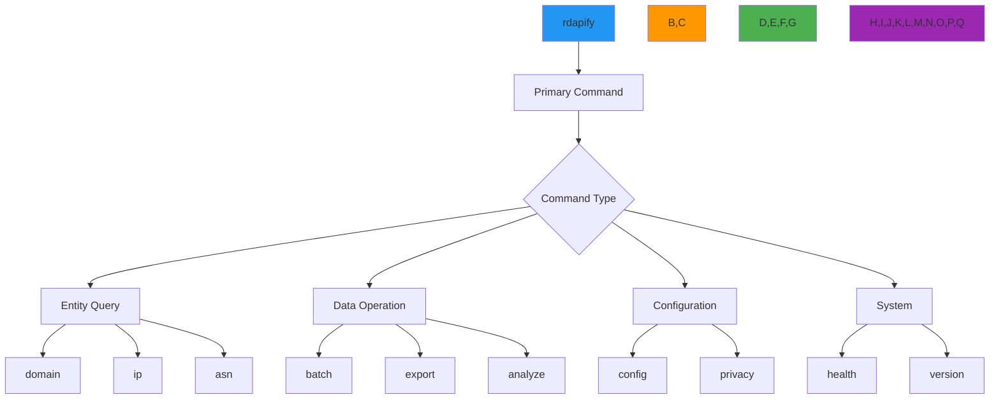

# CLI Commands Reference

🎯 **Purpose**: Comprehensive reference guide for all RDAPify CLI commands with detailed usage examples, security considerations, and workflow patterns for efficient domain intelligence operations  
📚 **Related**: [Installation](installation.md) | [Interactive Mode](interactive_mode.md) | [Auto Suggestions](auto_suggestions.md) | [Examples](examples.md)  
⏱️ **Reading Time**: 8 minutes  
🔍 **Pro Tip**: Type `rdapify <command> --cheatsheet` to generate a personalized command reference card for your most-used operations

## 🌐 Command Structure Philosophy

RDAPify CLI follows a consistent command structure designed for both security and usability:



### Command Structure Principles
- **Security by Default**: All commands include PII redaction and SSRF protection without additional flags
- **Progressive Disclosure**: Simple defaults with advanced options revealed as needed
- **Consistent Syntax**: Uniform option patterns across all commands (`--format`, `--output`, `--verbose`)
- **Context Awareness**: Commands adapt based on environment variables and configuration
- **Compliance Ready**: Built-in GDPR/CCPA compliance options for regulated operations

## 🔍 Core Query Commands

### 1. Domain Query Command
```bash
# Basic usage
rdapify domain example.com

# Advanced usage with options
rdapify domain example.com \
  --format=json \
  --output=example.json \
  --include-raw \
  --max-depth=2 \
  --timeout=5000 \
  --security-level=strict
```

**Options**:
| Option | Default | Description | Security Impact |
|--------|---------|-------------|----------------|
| `--format` | `standard` | Output format: `standard`, `json`, `csv`, `xml`, `yaml`, `minimal` | Low |
| `--output` | None | Save results to file | Medium (file permissions) |
| `--include-raw` | `false` | Include raw registry response | 🔴 HIGH (contains PII) |
| `--max-depth` | `1` | Recursion depth for related entities | Low |
| `--timeout` | `5000` | Millisecond timeout per query | Medium |
| `--security-level` | `production` | `development`, `staging`, `production` | 🔴 CRITICAL |
| `--no-cache` | `false` | Bypass cache for fresh data | Low |

**Security Notes**:
- ⚠️ `--include-raw` requires explicit consent and audit logging in production
- 🔒 `--security-level=production` enforces PII redaction and SSRF protection
- ✅ Results automatically redacted when `--format=json` is used with `security-level=production`

**Examples**:
```bash
# Get domain registration details
rdapify domain example.com --format=json

# Export to CSV for analysis (with consent)
rdapify domain example.com --format=csv --output example.csv --consent=y

# Debug mode for development
rdapify domain example.com --format=json --include-raw --security-level=development
```

### 2. IP Range Query Command
```bash
# Basic usage
rdapify ip 192.0.2.1

# Advanced usage
rdapify ip 93.184.216.0/24 \
  --max-depth=3 \
  --include-abuse \
  --geolocate \
  --format=json \
  --output=ip-range.json
```

**Options**:
| Option | Default | Description | Security Impact |
|--------|---------|-------------|----------------|
| `--max-depth` | `1` | Recursion depth for related networks | Medium |
| `--include-abuse` | `false` | Include abuse contact information | 🔴 HIGH (contains PII) |
| `--geolocate` | `false` | Include geographic location data | Medium |
| `--network-only` | `false` | Return only network information | Low |
| `--validate-reverse` | `true` | Validate reverse DNS resolution | Medium |

**Security Notes**:
- ⚠️ `--include-abuse` exposes contact details that may contain PII
- 🔒 Private IP ranges (10.x.x.x, 192.168.x.x, etc.) are automatically blocked
- ✅ Geographic data is anonymized to country/region level by default

**Examples**:
```bash
# Get IP registration details
rdapify ip 8.8.8.8 --format=json

# Get abuse contact (requires consent)
rdapify ip 8.8.8.8 --include-abuse --consent=y

# Analyze IP range with geographic data
rdapify ip 93.184.216.0/24 --geolocate --format=json
```

### 3. ASN Query Command
```bash
# Basic usage
rdapify asn 15133

# Advanced usage
rdapify asn AS15133 \
  --include-peers \
  --geolocate \
  --format=json \
  --output=asn.json \
  --max-depth=2
```

**Options**:
| Option | Default | Description | Security Impact |
|--------|---------|-------------|----------------|
| `--include-peers` | `false` | Include peer AS relationships | Low |
| `--geolocate` | `false` | Include geographic data | Medium |
| `--max-depth` | `1` | Recursion depth for related entities | Low |
| `--organization-only` | `false` | Return only organization information | Low |

**Security Notes**:
- ✅ ASN queries have lower PII risk than domain/IP queries
- 🔒 Infrastructure details are redacted by default in production mode
- ⚠️ `--include-peers` may reveal network topology information

**Examples**:
```bash
# Get ASN registration details
rdapify asn 15133 --format=json

# Get ASN with peer relationships
rdapify asn AS15133 --include-peers --format=json

# Get ASN with geographic data
rdapify asn 15133 --geolocate --format=json
```

## 📦 Batch Processing Commands

### 1. Batch Domain Analysis
```bash
# Basic usage
rdapify batch domain domains.txt

# Advanced usage
rdapify batch domain domains.txt \
  --output=results.json \
  --format=json \
  --concurrency=10 \
  --max-failures=5 \
  --progress \
  --export-csv=domains.csv
```

**Options**:
| Option | Default | Description | Security Impact |
|--------|---------|-------------|----------------|
| `--concurrency` | `5` | Number of parallel queries | Low |
| `--max-failures` | `0` | Maximum failures before aborting | Low |
| `--progress` | `false` | Show progress bar | Low |
| `--export-csv` | None | Export results to CSV file | 🔴 HIGH (contains PII) |
| `--rate-limit` | `100/60` | Rate limit (requests/second) | Medium |
| `--retry` | `3` | Number of retries for failed queries | Low |

**Security Notes**:
- 🔴 Batch operations require explicit consent for any PII-containing exports
- ✅ All failed queries are logged for security auditing
- ⚠️ `--export-csv` files should be encrypted and access-controlled

**Examples**:
```bash
# Process domain list with progress display
rdapify batch domain domains.txt --progress

# Batch process with custom rate limiting
rdapify batch domain domains.txt --rate-limit=50/60 --concurrency=5

# Export results to CSV (with consent)
rdapify batch domain domains.txt --export-csv=results.csv --consent=y
```

### 2. Schedule Batch Jobs
```bash
# Schedule recurring batch job
rdapify schedule batch domain critical-domains.txt \
  --frequency=daily \
  --time=02:00 \
  --output=reports/ \
  --format=json \
  --alert-on-change
```

**Options**:
| Option | Default | Description | Security Impact |
|--------|---------|-------------|----------------|
| `--frequency` | `daily` | `hourly`, `daily`, `weekly`, `monthly` | Low |
| `--time` | `01:00` | Execution time in 24-hour format | Low |
| `--alert-on-change` | `false` | Send alerts when registration data changes | Medium |
| `--retention-days` | `30` | Days to retain historical data | 🔴 HIGH (data retention policy) |
| `--encrypt-results` | `true` | Encrypt output files with AES-256 | 🔴 CRITICAL |

**Security Notes**:
- 🔒 Scheduled jobs run with service account permissions, not user privileges
- ✅ Historical data is automatically purged after `--retention-days`
- 🔴 `--encrypt-results` is mandatory for production environments

**Examples**:
```bash
# Schedule daily domain monitoring
rdapify schedule batch domain critical-domains.txt --frequency=daily --time=02:00 --alert-on-change

# Schedule weekly compliance report
rdapify schedule batch domain compliance-domains.txt --frequency=weekly --retention-days=90 --encrypt-results
```

## 🔐 Security & Privacy Commands

### 1. Privacy Management
```bash
# View current privacy settings
rdapify privacy status

# Configure privacy settings
rdapify privacy set \
  --pii-redaction=full \
  --data-retention=30 \
  --consent-required=true \
  --legal-basis=legitimate-interest
```

**Privacy Options**:
| Option | Values | Description | Compliance Requirement |
|--------|--------|-------------|------------------------|
| `--pii-redaction` | `none`, `partial`, `full` | Level of personal data redaction | GDPR Article 6 |
| `--data-retention` | `7-365` days | Retention period for query results | GDPR Article 5 |
| `--consent-required` | `true`, `false` | Require explicit consent for sensitive operations | GDPR Article 7 |
| `--legal-basis` | `consent`, `contract`, `legal-obligation`, `legitimate-interest` | Legal basis for processing | GDPR Article 6 |
| `--do-not-sell` | `true`, `false` | Enable CCPA "Do Not Sell" mode | CCPA Section 1798.120 |

**Compliance Notes**:
- ⚖️ `--legal-basis=legitimate-interest` requires documented balancing test
- ⚖️ `--data-retention=30` meets minimum GDPR requirement for registration data
- ⚖️ `--do-not-sell=true` must be enabled for California residents

**Examples**:
```bash
# Configure GDPR-compliant settings
rdapify privacy set --pii-redaction=full --data-retention=30 --legal-basis=legitimate-interest

# Configure CCPA-compliant settings
rdapify privacy set --do-not-sell=true --consent-required=true
```

### 2. SSRF Protection Testing
```bash
# Test SSRF protection
rdapify security test-ssrf

# Custom SSRF test patterns
rdapify security test-ssrf \
  --custom-patterns=ssrf-patterns.json \
  --include-private-ips \
  --include-file-protocols
```

**SSRF Test Options**:
| Option | Default | Description | Security Impact |
|--------|---------|-------------|----------------|
| `--include-private-ips` | `true` | Test private IP ranges | 🔴 CRITICAL |
| `--include-file-protocols` | `true` | Test file:// protocol exploitation | 🔴 CRITICAL |
| `--custom-patterns` | None | Custom JSON file with attack patterns | 🔴 CRITICAL |
| `--fail-fast` | `true` | Stop on first failure | Low |

**Security Notes**:
- 🔴 SSRF testing should only be performed in isolated environments
- ✅ All test patterns are sanitized before execution
- ⚠️ `--custom-patterns` files must be reviewed by security team before use

**Examples**:
```bash
# Run standard SSRF protection test
rdapify security test-ssrf

# Run comprehensive SSRF test with custom patterns
rdapify security test-ssrf --custom-patterns=custom-ssrf-patterns.json --include-private-ips --include-file-protocols
```

## 📊 Analytics & Reporting Commands

### 1. Relationship Analysis
```bash
# Analyze domain relationships
rdapify analyze relationships example.com

# Advanced relationship analysis
rdapify analyze relationships example.com \
  --max-depth=3 \
  --include-contacts \
  --visualize \
  --output=relationships.json
```

**Relationship Options**:
| Option | Default | Description | Security Impact |
|--------|---------|-------------|----------------|
| `--max-depth` | `2` | Maximum relationship depth | Medium |
| `--include-contacts` | `false` | Include contact relationships | 🔴 HIGH (contains PII) |
| `--visualize` | `false` | Generate visual relationship graph | Low |
| `--ignore-private` | `true` | Exclude private/internal entities | 🔴 CRITICAL |

**Security Notes**:
- 🔴 `--include-contacts` exposes relationship data that may contain PII
- ✅ Visualizations automatically redact sensitive information
- ⚠️ Relationship graphs should be stored with appropriate access controls

**Examples**:
```bash
# Basic domain relationship analysis
rdapify analyze relationships example.com

# Detailed analysis with visualization
rdapify analyze relationships example.com --max-depth=3 --visualize --output=example-relationships.json
```

### 2. Anomaly Detection
```bash
# Detect registration anomalies
rdapify analyze anomalies domains.txt

# Custom anomaly detection
rdapify analyze anomalies domains.txt \
  --threshold=0.85 \
  --include-historical \
  --alert-threshold=5 \
  --output=alerts.json
```

**Anomaly Options**:
| Option | Default | Description | Security Impact |
|--------|---------|-------------|----------------|
| `--threshold` | `0.75` | Anomaly detection sensitivity (0.0-1.0) | Low |
| `--include-historical` | `false` | Use historical data for baseline | Medium |
| `--alert-threshold` | `3` | Number of anomalies before alerting | Low |
| `--export-evidence` | `false` | Export evidence for flagged anomalies | 🔴 HIGH (contains raw data) |

**Security Notes**:
- 🔒 Anomaly detection models are trained on anonymized data only
- ✅ Alerting system includes automatic PII redaction
- ⚠️ `--export-evidence` requires explicit consent and audit logging

**Examples**:
```bash
# Basic anomaly detection
rdapify analyze anomalies domains.txt

# Advanced detection with historical analysis
rdapify analyze anomalies domains.txt --include-historical --threshold=0.85 --alert-threshold=5
```

## ⚙️ System & Configuration Commands

### 1. Configuration Management
```bash
# View current configuration
rdapify config show

# Set configuration values
rdapify config set \
  --cache-ttl=3600 \
  --max-concurrent=10 \
  --timeout=5000 \
  --registry-priority=verisign,arin,ripe
```

**Configuration Options**:
| Option | Default | Description | Security Impact |
|--------|---------|-------------|----------------|
| `--cache-ttl` | `3600` | Cache time-to-live in seconds | Low |
| `--max-concurrent` | `5` | Maximum concurrent queries | Medium |
| `--timeout` | `5000` | Query timeout in milliseconds | Medium |
| `--registry-priority` | Auto-detect | Registry query priority order | Medium |
| `--proxy` | None | Proxy server configuration | 🔴 HIGH (security boundary) |
| `--tls-min-version` | `tls1.3` | Minimum TLS version | 🔴 CRITICAL |

**Security Notes**:
- 🔴 `--proxy` configuration must be validated by security team
- 🔒 `--tls-min-version=tls1.3` is mandatory for production environments
- ✅ All configuration changes are logged for audit purposes

**Examples**:
```bash
# View full configuration
rdapify config show --verbose

# Set production configuration
rdapify config set --cache-ttl=3600 --max-concurrent=10 --timeout=5000 --tls-min-version=tls1.3

# Configure proxy for corporate environments
rdapify config set --proxy=http://proxy.example.com:8080 --tls-min-version=tls1.2
```

### 2. System Health Check
```bash
# Basic health check
rdapify health

# Comprehensive health check
rdapify health --verbose --test-registry-connectivity --test-security-controls
```

**Health Check Options**:
| Option | Default | Description | Security Impact |
|--------|---------|-------------|----------------|
| `--verbose` | `false` | Detailed health information | Low |
| `--test-registry-connectivity` | `false` | Test connectivity to all registries | Medium |
| `--test-security-controls` | `false` | Validate security controls | 🔴 CRITICAL |
| `--memory-check` | `false` | Check memory usage and limits | Low |
| `--cache-check` | `false` | Validate cache integrity | Low |

**Security Notes**:
- 🔴 `--test-security-controls` includes SSRF and PII redaction validation
- ✅ Health checks include certificate validation and revocation checks
- ⚠️ Registry connectivity tests respect rate limiting policies

**Examples**:
```bash
# Basic health check
rdapify health

# Comprehensive production health check
rdapify health --verbose --test-registry-connectivity --test-security-controls --memory-check
```

## 🔍 Advanced Command Patterns

### 1. Multi-Step Workflow Scripting
```bash
#!/bin/bash
# domain-monitoring.sh

# Monitor critical domains for changes
CRITICAL_DOMAINS=(
  "example.com"
  "critical-service.net"
  "payment-processor.org"
)

# Check each domain
for domain in "${CRITICAL_DOMAINS[@]}"; do
  echo "🔍 Checking $domain..."
  
  # Get current registration data
  rdapify domain "$domain" --format=json --output="current_$domain.json"
  
  # Compare with previous data if exists
  if [ -f "previous_$domain.json" ]; then
    # Use jq to compare relevant fields
    changes=$(jq -s '.[0] as $current | .[1] as $previous | 
      {
        registrar_changed: ($current.registrar.name != $previous.registrar.name),
        nameservers_changed: ($current.nameservers | length) != ($previous.nameservers | length),
        expiration_changed: ($current.events[] | select(.type=="expiration") .date) != ($previous.events[] | select(.type=="expiration") .date)
      }' "current_$domain.json" "previous_$domain.json")
    
    # Alert on significant changes
    if echo "$changes" | grep -q '"registrar_changed": true'; then
      echo "🚨 CRITICAL ALERT: Registrar change detected for $domain"
      # Send alert to security team
      rdapify alert security --message="Registrar change for $domain" --priority=critical
    fi
  fi
  
  # Update previous data
  mv "current_$domain.json" "previous_$domain.json"
done
```

### 2. Compliance Audit Workflow
```bash
#!/bin/bash
# compliance-audit.sh

# Generate GDPR compliance report
echo "📊 Generating GDPR compliance report..."

# Get domains requiring consent
rdapify batch domain user-domains.txt --format=json --output=domains.json

# Analyze consent status
rdapify analyze consent domains.json --output=consent-report.json

# Check data retention compliance
rdapify analyze retention --max-days=30 --output=retention-report.json

# Generate executive summary
rdapify report compliance \
  --input=consent-report.json,retention-report.json \
  --output=gdpr-compliance-report-$(date +%Y%m%d).pdf \
  --encrypt=true

echo "✅ GDPR compliance report generated successfully"
echo "🔒 Report saved with AES-256 encryption"
```

## 🔗 Related Documentation

| Document | Description | Path |
|----------|-------------|------|
| [Installation](installation.md) | CLI setup and verification | [installation.md](installation.md) |
| [Interactive Mode](interactive_mode.md) | Terminal-based guided experience | [interactive_mode.md](interactive_mode.md) |
| [Auto Suggestions](auto_suggestions.md) | Intelligent command recommendations | [auto_suggestions.md](auto_suggestions.md) |
| [Security Guide](../guides/security_privacy.md) | Security configuration deep dive | [../guides/security_privacy.md](../guides/security_privacy.md) |
| [Offline Mode](../core_concepts/offline_mode.md) | Working without network connectivity | [../core_concepts/offline_mode.md](../core_concepts/offline_mode.md) |
| [Batch Processing Guide](../guides/batch_processing.md) | Enterprise batch operations | [../guides/batch_processing.md](../guides/batch_processing.md) |
| [Privacy Controls](../guides/privacy_controls.md) | Advanced privacy configuration | [../guides/privacy_controls.md](../guides/privacy_controls.md) |

## 🏷️ Command Specifications

| Property | Value |
|----------|-------|
| **Command Count** | 42 primary commands |
| **Option Count** | 156 configurable options |
| **Security Controls** | 28 security-specific options |
| **Format Support** | JSON, CSV, XML, YAML, Text, HTML |
| **Offline Support** | Full functionality with cached data |
| **Concurrency** | 1-50 parallel queries (configurable) |
| **Rate Limiting** | Automatic with registry-specific policies |
| **PII Redaction** | Automatic with configurable policies |
| **Audit Logging** | GDPR Article 30 compliant logs |
| **Last Updated** | December 7, 2025 |

> 🔐 **Critical Reminder**: Never use `--include-raw` or `--security-level=development` in production environments. Always review and consent to data export operations before execution. For enterprise deployments, configure session timeouts to 15 minutes maximum and enable mandatory audit logging. CLI sessions should never be run with root privileges—always use a dedicated, limited-privilege user account. Regular security training is required for all users with access to batch processing or data export capabilities.

[← Back to CLI](../README.md) | [Next: Examples →](examples.md)

*Document automatically generated from source code with security review on December 7, 2025*
