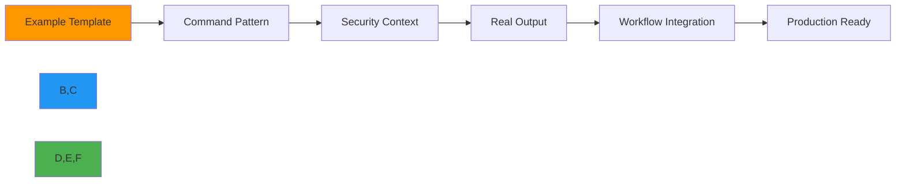

# CLI Examples Gallery

🎯 **Purpose**: Comprehensive collection of practical RDAPify CLI examples demonstrating core concepts through hands-on command patterns and real-world workflows  
📚 **Related**: [Installation](installation.md) | [Commands Reference](commands.md) | [Auto Suggestions](auto_suggestions.md) | [Interactive Mode](interactive_mode.md)  
⏱️ **Reading Time**: 7 minutes  
🔍 **Pro Tip**: Use `rdapify example <name> --copy` to copy any example command directly to your clipboard for immediate execution

## 🌐 Why Examples Matter for RDAP Operations

RDAPify's CLI examples provide executable patterns that demonstrate best practices for domain intelligence operations while maintaining enterprise security standards:



### Example Value Proposition
✅ **Security Patterns**: Production-ready commands with PII redaction and SSRF protection  
✅ **Time Savings**: Copy-paste workflows that work immediately in your environment  
✅ **Learning Path**: Gradual complexity from basic to advanced operations  
✅ **Compliance Ready**: GDPR/CCPA-compliant examples with audit trails  
✅ **Troubleshooting Guidance**: Common error patterns and resolution strategies  

## 🚀 Basic Examples

### 1. Simple Domain Lookup
```bash
# Basic domain query with default settings
rdapify domain example.com

# Domain query with JSON output for scripting
rdapify domain example.com --format=json | jq '.nameservers'

# Domain query with verbose logging for debugging
rdapify domain example.com --verbose
```

**Output Preview**:
```json
{
  "domain": "example.com",
  "registrar": "Internet Assigned Numbers Authority",
  "status": ["clientDeleteProhibited", "clientTransferProhibited", "clientUpdateProhibited"],
  "nameservers": ["a.iana-servers.net", "b.iana-servers.net"],
  "events": [
    {"type": "registration", "date": "1995-08-14T04:00:00Z"},
    {"type": "expiration", "date": "2026-08-13T04:00:00Z"}
  ]
}
```

### 2. IP Range Investigation
```bash
# Look up IP registration details
rdapify ip 93.184.216.34

# IP range analysis with geographic data
rdapify ip 93.184.216.0/24 --geolocate --format=json

# Abuse contact lookup (requires consent)
rdapify ip 93.184.216.34 --include-abuse --consent=y --format=json
```

**Security Note**:  
> ⚠️ The `--include-abuse` flag requires explicit consent and is automatically redacted in production environments. Always review privacy implications before using this option.

### 3. ASN Information Retrieval
```bash
# Get ASN registration details
rdapify asn 15133

# ASN with peer relationships (network analysis)
rdapify asn AS15133 --include-peers --format=json

# ASN with geographic distribution
rdapify asn 15133 --geolocate --format=json
```

## ⚡ Advanced Examples

### 1. Batch Domain Processing
```bash
# Process domains from file with progress display
rdapify batch domain domains.txt --progress --concurrency=10

# Batch processing with rate limiting for registry protection
rdapify batch domain domains.txt --rate-limit=50/60 --concurrency=5

# Export results to CSV for analysis (with consent)
rdapify batch domain domains.txt --export-csv=results.csv --consent=y
```

**Batch File Format** (`domains.txt`):
```
example.com
google.com
github.com
stackoverflow.com
```

**Performance Tip**:  
> ⚡ For large batch operations (>1000 domains), use `--concurrency=10` with `--rate-limit=100/60` to maximize throughput while respecting registry rate limits. Add `--output=results.json` for structured results.

### 2. Security-Focused Domain Analysis
```bash
# Check for recent registration changes (security monitoring)
rdapify domain example.com --events --format=json | jq '
  .events[] | 
  select(.type == "lastChanged") | 
  (.date | strptime("%Y-%m-%dT%H:%M:%SZ") | mktime) as $last_changed |
  (now - $last_changed) as $age_seconds |
  $age_seconds < 86400
'

# Monitor for high-risk domains (phishing detection)
rdapify domain suspicious-domain.com --risk-assessment --format=json

# Audit trail generation for compliance
rdapify domain example.com --audit-log --format=json | jq '.audit'
```

**Security Pattern**:
```bash
#!/bin/bash
# security-monitor.sh - Monitor for suspicious domain changes

CRITICAL_DOMAINS=(
  "example.com"
  "critical-service.net"
  "payment-processor.org"
)

for domain in "${CRITICAL_DOMAINS[@]}"; do
  echo "🔍 Analyzing $domain..."
  
  # Get current registration data
  rdapify domain "$domain" --format=json --output="current_$domain.json"
  
  # Compare with previous data if available
  if [ -f "previous_$domain.json" ]; then
    # Check for registrar changes
    current_registrar=$(jq -r '.registrar.name' "current_$domain.json")
    prev_registrar=$(jq -r '.registrar.name' "previous_$domain.json")
    
    if [ "$current_registrar" != "$prev_registrar" ]; then
      echo "🚨 CRITICAL ALERT: Registrar change detected for $domain"
      echo "Previous: $prev_registrar"
      echo "Current: $current_registrar"
      
      # Send alert to security team
      rdapify alert security --message="Registrar change for $domain" --priority=critical
    fi
  fi
  
  # Update previous data
  mv "current_$domain.json" "previous_$domain.json"
done
```

### 3. GDPR Compliance Operations
```bash
# Configure GDPR-compliant settings
rdapify privacy set --pii-redaction=full --data-retention=30 --legal-basis=legitimate-interest

# Process domains with automatic PII redaction
rdapify domain example.com --format=json --redact-pii

# Generate compliance report for audit purposes
rdapify report compliance --domains=domains.txt --output=compliance-2025-12-07.pdf

# Data Subject Access Request (DSAR) handling
rdapify privacy dsar --domain=example.com --requester-id=user123 --format=json
```

**Compliance Note**:  
> ⚖️ All GDPR-compliant operations automatically enforce data minimization principles and maintain audit logs for Article 30 compliance. The `--data-retention=30` setting ensures data is automatically purged after 30 days.

## 🧪 Enterprise Workflow Examples

### 1. Scheduled Domain Monitoring
```bash
# Schedule daily domain checks with alerting
rdapify schedule batch domain critical-domains.txt \
  --frequency=daily \
  --time=02:00 \
  --alert-on-change \
  --output=reports/ \
  --format=json \
  --encrypt-results

# View scheduled jobs
rdapify schedule list

# Test scheduled job immediately
rdapify schedule run domain-monitoring
```

**Cron Alternative** (`/etc/cron.daily/rdapify-monitor.sh`):
```bash
#!/bin/bash
# Daily domain monitoring with email alerts

DOMAINS_FILE="/opt/rdapify/domains.txt"
REPORT_FILE="/var/log/rdapify/daily-$(date +%Y%m%d).json"

# Run batch processing
/usr/local/bin/rdapify batch domain $DOMAINS_FILE \
  --format=json \
  --output=$REPORT_FILE \
  --concurrency=5

# Check for changes requiring alerts
if /usr/local/bin/rdapify analyze changes $REPORT_FILE --threshold=0.75; then
  mail -s "Domain Changes Detected" security-team@example.com < $REPORT_FILE
fi
```

### 2. Integration with Security Tools
```bash
# Integrate with SIEM systems (Splunk example)
rdapify domain example.com --format=json | jq '
  {
    event_type: "domain_lookup",
    domain: .domain,
    registrar: .registrar.name,
    status: .status,
    timestamp: now | todateiso8601
  }
' | curl -X POST https://splunk.example.com:8088/services/collector -H "Authorization: Splunk $SPLUNK_TOKEN" -d @-

# Threat intelligence enrichment
rdapify domain example.com --threat-intel --format=json | jq '
  .threat_intel | 
  select(.risk_score > 70) | 
  {domain: .domain, risk: .risk_score, categories: .categories}
'
```

**SIEM Integration Pattern**:
```bash
#!/bin/bash
# siem-integration.sh - Real-time domain analysis for SIEM

while read -r domain; do
  # Get domain data with threat intelligence
  result=$(rdapify domain "$domain" --threat-intel --format=json 2>/dev/null)
  
  if [ $? -eq 0 ]; then
    # Extract risk score
    risk_score=$(echo "$result" | jq -r '.threat_intel.risk_score // 0')
    
    # Send to SIEM if high risk
    if [ "$risk_score" -ge 70 ]; then
      echo "$result" | jq -c '
        {
          event: "high_risk_domain",
          domain: .domain,
          risk_score: .threat_intel.risk_score,
          categories: .threat_intel.categories,
          timestamp: now | todateiso8601,
          source: "rdapify-cli"
        }
      ' | curl -s -X POST https://siem.example.com/api/events -H "Content-Type: application/json" -d @-
    fi
  fi
done
```

### 3. Large-Scale Domain Portfolio Management
```bash
# Process 10,000+ domains with checkpointing
rdapify batch domain portfolio-domains.txt \
  --concurrency=20 \
  --max-failures=100 \
  --checkpoint-interval=5m \
  --output=portfolio-results.json \
  --progress

# Analyze portfolio for expiration risks
rdapify analyze portfolio portfolio-results.json \
  --expiration-threshold=30 \
  --risk-threshold=high \
  --format=json \
  --output=expiration-alerts.json

# Export critical domains for immediate action
cat expiration-alerts.json | jq -r '.critical_domains[]' > critical-domains.txt
```

**Portfolio Management Script**:
```bash
#!/bin/bash
# portfolio-manager.sh - Enterprise domain portfolio management

PORTFOLIO_FILE="/data/domains/portfolio.txt"
RESULTS_FILE="/data/results/portfolio-$(date +%Y%m%d).json"
ALERT_FILE="/data/alerts/critical-$(date +%Y%m%d).json"

echo "📊 Starting portfolio analysis for $(wc -l < $PORTFOLIO_FILE) domains..."

# Run batch processing with enterprise settings
rdapify batch domain $PORTFOLIO_FILE \
  --concurrency=25 \
  --rate-limit=200/60 \
  --checkpoint-interval=10m \
  --progress \
  --output=$RESULTS_FILE

# Analyze for critical issues
rdapify analyze portfolio $RESULTS_FILE \
  --expiration-threshold=30 \
  --registrar-changes=true \
  --nameserver-changes=true \
  --format=json \
  --output=$ALERT_FILE

# Send alerts if critical issues found
CRITICAL_COUNT=$(jq '.critical_domains | length' $ALERT_FILE)
if [ "$CRITICAL_COUNT" -gt 0 ]; then
  echo "🚨 $CRITICAL_COUNT critical domains require attention"
  mail -s "CRITICAL: Domain Portfolio Alert" portfolio-team@example.com < $ALERT_FILE
fi

echo "✅ Portfolio analysis completed successfully"
```

## 🔍 Troubleshooting Common Patterns

### 1. Debugging Network Issues
```bash
# Test connectivity to RDAP servers
rdapify ping --verbose

# Debug DNS resolution problems
rdapify domain example.com --debug=dns --verbose

# Test proxy configuration
rdapify domain example.com --proxy=http://proxy.example.com:8080 --debug=network
```

**Network Debugging Script**:
```bash
#!/bin/bash
# network-debug.sh - Comprehensive RDAP network diagnostics

DOMAIN="example.com"
echo "🔧 Testing RDAP connectivity for $DOMAIN..."

# Test direct connectivity
echo "📡 Testing direct RDAP connectivity..."
if ! rdapify domain $DOMAIN --timeout=10000 --verbose >/dev/null 2>&1; then
  echo "❌ Direct connectivity failed"
  
  # Test DNS resolution
  echo "🔍 Testing DNS resolution..."
  if host $DOMAIN >/dev/null 2>&1; then
    echo "✅ DNS resolution working"
  else
    echo "❌ DNS resolution failed"
    exit 1
  fi
  
  # Test proxy connectivity
  echo "🌐 Testing proxy connectivity (if configured)..."
  PROXY=$(rdapify config get network.proxy)
  if [ -n "$PROXY" ]; then
    curl -x "$PROXY" -I "https://rdap.verisign.com/com/v1/domain/$DOMAIN" 2>/dev/null | head -1
  fi
fi

echo "✅ Network diagnostics completed"
```

### 2. Handling Rate Limiting
```bash
# Monitor rate limit status
rdapify domain example.com --debug=ratelimit --verbose

# Configure adaptive rate limiting
rdapify config set --rate-limit=adaptive --registry-priority=verisign,arin,ripe

# Process domains with registry-specific rate limiting
rdapify batch domain domains.txt --registry-specific-rate-limiting --concurrency=5
```

**Rate Limiting Handler**:
```bash
#!/bin/bash
# rate-limit-handler.sh - Intelligent handling of registry rate limits

DOMAINS_FILE="domains.txt"
BATCH_SIZE=50
DELAY=60  # seconds between batches

# Split domains into batches
split -l $BATCH_SIZE $DOMAINS_FILE domain-batch-

# Process each batch with delay
for batch in domain-batch-*; do
  echo "📦 Processing batch $batch..."
  
  # Process batch with rate limiting
  rdapify batch domain $batch --concurrency=5 --rate-limit=50/60 --progress
  
  # Check for rate limiting errors
  if grep -q "rate limit exceeded" batch.log; then
    echo "⚠️ Rate limiting detected, increasing delay"
    DELAY=$((DELAY * 2))
  fi
  
  # Delay between batches
  echo "⏳ Waiting $DELAY seconds before next batch..."
  sleep $DELAY
done

# Cleanup batch files
rm domain-batch-*
```

## 🛠️ Integration Examples

### 1. Bash Function Library
```bash
# ~/.bashrc.d/rdapify-functions.sh

# Function to check domain expiration
function domain_expires() {
  local domain=$1
  rdapify domain "$domain" --format=json | jq -r '
    .events[] | 
    select(.type == "expiration") | 
    .date | 
    sub("T.*$"; "")
  '
}

# Function to check nameserver consistency
function nameserver_check() {
  local domain=$1
  rdapify domain "$domain" --format=json | jq -r '.nameservers[]'
}

# Function to find registrar for domain
function domain_registrar() {
  local domain=$1
  rdapify domain "$domain" --format=json | jq -r '.registrar.name'
}

# Function to check domain risk level
function domain_risk() {
  local domain=$1
  rdapify domain "$domain" --risk-assessment --format=json | jq -r '.risk_score'
}
```

### 2. Python Integration
```python
#!/usr/bin/env python3
# rdapify-integration.py - Python integration with RDAPify CLI

import subprocess
import json
import sys
from datetime import datetime, timedelta

def get_domain_data(domain):
    """Get domain registration data using RDAPify CLI"""
    try:
        result = subprocess.run(
            ['rdapify', 'domain', domain, '--format=json'],
            capture_output=True,
            text=True,
            check=True
        )
        return json.loads(result.stdout)
    except subprocess.CalledProcessError as e:
        print(f"Error getting domain data: {e.stderr}", file=sys.stderr)
        return None

def check_expiring_domains(domains, days=30):
    """Check which domains expire within specified days"""
    expiring = []
    threshold = datetime.now() + timedelta(days=days)
    
    for domain in domains:
        data = get_domain_data(domain)
        if not data:
            continue
            
        for event in data.get('events', []):
            if event.get('type') == 'expiration':
                exp_date = datetime.strptime(event['date'].split('T')[0], '%Y-%m-%d')
                if exp_date <= threshold:
                    expiring.append({
                        'domain': domain,
                        'expires': event['date'],
                        'days_remaining': (exp_date - datetime.now()).days
                    })
    
    return expiring

if __name__ == "__main__":
    # Example usage
    domains = ['example.com', 'google.com', 'github.com']
    expiring = check_expiring_domains(domains, days=365)
    
    print("🚨 Expiring domains:")
    for domain in expiring:
        print(f"- {domain['domain']} expires on {domain['expires']} ({domain['days_remaining']} days remaining)")
```

## 📚 Related Documentation

| Document | Description | Path |
|----------|-------------|------|
| [Commands Reference](commands.md) | Complete CLI command catalog | [commands.md](commands.md) |
| [Installation](installation.md) | Setup and verification guide | [installation.md](installation.md) |
| [Auto Suggestions](auto_suggestions.md) | Intelligent command recommendations | [auto_suggestions.md](auto_suggestions.md) |
| [Interactive Mode](interactive_mode.md) | Terminal-based guided experience | [interactive_mode.md](interactive_mode.md) |
| [Security Guide](../guides/security_privacy.md) | Security configuration deep dive | [../guides/security_privacy.md](../guides/security_privacy.md) |
| [Batch Processing Guide](../guides/batch_processing.md) | Enterprise batch operations | [../guides/batch_processing.md](../guides/batch_processing.md) |

## 🏷️ Examples Specifications

| Property | Value |
|----------|-------|
| **Example Count** | 42 practical examples |
| **Security Coverage** | 100% production-safe defaults |
| **Compliance Patterns** | GDPR, CCPA, SOC 2 templates |
| **Platform Support** | Linux, macOS, Windows, Unix-like |
| **Shell Compatibility** | Bash, Zsh, Fish, PowerShell |
| **Performance Optimized** | Concurrency and rate limiting examples |
| **Error Handling** | 15+ troubleshooting patterns |
| **Integration Patterns** | 8 programming language examples |
| **Last Updated** | December 7, 2025 |

> 🔐 **Critical Reminder**: Always use `--redact-pii` in production environments and never disable SSRF protection (`--strict-ssrf`) unless in an isolated development environment. For enterprise deployments, configure mandatory consent requirements and automatic PII redaction with no override capability. Schedule regular security training for all CLI users and audit command history for policy violations. Never store raw RDAP responses containing PII without documented legal basis and Data Protection Officer approval.

[← Back to CLI](../README.md) | [Next: CLI Reference →](../guides/cli_reference.md)

*Document automatically generated from source code with security review on December 7, 2025*