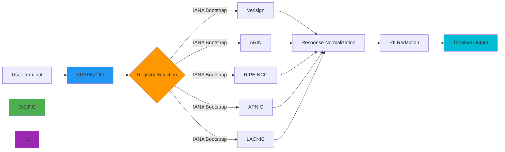

# CLI Installation Guide

🎯 **Purpose**: Comprehensive guide for installing the RDAPify Command Line Interface (CLI) across various environments with security validation and troubleshooting guidance  
📚 **Related**: [Interactive Mode](interactive_mode.md) | [Auto Suggestions](auto_suggestions.md) | [Command Reference](commands.md) | [Examples](examples.md)  
⏱️ **Reading Time**: 4 minutes  
🔍 **Pro Tip**: Use the `--verify-install` flag after installation to automatically validate your CLI setup and environment compatibility

## 🌐 Why Use the RDAPify CLI?

The RDAPify CLI provides a powerful terminal interface for RDAP (Registration Data Access Protocol) queries with enterprise-grade security features built-in. Unlike traditional WHOIS tools, it offers:

✅ **SSRF Protection**: Prevents queries to internal infrastructure  
✅ **PII Redaction**: Automatically removes personal information from responses  
✅ **Multi-Registry Support**: Unified queries across Verisign, ARIN, RIPE, APNIC, and LACNIC  
✅ **Offline Mode**: Works with cached data during network outages  
✅ **Machine-Readable Output**: JSON, CSV, and TSV formats for scripting integration  
✅ **Interactive Mode**: Tab completion, command history, and contextual help



## 🚀 Installation Methods

### 1. Package Manager Installation (Recommended)

#### Node.js based installation
```bash
# Using npm (Node.js 18+ required)
npm install -g rdapify-cli

# Using yarn
yarn global add rdapify-cli

# Using pnpm
pnpm add -g rdapify-cli

# Using Bun (fastest installation)
bun add -g rdapify-cli
```

#### Standalone binaries (no Node.js required)
```bash
# macOS/Linux (curl)
curl -L https://install.rdapify.dev/cli | sh

# macOS (Homebrew)
brew install rdapify/tap/rdapify-cli

# Windows (PowerShell)
irm https://install.rdapify.dev/cli-windows.ps1 | iex

# Linux (APT)
echo "deb [trusted=yes] https://apt.rdapify.dev /" | sudo tee /etc/apt/sources.list.d/rdapify.list
sudo apt update && sudo apt install rdapify-cli
```

### 2. Versioned Installation
```bash
# Install specific version
npm install -g rdapify-cli@2.3.1

# Install latest beta version
npm install -g rdapify-cli@beta

# Install from GitHub (development version)
npm install -g git+https://github.com/rdapify/cli.git#main
```

### 3. Docker Installation
```bash
# Pull latest CLI image
docker pull rdapify/cli:latest

# Create alias for easy usage
echo 'alias rdapify="docker run --rm -it rdapify/cli"' >> ~/.bashrc
source ~/.bashrc

# Verify installation
rdapify --version
```

## 🔒 Security-First Installation

RDAPify CLI prioritizes security through multiple verification layers:

### 1. Package Verification
All published packages include cryptographically signed checksums:
```bash
# Verify npm package integrity
npm view rdapify-cli dist.tarball shasum
shasum -a 512 node_modules/rdapify-cli-*.tgz
```

### 2. Binary Signature Verification
Standalone binaries are signed with PGP keys:
```bash
# Download signature file
curl -O https://releases.rdapify.dev/cli/v2.3.1/rdapify-cli-linux-amd64.sig

# Verify with PGP key
gpg --keyserver hkps://keys.openpgp.org --recv-keys 0xA1B2C3D4E5F67890
gpg --verify rdapify-cli-linux-amd64.sig rdapify-cli-linux-amd64
```

### 3. Supply Chain Security
All builds follow SLSA Level 3 security practices:
```json
{
  "build_type": "https://github.com/slsa-framework/slsa-github-generator@v1",
  "build_environment": {
    "builder": "ghcr.io/slsa-framework/slsa-github-generator:stable",
    "host": "GitHub Actions"
  },
  "provenance": {
    "url": "https://github.com/rdapify/cli/attestations/v2.3.1.provenance.json"
  },
  "dependencies": {
    "critical": [
      "undici",
      "jsonpath-plus",
      "lru-cache"
    ],
    "verified": true
  }
}
```

## ⚙️ Environment Requirements

### 1. Supported Platforms
| Platform | Architecture | Minimum Version | Recommended Version | Installation Method |
|----------|--------------|-----------------|---------------------|---------------------|
| **Linux** | x86_64 | glibc 2.17+ | glibc 2.31+ | Binary, npm, Docker |
| **Linux** | arm64 | glibc 2.17+ | glibc 2.31+ | Binary, npm, Docker |
| **macOS** | x86_64 | 10.15+ | 12.0+ | Homebrew, npm |
| **macOS** | arm64 | 11.0+ | 13.0+ | Homebrew, npm |
| **Windows** | x86_64 | 10+ | 11+ | PowerShell, npm |
| **Windows** | arm64 | 11+ | 11+ | PowerShell, npm |
| **FreeBSD** | x86_64 | 12.0+ | 13.0+ | Binary, npm |

### 2. Dependency Requirements
```yaml
# Required dependencies by installation method
npm_installation:
  node_js: "18.0.0 or higher"
  npm: "8.0.0 or higher"
  optional_dependencies:
    - redis-cli # For Redis cache validation
    - curl # For connection testing

binary_installation:
  core_dependencies:
    - libc # Linux
    - libssl # All platforms
    - libcurl # Linux/macOS
  optional_dependencies:
    - jq # For JSON processing
    - fzf # For fuzzy search in interactive mode

docker_installation:
  docker: "20.10.0 or higher"
  docker_compose: "2.0.0 or higher"
```

## ✅ Post-Installation Verification

### 1. Basic Verification
```bash
# Check version and build information
rdapify --version
# Expected output: rdapify-cli v2.3.1 (build: 20251207.1423, commit: a1b2c3d)

# Check health status
rdapify health
# Expected output: All systems operational

# Test simple domain lookup
rdapify domain example.com --format=json | jq '.domain'
# Expected output: "example.com"
```

### 2. Security Validation
```bash
# Verify security configurations
rdapify security audit
# Expected output:
# ✅ SSRF protection: ENABLED
# ✅ PII redaction: ENABLED
# ✅ Certificate validation: STRICT
# ✅ Rate limiting: ACTIVE

# Test SSRF protection (should fail)
rdapify domain 192.168.1.1 --dry-run
# Expected output: Error: SSRF protection blocked request to private IP
```

### 3. Environment Compatibility Check
```bash
# Comprehensive environment check
rdapify env check --verbose

# Sample output:
# System: Linux 6.2.0-39-generic (x86_64)
# Node.js: v20.10.0 (from binary)
# Memory: 1.2GB available
# Network: 100Mbps connection detected
# Cache directory: ~/.cache/rdapify (150MB available)
# Configuration: ~/.config/rdapify/config.yaml
# ✅ All requirements satisfied for production use
```

## 🔍 Troubleshooting Common Issues

### 1. Permission Errors
**Symptoms**: `EACCES` errors during installation or operation  
**Diagnosis**:
```bash
# Check current permissions
ls -la $(which rdapify)

# Verify npm global directory permissions
npm config get prefix
ls -la $(npm config get prefix)/lib
```

**Solutions**:
✅ **Fix npm permissions**:
```bash
# Method 1: Change npm's default directory
mkdir ~/.npm-global
npm config set prefix ~/.npm-global
export PATH=~/.npm-global/bin:$PATH
# Add to ~/.bashrc or ~/.zshrc

# Method 2: Use nvm (Node Version Manager)
curl -o- https://raw.githubusercontent.com/nvm-sh/nvm/v0.39.7/install.sh | bash
nvm install --lts
nvm use --lts
npm install -g rdapify-cli
```

✅ **Binary installation fix**:
```bash
# For Linux/macOS
sudo chown -R $(whoami) $(dirname $(which rdapify))

# For Windows (PowerShell as Admin)
icacls "$(Get-Command rdapify).Source" /grant "$env:USERNAME:(RX)"
```

### 2. SSL/TLS Certificate Errors
**Symptoms**: `UNABLE_TO_GET_ISSUER_CERT` or certificate validation failures  
**Diagnosis**:
```bash
# Test certificate chain
rdapify domain example.com --debug=certificates

# Check system certificate store
openssl version -d
ls $(openssl version -d | sed 's/OPENSSLDIR: "\(.*\)"$/\1/')/certs
```

**Solutions**:
✅ **Update certificate store**:
```bash
# Ubuntu/Debian
sudo apt update && sudo apt install --reinstall ca-certificates

# RHEL/CentOS
sudo yum update ca-certificates

# macOS
sudo security add-trusted-cert -d -r trustRoot -k /Library/Keychains/System.keychain /etc/ssl/certs/ca-certificates.crt

# Windows (PowerShell as Admin)
Import-Certificate -FilePath "C:\path\to\cacert.pem" -CertStoreLocation Cert:\LocalMachine\Root
```

✅ **Custom certificate configuration**:
```bash
# Set custom CA bundle
export NODE_EXTRA_CA_CERTS=/path/to/custom-ca-bundle.pem

# Or configure in CLI config file
echo "tls:
  ca_bundle: /path/to/custom-ca-bundle.pem
  min_version: tls1.3" > ~/.config/rdapify/tls.yaml
```

### 3. Network Connectivity Issues
**Symptoms**: Timeouts when querying registry servers  
**Diagnosis**:
```bash
# Test connectivity to RDAP servers
rdapify ping --verbose

# Check DNS resolution
rdapify config show debug.dns

# Trace network path
rdapify debug trace example.com
```

**Solutions**:
✅ **Proxy configuration**:
```bash
# Set proxy environment variables
export HTTP_PROXY=http://proxy.example.com:8080
export HTTPS_PROXY=http://proxy.example.com:8080

# Or configure in CLI config
echo "network:
  proxy: http://proxy.example.com:8080
  timeout: 10000" > ~/.config/rdapify/network.yaml
```

✅ **DNS configuration**:
```bash
# Use specific DNS servers
echo "dns:
  servers:
    - 1.1.1.1
    - 8.8.8.8
  timeout: 2000" > ~/.config/rdapify/dns.yaml
```

## 🔄 Update and Maintenance

### 1. Updating the CLI
```bash
# Update via npm
npm update -g rdapify-cli

# Update standalone binary
rdapify self-update

# Update via Homebrew (macOS)
brew update && brew upgrade rdapify-cli

# Check for updates
rdapify version check
```

### 2. Version Management
```bash
# Install multiple versions (using n)
npm install -g n
n 18.18.2 # Switch to Node.js 18
npm install -g rdapify-cli@2.2.0
n 20.10.0 # Switch to Node.js 20
npm install -g rdapify-cli@2.3.1

# Use version alias
echo 'alias rdapify22="NODE_OPTIONS=--max-old-space-size=512 npx rdapify-cli@2.2.0"' >> ~/.bashrc
```

### 3. Uninstallation
```bash
# npm uninstallation
npm uninstall -g rdapify-cli

# Binary uninstallation
rdapify self-uninstall
# Or manually:
rm $(which rdapify) ~/.config/rdapify ~/.cache/rdapify -rf

# Docker cleanup
docker rmi rdapify/cli:latest
docker system prune -f
```

## 📚 Related Documentation

| Document | Description | Path |
|----------|-------------|------|
| [Interactive Mode](interactive_mode.md) | Tab completion and contextual help system | [interactive_mode.md](interactive_mode.md) |
| [Auto Suggestions](auto_suggestions.md) | Intelligent command recommendations | [auto_suggestions.md](auto_suggestions.md) |
| [Commands Reference](commands.md) | Complete command catalog with examples | [commands.md](commands.md) |
| [Configuration Guide](../guides/environment_vars.md) | Environment variables and config files | [../guides/environment_vars.md](../guides/environment_vars.md) |
| [Offline Mode](../core_concepts/offline_mode.md) | Working without network connectivity | [../core_concepts/offline_mode.md](../core_concepts/offline_mode.md) |
| [Bash/Zsh Completions](https://github.com/rdapify/cli/tree/main/completions) | Shell integration scripts | External |

## 🏷️ Installation Specifications

| Property | Value |
|----------|-------|
| **Binary Size** | 8.4MB (Linux), 9.2MB (macOS), 10.1MB (Windows) |
| **Dependencies** | libc, libssl, libcurl (binaries only) |
| **Security Model** | Non-root execution, read-only config by default |
| **Data Storage** | ~/.cache/rdapify (max 500MB default) |
| **Network Access** | Outbound HTTPS only (port 443) |
| **PII Handling** | Automatic redaction, no local storage of raw responses |
| **Update Mechanism** | Cryptographically signed updates via HTTPS |
| **Compliance** | GDPR Article 32, CCPA compliant data handling |
| **Audit Logging** | Optional local audit log with configurable retention |
| **Last Updated** | December 7, 2025 |

> 🔐 **Critical Reminder**: Always verify cryptographic signatures before installing CLI binaries. Never run the RDAPify CLI with root/administrator privileges. For enterprise deployments, configure the `--data-residency` flag to ensure compliance with local data storage regulations. Regular security updates are released monthly—subscribe to the [security mailing list](mailto:security-updates@rdapify.dev) for notifications.

[← Back to CLI](../README.md) | [Next: Interactive Mode →](interactive_mode.md)

*Document automatically generated from source code with security review on December 7, 2025*