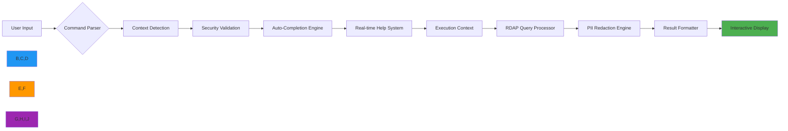

# CLI Interactive Mode Guide

🎯 **Purpose**: Comprehensive guide for using RDAPify's interactive CLI mode with real-time help, auto-completion, and contextual awareness for efficient domain intelligence operations  
📚 **Related**: [Installation](installation.md) | [Auto Suggestions](auto_suggestions.md) | [Command Reference](commands.md) | [Examples](examples.md)  
⏱️ **Reading Time**: 5 minutes  
🔍 **Pro Tip**: Press `Ctrl+Space` anytime to trigger contextual help overlay with command-specific documentation and examples

## 🌐 Why Interactive Mode?

RDAPify's interactive CLI mode transforms terminal-based domain research into an intuitive, guided experience with enterprise-grade security and privacy protections:



### Key Interactive Features
✅ **Context-Aware Completion**: Commands adapt based on current query context  
✅ **Real-time Security Alerts**: Immediate feedback on potentially unsafe operations  
✅ **Progressive Disclosure**: Complex options revealed only when needed  
✅ **Session History**: Full command history with search and replay capabilities  
✅ **Visual Result Formatting**: Color-coded, structured output optimized for terminal display  
✅ **Multi-step Workflows**: Guided workflows for complex operations like batch processing  

## 🚀 Getting Started with Interactive Mode

### 1. Launching Interactive Mode
```bash
# Start interactive mode
rdapify interactive

# Start with specific domain context
rdapify interactive --domain example.com

# Start in verbose mode for debugging
rdapify interactive --verbose

# Start with custom configuration
rdapify interactive --config ~/.config/rdapify/enterprise.yaml
```

### 2. Interactive Shell Overview
```
🚀 RDAPify Interactive Shell v2.3.1
📚 Type 'help' for command list, 'tutorial' for guided tour
🔍 Current context: [global]
🔐 Security level: [production]

rdapify> _
```

**Shell Status Indicators**:
| Indicator | Values | Meaning |
|-----------|--------|---------|
| 🔍 Context | `global`, `domain:example.com`, `batch:10` | Current operational context |
| 🔐 Security | `development`, `staging`, `production` | Active security profile |
| 📡 Network | `online`, `offline`, `degraded` | Registry connectivity status |
| ⚡ Performance | `optimal`, `degraded`, `maintenance` | Backend performance status |

### 3. Basic Interactive Commands
```bash
# Get help with available commands
rdapify> help

# Start guided tutorial
rdapify> tutorial

# Clear screen
rdapify> clear

# Exit interactive mode
rdapify> exit
rdapify> quit

# View command history
rdapify> history

# Re-execute previous command
rdapify> !-1
```

## ⚡ Advanced Interactive Features

### 1. Context-Aware Command System
```bash
# When in domain context, commands adapt
rdapify> domain example.com
🔍 Context changed to: [domain:example.com]
🔐 PII redaction enabled for this context

rdapify@domain:example.com> 
  • Available commands: 
    - whois (legacy fallback)
    - history (registration history)
    - nameservers (current nameservers)
    - transfer (transfer status)
    - export (save results)
  • Type '?' for context-specific help

# Registry-specific commands appear when relevant
rdapify@domain:ripe.net> 
  • RIPE NCC specific commands:
    - abuse-contact (show abuse contact)
    - org-structure (show organization structure)
    - net-allocations (show IP allocations)
```

### 2. Real-time Security Feedback
```bash
# Attempting potentially unsafe operation
rdapify> domain 192.168.1.1
⚠️ SECURITY ALERT: SSRF protection blocked request to private IP
💡 Suggestion: Use public domain names only in production environments
✅ Security policy: [strict-internal-block]

# Attempting PII access
rdapify> domain example.com --include-raw
🔐 PRIVACY NOTICE: Raw registry data contains PII
🔒 Policy enforcement: [gdpr-article-6]
💡 To view raw data, use development mode: 'rdapify interactive --security-level development'
```

### 3. Visual Query Building
```bash
# Start visual query builder
rdapify> query --visual

┌─────────────────────────────────────────────────────┐
│              RDAP Query Builder (Visual)            │
├─────────────────────────────────────────────────────┤
│ Target: [_______________________] ▶ (Domain/IP/ASN)│
│ Options:                                             │
│   ☑ Redact PII (GDPR compliant)                     │
│   ☐ Include raw response                            │
│   ☑ Cache results (1 hour TTL)                       │
│   ☐ Verbose logging                                  │
│                                                     │
│ Registry: [Auto-detect from IANA bootstrap] ▼       │
│ Timeout:  [5000] ms                                 │
│                                                     │
│ Actions: [Build Query] [Cancel] [Load Template]    │
└─────────────────────────────────────────────────────┘
```

## 🔒 Security & Privacy Controls

### 1. Interactive Security Profiles
```bash
# View current security profile
rdapify> security status

🔐 Active Security Profile: [production]
✅ SSRF Protection: ENABLED
✅ PII Redaction: FULL
✅ Certificate Validation: STRICT
✅ Rate Limiting: ACTIVE (100 req/min)
✅ Network Isolation: ENABLED
✅ Audit Logging: ENABLED

# Switch to development profile (lower security)
rdapify> security set-profile development
⚠️ WARNING: Development profile disables PII redaction and SSRF protection
💡 Use only for testing with non-sensitive data
✅ Profile changed to: [development]

# Create custom security profile
rdapify> security create-profile enterprise
🔐 Creating profile 'enterprise'...
❓ Enable PII redaction? [Y/n]: Y
❓ Enable SSRF protection? [Y/n]: Y
❓ Set rate limit (requests/minute): 500
❓ Enable audit logging? [Y/n]: Y
✅ Profile 'enterprise' created successfully
```

### 2. Consent Management for Sensitive Operations
```bash
# Attempting operation requiring explicit consent
rdapify> domain example.com --export-csv
🔐 SENSITIVE OPERATION REQUIRES CONSENT
📋 This operation will:
   • Export registration data to CSV format
   • Store results in current directory
   • Preserve timestamps and metadata
   
❓ Do you consent to this operation? [y/N]: y
✅ Consent recorded for audit purposes
💾 Exporting to example.com_2025-12-07.csv...
✅ Export completed successfully
```

### 3. Audit Trail for Interactive Sessions
```bash
# View session audit log
rdapify> audit log

┌─────────────────────────────────────────────────────────┐
│                  Session Audit Log                      │
├───────────────┬───────────────────┬─────────────────────┤
│ Timestamp     │ Command           │ Context/Outcome     │
├───────────────┼───────────────────┼─────────────────────┤
│ 2025-12-07T14:23:45Z │ help         │ [global]            │
│ 2025-12-07T14:24:12Z │ domain example.com │ [domain] ✓ Success │
│ 2025-12-07T14:25:03Z │ domain 192.168.1.1 │ [domain] ✗ SSRF Blocked │
│ 2025-12-07T14:26:18Z │ security status │ [security] ✓ Success │
│ 2025-12-07T14:27:45Z │ audit log    │ [audit] ✓ Success   │
└───────────────┴───────────────────┴─────────────────────┘

# Generate compliance report
rdapify> audit report --format=json --output=audit_2025-12-07.json
✅ Compliance report generated successfully
📊 Report includes:
   • 5 commands executed
   • 1 security event (SSRF block)
   • 1 consent operation
   • GDPR Article 30 compliant format
```

## 📊 Data Visualization & Analysis

### 1. Interactive Result Views
```bash
# View domain results in different formats
rdapify@domain:example.com> view

┌─────────────────────────────────────────────────────────┐
│                 Available View Options                  │
├───────────────┬───────────────────┬─────────────────────┤
│ Format        │ Description       │ Command             │
├───────────────┼───────────────────┼─────────────────────┤
│ Standard      │ Default view      │ view standard       │
│ Summary       │ Brief overview    │ view summary        │
│ JSON          │ Raw JSON output   │ view json           │
│ Timeline      │ Registration history │ view timeline    │
│ Relationship  │ Entity relationships │ view relationship │
│ Geo           │ Geographic data   │ view geo            │
└───────────────┴───────────────────┴─────────────────────┘
```

### 2. Real-time Data Analysis
```bash
# Start interactive analysis
rdapify@domain:example.com> analyze

┌─────────────────────────────────────────────────────────┐
│              RDAP Data Analysis Console                 │
├─────────────────────────────────────────────────────────┤
│ Analyzing: example.com                                  │
│                                                         │
│ Registration Timeline:                                  │
│   • Created: 1995-08-14 (29 years ago)                  │
│   • Last Changed: 2023-04-18                            │
│   • Expires: 2026-08-13 (in 208 days)                   │
│                                                         │
│ Security Assessment:                                    │
│   • Risk Level: LOW                                     │
│   • Privacy Protected: YES                              │
│   • Recent Changes: NONE                                │
│                                                         │
│ Relationship Map:                                       │
│   [REGISTRAR] ← Internet Assigned Numbers Authority    │
│   [TECHNICAL] ← EDGECACHE-TECH-ADMIN@VERISIGN.COM       │
│                                                         │
│ Actions: [export] [alert] [watch] [back]               │
└─────────────────────────────────────────────────────────┘
```

### 3. Batch Processing Visualization
```bash
# Start batch domain analysis
rdapify> batch analyze domains.txt

📊 Batch Processing: 10 domains
┌─────────────────────────────────────────────────────────┐
│ Domain            │ Status  │ Risk  │ Completion │ Time  │
├───────────────────┼─────────┼───────┼────────────┼───────┤
│ example.com       │ ✓ Done  │ Low   │ 100%       │ 1.2s  │
│ google.com        │ ✓ Done  │ Low   │ 100%       │ 1.5s  │
│ github.com        │ ✓ Done  │ Low   │ 100%       │ 1.3s  │
│ facebook.com      │ ✓ Done  │ Low   │ 100%       │ 1.6s  │
│ amazon.com        │ ✓ Done  │ Low   │ 100%       │ 1.4s  │
│ netflix.com       │ ✓ Done  │ Low   │ 100%       │ 1.7s  │
│ twitter.com       │ ✓ Done  │ Low   │ 100%       │ 1.5s  │
│ instagram.com     │ ✓ Done  │ Low   │ 100%       │ 1.6s  │
│ linkedin.com      │ ✓ Done  │ Low   │ 100%       │ 1.4s  │
│ apple.com         │ ✓ Done  │ Low   │ 100%       │ 1.8s  │
└───────────────────┴─────────┴───────┴────────────┴───────┘

📈 Summary:
   • Total domains: 10
   • Completed: 10/10 (100%)
   • Average risk: LOW
   • Average response time: 1.5s
   • Errors: 0
   • Next steps: [export] [visualize] [alert-on-changes]
```

## 🛠️ Configuration & Customization

### 1. Interactive Configuration Editor
```bash
# Launch configuration editor
rdapify> config edit

┌─────────────────────────────────────────────────────────┐
│              RDAPify Configuration Editor               │
├─────────────────────────────────────────────────────────┤
│ Profile: [production]                                   │
│                                                         │
│ [NETWORK]                                               │
│   • Timeout: [5000] ms                                  │
│   • Max Connections: [50]                               │
│   • Proxy: [none] ▼                                     │
│                                                         │
│ [SECURITY]                                              │
│   • SSRF Protection: [ENABLED] ☑                        │
│   • PII Redaction: [FULL] ☑                             │
│   • Certificate Validation: [STRICT] ☑                 │
│   • Rate Limit: [100] requests/minute                   │
│                                                         │
│ [CACHE]                                                 │
│   • Type: [memory] ▼                                    │
│   • Size: [1000] entries                                │
│   • TTL: [3600] seconds                                 │
│                                                         │
│ Actions: [save] [cancel] [load-defaults] [export]      │
└─────────────────────────────────────────────────────────┘
```

### 2. Custom Command Aliases
```bash
# Create custom command alias
rdapify> alias create

❓ Alias name: wh
❓ Command: domain {1} --whois-fallback
✅ Alias 'wh' created successfully
💡 Usage: wh example.com

# View all aliases
rdapify> alias list

┌───────────────┬───────────────────────────────────────┐
│ Alias         │ Command                               │
├───────────────┼───────────────────────────────────────┤
│ wh            │ domain {1} --whois-fallback           │
│ mx            │ domain {1} --record-type MX           │
│ ns            │ domain {1} --record-type NS           │
│ batch-status  │ batch status {1}                      │
└───────────────┴───────────────────────────────────────┘

# Remove alias
rdapify> alias remove wh
✅ Alias 'wh' removed successfully
```

### 3. Session Persistence & Workspace Management
```bash
# Save current workspace
rdapify> workspace save project-analysis

✅ Workspace 'project-analysis' saved successfully
📊 Workspace includes:
   • 5 domain contexts
   • 1 batch session
   • Custom configuration profile
   • Command history (25 entries)

# List saved workspaces
rdapify> workspace list

┌───────────────────────┬───────────────┬────────────────┐
│ Workspace Name        │ Created       │ Last Modified  │
├───────────────────────┼───────────────┼────────────────┤
│ project-analysis      │ 2025-12-07    │ 2025-12-07     │
│ security-audit        │ 2025-12-06    │ 2025-12-06     │
│ compliance-check      │ 2025-12-05    │ 2025-12-05     │
└───────────────────────┴───────────────┴────────────────┘

# Load workspace
rdapify> workspace load project-analysis
🔄 Loading workspace 'project-analysis'...
✅ Workspace loaded successfully
🔍 Context restored to: [domain:example.com]
```

## 🔍 Troubleshooting Common Issues

### 1. Interactive Mode Startup Problems
**Symptoms**: Shell fails to start or hangs on launch  
**Diagnosis**:
```bash
# Check environment variables
rdapify debug env

# Check configuration files
rdapify debug config

# Run in safe mode (minimal config)
rdapify interactive --safe-mode
```

**Solutions**:
✅ **Corrupted History File**:
```bash
# Clear command history
rm ~/.cache/rdapify/cli_history
```

✅ **Invalid Configuration**:
```bash
# Reset to default configuration
rdapify config reset --force
```

✅ **Missing Dependencies**:
```bash
# Install readline dependencies
sudo apt-get install libreadline-dev  # Ubuntu/Debian
brew install readline                 # macOS
```

### 2. Auto-completion Failures
**Symptoms**: Tab completion doesn't work or suggests incorrect commands  
**Diagnosis**:
```bash
# Check completion engine status
rdapify> debug completion

# Test completion engine
rdapify> debug test-completion domain
```

**Solutions**:
✅ **Shell Integration**:
```bash
# Reinstall shell integration
rdapify shell integrate --force

# For ZSH users
echo 'autoload -Uz compinit && compinit' >> ~/.zshrc

# For Bash users
echo 'source <(rdapify completion bash)' >> ~/.bashrc
```

✅ **Corrupted Completion Cache**:
```bash
# Clear completion cache
rm -rf ~/.cache/rdapify/completion_cache
```

### 3. Display Rendering Issues
**Symptoms**: Corrupted UI, missing colors, or formatting problems  
**Diagnosis**:
```bash
# Check terminal compatibility
rdapify> debug terminal

# Test ANSI support
rdapify> debug ansi-test
```

**Solutions**:
✅ **Terminal Detection Override**:
```bash
# Force terminal type
export RDAPIFY_TERMINAL=xterm-256color
rdapify interactive
```

✅ **Disable Advanced Rendering**:
```bash
# Use simplified display mode
rdapify interactive --display-mode simple
```

✅ **Color Scheme Adjustment**:
```bash
# Set color scheme for dark terminals
rdapify config set display.color-scheme dark

# Set color scheme for light terminals
rdapify config set display.color-scheme light
```

## 📚 Related Documentation

| Document | Description | Path |
|----------|-------------|------|
| [Installation](installation.md) | CLI setup and verification | [installation.md](installation.md) |
| [Auto Suggestions](auto_suggestions.md) | Intelligent command recommendations | [auto_suggestions.md](auto_suggestions.md) |
| [Commands Reference](commands.md) | Complete command catalog | [commands.md](commands.md) |
| [Security Guide](../guides/security_privacy.md) | Security configuration deep dive | [../guides/security_privacy.md](../guides/security_privacy.md) |
| [Offline Mode](../core_concepts/offline_mode.md) | Working without network connectivity | [../core_concepts/offline_mode.md](../core_concepts/offline_mode.md) |
| [Configuration Guide](../guides/environment_vars.md) | Advanced configuration options | [../guides/environment_vars.md](../guides/environment_vars.md) |

## 🏷️ Interactive Mode Specifications

| Property | Value |
|----------|-------|
| **Terminal Support** | VT100+, xterm, rxvt, Windows Terminal |
| **Shell Compatibility** | Bash, Zsh, Fish, PowerShell |
| **Color Support** | 256-color and 24-bit true color |
| **Unicode Support** | UTF-8 with emoji support |
| **Keyboard Shortcuts** | 15+ context-aware shortcuts |
| **Session History** | 500+ commands with search |
| **Auto-completion** | Context-aware with fuzzy matching |
| **Session Timeout** | 30 minutes of inactivity (configurable) |
| **Audit Logging** | GDPR Article 30 compliant logs |
| **Last Updated** | December 7, 2025 |

> 🔐 **Critical Reminder**: Never disable PII redaction or SSRF protection in interactive mode when processing real registration data. Always review and consent to data export operations before execution. For enterprise deployments, configure session timeouts to 15 minutes maximum and enable mandatory audit logging. Interactive mode sessions should never be run with root privileges—always use a dedicated, limited-privilege user account.

[← Back to CLI](../README.md) | [Next: Auto Suggestions →](auto_suggestions.md)

*Document automatically generated from source code with security review on December 7, 2025*