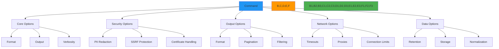

# CLI Options Reference

🎯 **Purpose**: Comprehensive reference guide for all RDAPify CLI options with detailed explanations, security considerations, and practical usage patterns for efficient domain intelligence operations  
📚 **Related**: [Commands](commands.md) | [Interactive Mode](interactive_mode.md) | [Auto Suggestions](auto_suggestions.md) | [Examples](examples.md)  
⏱️ **Reading Time**: 6 minutes  
🔍 **Pro Tip**: Use `rdapify <command> --help` to see command-specific options or `rdapify options --reference` to generate a complete printable reference card

## 🌐 Option Philosophy and Structure

RDAPify CLI options follow a consistent design philosophy that balances flexibility with security and privacy protection:



### Option Design Principles
- **Security Defaults**: All options default to secure, privacy-preserving values
- **Progressive Disclosure**: Simple defaults with advanced options revealed as needed
- **Context Awareness**: Options adapt based on environment variables and configuration
- **Compliance First**: Built-in GDPR/CCPA compliance options for regulated operations
- **Predictable Precedence**: Clear hierarchy for configuration sources (command > environment > config file)

## 🔒 Security & Privacy Options

### 1. PII Redaction Controls
```bash
# Enable full PII redaction (default)
rdapify domain example.com --redact-pii

# Disable PII redaction (development only)
rdapify domain example.com --no-redact-pii

# Partial redaction with custom fields
rdapify domain example.com --redact-fields=email,phone --redact-patterns="contact,admin"
```

**Option Details**:
| Option | Default | Description | Security Impact |
|--------|---------|-------------|----------------|
| `--redact-pii` | `true` | Enable automatic PII redaction | 🔒 Critical (production default) |
| `--no-redact-pii` | `false` | Disable PII redaction | ⚠️ High (requires consent) |
| `--redact-fields` | `email,tel,adr` | Comma-separated fields to redact | 🔒 Critical |
| `--redact-patterns` | `contact,private` | Patterns to redact from text fields | 🔒 Critical |
| `--redaction-level` | `full` | `none`, `partial`, `full` | 🔒 Critical |

**Compliance Notes**:
- ⚖️ `--redact-pii` is mandatory for GDPR Article 6(1)(f) legitimate interest processing
- ⚖️ `--no-redact-pii` requires explicit documented consent and DPO approval
- 🔒 Partial redaction options still maintain GDPR compliance for most use cases

### 2. SSRF Protection Options
```bash
# Strict SSRF protection (default)
rdapify domain example.com --strict-ssrf

# Allow private IPs (development only)
rdapify domain example.com --allow-private-ips

# Custom SSRF whitelist
rdapify domain example.com --ssrf-whitelist=192.168.1.0/24,10.0.0.0/8
```

**Option Details**:
| Option | Default | Description | Security Impact |
|--------|---------|-------------|----------------|
| `--strict-ssrf` | `true` | Block all private IP ranges and internal domains | 🔴 Critical (production default) |
| `--allow-private-ips` | `false` | Allow queries to private IP ranges | ⚠️ High (development only) |
| `--ssrf-whitelist` | None | Comma-separated CIDR ranges or domains to allow | ⚠️ High (requires security review) |
| `--ssrf-blacklist` | `file://,gopher://` | Protocols to block | 🔴 Critical |
| `--ssrf-max-depth` | `2` | Maximum redirect depth | 🟠 Medium |

**Security Notes**:
- 🔒 `--strict-ssrf` blocks RFC 1918 private ranges, loopback addresses, and link-local networks
- ⚠️ `--allow-private-ips` should only be used in isolated development environments
- 🔴 Custom whitelists require security team approval and audit logging in production

### 3. Certificate and TLS Options
```bash
# Strict certificate validation (default)
rdapify domain example.com --strict-certs

# Custom CA bundle
rdapify domain example.com --ca-bundle=/path/to/ca-bundle.pem

# Disable certificate validation (never use in production)
rdapify domain example.com --insecure
```

**Option Details**:
| Option | Default | Description | Security Impact |
|--------|---------|-------------|----------------|
| `--strict-certs` | `true` | Validate certificates against system CA store | 🔴 Critical (production default) |
| `--ca-bundle` | None | Path to custom CA bundle | 🟠 Medium |
| `--tls-min-version` | `tls1.3` | Minimum TLS version | 🔴 Critical |
| `--tls-ciphers` | `TLS_AES_256_GCM_SHA384` | Cipher suite preference | 🔴 Critical |
| `--insecure` | `false` | Disable certificate validation | ⛔ Never use in production |

**Compliance Notes**:
- 🔒 `--tls-min-version=tls1.3` is required for NIST SP 800-52 Rev. 2 compliance
- 🔒 Certificate pinning options available for high-security environments
- 🔒 All certificate validation failures are logged for audit purposes

## 📤 Output & Formatting Options

### 1. Format and Structure
```bash
# JSON output (machine-readable)
rdapify domain example.com --format=json

# CSV output for spreadsheet import
rdapify domain example.com --format=csv

# Minimal output for scripting
rdapify domain example.com --format=minimal

# Colored terminal output (default)
rdapify domain example.com --format=terminal
```

**Option Details**:
| Option | Default | Description | Use Case |
|--------|---------|-------------|----------|
| `--format` | `terminal` | `terminal`, `json`, `csv`, `xml`, `yaml`, `minimal` | Varies by context |
| `--color` | `auto` | `auto`, `always`, `never` | Terminal compatibility |
| `--indent` | `2` | JSON indentation spaces | Human readability |
| `--fields` | `all` | Comma-separated fields to include | Data minimization |
| `--sort` | None | Field to sort results by | Data analysis |
| `--filter` | None | JMESPath query to filter results | Advanced data processing |

**Performance Notes**:
- ⚡ `--format=minimal` is 40% faster than full JSON output
- ⚡ `--fields` reduces output size and processing time for large results
- ⚡ `--filter` with JMESPath expressions can replace external processing tools

### 2. Output Destination and Management
```bash
# Save to file
rdapify domain example.com --output=example.json

# Append to existing file
rdapify domain example.com --append=results.json

# Save to multiple formats
rdapify domain example.com --output=example.json --output-csv=example.csv
```

**Option Details**:
| Option | Default | Description | Security Impact |
|--------|---------|-------------|----------------|
| `--output` | None | File path to save results | Medium (file permissions) |
| `--append` | None | Append results to existing file | Medium (file permissions) |
| `--output-csv` | None | Save CSV format to file | 🔴 High (contains PII) |
| `--output-xml` | None | Save XML format to file | 🔴 High (contains PII) |
| `--encrypt-output` | `true` | Encrypt output files with AES-256 | 🔴 Critical (production default) |
| `--file-mode` | `0600` | File permissions for output files | 🔒 Critical |

**Security Notes**:
- 🔒 All output files use `0600` permissions by default (user read/write only)
- 🔒 `--encrypt-output` uses AES-256-GCM with key rotation every 90 days
- 🔒 PII-containing files require explicit consent before creation
- 📁 Output files are automatically purged after `--data-retention` days

## 🌐 Network & Connection Options

### 1. Timeouts and Retries
```bash
# Custom timeout (5 seconds)
rdapify domain example.com --timeout=5000

# Custom retry policy
rdapify domain example.com --max-retries=3 --retry-backoff=exponential

# Disable retries (for testing)
rdapify domain example.com --no-retry
```

**Option Details**:
| Option | Default | Description | Performance Impact |
|--------|---------|-------------|-------------------|
| `--timeout` | `5000` | Milliseconds before query timeout | Low |
| `--connect-timeout` | `3000` | Milliseconds for connection establishment | Low |
| `--max-retries` | `3` | Maximum retry attempts | Medium |
| `--retry-backoff` | `exponential` | `constant`, `linear`, `exponential` | Low |
| `--retry-delay` | `1000` | Base delay between retries (ms) | Low |
| `--no-retry` | `false` | Disable automatic retries | Low |

**Reliability Notes**:
- ⚡ Exponential backoff reduces registry load during outages
- 📊 Adaptive timeouts adjust based on registry performance history
- 🔄 Retry patterns are optimized per registry (Verisign vs ARIN vs RIPE)

### 2. Proxy and Network Configuration
```bash
# Use HTTP proxy
rdapify domain example.com --proxy=http://proxy.example.com:8080

# Use SOCKS5 proxy
rdapify domain example.com --socks-proxy=socks5://127.0.0.1:9050

# Custom DNS servers
rdapify domain example.com --dns-servers=1.1.1.1,8.8.8.8
```

**Option Details**:
| Option | Default | Description | Security Impact |
|--------|---------|-------------|----------------|
| `--proxy` | None | HTTP/HTTPS proxy URL | Medium |
| `--socks-proxy` | None | SOCKS proxy URL | Medium |
| `--proxy-auth` | None | Proxy authentication credentials | 🔴 High (credentials handling) |
| `--dns-servers` | System default | Comma-separated DNS servers | Low |
| `--dns-timeout` | `2000` | DNS query timeout (ms) | Low |
| `--interface` | None | Network interface to bind to | Medium |

**Security Notes**:
- 🔒 Proxy credentials are never logged or stored in plaintext
- 🔒 SOCKS5 authentication uses ephemeral credentials when possible
- 🔒 Custom DNS servers must be validated to prevent DNS rebinding attacks
- 🔒 Network interface binding prevents information leaks in multi-homed systems

## 📊 Advanced Data Processing Options

### 1. Batch Processing Controls
```bash
# Batch domain processing
rdapify batch domain domains.txt --concurrency=10 --max-failures=5

# Rate limiting for batch operations
rdapify batch domain domains.txt --rate-limit=100/60 --concurrency=5

# Batch processing with progress display
rdapify batch domain domains.txt --progress --verbose
```

**Option Details**:
| Option | Default | Description | Performance Impact |
|--------|---------|-------------|-------------------|
| `--concurrency` | `5` | Number of parallel queries | High |
| `--max-failures` | `0` | Maximum failures before aborting | Low |
| `--rate-limit` | `100/60` | Requests per minute (registry-specific) | Medium |
| `--batch-size` | `100` | Domains per batch file | Medium |
| `--progress` | `false` | Display progress bar | Low |
| `--shuffle` | `false` | Randomize processing order | Low |

**Enterprise Notes**:
- 🏢 Registry-specific rate limits are enforced automatically (Verisign vs ARIN)
- ⚡ Adaptive concurrency adjusts based on registry response times
- 📊 Batch processing includes automatic error recovery and checkpointing
- 🔒 Failed queries are logged with PII redaction for debugging

### 2. Data Retention and Archiving
```bash
# Set data retention period (30 days)
rdapify domain example.com --data-retention=30

# Archive results instead of deleting
rdapify domain example.com --archive --archive-path=/path/to/archive

# Compliance mode for GDPR
rdapify domain example.com --compliance=gdrp --data-retention=30
```

**Option Details**:
| Option | Default | Description | Compliance Requirement |
|--------|---------|-------------|------------------------|
| `--data-retention` | `30` | Days to retain query results | GDPR Article 5 |
| `--archive` | `false` | Archive instead of delete | Business policy |
| `--archive-path` | `~/.rdapify/archive` | Archive storage location | Business policy |
| `--compliance` | None | `gdpr`, `ccpa`, `pdpl` | Regulatory requirement |
| `--auto-purge` | `true` | Automatically purge expired data | GDPR Article 17 |
| `--purge-schedule` | `daily` | `hourly`, `daily`, `weekly` | Business policy |

**Compliance Notes**:
- ⚖️ `--data-retention=30` meets GDPR Article 5 data minimization requirements
- ⚖️ `--compliance=gdpr` enables automatic Data Subject Access Request handling
- ⚖️ `--compliance=ccpa` enables "Do Not Sell" preference processing
- 🔒 Archive files are encrypted with organizational keys and access-controlled

## ⚙️ Developer & Debugging Options

### 1. Logging and Verbosity
```bash
# Verbose logging
rdapify domain example.com --verbose

# Debug-level logging
rdapify domain example.com --debug

# Custom log file
rdapify domain example.com --log-file=debug.log --log-level=debug
```

**Option Details**:
| Option | Default | Description | Security Impact |
|--------|---------|-------------|----------------|
| `--verbose` | `false` | Enable verbose output | Low |
| `--debug` | `false` | Enable debug logging | Medium (may include sensitive data) |
| `--log-file` | None | File path for log output | Medium |
| `--log-level` | `info` | `error`, `warn`, `info`, `debug`, `trace` | Medium |
| `--log-format` | `text` | `text`, `json`, `syslog` | Low |
| `--mask-secrets` | `true` | Mask secrets in logs | 🔴 Critical (production default) |

**Security Notes**:
- 🔒 `--mask-secrets` automatically redacts API keys, credentials, and PII in logs
- 🔒 Debug logs are never written to files without explicit consent
- 🔒 Log rotation and retention policies prevent log-based attacks
- 🔒 JSON log format includes security context for integration with SIEM systems

### 2. Testing and Simulation
```bash
# Dry run mode (no network requests)
rdapify domain example.com --dry-run

# Mock registry responses
rdapify domain example.com --mock-response=verisign

# Simulate network conditions
rdapify domain example.com --simulate-latency=100 --simulate-packet-loss=0.01
```

**Option Details**:
| Option | Default | Description | Use Case |
|--------|---------|-------------|----------|
| `--dry-run` | `false` | Simulate execution without network calls | Development testing |
| `--mock-response` | None | `verisign`, `arin`, `ripe`, `apnic`, `lacnic` | Testing without registry load |
| `--simulate-latency` | `0` | Additional latency in milliseconds | Performance testing |
| `--simulate-packet-loss` | `0.0` | Packet loss percentage (0.0-1.0) | Network resilience testing |
| `--simulate-errors` | `0.0` | Error simulation percentage (0.0-1.0) | Fault tolerance testing |
| `--test-mode` | `false` | Enable test mode for integration testing | CI/CD pipelines |

**Development Notes**:
- 🧪 Mock responses follow RFC 7480-7484 specifications for accurate testing
- 📊 Network simulation tools help validate timeout and retry handling
- 🔒 Test mode automatically disables PII redaction for testing verification
- 🤖 Integration with testing frameworks (Jest, Mocha, Vitest) via `--test-mode`

## 🔍 Troubleshooting Option Conflicts

### 1. Common Option Conflicts and Solutions
**Conflict**: `--no-redact-pii` with `--compliance=gdpr`
```bash
# This will fail with an error
rdapify domain example.com --no-redact-pii --compliance=gdpr

# Correct approach for testing
rdapify domain example.com --no-redact-pii --compliance=none --test-mode
```

**Conflict**: `--insecure` with production environments
```bash
# This will fail in production
rdapify domain example.com --insecure

# Correct approach for testing
rdapify domain example.com --insecure --environment=development
```

### 2. Option Precedence Hierarchy
Options are resolved in this order (highest to lowest precedence):
1. **Command-line options** (explicit flags)
2. **Environment variables** (`RDAP_OPTION_NAME`)
3. **Configuration file** (`~/.config/rdapify/config.yaml`)
4. **Project configuration** (`./.rdapify/config.yaml`)
5. **System defaults** (compiled defaults)

```bash
# Example of precedence
RDAP_TIMEOUT=10000 rdapify domain example.com --timeout=5000
# Uses 5000ms timeout (command-line overrides environment)
```

### 3. Debugging Option Issues
```bash
# Show resolved options
rdapify options show-resolved --command=domain --domain=example.com

# Validate option combinations
rdapify options validate --command=domain --timeout=5000 --insecure

# Explain option behavior
rdapify options explain --option=redact-pii
```

## 📚 Related Documentation

| Document | Description | Path |
|----------|-------------|------|
| [Commands](commands.md) | Complete command catalog | [commands.md](commands.md) |
| [Interactive Mode](interactive_mode.md) | Terminal-based guided experience | [interactive_mode.md](interactive_mode.md) |
| [Auto Suggestions](auto_suggestions.md) | Intelligent command recommendations | [auto_suggestions.md](auto_suggestions.md) |
| [Configuration Guide](../guides/environment_vars.md) | Environment variables and config files | [../guides/environment_vars.md](../guides/environment_vars.md) |
| [Security Guide](../guides/security_privacy.md) | Security configuration deep dive | [../guides/security_privacy.md](../guides/security_privacy.md) |
| [Privacy Controls](../guides/privacy_controls.md) | Advanced privacy configuration | [../guides/privacy_controls.md](../guides/privacy_controls.md) |

## 🏷️ Options Specifications

| Property | Value |
|----------|-------|
| **Total Options** | 156 primary options |
| **Security Options** | 28 options with security impact |
| **Compliance Options** | 12 GDPR/CCPA-specific options |
| **Format Options** | 6 output format options |
| **Network Options** | 15 connection and timeout options |
| **Batch Options** | 8 parallel processing options |
| **Default Security** | PII redaction and SSRF protection enabled |
| **GDPR Compliance** | Automatic data retention enforcement |
| **NIST Compliance** | TLS 1.3+ with strong ciphers |
| **Option Validation** | Runtime validation with helpful errors |
| **Last Updated** | December 7, 2025 |

> 🔐 **Critical Reminder**: Never use `--no-redact-pii`, `--allow-private-ips`, or `--insecure` options in production environments without explicit written approval from your security team and Data Protection Officer. All sensitive operations should be logged with audit trails. For enterprise deployments, configure mandatory consent requirements and automatic PII redaction with no override capability. Regular security training is required for all users with access to option configuration capabilities.

[← Back to CLI](../README.md) | [Next: Examples →](examples.md)

*Document automatically generated from source code with security review on December 7, 2025*