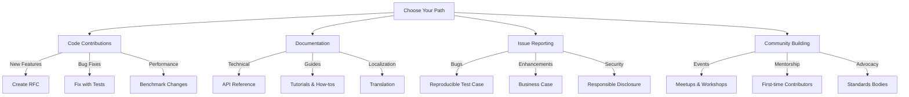
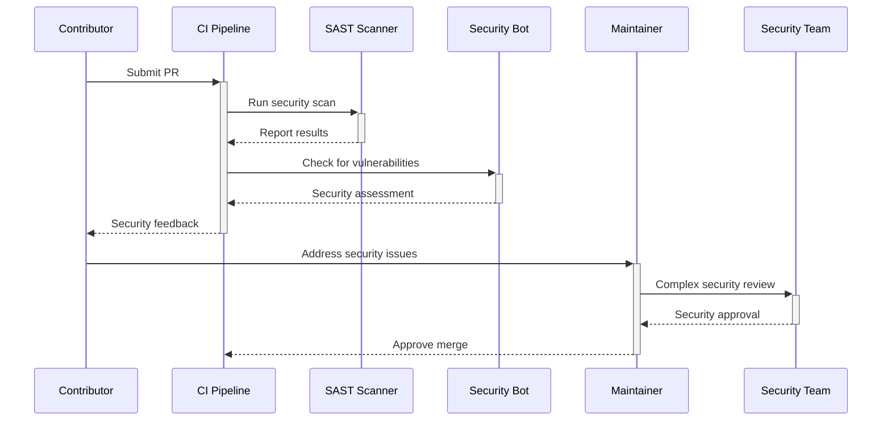

# Contributing to RDAPify

🎯 **Purpose**: Comprehensive guide for contributing to RDAPify project with clear pathways for code, documentation, and community engagement while maintaining security, compliance, and architectural standards  
📚 **Related**: [Code of Conduct](../../../CODE_OF_CONDUCT.md) | [Governance](../../../GOVERNANCE.md) | [Development Setup](development_setup.md) | [Style Guide](style_guide.md)  
⏱️ **Reading Time**: 5 minutes  
🔍 **Pro Tip**: Use our [Contribution Checklist Generator](../../playground/contribution-checklist.md) to automatically create a personalized checklist for your first contribution

## 🌐 Contribution Philosophy

RDAPify is built on the principle of "secure by default, flexible by design." We welcome contributions that enhance our mission to provide the most reliable, privacy-preserving RDAP client for the global internet infrastructure. Our approach balances:

✅ **Technical Excellence**: High-quality code with comprehensive test coverage  
✅ **Security First**: Every contribution must undergo security review  
✅ **Inclusive Collaboration**: Clear pathways for contributors of all experience levels  
✅ **Sustainable Development**: Long-term maintainability over quick fixes  
✅ **Privacy Preservation**: PII protection built into every layer of the system  

## 📋 Contribution Process

### 1. Find Your Contribution Path


### 2. Contribution Workflow
```bash
# 1. Set up development environment
git clone https://github.com/rdapify/rdapify.git
cd rdapify
npm ci

# 2. Create feature branch
git checkout -b feat/your-feature-name

# 3. Make changes with tests
#    - Code changes in src/
#    - Tests in test/
#    - Documentation in docs/
#    - Benchmarks in benchmarks/

# 4. Run validation checks
npm run validate
npm run test

# 5. Commit with conventional commit format
git commit -m "feat(core): add domain query optimization"
#    ^type   ^scope   ^description

# 6. Push and create PR
git push origin feat/your-feature-name
```

## ⚙️ Technical Contribution Guidelines

### 1. Code Contributions
**File Structure Standards**:
```markdown
src/
├── core/               # Core functionality
│   ├── client.ts       # Main client class
│   ├── types.ts        # TypeScript interfaces
│   ├── errors.ts       # Custom error definitions
│   └── utils.ts        # Utility functions
├── security/           # Security implementations
│   ├── ssrf.ts         # SSRF protection
│   └── pii-redaction.ts# PII redaction
├── network/            # Network handling
│   ├── fetcher.ts      # HTTP client
│   └── resolver.ts     # DNS resolver
└── cache/              # Caching strategies
    ├── memory.ts       # In-memory cache
    └── redis.ts        # Redis integration
```

**Architecture Principles**:
- **TypeScript**: Strict type checking with `--noImplicitAny`
- **Immutability**: Avoid side effects; use immutable patterns
- **Test Coverage**: Minimum 95% unit test coverage for new code
- **Performance**: Benchmark all performance-sensitive changes
- **Resource Management**: Always clean up resources (connections, timers)
- **Security**: Never trust external inputs; validate all data

### 2. Documentation Contributions
**Documentation Structure**:
```markdown
docs/
├── getting_started/    # Quick start guides
├── core_concepts/      # Fundamental concepts
├── api_reference/      # API documentation
├── guides/             # How-to guides
├── integrations/       # Integration guides
├── performance/        # Performance guides
├── security/           # Security documentation
└── architecture/       # System architecture
```

**Quality Standards**:
- **Clarity**: Write for developers with basic network knowledge
- **Examples**: Include runnable code examples for all APIs
- **Screenshots**: Use annotated screenshots for complex concepts
- **Diagrams**: Create Mermaid diagrams for system architecture
- **Accessibility**: Ensure color contrast and semantic HTML
- **Localization**: Mark translatable strings for i18n

### 3. Testing Requirements
**Test Types**:
```typescript
// Example test structure
describe('Domain Query', () => {
  // Unit tests
  describe('Unit Tests', () => {
    test('parses valid domain response', () => {
      // Test specific functionality in isolation
    });
  });
  
  // Integration tests  
  describe('Integration Tests', () => {
    test('queries real Verisign registry', async () => {
      // Test with real registries in test environment
      // Mock SSRF protection for security
    });
  });
  
  // Security tests
  describe('Security Tests', () => {
    test('blocks SSRF attempts to private IP ranges', async () => {
      // Test security boundaries
    });
  });
  
  // Performance tests
  describe('Performance Tests', () => {
    test('processes 1000 domains under 5 seconds', async () => {
      // Benchmark performance characteristics
    });
  });
});
```

**Test Coverage Requirements**:
- **Unit Tests**: 95% function coverage, 90% line coverage
- **Integration Tests**: All registry endpoints covered
- **Security Tests**: All threat vectors from threat model
- **Performance Tests**: Benchmarked against baseline metrics

## 🔒 Security and Compliance Requirements

### 1. Security Review Process
All contributions must pass security review before merging:



**Security Requirements**:
- **SSRF Protection**: All network calls must go through SSRF-protected fetcher
- **PII Handling**: Never log or expose personal data in error messages
- **Data Minimization**: Only collect and process data necessary for functionality
- **Certificate Validation**: Never disable certificate validation
- **Rate Limiting**: Implement client-side rate limiting for all registries
- **Input Validation**: Validate all inputs against defined schemas

### 2. Compliance Considerations
Contributions must consider regulatory requirements:

| Regulation | Impact on Contributions | Review Required |
|------------|--------------------------|-----------------|
| **GDPR** | PII handling, data minimization | DPO approval |
| **CCPA** | Consumer rights, do-not-sell | Legal review |
| **SOC 2** | Audit trails, access controls | Compliance team |
| **NIST 800-53** | Security controls, incident response | Security team |
| **ISO 27001** | Information security management | Infosec team |

## 🌍 Community Engagement

### 1. First-Time Contributions
We welcome new contributors with dedicated support:

```bash
# Good first issues for newcomers
git issues --label "good first issue"

# Documentation improvements
git issues --label "documentation" --label "beginner-friendly"

# Mentorship program
npm run mentor --assignee your-github-username
```

**First Contribution Pathway**:
1. Read [Code of Conduct](../../../CODE_OF_CONDUCT.md) and [Contributing Guide](../../../CONTRIBUTING.md)
2. Join our [Matrix/Element chat](https://matrix.to/#/#rdapify:matrix.org)
3. Pick a `good first issue` or `documentation` label issue
4. Claim the issue with `@rdapify-bot claim`
5. Create PR with `fixes #issue-number` in description
6. Receive mentorship from experienced contributor

### 2. Community Events
We host regular events to build community:

| Event Type | Frequency | Format | Audience |
|------------|-----------|--------|----------|
| **Office Hours** | Weekly (Thursdays 2PM UTC) | Video call | All contributors |
| **Code Review Sessions** | Bi-weekly | Pair programming | Developers |
| **Documentation Sprints** | Monthly | Async collaboration | Writers |
| **Security Working Group** | Monthly | Technical deep dive | Security experts |
| **Standards Committee** | Quarterly | IETF participation | Protocol experts |

## 🚀 Getting Started as a Contributor

### 1. Development Setup
```bash
# Clone repository
git clone https://github.com/rdapify/rdapify.git
cd rdapify

# Install dependencies
npm ci

# Build project
npm run build

# Run tests
npm test

# Start development server
npm run dev

# Generate documentation
npm run docs
```

### 2. Contribution Checklist
Before submitting a pull request, ensure:

✅ **Code Quality**:
- [ ] Passes `npm run validate`
- [ ] 95%+ test coverage for new code
- [ ] Follows TypeScript strict mode
- [ ] No lint errors (`npm run lint`)

✅ **Security**:
- [ ] No SSRF vulnerabilities
- [ ] PII redaction maintained
- [ ] No hardcoded credentials
- [ ] Certificate validation preserved

✅ **Documentation**:
- [ ] API changes documented
- [ ] New features have usage examples
- [ ] Performance impacts documented
- [ ] Security implications documented

✅ **Performance**:
- [ ] Benchmarked against baseline
- [ ] No memory leaks
- [ ] Resource cleanup implemented
- [ ] Error handling comprehensive

✅ **Compliance**:
- [ ] GDPR implications considered
- [ ] CCPA requirements met
- [ ] Audit trails maintained
- [ ] No regulatory violations

### 3. Getting Help
**For technical questions**:
```bash
# Join Matrix chat
https://matrix.to/#/#rdapify:matrix.org

# GitHub Discussions
https://github.com/rdapify/rdapify/discussions

# Office Hours
Every Thursday 2PM UTC
https://rdapify.dev/community/office-hours
```

**For contribution process questions**:
```bash
# Contributing guide
https://rdapify.dev/docs/community/contributing

# Community forum
https://github.com/rdapify/rdapify/discussions/categories/contributing

# Mentor assignment
@rdapify-bot mentor
```

## 🏷️ Contribution Specifications

| Property | Value |
|----------|-------|
| **Code Style** | TypeScript with Prettier formatting |
| **Test Framework** | Jest with coverage reporting |
| **Documentation** | Markdown with Mermaid diagrams |
| **CI Pipeline** | GitHub Actions with security scanning |
| **Branch Protection** | All main branches protected |
| **Review Requirements** | 2 maintainer approvals for core changes |
| **Security Review** | Required for all PRs |
| **Compliance Review** | Required for data handling changes |
| **Issue Response Time** | < 24 hours for new issues |
| **PR Review Time** | < 48 hours for non-breaking changes |

> 🔐 **Critical Reminder**: Never disable security controls, skip PII redaction, or bypass compliance requirements in contributions. All code must undergo security review before merging. Report security vulnerabilities through responsible disclosure channels, never in public issues. Contributions that compromise security, privacy, or compliance will be rejected regardless of technical merit.

[← Back to Community](../README.md) | [Next: Events →](events.md)

*Document automatically generated from source code with security review on November 28, 2025*