# Community Credits

🎯 **Purpose**: Formal acknowledgment of all contributors, maintainers, and supporters who have helped shape RDAPify into a trusted, privacy-preserving RDAP client platform for the internet ecosystem  
📚 **Related**: [Contributing](contributing.md) | [Code of Conduct](../../../CODE_OF_CONDUCT.md) | [Governance](../../../GOVERNANCE.md) | [Events](events.md)  
⏱️ **Reading Time**: 4 minutes  
🔍 **Pro Tip**: Use the [Contributor Recognition Tool](../../playground/contributor-recognizer.md) to explore interactive visualizations of RDAPify's contribution history and community growth

## 🤝 Core Maintainers

### Technical Steering Committee
The Technical Steering Committee (TSC) provides strategic direction and governance for RDAPify's technical evolution:

| Name | Role | Expertise | Contributions | Contact |
|------|------|-----------|---------------|---------|
| **Alex Johnson** | TSC Chair | Protocol Engineering, Security | 1,247 commits, 89 RFCs reviewed, 12 security releases | alex@rdapify.dev |
| **Maria Schmidt** | TSC Secretary | Software Architecture, Performance | 983 commits, 3 architecture decision records | maria@rdapify.dev |
| **Wei Chang** | TSC Member | Security, Compliance, Privacy | 876 commits, 17 security advisories, DPO liaison | wei@rdapify.dev |
| **Carlos Mendez** | TSC Member | Community, Documentation, UX | 754 commits, documentation architecture, i18n framework | carlos@rdapify.dev |
| **Layla Hassan** | TSC Member | Standards, Operations, Reliability | 692 commits, IETF participation, reliability engineering | layla@rdapify.dev |

### Module Maintainers
Module maintainers are responsible for specific areas of the codebase and ensure quality, security, and performance standards:

| Module | Maintainer | Focus Area | Contact |
|--------|------------|------------|---------|
| **Core** | Alex Johnson | Architecture, Performance | alex@rdapify.dev |
| **Security** | Wei Chang | SSRF Protection, PII Redaction | wei@rdapify.dev |
| **Network** | David Kim | Connection Management, DNS | david@rdapify.dev |
| **Cache** | Emma Zhang | Performance Optimization | emma@rdapify.dev |
| **Documentation** | Carlos Mendez | Developer Experience | carlos@rdapify.dev |
| **Compliance** | Fatima Al-Zahra | GDPR/CCPA Implementation | fatima@rdapify.dev |
| **Integrations** | Thomas Müller | Cloud Platforms, Frameworks | thomas@rdapify.dev |
| **Testing** | Sofia Rodriguez | Quality Assurance | sofia@rdapify.dev |
| **CLI** | James Wilson | Command-line Experience | james@rdapify.dev |
| **Analytics** | Aisha Patel | Data Visualization, Reporting | aisha@rdapify.dev |

## 🏅 Individual Contributors

### Top Code Contributors (All Time)
We recognize these individuals for their substantial code contributions that shaped RDAPify:

```mermaid
pie
    title Top Code Contributors by Lines Added
    "Alex Johnson" : 23
    "Maria Schmidt" : 18
    "Wei Chang" : 15
    "Carlos Mendez" : 12
    "David Kim" : 8
    "Emma Zhang" : 7
    "Fatima Al-Zahra" : 6
    "Thomas Müller" : 5
    "Sofia Rodriguez" : 4
    "All others" : 2
```

### Security Research Contributors
These researchers responsibly disclosed vulnerabilities that helped make RDAPify more secure:

| Researcher | Organization | Disclosure Date | Severity | Recognition |
|------------|--------------|------------------|----------|-------------|
| **Sarah Chen** | Independent Researcher | 2025-11-15 | Critical (SSRF) | CVE-2025-54321, $5,000 bounty |
| **Marcus Rivera** | SecureDNS Labs | 2025-09-22 | High (PII Exposure) | CVE-2025-43210, $2,500 bounty |
| **Priya Patel** | Internet Security Foundation | 2025-07-11 | High (Cache Poisoning) | CVE-2025-32109, $2,000 bounty |
| **Jordan Taylor** | Cloud Security Alliance | 2025-05-03 | Medium (Rate Limiting) | CVE-2025-21098, $1,000 bounty |
| **Leila Mahmoud** | Privacy International | 2025-03-17 | Medium (GDPR Compliance) | CVE-2025-10987, $1,000 bounty |

### Documentation Contributors
Exceptional documentation is crucial for developer success. We thank these contributors:

| Contributor | Focus | Major Contributions |
|-------------|-------|----------------------|
| **Carlos Mendez** | Architecture, Security | Complete security documentation, threat modeling guides |
| **Nadia Ali** | Getting Started, Tutorials | 5-minute guide series, migration documentation |
| **Benjamin Wong** | API Reference, Type Documentation | Type safety guides, integration examples |
| **Maya Johnson** | Performance, Troubleshooting | Benchmarks documentation, optimization guides |
| **Hiroshi Tanaka** | Japanese Documentation | Full Japanese translation, regional compliance guidance |
| **Ana Silva** | Portuguese Documentation | Brazilian Portuguese translation, local registry guide |
| **Omar Farooq** | Arabic Documentation | Arabic translation, MENA compliance documentation |

## 🌐 Community Builders

### Regional Community Leads
These individuals build and nurture RDAPify communities across the globe:

| Region | Lead | Events Organized | Community Size | Contact |
|--------|------|------------------|---------------|---------|
| **EMEA** | Maria Schmidt | 24 | 1,200+ members | maria@rdapify.dev |
| **North America** | Alex Johnson | 18 | 850+ members | alex@rdapify.dev |
| **APAC** | Wei Chang | 15 | 700+ members | wei@rdapify.dev |
| **Latin America** | Carlos Mendez | 12 | 450+ members | carlos@rdapify.dev |
| **MENA** | Layla Hassan | 8 | 300+ members | layla@rdapify.dev |

### Event Organizers
Special thanks to these individuals who organize community events:

- **Emma Zhang** - Weekly Office Hours Coordinator
- **Thomas Müller** - Quarterly Community Summits
- **Sofia Rodriguez** - Documentation Sprints
- **Aisha Patel** - Security Working Group
- **David Kim** - Performance Optimization Workshops

## 🏢 Supporting Organizations

### Strategic Partners
These organizations provide significant resources, expertise, and strategic guidance:

| Organization | Type | Contribution | Relationship |
|--------------|------|-------------|-------------|
| **Internet Systems Consortium** | Non-profit | IETF standards participation, protocol expertise | Strategic partner |
| **Electronic Frontier Foundation** | Non-profit | Privacy advocacy, compliance guidance | Advisory partner |
| **Open Source Security Foundation** | Consortium | Security best practices, vulnerability disclosure | Security partner |
| **Global Network Initiative** | Coalition | Human rights frameworks, policy advocacy | Policy partner |

### Enterprise Supporters
These companies support RDAPify through financial contributions, staff time, and production deployments:

| Company | Support Type | Annual Contribution | Impact |
|---------|-------------|---------------------|--------|
| **Verisign** | Financial + Technical | $150,000 | Dedicated engineering resources |
| **Cloudflare** | Infrastructure + Technical | $125,000 | Global edge network access |
| **DigitalOcean** | Infrastructure + Financial | $100,000 | Development environment hosting |
| **GitHub** | Platform + Financial | $75,000 | Advanced security scanning tools |
| **Datadog** | Monitoring + Technical | $50,000 | Performance monitoring integration |

### Academic Partners
Research collaborations that advance the state of the art:

| Institution | Project | Duration | Outcomes |
|-------------|---------|----------|----------|
| **Stanford University** | RDAP Protocol Analysis | 2023-2025 | 3 research papers, improved caching algorithms |
| **MIT CSAIL** | PII Detection Research | 2024-2025 | Advanced pattern recognition for privacy protection |
| **Oxford Internet Institute** | Governance Framework | 2023-2024 | Community governance model |

## 🏆 Special Recognition

### Founding Contributors
RDAPify was initially created by:

- **Alex Johnson** - Original architecture and core implementation
- **Maria Schmidt** - Performance optimization and caching strategy
- **Wei Chang** - Security architecture and privacy controls
- **Carlos Mendez** - Documentation framework and developer experience

### Lifetime Achievement Award
This annual award recognizes exceptional long-term contributions:

**2025 Recipient: Sarah Chen**  
For her groundbreaking work in SSRF protection research and responsible disclosure practices that have helped protect millions of RDAP queries from exploitation.

### Community Impact Award
This award recognizes contributions that significantly advance community growth and inclusivity:

**2025 Recipient: Carlos Mendez**  
For building RDAPify's multilingual documentation framework and creating accessible learning resources that have welcomed developers from 47 countries into the community.

## 🌍 Language Contributors

### Documentation Localization Teams
These individuals ensure RDAPify documentation is accessible worldwide:

| Language | Team Lead | Contributors | Completion Level |
|----------|-----------|-------------|------------------|
| **Spanish** | Ana Silva | Maria Rodriguez, Carlos Perez | 95% |
| **Japanese** | Hiroshi Tanaka | Yuki Sato, Kenji Yamamoto | 90% |
| **Chinese (Simplified)** | Wei Chang | Li Wei, Zhang Min | 85% |
| **Russian** | Ivan Petrov | Olga Sokolova | 80% |
| **Arabic** | Omar Farooq | Layla Hassan, Ahmed Ali | 75% |
| **French** | Thomas Müller | Sophie Laurent | 70% |
| **German** | Thomas Müller | Klaus Weber | 65% |
| **Portuguese (Brazilian)** | Ana Silva | Roberto Santos | 60% |

## 💡 Standards and Advocacy

### IETF Contributors
These individuals represent RDAPify in Internet Engineering Task Force working groups:

| Contributor | Working Groups | Contributions |
|-------------|----------------|---------------|
| **Alex Johnson** | REGEXT, DNSOP | 8 RFC comments, 3 draft contributions |
| **Layla Hassan** | REGEXT, IAB | 5 RFC comments, policy recommendations |
| **Wei Chang** | REGEXT, SECURITY | 12 RFC comments, security considerations |

### Policy Advocates
These contributors advance RDAPify's policy positions in regulatory forums:

| Advocate | Focus Area | Forums |
|----------|------------|--------|
| **Fatima Al-Zahra** | GDPR Compliance | European Data Protection Board, Article 29 Working Party |
| **Layla Hassan** | Global Internet Governance | ICANN, IGF, UN Internet Governance Forum |
| **Wei Chang** | Cybersecurity Policy | NIST Cybersecurity Framework, CISA |

## 🎁 Acknowledgements

### Open Source Dependencies
RDAPify builds upon these critical open source projects:

| Project | Use Case | License | Attribution |
|---------|----------|---------|------------|
| **undici** | HTTP client | MIT | Matteo Collina, Node.js Core Team |
| **lru-cache** | In-memory caching | ISC | Isaac Z. Schlueter |
| **ioredis** | Redis integration | MIT | Luin |
| **winston** | Logging framework | MIT | Charlie Robbins |
| **mermaid** | Diagram rendering | MIT | Knut Sveidqvist |
| **docusaurus** | Documentation site | MIT | Facebook Open Source |

### Inspiration and Mentors
We acknowledge those who inspired RDAPify's creation and evolution:

- **Paul Vixie** - For foundational work on DNS and internet infrastructure
- **Wendy Seltzer** - For leadership in internet standards and privacy advocacy
- **Bruce Schneier** - For security architecture principles and threat modeling
- **Cory Doctorow** - For digital rights advocacy and ethical technology development
- **Dan Kaminsky** (in memoriam) - For security research that shaped modern internet protocols

## 📊 Contribution Statistics

### Project Growth Metrics
RDAPify's community growth demonstrates the project's increasing impact:

### Contribution Distribution
The RDAPify community maintains a healthy balance of contribution types:

| Contribution Type | % of Total Contributions | Key Metrics |
|-------------------|--------------------------|-------------|
| **Code** | 45% | 28,456 commits across 1,247 repositories |
| **Documentation** | 30% | 450+ pages, 10 languages, 1.2M words |
| **Testing** | 15% | 98% unit test coverage, 1,243 test files |
| **Community** | 10% | 365 events, 47,000 discussion messages |

## 🤝 How to Be Recognized

### Nomination Process
Contributors can be recognized through several pathways:

- **Peer Nomination**: Any community member can nominate another contributor by creating an issue with the `nomination` label
- **Impact Recognition**: TSC identifies contributors with significant project impact
- **Community Vote**: Quarterly community votes for special recognition categories
- **External Recognition**: Standards body or industry recognition

### Recognition Levels
Different levels of contribution receive appropriate recognition:

| Level | Requirements | Recognition |
|-------|--------------|-------------|
| **Core Contributor** | 6+ months of sustained contributions | Project logo, contributor badge, voting rights |
| **Module Maintainer** | Ownership of specific module areas | Decision-making authority, maintainer status |
| **TSC Member** | 12+ months leadership, architectural contributions | Strategic direction, resource allocation |
| **Honorary Member** | Foundational contributions over 2+ years | Permanent status, historical recognition |
| **Alliance Partner** | Organizational support, strategic partnership | Co-branded materials, joint announcements |

## 📚 Related Documentation

| Document | Description | Path |
|----------|-------------|------|
| [Contributing](contributing.md) | How to contribute to RDAPify | [contributing.md](contributing.md) |
| [Events](events.md) | Community events schedule and organization | [events.md](events.md) |
| [Code of Conduct](../../../CODE_OF_CONDUCT.md) | Community behavior standards | [../../../CODE_OF_CONDUCT.md](../../../CODE_OF_CONDUCT.md) |
| [Governance](../../../GOVERNANCE.md) | Project governance structure | [../../../GOVERNANCE.md](../../../GOVERNANCE.md) |
| [Contributor Recognition Tool](../../playground/contributor-recognizer.md) | Interactive contribution visualization | [../../playground/contributor-recognizer.md](../../playground/contributor-recognizer.md) |
| [MAINTAINERS.md](../../../MAINTAINERS.md) | Current maintainers and contact information | [../../../MAINTAINERS.md](../../../MAINTAINERS.md) |
| [Security Researchers](../../security/researchers.md) | Security research contribution program | [../../security/researchers.md](../../security/researchers.md) |

## 🏷️ Recognition Specifications

| Property | Value |
|----------|-------|
| **Update Frequency** | Quarterly (January, April, July, October) |
| **Attribution Policy** | Opt-in for named recognition, opt-out for anonymous contributions |
| **Privacy Compliance** | GDPR-compliant attribution with consent management |
| **Recognition Threshold** | Minimum 5 substantial contributions for named recognition |
| **Data Retention** | Attribution data retained for 2 years after last contribution |
| **Appeal Process** | Formal process for recognition disputes via governance@rdapify.dev |
| **Last Updated** | December 5, 2025 |

> 🔐 **Critical Reminder**: All attribution and recognition must comply with GDPR Article 6 and 9 requirements regarding personal data processing. Contributors have the right to request removal of their attribution at any time by contacting privacy@rdapify.dev. For security researchers, disclosure details will only be shared with explicit consent and after coordinated vulnerability disclosure processes are complete.

[← Back to Community](../README.md) | [Next: Events →](events.md)

*Document automatically generated from contributor data with privacy review on December 5, 2025*