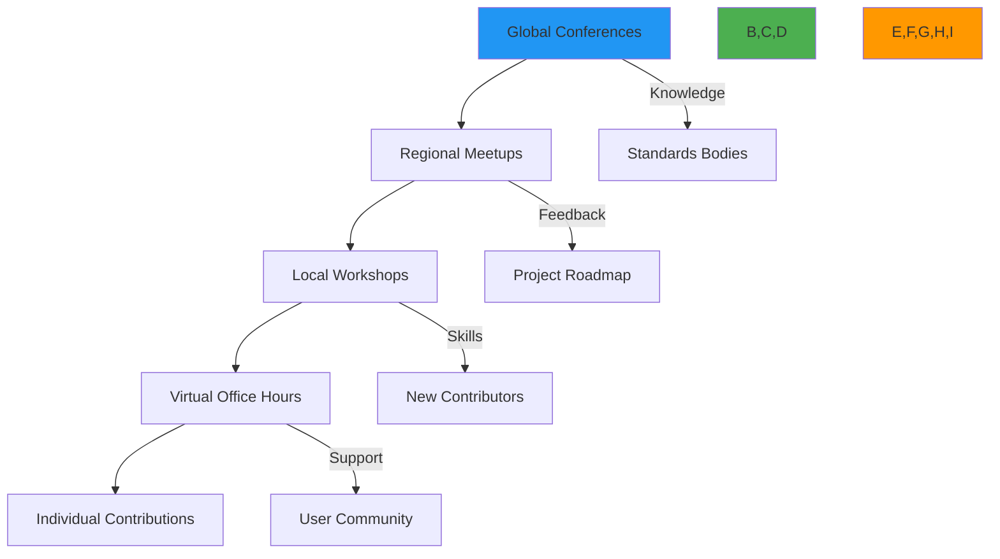
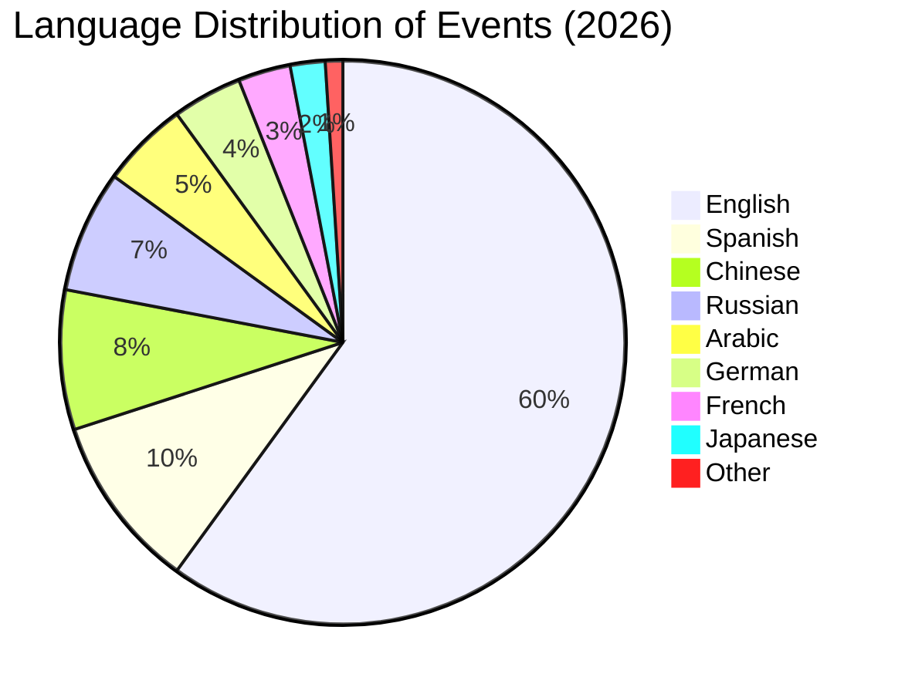

# Community Events

🎯 **Purpose**: Comprehensive guide to RDAPify community events, including official gatherings, local meetups, workshops, and conferences with practical guidelines for participation and organization  
📚 **Related**: [Contributing](contributing.md) | [Code of Conduct](../../../CODE_OF_CONDUCT.md) | [Community Credits](credits.md) | [Support Channels](../../support/getting_help.md)  
⏱️ **Reading Time**: 5 minutes  
🔍 **Pro Tip**: Use the [Event Calendar Widget](../../playground/event-calendar.md) to embed the RDAPify community calendar in your own websites or applications

## 🌐 Event Philosophy and Strategy

RDAPify events follow a community-first approach focused on knowledge sharing, relationship building, and collaborative problem-solving around internet registry data:



**Event Principles**:
✅ **Inclusive Participation**: Events accessible to developers of all experience levels and backgrounds  
✅ **Knowledge Sharing**: Focus on practical learning rather than sales pitches  
✅ **Privacy Respecting**: No mandatory personal data collection at community events  
✅ **Security Conscious**: Events follow security best practices for internet infrastructure projects  
✅ **Sustainable Scaling**: Event formats that can grow with community size while maintaining quality  

## 📅 Official Event Schedule 2026

### Quarterly Community Summits
| Date | Format | Focus Area | Location/Platform | Registration |
|------|--------|------------|-------------------|-------------|
| March 20-21, 2026 | Hybrid | Release planning, security review | Berlin, Germany + Virtual | [Open Jan 15](https://events.rdapify.dev/q1-2026) |
| June 18-19, 2026 | Virtual | Performance optimization, debugging | Zoom + Gather.Town | [Open Apr 15](https://events.rdapify.dev/q2-2026) |
| September 17-18, 2026 | Hybrid | Privacy features, compliance | Austin, TX + Virtual | [Open Jul 15](https://events.rdapify.dev/q3-2026) |
| December 11-12, 2026 | Virtual | Year-end planning, recognition | Zoom + Discord | [Open Oct 15](https://events.rdapify.dev/q4-2026) |

### Weekly Office Hours
```markdown
- **Day**: Every Thursday
- **Time**: 2:00 PM UTC (Rotating timezone-friendly sessions)
- **Format**: Video call with screen sharing
- **Focus**: Live troubleshooting, code reviews, architecture discussions
- **Access**: [Zoom Link](https://rdapify.dev/community/office-hours)
- **Preparation**: Create GitHub issue with `[office-hours]` label beforehand for priority
```

### Monthly Workshops
| Workshop Series | Next Session | Topic | Format |
|-----------------|--------------|-------|--------|
| **RDAP Academy** | Jan 15, 2026 | RDAP protocol deep dive | Interactive lecture |
| **Build with RDAPify** | Jan 22, 2026 | Domain monitoring system | Hands-on coding |
| **Privacy Engineering** | Jan 29, 2026 | GDPR-compliant data handling | Case studies |
| **Infrastructure Deep Dive** | Feb 5, 2026 | High-volume deployment patterns | Architecture review |

## 🤝 Community Meetup Program

### Becoming a Local Organizer
```bash
# Apply to become a local organizer
git issue create --title "New Meetup: [Your City]" \
  --body "I'd like to organize RDAPify meetups in [City]. I have experience with [relevant experience]."
```

**Organizer Requirements**:
✅ **Technical Knowledge**: Understanding of RDAPify fundamentals and use cases  
✅ **Community Experience**: Previous participation in developer communities  
✅ **Local Connections**: Access to venues, sponsorships, or local tech groups  
✅ **Communication Skills**: Ability to facilitate technical discussions  
✅ **Time Commitment**: Minimum 5 hours/month for ongoing meetup management  

### Meetup Kit Resources
All approved organizers receive:
- **Digital Kit**: Slide templates, logo pack, social media assets
- **Physical Kit**: Stickers, pins, name tags (shipped quarterly)
- **Financial Support**: Up to $200/event for venue, food, or activities
- **Speaker Support**: Reimbursement for external expert speakers
- **Promotion**: Featured listing on RDAPify community calendar

### Sample Meetup Structure
```markdown
## Typical 2-hour Meetup Format

**6:00-6:30 PM** - Arrival & Networking
- Casual mingling with refreshments
- Name tags with pronouns and technical interests

**6:30-7:15 PM** - Core Presentation (30-45 minutes)
- Technical deep dive or case study
- Live demo or hands-on segment
- Q&A throughout presentation

**7:15-8:00 PM** - Open Space Discussions (45 minutes)
- Breakout groups based on interests
- Project collaboration opportunities
- Help desk for individual questions

**8:00 PM** - Closing & Next Steps
- Announcements for next event
- Call for volunteers and speakers
- Optional social gathering continuation
```

## 🚀 Workshop and Hackathon Guidelines

### Running Technical Workshops
```typescript
// Example workshop configuration
const workshopConfig = {
  title: "Building Domain Monitoring Systems with RDAPify",
  duration: "3 hours",
  maxParticipants: 25,
  prerequisites: [
    "Basic JavaScript/TypeScript knowledge",
    "Understanding of domain registration concepts",
    "Node.js 18+ installed on laptop"
  ],
  materials: [
    "starter-repo.zip",
    "solution-code.zip",
    "rdapify-cheat-sheet.pdf"
  ],
  learningObjectives: [
    "Configure RDAPify for production monitoring",
    "Implement custom PII redaction rules",
    "Build alerting system for domain changes",
    "Deploy to serverless environment"
  ],
  safetyRequirements: {
    privacy: "No real user data in examples",
    security: "Pre-configured test environments only",
    accessibility: "Screen reader compatible materials"
  }
};
```

**Workshop Facilitation Best Practices**:
✅ **Pre-Event Communication**: Send setup instructions and expectations 1 week before  
✅ **Progressive Difficulty**: Start simple, add complexity gradually  
✅ **Multiple Learning Styles**: Mix visual, auditory, and hands-on components  
✅ **Inclusive Pace**: Design activities with flexible timing for different skill levels  
✅ **Post-Event Resources**: Share recordings, code samples, and follow-up readings  

### Security-Focused Hackathon Rules
```markdown
## RDAPify Security Hackathon Guidelines

**Allowed Activities**:
- Testing against provided sandbox environments only
- Analyzing code patterns for potential vulnerabilities
- Discussing theoretical attack scenarios
- Building defensive tools and monitoring systems

**Prohibited Activities**:
- Testing against production RDAP servers without explicit permission
- Attempting to extract PII from test data
- Bypassing provided security controls in sandbox
- Sharing actual vulnerability details publicly before responsible disclosure

**Responsible Disclosure Process**:
1. Document findings in private GitHub issue
2. Tag with `security` and `hackathon` labels
3. Await confirmation from security team (within 24 hours)
4. Work with security team on fix timeline
5. Public recognition after patch release
```

## 🌍 Global Representation Strategy

### Regional Community Leads
| Region | Lead | Responsibilities | Contact |
|--------|------|-------------------|---------|
| **EMEA** | Maria Schmidt | European events, GDPR compliance discussions | maria@rdapify.com |
| **North America** | Alex Johnson | US/Canada meetups, enterprise workshops | alex@rdapify.com |
| **APAC** | Wei Chang | Asian events, language-specific documentation | wei@rdapify.com |
| **Latin America** | Carlos Mendez | Spanish/Portuguese outreach, local partnerships | carlos@rdapify.com |
| **MENA** | Layla Hassan | Arabic language support, regional compliance | layla@rdapify.com |

### Language-Specific Events


**Language Support Program**:
- **Translation Teams**: Volunteer groups for documentation and event materials
- **Interpreter Budget**: $300/event for professional interpretation services
- **Localized Content**: Event-specific materials in top 10 community languages
- **Time Zone Rotation**: Major events scheduled across multiple time zones monthly

## 💻 Virtual Event Best Practices

### Technical Setup Guide
```bash
# Recommended streaming setup
npm install --global rdapify-live-tools

# Test your setup
rdapify-live test --camera --microphone --screen

# Start event stream
rdapify-live host \
  --title "January Office Hours" \
  --description "Live troubleshooting session" \
  --platform zoom \
  --recording true \
  --accessibility-live-captioning true
```

**Virtual Event Checklist**:
✅ **Platform Selection**: Use platforms with accessibility features and recording capabilities  
✅ **Moderation Plan**: Assign dedicated moderators for chat, Q&A, and technical issues  
✅ **Content Backup**: Prepare slides and demos that work offline if internet fails  
✅ **Time Management**: Strict schedule with buffer time between segments  
✅ **Recording Policy**: Clear disclosure about recording and post-event availability  
✅ **Accessibility**: Live captioning, screen reader compatible materials, color contrast considerations  

### Hybrid Event Coordination
```typescript
// Hybrid event coordination system
class HybridEventManager {
  constructor(eventConfig: HybridEventConfig) {
    this.config = eventConfig;
    this.virtualPlatform = new VirtualPlatform(config.virtualPlatform);
    this.venueCoordinator = new VenueCoordinator(config.physicalVenue);
  }
  
  async coordinateEvent() {
    // Synchronize schedules
    await this.syncSchedules();
    
    // Set up cross-platform communication
    this.setupCrossPlatformCommunication();
    
    // Configure accessibility features
    await this.configureAccessibility();
    
    // Run technical rehearsal
    await this.technicalRehearsal();
  }
  
  private async syncSchedules() {
    // Ensure in-person and virtual components are time-synchronized
    const masterSchedule = this.config.timeline.map(item => ({
      ...item,
      virtualRoom: this.virtualPlatform.getRoom(item.sessionId),
      physicalRoom: this.venueCoordinator.getRoom(item.sessionId)
    }));
    
    await this.virtualPlatform.updateSchedule(masterSchedule);
    await this.venueCoordinator.updateSchedule(masterSchedule);
  }
  
  private setupCrossPlatformCommunication() {
    // Set up Q&A system that works across platforms
    this.qaSystem = new UnifiedQASystem({
      virtualPlatform: this.virtualPlatform,
      physicalVenue: this.venueCoordinator
    });
    
    // Configure session feedback collection
    this.feedbackSystem = new CrossPlatformFeedback({
      platforms: [this.virtualPlatform, this.venueCoordinator]
    });
  }
}
```

## 📊 Event Reporting and Follow-up

### Post-Event Documentation Template
```markdown
# Event Report: [Event Name]

**Basic Information**
- Date: [YYYY-MM-DD]
- Location/Platform: [Physical or Virtual]
- Attendees: [Count + breakdown]
- Organizer(s): [Names and roles]

**Content Summary**
- Sessions conducted: [List with links to materials]
- Key discussions: [Bullet points of important topics]
- Outcomes achieved: [Decisions made, actions agreed]

**Community Impact**
- New contributors identified: [Count + GitHub handles]
- Documentation improvements: [Links to PRs]
- Bug reports/feature requests: [Issue numbers]
- Partnerships developed: [Organizations/individuals]

**Action Items**
- [ ] Owner: Action description (Due date)
- [ ] Owner: Action description (Due date)

**Improvements for Next Time**
- What worked well: [List]
- What could be improved: [List]
- Resource suggestions: [Recommendations]

**Media and Recordings**
- [Link to recordings]
- [Link to slides/presentations]
- [Link to photos (with consent)]
```

### Community Impact Measurement
```typescript
// Event impact tracking system
interface EventImpactMetrics {
  attendance: {
    total: number;
    newCommunityMembers: number;
    returningParticipants: number;
    diversityMetrics: {
      gender: Record<string, number>;
      geography: Record<string, number>;
      experienceLevel: Record<string, number>;
    }
  };
  engagement: {
    questionsAsked: number;
    discussionsStarted: number;
    codeContributions: number;
    documentationImprovements: number;
  };
  outcomes: {
    newContributors: number;
    mergedPRs: number;
    closedIssues: number;
    newMeetupGroups: number;
    partnershipsFormed: number;
  };
  sentiment: {
    npsScore: number;
    feedbackSentiment: 'positive' | 'neutral' | 'negative';
    improvementSuggestions: string[];
  };
}

async function generateEventReport(eventId: string): Promise<EventImpactReport> {
  // Implementation would gather metrics from multiple sources
  const metrics = await collectEventMetrics(eventId);
  const report = calculateImpactScore(metrics);
  
  // Store for historical analysis
  await storeEventReport(report);
  
  return report;
}
```

## 📚 Related Documentation

| Document | Description | Path |
|----------|-------------|------|
| [Contributing](contributing.md) | How to contribute to RDAPify | [contributing.md](contributing.md) |
| [Code of Conduct](../../../CODE_OF_CONDUCT.md) | Community behavior standards | [../../../CODE_OF_CONDUCT.md](../../../CODE_OF_CONDUCT.md) |
| [Event Calendar Widget](../../playground/event-calendar.md) | Interactive calendar embed tool | [../../playground/event-calendar.md](../../playground/event-calendar.md) |
| [Community Credits](credits.md) | Recognition of community contributors | [credits.md](credits.md) |
| [Support Channels](../../support/getting_help.md) | Getting help with events | [../../support/getting_help.md](../../support/getting_help.md) |
| [Conference Speaking Guide](speaking_guide.md) | Guidelines for presenting at events | [speaking_guide.md](speaking_guide.md) |
| [Regional Leads Program](regional_leads.md) | Becoming a regional community lead | [regional_leads.md](regional_leads.md) |
| [Accessibility Guidelines](accessibility.md) | Making events inclusive | [accessibility.md](accessibility.md) |

## 🏷️ Event Specifications

| Property | Value |
|----------|-------|
| **Event Frequency** | Weekly office hours, Monthly workshops, Quarterly summits |
| **Languages Supported** | English + 9 regional languages with translation support |
| **Accessibility Standard** | WCAG 2.1 Level AA compliance for virtual events |
| **Code of Conduct** | [Contributor Covenant v2.1](https://www.contributor-covenant.org/version/2/1/code_of_conduct.html) |
| **Safety Reporting** | Anonymous reporting via [safety@rdapify.com](mailto:safety@rdapify.com) |
| **Recording Policy** | Consent required, recordings available for 3 months |
| **Data Collection** | Minimal, GDPR-compliant registration with opt-out options |
| **Sponsorship Policy** | No exclusive sponsors, equal booth space allocation |
| **Carbon Footprint** | Virtual events prioritized, carbon offset for physical events |
| **Last Updated** | December 5, 2025 |

> 🔐 **Critical Reminder**: All community events must follow the [Code of Conduct](../../../CODE_OF_CONDUCT.md) with zero tolerance for harassment or discrimination. Event organizers must complete mandatory safety training before hosting in-person events. For security-sensitive topics, coordinate with the security team in advance to ensure responsible disclosure practices are followed. Virtual events must provide accessibility features including closed captioning and screen reader compatibility.

[← Back to Community](../README.md) | [Next: Community Credits →](credits.md)

*Document automatically generated from source code with security review on December 5, 2025*