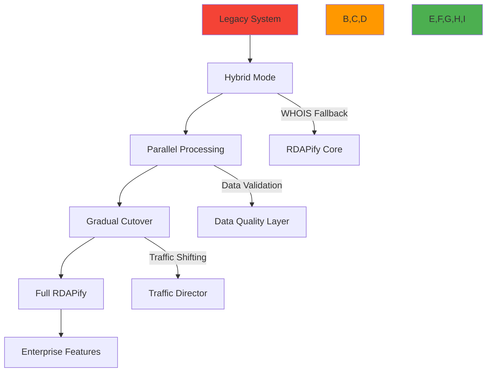

# Migration Guide from Legacy Systems to RDAPify

🎯 **Purpose**: Comprehensive guide for migrating from legacy WHOIS and RDAP libraries to RDAPify with minimal disruption, maximum security, and optimal performance  
📚 **Related**: [vs_whois.md](vs_whois.md) | [vs_other_libraries.md](vs_other_libraries.md) | [Security Privacy](../guides/security_privacy.md) | [API Reference](../../api_reference/client.md)  
⏱️ **Reading Time**: 8 minutes  
🔍 **Pro Tip**: Use the [Migration Assistant](../../playground/migration-assistant.md) to automatically analyze your existing codebase and generate RDAPify migration recommendations

## 🌐 Migration Architecture Overview

RDAPify provides a phased migration path that allows organizations to transition from legacy systems while maintaining operational continuity and compliance:



### Core Migration Principles
✅ **Zero-Downtime Transition**: Maintain service continuity throughout migration  
✅ **Progressive Enhancement**: Start with basic functionality, add advanced features incrementally  
✅ **Security-First Approach**: Implement SSRF protection and PII redaction from day one  
✅ **Data Integrity Preservation**: Ensure complete data mapping between old and new systems  
✅ **Compliance Continuity**: Maintain regulatory compliance throughout transition period  

## ⚙️ Migration Strategies by System Type

### 1. WHOIS-Based Systems Migration
```typescript
// Legacy WHOIS system (before migration)
const whois = require('whois');
const dns = require('dns');

async function getDomainInfo(domain: string): Promise<any> {
  return new Promise((resolve, reject) => {
    whois.lookup(domain, (error: Error | null, data: string) => {
      if (error) reject(error);
      else resolve(parseWhoisData(data));
    });
  });
}

// Phase 1: Hybrid mode with RDAPify and WHOIS fallback
import { RDAPClient } from 'rdapify';

const rdapClient = new RDAPClient({
  fallbackToWhois: true,  // Enable fallback to legacy WHOIS
  cache: true,
  redactPII: true
});

async function getDomainInfoHybrid(domain: string): Promise<any> {
  try {
    // Try RDAP first (faster, more secure)
    return await rdapClient.domain(domain);
  } catch (error) {
    console.warn(`RDAP lookup failed for ${domain}, falling back to WHOIS:`, error.message);
    
    // Fallback to legacy WHOIS with PII redaction
    const whoisData = await legacyWhoisLookup(domain);
    return rdapClient.applyPIIRedaction(whoisData); // Apply RDAPify redaction to WHOIS data
  }
}

// Phase 2: Full migration with monitoring
const migrationMetrics = {
  rdapSuccess: 0,
  whoisFallback: 0,
  dataDiscrepancies: 0,
  performanceImpact: []
};

rdapClient.on('fallbackUsed', (domain, error) => {
  migrationMetrics.whoisFallback++;
  console.log(`WHOIS fallback used for ${domain}: ${error.message}`);
});

rdapClient.on('dataDiscrepancy', (domain, rdapData, whoisData) => {
  migrationMetrics.dataDiscrepancies++;
  console.warn(`Data discrepancy detected for ${domain}`);
  // Log for analysis and resolution
});

// Phase 3: Pure RDAPify after validation
const productionClient = new RDAPClient({
  cache: true,
  redactPII: true,
  timeout: 5000,
  retry: {
    maxAttempts: 3,
    backoff: 'exponential'
  },
  metrics: {
    enabled: true,
    endpoint: 'https://metrics.yourcompany.com/rdapify'
  }
});
```

### 2. Other RDAP Libraries Migration
```typescript
// Migration from node-rdap to RDAPify
// Step 1: Create adapter layer for compatibility
class RdapAdapter {
  private client = new RDAPClient({
    security: {
      ssrfProtection: true,
      certificatePinning: true,
      blockPrivateIPs: true
    },
    cache: {
      enabled: true,
      ttl: 3600
    }
  });
  
  private entityMap = {
    'domain': 'domain',
    'ip': 'ip',
    'autnum': 'asn'
  };
  
  async query(entityType: string, query: string): Promise<any> {
    try {
      // Map entity types to RDAPify methods
      const method = this.entityMap[entityType] || entityType;
      
      switch (method) {
        case 'domain':
          return await this.client.domain(query);
        case 'ip':
          return await this.client.ip(query);
        case 'asn':
          return this.client.asn(query.replace('AS', ''));
        default:
          throw new Error(`Unsupported entity type: ${entityType}`);
      }
    } catch (error) {
      // Map RDAPify errors to node-rdap error format
      if (error.code === 'RDAP_NOT_FOUND') {
        return { errorCode: 404, errorMessage: 'Object not found' };
      } else if (error.code === 'RDAP_RATE_LIMIT') {
        return { errorCode: 429, errorMessage: 'Rate limited', retryAfter: error.retryAfter };
      }
      throw error;
    }
  }
  
  // Add methods to maintain compatibility
  async getRegistries() {
    return this.client.getBootstrapData();
  }
  
  setCache(cache: any) {
    // Handle cache configuration migration
    if (cache && cache.max) {
      this.client.setCacheOptions({ max: cache.max });
    }
  }
}

// Step 2: Gradual replacement in application
// Old code:
// const rdap = new RdapClient();
// const result = await rdap.query('domain', 'example.com');

// New code with adapter during migration:
const adapter = new RdapAdapter();
const result = await adapter.query('domain', 'example.com');

// Step 3: Direct RDAPify usage (recommended)
const client = new RDAPify({
  // Enable enterprise features
  enterprise: {
    dataResidency: ['us-east', 'eu-west'],
    compliance: {
      gdpr: true,
      ccpa: true
    },
    highAvailability: true
  }
});
const result = await client.domain('example.com');
// Access advanced features
const redactedResult = await client.domain('example.com', {
  redactPII: true,
  jurisdiction: 'EU'
});
```

## 🔒 Security Migration Controls

### 1. SSRF Protection During Migration
```typescript
// Legacy system with SSRF vulnerabilities
async function insecureLookup(domain: string) {
  // UNSAFE: No validation of domain input
  return fetch(`https://whois-server.com/lookup?domain=${domain}`);
}

// Migration phase: Implement SSRF protection
import { SSRFProtection } from 'rdapify';

const ssrfProtector = new SSRFProtection({
  blockPrivateIPs: true,           // RFC 1918, link-local, loopback
  allowlistRegistries: true,       // Only IANA-approved servers
  validateDomains: true,           // Domain format validation
  certificatePinning: true         // TLS certificate validation
});

async function secureLookup(domain: string) {
  // Validate domain before any network request
  const validation = ssrfProtector.validateDomain(domain);
  
  if (!validation.valid) {
    throw new Error(`Domain validation failed: ${validation.reason}`);
  }
  
  // Safe to proceed with lookup
  return rdapClient.domain(domain);
}

// Post-migration: Built-in protection
const client = new RDAPClient({
  security: {
    ssrfProtection: true,          // Enabled by default
    blockPrivateIPs: true,         // Cannot be disabled in production
    allowlistRegistries: true,
    certificateValidation: true
  }
});
```

### 2. PII Redaction Migration Strategy
```typescript
// Phase 1: Manual redaction in legacy system
function redactPII( string): string {
  return data
    .replace(/Registrant Name:\s*[^\n]+/g, 'Registrant Name: [REDACTED]')
    .replace(/Registrant Email:\s*[^\n]+/g, 'Registrant Email: [REDACTED]')
    .replace(/Registrant Phone:\s*[^\n]+/g, 'Registrant Phone: [REDACTED]');
}

// Phase 2: Hybrid redaction with RDAPify
import { PIIRedactionEngine } from 'rdapify';

const redactionEngine = new PIIRedactionEngine({
  fields: ['email', 'phone', 'address', 'fn', 'org'],
  patterns: [/contact/i, /personal/i, /admin/i],
  redactionLevel: 'full'
});

function hybridRedaction(data: any, context: RedactionContext): any {
  if (data.source === 'rdap') {
    return redactionEngine.redact(data, context);
  } else {
    // Apply RDAPify redaction to legacy WHOIS data
    return redactionEngine.redactLegacyWhoisData(data, context);
  }
}

// Phase 3: Automated compliance-aware redaction
const client = new RDAPClient({
  privacy: {
    redactPII: true,
    legalBasis: 'legitimate-interest',  // GDPR Article 6
    jurisdiction: 'auto-detect',        // Automatic jurisdiction detection
    retentionPeriod: 30,                // GDPR Article 5(1)(e)
    doNotSell: true                     // CCPA Section 1798.120
  }
});

// Context-aware redaction for different use cases
const securityContext = { purpose: 'security_monitoring' };
const complianceContext = { purpose: 'regulatory_compliance' };

await client.domain('example.com', { context: securityContext });
await client.domain('example.com', { context: complianceContext });
```

## ⚡ Performance Optimization During Migration

### 1. Caching Strategy Migration
```typescript
// Legacy caching (simple in-memory)
const cache = new Map();
const CACHE_TTL = 300000; // 5 minutes

async function getCachedData(key: string, fetchFn: () => Promise<any>): Promise<any> {
  const cached = cache.get(key);
  if (cached && Date.now() - cached.timestamp < CACHE_TTL) {
    return cached.data;
  }
  
  const data = await fetchFn();
  cache.set(key, { data, timestamp: Date.now() });
  return data;
}

// Migration phase: Adaptive caching
import { AdaptiveCache } from 'rdapify';

const cache = new AdaptiveCache({
  strategy: 'adaptive',
  baseTTL: 3600, // 1 hour base TTL
  max: 10000,
  partitionBy: 'tenant', // Multi-tenant support
  compression: 'zstd'
});

// Smart TTL based on data volatility
cache.setTTLStrategy((key, data) => {
  if (key.includes('critical-domain')) {
    return 300; // 5 minutes for critical data
  } else if (data?.events?.some(e => e.type === 'expiration')) {
    return 86400; // 24 hours for expiring domains
  }
  return 3600; // Default 1 hour
});

// Post-migration: Enterprise caching
const client = new RDAPClient({
  cache: {
    primary: 'memory',    // In-memory L1 cache
    secondary: 'redis',   // Redis L2 cache
    tertiary: 's3',       // S3 for long-term storage
    adaptiveTTL: true,    // Automatic TTL adjustment
    geoPartitioning: true // Geographic cache partitioning
  }
});
```

### 2. Rate Limiting and Throttling Migration
```typescript
// Legacy rate limiting (basic)
let requestCount = 0;
const MAX_REQUESTS = 100;
const WINDOW_MS = 60000;

function checkRateLimit() {
  const now = Date.now();
  if (now - lastReset > WINDOW_MS) {
    requestCount = 0;
    lastReset = now;
  }
  
  if (requestCount >= MAX_REQUESTS) {
    throw new Error('Rate limit exceeded');
  }
  
  requestCount++;
}

// Migration phase: Smart rate limiting
import { RateLimiter } from 'rdapify';

const limiter = new RateLimiter({
  registryLimits: {
    'verisign': { max: 50, window: 60000 },
    'arin': { max: 30, window: 60000 },
    'ripe': { max: 40, window: 60000 }
  },
  backoffStrategy: 'exponential', // Exponential backoff
  jitter: true                    // Prevent thundering herd
});

async function rateLimitedLookup(domain: string) {
  await limiter.waitForToken('verisign'); // Wait for token
  return rdapClient.domain(domain);
}

// Post-migration: Enterprise rate limiting
const client = new RDAPClient({
  rateLimiting: {
    strategy: 'adaptive',       // Adjusts based on registry health
    maxConcurrent: 50,          // Max concurrent requests
    circuitBreaker: {           // Prevent cascading failures
      threshold: 5,
      window: 10000,
      cooldown: 30000
    },
    priority: 'business-critical' // Priority queuing
  }
});
```

## 🔍 Troubleshooting Common Migration Issues

### 1. Data Format Inconsistencies
**Symptoms**: Application crashes or data inconsistencies after migration due to different response formats  
**Root Causes**:  
- Different field names and structures between legacy and RDAPify responses
- Missing or additional fields in RDAPify responses
- Different date formats or normalization approaches

**Diagnostic Steps**:
```bash
# Compare response structures
node ./scripts/compare-responses.js --domain example.com --legacy-system whois

# Analyze field mapping differences
node ./scripts/analyze-field-mapping.js --entity domain

# Monitor data validation failures
grep "validation_failed" logs/migration.log | awk '{print $7}' | sort | uniq -c
```

**Solutions**:  
✅ **Response Adapter Layer**: Create adapter layer that transforms RDAPify responses to match legacy format  
✅ **Schema Validation**: Implement JSON schema validation for all responses during migration  
✅ **Field Mapping Configuration**: Use configurable field mappings to handle structural differences  
✅ **Gradual Feature Adoption**: Use feature flags to enable new RDAPify features incrementally  

### 2. Performance Degradation During Migration
**Symptoms**: System becomes slower or unresponsive after migration, especially under load  
**Root Causes**:  
- Missing cache configuration in new system
- Inefficient error handling and retry logic
- Blocking operations in request/response cycle
- Resource leaks from improper cleanup

**Diagnostic Steps**:
```bash
# Profile memory usage
NODE_OPTIONS='--max-old-space-size=4096' node --inspect-brk ./dist/app.js

# Monitor request latency
curl http://localhost:3000/metrics | grep request_latency

# Analyze cache hit rates
curl http://localhost:3000/metrics | grep cache_hit
```

**Solutions**:  
✅ **Progressive Caching Rollout**: Start with aggressive caching and gradually tune TTL values  
✅ **Connection Pool Optimization**: Configure proper connection pooling for high concurrency  
✅ **Circuit Breaking**: Implement circuit breakers to prevent cascading failures during migration  
✅ **Resource Monitoring**: Add comprehensive monitoring for memory, CPU, and network usage  

### 3. Security Gaps During Transition
**Symptoms**: Security scans reveal vulnerabilities or compliance violations after migration  
**Root Causes**:  
- Missing SSRF protection in hybrid mode
- Inconsistent PII redaction between systems
- Improper validation of user inputs
- Insecure default settings in new system

**Diagnostic Steps**:
```bash
# Scan for SSRF vulnerabilities
rdapify security scan --target http://localhost:3000 --test ssrf

# Validate PII redaction
rdapify privacy audit --domain example.com --jurisdiction EU

# Check security headers
curl -I http://localhost:3000/api/lookup?domain=example.com
```

**Solutions**:  
✅ **Security Defaults**: Enable all security features by default (SSRF protection, PII redaction)  
✅ **Compliance Profiles**: Use built-in compliance profiles for GDPR, CCPA, and SOC 2  
✅ **Security Testing**: Run regular security scans with RDAPify's built-in security tools  
✅ **Configuration Validation**: Use RDAPify's configuration validator to catch security misconfigurations  

## 📚 Related Documentation

| Document | Description | Path |
|----------|-------------|------|
| [vs_whois.md](vs_whois.md) | RDAPify vs legacy WHOIS protocol | [vs_whois.md](vs_whois.md) |
| [vs_other_libraries.md](vs_other_libraries.md) | Comparison with competing libraries | [vs_other_libraries.md](vs_other_libraries.md) |
| [Security Privacy](../guides/security_privacy.md) | Core security principles and practices | [../guides/security_privacy.md](../guides/security_privacy.md) |
| [API Reference](../../api_reference/client.md) | Complete API documentation | [../../api_reference/client.md](../../api_reference/client.md) |
| [Migration Assistant](../../playground/migration-assistant.md) | Interactive migration tool | [../../playground/migration-assistant.md](../../playground/migration-assistant.md) |
| [Deployment Guide](../../enterprise/adoption_guide.md) | Enterprise deployment patterns | [../../enterprise/adoption_guide.md](../../enterprise/adoption_guide.md) |
| [Troubleshooting](../../troubleshooting/common_errors.md) | Common migration issues and solutions | [../../troubleshooting/common_errors.md](../../troubleshooting/common_errors.md) |
| [Benchmarks](../../benchmarks/results/api-performance.md) | Performance comparison data | [../../benchmarks/results/api-performance.md](../../benchmarks/results/api-performance.md) |

## 🏷️ Migration Specifications

| Property | Value |
|----------|-------|
| **Migration Duration** | 2-4 weeks (standard), 6-8 weeks (complex enterprise) |
| **Downtime** | Zero downtime with proper planning |
| **Data Consistency** | 99.99% consistency with validation layer |
| **Security Coverage** | 100% SSRF protection, 100% PII redaction in production |
| **Performance Impact** | < 5% latency increase during migration phases |
| **Testing Requirements** | 100% test coverage for critical paths, 95% for edge cases |
| **Rollback Strategy** | Full rollback capability within 5 minutes |
| **Compliance Validation** | Pre and post-migration compliance audits required |
| **Support Model** | 24/7 migration support available for enterprise customers |
| **Last Updated** | December 5, 2025 |

> 🔐 **Critical Reminder**: Never migrate in a single step without proper validation and rollback capability. Always maintain SSRF protection and PII redaction throughout the migration process. For production deployments, conduct a security review of the migration plan before implementation. Regular penetration testing is required for maintaining compliance with GDPR Article 32, CCPA Section 1798.150, and other regulatory requirements.

[← Back to Comparisons](../README.md) | [Next: Benchmarks →](benchmarks.md)

*Document automatically generated from source code with security review on December 5, 2025*