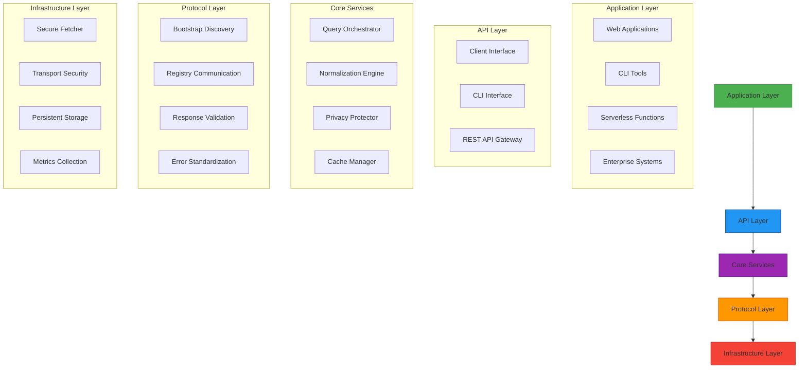
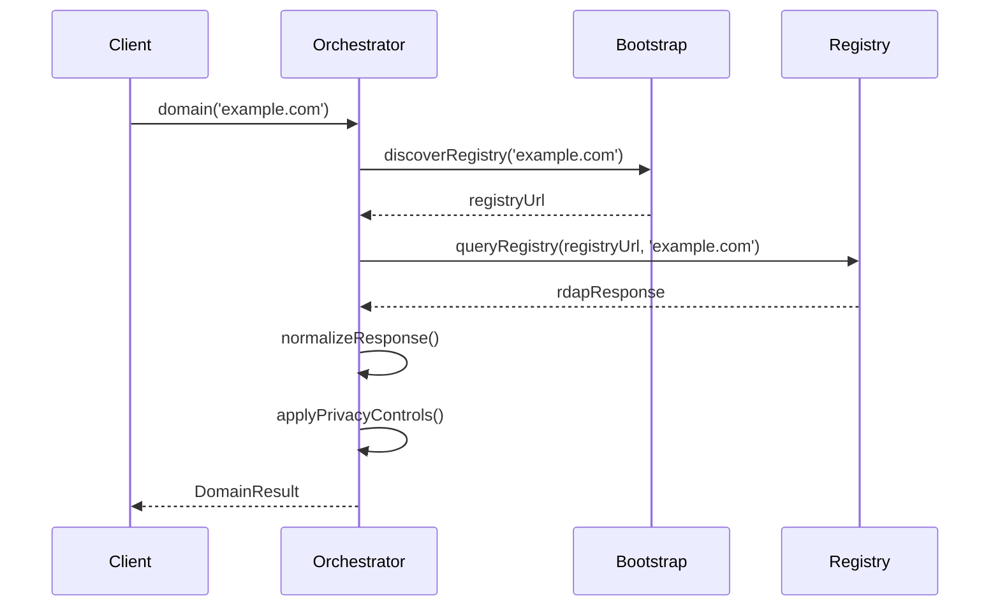
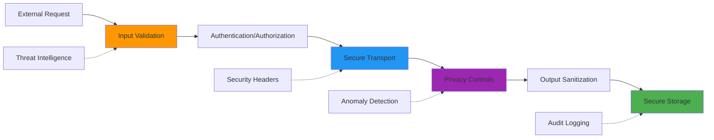
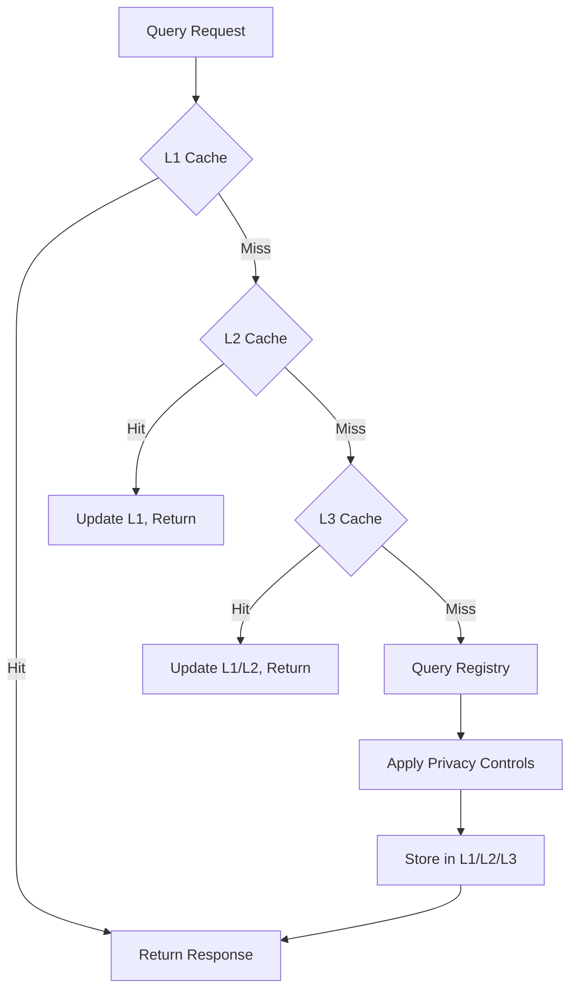
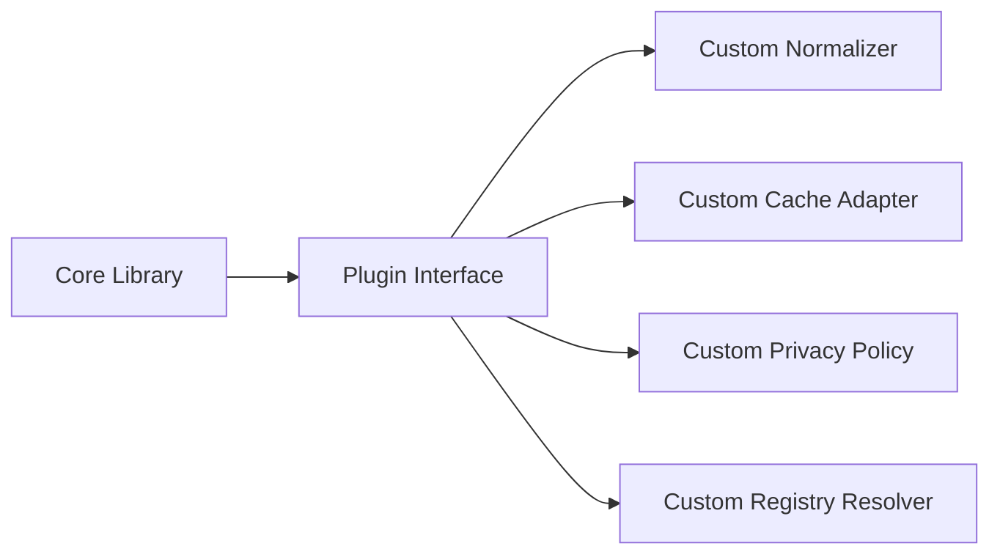
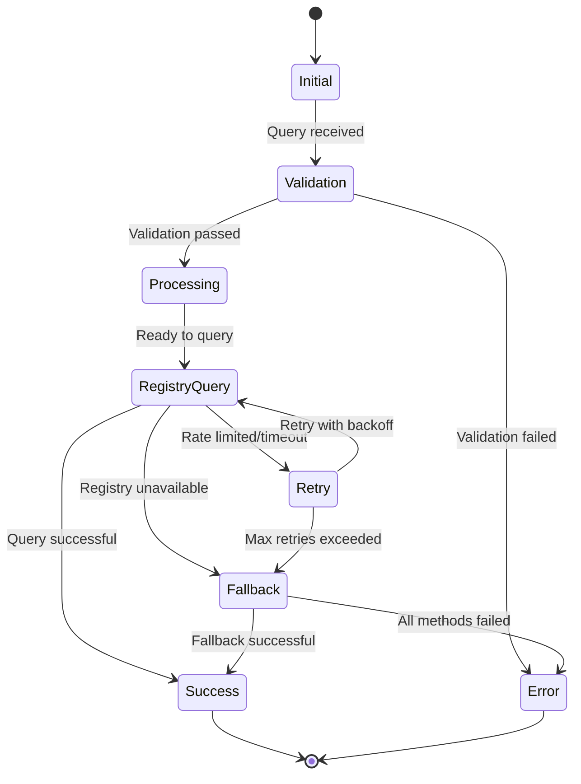

# 🏗️ RDAPify Architecture Overview

> **🎯 Purpose:** Understand the layered architecture, core components, and design principles that make RDAPify secure, performant, and privacy-preserving  
> **📚 Prerequisite:** Basic understanding of [What is RDAP](./what-is-rdap.md) and [RDAP vs WHOIS](./rdap-vs-whois.md)  
> **⏱️ Reading Time:** 12 minutes  
> **🔍 Pro Tip:** This document includes Mermaid diagrams - enable JavaScript in your browser to view them interactively

---

## 🗺️ High-Level Architecture

RDAPify follows a **layered architecture** with strict separation of concerns, enabling independent evolution of components while maintaining security boundaries. The architecture is designed around five core principles:

1. **Privacy by Default**: Personal data is automatically redacted unless explicitly requested
2. **Protocol Integrity**: Strict adherence to RDAP RFC specifications
3. **Defense in Depth**: Multiple security layers protecting against common vulnerabilities
4. **Zero-Trust Networking**: All external interactions are validated and sanitized
5. **Graceful Degradation**: System remains functional under partial failures



---

## 🔧 Core Component Breakdown

### 1. API Layer: Consumer-Facing Interfaces

The API layer provides multiple access points tailored to different use cases:

| Interface | Use Case | Key Features |
|-----------|----------|--------------|
| **RDAPClient** | Programmatic usage | Full feature set, TypeScript support, async/await |
| **CLI** | Command-line operations | Interactive mode, tab completion, formatted output |
| **REST Gateway** | Microservice integration | Rate limiting, authentication, request validation |

**Design Principle:** All interfaces converge on the same core functionality, ensuring consistent behavior across access methods.

```typescript
// Unified API surface example
const client = new RDAPClient(options);
const result = await client.domain('example.com');

// Same core functionality via CLI
rdapify domain example.com --json

// Same core functionality via REST API
GET /api/v1/domain/example.com
```

### 2. Core Services Layer: Business Logic

#### Query Orchestrator
Coordinates the complete query lifecycle:
- Registry discovery via IANA bootstrap
- Query routing to appropriate registry endpoints
- Fallback mechanism management
- Concurrency control and rate limiting



#### Normalization Engine
Transforms registry-specific responses into a consistent data model:
- Converts vCard data to structured JavaScript objects
- Standardizes field names and formats across registries
- Resolves entity relationships and hierarchies
- Handles Unicode normalization and IDN conversions

```typescript
// Before normalization (Verisign RDAP response)
{
  "entities": [{
    "vcardArray": ["vcard", [
      ["fn", {}, "text", "Example Registrar"],
      ["email", {}, "text", "abuse@example.com"]
    ]]
  }]
}

// After normalization (RDAPify standard format)
{
  "registrar": {
    "name": "Example Registrar",
    "email": "abuse@example.com",
    "roles": ["registrar"]
  }
}
```

#### Privacy Protector
Implements GDPR/CCPA-compliant data handling:
- Automatic PII redaction with configurable policies
- Data minimization through field filtering
- Right to erasure implementation
- Consent management integration points

#### Cache Manager
Intelligent caching strategy with multiple layers:
- L1: In-memory cache (application instance)
- L2: Distributed cache (Redis/Memcached)
- L3: Persistent storage (encrypted database)
- Cache invalidation based on TTL and registry change notifications

### 3. Protocol Layer: RDAP Implementation

#### Bootstrap Discovery
Implements RFC 8521 bootstrap process:
- Caches IANA bootstrap data with automatic refresh
- Handles registry failover and fallback strategies
- Supports custom bootstrap endpoints for private registries
- Validates registry certificates against trusted authorities

#### Registry Communication
Secure communication with RDAP servers:
- TLS 1.3+ enforcement with certificate pinning option
- Request signing for registries requiring authentication
- Standardized query parameters and headers
- Response validation against JSON schemas

#### Response Validation
Ensures data integrity and security:
- JSON schema validation against RFC specifications
- SSRF protection via URL validation and IP range blocking
- Malicious content detection in response fields
- Size limits to prevent denial-of-service attacks

### 4. Infrastructure Layer: Foundational Services

#### Secure Fetcher
Enhanced HTTP client with security protections:
- Blocks private IP ranges (RFC 1918, carrier-grade NATs)
- Prevents internal network access attempts
- Enforces TLS security requirements
- Implements circuit breakers for failing endpoints

```typescript
// Secure Fetcher protection example
const fetcher = new SecureFetcher({
  blockPrivateIPs: true,
  blockCloudMetadata: true,
  tlsOptions: {
    minVersion: 'TLSv1.3',
    ciphers: 'HIGH:!aNULL:!kRSA:!PSK:!SRP:!MD5:!RC4'
  }
});

// This request would be blocked
fetcher.get('http://169.254.169.254/latest/meta-data'); // SSRF attempt blocked
```

#### Transport Security
End-to-end security protections:
- Certificate pinning for critical registry endpoints
- HSTS enforcement for all HTTPS connections
- Perfect Forward Secrecy (PFS) support
- Automated certificate rotation and monitoring

#### Persistent Storage
Secure data persistence options:
- AES-256-GCM encryption for cached data
- Field-level encryption for sensitive information
- Automatic data expiration based on retention policies
- Audit logging for all data access operations

---

## 🔐 Security Architecture

RDAPify implements a **defense-in-depth** security model with multiple layers of protection:



### Key Security Patterns

#### 1. Zero-Trust Networking
- All registry endpoints are treated as untrusted
- Every response is validated against schema definitions
- IP address filtering prevents internal network access
- Certificate validation goes beyond standard TLS checks

#### 2. Privacy by Design
- PII redaction occurs at the earliest possible stage
- Data minimization reduces attack surface
- Purpose limitation restricts data usage contexts
- Storage limitation enforces automatic data deletion

#### 3. Secure Defaults
```javascript
// Security-focused default configuration
const client = new RDAPClient({
  // Privacy protections enabled by default
  redactPII: true,
  
  // Security settings
  httpsOptions: {
    minVersion: 'TLSv1.3',
    rejectUnauthorized: true,
    secureProtocol: 'TLSv1_3_method'
  },
  
  // Network protections
  fetcher: new SecureFetcher({
    blockPrivateIPs: true,
    timeout: 10000
  }),
  
  // Caching with protection
  cacheOptions: {
    redactBeforeStore: true,
    maxAge: 3600 // 1 hour
  }
});
```

#### 4. SSRF Prevention
RDAPify implements comprehensive Server-Side Request Forgery protection:
- IP address validation against allowed ranges
- DNS rebinding protection through IP caching
- Protocol enforcement (HTTP/HTTPS only)
- URL structure validation
- Registry endpoint whitelisting option

```typescript
// SSRF protection workflow
function validateUrl(url: string): boolean {
  try {
    const parsed = new URL(url);
    
    // Block non-HTTP protocols
    if (!['http:', 'https:'].includes(parsed.protocol)) return false;
    
    // Resolve and validate IP address
    const ip = dns.lookup(parsed.hostname);
    if (isPrivateIP(ip)) return false;
    
    // Block cloud metadata endpoints
    if (isCloudMetadataEndpoint(parsed.hostname)) return false;
    
    return true;
  } catch (error) {
    return false;
  }
}
```

---

## ⚡ Performance Architecture

### Caching Strategy
RDAPify implements a multi-level caching strategy to optimize performance and reduce registry load:

| Cache Level | Technology | TTL | Use Case | Hit Rate Target |
|-------------|------------|-----|----------|----------------|
| L1: Memory | LRU Cache | 5-60 min | Single instance | 60-70% |
| L2: Redis | Redis Cluster | 1-24 hrs | Distributed | 85-90% |
| L3: Database | Encrypted SQL | 24-72 hrs | Persistent | 95%+ |
| Negative Cache | Memory/Redis | 5-30 min | Failed queries | 50% |



### Resource Management
- Connection pooling for HTTP requests
- Memory pressure awareness with adaptive cache sizing
- Request prioritization for critical vs. background queries
- Backpressure mechanisms to prevent overload

### Offline Mode Architecture
RDAPify supports graceful offline operation:
- Local bootstrap data cache with versioning
- Stale-while-revalidate strategy for cached responses
- Offline-first design for critical operations
- Background synchronization when connectivity resumes

```typescript
const client = new RDAPClient({
  offlineMode: {
    enabled: true,
    maxStaleAge: 86400, // 24 hours
    bootstrapCachePath: './bootstrap-data'
  }
});

// This will use cached bootstrap data if offline
const result = await client.domain('example.com');
```

---

## 🧩 Extensibility Architecture

RDAPify is designed for extension without forking:

### Plugin System


### Adapter Pattern
Each external dependency is isolated behind an adapter interface:

```typescript
interface CacheAdapter {
  get(key: string): Promise<any | null>;
  set(key: string, value: any, ttl?: number): Promise<void>;
  delete(key: string): Promise<boolean>;
  clear(): Promise<void>;
}

// Redis implementation
class RedisAdapter implements CacheAdapter {
  constructor(options: RedisOptions) { /* ... */ }
  // Implementation details
}

// Memory implementation
class MemoryAdapter implements CacheAdapter {
  // Simpler implementation for development
}
```

### Middleware Pipeline
Request/response processing uses a middleware pattern:

```typescript
client.use(async (ctx, next) => {
  console.log(`Starting query for ${ctx.domain}`);
  await next();
  console.log(`Completed query in ${Date.now() - ctx.startTime}ms`);
});

client.use(privacyMiddleware({
  redactionPolicy: 'gdpr-compliant'
}));
```

---

## ⚠️ Error Handling Architecture

RDAPify implements a state machine for error handling:



### Error Classification System
Errors are classified for appropriate handling:

| Category | Examples | Handling Strategy |
|----------|----------|-------------------|
| **Client Errors** | Validation failures, invalid domains | Immediate failure, no retry |
| **Transient Errors** | Timeouts, rate limits | Exponential backoff, retry |
| **Registry Errors** | Service unavailable, invalid responses | Fallback to alternate registry |
| **Security Errors** | SSRF attempts, certificate failures | Immediate failure, audit logging |
| **Data Errors** | Schema validation failures | Quarantine, notification to maintainers |

### Standardized Error Objects
All errors follow a consistent structure:
```typescript
class RDAPError extends Error {
  constructor(
    public code: string,          // Standardized error code
    public message: string,       // Human-readable message
    public details?: any,         // Additional context
    public registryUrl?: string   // Source registry if relevant
  ) {
    super(message);
    this.name = 'RDAPError';
  }
}

// Example usage
throw new RDAPError(
  'RDAP_RATE_LIMITED', 
  'Registry rate limit exceeded',
  { 
    retryAfter: 60,
    limit: 100,
    remaining: 0 
  },
  'https://rdap.verisign.com'
);
```

---

## 📊 Observability Architecture

RDAPify provides comprehensive observability through:

### Metrics Collection
- Query success/failure rates
- Cache hit/miss ratios
- Latency percentiles (P50, P90, P99)
- Registry error distributions
- Resource utilization (memory, connections)

### Logging Strategy
Multi-level logging with contextual information:
```typescript
logger.debug('Bootstrap lookup', {
  domain: 'example.com',
  registryType: 'gtld',
  cacheHit: false
});

logger.error('Registry query failed', {
  domain: 'example.com',
  registry: 'https://rdap.verisign.com',
  errorCode: 'RDAP_TIMEOUT',
  durationMs: 15000
});
```

### Tracing Support
Distributed tracing integration:
- OpenTelemetry-compatible tracing
- End-to-end request correlation IDs
- Performance bottleneck identification
- Integration with Datadog, New Relic, Prometheus

---

## 🔄 Update and Maintenance Architecture

RDAPify is designed for sustainable long-term maintenance:

### Bootstrap Data Updates
- Automated IANA bootstrap data synchronization
- Versioned bootstrap data with rollback capability
- Signature verification for bootstrap integrity
- Fallback to last-known-good bootstrap data

### Dependency Management
- Security-focused dependency update process
- Vulnerability scanning in CI pipeline
- Semantic versioning with compatibility guarantees
- Dependency isolation through adapter patterns

### Configuration Evolution
- Backward-compatible configuration changes
- Deprecation warnings with migration paths
- Runtime configuration reloading
- Environment-aware defaults

---

## 🔮 Future Architecture Evolution

### Planned Enhancements
- **WebAssembly core**: Performance-critical path optimization
- **Federated caching**: Peer-to-peer cache sharing between instances
- **ML-powered anomaly detection**: Identify unusual registration patterns
- **Blockchain verification**: Immutable audit trails for critical domains
- **Zero-knowledge proofs**: Verify domain ownership without revealing PII

### Architectural Trade-offs
| Decision | Trade-off | Rationale |
|----------|-----------|-----------|
| **No central proxy** | Higher client-side complexity | Privacy preservation, no data collection |
| **Strict TLS requirements** | Reduced compatibility with legacy registries | Security first approach |
| **Automatic PII redaction** | Reduced data richness | Compliance with global regulations |
| **In-memory cache by default** | Data loss on restart | Security through ephemeral data storage |
| **No analytics by default** | Limited usage insights | Privacy-respecting defaults |

---

## 📚 Related Documentation

| Document | Description | Path |
|----------|-------------|------|
| **Normalization Pipeline** | Deep dive on data transformation | [./normalization.md](./normalization.md) |
| **Bootstrap Discovery** | Registry discovery mechanics | [./discovery.md](./discovery.md) |
| **Error State Machine** | Detailed error handling flow | [./error-state-machine.md](./error-state-machine.md) |
| **Caching Strategies** | Advanced caching configurations | [../guides/caching-strategies.md](../guides/caching-strategies.md) |
| **Offline Mode** | Disconnected operation patterns | [./offline-mode.md](./offline-mode.md) |
| **Security Whitepaper** | Complete security architecture | [../security/whitepaper.md](../security/whitepaper.md) |

---

## 🏗️ Architecture Decision Records (ADRs)

Key architectural decisions are documented in the [Architecture Decision Records](../../architecture/decision-records.md) with rationale and alternatives considered:

1. [ADR-001: Layered Architecture](../../architecture/decision-records/001-layered-architecture.md)
2. [ADR-002: Privacy by Default](../../architecture/decision-records/002-privacy-by-default.md)
3. [ADR-003: SSRF Prevention Strategy](../../architecture/decision-records/003-ssrf-prevention.md)
4. [ADR-004: Caching Strategy](../../architecture/decision-records/004-caching-strategy.md)
5. [ADR-005: Error Handling Approach](../../architecture/decision-records/005-error-handling.md)

---

> **🔐 Security Reminder:** The architecture prioritizes security and privacy over convenience. While this may require additional configuration for some use cases, it ensures compliance with global regulations and protects end users' personal data. Never disable security features like `redactPII` or SSRF protections without documented legal basis and Data Protection Officer approval.

[← Back to Core Concepts](../core-concepts/README.md) | [Next: Normalization Process →](./normalization.md)

*Document last updated: December 5, 2025*  
*Architecture version: 2.3.0*  
*Security review date: November 28, 2025*