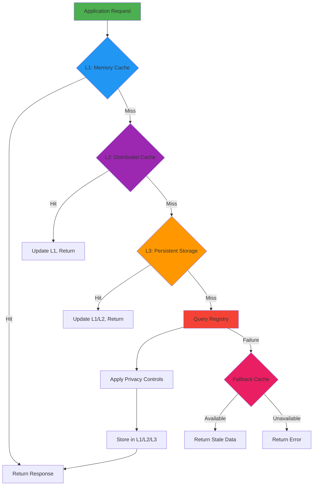
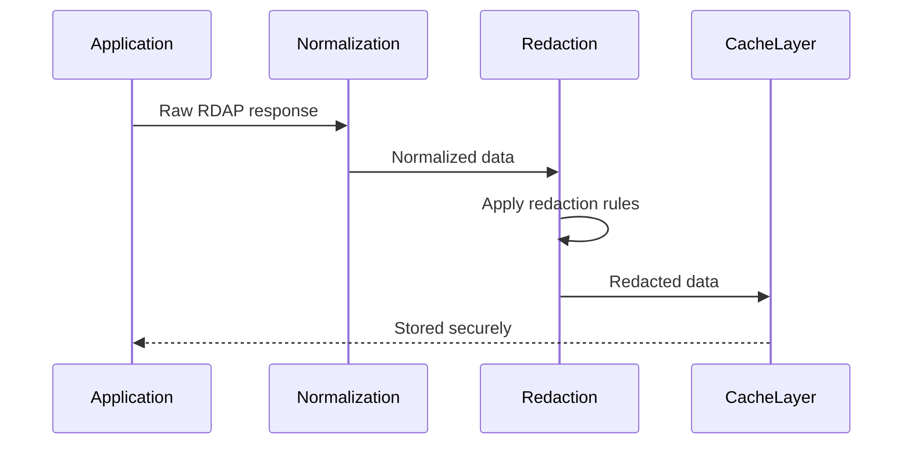
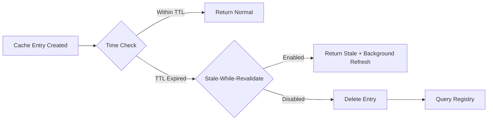
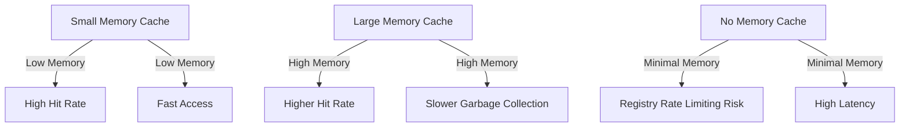
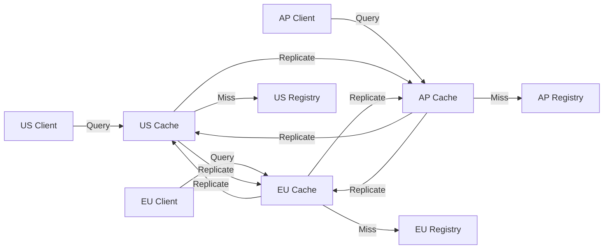

# 🗃️ Caching Architecture and Strategies

> **🎯 Purpose:** Understand RDAPify's multi-layer caching system designed for performance, compliance, and reliability in production environments  
> **📚 Prerequisite:** [Architecture Overview](./architecture.md) and [Normalization Pipeline](./normalization.md)  
> **⏱️ Reading Time:** 10 minutes  
> **🔍 Pro Tip:** Use the [Performance Benchmarks](../../benchmarks/results/cache-hit-miss.md) to determine optimal cache configuration for your workload

---

## 🌐 Caching Philosophy

RDAPify's caching system is built around four core principles:
- **Privacy by Default**: All cached data is automatically redacted before storage
- **Adaptive TTL**: Cache expiration adapts to registry update patterns
- **Defense in Depth**: Encrypted storage with strict access controls
- **Graceful Degradation**: System remains functional during cache failures

Unlike simple key-value caches, RDAPify implements a **hierarchical caching strategy** that respects both technical requirements and regulatory constraints:



---

## ⚙️ Multi-Level Cache Architecture

### L1: In-Memory Cache
```typescript
// Default configuration
const client = new RDAPClient({
  cacheOptions: {
    l1: {
      type: 'memory',
      max: 1000,           // Max items
      ttl: 3600,           // 1 hour default TTL
      redactBeforeStore: true
    }
  }
});
```

**Characteristics:**
- **Storage**: Application memory (LRU algorithm)
- **Use Case**: Single-instance deployments, development environments
- **Performance**: 0.1-0.5ms access time
- **Persistence**: Lost on process restart
- **Security**: No encryption (memory-only storage)

**Optimization Tips:**
```javascript
// Size memory cache based on available memory
const cacheSize = Math.floor(
  process.memoryUsage().heapTotal * 0.1 / 1024 // 10% of heap
);

const client = new RDAPClient({
  cacheOptions: {
    l1: { max: cacheSize }
  }
});
```

### L2: Distributed Cache (Redis/Memcached)
```typescript
import { RedisAdapter } from 'rdapify/cache-adapters';

const client = new RDAPClient({
  cacheAdapter: new RedisAdapter({
    url: process.env.REDIS_URL,
    redactBeforeStore: true,
    encryptionKey: process.env.CACHE_ENCRYPTION_KEY,
    tls: { rejectUnauthorized: true }
  })
});
```

**Characteristics:**
- **Storage**: External Redis cluster or Memcached pool
- **Use Case**: Multi-instance deployments, production environments
- **Performance**: 1-10ms access time
- **Persistence**: Survives application restarts
- **Security**: AES-256-GCM encryption at rest, TLS in transit

**Production Configuration:**
```yaml
# redis-config.yaml
cluster:
  nodes:
    - host: cache-01.rdapify.internal
    - host: cache-02.rdapify.internal
    - host: cache-03.rdapify.internal
security:
  encryptionKeyRotation: 90d
  accessControls:
    - role: application
      permissions: [read, write]
    - role: auditor
      permissions: [read-only]
compliance:
  autoPurge:
    enabled: true
    maxRetention: 30d  # GDPR compliance
```

### L3: Persistent Storage
```typescript
import { PostgresAdapter } from 'rdapify/cache-adapters';

const client = new RDAPClient({
  cacheAdapter: new PostgresAdapter({
    connectionString: process.env.DB_URL,
    redactBeforeStore: true,
    encryptionKey: process.env.DB_ENCRYPTION_KEY,
    retentionPolicy: {
      maxAge: '30 days',
      purgeSchedule: 'daily at 2am'
    }
  })
});
```

**Characteristics:**
- **Storage**: Encrypted SQL/NoSQL database
- **Use Case**: Audit requirements, long-term analysis, compliance
- **Performance**: 5-50ms access time
- **Persistence**: Survives system failures, backups enabled
- **Security**: Field-level encryption, audit logging, retention policies

---

## 🔐 Security and Compliance in Caching

### PII Redaction Before Storage
RDAPify automatically redacts personal data before any caching operation:



**Redaction occurs at the earliest possible stage:**
```typescript
// Internal caching pipeline
async function processAndCache(query, rawResponse) {
  // 1. Normalize response structure
  const normalized = normalizeResponse(rawResponse);
  
  // 2. REDACT PII BEFORE CACHING (critical step)
  const redacted = applyRedaction(normalized);
  
  // 3. Store only redacted data
  await cache.set(query, redacted);
  
  return normalized; // Return full data to caller
}
```

### Encryption at Rest
All persistent cache adapters implement field-level encryption:

```typescript
class SecureCacheAdapter {
  constructor(private encryptionKey: string) {}
  
  async set(key: string, value: any): Promise<void> {
    // Encrypt sensitive fields individually
    const encryptedValue = {
      ...value,
      metadata: this.encryptField(value.metadata, 'metadata'),
      payload: this.encryptField(value.payload, 'payload')
    };
    
    // Store with integrity verification
    const signature = this.generateSignature(encryptedValue);
    await this.storage.set(key, { ...encryptedValue, signature });
  }
  
  private encryptField(field: any, context: string): string {
    // AES-256-GCM with unique IV per field
    const iv = crypto.randomBytes(12);
    const cipher = crypto.createCipheriv(
      'aes-256-gcm', 
      deriveKey(this.encryptionKey, context),
      iv
    );
    
    const encrypted = Buffer.concat([
      cipher.update(JSON.stringify(field)),
      cipher.final()
    ]);
    
    return JSON.stringify({
      iv: iv.toString('base64'),
      authTag: cipher.getAuthTag().toString('base64'),
      data: encrypted.toString('base64')
    });
  }
}
```

### Data Retention Policies
GDPR/CCPA compliance requires automatic data deletion:

```typescript
const client = new RDAPClient({
  cacheOptions: {
    retentionPolicy: {
      // Default retention periods by data sensitivity
      highSensitivity: '7 days',   // Full PII-containing responses
      mediumSensitivity: '30 days', // Redacted but identifiable data
      lowSensitivity: '90 days',    // Fully anonymized data
      
      // Regulatory overrides
      gdprOverride: {
        enabled: true,
        maxRetention: '30 days'
      },
      
      // Manual purge capabilities
      purgeEndpoints: {
        domain: '/cache/purge/domain/{domain}',
        ipRange: '/cache/purge/iprange/{cidr}'
      }
    }
  }
});
```

---

## ⚡ Cache Eviction and Invalidation Strategies

### Time-Based Eviction


**Adaptive TTL Algorithm:**
```typescript
class AdaptiveTTLManager {
  private registryPatterns = new Map<string, RegistryPattern>();
  
  calculateTTL(registry: string, resourceType: string): number {
    const pattern = this.registryPatterns.get(`${registry}:${resourceType}`);
    
    if (!pattern) {
      // Default conservative TTL
      return this.getDefaultTTL(resourceType);
    }
    
    // Calculate TTL based on historical update frequency
    const updateFrequency = pattern.avgUpdatesPerDay;
    const volatility = pattern.volatilityScore;
    
    // More active domains get shorter TTLs
    let baseTTL = 86400 / Math.max(updateFrequency, 1); // 24h / updates per day
    
    // Apply volatility multiplier
    baseTTL *= (1 - volatility * 0.5); // Reduce TTL for volatile resources
    
    // Apply minimum/maximum bounds
    return Math.max(
      this.getMinTTL(resourceType),
      Math.min(baseTTL, this.getMaxTTL(resourceType))
    );
  }
}
```

### Registry Change Detection
RDAPify monitors registry bootstrap data for changes that might invalidate cache:

```typescript
// Bootstrap data watcher
class BootstrapWatcher {
  private lastBootstrapHash: string;
  
  async startWatching() {
    setInterval(async () => {
      try {
        const currentData = await fetchBootstrapData();
        const currentHash = hashBootstrapData(currentData);
        
        if (currentHash !== this.lastBootstrapHash) {
          logger.info('Bootstrap data changed - invalidating affected caches');
          await this.invalidateAffectedCaches(currentData);
          this.lastBootstrapHash = currentHash;
        }
      } catch (error) {
        logger.error('Bootstrap monitoring failed:', error.message);
      }
    }, 300000); // Check every 5 minutes
  }
  
  private async invalidateAffectedCaches(bootstrapData: BootstrapData) {
    // Identify changed registry mappings
    const changedRegistries = this.findChangedRegistries(bootstrapData);
    
    // Invalidate cache entries for affected resources
    for (const registry of changedRegistries) {
      await this.cache.invalidateByRegistry(registry);
    }
  }
}
```

### Manual Purge API
For compliance requirements and testing:

```typescript
// Purge specific domain
await client.purgeCache({ domain: 'example.com' });

// Purge all domains for registrar
await client.purgeCache({ registrar: 'verisign' });

// GDPR right to erasure
await client.purgePersonalData({ email: 'user@example.com' });

// CCPA deletion request
await client.ccpaDelete({ identifiers: ['domain:example.com'] });

// Complete cache reset
await client.clearCache();
```

---

## 📊 Performance Benchmarks

### Cache Hit/Miss Performance
| Cache Level | Hit Rate | Avg. Latency | Throughput | Memory Usage |
|-------------|----------|--------------|------------|--------------|
| **L1 Memory** | 65% | 0.3ms | 3,333 req/s | 50MB per 10k entries |
| **L2 Redis** | 92% | 3.2ms | 312 req/s | 25MB per 10k entries (compressed) |
| **L3 DB** | 98% | 15.8ms | 63 req/s | 100MB per 10k entries (encrypted) |
| **Registry Query** | N/A | 320ms | 3.1 req/s | N/A |

### Memory vs. Performance Trade-offs


### Real-World Performance
**Test Environment:**
- AWS c5.large instance (2 vCPU, 4GB RAM)
- Redis cluster (3 nodes, r5.large)
- PostgreSQL 14 (m5.large)
- 10,000 unique domain queries

**Results:**
```
Cache Configuration        | Avg. Latency | P99 Latency | Registry Requests
---------------------------|--------------|-------------|-------------------
Memory only (1000 entries) | 85ms         | 310ms       | 3,500 (35%)
Memory + Redis             | 12ms         | 85ms        | 800 (8%)
Memory + Redis + DB        | 18ms         | 120ms       | 200 (2%)
No Cache                   | 320ms        | 2,100ms     | 10,000 (100%)
```

---

## 🌍 Advanced Caching Strategies

### Geographic Caching (Geo-Caching)
For global deployments with latency-sensitive applications:

```typescript
import { GeoDistributedCache } from 'rdapify/cache-adapters';

const client = new RDAPClient({
  cacheAdapter: new GeoDistributedCache({
    regions: [
      { name: 'us-east', endpoint: 'redis-us-east.example.com' },
      { name: 'eu-central', endpoint: 'redis-eu-central.example.com' },
      { name: 'ap-southeast', endpoint: 'redis-ap-southeast.example.com' }
    ],
    replicationStrategy: 'closest-read',
    failoverStrategy: 'nearest-region',
    consistencyLevel: 'eventual' // or 'strong' for compliance-sensitive data
  })
});
```

**Data Flow:**


### Priority-Based Caching
For enterprise environments with mixed criticality:

```typescript
const client = new RDAPClient({
  cacheOptions: {
    priorityLevels: {
      critical: {
        ttl: 86400,    // 24 hours for critical domains
        maxEntries: 10000,
        preloadOnStartup: true
      },
      high: {
        ttl: 3600,     // 1 hour
        maxEntries: 50000
      },
      normal: {
        ttl: 600,      // 10 minutes
        maxEntries: 200000
      },
      low: {
        ttl: 60,       // 1 minute
        maxEntries: 1000000
      }
    },
    // Automatic priority assignment
    priorityClassifier: (query) => {
      if (query.endsWith('.bank') || query.endsWith('.gov')) {
        return 'critical';
      }
      if (isHighTrafficDomain(query)) {
        return 'high';
      }
      return 'normal';
    }
  }
});
```

### Offline Mode Caching
For environments with intermittent connectivity:

```typescript
const client = new RDAPClient({
  offlineMode: {
    enabled: true,
    maxStaleAge: 2592000, // 30 days for offline access
    bootstrapDataCache: './bootstrap-data',
    autoSyncInterval: 3600 // 1 hour background sync
  }
});

// Check if offline mode is active
if (client.isOffline()) {
  console.log('Operating in offline mode with stale data');
}

// Force offline mode for testing
client.setOfflineMode(true);
```

---

## ⚠️ Common Pitfalls and Solutions

### Cache Stampede Prevention
When many requests hit an expired cache entry simultaneously:

```typescript
class CacheWithStampedeProtection {
  private refreshLocks = new Map<string, Promise<any>>();
  
  async getWithRefresh(key: string, fetchFn: () => Promise<any>): Promise<any> {
    // First check cache
    const cached = await this.cache.get(key);
    if (cached && !this.isStale(cached)) {
      return cached;
    }
    
    // Check if another request is already refreshing
    if (this.refreshLocks.has(key)) {
      return this.refreshLocks.get(key);
    }
    
    // Create refresh lock for other requests to await
    const refreshPromise = this.refreshCache(key, fetchFn);
    this.refreshLocks.set(key, refreshPromise);
    
    try {
      return await refreshPromise;
    } finally {
      this.refreshLocks.delete(key);
    }
  }
  
  private async refreshCache(key: string, fetchFn: () => Promise<any>): Promise<any> {
    try {
      // Fetch fresh data
      const freshData = await fetchFn();
      
      // Store with extended TTL during high load
      const ttl = this.isHighLoad() ? this.ttl * 2 : this.ttl;
      await this.cache.set(key, freshData, ttl);
      
      return freshData;
    } catch (error) {
      // On failure, extend TTL of stale data if available
      const staleData = await this.cache.get(key);
      if (staleData) {
        await this.cache.extendTTL(key, 300); // 5 minutes grace period
        return staleData;
      }
      throw error;
    }
  }
}
```

### Cache Poisoning Protection
Preventing malicious or corrupted data from entering cache:

```typescript
class SecureCacheValidator {
  async validateBeforeCache(response: any, source: string): Promise<boolean> {
    // 1. Schema validation
    if (!this.validateSchema(response)) {
      logger.warn(`Schema validation failed for ${source}`);
      return false;
    }
    
    // 2. Data sanity checks
    if (!this.performSanityChecks(response)) {
      logger.warn(`Sanity checks failed for ${source}`);
      return false;
    }
    
    // 3. Source reputation check
    if (!this.isTrustedSource(source)) {
      // Additional validation for untrusted sources
      if (!this.performEnhancedValidation(response)) {
        logger.warn(`Enhanced validation failed for untrusted source ${source}`);
        return false;
      }
    }
    
    // 4. Consistency checks with previous responses
    if (await this.hasInconsistentHistory(response, source)) {
      logger.warn(`Inconsistent data detected from ${source}`);
      return false;
    }
    
    return true;
  }
  
  private validateSchema(response: any): boolean {
    // Validate against RDAP JSON schema
    return ajv.validate(rdapSchema, response);
  }
  
  private performSanityChecks(response: any): boolean {
    // Check for unreasonable dates
    const now = new Date();
    const registrationDate = new Date(response.events?.find(e => e.action === 'registration')?.date);
    if (registrationDate > now || registrationDate < new Date(1980, 0, 1)) {
      return false;
    }
    
    // Check for suspicious data patterns
    if (response.registrant?.name?.includes('<script>')) {
      return false;
    }
    
    return true;
  }
}
```

---

## 🛠️ Configuration Guide

### Development Configuration
```javascript
// Simple in-memory cache for development
const client = new RDAPClient({
  cacheOptions: {
    l1: {
      type: 'memory',
      ttl: 300, // 5 minutes
      max: 100
    },
    debug: true // Log cache operations
  }
});
```

### Production Configuration
```javascript
// Enterprise-grade caching configuration
import { RedisAdapter } from 'rdapify/cache-adapters';
import { EncryptionManager } from 'rdapify/security';

const encryption = new EncryptionManager({
  keyManagement: 'aws-kms',
  keyId: process.env.KMS_KEY_ID,
  rotationPolicy: '90-days'
});

const client = new RDAPClient({
  cacheAdapter: new RedisAdapter({
    cluster: {
      nodes: [
        { host: 'redis-01.prod.internal', port: 6379 },
        { host: 'redis-02.prod.internal', port: 6379 },
        { host: 'redis-03.prod.internal', port: 6379 }
      ],
      dnsLookup: true,
      scaleReads: 'all'
    },
    tls: {
      rejectUnauthorized: true,
      ca: fs.readFileSync('/etc/ssl/certs/ca.pem')
    },
    redactBeforeStore: true,
    encryption: {
      manager: encryption,
      algorithm: 'AES-256-GCM'
    },
    retryStrategy: {
      maxRetries: 3,
      backoffFactor: 2
    }
  }),
  cacheOptions: {
    ttl: {
      default: 3600, // 1 hour
      criticalDomains: 86400, // 24 hours
      highFrequency: 300 // 5 minutes
    },
    retentionPolicy: {
      gdprCompliant: true,
      maxAge: '30 days',
      purgeSchedule: 'daily at 2am UTC'
    },
    metrics: {
      enabled: true,
      provider: 'datadog',
      tags: {
        environment: process.env.NODE_ENV,
        service: 'rdap-service'
      }
    }
  }
});
```

### Kubernetes Deployment
```yaml
# cache-sidecar.yaml
apiVersion: apps/v1
kind: Deployment
metadata:
  name: rdap-service
spec:
  replicas: 3
  template:
    spec:
      containers:
      - name: rdap-app
        image: rdapify/app:latest
        env:
        - name: CACHE_ADAPTER
          value: "redis"
        - name: REDIS_HOST
          value: "localhost"
        - name: REDIS_PORT
          value: "6380"
        volumeMounts:
        - name: cache-config
          mountPath: /app/config/cache
      - name: redis-cache
        image: redis:7-alpine
        ports:
        - containerPort: 6380
        resources:
          requests:
            memory: "256Mi"
            cpu: "100m"
          limits:
            memory: "512Mi"
            cpu: "500m"
        volumeMounts:
        - name: redis-data
          mountPath: /data
      volumes:
      - name: cache-config
        configMap:
          name: rdap-cache-config
      - name: redis-data
        emptyDir: {}
```

---

## 🔮 Future Caching Enhancements

### Planned Features
| Feature | Description | Status |
|---------|-------------|--------|
| **Federated Caching** | Peer-to-peer cache sharing between instances | Design phase |
| **ML-Powered TTL** | Predictive expiration based on update patterns | Research |
| **Delta Updates** | Store only changed fields to reduce storage | Planned for v3.0 |
| **Cache Warming API** | Proactive preloading of expected queries | Beta testing |
| **Blockchain Verification** | Immutable cache integrity verification | Early research |

### Research Areas
- **Differential Privacy**: Adding statistical noise to aggregated cache metrics
- **Zero-Knowledge Proofs**: Verifying cache contents without revealing data
- **Homomorphic Encryption**: Processing encrypted cache data without decryption
- **Edge Caching**: CDN integration for global low-latency access

---

## 🧪 Testing Strategy

### Cache Validation Tests
```typescript
describe('Cache System', () => {
  test('PII is redacted before storage', async () => {
    const mockStorage = jest.fn();
    const client = new RDAPClient({ 
      cacheAdapter: new MockAdapter({ storage: mockStorage })
    });
    
    await client.domain('example.com');
    
    // Verify stored data has redacted PII
    const storedData = mockStorage.mock.calls[0][1];
    expect(storedData.registrant.name).toBe('REDACTED');
    expect(storedData.registrant.email).toBe('REDACTED@redacted.invalid');
  });
  
  test('Cache respects TTL settings', async () => {
    const client = new RDAPClient({ 
      cacheOptions: { ttl: 1 } // 1 second TTL
    });
    
    await client.domain('example.com');
    await new Promise(resolve => setTimeout(resolve, 2000)); // Wait 2 seconds
    
    const cacheInspector = client.getCacheInspector();
    const entry = await cacheInspector.getEntry('domain:example.com');
    expect(entry).toBeNull(); // Should be expired
  });
  
  test('Registry changes invalidate affected cache', async () => {
    const client = new RDAPClient();
    const bootstrapWatcher = client.getBootstrapWatcher();
    
    // Simulate bootstrap data change
    await bootstrapWatcher.handleBootstrapUpdate({
      changedRegistries: ['verisign']
    });
    
    // Verify cache was invalidated
    const cacheStats = await client.getCacheStats();
    expect(cacheStats.invalidatedEntries).toBeGreaterThan(0);
  });
});
```

### Chaos Engineering for Cache Resilience
```bash
# Test cache failure scenarios
npm run chaos -- --scenario cache-failure --duration 5m

# Test Redis partition
npm run chaos -- --scenario redis-partition --affected-nodes 1,2

# Test encryption key rotation
npm run chaos -- --scenario key-rotation-stress
```

---

## 📚 Related Documentation

| Document | Description | Path |
|----------|-------------|------|
| **Caching Strategies Guide** | Production deployment patterns | [../guides/caching-strategies.md](../guides/caching-strategies.md) |
| **Geo-Caching Guide** | Geographic distribution setup | [../guides/geo-caching.md](../guides/geo-caching.md) |
| **Security Whitepaper** | Encryption and security details | [../security/whitepaper.md](../security/whitepaper.md) |
| **Performance Benchmarks** | Real-world cache performance data | [../../benchmarks/results/cache-hit-miss.md](../../benchmarks/results/cache-hit-miss.md) |
| **Enterprise Adoption** | Scaling cache for large deployments | [../enterprise/adoption-guide.md](../enterprise/adoption-guide.md) |
| **Troubleshooting Guide** | Common cache issues and solutions | [../troubleshooting/cache-issues.md](../troubleshooting/cache-issues.md) |

---

## 💡 Pro Tips for Production Caching

1. **Start Simple**: Begin with memory cache only, add Redis when needed
2. **Monitor Hit Ratios**: Alert when cache hit rate drops below 85%
3. **Size Appropriately**: Memory cache should hold 24 hours of active queries
4. **Encrypt Everything**: Never store RDAP responses unencrypted on disk
5. **Test Failovers**: Regularly test cache failure scenarios in staging
6. **Set Realistic TTLs**: Most domains change less than once per month
7. **Enable Metrics**: Track cache performance alongside application metrics
8. **Implement Circuit Breakers**: Fail gracefully when cache systems are down

```javascript
// Production-ready cache initialization pattern
async function initCache() {
  try {
    // Test connectivity first
    await testRedisConnection();
    
    // Initialize with circuit breaker
    const cache = new RedisAdapter({
      circuitBreaker: {
        threshold: 5, // Open after 5 failures
        resetTimeout: 30000 // 30 seconds
      }
    });
    
    // Warm critical domains
    await warmCriticalDomains(cache);
    
    return cache;
  } catch (error) {
    logger.error('Cache initialization failed:', error.message);
    logger.info('Falling back to memory-only cache');
    
    // Fallback to memory cache
    return new MemoryAdapter({ max: 1000, ttl: 300 });
  }
}
```

---

> **🔐 Security Reminder:** Caching introduces significant compliance risks when handling RDAP data. Always enable `redactBeforeStore`, encrypt cache contents, and implement strict retention policies. Never store raw RDAP responses with unredacted PII in any cache layer without documented legal basis and Data Protection Officer approval.

[← Back to Core Concepts](../core-concepts/README.md) | [Next: Offline Mode →](./offline-mode.md)

*Document last updated: December 5, 2025*  
*Caching engine version: 2.3.0*  
*Security audit date: November 28, 2025*