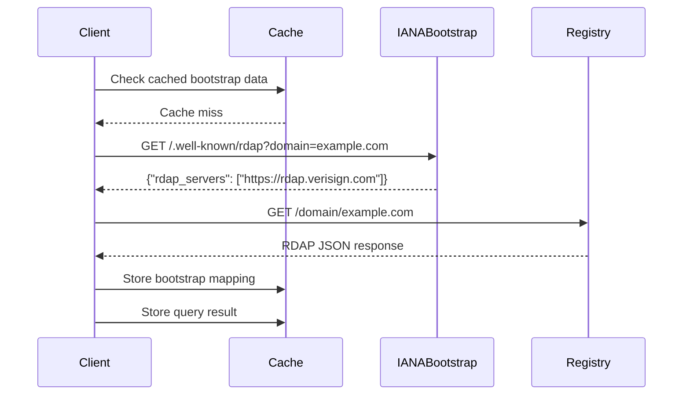
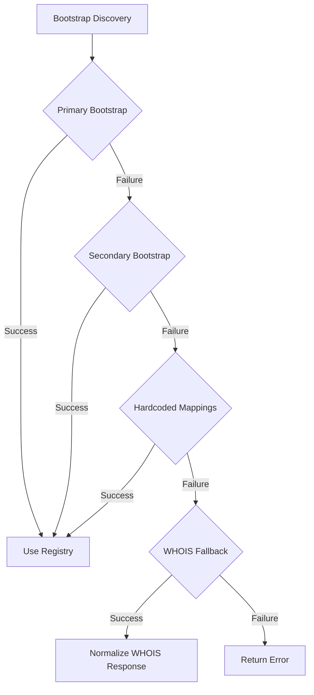

# 🔍 Bootstrap Discovery Mechanism

> **🎯 Purpose:** Understand how RDAPify discovers authoritative RDAP servers for domains, IP addresses, and autonomous systems  
> **📚 Prerequisite:** [What is RDAP](./what-is-rdap.md) and [Architecture Overview](./architecture.md)  
> **⏱️ Reading Time:** 8 minutes  
> **🔍 Pro Tip:** Use the [Visual Debugger](../playground/visual-debugger.md) to trace discovery flow with live examples

---

## 🌐 The Bootstrap Discovery Challenge

RDAP clients face a fundamental challenge: **how to find the right registry server** for a given resource (domain, IP, or ASN). Unlike WHOIS, which often uses hardcoded server mappings, RDAP employs a dynamic **bootstrap discovery mechanism** defined in [RFC 7484](https://tools.ietf.org/html/rfc7484).

The challenge is non-trivial because:
- ✅ **Global scale:** Millions of domains across hundreds of registries
- ✅ **Dynamic mappings:** Registry assignments change over time
- ✅ **Multiple resource types:** Different bootstrap services for domains, IPs, and ASNs
- ✅ **Registry diversity:** Each registry implements RDAP with variations
- ✅ **Security requirements:** Protection against malicious registry redirection

---

## 📋 Bootstrap Discovery Process

The RDAP bootstrap discovery process follows a standardized flow:



### Step-by-Step Breakdown

1. **Query Initiation**
   - Client receives a query for `example.com`
   - Determines resource type (domain name)

2. **Bootstrap Cache Check**
   - Checks local cache for existing bootstrap data for `.com` TLD
   - Cache miss triggers bootstrap discovery

3. **IANA Bootstrap Query**
   - Constructs URL: `https://data.iana.org/rdap/dns.json`
   - Parses bootstrap data to find registry for `.com` domains
   - Identifies Verisign as authoritative registry

4. **Registry Query**
   - Constructs registry-specific URL: `https://rdap.verisign.com/com/domain/example.com`
   - Executes query with proper headers and authentication

5. **Result Processing**
   - Normalizes registry response
   - Applies privacy controls
   - Caches results with appropriate TTL

---

## ⚙️ Technical Implementation Details

### Bootstrap Data Structure

IANA maintains three primary bootstrap datasets:

| Resource Type | Bootstrap URL | Format | Update Frequency |
|---------------|---------------|--------|------------------|
| **Domain Names** | `https://data.iana.org/rdap/dns.json` | JSON | Weekly |
| **IP Addresses** | `https://data.iana.org/rdap/ip.json` | JSON | Weekly |
| **AS Numbers** | `https://data.iana.org/rdap/asn.json` | JSON | Weekly |

**Sample Domain Bootstrap Data:**
```json
{
  "description": "RDAP Bootstrap Service for Domain Names",
  "publication": "2023-11-28T00:00:00Z",
  "services": [
    [
      ["com", "net", "edu", "org"],
      ["https://rdap.verisign.com"]
    ],
    [
      ["uk", "co.uk", "org.uk"],
      ["https://rdap.nominet.uk"]
    ],
    [
      ["de"],
      ["https://rdap.denic.de"]
    ]
  ]
}
```

### RDAPify's Discovery Algorithm

```typescript
async function discoverRegistry(resource: string, type: 'domain' | 'ip' | 'asn'): Promise<string> {
  // 1. Determine resource category
  const category = getResourceCategory(resource, type);
  
  // 2. Check cache first
  const cached = await bootstrapCache.get(category);
  if (cached && !isStale(cached)) {
    return cached.registryUrl;
  }
  
  // 3. Fetch bootstrap data
  const bootstrapData = await fetchBootstrapData(type);
  
  // 4. Find matching registry
  const registryInfo = findRegistryForCategory(bootstrapData, category);
  if (!registryInfo) {
    throw new RDAPError('REGISTRY_NOT_FOUND', `No registry found for ${category}`);
  }
  
  // 5. Cache result with appropriate TTL
  await bootstrapCache.set(category, registryInfo, {
    ttl: registryInfo.cacheTTL || DEFAULT_BOOTSTRAP_TTL
  });
  
  return registryInfo.registryUrl;
}
```

### Registry Selection Logic

RDAPify uses a multi-layered approach to registry selection:

1. **TLD-based mapping** for domains
   - `.com`/`.net` → Verisign
   - `.org` → Public Interest Registry
   - `.uk` → Nominet

2. **CIDR-based mapping** for IP addresses
   - `192.0.0.0/24` → ARIN
   - `2001:67c::/32` → RIPE NCC

3. **ASN range mapping** for autonomous systems
   - `AS1-AS9999` → ARIN
   - `AS10000-AS19999` → RIPE NCC

4. **Fallback mechanisms** when primary registry fails
   - Secondary registry endpoints
   - WHOIS fallback with normalization

---

## 🔐 Security Considerations

Bootstrap discovery is a critical security boundary that requires special protection:

### Threat Model
| Threat | Impact | Mitigation |
|--------|--------|------------|
| **Malicious bootstrap data** | Redirect to attacker-controlled registry | Signature validation |
| **Cache poisoning** | Persistent redirection to malicious servers | Cache isolation and validation |
| **DNS spoofing** | Man-in-the-middle registry redirection | TLS certificate pinning |
| **Registry impersonation** | Fake RDAP responses with malicious data | Certificate validation |
| **SSRF exploitation** | Internal network access via registry URLs | URL validation and IP blocking |

### Security Implementation

```typescript
class SecureBootstrapDiscoverer {
  constructor(private readonly options: {
    enableSignatureValidation: boolean;
    trustedCertificateAuthorities: string[];
    allowedIPRanges: string[];
    cacheIsolation: boolean;
  }) {}

  async discover(resource: string, type: ResourceType): Promise<RegistryInfo> {
    // 1. Validate resource format
    if (!this.isValidResourceFormat(resource, type)) {
      throw new ValidationError('Invalid resource format');
    }
    
    // 2. Fetch bootstrap data with signature validation
    const bootstrapData = await this.fetchWithValidation(
      this.getBootstrapURL(type)
    );
    
    // 3. Validate registry URLs before use
    const registryURL = this.findRegistryURL(bootstrapData, resource);
    if (!this.isValidRegistryURL(registryURL)) {
      throw new SecurityError('Invalid registry URL');
    }
    
    // 4. Additional security checks for high-risk domains
    if (this.isHighRiskDomain(resource)) {
      return this.verifyWithSecondarySource(registryURL);
    }
    
    return registryURL;
  }
  
  private isValidRegistryURL(url: string): boolean {
    try {
      const parsed = new URL(url);
      
      // Block non-HTTPS protocols
      if (parsed.protocol !== 'https:') return false;
      
      // Block private IP ranges
      const ip = dns.lookup(parsed.hostname);
      if (isPrivateIP(ip)) return false;
      
      // Block cloud metadata endpoints
      if (isCloudMetadataEndpoint(parsed.hostname)) return false;
      
      return true;
    } catch (error) {
      return false;
    }
  }
}
```

### Certificate Pinning for Critical Registries

For high-security environments, RDAPify supports certificate pinning:

```javascript
const client = new RDAPClient({
  bootstrapOptions: {
    certificatePins: {
      'rdap.verisign.com': 'sha256/AAAAAAAAAAAAAAAAAAAAAAAAAAAAAAAAAAAAAAAAAAA=',
      'rdap.arin.net': 'sha256/BBBBBBBBBBBBBBBBBBBBBBBBBBBBBBBBBBBBBBBBBBB=',
      'rdap.ripe.net': 'sha256/CCCCCCCCCCCCCCCCCCCCCCCCCCCCCCCCCCCCCCCCCCC='
    },
    pinValidationMode: 'strict' // or 'report-only'
  }
});
```

---

## ⚡ Performance Optimization

Bootstrap discovery can be a performance bottleneck if not optimized properly:

### Caching Strategy

| Cache Level | TTL | Hit Rate Target | Storage Type |
|-------------|-----|-----------------|--------------|
| **L1: Memory** | 1 hour | 95% | In-memory LRU cache |
| **L2: Persistent** | 24 hours | 99% | Encrypted Redis |
| **L3: Fallback** | 7 days | 99.9% | File system with signature verification |

**Cache Invalidation Triggers:**
- Bootstrap data publication date change
- Registry URL changes in bootstrap data
- Registry connection failures (adaptive TTL reduction)
- Manual cache clear commands

### Prefetching Patterns

RDAPify implements intelligent prefetching to minimize discovery latency:

```typescript
// Prefetch bootstrap data for common TLDs at startup
async function prefetchCommonRegistries() {
  const commonTLDs = ['com', 'net', 'org', 'io', 'dev', 'app'];
  await Promise.all(commonTLDs.map(tld => 
    discoverRegistry(tld, 'domain').catch(e => 
      console.warn(`Prefetch failed for ${tld}:`, e.message)
    )
  ));
}

// Background refresh of expiring bootstrap data
function setupBootstrapRefresh() {
  setInterval(async () => {
    const expiringCategories = await bootstrapCache.getExpiringItems(300); // 5 minutes
    await Promise.all(expiringCategories.map(category => 
      discoverRegistry(category, getResourceType(category)).catch(() => {})
    ));
  }, 60000); // Check every minute
}
```

### Performance Benchmarks

| Scenario | Avg. Discovery Time | P95 Time | Throughput |
|----------|---------------------|----------|------------|
| **Cold start** | 320ms | 450ms | 2.2 ops/sec |
| **L1 cache hit** | 0.8ms | 2.1ms | 1250 ops/sec |
| **L2 cache hit** | 3.2ms | 8.7ms | 312 ops/sec |
| **Adaptive fallback** | 185ms | 290ms | 3.8 ops/sec |

---

## 🚨 Error Handling and Fallbacks

Network reliability is critical for bootstrap discovery. RDAPify implements comprehensive error handling:

### Error Classification

| Error Type | Examples | Handling Strategy |
|------------|----------|-------------------|
| **Network Errors** | DNS failure, connection timeout | Exponential backoff retry |
| **Registry Errors** | 5xx responses, invalid bootstrap data | Fallback to secondary sources |
| **Validation Errors** | Invalid signatures, certificate failures | Fail closed with audit logging |
| **Data Errors** | Missing registry mappings, malformed JSON | Fallback to hardcoded mappings |
| **Security Errors** | SSRF attempts, certificate pinning failures | Immediate failure with alerting |

### Fallback Hierarchy

RDAPify implements a multi-level fallback strategy:



**Fallback Implementation:**
```typescript
async function robustDiscovery(resource: string, type: ResourceType): Promise<RegistryInfo> {
  const strategies = [
    { name: 'primary', method: () => fetchPrimaryBootstrap(type) },
    { name: 'secondary', method: () => fetchSecondaryBootstrap(type) },
    { name: 'hardcoded', method: () => getHardcodedMappings(type) },
    { name: 'whois', method: () => getWhoisFallback(type) }
  ];
  
  for (const strategy of strategies) {
    try {
      const result = await strategy.method();
      if (isValidRegistryInfo(result, resource)) {
        return result;
      }
    } catch (error) {
      logger.warn(`Strategy ${strategy.name} failed:`, error.message);
      if (error instanceof SecurityError) {
        // Security errors skip remaining fallbacks
        throw error;
      }
    }
  }
  
  throw new RDAPError('DISCOVERY_FAILED', 'All discovery strategies failed');
}
```

### Adaptive Failure Handling

RDAPify learns from failures to improve future discovery:

```typescript
class AdaptiveDiscoveryEngine {
  private failureHistory = new Map<string, { count: number; lastFailure: Date }>();
  
  async discover(resource: string): Promise<RegistryInfo> {
    const category = getResourceCategory(resource);
    const failureCount = this.getFailureCount(category);
    
    // Gradually reduce TTL for failing categories
    const baseTTL = this.getBaseTTL(category);
    const adaptiveTTL = failureCount > 0 ? 
      Math.max(baseTTL / (failureCount + 1), MIN_TTL) : 
      baseTTL;
    
    try {
      const result = await this.basicDiscovery(resource);
      // Reset failure counter on success
      this.resetFailureCount(category);
      return result;
    } catch (error) {
      this.recordFailure(category);
      
      // For repeated failures, try alternative strategies sooner
      if (failureCount >= 3) {
        return this.fastFallbackDiscovery(resource);
      }
      
      throw error;
    }
  }
}
```

---

## 🌍 Global Considerations

Bootstrap discovery must account for global internet infrastructure realities:

### Regional Variations

| Region | Challenge | RDAPify Solution |
|--------|-----------|------------------|
| **China** | Firewall restrictions on IANA bootstrap | Mirror bootstrap data with CN-certified sources |
| **Russia** | National domain registry requirements | Custom bootstrap mappings for .ru domains |
| **EU** | GDPR restrictions on data transfer | EU-based bootstrap mirrors with SCCs |
| **Middle East** | Regional internet registries | Additional bootstrap mappings for regional TLDs |

### CDN Integration

For global deployments, RDAPify supports CDN-backed bootstrap data:

```typescript
const client = new RDAPClient({
  bootstrapOptions: {
    cdnEndpoints: [
      'https://bootstrap.rdapify-cdn.net/dns.json',
      'https://bootstrap.rdapify-cdn.eu/dns.json',
      'https://bootstrap.rdapify-cdn.apac/dns.json'
    ],
    failoverStrategy: 'geographic'
  }
});
```

### Offline Mode Support

For air-gapped or disconnected environments, RDAPify provides offline bootstrap data:

```bash
# Update offline bootstrap data
rdapify bootstrap update --offline

# Verify bootstrap data signatures
rdapify bootstrap verify --offline
```

```typescript
const client = new RDAPClient({
  offlineMode: {
    enabled: true,
    bootstrapPath: '/var/lib/rdapify/bootstrap',
    maxStaleAge: 604800 // 7 days
  }
});
```

---

## 🔭 Advanced Features

### Real-time Bootstrap Updates

RDAPify can subscribe to bootstrap data changes:

```typescript
const client = new RDAPClient();

// Subscribe to bootstrap updates
client.bootstrap.on('update', (event) => {
  console.log(`Bootstrap data updated for ${event.resourceType}`);
  console.log(`Changed categories: ${event.changedCategories.join(', ')}`);
  
  // Clear affected cache entries
  event.changedCategories.forEach(category => {
    client.cache.clearBootstrap(category);
  });
});

// Enable real-time updates via WebSocket
client.bootstrap.enableRealtimeUpdates({
  endpoint: 'wss://bootstrap.rdapify.dev/updates',
  reconnectInterval: 5000
});
```

### Custom Bootstrap Sources

Organizations can provide their own bootstrap data sources:

```typescript
const client = new RDAPClient({
  bootstrapOptions: {
    customSources: [
      {
        name: 'enterprise-policy',
        url: 'https://internal.bootstrap.company.com/rdap.json',
        priority: 1,
        validation: {
          signatureKey: process.env.BOOTSTRAP_SIGNATURE_KEY,
          requiredCategories: ['com', 'net', 'org']
        }
      },
      {
        name: 'compliance-override',
        url: 'https://compliance.bootstrap.company.com/rdap.json',
        priority: 2,
        // This source only overrides specific categories
        categoryFilter: ['bank', 'insurance', 'gov']
      }
    ],
    failoverStrategy: 'priority'
  }
});
```

### Predictive Prefetching

Machine learning-powered prefetching for high-performance environments:

```typescript
// Enable predictive prefetching
const client = new RDAPClient({
  discovery: {
    enablePredictivePrefetching: true,
    predictionModel: 'usage-patterns', // or 'temporal', 'geographic'
    maxPrefetchConcurrent: 10
  }
});

// Train model with historical usage patterns
client.discovery.trainModel({
  historicalQueries: [
    { domain: 'example.com', timestamp: '2023-11-28T14:30:00Z' },
    { domain: 'google.com', timestamp: '2023-11-28T14:31:15Z' },
    // ... more historical data
  ]
});
```

---

## 🧪 Testing and Validation

RDAPify includes comprehensive testing for bootstrap discovery:

### Test Vectors

The test suite includes bootstrap discovery test vectors:

```json
[
  {
    "description": "Standard .com domain discovery",
    "input": {
      "resource": "example.com",
      "type": "domain"
    },
    "expectedOutput": {
      "registryUrl": "https://rdap.verisign.com",
      "bootstrapSource": "iana",
      "ttl": 3600
    }
  },
  {
    "description": "ARIN IP range discovery",
    "input": {
      "resource": "8.8.8.8",
      "type": "ip"
    },
    "expectedOutput": {
      "registryUrl": "https://rdap.arin.net",
      "bootstrapSource": "iana",
      "ttl": 3600
    }
  }
]
```

### Chaos Testing

RDAPify performs chaos engineering on discovery mechanisms:

```bash
# Simulate network partitions
npm run test:chaos -- --scenario network-partition

# Simulate bootstrap service failure
npm run test:chaos -- --scenario bootstrap-failure

# Simulate registry certificate rotation
npm run test:chaos -- --scenario certificate-rotation
```

### Security Validation

Continuous security validation of bootstrap data:

```bash
# Validate bootstrap signatures
npm run security:bootstrap-validate

# Check for certificate expiration
npm run security:cert-check -- --days 30

# Validate URL allowlists
npm run security:url-validate
```

---

## 📚 Related Documentation

| Document | Description | Path |
|----------|-------------|------|
| **Architecture Overview** | System design context | [./architecture.md](./architecture.md) |
| **Normalization Pipeline** | How registry responses are processed | [./normalization.md](./normalization.md) |
| **Security Whitepaper** | Complete security architecture | [../security/whitepaper.md](../security/whitepaper.md) |
| **Error State Machine** | Detailed error handling flow | [./error-state-machine.md](./error-state-machine.md) |
| **Caching Strategies** | Advanced caching configurations | [../guides/caching-strategies.md](../guides/caching-strategies.md) |
| **Offline Mode** | Disconnected operation patterns | [./offline-mode.md](./offline-mode.md) |

### External Resources
- [RFC 7484: Finding the Authoritative RDAP Server](https://tools.ietf.org/html/rfc7484)
- [IANA RDAP Bootstrap Service](https://www.iana.org/assignments/rdap-dns/rdap-dns.xhtml)
- [ICANN RDAP Requirements](https://www.icann.org/resources/pages/rdap-requirements-2017-05-13-en)
- [RDAP Security Services (RFC 7481)](https://tools.ietf.org/html/rfc7481)

---

> **🔐 Security Reminder:** Bootstrap discovery is a critical security boundary. Always enable signature validation for bootstrap data and certificate pinning for registry endpoints. Never disable security checks for performance reasons without thorough risk assessment and Data Protection Officer approval.

[← Back to Core Concepts](../core-concepts/README.md) | [Next: Error State Machine →](./error-state-machine.md)

*Document last updated: December 5, 2025*  
*Discovery engine version: 2.3.0*  
*Bootstrap data validation date: November 28, 2025*